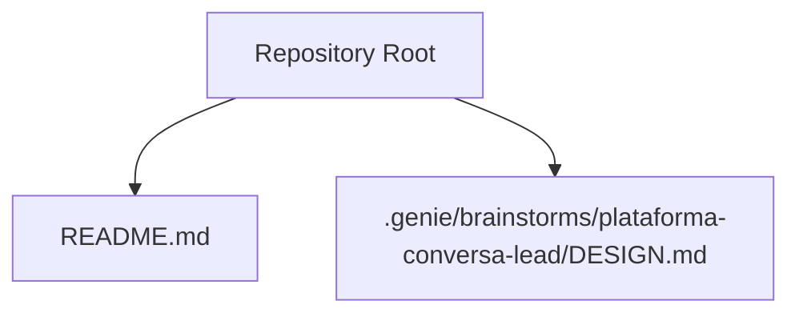
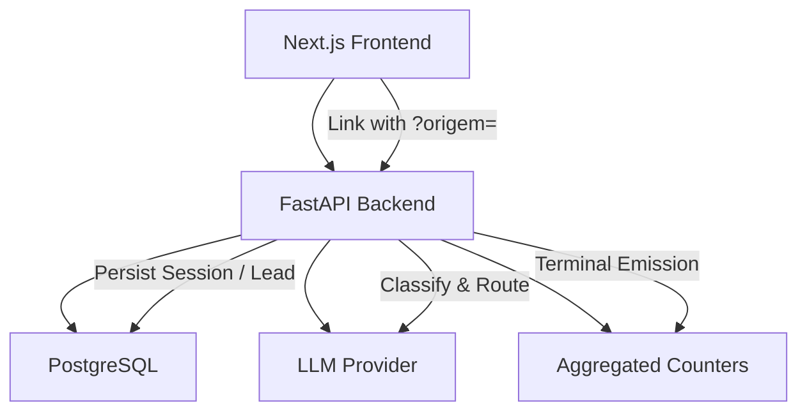
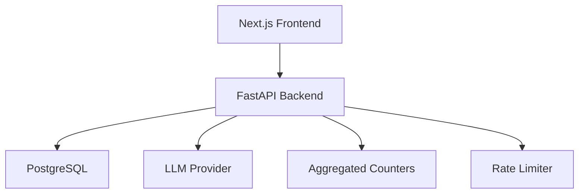

# API Reference

<cite>
**Referenced Files in This Document**
- [README.md](file://README.md)
- [DESIGN.md](file://.genie/brainstorms/plataforma-conversa-lead/DESIGN.md)
</cite>

## Table of Contents
1. Introduction
2. Project Structure
3. Core Components
4. Architecture Overview
5. Detailed Component Analysis
6. Dependency Analysis
7. Performance Considerations
8. Troubleshooting Guide
9. Conclusion

## Introduction
This document provides the API reference for the Sup Better Engine FastAPI backend as described by the project’s design. It covers REST endpoints and WebSocket interactions for session management, message processing, lead qualification, analytics retrieval, authentication considerations, error handling, rate limiting, versioning guidance, common use cases, client implementation guidelines, and performance tips. The backend is designed to work with a Next.js frontend and a Postgres database, focusing on anonymous sessions that can be promoted to durable leads upon consent.

The current repository snapshot contains design documentation and placeholders; no source code files are present yet. Therefore, this API reference is derived from the design specifications and should be treated as authoritative until implementation artifacts are added.

**Section sources**
- [README.md:1-8](file://README.md#L1-L8)
- [DESIGN.md:191-203](file://.genie/brainstorms/plataforma-conversa-lead/DESIGN.md#L191-L203)

## Project Structure
At this stage, the repository includes:
- A README indicating an initial project state
- A design specification under .genie describing the intended architecture and behavior

**Diagram sources**
- [README.md:1-8](file://README.md#L1-L8)
- [DESIGN.md:1-20](file://.genie/brainstorms/plataforma-conversa-lead/DESIGN.md#L1-L20)

**Section sources**
- [README.md:1-8](file://README.md#L1-L8)
- [DESIGN.md:1-20](file://.genie/brainstorms/plataforma-conversa-lead/DESIGN.md#L1-L20)

## Core Components
Based on the design, the FastAPI backend exposes the following functional areas:

- Session Management
  - Create or resume an anonymous session per visit link
  - Track conversation context while anonymous
  - Enforce TTL-based expiration and terminal emissions
  - Promote session to a durable lead upon consent

- Message Processing
  - Classify incoming messages into intent categories
  - Route to handler (qualification) or fallback based on current message intent
  - Maintain per-session counters and enforce message ceilings

- Lead Qualification
  - Capture intent, urgency, fit during qualification flow
  - Trigger contextual email request with consent capture
  - Validate email syntax and blocklist; deduplicate by normalized email

- Analytics Retrieval
  - Provide aggregated counters across dimensions (origin, intent, email state, validity)
  - Weekly snapshots of total valid sessions
  - Operational scalar counters for edge-blocks by IP and day

- Authentication and Tenancy
  - Single tenant pilot configuration
  - No multi-tenant routing at this stage

- Rate Limiting and Quotas
  - Per-IP rate limit (messages per hour)
  - Per-session message ceiling
  - Blocking recorded via operational scalars

- Versioning
  - Not specified in the design; adopt semantic versioning for API surfaces

**Section sources**
- [DESIGN.md:47-166](file://.genie/brainstorms/plataforma-conversa-lead/DESIGN.md#L47-L166)
- [DESIGN.md:191-213](file://.genie/brainstorms/plataforma-conversa-lead/DESIGN.md#L191-L213)
- [DESIGN.md:225-232](file://.genie/brainstorms/plataforma-conversa-lead/DESIGN.md#L225-L232)
- [DESIGN.md:386-415](file://.genie/brainstorms/plataforma-conversa-lead/DESIGN.md#L386-L415)

## Architecture Overview
High-level interaction between components:

**Diagram sources**
- [DESIGN.md:191-213](file://.genie/brainstorms/plataforma-conversa-lead/DESIGN.md#L191-L213)
- [DESIGN.md:225-232](file://.genie/brainstorms/plataforma-conversa-lead/DESIGN.md#L225-L232)
- [DESIGN.md:386-415](file://.genie/brainstorms/plataforma-conversa-lead/DESIGN.md#L386-L415)

## Detailed Component Analysis

### REST Endpoints

#### Sessions
- Purpose: Manage anonymous sessions and promote to leads upon consent.
- Key behaviors:
  - Create/resume session per link visit
  - Store conversation context while anonymous
  - Enforce TTL expiration and terminal emission
  - Promote to lead when consent is given and email validated

- Example endpoints (conceptual):
  - POST /sessions — create or resume session
  - PATCH /sessions/{id} — update session metadata (e.g., origin)
  - DELETE /sessions/{id} — terminate session early (optional)
  - POST /sessions/{id}/promote — promote session to lead with consent

- Request/response schema highlights:
  - Session creation payload: optional origin parameter, device/client hints
  - Promotion payload: normalized email, consent flag, purpose scope
  - Responses: session identifiers, status transitions, errors

- Authentication:
  - Not required for anonymous sessions
  - Promotion may require minimal verification depending on implementation

- Error handling:
  - Invalid input, duplicate promotion attempts, TTL expiry, validation failures

- Rate limiting:
  - Applies per IP and per session ceiling

**Section sources**
- [DESIGN.md:47-116](file://.genie/brainstorms/plataforma-conversa-lead/DESIGN.md#L47-L116)
- [DESIGN.md:191-213](file://.genie/brainstorms/plataforma-conversa-lead/DESIGN.md#L191-L213)
- [DESIGN.md:386-399](file://.genie/brainstorms/plataforma-conversa-lead/DESIGN.md#L386-L399)

#### Messages
- Purpose: Process chat messages, classify intent, route to handlers.
- Key behaviors:
  - Classify message into intent categories
  - Route to qualification handler or graceful fallback
  - Maintain per-turn routing decisions independent of session aggregation

- Example endpoints (conceptual):
  - POST /sessions/{id}/messages — send message and receive response

- Request/response schema highlights:
  - Message payload: text content, turn index
  - Response: agent reply, classification result, routing decision

- Authentication:
  - None for anonymous sessions

- Error handling:
  - Classification errors, handler failures, rate limit exceeded

- Rate limiting:
  - Per IP and per session ceiling enforced

**Section sources**
- [DESIGN.md:53-85](file://.genie/brainstorms/plataforma-conversa-lead/DESIGN.md#L53-L85)
- [DESIGN.md:225-232](file://.genie/brainstorms/plataforma-conversa-lead/DESIGN.md#L225-L232)
- [DESIGN.md:386-399](file://.genie/brainstorms/plataforma-conversa-lead/DESIGN.md#L386-L399)

#### Leads
- Purpose: Manage durable lead records after consent.
- Key behaviors:
  - Deduplicate by normalized email
  - Record consent and purpose scope
  - Support access and deletion requests per policy

- Example endpoints (conceptual):
  - GET /leads?email=... — retrieve lead by normalized email
  - DELETE /leads/{id} — process deletion request

- Request/response schema highlights:
  - Query by normalized email
  - Responses: lead record fields, consent metadata

- Authentication:
  - Admin-only for access/deletion operations

- Error handling:
  - Not found, invalid email, policy constraints

**Section sources**
- [DESIGN.md:99-108](file://.genie/brainstorms/plataforma-conversa-lead/DESIGN.md#L99-L108)
- [DESIGN.md:109-111](file://.genie/brainstorms/plataforma-conversa-lead/DESIGN.md#L109-L111)

#### Analytics
- Purpose: Retrieve aggregated counters and weekly snapshots.
- Key behaviors:
  - Aggregated buckets across origin, intent, email state, validity
  - Weekly scalar snapshot of total valid sessions
  - Operational scalar counters for edge-blocks by IP and day

- Example endpoints (conceptual):
  - GET /analytics/buckets — query aggregated counts
  - GET /analytics/snapshots/weekly — weekly totals
  - GET /analytics/block-scalars — IP/day blocking counters

- Request/response schema highlights:
  - Filters by dimension values
  - Responses: bucket counts, weekly totals, block scalars

- Authentication:
  - Admin-only

- Error handling:
  - Invalid filters, missing data windows

**Section sources**
- [DESIGN.md:127-166](file://.genie/brainstorms/plataforma-conversa-lead/DESIGN.md#L127-L166)
- [DESIGN.md:400-415](file://.genie/brainstorms/plataforma-conversa-lead/DESIGN.md#L400-L415)

### WebSocket APIs
- Purpose: Real-time chat streaming and interactive flows.
- Connection handling:
  - Establish WebSocket per session
  - Authenticate via session identifier if applicable
  - Handle reconnection and backpressure

- Message formats:
  - Client-to-server: message text, turn index, control signals
  - Server-to-client: agent responses, prompts for identification, events

- Event types:
  - message_sent, message_received, classification_result, routing_decision, identification_prompt, session_expired, rate_limited

- Real-time patterns:
  - Streaming responses from LLM
  - Conditional prompts based on classification and turn count
  - Graceful fallback messaging without terminating session

- Authentication:
  - Optional token or session-bound handshake

- Error handling:
  - Network interruptions, rate limits, classification errors

[No sources needed since this section describes conceptual WebSocket behavior aligned with design]

### Authentication Methods
- Anonymous sessions do not require authentication
- Lead management and analytics endpoints may require admin authentication
- Multi-tenancy is out of scope for this fat; single tenant pilot

[No sources needed since this section summarizes design constraints]

### Error Handling Strategies
- Input validation errors return structured error payloads
- Rate limiting returns appropriate status codes and headers
- TTL expiry triggers terminal emissions and session termination
- Classification and handler failures return retryable or non-retryable errors

**Section sources**
- [DESIGN.md:386-399](file://.genie/brainstorms/plataforma-conversa-lead/DESIGN.md#L386-L399)

### Rate Limiting Parameters
- Per IP: messages per hour
- Per session: message ceiling
- Edge blocks: operational scalar counters by IP and day

**Section sources**
- [DESIGN.md:112-123](file://.genie/brainstorms/plataforma-conversa-lead/DESIGN.md#L112-L123)
- [DESIGN.md:159-166](file://.genie/brainstorms/plataforma-conversa-lead/DESIGN.md#L159-L166)
- [DESIGN.md:386-399](file://.genie/brainstorms/plataforma-conversa-lead/DESIGN.md#L386-L399)

### Versioning Information
- Not specified in the design; adopt semantic versioning for API surfaces
- Include version header or path segment for future compatibility

[No sources needed since this section provides general guidance]

### Common Use Cases
- New visitor opens link with attribution parameter
- Anonymous chat begins; messages classified and routed
- Qualification handler captures intent, urgency, fit
- Contextual email request appears after conditions met or turn threshold
- Consent captured; session promoted to durable lead
- Terminal emission updates aggregated counters

**Section sources**
- [DESIGN.md:47-116](file://.genie/brainstorms/plataforma-conversa-lead/DESIGN.md#L47-L116)
- [DESIGN.md:225-232](file://.genie/brainstorms/plataforma-conversa-lead/DESIGN.md#L225-L232)
- [DESIGN.md:386-415](file://.genie/brainstorms/plataforma-conversa-lead/DESIGN.md#L386-L415)

### Client Implementation Guidelines
- Always include attribution parameter for origin tracking
- Handle anonymous session lifecycle and reconnection
- Respect rate limits and backoff strategies
- Implement robust error handling for classification and routing
- Prompt users for email only after qualification conditions or turn threshold
- Normalize emails and handle duplicates gracefully

**Section sources**
- [DESIGN.md:47-116](file://.genie/brainstorms/plataforma-conversa-lead/DESIGN.md#L47-L116)
- [DESIGN.md:386-399](file://.genie/brainstorms/plataforma-conversa-lead/DESIGN.md#L386-L399)

### Performance Optimization Tips
- Stream LLM responses to reduce latency
- Cache classification results where appropriate
- Batch analytics queries for aggregated counters
- Monitor rate limits and adjust thresholds based on pilot data
- Ensure efficient TTL scans for session expiration

[No sources needed since this section provides general guidance]

## Dependency Analysis
Component relationships and dependencies:

**Diagram sources**
- [DESIGN.md:191-213](file://.genie/brainstorms/plataforma-conversa-lead/DESIGN.md#L191-L213)
- [DESIGN.md:225-232](file://.genie/brainstorms/plataforma-conversa-lead/DESIGN.md#L225-L232)
- [DESIGN.md:386-415](file://.genie/brainstorms/plataforma-conversa-lead/DESIGN.md#L386-L415)

**Section sources**
- [DESIGN.md:191-213](file://.genie/brainstorms/plataforma-conversa-lead/DESIGN.md#L191-L213)
- [DESIGN.md:225-232](file://.genie/brainstorms/plataforma-conversa-lead/DESIGN.md#L225-L232)
- [DESIGN.md:386-415](file://.genie/brainstorms/plataforma-conversa-lead/DESIGN.md#L386-L415)

## Performance Considerations
- Design emphasizes lightweight infrastructure for pilot phase
- Sessons stored in Postgres with TTL instead of Redis
- Aggregated counters minimize storage overhead
- Rate limiting protects public LLM endpoint
- Weekly snapshots provide operational metrics without heavy logging

[No sources needed since this section provides general guidance]

## Troubleshooting Guide
Common issues and resolutions:
- Rate limit exceeded: implement exponential backoff and inform user
- Email validation failure: guide user to correct format or domain
- Classification errors: retry with fallback or escalate to human handoff
- Session TTL expiry: ensure terminal emission occurs and notify user
- Duplicate lead creation: normalize email and deduplicate

**Section sources**
- [DESIGN.md:99-108](file://.genie/brainstorms/plataforma-conversa-lead/DESIGN.md#L99-L108)
- [DESIGN.md:386-399](file://.genie/brainstorms/plataforma-conversa-lead/DESIGN.md#L386-L399)

## Conclusion
This API reference outlines the intended FastAPI backend capabilities for session management, message processing, lead qualification, and analytics retrieval as defined by the project’s design. While the repository currently contains only design documentation, these specifications provide a clear blueprint for implementation. Future additions of source code will refine endpoint details, schemas, and integration specifics.

[No sources needed since this section summarizes without analyzing specific files]