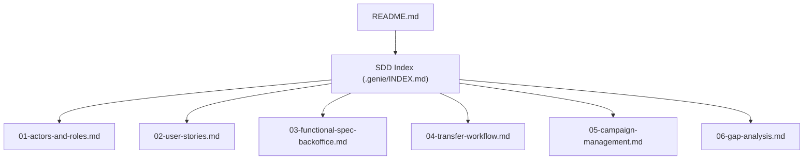
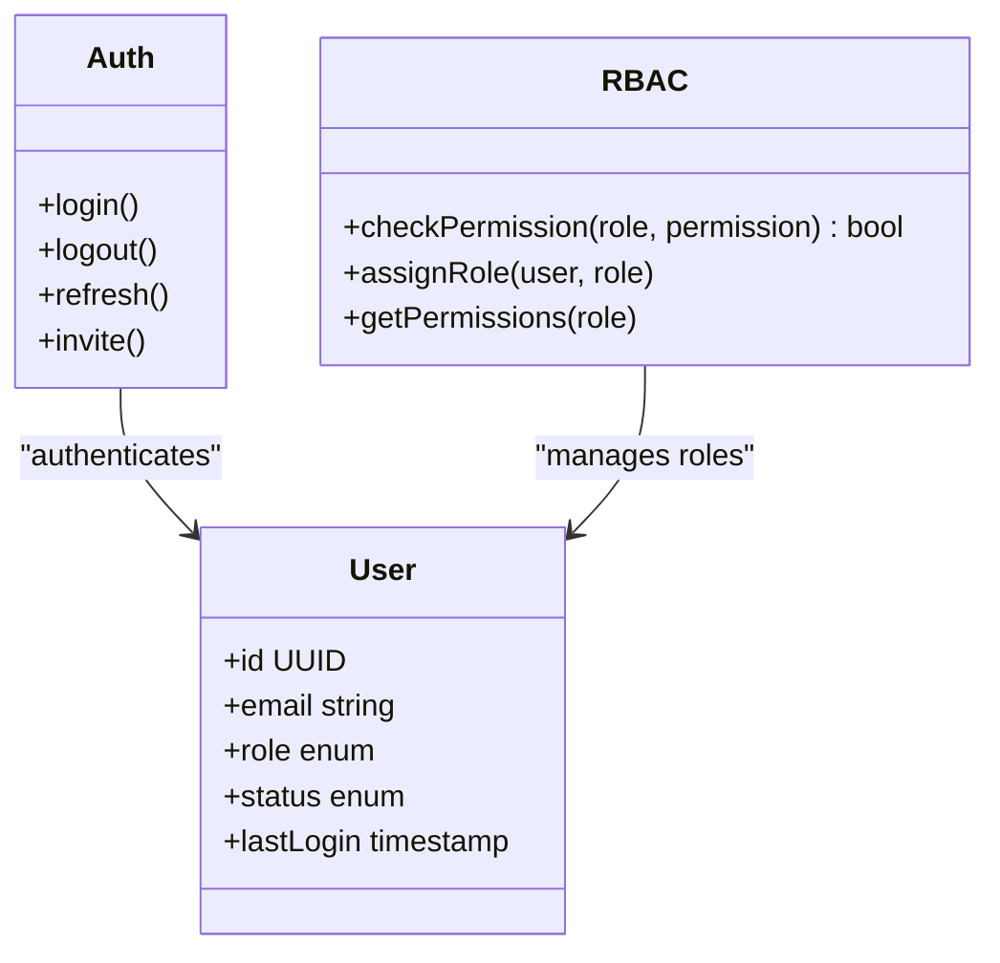
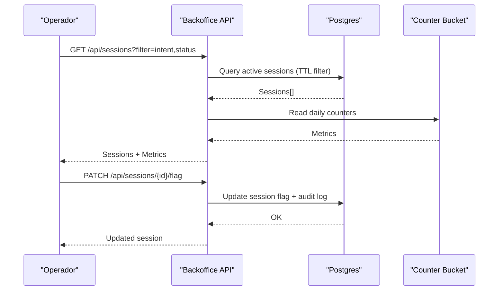
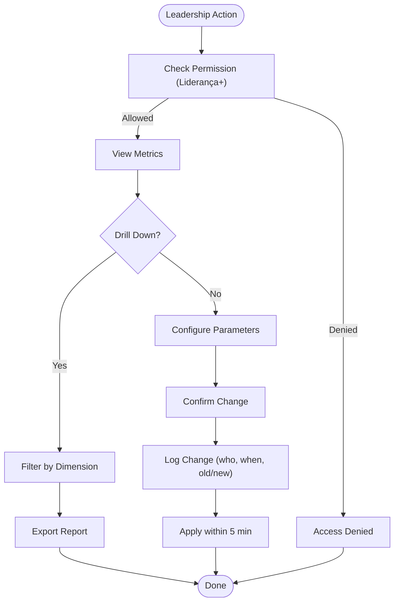
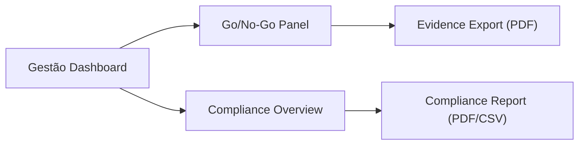
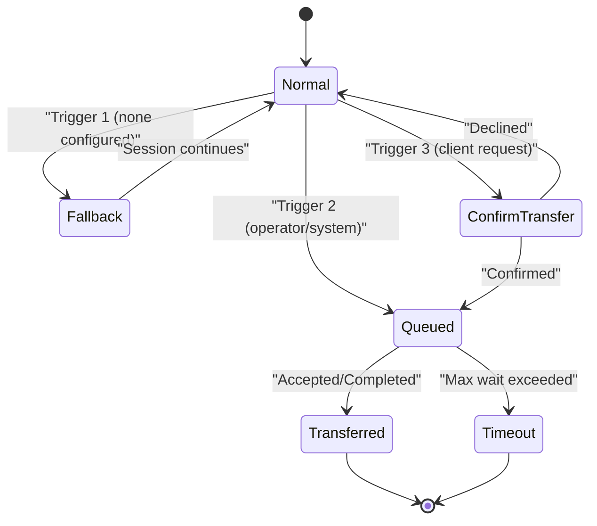
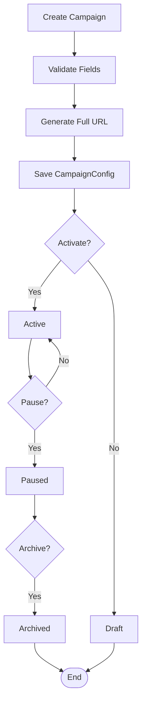
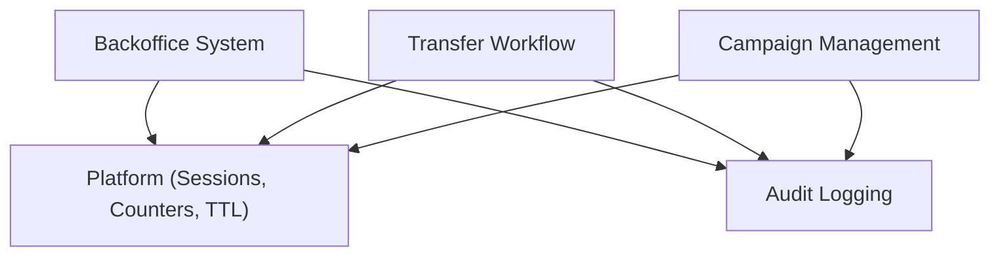

# Backoffice System

<cite>
**Referenced Files in This Document**
- [README.md](file://README.md)
- [01-actors-and-roles.md](file://docs/sdd/01-actors-and-roles.md)
- [02-user-stories.md](file://docs/sdd/02-user-stories.md)
- [03-functional-spec-backoffice.md](file://docs/sdd/03-functional-spec-backoffice.md)
- [04-transfer-workflow.md](file://docs/sdd/04-transfer-workflow.md)
- [05-campaign-management.md](file://docs/sdd/05-campaign-management.md)
- [06-gap-analysis.md](file://docs/sdd/06-gap-analysis.md)
- [INDEX.md](file://.genie/INDEX.md)
</cite>

## Table of Contents
1. [Introduction](#introduction)
2. [Project Structure](#project-structure)
3. [Core Components](#core-components)
4. [Architecture Overview](#architecture-overview)
5. [Detailed Component Analysis](#detailed-component-analysis)
6. [Dependency Analysis](#dependency-analysis)
7. [Performance Considerations](#performance-considerations)
8. [Troubleshooting Guide](#troubleshooting-guide)
9. [Conclusion](#conclusion)
10. [Appendices](#appendices)

## Introduction
This document specifies the Backoffice System for the sup-better-engine platform, focusing on the three-tier internal access model (Operador, Liderança, Gestão), dashboards, authentication and RBAC, audit logging, transfer workflow configuration, and campaign attribution. It synthesizes the SDD documents that bridge DESIGN.md’s single-Tenant scope with workshop-derived operational needs.

The project is in its initial phase; this documentation defines the MVP scope for fatia 1 while deferring advanced features to later phases.

**Section sources**
- [README.md:1-8](file://README.md#L1-L8)
- [INDEX.md:9-20](file://.genie/INDEX.md#L9-L20)

## Project Structure
The repository contains design and specification artifacts organized under docs/sdd, plus a minimal README and genie planning index. The backoffice system is defined across multiple SDD documents covering actors, user stories, functional specs, transfer workflows, campaign management, and gap analysis.



**Diagram sources**
- [README.md:1-8](file://README.md#L1-L8)
- [INDEX.md:9-20](file://.genie/INDEX.md#L9-L20)

**Section sources**
- [README.md:1-8](file://README.md#L1-L8)
- [INDEX.md:9-20](file://.genie/INDEX.md#L9-L20)

## Core Components
- Authentication & RBAC: Email/password login, JWT sessions, role-based permissions for Operador, Liderança, and Gestão.
- Operator Dashboard: Session monitoring, lead review, daily metrics, session flagging and notes.
- Leadership Dashboard: Aggregated performance metrics, parameter configuration, operator management.
- Gestão Dashboard: Go/no-go evidence panel, compliance overview, report export.
- Transfer Workflow Configuration: Three triggers formalized (none configured, operator/system decision, client request), state machine, counters.
- Campaign Management: Minimal fatia 1 campaign config for attribution via ?origem=, link generation, lifecycle states.
- Audit Logging: Immutable logs for administrative actions, retention policy, access controls.

**Section sources**
- [03-functional-spec-backoffice.md:26-82](file://docs/sdd/03-functional-spec-backoffice.md#L26-L82)
- [03-functional-spec-backoffice.md:85-168](file://docs/sdd/03-functional-spec-backoffice.md#L85-L168)
- [03-functional-spec-backoffice.md:170-222](file://docs/sdd/03-functional-spec-backoffice.md#L170-L222)
- [03-functional-spec-backoffice.md:224-260](file://docs/sdd/03-functional-spec-backoffice.md#L224-L260)
- [04-transfer-workflow.md:20-76](file://docs/sdd/04-transfer-workflow.md#L20-L76)
- [04-transfer-workflow.md:195-235](file://docs/sdd/04-transfer-workflow.md#L195-L235)
- [05-campaign-management.md:18-67](file://docs/sdd/05-campaign-management.md#L18-L67)
- [03-functional-spec-backoffice.md:263-281](file://docs/sdd/03-functional-spec-backoffice.md#L263-L281)

## Architecture Overview
High-level architecture shows how clients interact with the agent and how backoffice roles consume data and configure behavior.

```mermaid
graph TB
subgraph "External"
CF["Cliente Final (Lead)"]
end
subgraph "Platform"
Agent["Agente (Classifier + Handlers)"]
Platform["Plataforma (Sessions, Counters, TTL, Rate Limiting)"]
end
subgraph "Backoffice"
Auth["Auth & RBAC"]
OpsDash["Operator Dashboard"]
LeadMgr["Lead Review"]
Metrics["Daily Metrics"]
LdrDash["Leadership Dashboard"]
Config["Parameter Config"]
OpMgmt["Operator Management"]
GestDash["Gestão Dashboard"]
Compliance["Compliance Overview"]
Audit["Audit Log"]
end
CF --> Agent
Agent --> Platform
Platform --> OpsDash
Platform --> LeadMgr
Platform --> Metrics
Platform --> LdrDash
Platform --> GestDash
LdrDash --> Config
LdrDash --> OpMgmt
GestDash --> Compliance
OpsDash --> Audit
LdrDash --> Audit
GestDash --> Audit
```

**Diagram sources**
- [01-actors-and-roles.md:10-30](file://docs/sdd/01-actors-and-roles.md#L10-L30)
- [03-functional-spec-backoffice.md:26-82](file://docs/sdd/03-functional-spec-backoffice.md#L26-L82)
- [03-functional-spec-backoffice.md:85-168](file://docs/sdd/03-functional-spec-backoffice.md#L85-L168)
- [03-functional-spec-backoffice.md:170-222](file://docs/sdd/03-functional-spec-backoffice.md#L170-L222)
- [03-functional-spec-backoffice.md:224-260](file://docs/sdd/03-functional-spec-backoffice.md#L224-L260)
- [03-functional-spec-backoffice.md:263-281](file://docs/sdd/03-functional-spec-backoffice.md#L263-L281)

## Detailed Component Analysis

### Authentication & RBAC
- Authentication: Email + password for fatia 1; JWT with refresh token and 8h TTL.
- RBAC: Three roles with explicit permission sets for sessions, leads, counters, operators, tenant configuration, compliance, and audit.



**Diagram sources**
- [03-functional-spec-backoffice.md:26-82](file://docs/sdd/03-functional-spec-backoffice.md#L26-L82)

**Section sources**
- [03-functional-spec-backoffice.md:26-82](file://docs/sdd/03-functional-spec-backoffice.md#L26-L82)

### Operator Dashboard
- Session Monitor: Real-time list with status, intent, turn count, time active, visual indicators for TTL/turn limits, filtering and sorting.
- Lead Review: Table view with filters, detail view, CSV export, status updates and CRM notes.
- Daily Metrics: Counter dashboard showing sessions today, valid/excluded counts, intent/email distributions.



**Diagram sources**
- [03-functional-spec-backoffice.md:85-168](file://docs/sdd/03-functional-spec-backoffice.md#L85-L168)
- [03-functional-spec-backoffice.md:286-328](file://docs/sdd/03-functional-spec-backoffice.md#L286-L328)

**Section sources**
- [03-functional-spec-backoffice.md:85-168](file://docs/sdd/03-functional-spec-backoffice.md#L85-L168)

### Leadership Dashboard
- Performance Metrics: Weekly/monthly views, trend lines, drill-down by origem/intent/email_state.
- Parameter Configuration: Editable parameters (TTL, rate limits, turn limits, email modal triggers), change management with confirmation, logging, and rollback.
- Operator Management: List, invite, deactivate, role changes.



**Diagram sources**
- [03-functional-spec-backoffice.md:170-222](file://docs/sdd/03-functional-spec-backoffice.md#L170-L222)

**Section sources**
- [03-functional-spec-backoffice.md:170-222](file://docs/sdd/03-functional-spec-backoffice.md#L170-L222)

### Gestão Dashboard
- Go/No-Go Evidence Panel: Criteria display with targets, current values, status indicators, trends, and overall recommendation.
- Compliance Overview: Consent records, deletion requests, retention compliance, LGPD Art. 18 SLA adherence, report export.



**Diagram sources**
- [03-functional-spec-backoffice.md:224-260](file://docs/sdd/03-functional-spec-backoffice.md#L224-L260)

**Section sources**
- [03-functional-spec-backoffice.md:224-260](file://docs/sdd/03-functional-spec-backoffice.md#L224-L260)

### Transfer Workflow
- Configuration Model: Enabled flag, mode selection, fallback message/contact, queue settings, channel settings, client-request handling.
- Triggers:
  - Trigger 1 (None configured): Fallback message, session remains open, counter emitted.
  - Trigger 2 (Operator/System decision): Queue or channel transfer flows, state transitions, counters.
  - Trigger 3 (Client-requested transfer): NLU detection, confirmation, loop prevention.
- State Machine: Normal → Queued → Transferred, with timeouts and abandonment handling.



**Diagram sources**
- [04-transfer-workflow.md:20-76](file://docs/sdd/04-transfer-workflow.md#L20-L76)
- [04-transfer-workflow.md:195-235](file://docs/sdd/04-transfer-workflow.md#L195-L235)

**Section sources**
- [04-transfer-workflow.md:20-76](file://docs/sdd/04-transfer-workflow.md#L20-L76)
- [04-transfer-workflow.md:195-235](file://docs/sdd/04-transfer-workflow.md#L195-L235)

### Campaign Management
- CampaignConfig: id, name, slug, origem_value, base_url, full_url, optional overrides (ttl, turn limit, transfer config), status, created_at/by, metrics.
- Link & Attribution: URL structure with ?origem=, attribution logic, counter bucket impact.
- Lifecycle: Draft → Active → Paused → Archived, with rules for editing and counting.



**Diagram sources**
- [05-campaign-management.md:18-67](file://docs/sdd/05-campaign-management.md#L18-L67)
- [05-campaign-management.md:107-151](file://docs/sdd/05-campaign-management.md#L107-L151)
- [05-campaign-management.md:154-183](file://docs/sdd/05-campaign-management.md#L154-L183)

**Section sources**
- [05-campaign-management.md:18-67](file://docs/sdd/05-campaign-management.md#L18-L67)
- [05-campaign-management.md:107-151](file://docs/sdd/05-campaign-management.md#L107-L151)
- [05-campaign-management.md:154-183](file://docs/sdd/05-campaign-management.md#L154-L183)

### Audit Logging
- Logged Events: Login success/failure, parameter changes, operator CRUD, session flags, exports, role changes.
- Retention: 24 months, immutable, accessible to Liderança and Gestão.

```mermaid
sequenceDiagram
participant Actor as "Actor (Liderança/Gestão)"
participant API as "Backoffice API"
participant Audit as "Audit Log"
Actor->>API : Perform Admin Action
API->>Audit : Append Event (actor, action, timestamp, details)
Audit-->>API : Ack
API-->>Actor : Result
```

**Diagram sources**
- [03-functional-spec-backoffice.md:263-281](file://docs/sdd/03-functional-spec-backoffice.md#L263-L281)

**Section sources**
- [03-functional-spec-backoffice.md:263-281](file://docs/sdd/03-functional-spec-backoffice.md#L263-L281)

## Dependency Analysis
Backoffice components depend on core platform services (sessions, counters, TTL) and external integrations (CRM via CSV export). Transfer and campaign modules extend platform behavior through configuration and attribution.



**Diagram sources**
- [03-functional-spec-backoffice.md:26-82](file://docs/sdd/03-functional-spec-backoffice.md#L26-L82)
- [04-transfer-workflow.md:20-76](file://docs/sdd/04-transfer-workflow.md#L20-L76)
- [05-campaign-management.md:18-67](file://docs/sdd/05-campaign-management.md#L18-L67)
- [03-functional-spec-backoffice.md:263-281](file://docs/sdd/03-functional-spec-backoffice.md#L263-L281)

**Section sources**
- [03-functional-spec-backoffice.md:26-82](file://docs/sdd/03-functional-spec-backoffice.md#L26-L82)
- [04-transfer-workflow.md:20-76](file://docs/sdd/04-transfer-workflow.md#L20-L76)
- [05-campaign-management.md:18-67](file://docs/sdd/05-campaign-management.md#L18-L67)
- [03-functional-spec-backoffice.md:263-281](file://docs/sdd/03-functional-spec-backoffice.md#L263-L281)

## Performance Considerations
- Counter reads use pre-aggregated buckets for fast queries.
- Session reads filtered by TTL to show only active sessions.
- Lead reads indexed by normalized email and created_at.
- Parameter changes take effect within 5 minutes via cache TTL.
- Auto-refresh intervals (e.g., session monitor every 30s) balance real-time visibility with load.

[No sources needed since this section provides general guidance]

## Troubleshooting Guide
Common issues and resolutions:
- Authentication failures: Verify credentials, check session TTL, ensure RBAC permissions are assigned.
- Missing sessions in dashboard: Confirm TTL not expired, verify filters, check database connectivity.
- Parameter changes not applied: Ensure changes logged and cached; reapply within 5-minute window.
- Transfer not triggering: Validate TransferConfig enabled/mode, check trigger phrases and confirmation settings.
- Campaign links not attributing: Ensure ?origem= matches CampaignConfig, verify status is active.

**Section sources**
- [03-functional-spec-backoffice.md:26-82](file://docs/sdd/03-functional-spec-backoffice.md#L26-L82)
- [04-transfer-workflow.md:20-76](file://docs/sdd/04-transfer-workflow.md#L20-L76)
- [05-campaign-management.md:107-151](file://docs/sdd/05-campaign-management.md#L107-L151)

## Conclusion
The Backoffice System introduces a structured, three-tier operational model with clear RBAC, dashboards for each role, configurable transfer workflows, and campaign attribution. Fatia 1 focuses on essential functionality: authentication, dashboards, basic transfer configuration, and campaign link management, while deferring advanced features like live handoff and per-campaign overrides. This foundation enables pilot operations, compliance oversight, and data-driven decisions for future expansion.

[No sources needed since this section summarizes without analyzing specific files]

## Appendices

### API Endpoints Summary
- Authentication: POST /api/auth/login, logout, refresh, invite
- Sessions: GET/PATCH /api/sessions, notes
- Leads: GET/POST /api/leads, export
- Counters: GET /api/counters/daily, weekly, trends
- Configuration: GET/PATCH /api/config/parameters
- Operators: GET/POST/PATCH/DELETE /api/operators
- Compliance: GET/POST /api/compliance/*
- Audit: GET /api/audit/logs

**Section sources**
- [03-functional-spec-backoffice.md:286-328](file://docs/sdd/03-functional-spec-backoffice.md#L286-L328)