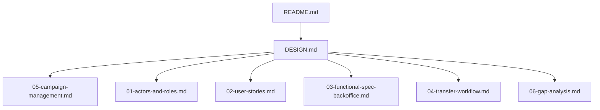
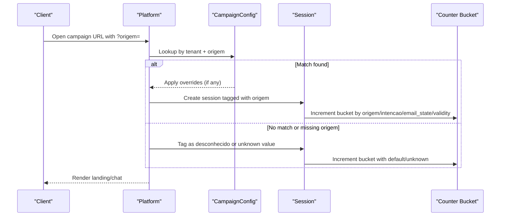
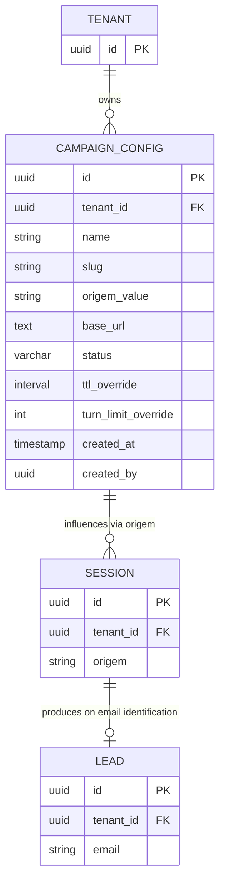
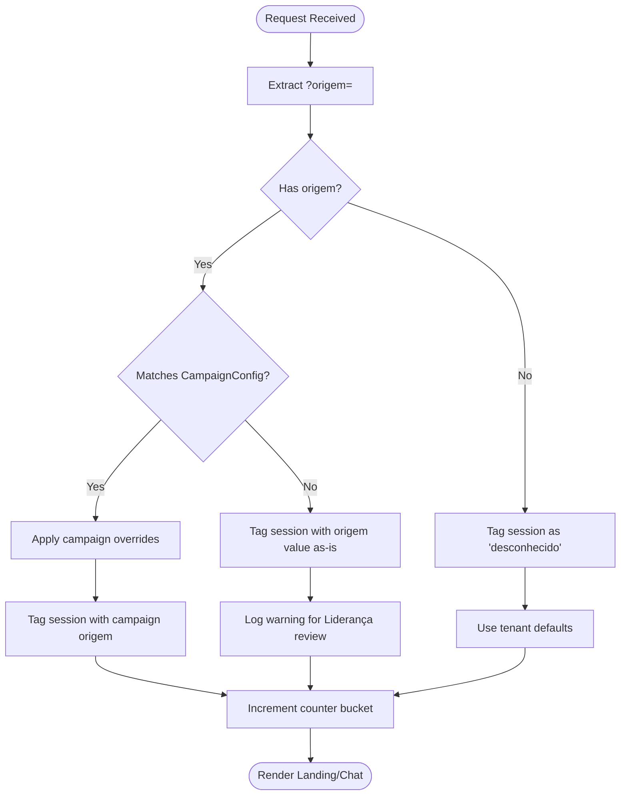
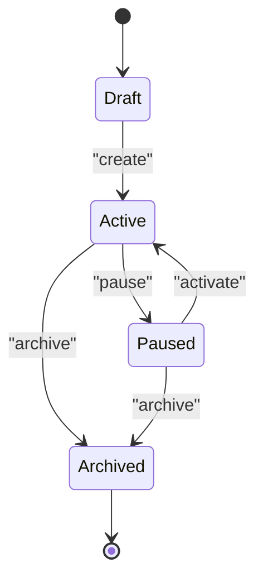
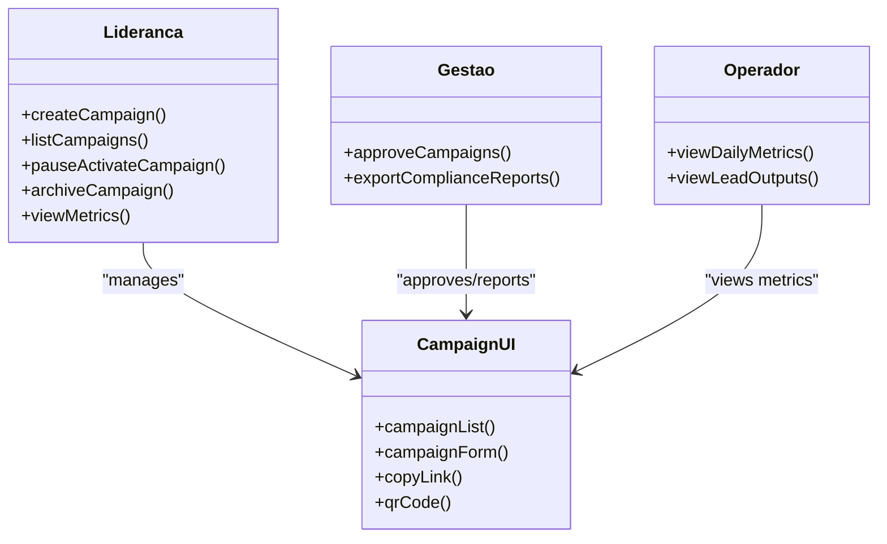
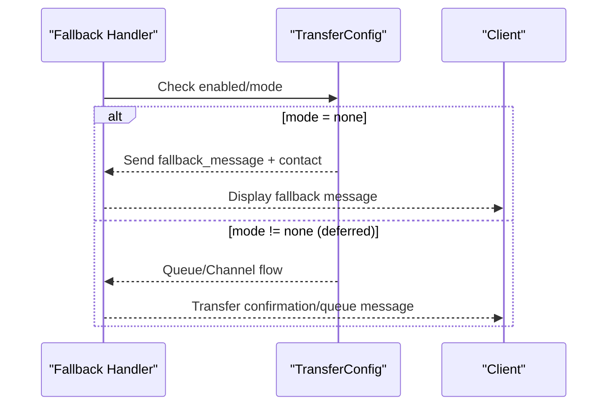
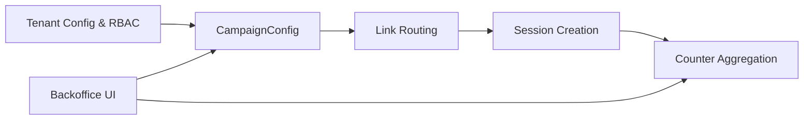

# Campaign Management

<cite>
**Referenced Files in This Document**
- [README.md](file://README.md)
- [DESIGN.md](file://.genie/brainstorms/plataforma-conversa-lead/DESIGN.md)
- [05-campaign-management.md](file://docs/sdd/05-campaign-management.md)
- [01-actors-and-roles.md](file://docs/sdd/01-actors-and-roles.md)
- [02-user-stories.md](file://docs/sdd/02-user-stories.md)
- [03-functional-spec-backoffice.md](file://docs/sdd/03-functional-spec-backoffice.md)
- [04-transfer-workflow.md](file://docs/sdd/04-transfer-workflow.md)
- [06-gap-analysis.md](file://docs/sdd/06-gap-analysis.md)
</cite>

## Table of Contents
1. [Introduction](#introduction)
2. [Project Structure](#project-structure)
3. [Core Components](#core-components)
4. [Architecture Overview](#architecture-overview)
5. [Detailed Component Analysis](#detailed-component-analysis)
6. [Dependency Analysis](#dependency-analysis)
7. [Performance Considerations](#performance-considerations)
8. [Troubleshooting Guide](#troubleshooting-guide)
9. [Conclusion](#conclusion)

## Introduction
This document specifies the Campaign Management capability for fatia 1 of the platform. In this phase, a campaign is not a marketing automation system; it is a labeled link configuration that drives attribution via the URL parameter origem and may influence operational parameters at session creation. The goal is to provide a minimal, auditable surface for creating campaigns, generating full URLs with attribution, listing campaigns with aggregated metrics, and controlling basic lifecycle states (active, paused, archived). Full campaign scheduling, A/B testing, per-campaign transfer overrides, and campaign dispatching are deferred to later phases.

## Project Structure
The repository contains design and specification documents that define the scope, actors, user stories, backoffice capabilities, transfer workflow, and campaign management. The campaign management specification is centered in a dedicated SDD document and cross-references the broader design and backoffice specifications.

**Diagram sources**
- [DESIGN.md:1-500](file://.genie/brainstorms/plataforma-conversa-lead/DESIGN.md#L1-L500)
- [05-campaign-management.md:1-262](file://docs/sdd/05-campaign-management.md#L1-L262)
- [01-actors-and-roles.md:1-100](file://docs/sdd/01-actors-and-roles.md#L1-L100)
- [02-user-stories.md:1-211](file://docs/sdd/02-user-stories.md#L1-L211)
- [03-functional-spec-backoffice.md:1-335](file://docs/sdd/03-functional-spec-backoffice.md#L1-L335)
- [04-transfer-workflow.md:1-295](file://docs/sdd/04-transfer-workflow.md#L1-L295)
- [06-gap-analysis.md:1-248](file://docs/sdd/06-gap-analysis.md#L1-L248)
- [README.md:1-8](file://README.md#L1-L8)

**Section sources**
- [README.md:1-8](file://README.md#L1-L8)
- [DESIGN.md:1-500](file://.genie/brainstorms/plataforma-conversa-lead/DESIGN.md#L1-L500)

## Core Components
- CampaignConfig data model: defines name, slug, attribution value, base URL, optional parameter overrides, status, timestamps, creator, and pre-aggregated metrics.
- Link generation and attribution flow: constructs full URLs with ?origem= and applies campaign-specific overrides when present.
- Counter bucket integration: maps campaign origem values to the counter dimension, enabling per-campaign breakdowns by filtering on origem.
- Lifecycle states: draft, active, paused, archived with rules governing link validity, session counting, and editability.
- Backoffice UI: campaign list, creation form, actions (copy link, pause/activate, archive), and metrics drill-down.
- Data persistence: Postgres schema for campaign_configs with constraints and indexes for fast lookups during session creation.

**Section sources**
- [05-campaign-management.md:18-68](file://docs/sdd/05-campaign-management.md#L18-L68)
- [05-campaign-management.md:107-151](file://docs/sdd/05-campaign-management.md#L107-L151)
- [05-campaign-management.md:154-183](file://docs/sdd/05-campaign-management.md#L154-L183)
- [05-campaign-management.md:226-252](file://docs/sdd/05-campaign-management.md#L226-L252)

## Architecture Overview
Campaign management integrates with the platform’s link routing, session creation, and counter aggregation. When a client opens a campaign link, the platform extracts the origem parameter, matches it against configured campaigns, applies any overrides, tags the session, and increments counters accordingly.

**Diagram sources**
- [05-campaign-management.md:107-151](file://docs/sdd/05-campaign-management.md#L107-L151)
- [05-campaign-management.md:226-252](file://docs/sdd/05-campaign-management.md#L226-L252)

## Detailed Component Analysis

### Campaign Model and Schema
- Fields include id, tenant association, human-readable name, URL-safe slug, attribution value, base URL, full URL, optional TTL and turn limit overrides, optional transfer config override, status, created_at, created_by, and pre-aggregated metrics (total sessions, valid sessions, leads identified).
- Relationships: Tenant owns multiple CampaignConfigs; each campaign influences Sessions via origem matching; Sessions may produce Leads upon email identification.
- Database schema includes constraints (status enum, range checks), unique constraints (tenant-scoped slug and origem_value), and indexes for fast origin lookup and status filtering.

**Diagram sources**
- [05-campaign-management.md:18-68](file://docs/sdd/05-campaign-management.md#L18-L68)
- [05-campaign-management.md:226-252](file://docs/sdd/05-campaign-management.md#L226-L252)

**Section sources**
- [05-campaign-management.md:18-68](file://docs/sdd/05-campaign-management.md#L18-L68)
- [05-campaign-management.md:226-252](file://docs/sdd/05-campaign-management.md#L226-L252)

### Link Generation and Attribution Flow
- URL structure: platform path with tenant slug and query parameter origem set to the campaign’s attribution value.
- Attribution logic:
  - If origem matches a CampaignConfig: apply overrides, tag session, increment counters.
  - If origem is present but unmatched: tag as-is (unknown campaign), log warning for review.
  - If origem is absent: tag as desconhecido, use tenant defaults.
- Counter bucket impact: campanha origem maps directly to the origem dimension; N+1 values allowed where N is number of active campaigns.

**Diagram sources**
- [05-campaign-management.md:107-151](file://docs/sdd/05-campaign-management.md#L107-L151)

**Section sources**
- [05-campaign-management.md:107-151](file://docs/sdd/05-campaign-management.md#L107-L151)

### Campaign Lifecycle
- States: draft, active, paused, archived.
- Rules:
  - Draft to Active: link becomes valid, sessions count under origem.
  - Active to Paused: link deactivated; sessions during pause treated as desconhecido.
  - Active/Paused to Archived: historical counters preserved, link permanently deactivated; cannot reactivate.
  - Editability varies by state (e.g., name-only edits while active).

**Diagram sources**
- [05-campaign-management.md:154-183](file://docs/sdd/05-campaign-management.md#L154-L183)

**Section sources**
- [05-campaign-management.md:154-183](file://docs/sdd/05-campaign-management.md#L154-L183)

### Backoffice Integration and User Stories
- Roles involved: Liderança/Gestão create and manage campaigns; Operador can view metrics read-only.
- UI features:
  - Campaign list with sortable columns and actions (copy link, pause/activate, archive, view metrics).
  - Creation form with validation and generated full URL; copy-to-clipboard and optional QR code.
- User stories related to campaign creation and attribution are included in the broader user stories document.

**Diagram sources**
- [03-functional-spec-backoffice.md:26-82](file://docs/sdd/03-functional-spec-backoffice.md#L26-L82)
- [02-user-stories.md:138-168](file://docs/sdd/02-user-stories.md#L138-L168)
- [05-campaign-management.md:71-104](file://docs/sdd/05-campaign-management.md#L71-L104)

**Section sources**
- [03-functional-spec-backoffice.md:26-82](file://docs/sdd/03-functional-spec-backoffice.md#L26-L82)
- [02-user-stories.md:138-168](file://docs/sdd/02-user-stories.md#L138-L168)
- [05-campaign-management.md:71-104](file://docs/sdd/05-campaign-management.md#L71-L104)

### Transfer Configuration Relationship
- Campaign-level transfer overrides are defined conceptually but deferred for fatia 1; all campaigns share tenant-level transfer configuration.
- Trigger 1 (“Não há”) is implemented as formalized fallback behavior; triggers 2 and 3 are deferred due to live handoff requirements.

**Diagram sources**
- [04-transfer-workflow.md:20-58](file://docs/sdd/04-transfer-workflow.md#L20-L58)
- [04-transfer-workflow.md:80-99](file://docs/sdd/04-transfer-workflow.md#L80-L99)
- [05-campaign-management.md:186-206](file://docs/sdd/05-campaign-management.md#L186-L206)

**Section sources**
- [04-transfer-workflow.md:20-58](file://docs/sdd/04-transfer-workflow.md#L20-L58)
- [04-transfer-workflow.md:80-99](file://docs/sdd/04-transfer-workflow.md#L80-L99)
- [05-campaign-management.md:186-206](file://docs/sdd/05-campaign-management.md#L186-L206)

## Dependency Analysis
Campaign management depends on:
- Tenant configuration and RBAC for access control.
- Link routing and session creation pipeline to capture and tag origem.
- Counter aggregation to attribute sessions and leads to campaigns.
- Backoffice dashboards for campaign management and metrics.

**Diagram sources**
- [01-actors-and-roles.md:1-100](file://docs/sdd/01-actors-and-roles.md#L1-L100)
- [03-functional-spec-backoffice.md:26-82](file://docs/sdd/03-functional-spec-backoffice.md#L26-L82)
- [05-campaign-management.md:107-151](file://docs/sdd/05-campaign-management.md#L107-L151)

**Section sources**
- [01-actors-and-roles.md:1-100](file://docs/sdd/01-actors-and-roles.md#L1-L100)
- [03-functional-spec-backoffice.md:26-82](file://docs/sdd/03-functional-spec-backoffice.md#L26-L82)
- [05-campaign-management.md:107-151](file://docs/sdd/05-campaign-management.md#L107-L151)

## Performance Considerations
- Indexes on campaign_configs (tenant_id + origem_value, tenant_id + status) ensure fast attribution during high-volume session creation.
- Pre-aggregated counters avoid per-session timestamp storage, reducing write load and simplifying queries for campaign metrics.
- Deferring per-campaign parameter overrides reduces complexity and avoids additional lookups in fatia 1.

[No sources needed since this section provides general guidance]

## Troubleshooting Guide
Common issues and resolutions:
- Unknown origem value: sessions tagged as-is; review warnings logged for Liderança to validate campaign configuration.
- Paused campaigns: links return 404 or redirect to tenant default; sessions during pause counted as desconhecido.
- Duplicate origem or slug: prevented by unique constraints; resolve by adjusting campaign names/slugs.
- Metrics discrepancies: verify campaign status and attribution mapping; ensure sessions started after activation.

**Section sources**
- [05-campaign-management.md:121-151](file://docs/sdd/05-campaign-management.md#L121-L151)
- [05-campaign-management.md:177-183](file://docs/sdd/05-campaign-management.md#L177-L183)
- [05-campaign-management.md:226-252](file://docs/sdd/05-campaign-management.md#L226-L252)

## Conclusion
Campaign management in fatia 1 provides a focused, auditable mechanism for labeling links, attributing sessions, and measuring performance through pre-aggregated counters. It supports essential operations like creation, listing, lifecycle control, and link copying, while deferring advanced features such as scheduling, A/B testing, and per-campaign transfer overrides. This approach balances simplicity with the operational needs of the pilot tenant and establishes a foundation for future enhancements.

[No sources needed since this section summarizes without analyzing specific files]