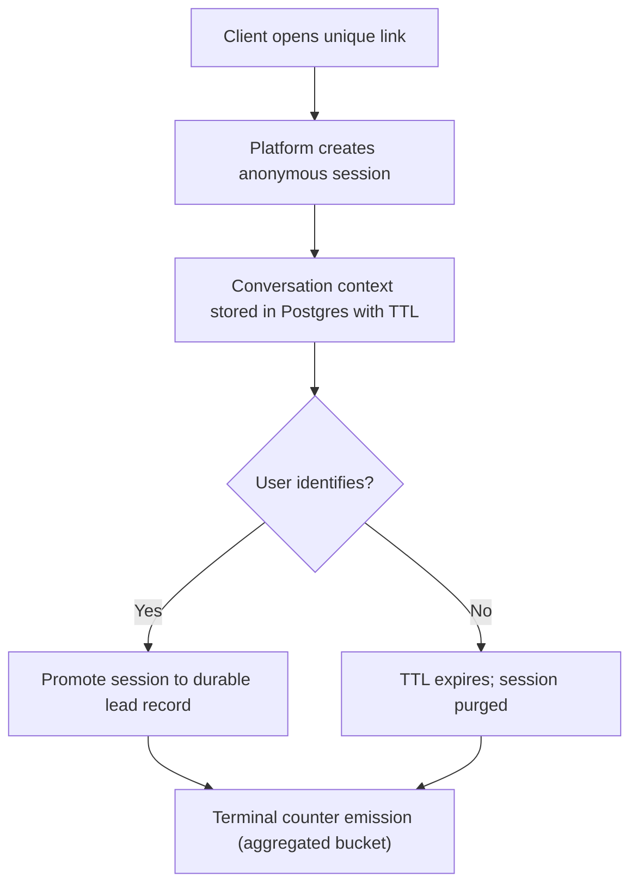
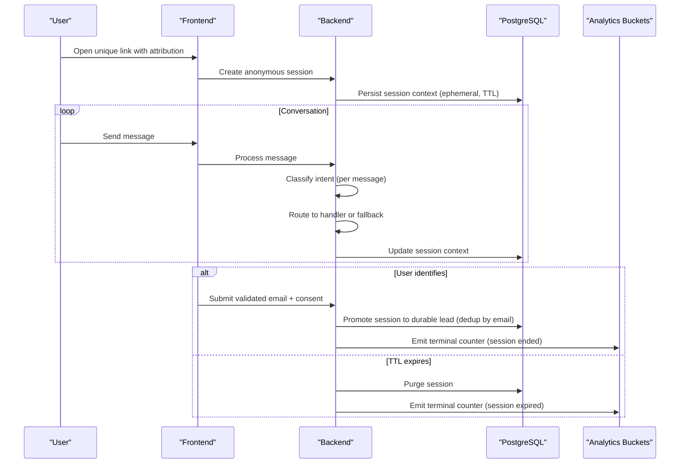
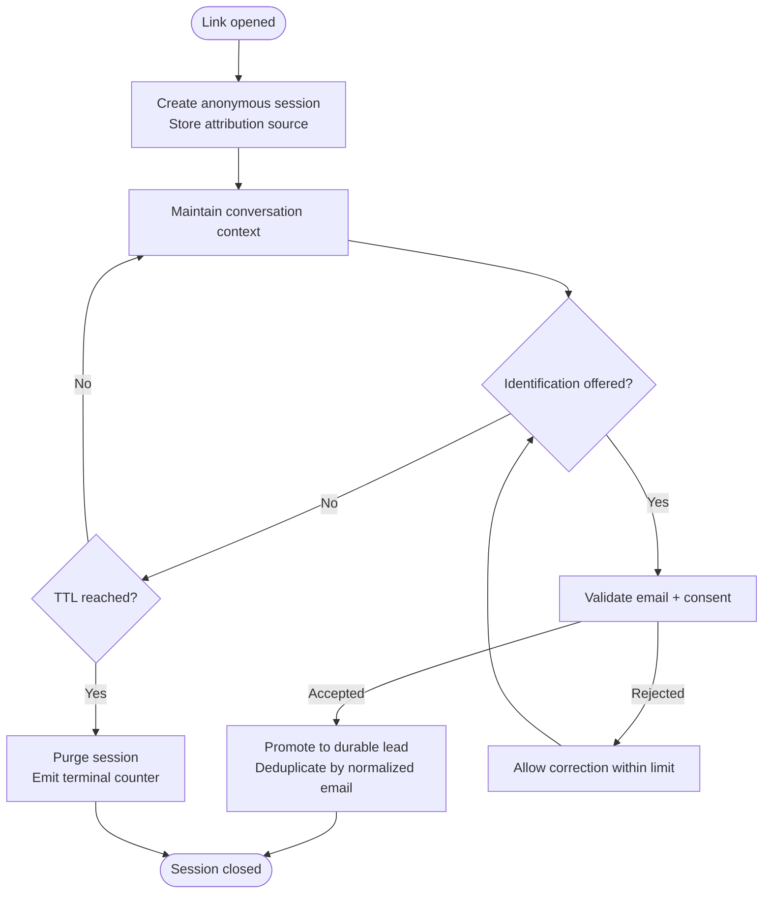
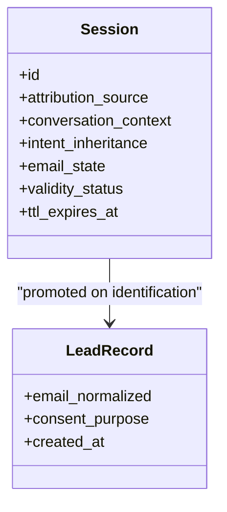
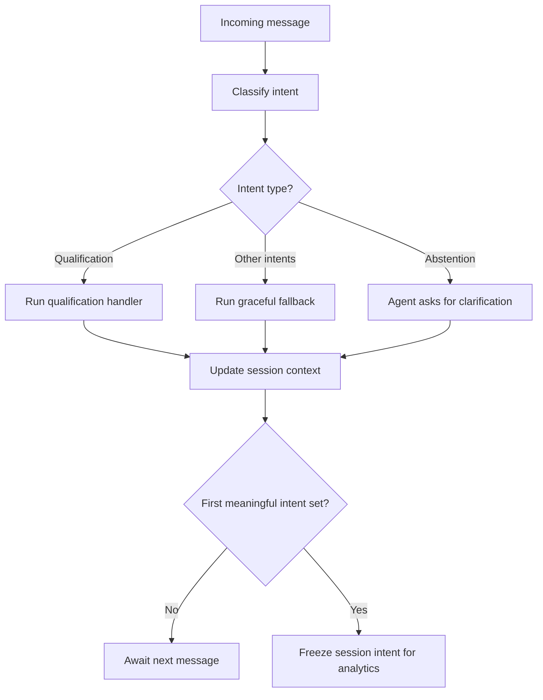
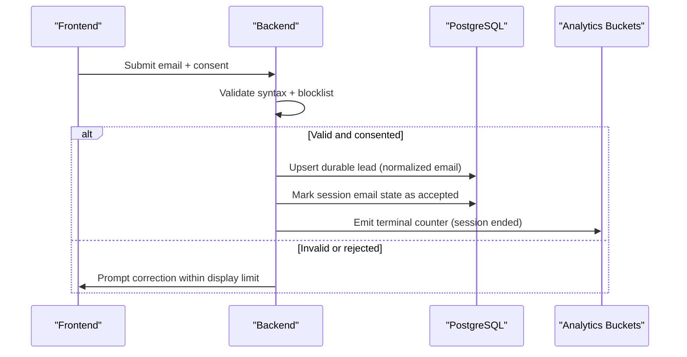
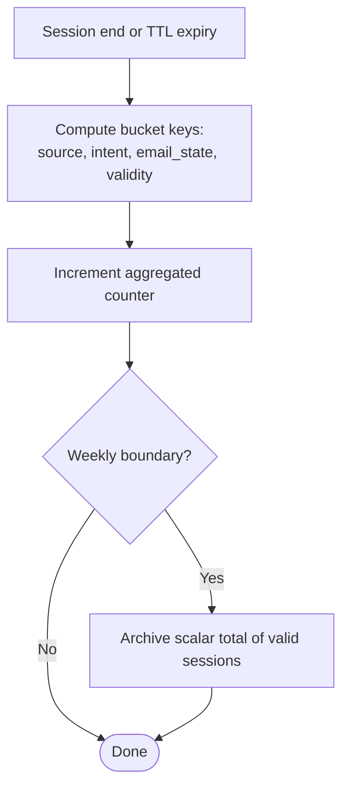
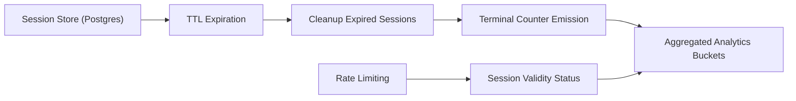

# Anonymous Session Management

<cite>
**Referenced Files in This Document**
- [DESIGN.md](file://.genie/brainstorms/plataforma-conversa-lead/DESIGN.md)
- [01-actors-and-roles.md](file://docs/sdd/01-actors-and-roles.md)
</cite>

## Table of Contents
1. [Introduction](#introduction)
2. [Project Structure](#project-structure)
3. [Core Components](#core-components)
4. [Architecture Overview](#architecture-overview)
5. [Detailed Component Analysis](#detailed-component-analysis)
6. [Dependency Analysis](#dependency-analysis)
7. [Performance Considerations](#performance-considerations)
8. [Troubleshooting Guide](#troubleshooting-guide)
9. [Conclusion](#conclusion)

## Introduction
This document explains the anonymous session management system for the Sup Better Engine lead conversation platform. It covers how sessions are created when users open unique links, how conversations remain anonymous until identification, how intent classification is inherited by the session for analytics, and how PostgreSQL-based ephemeral storage with TTL ensures automatic cleanup. It also documents the promotion from anonymous session to durable lead record upon email submission, and the relationship between session lifecycle events and aggregated, privacy-preserving counters.

## Project Structure
The repository contains design and role documentation that defines the session model, TTL behavior, and analytics aggregation strategy:
- Design specification detailing scope, decisions, and success criteria for anonymous sessions, intent routing, and counter emission.
- Actor and role model describing the platform’s responsibilities around session management, rate limiting, TTL enforcement, and LGPD compliance.

**Diagram sources**
- [DESIGN.md:47-151](file://.genie/brainstorms/plataforma-conversa-lead/DESIGN.md#L47-L151)
- [DESIGN.md:198-213](file://.genie/brainstorms/plataforma-conversa-lead/DESIGN.md#L198-L213)

**Section sources**
- [DESIGN.md:47-151](file://.genie/brainstorms/plataforma-conversa-lead/DESIGN.md#L47-L151)
- [01-actors-and-roles.md:24-30](file://docs/sdd/01-actors-and-roles.md#L24-L30)

## Core Components
- Anonymous session creation on unique link access, carrying attribution source and maintaining conversation context without identifying data.
- Intent classification per message with session-level inheritance for analytics counting.
- PostgreSQL ephemeral session storage with TTL-driven expiration and automatic cleanup.
- Email validation and consent as the gate to identification, promoting the session to a durable lead record.
- Terminal counter emission at session end or TTL expiry, incrementing pre-aggregated buckets without retaining session identifiers.

Key behaviors:
- Sessions start anonymous; identification occurs mid-conversation via a modal triggered under defined conditions.
- Routing is re-evaluated per message; analytics aggregation freezes the session’s intent to the first meaningful label.
- Unidentified sessions are discarded at TTL; identified sessions become durable leads with deduplication by normalized email.

**Section sources**
- [DESIGN.md:47-151](file://.genie/brainstorms/plataforma-conversa-lead/DESIGN.md#L47-L151)
- [DESIGN.md:198-213](file://.genie/brainstorms/plataforma-conversa-lead/DESIGN.md#L198-L213)
- [01-actors-and-roles.md:24-30](file://docs/sdd/01-actors-and-roles.md#L24-L30)

## Architecture Overview
The system uses a lightweight architecture:
- Frontend serves a landing page via a unique link with attribution parameters.
- Backend manages sessions, classifies intents, routes messages, enforces rate limits, and persists ephemeral session state.
- PostgreSQL stores session context with TTL semantics; cleanup removes expired sessions.
- Analytics counters are updated atomically at session termination or TTL expiry using low-cardinality dimensions.

**Diagram sources**
- [DESIGN.md:47-151](file://.genie/brainstorms/plataforma-conversa-lead/DESIGN.md#L47-L151)
- [DESIGN.md:198-213](file://.genie/brainstorms/plataforma-conversa-lead/DESIGN.md#L198-L213)

## Detailed Component Analysis

### Session Creation and Lifecycle
- Unique link opens an anonymous session with attribution source captured from URL parameters.
- Session carries conversation context while the user remains anonymous.
- Identification can be requested mid-conversation based on handler logic and turn thresholds.
- Upon successful email submission with consent, the session is promoted to a durable lead record; otherwise, it remains ephemeral until TTL expiry.

**Diagram sources**
- [DESIGN.md:47-151](file://.genie/brainstorms/plataforma-conversa-lead/DESIGN.md#L47-L151)
- [DESIGN.md:198-213](file://.genie/brainstorms/plataforma-conversa-lead/DESIGN.md#L198-L213)

**Section sources**
- [DESIGN.md:47-151](file://.genie/brainstorms/plataforma-conversa-lead/DESIGN.md#L47-L151)
- [DESIGN.md:198-213](file://.genie/brainstorms/plataforma-conversa-lead/DESIGN.md#L198-L213)

### PostgreSQL Ephemeral Storage and TTL
- Anonymous sessions are stored in PostgreSQL rather than Redis to avoid operational overhead for the pilot tenant.
- Each session row holds conversation context and metadata required for analytics emission.
- TTL governs both retention and cleanup: expired sessions are purged along with transcripts.
- Cleanup is tied to TTL expiration; sessions that do not identify are discarded automatically.

**Diagram sources**
- [DESIGN.md:198-213](file://.genie/brainstorms/plataforma-conversa-lead/DESIGN.md#L198-L213)
- [DESIGN.md:47-151](file://.genie/brainstorms/plataforma-conversa-lead/DESIGN.md#L47-L151)

**Section sources**
- [DESIGN.md:198-213](file://.genie/brainstorms/plataforma-conversa-lead/DESIGN.md#L198-L213)
- [DESIGN.md:47-151](file://.genie/brainstorms/plataforma-conversa-lead/DESIGN.md#L47-L151)

### Intent Classification and Analytics Inheritance
- Each message is classified into one of several intents, including an explicit abstention value for greetings or non-intentional input.
- Routing is evaluated per message: qualifying intent triggers the real handler; other intents route to a graceful fallback; abstention prompts clarification without invoking handlers.
- For analytics, the session inherits the first meaningful intent label (non-abstention). If no meaningful label is produced, the session remains abstained.
- This separation prevents error composition across turns and stabilizes metrics while preserving dynamic routing behavior.

**Diagram sources**
- [DESIGN.md:47-151](file://.genie/brainstorms/plataforma-conversa-lead/DESIGN.md#L47-L151)

**Section sources**
- [DESIGN.md:47-151](file://.genie/brainstorms/plataforma-conversa-lead/DESIGN.md#L47-L151)

### Email Validation, Consent, and Promotion to Durable Lead
- Email validation includes syntax checks and blocklist filtering for disposable domains.
- Consent is collected inline with the submission action; marketing consent is out of scope for this slice.
- Upon acceptance, the session is promoted to a durable lead record with normalized email deduplication and recorded consent purpose.
- The monotonic email state field captures the maximum achieved state during the session, ensuring consistency between metrics and durable records.

**Diagram sources**
- [DESIGN.md:47-151](file://.genie/brainstorms/plataforma-conversa-lead/DESIGN.md#L47-L151)
- [DESIGN.md:198-213](file://.genie/brainstorms/plataforma-conversa-lead/DESIGN.md#L198-L213)

**Section sources**
- [DESIGN.md:47-151](file://.genie/brainstorms/plataforma-conversa-lead/DESIGN.md#L47-L151)
- [DESIGN.md:198-213](file://.genie/brainstorms/plataforma-conversa-lead/DESIGN.md#L198-L213)

### Terminal Counter Emission and Aggregation
- At session end or TTL expiry, a single terminal counter emission increments a pre-aggregated bucket keyed by low-cardinality dimensions: attribution source, intent, email state, and validity status.
- No session identifier or per-session timestamp is retained; only the aggregated counter is persisted.
- Weekly snapshots archive a scalar total of valid sessions to derive weekly counts without exposing per-session detail.

**Diagram sources**
- [DESIGN.md:47-151](file://.genie/brainstorms/plataforma-conversa-lead/DESIGN.md#L47-L151)
- [DESIGN.md:198-213](file://.genie/brainstorms/plataforma-conversa-lead/DESIGN.md#L198-L213)

**Section sources**
- [DESIGN.md:47-151](file://.genie/brainstorms/plataforma-conversa-lead/DESIGN.md#L47-L151)
- [DESIGN.md:198-213](file://.genie/brainstorms/plataforma-conversa-lead/DESIGN.md#L198-L213)

## Dependency Analysis
- The platform depends on PostgreSQL for ephemeral session storage and TTL-driven cleanup.
- Analytics depend on terminal emissions at session boundaries to maintain accurate denominators without tracking individuals.
- Rate limiting protects the LLM endpoint and influences session validity status, which affects analytics buckets.

**Diagram sources**
- [DESIGN.md:47-151](file://.genie/brainstorms/plataforma-conversa-lead/DESIGN.md#L47-L151)
- [DESIGN.md:198-213](file://.genie/brainstorms/plataforma-conversa-lead/DESIGN.md#L198-L213)

**Section sources**
- [DESIGN.md:47-151](file://.genie/brainstorms/plataforma-conversa-lead/DESIGN.md#L47-L151)
- [DESIGN.md:198-213](file://.genie/brainstorms/plataforma-conversa-lead/DESIGN.md#L198-L213)

## Performance Considerations
- Using PostgreSQL for ephemeral sessions avoids additional operational services while supporting TTL-based cleanup suitable for the pilot scale.
- Per-message classification and routing ensure responsive interactions; session-level intent freezing stabilizes analytics without impacting runtime performance.
- Pre-aggregated counters reduce write amplification and preserve privacy by avoiding per-session logs.
- Rate limiting caps resource usage and protects backend endpoints.

[No sources needed since this section provides general guidance]

## Troubleshooting Guide
Common issues and resolutions:
- Session not persisting context: verify PostgreSQL connectivity and TTL configuration; ensure session rows are being written and updated during conversation.
- TTL not expiring: confirm TTL settings and cleanup processes; validate that expired sessions are purged and terminal counters emitted.
- Email validation failures: check syntax rules and blocklist configuration; ensure retry flows allow corrections within display limits.
- Analytics discrepancies: confirm terminal emissions occur on both normal closure and TTL expiry; verify bucket keys reflect correct attribution, intent inheritance, email state, and validity status.

**Section sources**
- [DESIGN.md:47-151](file://.genie/brainstorms/plataforma-conversa-lead/DESIGN.md#L47-L151)
- [DESIGN.md:198-213](file://.genie/brainstorms/plataforma-conversa-lead/DESIGN.md#L198-L213)

## Conclusion
The anonymous session management system balances privacy, usability, and analytics integrity. Sessions begin anonymously, maintain conversation context, and inherit intent for measurement while allowing dynamic routing. PostgreSQL-backed ephemeral storage with TTL ensures automatic cleanup, and identification promotes sessions to durable lead records with robust deduplication. Terminal counter emissions provide aggregated insights without retaining individual identifiers, aligning with privacy requirements and pilot-scale operations.

[No sources needed since this section summarizes without analyzing specific files]