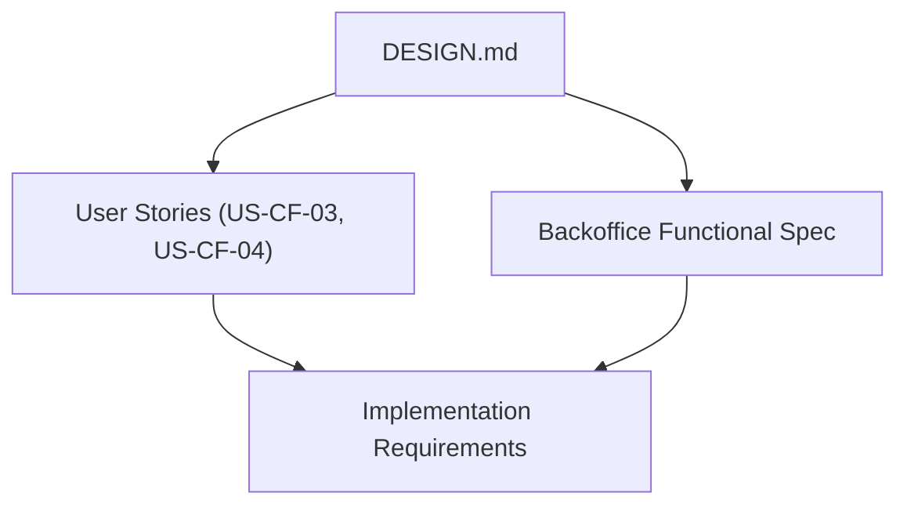
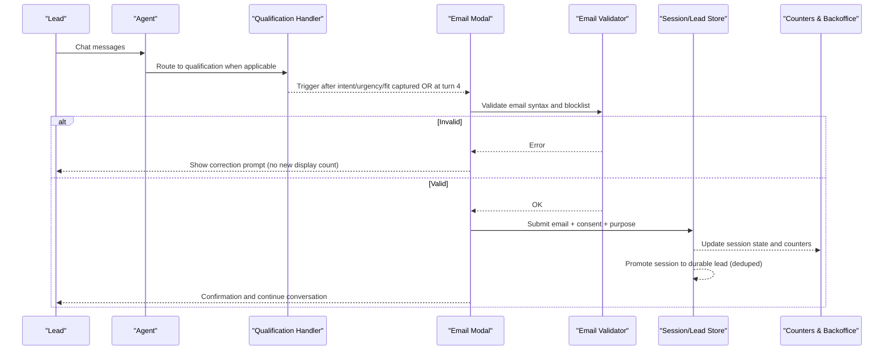
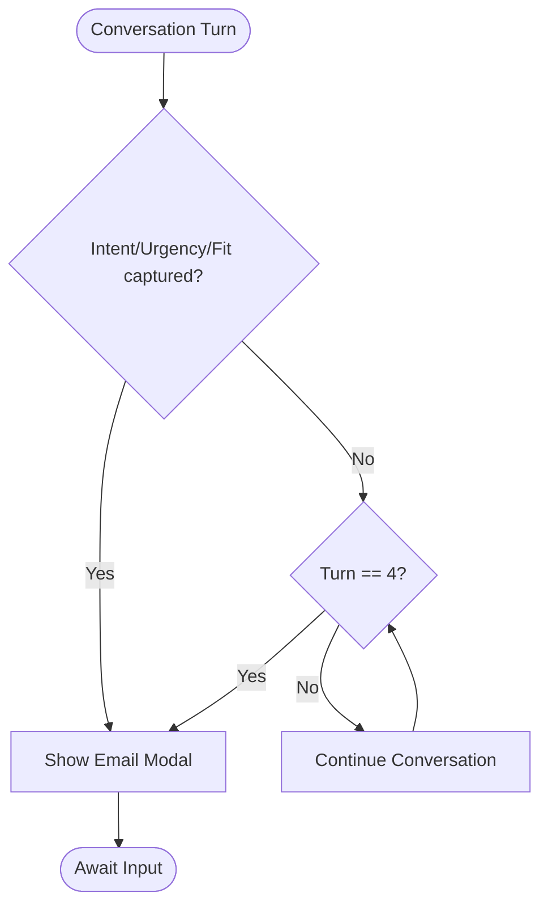
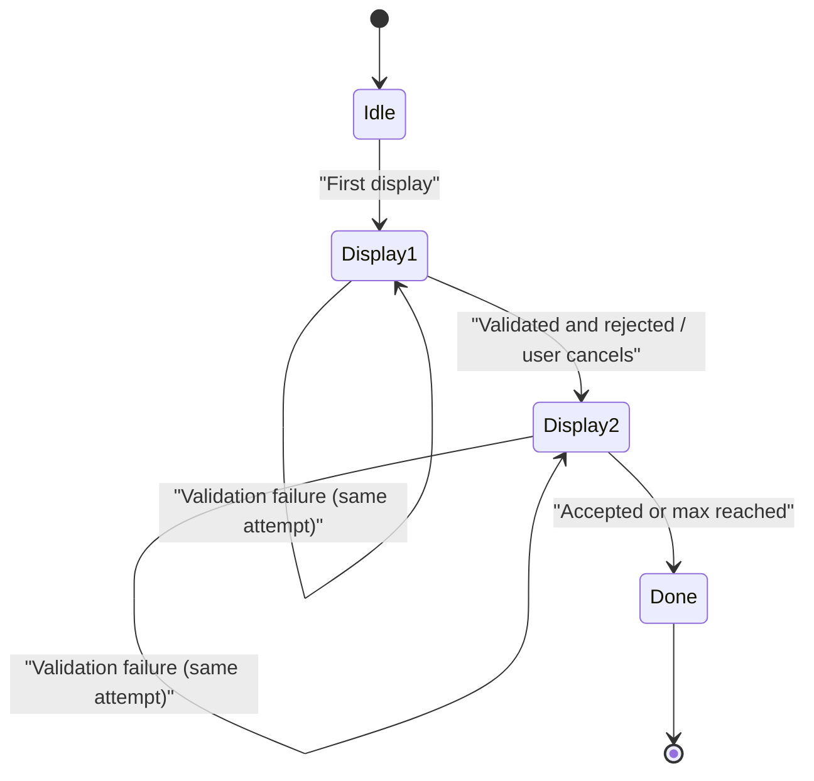
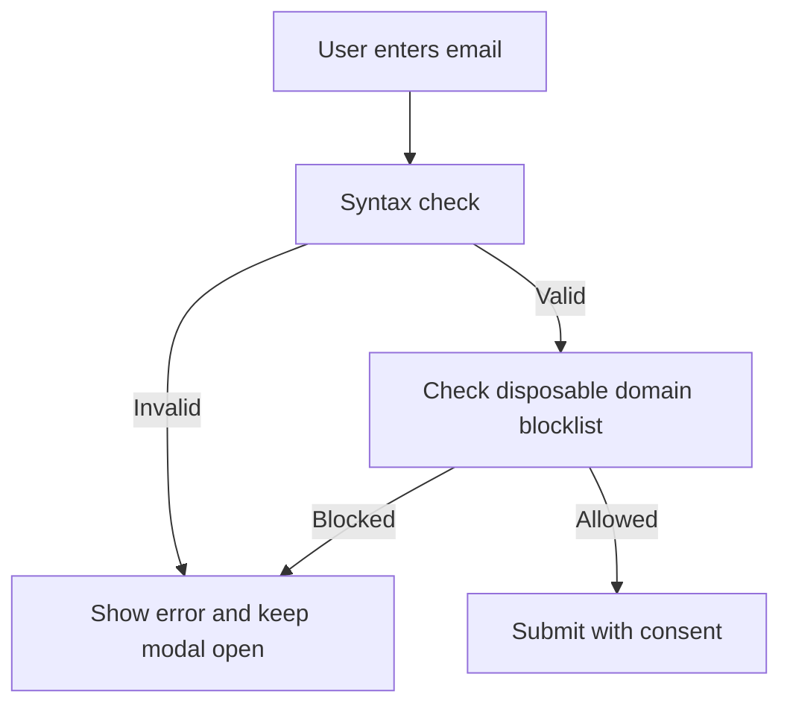
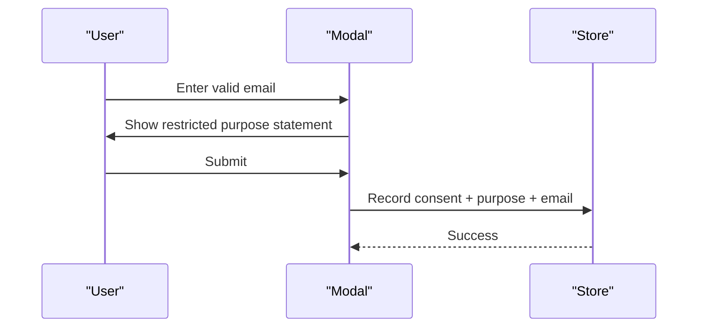
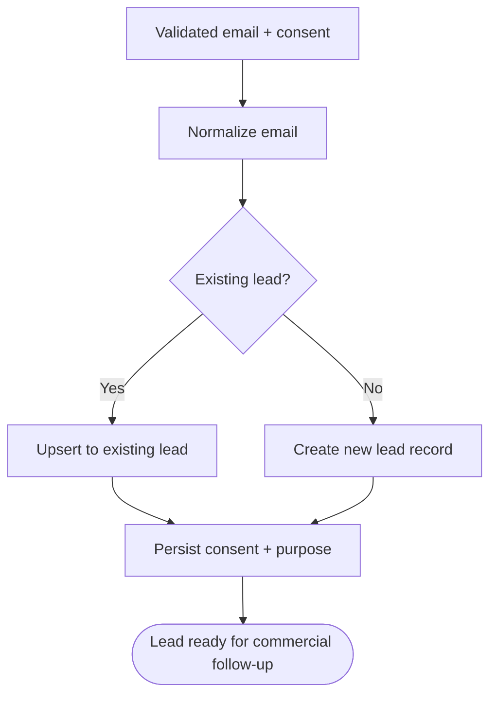
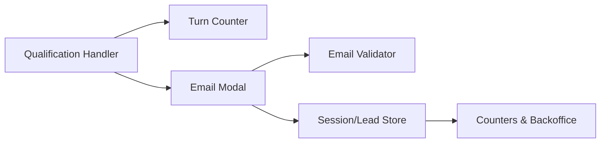

# Contextual Email Collection Modal

<cite>
**Referenced Files in This Document**
- [DESIGN.md](file://.genie/brainstorms/plataforma-conversa-lead/DESIGN.md)
- [02-user-stories.md](file://docs/sdd/02-user-stories.md)
- [03-functional-spec-backoffice.md](file://docs/sdd/03-functional-spec-backoffice.md)
</cite>

## Table of Contents
1. Introduction
2. Project Structure
3. Core Components
4. Architecture Overview
5. Detailed Component Analysis
6. Dependency Analysis
7. Performance Considerations
8. Troubleshooting Guide
9. Conclusion
10. Appendices

## Introduction
This document specifies the contextual email collection modal that appears mid-conversation to identify a lead and capture consent for commercial follow-up. It covers when the modal triggers, how many times it can display per session, validation rules, consent handling, promotion to durable lead records, and GDPR/LGPD compliance aspects including consent recording and data retention policies.

## Project Structure
The relevant behavior is defined in design and specification documents:
- Design decisions and scope define the trigger conditions, display limits, validation, consent, and promotion to leads.
- User stories translate these requirements into acceptance criteria for implementation.
- Backoffice functional spec defines related metrics, parameters, and auditability.

**Diagram sources**
- [DESIGN.md:86-108](file://.genie/brainstorms/plataforma-conversa-lead/DESIGN.md#L86-L108)
- [02-user-stories.md:28-45](file://docs/sdd/02-user-stories.md#L28-L45)
- [03-functional-spec-backoffice.md:192-210](file://docs/sdd/03-functional-spec-backoffice.md#L192-L210)

**Section sources**
- [DESIGN.md:86-108](file://.genie/brainstorms/plataforma-conversa-lead/DESIGN.md#L86-L108)
- [02-user-stories.md:28-45](file://docs/sdd/02-user-stories.md#L28-L45)
- [03-functional-spec-backoffice.md:192-210](file://docs/sdd/03-functional-spec-backoffice.md#L192-L210)

## Core Components
- Trigger logic: The modal is triggered by the qualification handler after capturing intent, urgency, and fit, or at turn 4 if qualification has not converged earlier.
- Display limit: Maximum two displays per session. Validation failures reopen the same screen without counting as a new display.
- Validation: Syntax check plus disposable domain blocklist; no email confirmation code.
- Consent: Restricted purpose declared next to the submit button; sending the email is the explicit consent act. No marketing consent collected in this slice.
- Promotion: On successful submission, the session is promoted to a durable lead record, deduplicated by normalized email (trim + lowercase), with consent and purpose recorded.

**Section sources**
- [DESIGN.md:86-108](file://.genie/brainstorms/plataforma-conversa-lead/DESIGN.md#L86-L108)
- [DESIGN.md:354-358](file://.genie/brainstorms/plataforma-conversa-lead/DESIGN.md#L354-L358)
- [02-user-stories.md:28-45](file://docs/sdd/02-user-stories.md#L28-L45)

## Architecture Overview
The modal integrates with the conversation flow and backoffice metrics:

**Diagram sources**
- [DESIGN.md:86-108](file://.genie/brainstorms/plataforma-conversa-lead/DESIGN.md#L86-L108)
- [DESIGN.md:354-358](file://.genie/brainstorms/plataforma-conversa-lead/DESIGN.md#L354-L358)
- [02-user-stories.md:28-45](file://docs/sdd/02-user-stories.md#L28-L45)

## Detailed Component Analysis

### Trigger Conditions
- Primary trigger: After the qualification handler captures intent, urgency, and fit.
- Fallback trigger: At turn 4 if qualification has not converged earlier, ensuring every session receives at least one identification request.
- Source of truth: The modal is triggered only by the qualification handler; fallback conversations do not request email.

**Diagram sources**
- [DESIGN.md:86-98](file://.genie/brainstorms/plataforma-conversa-lead/DESIGN.md#L86-L98)
- [02-user-stories.md:28-36](file://docs/sdd/02-user-stories.md#L28-L36)

**Section sources**
- [DESIGN.md:86-98](file://.genie/brainstorms/plataforma-conversa-lead/DESIGN.md#L86-L98)
- [02-user-stories.md:28-36](file://docs/sdd/02-user-stories.md#L28-L36)

### Display Limit and Retry Behavior
- Maximum two displays per session.
- If validation fails, the same screen reopens for correction; this does not count as a new display.
- This rule stabilizes the meaning of “requested but not sent” states and prevents infinite loops.

**Diagram sources**
- [DESIGN.md:95-98](file://.genie/brainstorms/plataforma-conversa-lead/DESIGN.md#L95-L98)

**Section sources**
- [DESIGN.md:95-98](file://.genie/brainstorms/plataforma-conversa-lead/DESIGN.md#L95-L98)

### Email Validation Process
- Syntax checking on input.
- Disposable domain blocklist enforced.
- No email ownership confirmation code is required in this slice.

**Diagram sources**
- [DESIGN.md:99-100](file://.genie/brainstorms/plataforma-conversa-lead/DESIGN.md#L99-L100)
- [DESIGN.md:354-355](file://.genie/brainstorms/plataforma-conversa-lead/DESIGN.md#L354-L355)

**Section sources**
- [DESIGN.md:99-100](file://.genie/brainstorms/plataforma-conversa-lead/DESIGN.md#L99-L100)
- [DESIGN.md:354-355](file://.genie/brainstorms/plataforma-conversa-lead/DESIGN.md#L354-L355)

### Consent Management
- Purpose is restricted to commercial follow-up about the current conversation.
- The modal text declares the purpose next to the submit button.
- Sending the email is the explicit consent act; there is no separate checkbox.
- Marketing consent is not collected in this slice.

**Diagram sources**
- [DESIGN.md:101-108](file://.genie/brainstorms/plataforma-conversa-lead/DESIGN.md#L101-L108)
- [02-user-stories.md:38-45](file://docs/sdd/02-user-stories.md#L38-L45)

**Section sources**
- [DESIGN.md:101-108](file://.genie/brainstorms/plataforma-conversa-lead/DESIGN.md#L101-L108)
- [02-user-stories.md:38-45](file://docs/sdd/02-user-stories.md#L38-L45)

### Promotion to Durable Lead Records
- On successful submission, the session is promoted to a durable lead.
- Deduplication uses normalized email (trim + lowercase).
- Consent and purpose are recorded with the lead.

**Diagram sources**
- [DESIGN.md:107-108](file://.genie/brainstorms/plataforma-conversa-lead/DESIGN.md#L107-L108)
- [DESIGN.md:354-358](file://.genie/brainstorms/plataforma-conversa-lead/DESIGN.md#L354-L358)

**Section sources**
- [DESIGN.md:107-108](file://.genie/brainstorms/plataforma-conversa-lead/DESIGN.md#L107-L108)
- [DESIGN.md:354-358](file://.genie/brainstorms/plataforma-conversa-lead/DESIGN.md#L354-L358)

### Practical Scenarios
- Early conversion: Qualification captures intent/urgency/fit by turn 2 → modal appears immediately; user submits → lead created.
- Late trigger: Qualification stalls → modal appears at turn 4; user corrects invalid email twice within the same attempt → still counts as one display; third attempt may be blocked by max displays.
- Rejection path: User refuses or provides invalid email repeatedly → session remains unconverted; counters reflect “requested but not sent” or “rejected”.

[No sources needed since this section summarizes scenarios already sourced above]

## Dependency Analysis
- The modal depends on:
  - Qualification handler output (intent, urgency, fit).
  - Session turn counter (for turn-4 fallback).
  - Email validator (syntax + disposable domain blocklist).
  - Storage layer (session TTL, durable lead creation, consent recording).
  - Counters/backoffice for state tracking and reporting.

**Diagram sources**
- [DESIGN.md:86-108](file://.genie/brainstorms/plataforma-conversa-lead/DESIGN.md#L86-L108)
- [03-functional-spec-backoffice.md:192-210](file://docs/sdd/03-functional-spec-backoffice.md#L192-L210)

**Section sources**
- [DESIGN.md:86-108](file://.genie/brainstorms/plataforma-conversa-lead/DESIGN.md#L86-L108)
- [03-functional-spec-backoffice.md:192-210](file://docs/sdd/03-functional-spec-backoffice.md#L192-L210)

## Performance Considerations
- Keep modal rendering lightweight; avoid blocking network calls during validation where possible.
- Cache disposable domain blocklist locally or via short-TTL cache to minimize latency.
- Normalize emails server-side before storage to prevent duplicates and reduce write amplification.
- Ensure counters update asynchronously to avoid impacting chat responsiveness.

[No sources needed since this section provides general guidance]

## Troubleshooting Guide
- Modal never appears:
  - Verify qualification handler successfully captured intent, urgency, and fit.
  - Confirm turn-4 fallback is enabled and turn counting is accurate.
- Modal shows too often:
  - Ensure validation failures reopen the same screen without incrementing display count.
  - Enforce maximum two displays per session.
- Emails accepted but no lead created:
  - Check normalization (trim + lowercase) and dedup logic.
  - Confirm consent and purpose are persisted with the lead.
- Compliance issues:
  - Ensure restricted purpose is displayed and consent is recorded upon submission.
  - Verify data retention policy: anonymous sessions are discarded at TTL; only identified leads persist with consent.

**Section sources**
- [DESIGN.md:86-108](file://.genie/brainstorms/plataforma-conversa-lead/DESIGN.md#L86-L108)
- [DESIGN.md:354-358](file://.genie/brainstorms/plataforma-conversa-lead/DESIGN.md#L354-L358)

## Conclusion
The contextual email modal is designed to collect identification at the right moment, with strict validation, clear consent, and durable lead promotion. Its trigger logic balances early capture with a turn-4 safety net, while limiting displays to protect user experience. Compliance is embedded through restricted-purpose consent and retention-aware design.

[No sources needed since this section summarizes without analyzing specific files]

## Appendices

### GDPR/LGPD Compliance Notes
- Legal basis: Explicit consent via submission action with restricted purpose.
- Transparency: Purpose clearly stated next to the submit control.
- Rights: Manual runbook exists for access/deletion requests (Art. 18).
- Retention: Anonymous sessions are discarded at TTL; only identified leads persist with consent recorded.

**Section sources**
- [DESIGN.md:101-108](file://.genie/brainstorms/plataforma-conversa-lead/DESIGN.md#L101-L108)
- [DESIGN.md:354-358](file://.genie/brainstorms/plataforma-conversa-lead/DESIGN.md#L354-L358)