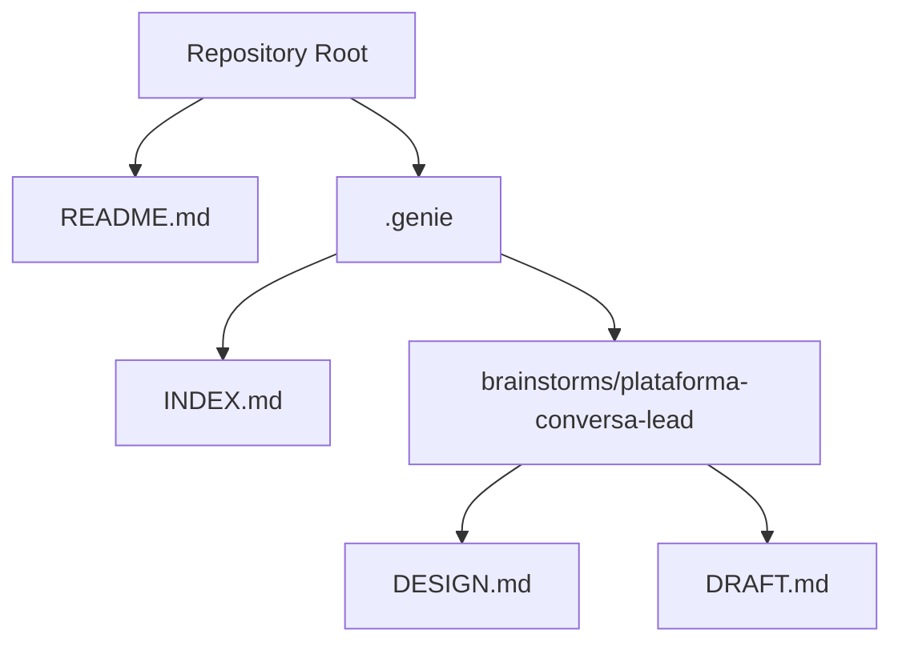
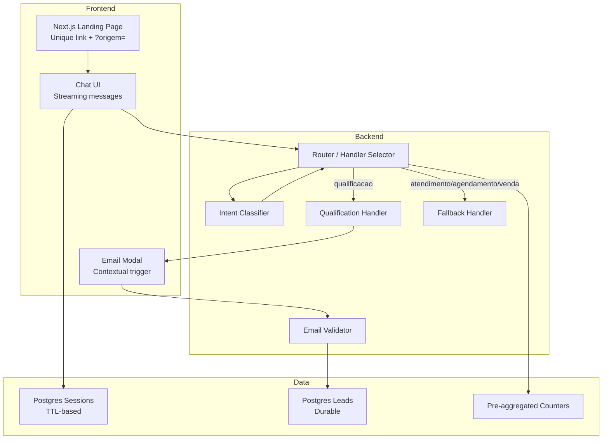
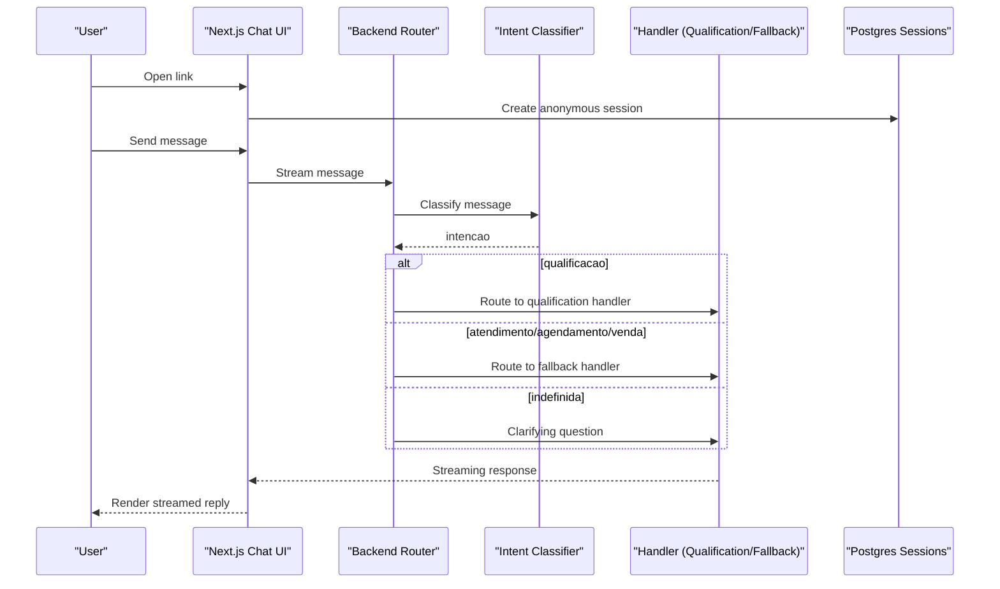
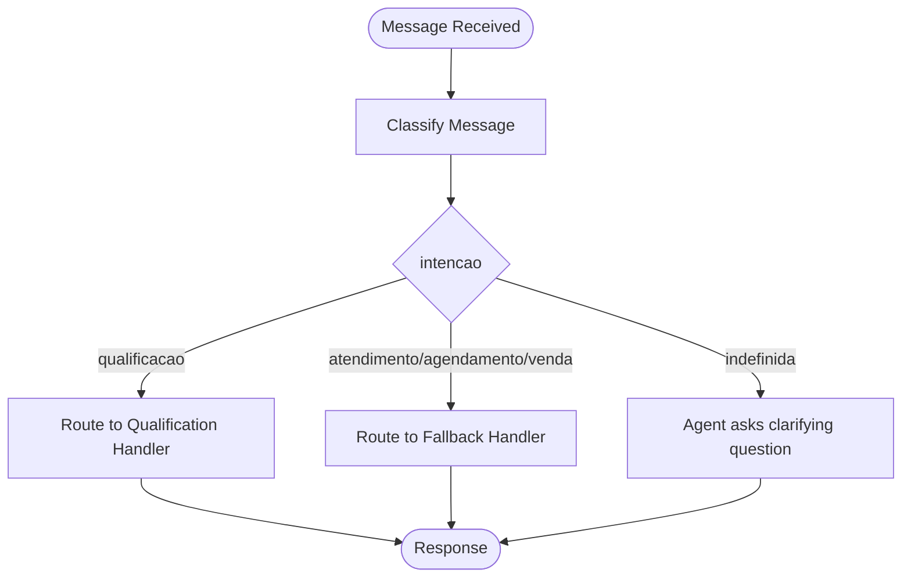
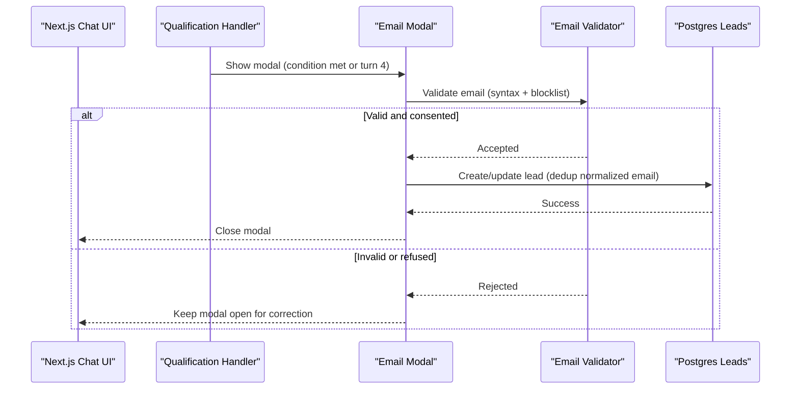
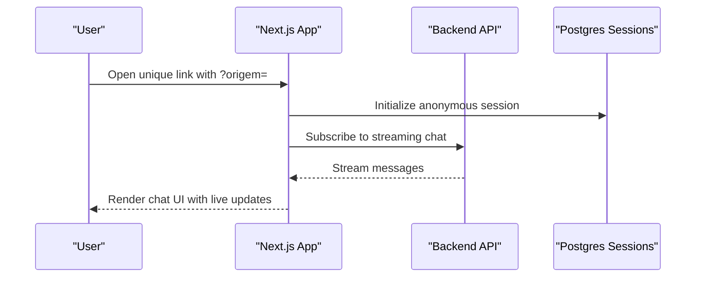
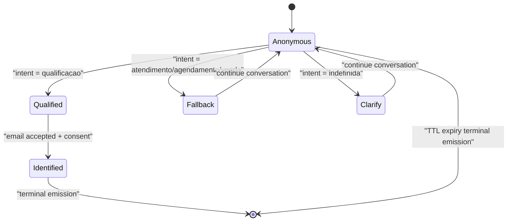
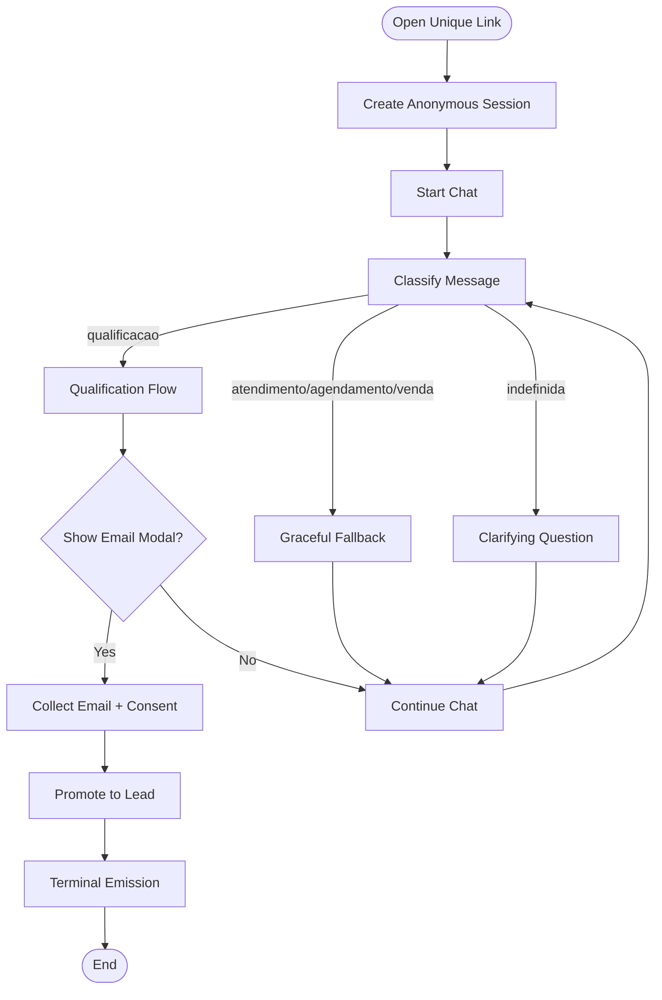
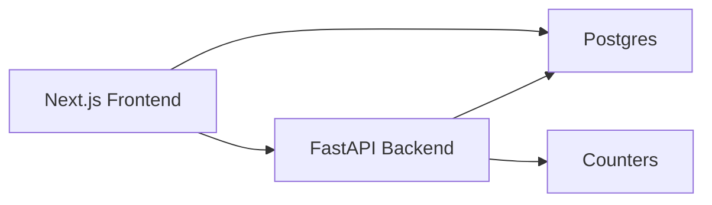

# Conversational Interface

<cite>
**Referenced Files in This Document**
- [README.md](file://README.md)
- [INDEX.md](file://.genie/INDEX.md)
- [DESIGN.md](file://.genie/brainstorms/plataforma-conversa-lead/DESIGN.md)
- [DRAFT.md](file://.genie/brainstorms/plataforma-conversa-lead/DRAFT.md)
</cite>

## Table of Contents
1. [Introduction](#introduction)
2. [Project Structure](#project-structure)
3. [Core Components](#core-components)
4. [Architecture Overview](#architecture-overview)
5. [Detailed Component Analysis](#detailed-component-analysis)
6. [Dependency Analysis](#dependency-analysis)
7. [Performance Considerations](#performance-considerations)
8. [Troubleshooting Guide](#troubleshooting-guide)
9. [Conclusion](#conclusion)
10. [Appendices](#appendices)

## Introduction
This document describes the conversational interface for the Sup Better Engine’s lead capture flow. It focuses on:
- An anonymous chat experience that removes friction at entry and builds context over turns
- Real-time message processing with streaming capabilities from the frontend to a backend agent
- A contextual email collection modal that appears mid-conversation when appropriate
- Next.js implementation details including landing page generation with unique links, attribution tracking via URL parameters, and the chat interface components
- Session management that maintains conversation context while keeping users anonymous until they choose to identify themselves
- Practical user flows from link opening through conversation initiation, handling different intents and responses

The project is currently in its early stage; this documentation synthesizes the design intent and operational rules as defined in the repository’s planning artifacts.

**Section sources**
- [README.md:1-8](file://README.md#L1-L8)

## Project Structure
At present, the repository contains planning and design artifacts rather than application code. The structure centers around a README and a .genie directory that tracks brainstorming and design decisions for the conversational platform slice.

**Diagram sources**
- [README.md:1-8](file://README.md#L1-L8)
- [INDEX.md:1-12](file://.genie/INDEX.md#L1-L12)
- [DESIGN.md:1-454](file://.genie/brainstorms/plataforma-conversa-lead/DESIGN.md#L1-L454)
- [DRAFT.md:1-171](file://.genie/brainstorms/plataforma-conversa-lead/DRAFT.md#L1-L171)

**Section sources**
- [README.md:1-8](file://README.md#L1-L8)
- [INDEX.md:1-12](file://.genie/INDEX.md#L1-L12)

## Core Components
The conversational interface is composed of the following core components, as designed:

- Next.js Frontend
  - Landing page per unique link with attribution parameter (e.g., ?origem=)
  - Chat UI with streaming messages
  - Contextual email modal triggered mid-conversation under specific conditions

- Backend Agent (Python/FastAPI)
  - Intent classifier producing a single field: intencao ∈ {qualificacao, atendimento, agendamento, venda, indefinida}
  - Routing per message: qualificacao → real handler; other intents → graceful fallback; indefinida → clarifying question
  - Email validation (syntax + disposable domain blocklist)
  - Promotion of anonymous session to durable lead upon consent and submission

- Postgres Database
  - Ephemeral session table with TTL to maintain conversation context while anonymous
  - Terminal emission to pre-aggregated counters at session end or TTL expiry
  - Lead records created only upon identification

- Analytics and Telemetry
  - Pre-aggregated counters across dimensions: origem, intencao, estado_email, sessao_valida
  - Weekly snapshot scalar for valid sessions trend
  - Operational scalar for edge blocking by IP/day

**Section sources**
- [DESIGN.md:47-166](file://.genie/brainstorms/plataforma-conversa-lead/DESIGN.md#L47-L166)
- [DESIGN.md:189-233](file://.genie/brainstorms/plataforma-conversa-lead/DESIGN.md#L189-L233)
- [DESIGN.md:339-367](file://.genie/brainstorms/plataforma-conversa-lead/DESIGN.md#L339-L367)

## Architecture Overview
High-level architecture aligns with a Next.js frontend serving a streaming chat and a Python FastAPI backend hosting the agent logic, backed by Postgres for ephemeral sessions and analytics.

**Diagram sources**
- [DESIGN.md:189-233](file://.genie/brainstorms/plataforma-conversa-lead/DESIGN.md#L189-L233)
- [DESIGN.md:47-166](file://.genie/brainstorms/plataforma-conversa-lead/DESIGN.md#L47-L166)

## Detailed Component Analysis

### Anonymous Chat Experience and Streaming
- Entry is frictionless: users open a unique link and begin chatting anonymously
- Messages stream in real time from the Next.js chat UI to the backend agent
- Each message is classified to determine routing and response behavior
- Conversation context is maintained in an ephemeral session with TTL

**Diagram sources**
- [DESIGN.md:47-85](file://.genie/brainstorms/plataforma-conversa-lead/DESIGN.md#L47-L85)
- [DESIGN.md:189-233](file://.genie/brainstorms/plataforma-conversa-lead/DESIGN.md#L189-L233)

**Section sources**
- [DESIGN.md:47-85](file://.genie/brainstorms/plataforma-conversa-lead/DESIGN.md#L47-L85)
- [DESIGN.md:189-233](file://.genie/brainstorms/plataforma-conversa-lead/DESIGN.md#L189-L233)

### Intent Classification and Routing
- The classifier emits a single field: intencao
- Routing is re-evaluated per message:
  - qualificacao → real handler
  - atendimento/agendamento/venda → graceful fallback
  - indefinida → clarifying question without invoking handlers
- Aggregation to session-level intencao occurs only for counting purposes, using the first non-indefinida label

**Diagram sources**
- [DESIGN.md:53-76](file://.genie/brainstorms/plataforma-conversa-lead/DESIGN.md#L53-L76)

**Section sources**
- [DESIGN.md:53-76](file://.genie/brainstorms/plataforma-conversa-lead/DESIGN.md#L53-L76)

### Contextual Email Collection Modal
- Triggered by the qualification handler after capturing intention, urgency, and fit, or by turn 4 if not yet captured
- Maximum two displays per session; validation retry does not count as a new display
- Email validation includes syntax check and disposable domain blocklist
- Consent is tied to sending; purpose is restricted to commercial return about this conversation
- Upon acceptance, the anonymous session is promoted to a durable lead record

**Diagram sources**
- [DESIGN.md:86-108](file://.genie/brainstorms/plataforma-conversa-lead/DESIGN.md#L86-L108)
- [DESIGN.md:215-223](file://.genie/brainstorms/plataforma-conversa-lead/DESIGN.md#L215-L223)

**Section sources**
- [DESIGN.md:86-108](file://.genie/brainstorms/plataforma-conversa-lead/DESIGN.md#L86-L108)
- [DESIGN.md:215-223](file://.genie/brainstorms/plataforma-conversa-lead/DESIGN.md#L215-L223)

### Next.js Implementation Details
- Landing page generation per unique link with attribution via URL parameters (e.g., ?origem=)
- Chat interface renders streaming responses from the backend
- Email modal integrates with backend validation and consent capture
- Attribution parameter is preserved for analytics and reporting

**Diagram sources**
- [DESIGN.md:47-52](file://.genie/brainstorms/plataforma-conversa-lead/DESIGN.md#L47-L52)
- [DESIGN.md:189-202](file://.genie/brainstorms/plataforma-conversa-lead/DESIGN.md#L189-L202)

**Section sources**
- [DESIGN.md:47-52](file://.genie/brainstorms/plataforma-conversa-lead/DESIGN.md#L47-L52)
- [DESIGN.md:189-202](file://.genie/brainstorms/plataforma-conversa-lead/DESIGN.md#L189-L202)

### Session Management System
- Ephemeral sessions stored in Postgres with TTL to maintain conversation context while anonymous
- Session promotes to durable lead upon successful email submission and consent
- Terminal emission increments pre-aggregated counters at session end or TTL expiry
- Rate limiting protects public LLM endpoints; session caps prevent abuse

**Diagram sources**
- [DESIGN.md:189-213](file://.genie/brainstorms/plataforma-conversa-lead/DESIGN.md#L189-L213)
- [DESIGN.md:112-126](file://.genie/brainstorms/plataforma-conversa-lead/DESIGN.md#L112-L126)

**Section sources**
- [DESIGN.md:189-213](file://.genie/brainstorms/plataforma-conversa-lead/DESIGN.md#L189-L213)
- [DESIGN.md:112-126](file://.genie/brainstorms/plataforma-conversa-lead/DESIGN.md#L112-L126)

### Practical User Flows
- Link Opening and Attribution
  - User opens a unique link with ?origem=; system initializes an anonymous session and attributes the visit
- Conversation Initiation
  - User chats anonymously; each message is classified and routed accordingly
- Intent Handling
  - qualificacao triggers qualification flow and potential email modal
  - atendimento/agendamento/venda receive graceful fallback responses
  - indefinida receives clarifying questions without handler invocation
- Identification and Conversion
  - When conditions are met, email modal appears; upon acceptance, session becomes a durable lead
  - Terminal emission updates pre-aggregated counters

**Diagram sources**
- [DESIGN.md:47-108](file://.genie/brainstorms/plataforma-conversa-lead/DESIGN.md#L47-L108)
- [DESIGN.md:127-166](file://.genie/brainstorms/plataforma-conversa-lead/DESIGN.md#L127-L166)

**Section sources**
- [DESIGN.md:47-108](file://.genie/brainstorms/plataforma-conversa-lead/DESIGN.md#L47-L108)
- [DESIGN.md:127-166](file://.genie/brainstorms/plataforma-conversa-lead/DESIGN.md#L127-L166)

## Dependency Analysis
The system’s dependencies center around the interaction between Next.js, the Python backend, and Postgres. The design emphasizes separation of concerns: frontend handles UI and streaming, backend manages agent logic and routing, and database stores ephemeral sessions and durable leads.

**Diagram sources**
- [DESIGN.md:189-233](file://.genie/brainstorms/plataforma-conversa-lead/DESIGN.md#L189-L233)

**Section sources**
- [DESIGN.md:189-233](file://.genie/brainstorms/plataforma-conversa-lead/DESIGN.md#L189-L233)

## Performance Considerations
- Rate Limiting: Protects public LLM endpoints with per-IP limits and per-session message caps
- TTL-Based Sessions: Ensures data minimization and automatic cleanup of anonymous conversations
- Pre-Aggregated Counters: Reduces storage overhead and simplifies analytics by storing aggregated metrics instead of event streams
- Streaming Responses: Improves perceived performance and user engagement by rendering responses incrementally

[No sources needed since this section provides general guidance]

## Troubleshooting Guide
Common issues and mitigations include:
- Misclassification of Intent
  - Validate classifier against labeled datasets; monitor fallback rates as a drift signal
- Excessive Fallback Usage
  - Review classification accuracy and ensure fallback remains terminal per turn but not per session
- Email Validation Failures
  - Ensure blocklist coverage and provide clear feedback for corrections
- Rate Limit Exceeded
  - Monitor edge-blocking scalars; adjust limits based on observed legitimate usage patterns
- Session TTL Expiry Before Identification
  - Tune TTL and modal triggers to balance conversion and privacy

**Section sources**
- [DESIGN.md:386-398](file://.genie/brainstorms/plataforma-conversa-lead/DESIGN.md#L386-L398)

## Conclusion
The Sup Better Engine’s conversational interface is designed to deliver a frictionless, anonymous chat experience that transitions to identification only when contextually justified. The architecture separates frontend streaming, backend agent logic, and database persistence, with robust safeguards like rate limiting and TTL-based sessions. The design prioritizes privacy, measurable outcomes, and extensibility for future enhancements.

[No sources needed since this section summarizes without analyzing specific files]

## Appendices
- Vocabularies and Terminology
  - Tenant, Lead, Agent, Session definitions guide consistent understanding across teams
- Scope Boundaries
  - Explicitly excludes complex features (live handoff, audio/video, multi-tenant) to keep the initial slice focused and testable
- Success Criteria
  - Defines measurable goals for flow completion, fallback isolation, abstenção routing, classifier validation, email validation, deduplication, counters, and rate limiting

**Section sources**
- [DRAFT.md:25-33](file://.genie/brainstorms/plataforma-conversa-lead/DRAFT.md#L25-L33)
- [DESIGN.md:168-187](file://.genie/brainstorms/plataforma-conversa-lead/DESIGN.md#L168-L187)
- [DESIGN.md:386-441](file://.genie/brainstorms/plataforma-conversa-lead/DESIGN.md#L386-L441)