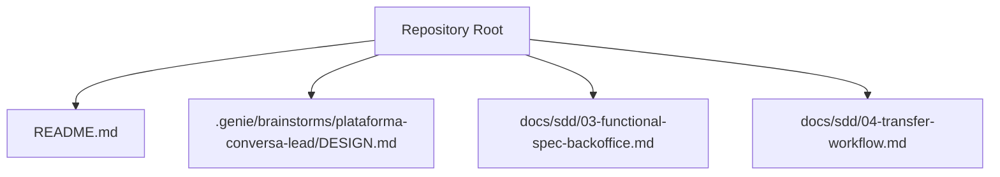
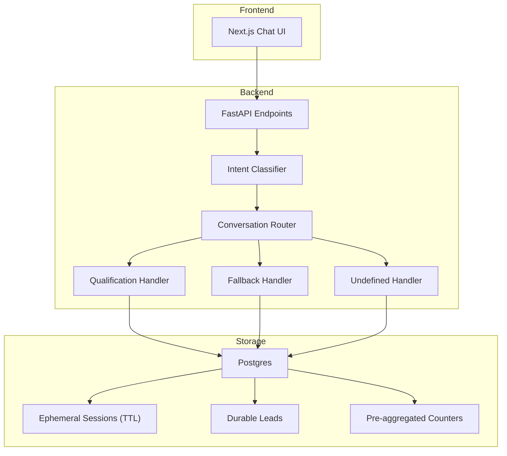
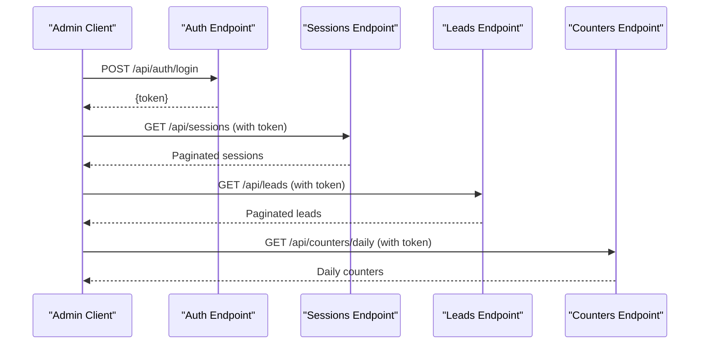
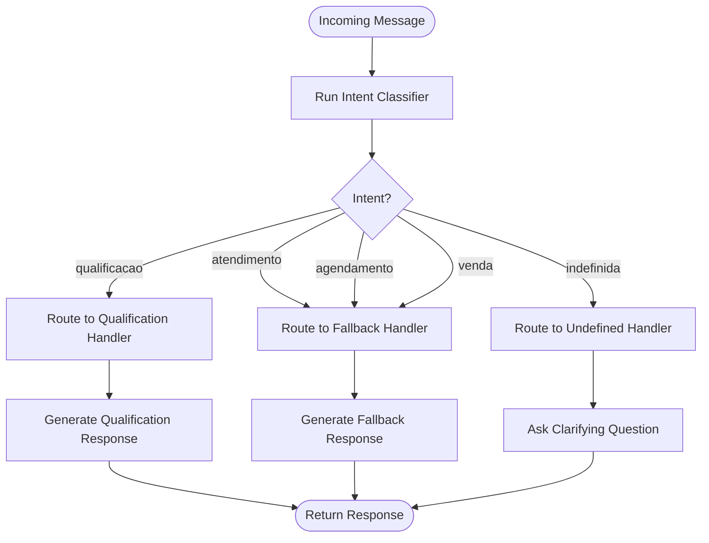
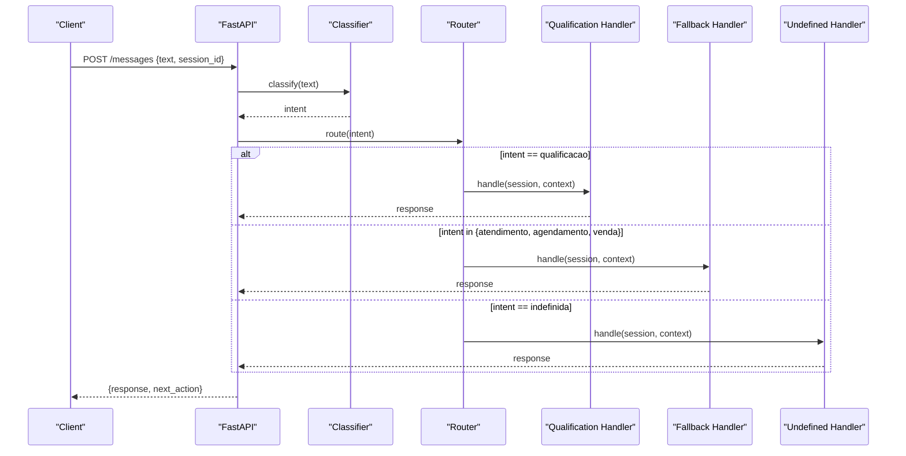
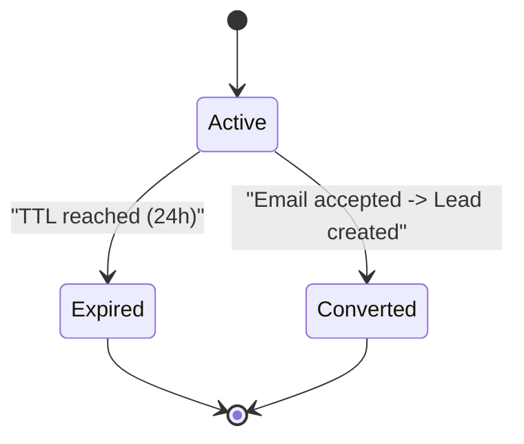
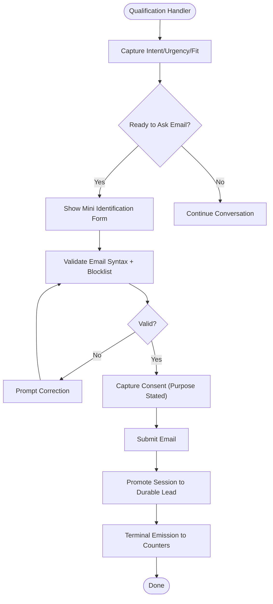
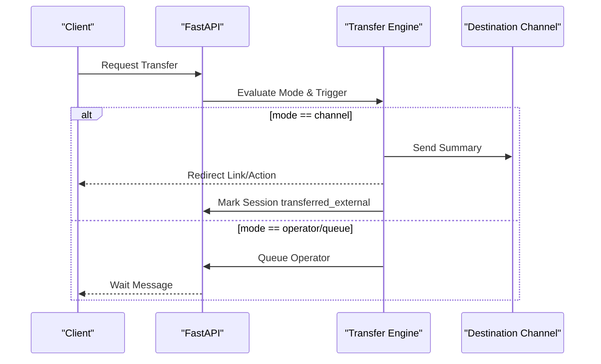
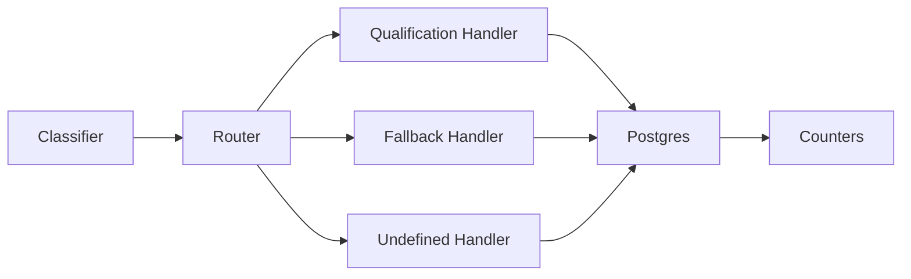

# Backend Message Processing Pipeline

<cite>
**Referenced Files in This Document**
- [README.md](file://README.md)
- [DESIGN.md](file://.genie/brainstorms/plataforma-conversa-lead/DESIGN.md)
- [03-functional-spec-backoffice.md](file://docs/sdd/03-functional-spec-backoffice.md)
- [04-transfer-workflow.md](file://docs/sdd/04-transfer-workflow.md)
</cite>

## Table of Contents
1. Introduction
2. Project Structure
3. Core Components
4. Architecture Overview
5. Detailed Component Analysis
6. Dependency Analysis
7. Performance Considerations
8. Troubleshooting Guide
9. Conclusion

## Introduction
This document describes the FastAPI backend message processing pipeline for a lead conversation platform. It covers how incoming chat messages are ingested, classified by intent using LLM providers, routed to conversation handlers, and processed within TTL-managed sessions that preserve context until expiration or conversion into a durable lead. It also documents API endpoints, authentication methods, error handling strategies, retry mechanisms, and performance optimizations for high-throughput processing.

The system is designed as a thin vertical slice: Next.js frontend with FastAPI backend and Postgres as the single source of truth. The backend holds the agent engine: classifier, qualification handler, fallback, email validation, and session-to-lead promotion. Sessions are ephemeral with TTL-based expiration; counters are pre-aggregated without PII.

**Section sources**
- [DESIGN.md:189-213](file://.genie/brainstorms/plataforma-conversa-lead/DESIGN.md#L189-L213)
- [DESIGN.md:47-127](file://.genie/brainstorms/plataforma-conversa-lead/DESIGN.md#L47-L127)

## Project Structure
At this stage, the repository contains design and specification artifacts rather than implementation code. The project structure includes:
- Root README indicating an initial phase
- Design document defining scope, approach, decisions, risks, and success criteria
- Functional specifications for backoffice APIs and data access patterns
- Transfer workflow documentation detailing transfer modes, triggers, and state transitions

**Diagram sources**
- [README.md:1-8](file://README.md#L1-L8)
- [DESIGN.md:1-10](file://.genie/brainstorms/plataforma-conversa-lead/DESIGN.md#L1-L10)
- [03-functional-spec-backoffice.md:284-335](file://docs/sdd/03-functional-spec-backoffice.md#L284-L335)
- [04-transfer-workflow.md:20-57](file://docs/sdd/04-transfer-workflow.md#L20-L57)

**Section sources**
- [README.md:1-8](file://README.md#L1-L8)
- [DESIGN.md:1-10](file://.genie/brainstorms/plataforma-conversa-lead/DESIGN.md#L1-L10)

## Core Components
- Intent Classifier: Analyzes each incoming message independently and emits one of five intents: qualificacao (qualification), atendimento (support), agendamento (scheduling), venda (sales), indefinida (undefined/abstention).
- Conversation Handlers: Strategy pattern implementation where each intent maps to a handler:
  - Qualification handler: captures intent, urgency, fit, and produces structured output for the sales team.
  - Fallback handler: gracefully acknowledges support, scheduling, or sales requests and points to tenant contact information.
  - Undefined handler: returns clarifying questions from the agent without invoking a specific handler.
- Session Management: Ephemeral sessions stored in Postgres with TTL (24 hours). Context preserved during the session; on TTL expiration or termination, a terminal emission increments pre-aggregated counters.
- Lead Qualification Workflow: Email validation (syntax + blocklist), consent capture, and promotion from anonymous session to durable lead upon successful submission.
- Counters: Pre-aggregated buckets across four dimensions (origin, intent, email state, session validity) without PII or per-session timestamps.

**Section sources**
- [DESIGN.md:47-127](file://.genie/brainstorms/plataforma-conversa-lead/DESIGN.md#L47-L127)
- [DESIGN.md:215-232](file://.genie/brainstorms/plataforma-conversa-lead/DESIGN.md#L215-L232)
- [DESIGN.md:254-287](file://.genie/brainstorms/plataforma-conversa-lead/DESIGN.md#L254-L287)

## Architecture Overview
High-level architecture: Next.js serves the landing and chat UI; FastAPI processes messages through classification and routing; Postgres stores ephemeral sessions and durable leads; counters are updated at session end or TTL expiration.

**Diagram sources**
- [DESIGN.md:189-213](file://.genie/brainstorms/plataforma-conversa-lead/DESIGN.md#L189-L213)
- [DESIGN.md:47-127](file://.genie/brainstorms/plataforma-conversa-lead/DESIGN.md#L47-L127)

## Detailed Component Analysis

### API Endpoints and Authentication
Proposed backoffice endpoints include authentication, sessions, leads, counters, configuration, operators, compliance, and audit. Authentication endpoints cover login, logout, refresh, and invite flows. These endpoints provide administrative visibility and control over sessions, leads, and operational parameters.

**Diagram sources**
- [03-functional-spec-backoffice.md:284-335](file://docs/sdd/03-functional-spec-backoffice.md#L284-L335)

**Section sources**
- [03-functional-spec-backoffice.md:284-335](file://docs/sdd/03-functional-spec-backoffice.md#L284-L335)

### Intent Classification System
Each message is analyzed independently by the classifier, emitting a single intent field. The classifier supports abstention via "undefined" to avoid forcing labels on greetings or noise. This ensures accurate routing and preserves metric integrity by preventing composed errors across turns.

**Diagram sources**
- [DESIGN.md:47-85](file://.genie/brainstorms/plataforma-conversa-lead/DESIGN.md#L47-L85)
- [DESIGN.md:215-232](file://.genie/brainstorms/plataforma-conversa-lead/DESIGN.md#L215-L232)

**Section sources**
- [DESIGN.md:47-85](file://.genie/brainstorms/plataforma-conversa-lead/DESIGN.md#L47-L85)
- [DESIGN.md:215-232](file://.genie/brainstorms/plataforma-conversa-lead/DESIGN.md#L215-L232)

### Conversation Routing Mechanism
Routing is re-evaluated per message based on the current message’s intent. Qualification goes to the real handler; support, scheduling, and sales go to the graceful fallback; undefined receives clarifying questions. This prevents misrouting later in the conversation and keeps fallback terminal only for the turn, not the session.

**Diagram sources**
- [DESIGN.md:58-85](file://.genie/brainstorms/plataforma-conversa-lead/DESIGN.md#L58-L85)
- [DESIGN.md:215-232](file://.genie/brainstorms/plataforma-conversa-lead/DESIGN.md#L215-L232)

**Section sources**
- [DESIGN.md:58-85](file://.genie/brainstorms/plataforma-conversa-lead/DESIGN.md#L58-L85)
- [DESIGN.md:215-232](file://.genie/brainstorms/plataforma-conversa-lead/DESIGN.md#L215-L232)

### Session Management and TTL Expiration
Sessions are ephemeral, stored in Postgres with a 24-hour TTL. Context is preserved while the session is active. On TTL expiration or termination, a terminal emission updates pre-aggregated counters without retaining PII or per-session identifiers.

**Diagram sources**
- [DESIGN.md:117-127](file://.genie/brainstorms/plataforma-conversa-lead/DESIGN.md#L117-L127)
- [DESIGN.md:198-213](file://.genie/brainstorms/plataforma-conversa-lead/DESIGN.md#L198-L213)

**Section sources**
- [DESIGN.md:117-127](file://.genie/brainstorms/plataforma-conversa-lead/DESIGN.md#L117-L127)
- [DESIGN.md:198-213](file://.genie/brainstorms/plataforma-conversa-lead/DESIGN.md#L198-L213)

### Lead Qualification Workflow Integration
The qualification handler captures intent, urgency, and fit, then triggers contextual email collection. Email validation uses syntax checks and a public disposable domain blocklist. Consent is captured as the act of sending, restricted to commercial return for this conversation. Upon acceptance, the session promotes to a durable lead with deduplication by normalized email.

**Diagram sources**
- [DESIGN.md:86-108](file://.genie/brainstorms/plataforma-conversa-lead/DESIGN.md#L86-L108)
- [DESIGN.md:215-223](file://.genie/brainstorms/plataforma-conversa-lead/DESIGN.md#L215-L223)

**Section sources**
- [DESIGN.md:86-108](file://.genie/brainstorms/plataforma-conversa-lead/DESIGN.md#L86-L108)
- [DESIGN.md:215-223](file://.genie/brainstorms/plataforma-conversa-lead/DESIGN.md#L215-L223)

### Transfer Workflow
Transfer modes include none, operator, queue, and channel. Triggers include no availability, operator decision, and client request. Channel transfer sends a conversation summary to the destination and redirects the client. Session state tracks transfer status, trigger, reason, timestamps, and destination.

**Diagram sources**
- [04-transfer-workflow.md:20-57](file://docs/sdd/04-transfer-workflow.md#L20-L57)
- [04-transfer-workflow.md:127-167](file://docs/sdd/04-transfer-workflow.md#L127-L167)

**Section sources**
- [04-transfer-workflow.md:20-57](file://docs/sdd/04-transfer-workflow.md#L20-L57)
- [04-transfer-workflow.md:127-167](file://docs/sdd/04-transfer-workflow.md#L127-L167)

## Dependency Analysis
Components depend on:
- Classifier for per-message intent
- Router for strategy-based handler selection
- Handlers for response generation
- Storage for session context and lead persistence
- Counters for aggregated metrics without PII

**Diagram sources**
- [DESIGN.md:47-85](file://.genie/brainstorms/plataforma-conversa-lead/DESIGN.md#L47-L85)
- [DESIGN.md:127-151](file://.genie/brainstorms/plataforma-conversa-lead/DESIGN.md#L127-L151)

**Section sources**
- [DESIGN.md:47-85](file://.genie/brainstorms/plataforma-conversa-lead/DESIGN.md#L47-L85)
- [DESIGN.md:127-151](file://.genie/brainstorms/plataforma-conversa-lead/DESIGN.md#L127-L151)

## Performance Considerations
- Rate Limiting: 30 messages per IP per hour protect the public LLM endpoint.
- Per-Session Message Cap: Limits engagement-heavy sessions; dimensioned from tenant WhatsApp history or defaults to 40 if unauthorized.
- TTL-Based Cleanup: 24-hour TTL ensures ephemeral sessions do not persist indefinitely, reducing storage load.
- Pre-aggregated Counters: Avoids per-session event logs; terminal emissions increment buckets, minimizing write overhead.
- High Throughput: Strategy pattern enables parallel handler execution; classifier runs per message for accuracy but does not freeze routing state.

[No sources needed since this section provides general guidance]

## Troubleshooting Guide
Common issues and mitigations:
- Misclassification: Monitor fallback rate as a drift signal; validate classifier against labeled corpus (≥125 messages, ≥25 per intent, ≥25 abstention examples).
- Email Validation Failures: Blocklisted domains and syntax errors prompt correction; track estado_email progression to ensure monotonicity.
- Rate Limit Exceeded: Sessions marked excluida_rate_limit; separate from teto exclusions for auditability.
- TTL Expiration: Terminal emission occurs even for abandoned sessions; ensure counters reflect origin, intent, email state, and session validity.
- Transfer Loops: Enforce max_requests_per_session for client-requested transfers; confirm before transferring.

**Section sources**
- [DESIGN.md:386-399](file://.genie/brainstorms/plataforma-conversa-lead/DESIGN.md#L386-L399)
- [04-transfer-workflow.md:52-57](file://docs/sdd/04-transfer-workflow.md#L52-L57)

## Conclusion
The backend message processing pipeline implements a robust, strategy-based routing system with per-message intent classification, TTL-managed sessions, and pre-aggregated counters. It balances accuracy and simplicity, protecting metrics from composed errors while enabling flexible handler expansion. Operational safeguards like rate limiting, per-session caps, and transfer controls ensure reliability under high throughput. Future enhancements can introduce additional handlers and richer interactions once measured demand justifies investment.

[No sources needed since this section summarizes without analyzing specific files]