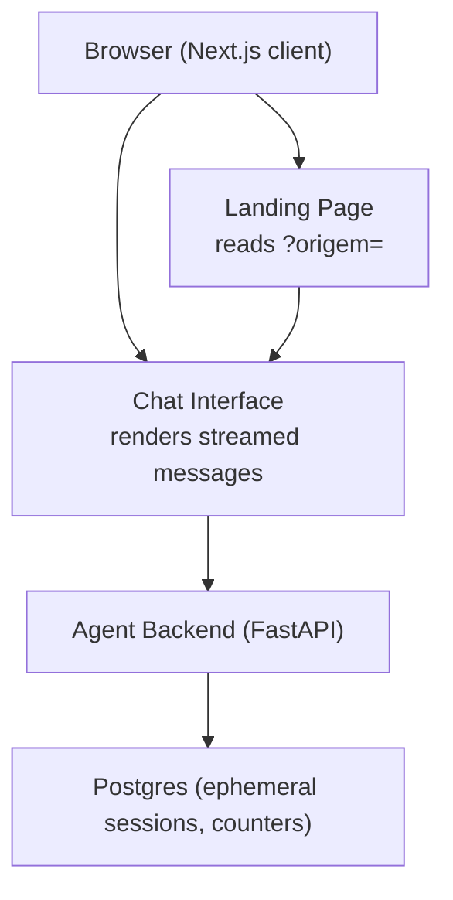
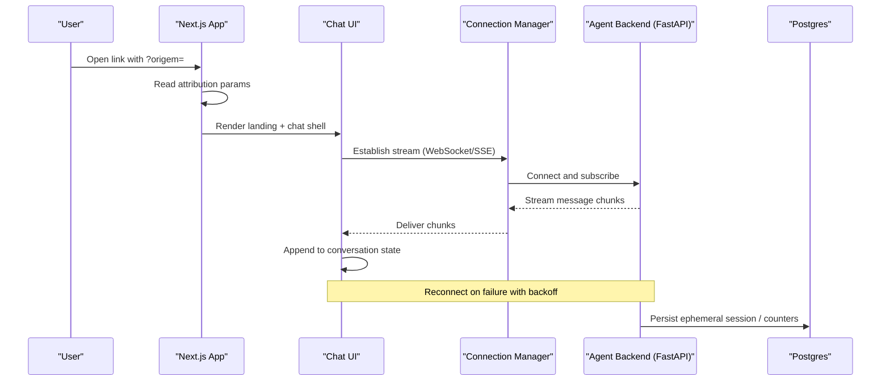
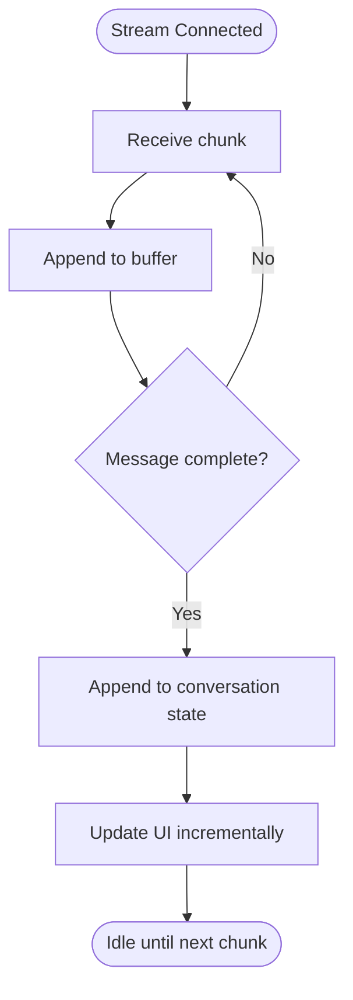
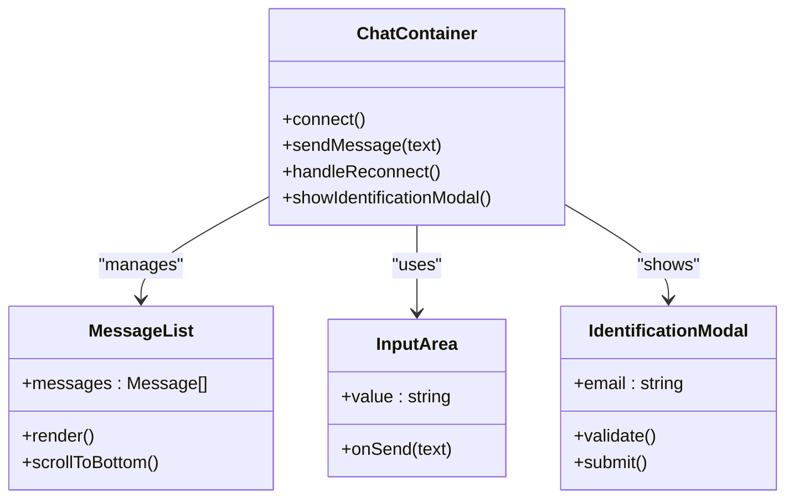
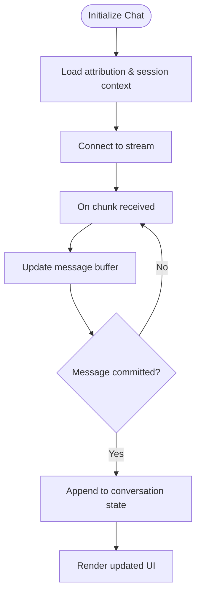
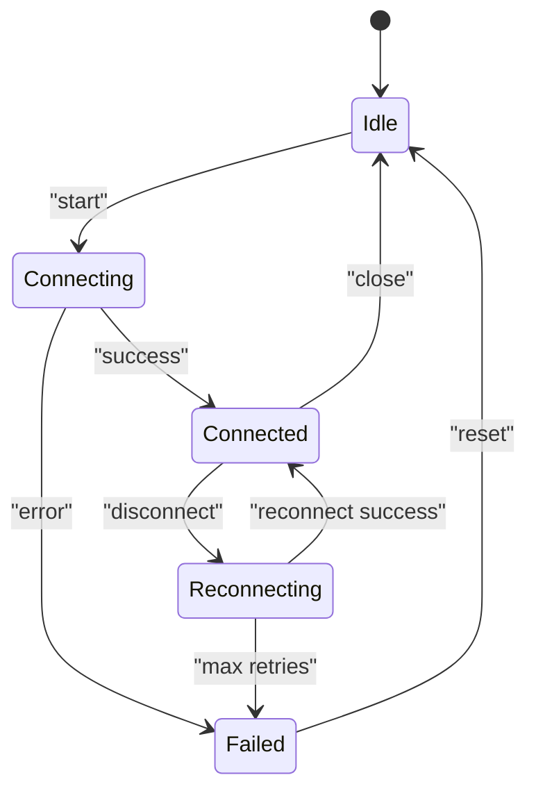
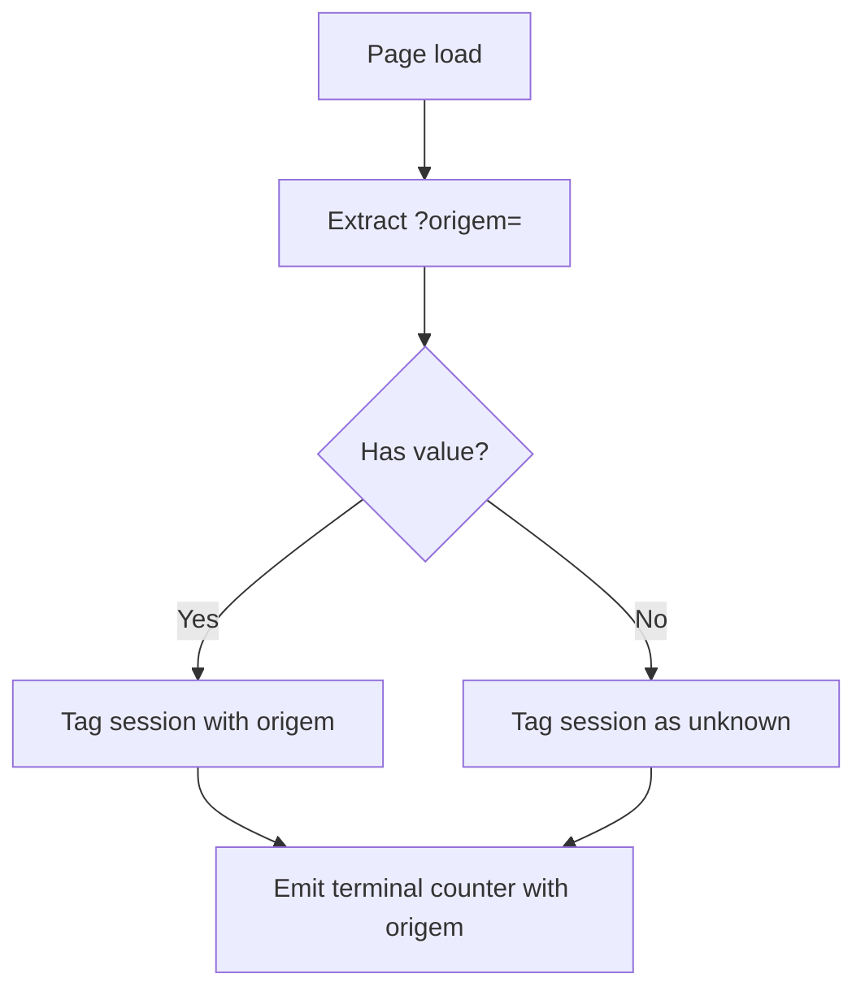
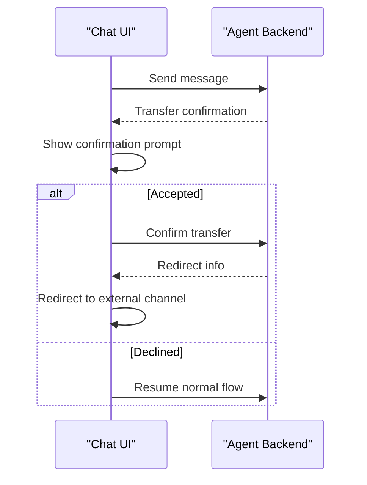
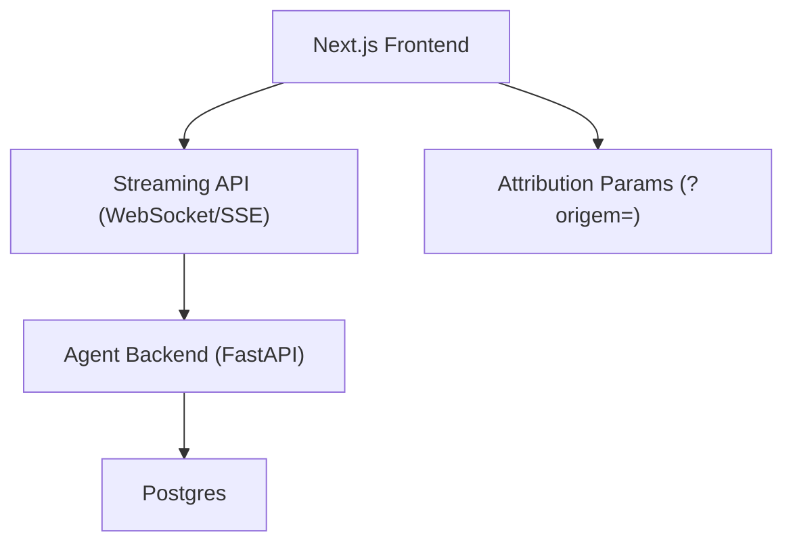

# Frontend Streaming Implementation

<cite>
**Referenced Files in This Document**
- [README.md](file://README.md)
- [DESIGN.md](file://.genie/brainstorms/plataforma-conversa-lead/DESIGN.md)
- [01-actors-and-roles.md](file://docs/sdd/01-actors-and-roles.md)
- [02-user-stories.md](file://docs/sdd/02-user-stories.md)
- [04-transfer-workflow.md](file://docs/sdd/04-transfer-workflow.md)
- [05-campaign-management.md](file://docs/sdd/05-campaign-management.md)
</cite>

## Table of Contents
1. [Introduction](#introduction)
2. [Project Structure](#project-structure)
3. [Core Components](#core-components)
4. [Architecture Overview](#architecture-overview)
5. [Detailed Component Analysis](#detailed-component-analysis)
6. [Dependency Analysis](#dependency-analysis)
7. [Performance Considerations](#performance-considerations)
8. [Troubleshooting Guide](#troubleshooting-guide)
9. [Conclusion](#conclusion)
10. [Appendices](#appendices)

## Introduction
This document describes the frontend streaming implementation for a Next.js chat interface that renders real-time messages from an agent backend. The system uses Next.js to serve a landing page, read campaign attribution from URL parameters, and render a streaming chat with a minimal identification screen. The backend (FastAPI) hosts the agent engine responsible for classification, qualification handling, fallback logic, email validation, and session promotion to leads.

The design emphasizes:
- A thin initial slice focused on link-based entry, streaming chat, and minimal identification.
- Attribution via a URL parameter for campaign tracking without persistent cookies or device tokens in this phase.
- Ephemeral sessions stored with TTL, discarded after expiration unless promoted to a lead upon identification.
- Counters aggregated by low-cardinality dimensions at session end rather than per-session event streams.

**Section sources**
- [DESIGN.md:189-202](file://.genie/brainstorms/plataforma-conversa-lead/DESIGN.md#L189-L202)

## Project Structure
At present, the repository contains documentation and design artifacts describing the intended architecture and scope. There are no Next.js source files included here; the frontend is described conceptually as a Next.js application serving a landing page and streaming chat UI.

[No sources needed since this diagram shows conceptual workflow, not actual code structure]

**Section sources**
- [README.md:1-8](file://README.md#L1-L8)
- [DESIGN.md:189-202](file://.genie/brainstorms/plataforma-conversa-lead/DESIGN.md#L189-L202)

## Core Components
- Next.js Landing Page: Renders the entry point, reads campaign attribution from URL query parameters, and initializes the chat session context.
- Streaming Chat UI: Displays incoming messages incrementally as they stream from the backend, maintaining conversation state in the browser.
- Identification Modal: A minimal screen to collect email contextually, enforce consent semantics, and validate input before submission.
- Connection Manager: Handles WebSocket or Server-Sent Events integration patterns for receiving streamed content, including reconnection and error recovery.
- Attribution Tracker: Captures and persists campaign parameters locally for the session to ensure consistent attribution across interactions.

These components align with the documented approach where Next.js serves the landing and chat while the backend manages the agent engine and session lifecycle.

**Section sources**
- [DESIGN.md:189-202](file://.genie/brainstorms/plataforma-conversa-lead/DESIGN.md#L189-L202)

## Architecture Overview
The frontend architecture centers around a streaming chat experience driven by server-side events. The client connects to the backend to receive incremental message chunks, updates the UI incrementally, and manages connection resilience. Campaign attribution is captured from the URL and applied consistently during session creation and counter emission.

**Diagram sources**
- [DESIGN.md:189-202](file://.genie/brainstorms/plataforma-conversa-lead/DESIGN.md#L189-L202)

## Detailed Component Analysis

### Streaming Message Delivery (WebSocket or SSE)
- Integration Pattern: Use either WebSockets or Server-Sent Events to receive incremental message fragments from the backend. Choose based on operational constraints and compatibility requirements.
- Chunk Handling: Accumulate partial responses into a single logical message until completion markers arrive, then append to the conversation state.
- Ordering and Deduplication: Ensure monotonically increasing sequence numbers or timestamps to avoid duplicates and maintain order.
- Backpressure: Throttle UI updates if necessary to keep rendering smooth under high-frequency streaming.

[No sources needed since this diagram shows conceptual workflow, not actual code structure]

### React Component Structure for Chat Interface
- ChatContainer: Orchestrates connection lifecycle, message queue, and modal visibility.
- MessageList: Renders ordered messages with incremental updates and scroll management.
- InputArea: Captures user input and sends messages to the backend via the connection manager.
- IdentificationModal: Collects email, validates syntax and disposable domains, enforces consent semantics, and limits display frequency per session.

[No sources needed since this diagram shows conceptual component model, not actual code structure]

### Message State Management
- In-memory Conversation Store: Maintain a list of messages with IDs, timestamps, sender roles, and content buffers for streaming.
- Pending Messages: Track unsent messages to handle retries and optimistic UI updates.
- Session Context: Keep attribution parameters and session metadata available throughout the chat lifecycle.

[No sources needed since this diagram shows conceptual workflow, not actual code structure]

### Connection Handling, Reconnection Logic, and Error Recovery
- Initial Connection: Establish WebSocket or SSE connection with appropriate headers and authentication if required.
- Heartbeat/Ping-Pong: Implement periodic heartbeats to detect dead connections early.
- Reconnection Strategy: Exponential backoff with jitter, max retry cap, and circuit breaker behavior to avoid thundering herds.
- Error Recovery: Gracefully degrade UI when disconnected, queue outgoing messages, and resume streaming upon reconnection.

[No sources needed since this diagram shows conceptual state machine, not actual code structure]

### Attribution Tracking Integration
- URL Parameter Capture: Extract campaign attribution from the URL query parameter and store it in session context.
- Consistent Tagging: Apply attribution to session creation and terminal emissions so counters can be bucketed by origin.
- Fallback Behavior: If no attribution is present, tag sessions as unknown to preserve baseline metrics.

**Section sources**
- [05-campaign-management.md:107-150](file://docs/sdd/05-campaign-management.md#L107-L150)

### Transfer Workflow Integration (Client Side)
- Trigger Detection: Recognize transfer triggers from backend signals or client phrases mapped to backend processing.
- UI Flow: Show confirmation prompts when applicable, redirect to external channels when configured, and update session status accordingly.
- Counter Emission: Ensure terminal counters reflect transfer outcomes and destination channel types.

**Section sources**
- [04-transfer-workflow.md:127-167](file://docs/sdd/04-transfer-workflow.md#L127-L167)

## Dependency Analysis
The frontend depends on:
- Next.js runtime for serving the landing page and streaming chat UI.
- Backend APIs for streaming message chunks and session management.
- Postgres for ephemeral session storage and counter aggregation.

**Diagram sources**
- [DESIGN.md:189-202](file://.genie/brainstorms/plataforma-conversa-lead/DESIGN.md#L189-L202)

**Section sources**
- [DESIGN.md:189-202](file://.genie/brainstorms/plataforma-conversa-lead/DESIGN.md#L189-L202)

## Performance Considerations
- Incremental Rendering: Update the UI incrementally as chunks arrive to minimize layout thrashing.
- Virtualization: Virtualize long message lists to maintain smooth scrolling performance.
- Debounced Updates: Batch frequent UI updates to reduce re-renders.
- Efficient State Transitions: Use immutable updates and stable references to prevent unnecessary re-renders.
- Network Efficiency: Compress payloads if feasible and use efficient framing for streaming data.

[No sources needed since this section provides general guidance]

## Troubleshooting Guide
- Connection Failures: Verify network connectivity, check CORS settings, and inspect WebSocket/SSE handshake errors.
- Message Ordering Issues: Inspect sequence numbers or timestamps to ensure correct ordering and deduplication.
- Reconnection Loops: Tune backoff intervals and maximum retries; implement circuit breakers to prevent excessive reconnect attempts.
- Attribution Mismatch: Validate URL parsing and ensure attribution is consistently applied to session creation and counter emissions.
- Modal Display Limits: Enforce maximum displays per session to avoid friction and comply with UX constraints.

**Section sources**
- [02-user-stories.md:28-45](file://docs/sdd/02-user-stories.md#L28-L45)
- [05-campaign-management.md:121-150](file://docs/sdd/05-campaign-management.md#L121-L150)

## Conclusion
The frontend streaming implementation leverages Next.js to deliver a responsive chat experience with real-time message delivery, robust connection management, and consistent attribution tracking. By focusing on a thin initial slice—link-based entry, streaming chat, and minimal identification—the system balances user experience with operational simplicity. Future enhancements can expand transfer workflows, operator interfaces, and advanced analytics while preserving the core streaming architecture.

[No sources needed since this section summarizes without analyzing specific files]

## Appendices

### Actors and Roles
- Operador: Monitors active sessions and escalations.
- Liderança dos Operadores: Oversees team performance and configuration.
- Gestão da Empresa: Owns strategic decisions and compliance.
- Cliente Final: Initiates conversations via links and interacts with the agent.

**Section sources**
- [01-actors-and-roles.md:10-30](file://docs/sdd/01-actors-and-roles.md#L10-L30)

### User Stories Summary
- Access conversation via link with minimal friction.
- Receive intent-appropriate responses.
- Provide email contextually with clear value proposition.
- Understand data usage and rights under privacy regulations.

**Section sources**
- [02-user-stories.md:8-55](file://docs/sdd/02-user-stories.md#L8-L55)