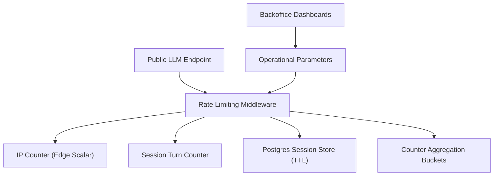
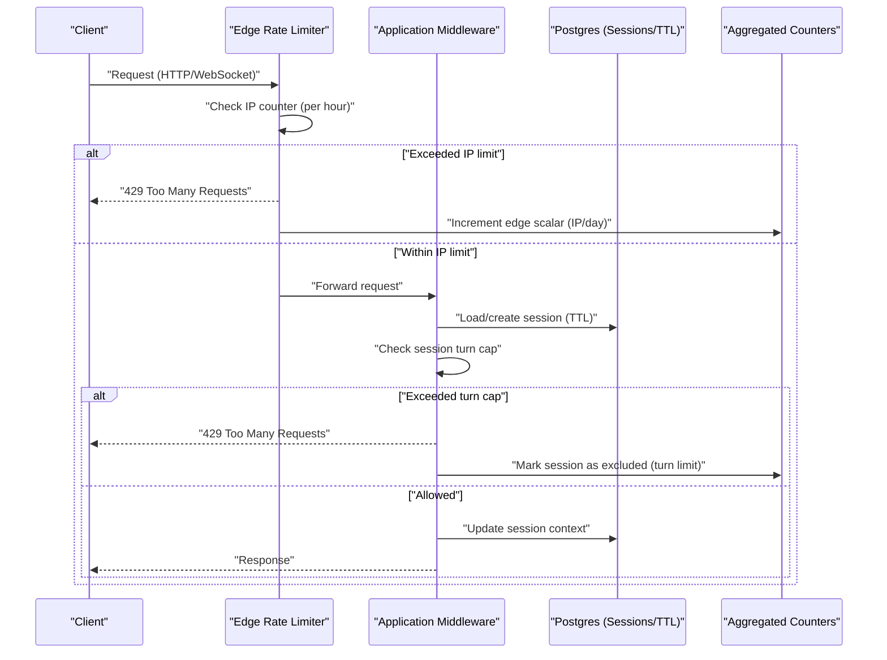
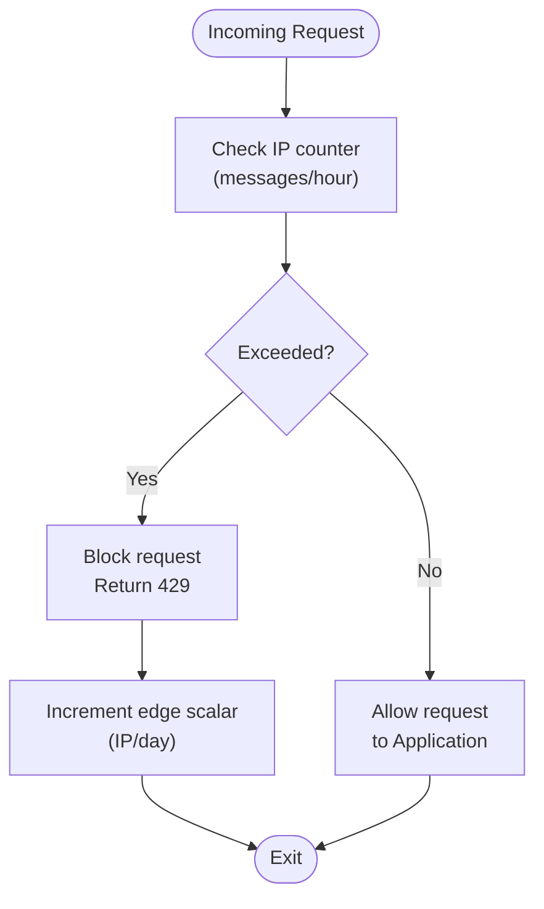
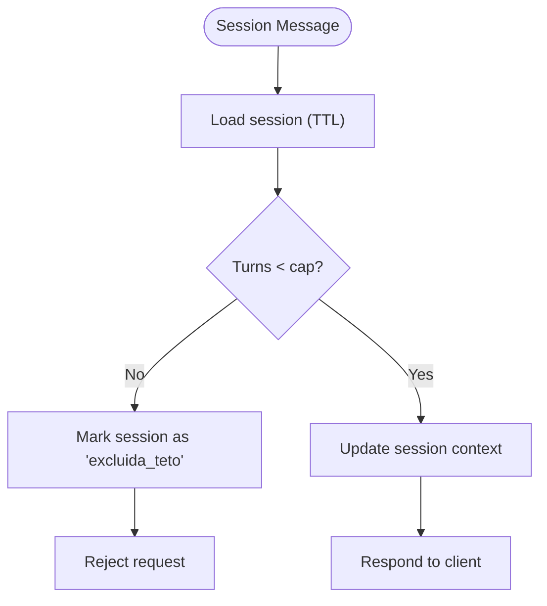
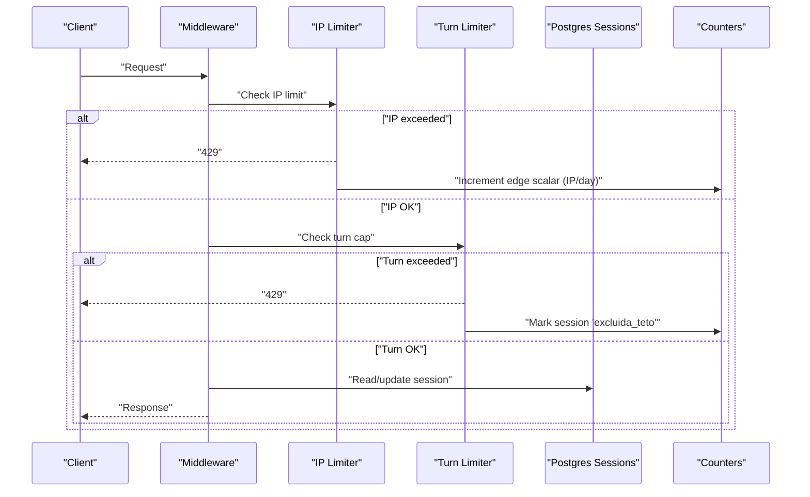
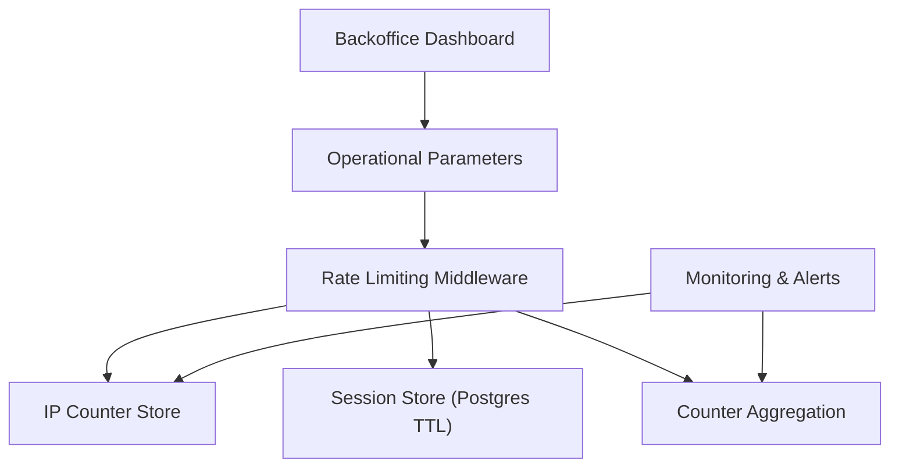

# Rate Limiting Mechanisms

<cite>
**Referenced Files in This Document**
- [DESIGN.md](file://.genie/brainstorms/plataforma-conversa-lead/DESIGN.md)
- [01-actors-and-roles.md](file://docs/sdd/01-actors-and-roles.md)
- [02-user-stories.md](file://docs/sdd/02-user-stories.md)
- [03-functional-spec-backoffice.md](file://docs/sdd/03-functional-spec-backoffice.md)
- [04-transfer-workflow.md](file://docs/sdd/04-transfer-workflow.md)
</cite>

## Table of Contents
1. [Introduction](#introduction)
2. [Project Structure](#project-structure)
3. [Core Components](#core-components)
4. [Architecture Overview](#architecture-overview)
5. [Detailed Component Analysis](#detailed-component-analysis)
6. [Dependency Analysis](#dependency-analysis)
7. [Performance Considerations](#performance-considerations)
8. [Troubleshooting Guide](#troubleshooting-guide)
9. [Conclusion](#conclusion)
10. [Appendices](#appendices)

## Introduction
This document specifies the rate limiting infrastructure that protects the public LLM endpoint and ensures fair usage across API endpoints and WebSocket connections. It covers:
- IP-based rate limiting to restrict requests to 30 messages per hour per IP address.
- Per-session message caps (turn limits) to prevent abuse while allowing legitimate conversation flows.
- Middleware architecture that intercepts requests, tracks usage patterns, and enforces limits.
- Practical configuration, response handling, and graceful degradation strategies.
- Monitoring, alerting, analytics, and configuration options for different environments.
- Security considerations, trusted source bypasses, and scaling strategies for distributed deployments.

The design intentionally avoids Redis for session storage in the pilot phase and uses Postgres with TTL for ephemeral sessions; rate limiting counters are tracked at the edge as scalars to avoid inflating session metrics during attacks.

**Section sources**
- [DESIGN.md:112-123](file://.genie/brainstorms/plataforma-conversa-lead/DESIGN.md#L112-L123)
- [DESIGN.md:159-165](file://.genie/brainstorms/plataforma-conversa-lead/DESIGN.md#L159-L165)
- [DESIGN.md:198-213](file://.genie/brainstorms/plataforma-conversa-lead/DESIGN.md#L198-L213)
- [DESIGN.md:381-398](file://.genie/brainstorms/plataforma-conversa-lead/DESIGN.md#L381-L398)

## Project Structure
The repository contains design and specification documents that define rate limiting behavior, operational parameters, and backoffice visibility. There is no application code in this workspace; therefore, this documentation focuses on the documented requirements and constraints.

[No sources needed since this diagram shows conceptual workflow, not actual code structure]

## Core Components
- IP-based rate limiter: Enforces a maximum of 30 messages per hour per IP address. Requests exceeding this limit are blocked at the edge and counted as an operational scalar by IP and day.
- Per-session turn cap: Limits the number of turns per session to prevent excessive consumption while supporting normal conversation depth. The default ceiling is provisionally set based on historical data and can be adjusted operationally.
- Middleware interception: All incoming requests (HTTP and WebSocket) pass through middleware that checks IP counters and session turn counters before allowing access to the LLM endpoint.
- Counters and buckets:
  - Edge scalar counter for blocked requests by IP and day.
  - Aggregated counter buckets indexed by low-cardinality dimensions (origin, intent, email state, session validity).
  - Exclusion categories include “excluded due to rate limit” and “excluded due to turn limit,” reported separately.
- Configuration via backoffice: Operational parameters such as TTL, rate limit thresholds, and turn limits are configurable without redeployment.

**Section sources**
- [DESIGN.md:112-123](file://.genie/brainstorms/plataforma-conversa-lead/DESIGN.md#L112-L123)
- [DESIGN.md:159-165](file://.genie/brainstorms/plataforma-conversa-lead/DESIGN.md#L159-L165)
- [DESIGN.md:198-213](file://.genie/brainstorms/plataforma-conversa-lead/DESIGN.md#L198-L213)
- [03-functional-spec-backoffice.md:192-210](file://docs/sdd/03-functional-spec-backoffice.md#L192-L210)

## Architecture Overview
The rate limiting architecture sits at the edge of the system, protecting the public LLM endpoint from abuse while preserving legitimate user experiences.

**Diagram sources**
- [DESIGN.md:112-123](file://.genie/brainstorms/plataforma-conversa-lead/DESIGN.md#L112-L123)
- [DESIGN.md:159-165](file://.genie/brainstorms/plataforma-conversa-lead/DESIGN.md#L159-L165)
- [DESIGN.md:198-213](file://.genie/brainstorms/plataforma-conversa-lead/DESIGN.md#L198-L213)
- [DESIGN.md:398](file://.genie/brainstorms/plataforma-conversa-lead/DESIGN.md#L398)

## Detailed Component Analysis

### IP-Based Rate Limiting
- Policy: 30 messages per hour per IP address.
- Enforcement: Blocked at the edge when exceeded; counted as an operational scalar by IP and day to avoid inflating session metrics.
- Rationale: Protects the public LLM endpoint from gross abuse and controls costs. Sophisticated bot traffic is accepted as noise in baseline; cost monitoring triggers reconsideration.

**Diagram sources**
- [DESIGN.md:112-123](file://.genie/brainstorms/plataforma-conversa-lead/DESIGN.md#L112-L123)
- [DESIGN.md:159-165](file://.genie/brainstorms/plataforma-conversa-lead/DESIGN.md#L159-L165)
- [DESIGN.md:381-398](file://.genie/brainstorms/plataforma-conversa-lead/DESIGN.md#L381-L398)

**Section sources**
- [DESIGN.md:112-123](file://.genie/brainstorms/plataforma-conversa-lead/DESIGN.md#L112-L123)
- [DESIGN.md:159-165](file://.genie/brainstorms/plataforma-conversa-lead/DESIGN.md#L159-L165)
- [DESIGN.md:381-398](file://.genie/brainstorms/plataforma-conversa-lead/DESIGN.md#L381-L398)

### Per-Session Message Caps (Turn Limits)
- Policy: Cap the number of turns per session to prevent abuse while enabling legitimate conversations. Default ceiling is provisionally set based on historical data and reviewed operationally.
- Enforcement: Checked after IP validation; if exceeded, the session is marked as excluded due to turn limit and further messages are rejected.
- Measurement: Exclusions are reported separately from rate limit exclusions to maintain accurate metrics.

**Diagram sources**
- [DESIGN.md:198-213](file://.genie/brainstorms/plataforma-conversa-lead/DESIGN.md#L198-L213)
- [DESIGN.md:398](file://.genie/brainstorms/plataforma-conversa-lead/DESIGN.md#L398)

**Section sources**
- [DESIGN.md:198-213](file://.genie/brainstorms/plataforma-conversa-lead/DESIGN.md#L198-L213)
- [DESIGN.md:398](file://.genie/brainstorms/plataforma-conversa-lead/DESIGN.md#L398)

### Middleware Architecture
- Interception point: All requests to the public LLM endpoint pass through middleware that enforces both IP-based and session-based limits.
- Tracking: Tracks usage patterns via edge scalars (IP/day) and aggregated counter buckets (low-cardinality dimensions).
- Enforcement: Returns appropriate responses (e.g., 429) when limits are exceeded; marks sessions accordingly for downstream analytics.

**Diagram sources**
- [DESIGN.md:112-123](file://.genie/brainstorms/plataforma-conversa-lead/DESIGN.md#L112-L123)
- [DESIGN.md:159-165](file://.genie/brainstorms/plataforma-conversa-lead/DESIGN.md#L159-L165)
- [DESIGN.md:198-213](file://.genie/brainstorms/plataforma-conversa-lead/DESIGN.md#L198-L213)
- [DESIGN.md:398](file://.genie/brainstorms/plataforma-conversa-lead/DESIGN.md#L398)

**Section sources**
- [DESIGN.md:112-123](file://.genie/brainstorms/plataforma-conversa-lead/DESIGN.md#L112-L123)
- [DESIGN.md:159-165](file://.genie/brainstorms/plataforma-conversa-lead/DESIGN.md#L159-L165)
- [DESIGN.md:198-213](file://.genie/brainstorms/plataforma-conversa-lead/DESIGN.md#L198-L213)
- [DESIGN.md:398](file://.genie/brainstorms/plataforma-conversa-lead/DESIGN.md#L398)

### Configuration Options
- Configurable parameters include:
  - Session TTL: 24 hours (default), adjustable within a safe range.
  - Rate limit (IP/hour): 30 (default), adjustable between 10–100.
  - Turn limit (session): Variable, default around 40, adjustable between 10–100.
  - Email modal trigger turn and max displays: Adjusted to balance conversion and consent friction.
- Change management: Changes require confirmation, are logged with author and timestamp, take effect within minutes, and support rollback.

**Section sources**
- [03-functional-spec-backoffice.md:192-210](file://docs/sdd/03-functional-spec-backoffice.md#L192-L210)

### Monitoring and Alerting
- Metrics:
  - Edge scalar counters for blocked requests by IP and day.
  - Aggregated counter buckets for sessions, intents, email states, and exclusion reasons.
  - Weekly snapshots for trend analysis.
- Alerts:
  - Monitor LLM cost and invalid session volume; trigger reconsideration if rate limiting is insufficient.
  - Track classifier drift via fallback rates.
- Backoffice dashboards:
  - Real-time daily metrics including valid/excluded sessions and lead identification counts.
  - Leadership views for weekly/monthly trends and parameter configuration.

**Section sources**
- [DESIGN.md:159-165](file://.genie/brainstorms/plataforma-conversa-lead/DESIGN.md#L159-L165)
- [DESIGN.md:381-398](file://.genie/brainstorms/plataforma-conversa-lead/DESIGN.md#L381-L398)
- [03-functional-spec-backoffice.md:153-167](file://docs/sdd/03-functional-spec-backoffice.md#L153-L167)

### Handling Rate Limit Exceeded Responses
- HTTP: Return 429 Too Many Requests when IP or turn limits are exceeded.
- WebSocket: Apply similar enforcement at connection/message level; close or throttle connections when limits are breached.
- Graceful degradation:
  - Provide informative messages indicating temporary unavailability.
  - Defer non-critical processing until limits reset.
  - Log and aggregate events for auditability without inflating session metrics.

**Section sources**
- [DESIGN.md:159-165](file://.genie/brainstorms/plataforma-conversa-lead/DESIGN.md#L159-L165)
- [DESIGN.md:398](file://.genie/brainstorms/plataforma-conversa-lead/DESIGN.md#L398)

### Security Considerations and Trusted Source Bypasses
- Public endpoint risks:
  - Anonymous access requires strict rate limiting to control costs.
  - Sophisticated bots may bypass basic limits; monitor cost and invalid sessions as triggers for enhanced detection.
- Trusted sources:
  - No explicit bypass mechanism is defined in the current scope; any trusted source handling should be added carefully to avoid undermining protections.
- Data protection:
  - Avoid storing PII in rate limit keys; use hashed or anonymized identifiers where necessary.
  - Ensure audit logs capture relevant metadata without retaining sensitive content.

**Section sources**
- [DESIGN.md:381-398](file://.genie/brainstorms/plataforma-conversa-lead/DESIGN.md#L381-L398)

### Scaling Strategies for Distributed Deployments
- Edge-level enforcement:
  - Use a shared, low-latency store for IP counters (e.g., in-memory cache with replication or a managed key-value store) to ensure consistent limits across instances.
- Session storage:
  - Postgres with TTL for ephemeral sessions in pilot; consider sharding or partitioning by tenant/session ID as scale increases.
- Counter aggregation:
  - Pre-aggregated buckets reduce read load; schedule periodic compaction and archival.
- Observability:
  - Centralize metrics and logs; implement alerts for anomalies in rate limit violations and cost spikes.

[No sources needed since this section provides general guidance]

## Dependency Analysis
Rate limiting depends on several components and interacts with others:

**Diagram sources**
- [DESIGN.md:112-123](file://.genie/brainstorms/plataforma-conversa-lead/DESIGN.md#L112-L123)
- [DESIGN.md:159-165](file://.genie/brainstorms/plataforma-conversa-lead/DESIGN.md#L159-L165)
- [DESIGN.md:198-213](file://.genie/brainstorms/plataforma-conversa-lead/DESIGN.md#L198-L213)
- [03-functional-spec-backoffice.md:192-210](file://docs/sdd/03-functional-spec-backoffice.md#L192-L210)

**Section sources**
- [DESIGN.md:112-123](file://.genie/brainstorms/plataforma-conversa-lead/DESIGN.md#L112-L123)
- [DESIGN.md:159-165](file://.genie/brainstorms/plataforma-conversa-lead/DESIGN.md#L159-L165)
- [DESIGN.md:198-213](file://.genie/brainstorms/plataforma-conversa-lead/DESIGN.md#L198-L213)
- [03-functional-spec-backoffice.md:192-210](file://docs/sdd/03-functional-spec-backoffice.md#L192-L210)

## Performance Considerations
- Minimize latency in rate limit checks:
  - Use fast, in-memory counters for IP limits with periodic persistence.
  - Batch updates to session stores to reduce write amplification.
- Avoid session inflation under attack:
  - Count blocked requests as scalars rather than creating session records.
- Optimize counter reads:
  - Leverage pre-aggregated buckets for dashboards and reports.
- Monitor cost and throughput:
  - Set alerts for LLM cost spikes and high volumes of invalid sessions.

[No sources needed since this section provides general guidance]

## Troubleshooting Guide
Common issues and resolutions:
- False positives in rate limiting:
  - Review IP counter windows and adjust thresholds if legitimate users are affected.
  - Validate that edge scalars are correctly incremented and not conflated with session metrics.
- Turn limit too restrictive:
  - Increase session turn cap based on observed conversation lengths; monitor conversion impact.
- Misconfigured parameters:
  - Use backoffice parameter configuration to adjust TTL, rate limits, and turn limits; verify changes propagate within the configured cache TTL.
- Monitoring gaps:
  - Ensure dashboards display real-time daily metrics and weekly snapshots; validate alert thresholds for cost and invalid sessions.

**Section sources**
- [DESIGN.md:159-165](file://.genie/brainstorms/plataforma-conversa-lead/DESIGN.md#L159-L165)
- [DESIGN.md:398](file://.genie/brainstorms/plataforma-conversa-lead/DESIGN.md#L398)
- [03-functional-spec-backoffice.md:153-167](file://docs/sdd/03-functional-spec-backoffice.md#L153-L167)
- [03-functional-spec-backoffice.md:192-210](file://docs/sdd/03-functional-spec-backoffice.md#L192-L210)

## Conclusion
The rate limiting infrastructure protects the public LLM endpoint through IP-based throttling and per-session turn caps, enforced by middleware that tracks usage and enforces policies. Edge scalars and aggregated counters provide auditability and insights without inflating session metrics. Operational parameters are configurable via backoffice dashboards, and monitoring/alerting mechanisms help manage costs and detect anomalies. While sophisticated bot detection is deferred, cost and invalid session metrics serve as triggers for future enhancements.

[No sources needed since this section summarizes without analyzing specific files]

## Appendices

### Appendix A: Actor Roles and Responsibilities
- Platform responsibilities include session management, rate limiting, counter aggregation, TTL enforcement, and LGPD compliance.

**Section sources**
- [01-actors-and-roles.md:24-30](file://docs/sdd/01-actors-and-roles.md#L24-L30)

### Appendix B: User Stories Related to Rate Limiting
- Operators need visibility into daily metrics including excluded sessions due to rate limits and turn limits.
- Leadership can configure operational parameters such as TTL, rate limits, and turn limits.

**Section sources**
- [02-user-stories.md:87-116](file://docs/sdd/02-user-stories.md#L87-L116)

### Appendix C: Integration Notes
- Transfer workflows do not affect message count or TTL; rate limiting remains unchanged in transfer scenarios.

**Section sources**
- [04-transfer-workflow.md:239-250](file://docs/sdd/04-transfer-workflow.md#L239-L250)