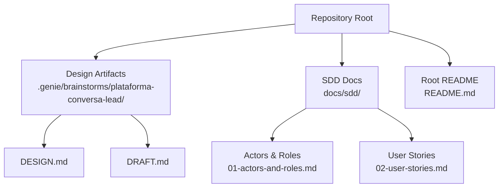
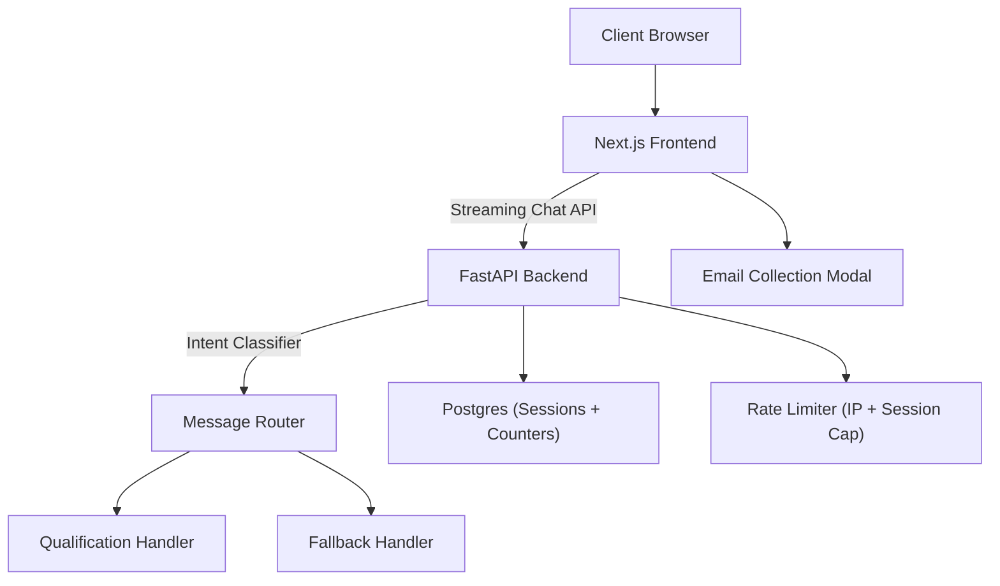
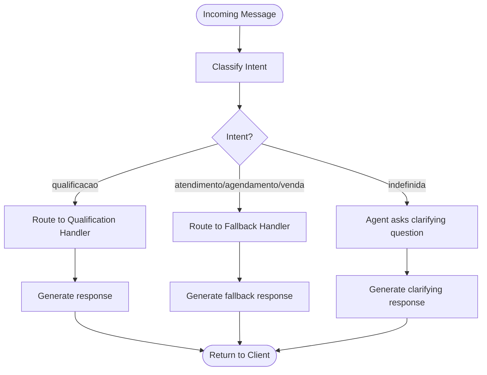
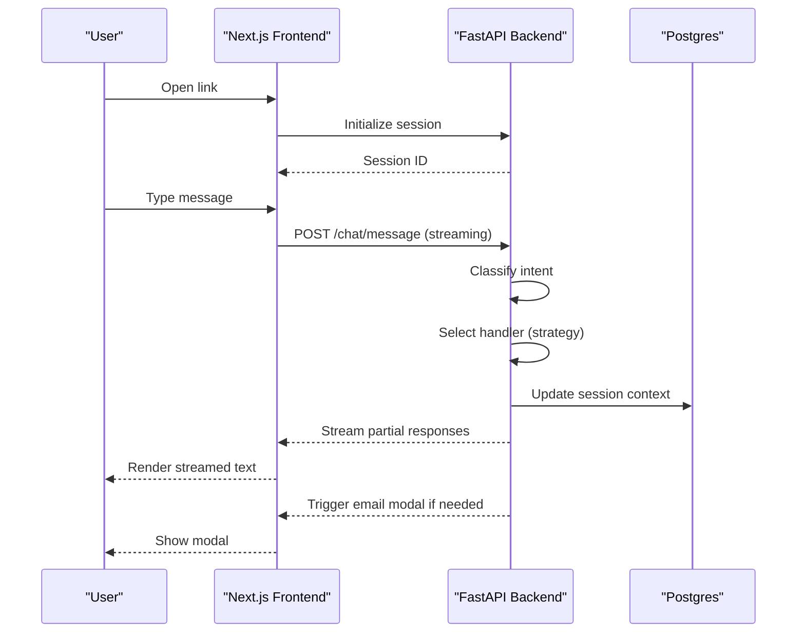
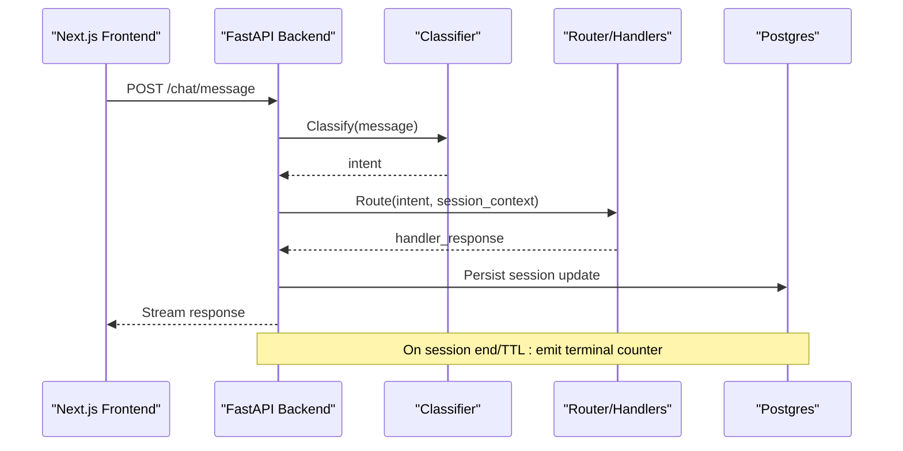
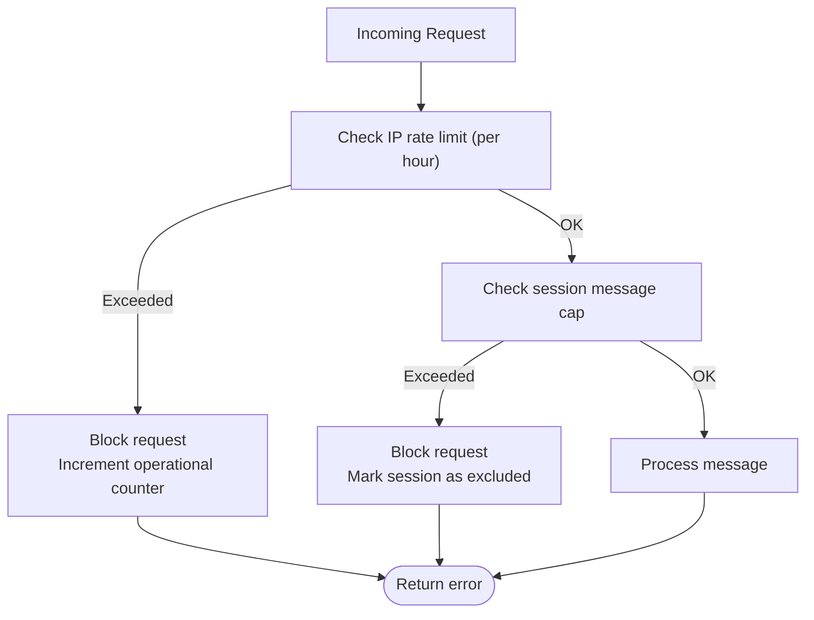
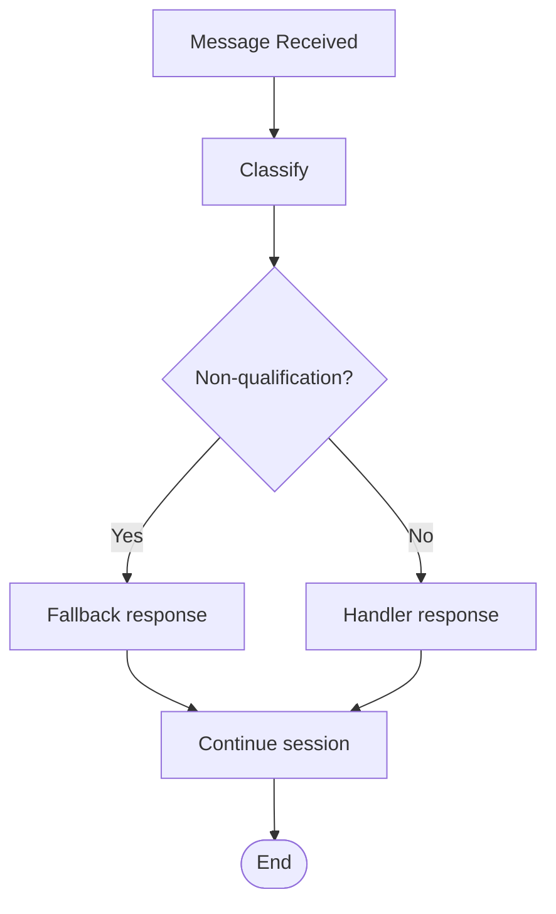
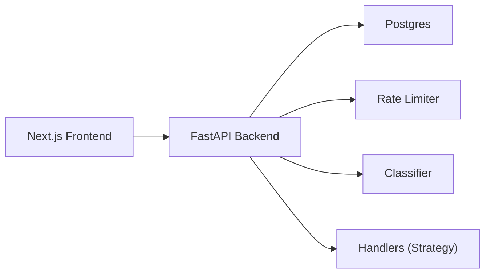

# Real-time Messaging Infrastructure

<cite>
**Referenced Files in This Document**
- [README.md](file://README.md)
- [01-actors-and-roles.md](file://docs/sdd/01-actors-and-roles.md)
- [02-user-stories.md](file://docs/sdd/02-user-stories.md)
- [DESIGN.md](file://.genie/brainstorms/plataforma-conversa-lead/DESIGN.md)
- [DRAFT.md](file://.genie/brainstorms/plataforma-conversa-lead/DRAFT.md)
</cite>

## Table of Contents
1. [Introduction](#introduction)
2. [Project Structure](#project-structure)
3. [Core Components](#core-components)
4. [Architecture Overview](#architecture-overview)
5. [Detailed Component Analysis](#detailed-component-analysis)
6. [Dependency Analysis](#dependency-analysis)
7. [Performance Considerations](#performance-considerations)
8. [Troubleshooting Guide](#troubleshooting-guide)
9. [Conclusion](#conclusion)

## Introduction
This document describes the real-time messaging infrastructure for a conversational interface that routes each user message through intent classification and handler selection, with streaming responses to the frontend. The system uses a Next.js frontend for the chat UI and a FastAPI backend for message processing, classification, routing, rate limiting, and session management. It also documents the strategy pattern used for conversation handlers, the per-message routing logic, and the error handling and retry strategies required for robust real-time chat.

The project is currently in early stages; this documentation synthesizes the design specifications and operational constraints defined in the repository’s design artifacts.

**Section sources**
- [README.md:1-8](file://README.md#L1-L8)

## Project Structure
At present, the repository contains design and planning artifacts rather than implementation code. The key files define the architecture, actors, user stories, and detailed design decisions for the messaging platform.

**Diagram sources**
- [DESIGN.md:189-203](file://.genie/brainstorms/plataforma-conversa-lead/DESIGN.md#L189-L203)
- [01-actors-and-roles.md:1-100](file://docs/sdd/01-actors-and-roles.md#L1-L100)
- [02-user-stories.md:1-211](file://docs/sdd/02-user-stories.md#L1-L211)

**Section sources**
- [DESIGN.md:189-203](file://.genie/brainstorms/plataforma-conversa-lead/DESIGN.md#L189-L203)
- [01-actors-and-roles.md:1-100](file://docs/sdd/01-actors-and-roles.md#L1-L100)
- [02-user-stories.md:1-211](file://docs/sdd/02/user-stories.md#L1-L211)

## Core Components
- Frontend (Next.js): Serves the landing page, renders the chat interface with streaming responses, and displays the contextual email collection modal when triggered by the backend.
- Backend (FastAPI): Implements the agent engine including intent classifier, conversation handlers, fallback logic, email validation, session promotion to durable lead, and rate limiting.
- Database (Postgres): Stores ephemeral sessions with TTL and aggregated counters without per-session PII or timestamps after termination.
- Rate Limiting: Protects the public LLM endpoint using IP-based limits and per-session caps.
- Strategy Pattern: Handlers are selected per message based on the current message’s intent, enabling independent evaluation and extensibility.

Key responsibilities:
- Message routing: Evaluate each incoming message independently for intent and route to the appropriate handler.
- Streaming responses: Deliver incremental updates to the client for a smooth chat experience.
- Session lifecycle: Manage anonymous sessions until identification, then promote to a durable lead record.
- Counters: Emit terminal aggregated counts at session end or TTL expiration.

**Section sources**
- [DESIGN.md:189-203](file://.genie/brainstorms/plataforma-conversa-lead/DESIGN.md#L189-L203)
- [DESIGN.md:225-233](file://.genie/brainstorms/plataforma-conversa-lead/DESIGN.md#L225-L233)
- [DESIGN.md:112-123](file://.genie/brainstorms/plataforma-conversa-lead/DESIGN.md#L112-L123)

## Architecture Overview
The system follows a clear separation between the Next.js frontend and the FastAPI backend, with Postgres as the single source of truth for sessions and counters.

**Diagram sources**
- [DESIGN.md:189-203](file://.genie/brainstorms/plataforma-conversa-lead/DESIGN.md#L189-L203)
- [DESIGN.md:225-233](file://.genie/brainstorms/plataforma-conversa-lead/DESIGN.md#L225-L233)
- [DESIGN.md:112-123](file://.genie/brainstorms/plataforma-conversa-lead/DESIGN.md#L112-L123)

## Detailed Component Analysis

### Message Routing and Strategy Pattern
Each message is evaluated independently for intent, and the router selects the appropriate handler for that turn. The qualification handler processes messages classified as qualification; other intents use a graceful fallback. Undefined intent triggers clarifying questions from the agent without invoking a handler.

**Diagram sources**
- [DESIGN.md:58-63](file://.genie/brainstorms/plataforma-conversa-lead/DESIGN.md#L58-L63)
- [DESIGN.md:77-85](file://.genie/brainstorms/plataforma-conversa-lead/DESIGN.md#L77-L85)
- [DESIGN.md:225-233](file://.genie/brainstorms/plataforma-conversa-lead/DESIGN.md#L225-L233)

**Section sources**
- [DESIGN.md:58-63](file://.genie/brainstorms/plataforma-conversa-lead/DESIGN.md#L58-L63)
- [DESIGN.md:77-85](file://.genie/brainstorms/plataforma-conversa-lead/DESIGN.md#L77-L85)
- [DESIGN.md:225-233](file://.genie/brainstorms/plataforma-conversa-lead/DESIGN.md#L225-L233)

### Streaming Chat Messages (Next.js Frontend)
The Next.js frontend serves the landing page, reads attribution parameters, and renders the chat interface with streaming responses. It also manages the contextual email collection modal triggered by the backend under specific conditions.

**Diagram sources**
- [DESIGN.md:189-203](file://.genie/brainstorms/plataforma-conversa-lead/DESIGN.md#L189-L203)
- [DESIGN.md:86-98](file://.genie/brainstorms/plataforma-conversa-lead/DESIGN.md#L86-L98)

**Section sources**
- [DESIGN.md:189-203](file://.genie/brainstorms/plataforma-conversa-lead/DESIGN.md#L189-L203)
- [DESIGN.md:86-98](file://.genie/brainstorms/plataforma-conversa-lead/DESIGN.md#L86-L98)

### FastAPI Backend Endpoints and Processing Logic
The backend implements:
- Message ingestion and classification
- Handler selection via strategy pattern
- Email validation and consent capture
- Session promotion to durable lead upon consent
- Terminal emission of aggregated counters at session end or TTL expiration

**Diagram sources**
- [DESIGN.md:225-233](file://.genie/brainstorms/plataforma-conversa-lead/DESIGN.md#L225-L233)
- [DESIGN.md:127-165](file://.genie/brainstorms/plataforma-conversa-lead/DESIGN.md#L127-L165)

**Section sources**
- [DESIGN.md:225-233](file://.genie/brainstorms/plataforma-conversa-lead/DESIGN.md#L225-L233)
- [DESIGN.md:127-165](file://.genie/brainstorms/plataforma-conversa-lead/DESIGN.md#L127-L165)

### Rate Limiting Mechanisms
Rate limiting protects the public LLM endpoint using:
- IP-based limit: 30 messages per hour
- Per-session message cap: determined from tenant history or an arbitrary ceiling if not authorized

Blocked requests are counted operationally by IP and day, separate from session counters.

**Diagram sources**
- [DESIGN.md:112-123](file://.genie/brainstorms/plataforma-conversa-lead/DESIGN.md#L112-L123)
- [DESIGN.md:159-165](file://.genie/brainstorms/plataforma-conversa-lead/DESIGN.md#L159-L165)

**Section sources**
- [DESIGN.md:112-123](file://.genie/brainstorms/plataforma-conversa-lead/DESIGN.md#L112-L123)
- [DESIGN.md:159-165](file://.genie/brainstorms/plataforma-conversa-lead/DESIGN.md#L159-L165)

### Error Handling Strategies and Retry Mechanisms
- Graceful fallback: Non-qualification intents receive a polite fallback that acknowledges the request and points to tenant contact without ending the session.
- Abstenção handling: Undefined intent triggers clarifying questions instead of invoking handlers.
- Session resilience: Sessions remain open after fallback; subsequent qualification messages resume the qualification flow.
- Operational safeguards: Blocked requests do not create session records; they increment operational counters for auditability.

**Diagram sources**
- [DESIGN.md:58-63](file://.genie/brainstorms/plataforma-conversa-lead/DESIGN.md#L58-L63)
- [DESIGN.md:77-85](file://.genie/brainstorms/plataforma-conversa-lead/DESIGN.md#L77-L85)

**Section sources**
- [DESIGN.md:58-63](file://.genie/brainstorms/plataforma-conversa-lead/DESIGN.md#L58-L63)
- [DESIGN.md:77-85](file://.genie/brainstorms/plataforma-conversa-lead/DESIGN.md#L77-L85)

### Performance Optimization Techniques
- Ephemeral sessions in Postgres with TTL avoid extra services while maintaining conversation context.
- Aggregated counters reduce storage overhead and protect privacy by avoiding per-session PII retention.
- Streaming responses improve perceived latency and user experience.
- Strategy-based routing minimizes coupling and allows independent evolution of handlers.

**Section sources**
- [DESIGN.md:189-203](file://.genie/brainstorms/plataforma-conversa-lead/DESIGN.md#L189-L203)
- [DESIGN.md:127-165](file://.genie/brainstorms/plataforma-conversa-lead/DESIGN.md#L127-L165)
- [DESIGN.md:225-233](file://.genie/brainstorms/plataforma-conversa-lead/DESIGN.md#L225-L233)

## Dependency Analysis
The system’s dependencies are intentionally minimal to keep the pilot lean:
- Next.js depends on FastAPI endpoints for message processing and streaming.
- FastAPI depends on Postgres for session state and counters.
- Rate limiter depends on IP tracking and session metadata.
- Handlers depend on the classifier output and session context.

**Diagram sources**
- [DESIGN.md:189-203](file://.genie/brainstorms/plataforma-conversa-lead/DESIGN.md#L189-L203)
- [DESIGN.md:225-233](file://.genie/brainstorms/plataforma-conversa-lead/DESIGN.md#L225-L233)

**Section sources**
- [DESIGN.md:189-203](file://.genie/brainstorms/plataforma-conversa-lead/DESIGN.md#L189-L203)
- [DESIGN.md:225-233](file://.genie/brainstorms/plataforma-conversa-lead/DESIGN.md#L225-L233)

## Performance Considerations
- Use streaming to reduce time-to-first-byte and improve responsiveness.
- Keep session state lightweight; rely on TTL to manage memory and storage.
- Aggregate counters to minimize database writes and preserve privacy.
- Apply rate limiting early to protect downstream LLM costs.
- Ensure handler implementations are efficient and idempotent where possible.

[No sources needed since this section provides general guidance]

## Troubleshooting Guide
Common issues and mitigations:
- Excessive fallback usage may indicate classifier drift; monitor fallback rates and revalidate classifier accuracy.
- High block rates by IP suggest abuse; review operational counters and adjust thresholds if necessary.
- Email modal not appearing: verify trigger conditions (intent captured, urgency/fit collected, or turn threshold).
- Session not promoting to lead: confirm consent capture and email validation outcomes.

Operational visibility:
- Monitor aggregated counters and weekly snapshots.
- Track blocked requests per IP per day for auditability.

**Section sources**
- [DESIGN.md:127-165](file://.genie/brainstorms/plataforma-conversa-lead/DESIGN.md#L127-L165)
- [DESIGN.md:159-165](file://.genie/brainstorms/plataforma-conversa-lead/DESIGN.md#L159-L165)

## Conclusion
The real-time messaging infrastructure is designed around per-message intent classification, strategy-based routing, streaming responses, and robust rate limiting. It balances simplicity with extensibility, ensuring a smooth user experience while protecting backend resources. The design emphasizes privacy-preserving counters, ephemeral sessions, and clear fallback behaviors. As the platform evolves, additional handlers and features can be integrated with minimal impact on existing components.

[No sources needed since this section summarizes without analyzing specific files]