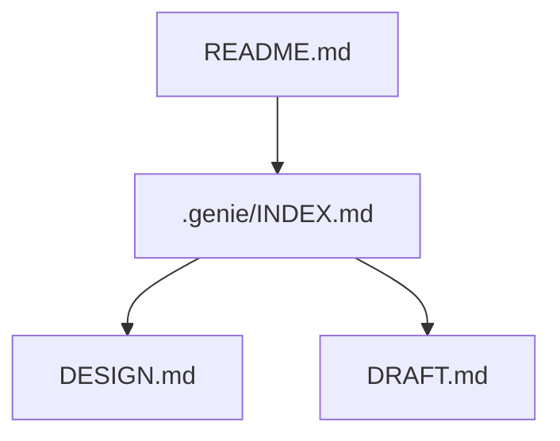
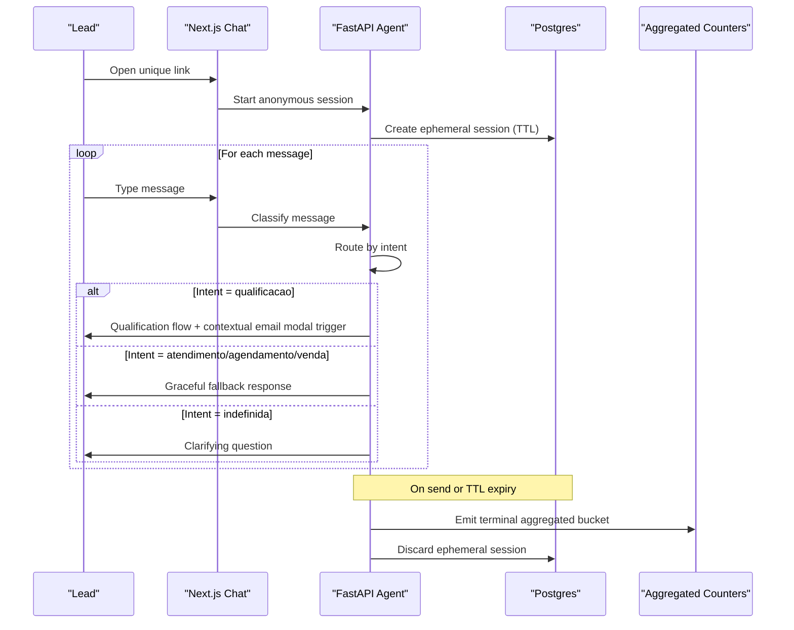
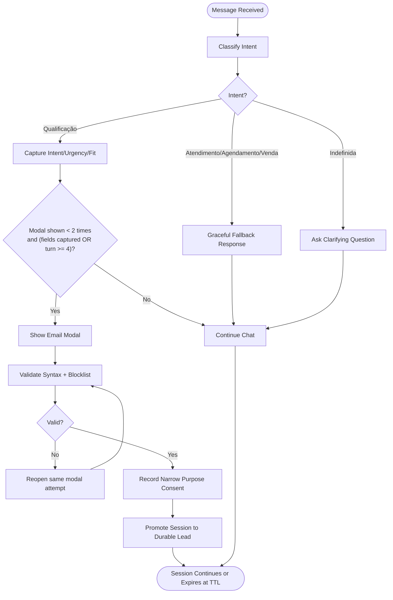
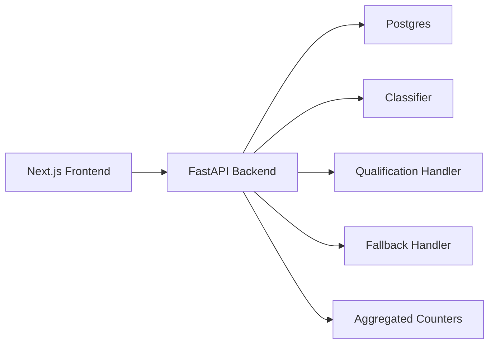

# Core Features

<cite>
**Referenced Files in This Document**
- [README.md](file://README.md)
- [INDEX.md](file://.genie/INDEX.md)
- [DESIGN.md](file://.genie/brainstorms/plataforma-conversa-lead/DESIGN.md)
- [DRAFT.md](file://.genie/brainstorms/plataforma-conversa-lead/DRAFT.md)
</cite>

## Table of Contents
1. [Introduction](#introduction)
2. [Project Structure](#project-structure)
3. [Core Components](#core-components)
4. [Architecture Overview](#architecture-overview)
5. [Detailed Component Analysis](#detailed-component-analysis)
6. [Dependency Analysis](#dependency-analysis)
7. [Performance Considerations](#performance-considerations)
8. [Troubleshooting Guide](#troubleshooting-guide)
9. [Conclusion](#conclusion)

## Introduction
This document describes the core features of the Sup Better Engine as defined by the project’s design artifacts. It focuses on:
- Conversational interface with an anonymous chat experience
- Real-time message processing and routing
- Contextual email collection modal
- Intent classification system (qualification, support, scheduling, sales, undefined)
- Lead management (qualification workflow, email validation and consent, durable lead records)
- Practical user workflows and expected system responses

The repository is in its initial phase; the authoritative feature specification is captured in the design documents.

**Section sources**
- [README.md:1-8](file://README.md#L1-L8)

## Project Structure
At this stage, the repository contains design and planning artifacts that define the product scope and behavior:
- README: project status note
- .genie/INDEX.md: plans index pointing to the active slice
- .genie/brainstorms/plataforma-conursa-lead/DESIGN.md: detailed design for Slice 1
- .genie/brainstorms/plataforma-conversa-lead/DRAFT.md: draft notes leading to the finalized design

**Diagram sources**
- [INDEX.md:1-12](file://.genie/INDEX.md#L1-L12)
- [DESIGN.md:1-20](file://.genie/brainstorms/plataforma-conversa-lead/DESIGN.md#L1-L20)
- [DRAFT.md:1-10](file://.genie/brainstorms/plataforma-conversa-lead/DRAFT.md#L1-L10)

**Section sources**
- [README.md:1-8](file://README.md#L1-L8)
- [INDEX.md:1-12](file://.genie/INDEX.md#L1-L12)

## Core Components
Slice 1 defines a minimal but complete flow:
- Anonymous chat via a unique link with attribution parameter
- Message intent classifier producing one of five labels
- Routing per message to either a qualification handler or a graceful fallback
- Contextual email modal triggered by the qualification handler under explicit conditions
- Email validation and consent-as-gate
- Promotion from ephemeral session to durable lead record
- Aggregated counters without PII

Key elements:
- Conversational interface: anonymous until identification; supports streaming chat
- Real-time processing: each message is classified and routed independently
- Intent categories: qualificacao, atendimento, agendamento, venda, indefinida
- Qualification handler: captures intent, urgency, fit; triggers contextual email request
- Fallback: recognizes non-qualification intents and points to tenant contact
- Email modal: appears after capturing key fields or at turn 4, up to two times per session
- Validation: syntax + blocklist; no confirmation code
- Consent: narrow purpose for commercial return about this conversation; sending = consent
- Durable lead: created on successful submission, deduplicated by normalized email
- Counters: terminal emission per session into categorical buckets

**Section sources**
- [DESIGN.md:47-166](file://.genie/brainstorms/plataforma-conversa-lead/DESIGN.md#L47-L166)
- [DESIGN.md:189-233](file://.genie/brainstorms/plataforma-conversa-lead/DESIGN.md#L189-L233)
- [DESIGN.md:339-367](file://.genie/brainstorms/plataforma-conversa-lead/DESIGN.md#L339-L367)

## Architecture Overview
High-level architecture and data flow:
- Frontend (Next.js): serves landing page, renders anonymous chat and email modal
- Backend (FastAPI): hosts agent engine (classifier, handlers, email validation, lead promotion)
- Database (Postgres): stores ephemeral sessions with TTL and durable leads
- Counters: aggregated, anonymous metrics emitted at session end or TTL expiry

**Diagram sources**
- [DESIGN.md:189-213](file://.genie/brainstorms/plataforma-conversa-lead/DESIGN.md#L189-L213)
- [DESIGN.md:225-233](file://.genie/brainstorms/plataforma-conversa-lead/DESIGN.md#L225-L233)
- [DESIGN.md:386-399](file://.genie/brainstorms/plataforma-conversa-lead/DESIGN.md#L386-L399)

## Detailed Component Analysis

### Conversational Interface and Real-Time Processing
- Anonymous entry: users start chatting without friction; identification happens later
- Streaming chat: frontend renders messages in real time
- Per-message routing: each message is classified and routed independently to ensure correct handler behavior even if intent changes mid-conversation
- Session aggregation for counting: the first non-undefined intent “sticks” for the session counter to avoid compounding classifier error across turns

Practical example:
- User says “Hi” → classified as undefined → agent asks clarifying question
- Later user says “I want to schedule” → classified as scheduling → fallback responds gracefully while session remains open
- If later user says “Qualify me” → qualification handler resumes

**Section sources**
- [DESIGN.md:47-85](file://.genie/brainstorms/plataforma-conversa-lead/DESIGN.md#L47-L85)
- [DESIGN.md:225-233](file://.genie/brainstorms/plataforma-conversa-lead/DESIGN.md#L225-L233)
- [DESIGN.md:386-391](file://.genie/brainstorms/plataforma-conversa-lead/DESIGN.md#L386-L391)

### Intent Classification System
- Classifier output: intencao ∈ {qualificacao, atendimento, agendamento, venda, indefinida}
- Undefined is an explicit abstention for greetings or messages without clear intent
- Routing rule: per-message routing ensures the current message determines the response path
- Measurement rule: session-level aggregation uses the first labeled intent to protect metric stability

Confidence scoring:
- The design specifies validation thresholds and reporting cadences rather than exposing per-message confidence scores to the UI. Classifier performance is measured against a labeled corpus and reported in descriptive and inferential layers depending on volume.

Practical example:
- “What are your prices?” → venda → fallback directs to tenant contact
- “Can I book a demo?” → agendamento → fallback directs to tenant contact
- “Just saying hi” → indefinida → agent asks what they need

**Section sources**
- [DESIGN.md:53-76](file://.genie/brainstorms/plataforma-conversa-lead/DESIGN.md#L53-L76)
- [DESIGN.md:391-395](file://.genie/brainstorms/plataforma-conversa-lead/DESIGN.md#L391-L395)
- [DESIGN.md:417-424](file://.genie/brainstorms/plataforma-conversa-lead/DESIGN.md#L417-L424)

### Contextual Email Collection Modal
- Trigger: qualification handler requests email after capturing intent, urgency, and fit, or at turn 4 if not yet captured
- Frequency: maximum two displays per session; retrying due to validation errors does not count as a new display
- Purpose: narrow — commercial return about this conversation only; marketing consent is out of scope for this slice
- Validation: syntax check + public blocklist of disposable domains; no confirmation code
- Consent: sending the email equals consent for the declared purpose; refusal means no submission

Practical example:
- After qualifying, modal offers commercial follow-up about this conversation
- User enters invalid email → modal reopens for correction (same attempt)
- User submits valid email → consent recorded; session promoted to durable lead

**Section sources**
- [DESIGN.md:86-111](file://.genie/brainstorms/plataforma-conversa-lead/DESIGN.md#L86-L111)
- [DESIGN.md:350-358](file://.genie/brainstorms/plataforma-conversa-lead/DESIGN.md#L350-L358)
- [DESIGN.md:395-397](file://.genie/brainstorms/plataforma-conversa-lead/DESIGN.md#L395-L397)

### Lead Management: Qualification Workflow, Validation, Consent, Durable Records
- Qualification workflow: captures intent, urgency, fit; then prompts for email under the conditions above
- Email validation: rejects invalid syntax and blocklisted domains; tracks state progression
- Consent gate: sending the email is the affirmative act of consent for the narrow purpose
- Durable lead: created upon successful submission; deduplicated by normalized email (trim + lowercase)
- Session lifecycle: ephemeral session persists during chat; discarded at TTL; terminal emission updates counters

Practical example:
- User qualifies → modal appears → submits valid email → becomes a durable lead
- Duplicate email (different case/spaces) merges into existing lead
- If user never submits email, session expires at TTL and contributes to counters

**Section sources**
- [DESIGN.md:99-111](file://.genie/brainstorms/plataforma-conversa-lead/DESIGN.md#L99-L111)
- [DESIGN.md:189-213](file://.genie/brainstorms/plataforma-conversa-lead/DESIGN.md#L189-L213)
- [DESIGN.md:395-399](file://.genie/brainstorms/plataforma-conversa-lead/DESIGN.md#L395-L399)

### Flowchart: Qualification and Email Modal Decision Logic

**Diagram sources**
- [DESIGN.md:53-85](file://.genie/brainstorms/plataforma-conversa-lead/DESIGN.md#L53-L85)
- [DESIGN.md:86-111](file://.genie/brainstorms/plataforma-conversa-lead/DESIGN.md#L86-L111)
- [DESIGN.md:350-358](file://.genie/brainstorms/plataforma-conversa-lead/DESIGN.md#L350-L358)

## Dependency Analysis
Component relationships:
- Next.js frontend depends on FastAPI backend for classification, routing, and lead operations
- FastAPI depends on Postgres for ephemeral sessions and durable leads
- Counters depend on terminal emissions from completed or expired sessions
- Classifier is a single-purpose unit with a stable interface; handlers plug behind a common contract

**Diagram sources**
- [DESIGN.md:189-213](file://.genie/brainstorms/plataforma-conversa-lead/DESIGN.md#L189-L213)
- [DESIGN.md:225-233](file://.genie/brainstorms/plataforma-conversa-lead/DESIGN.md#L225-L233)

**Section sources**
- [DESIGN.md:189-233](file://.genie/brainstorms/plataforma-conversa-lead/DESIGN.md#L189-L233)

## Performance Considerations
- Rate limiting: protects the LLM endpoint from abuse; enforced per IP and per session message cap
- TTL-based cleanup: ephemeral sessions are discarded after a fixed period, reducing storage and privacy exposure
- Aggregated counters: minimize overhead by emitting a single terminal metric per session instead of event streams
- Classifier cadence: per-message routing avoids misrouting mid-conversation; session-level aggregation prevents compounding measurement error

[No sources needed since this section provides general guidance]

## Troubleshooting Guide
Common issues and how the design addresses them:
- Misrouted messages: per-message routing ensures the latest intent drives the response; fallback is terminal per turn, not per session
- Excessive modal prompts: capped at two displays per session; retries do not count as new displays
- Invalid emails: validation rejects bad syntax and disposable domains; modal reopens for correction within the same attempt
- Overuse or abuse: rate limiting and session caps contain abusive traffic; blocked requests counted separately
- Metric divergence: monotonic email state field and terminal emissions ensure counters reflect reality without PII

Operational checks:
- Verify fallback isolation: non-qualification intents must not trigger qualification handler
- Confirm abstenção handling: undefined messages receive clarifying questions, not handlers
- Ensure terminal emissions occur for all sessions, including abandoned ones

**Section sources**
- [DESIGN.md:53-85](file://.genie/brainstorms/plataforma-conversa-lead/DESIGN.md#L53-L85)
- [DESIGN.md:386-399](file://.genie/brainstorms/plataforma-conversa-lead/DESIGN.md#L386-L399)

## Conclusion
Slice 1 delivers a focused, testable foundation:
- Anonymous chat with real-time, per-message classification and routing
- Contextual email modal with strict validation and narrow consent
- Robust lead creation and deduplication
- Privacy-preserving, aggregated metrics

The design intentionally defers richer features (live handoff, media, multi-tenant, bot detection) until evidence justifies investment, ensuring capital efficiency and clear go/no-go criteria.

[No sources needed since this section summarizes without analyzing specific files]