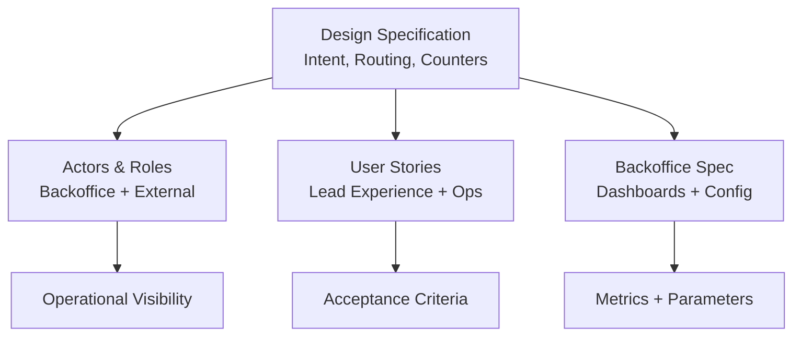
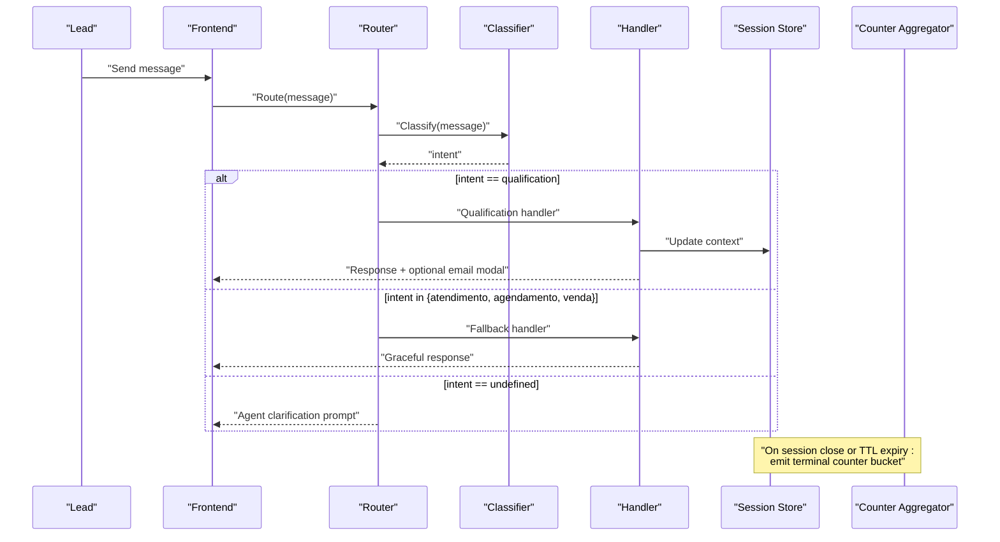
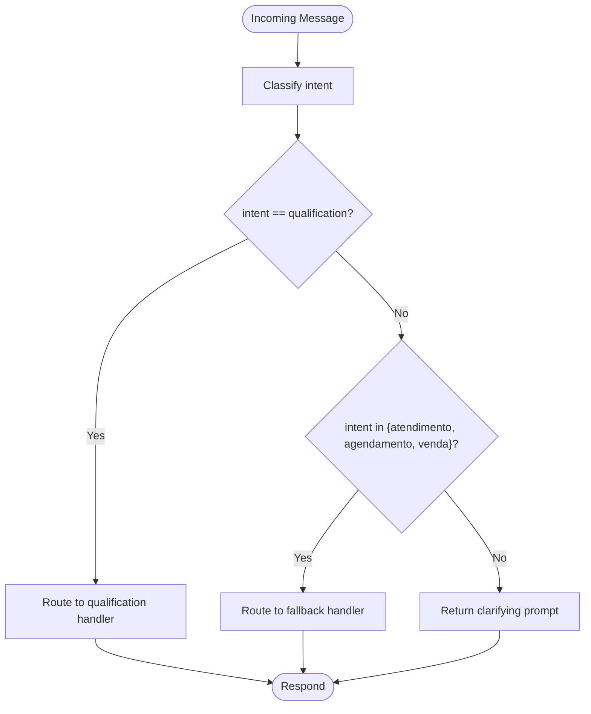
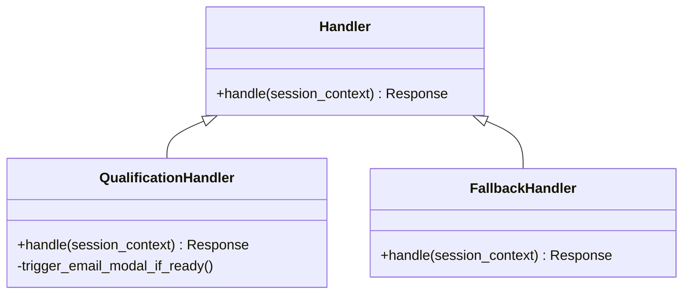
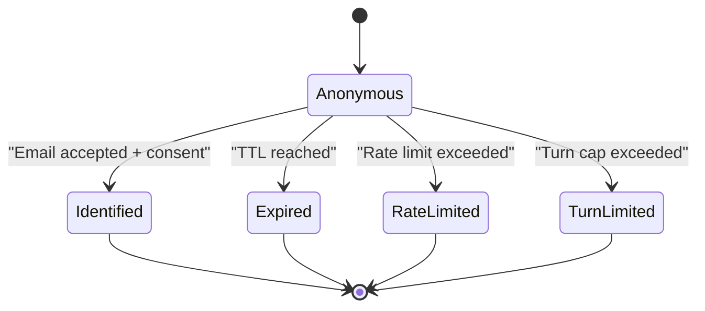
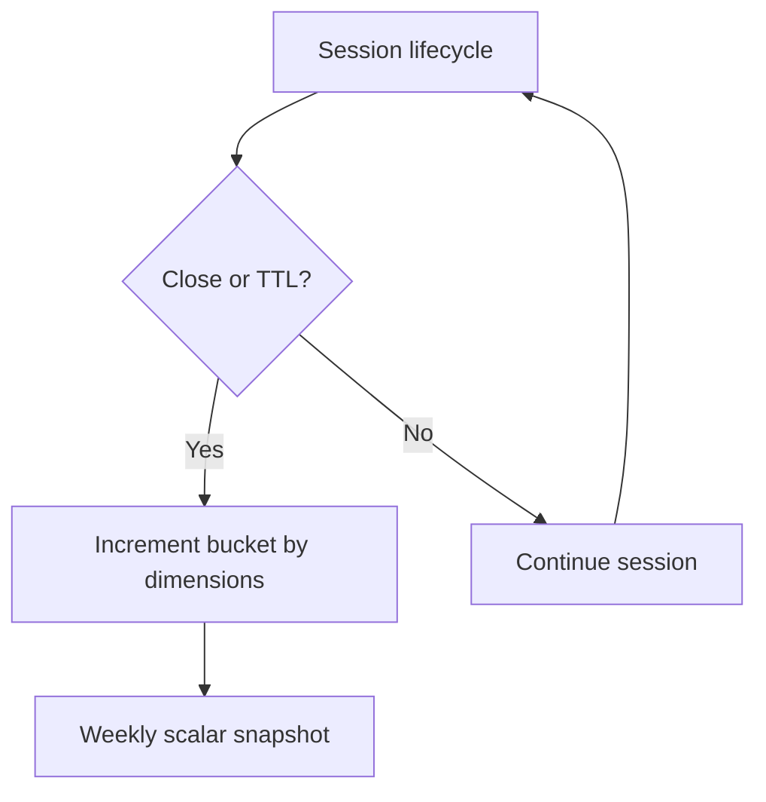
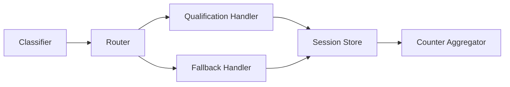

# Conversation Routing System

<cite>
**Referenced Files in This Document**
- [DESIGN.md](file://.genie/brainstorms/plataforma-conversa-lead/DESIGN.md)
- [01-actors-and-roles.md](file://docs/sdd/01-actors-and-roles.md)
- [02-user-stories.md](file://docs/sdd/02-user-stories.md)
- [03-functional-spec-backoffice.md](file://docs/sdd/03-functional-spec-backoffice.md)
</cite>

## Table of Contents
1. [Introduction](#introduction)
2. [Project Structure](#project-structure)
3. [Core Components](#core-components)
4. [Architecture Overview](#architecture-overview)
5. [Detailed Component Analysis](#detailed-component-analysis)
6. [Dependency Analysis](#dependency-analysis)
7. [Performance Considerations](#performance-considerations)
8. [Troubleshooting Guide](#troubleshooting-guide)
9. [Conclusion](#conclusion)

## Introduction
This document explains the conversation routing system that directs classified messages to appropriate handlers based on real-time intent analysis. It focuses on per-message routing decisions, session-level aggregation for counting, handler contracts, session context management, and state persistence across message exchanges. It also provides concrete routing scenarios, error handling strategies, performance considerations for real-time routing, load balancing approaches, and monitoring through analytics counters.

## Project Structure
The project is a design-first repository containing:
- A detailed design specification for the lead conversation platform (intent classification, routing, handlers, email collection, counters).
- Actor and role definitions for backoffice and external users.
- User stories aligned with the design scope.
- Backoffice functional specifications including dashboards, metrics, and configuration.

**Section sources**
- [DESIGN.md:47-166](file://.genie/brainstorms/plataforma-conversa-lead/DESIGN.md#L47-L166)
- [01-actors-and-roles.md:8-30](file://docs/sdd/01-actors-and-roles.md#L8-L30)
- [02-user-stories.md:8-55](file://docs/sdd/02-user-stories.md#L8-L55)
- [03-functional-spec-backoffice.md:8-23](file://docs/sdd/03-functional-spec-backoffice.md#L8-L23)

## Core Components
- Intent classifier: maps each incoming message to an intent label from a fixed set, including an explicit abstention category for undefined messages.
- Router: evaluates the current message’s intent independently at every turn and selects the appropriate handler.
- Handlers:
  - Qualification handler: collects structured information about need, urgency, and fit; triggers contextual email collection when conditions are met.
  - Graceful fallback handler: acknowledges non-qualification intents and points to tenant contact without pretending capabilities that do not exist.
- Session context manager: maintains ephemeral session state while the user is anonymous, enforces TTL, rate limits, and turn caps, and promotes to a durable lead upon successful identification.
- Counter aggregator: emits a single terminal aggregate per session at close or TTL expiry, incrementing pre-aggregated buckets by dimensions such as source, intent, email state, and validity status.

Key behaviors:
- Per-message routing re-evaluated every turn; session-level aggregation only affects counters, not runtime behavior.
- Abstention messages receive clarifying prompts from the agent without invoking any handler.
- Email modal is triggered by the qualification handler under defined conditions and limited to a maximum number of displays per session.

**Section sources**
- [DESIGN.md:51-85](file://.genie/brainstorms/plataforma-conversa-lead/DESIGN.md#L51-L85)
- [DESIGN.md:86-127](file://.genie/brainstorms/plataforma-conversa-lead/DESIGN.md#L86-L127)
- [DESIGN.md:127-166](file://.genie/brainstorms/plataforma-conversa-lead/DESIGN.md#L127-L166)
- [02-user-stories.md:19-36](file://docs/sdd/02-user-stories.md#L19-L36)

## Architecture Overview
High-level flow:
- The client opens a unique link and starts chatting anonymously.
- Each message is classified into an intent.
- The router selects a handler based on the current message’s intent:
  - Qualification → qualification handler.
  - Other intents → graceful fallback handler.
  - Undefined → agent clarification prompt.
- The session persists until TTL or termination; counters emit once at close/TTL.

**Diagram sources**
- [DESIGN.md:51-85](file://.genie/brainstorms/plataforma-conversa-lead/DESIGN.md#L51-L85)
- [DESIGN.md:127-166](file://.genie/brainstorms/plataforma-conversa-lead/DESIGN.md#L127-L166)

**Section sources**
- [DESIGN.md:47-166](file://.genie/brainstorms/plataforma-conversa-lead/DESIGN.md#L47-L166)

## Detailed Component Analysis

### Per-Message Routing Logic
- Re-evaluation: The router decides the responder based on the intent of the current message, not on prior turns.
- Branches:
  - Qualification: route to the qualification handler.
  - Other intents: route to the graceful fallback handler.
  - Undefined: return a clarifying question from the agent; no handler invoked.
- Session intent inheritance applies only to counters: the first non-undefined intent labels the session for measurement purposes.

**Diagram sources**
- [DESIGN.md:51-85](file://.genie/brainstorms/plataforma-conversa-lead/DESIGN.md#L51-L85)

**Section sources**
- [DESIGN.md:51-85](file://.genie/brainstorms/plataforma-conversa-lead/DESIGN.md#L51-L85)

### Handler Contract Interface
- Input: current session context (message history, metadata like source, turn count, email state).
- Output: a response suitable for streaming to the frontend, optionally triggering UI actions (e.g., email modal).
- Guarantees:
  - Qualification handler may request email after capturing required fields or at a defined turn cap.
  - Fallback handler must not promise capabilities outside scope and must remain terminal for the turn but not the session.
  - Both handlers should be idempotent with respect to side effects and safe to retry where applicable.

**Diagram sources**
- [DESIGN.md:77-98](file://.genie/brainstorms/plataforma-conversa-lead/DESIGN.md#L77-L98)

**Section sources**
- [DESIGN.md:77-98](file://.genie/brainstorms/plataforma-conversa-lead/DESIGN.md#L77-L98)

### Session Context Management and State Persistence
- Ephemeral sessions persist in a database with TTL enforcement; they hold conversation context while the user is anonymous.
- On successful identification (email submission with consent), the session is promoted to a durable lead record with normalized email and recorded consent purpose.
- Non-identified sessions are discarded at TTL; transcripts are not retained beyond TTL.
- Monotonic email state field tracks progression and records the maximum achieved state during the session.

**Diagram sources**
- [DESIGN.md:112-127](file://.genie/brainstorms/plataforma-conversa-lead/DESIGN.md#L112-L127)
- [DESIGN.md:198-223](file://.genie/brainstorms/plataforma-conversa-lead/DESIGN.md#L198-L223)

**Section sources**
- [DESIGN.md:112-127](file://.genie/brainstorms/plataforma-conversa-lead/DESIGN.md#L112-L127)
- [DESIGN.md:198-223](file://.genie/brainstorms/plataforma-conversa-lead/DESIGN.md#L198-L223)

### Counter Aggregation and Analytics
- Terminal emission: each session emits one aggregated counter increment at close or TTL expiry.
- Dimensions include source, intent, email state, and validity status; these form low-cardinality buckets.
- Weekly snapshots store a scalar total of valid sessions for trend computation.
- Edge counters track blocking events by IP and day separately from session buckets.

**Diagram sources**
- [DESIGN.md:127-166](file://.genie/brainstorms/plataforma-conversa-lead/DESIGN.md#L127-L166)

**Section sources**
- [DESIGN.md:127-166](file://.genie/brainstorms/plataforma-conversa-lead/DESIGN.md#L127-L166)

### Concrete Routing Scenarios
- Scenario A: First message is “qualificacao” → routed to qualification handler; if it captures required fields, email modal may appear; session intent for counters becomes “qualificacao”.
- Scenario B: Later message is “agendamento” → routed to fallback handler; session remains open; subsequent “qualificacao” returns to qualification handler.
- Scenario C: Message is “oi” → classified as undefined → agent asks clarifying question; session intent for counters remains unset until a non-undefined intent appears.
- Scenario D: Multiple fallbacks followed by qualification → fallbacks are terminal per turn; session continues; eventual qualification resumes normal flow.

**Section sources**
- [DESIGN.md:51-85](file://.genie/brainstorms/plataforma-conversa-lead/DESIGN.md#L51-L85)
- [02-user-stories.md:19-36](file://docs/sdd/02-user-stories.md#L19-L36)

### Error Handling When Handlers Fail
- Fallback isolation: even if the session was counted as “qualificacao”, non-qualification messages must still go to the fallback handler for that turn.
- Graceful degradation: if a handler fails to respond, the router should return a safe fallback response and log the failure for observability.
- Retry policy: apply bounded retries for transient errors; avoid infinite loops and ensure timeouts.
- Observability: instrument handler invocation counts, error rates, and latency; surface via backoffice dashboards.

**Section sources**
- [DESIGN.md:77-85](file://.genie/brainstorms/plataforma-conversa-lead/DESIGN.md#L77-L85)
- [03-functional-spec-backoffice.md:153-167](file://docs/sdd/03-functional-spec-backoffice.md#L153-L167)

## Dependency Analysis
- Classifier depends on a stable intent taxonomy and is tested against labeled data.
- Router depends on the classifier output and delegates to handlers via a common contract.
- Handlers depend on session context and may trigger email modal logic governed by conditions and display caps.
- Session store depends on TTL policies and promotes to durable leads upon identification.
- Counter aggregator depends on session lifecycle events and emits terminal aggregates.

**Diagram sources**
- [DESIGN.md:51-85](file://.genie/brainstorms/plataforma-conversa-lead/DESIGN.md#L51-L85)
- [DESIGN.md:127-166](file://.genie/brainstorms/plataforma-conversa-lead/DESIGN.md#L127-L166)

**Section sources**
- [DESIGN.md:51-85](file://.genie/brainstorms/plataforma-conversa-lead/DESIGN.md#L51-L85)
- [DESIGN.md:127-166](file://.genie/brainstorms/plataforma-conversa-lead/DESIGN.md#L127-L166)

## Performance Considerations
- Real-time routing: keep classifier and router lightweight; cache classifier outputs for identical inputs when safe; use streaming responses to reduce perceived latency.
- Load balancing: distribute handler instances horizontally; ensure idempotent operations; use queues for heavy tasks (e.g., email validation, lead promotion).
- Rate limiting and turn caps: protect LLM endpoints and manage resource usage; enforce per-IP and per-session limits.
- TTL-based cleanup: schedule periodic scans to expire sessions and emit counters; avoid blocking hot paths.
- Monitoring: expose handler latency, error rates, intent distribution, and counter increments; integrate with backoffice dashboards.

[No sources needed since this section provides general guidance]

## Troubleshooting Guide
Common issues and mitigations:
- Misclassification leading to wrong handler: validate classifier accuracy thresholds; monitor intent distribution drift; adjust prompts or model inputs.
- Stuck sessions: check TTL enforcement and background jobs; verify counter emissions on close/TTL.
- Excessive fallbacks: investigate classifier abstention rate; ensure undefined messages receive clarifying prompts.
- Email modal not appearing: confirm qualification handler conditions and turn cap; verify display limits per session.
- Counter discrepancies: reconcile terminal emissions with session lifecycle; ensure weekly snapshots reflect valid sessions.

**Section sources**
- [DESIGN.md:51-85](file://.genie/brainstorms/plataforma-conversa-lead/DESIGN.md#L51-L85)
- [DESIGN.md:127-166](file://.genie/brainstorms/plataforma-conversa-lead/DESIGN.md#L127-L166)
- [03-functional-spec-backoffice.md:153-167](file://docs/sdd/03-functional-spec-backoffice.md#L153-L167)

## Conclusion
The routing system ensures accurate, per-message handler selection while preserving session-level metrics for measurement. By separating routing cadence from aggregation cadence, it avoids compounding classifier errors and keeps the agent experience responsive. The design includes robust safeguards: explicit abstention, graceful fallbacks, TTL-based cleanup, and pre-aggregated counters. Operational visibility and configurable parameters enable continuous improvement and risk control throughout the pilot.

[No sources needed since this section summarizes without analyzing specific files]