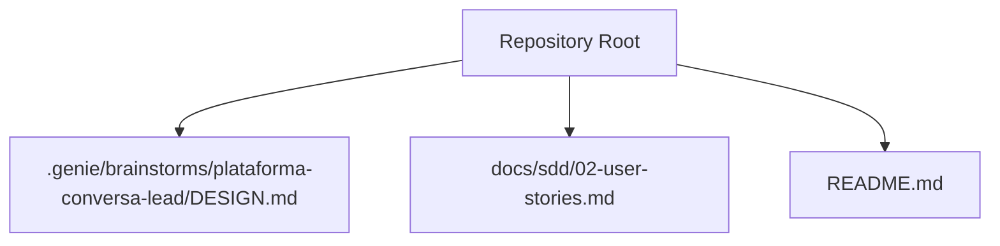
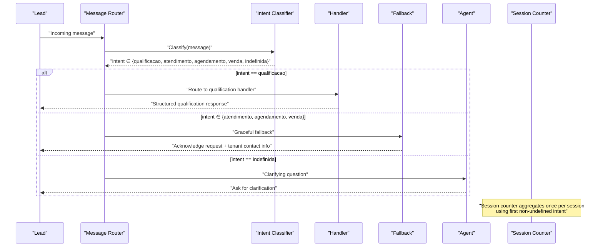
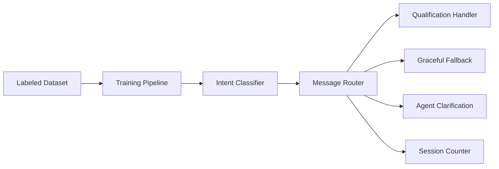

# Intent Classification Algorithms

<cite>
**Referenced Files in This Document**
- [README.md](file://README.md)
- [DESIGN.md](file://.genie/brainstorms/plataforma-conversa-lead/DESIGN.md)
- [02-user-stories.md](file://docs/sdd/02-user-stories.md)
</cite>

## Table of Contents
1. [Introduction](#introduction)
2. [Project Structure](#project-structure)
3. [Core Components](#core-components)
4. [Architecture Overview](#architecture-overview)
5. [Detailed Component Analysis](#detailed-component-analysis)
6. [Dependency Analysis](#dependency-analysis)
7. [Performance Considerations](#performance-considerations)
8. [Troubleshooting Guide](#troubleshooting-guide)
9. [Conclusion](#conclusion)
10. [Appendices](#appendices)

## Introduction
This document specifies the five-category intent classification system used to route incoming lead messages into qualification, support (atendimento), scheduling (agendamento), sales (venda), or undefined (indefinida). It explains the classification algorithms conceptually, confidence scoring and decision boundaries as defined by validation criteria, training data requirements, and continuous learning practices for maintaining accuracy over time. The “undefined” category is an explicit abstention that captures greetings and messages without clear intent to prevent forced misclassification.

The system is designed so that routing is re-evaluated per message, while session-level aggregation uses only the first non-undefined label for counting purposes. This separation protects both user experience and metric integrity.

**Section sources**
- [DESIGN.md:53-76](file://.genie/brainstorms/plataforma-conversa-lead/DESIGN.md#L53-L76)

## Project Structure
At a high level, this repository contains design and documentation artifacts that define the intent classifier’s scope, behavior, and success criteria. There are no implementation files present; the classifier is described as a single-purpose unit with an explicit interface mapping a message to an intent.

**Diagram sources**
- [README.md:1-8](file://README.md#L1-L8)
- [DESIGN.md:1-10](file://.genie/brainstorms/plataforma-conversa-lead/DESIGN.md#L1-L10)

**Section sources**
- [README.md:1-8](file://README.md#L1-L8)

## Core Components
- Intent Classifier: A single-purpose module that maps each incoming message to one of five intents:
  - Qualification (qualificacao)
  - Support (atendimento)
  - Scheduling (agendamento)
  - Sales (venda)
  - Undefined (indefinida) — explicit abstention for greetings and unclear messages
- Routing Layer: Re-evaluates intent per message to select the appropriate handler:
  - Qualification → real handler
  - Support/Scheduling/Sales → graceful fallback
  - Undefined → clarifying question from the agent
- Session Aggregation: For counters, the session inherits the first non-undefined intent label; if none, it remains undefined. This rule applies only to counting, not to runtime routing.

These components ensure that routing stays responsive to conversation context while metrics remain stable and unbiased by repeated classification errors across turns.

**Section sources**
- [DESIGN.md:53-76](file://.genie/brainstorms/plataforma-conversa-lead/DESIGN.md#L53-L76)
- [DESIGN.md:225-232](file://.genie/brainstorms/plataforma-conversa-lead/DESIGN.md#L225-L232)

## Architecture Overview
The end-to-end flow for a message involves classification, routing, and optional session aggregation for counters.

**Diagram sources**
- [DESIGN.md:53-76](file://.genie/brainstorms/plataforma-conversa-lead/DESIGN.md#L53-L76)
- [DESIGN.md:225-232](file://.genie/brainstorms/plataforma-conversa-lead/DESIGN.md#L225-L232)

## Detailed Component Analysis

### Intent Classifier Design
- Input: raw message text
- Output: single intent label
- Categories:
  - Qualification: discovery of need, urgency, fit
  - Support: requests handled via graceful fallback
  - Scheduling: requests handled via graceful fallback
  - Sales: requests handled via graceful fallback
  - Undefined: explicit abstention for greetings (“oi”, “bom dia”) and messages without clear intent
- Routing policy:
  - Per-message routing ensures the correct handler responds even if earlier turns had different intents
  - Session-level aggregation uses only the first non-undefined label for counting to avoid compounding error rates

Training and validation criteria:
- Minimum labeled dataset: ≥ 125 messages
  - ≥ 25 per real intent (qualification, support, scheduling, sales)
  - ≥ 25 examples of abstention (greetings, “oi”, messages without intent)
- Accuracy thresholds:
  - Real intents: ≥ 85% accuracy on the four real intents
  - Abstention protection: greetings must not be classified as one of the four real intents in more than 15% of cases (false positive rate for greetings ≤ 15%)
- Corpus source:
  - Preferred: de-identified historical WhatsApp messages from the pilot tenant
  - Alternative: synthetic corpus allowed with documented limitation

Continuous learning and retraining:
- Monitor production intent distribution and fallback usage as signals of drift
- Retrain when:
  - Validation metrics drop below thresholds
  - Distribution shifts indicate new intent patterns
  - Volume reaches inferential layer thresholds enabling statistical triggers
- Maintain separate cadences:
  - Routing re-evaluation per message
  - Session aggregation once per session using first non-undefined label

Quality assurance:
- Isolated testing of the classifier with labeled datasets
- Guardrails against forcing labels onto noise via the undefined category
- Regular audits of false positives on greetings and misclassifications into real intents

**Section sources**
- [DESIGN.md:53-76](file://.genie/brainstorms/plataforma-conversa-lead/DESIGN.md#L53-L76)
- [DESIGN.md:225-232](file://.genie/brainstorms/plataforma-conversa-lead/DESIGN.md#L225-L232)
- [DESIGN.md:386-394](file://.genie/brainstorms/plataforma-conversa-lead/DESIGN.md#L386-L394)

### Routing and Fallback Behavior
- Routing is per-message:
  - Qualification → real handler
  - Support/Scheduling/Sales → graceful fallback
  - Undefined → clarifying question from the agent
- Fallback is terminal for the turn but not for the session:
  - Allows the conversation to continue and potentially return to qualification later
- Session aggregation:
  - Uses the first non-undefined intent for counting
  - Prevents compounding classification errors across multiple turns

Edge cases:
- A message arriving after the session has been counted as qualification is still routed correctly per message
- Undefined messages do not fix the session’s intent for counting

**Section sources**
- [DESIGN.md:53-76](file://.genie/brainstorms/plataforma-conversa-lead/DESIGN.md#L53-L76)
- [DESIGN.md:386-394](file://.genie/brainstorms/plataforma-conversa-lead/DESIGN.md#L386-L394)

### Training Data Requirements
- Minimum size: ≥ 125 labeled messages
- Distribution:
  - ≥ 25 per real intent (qualification, support, scheduling, sales)
  - ≥ 25 abstention examples (greetings, “oi”, messages without intent)
- Source:
  - De-identified historical WhatsApp messages from the pilot tenant preferred
  - Synthetic corpus acceptable with documented limitations

Validation criteria:
- Real intents: ≥ 85% accuracy
- Abstention protection: greetings misclassified as real intents ≤ 15%

**Section sources**
- [DESIGN.md:386-394](file://.genie/brainstorms/plataforma-conversa-lead/DESIGN.md#L386-L394)

### Confidence Scoring and Decision Boundaries
- The classifier emits a single intent label per message
- Decision boundary is enforced through validation thresholds:
  - ≥ 85% accuracy on real intents
  - ≤ 15% false positive rate for greetings (misclassification into real intents)
- These thresholds act as acceptance gates for model deployment and retraining decisions

Operational note:
- While the classifier outputs a single label, confidence scoring should inform:
  - Threshold-based rejection to undefined when uncertain
  - Monitoring of drift via confidence distributions over time

**Section sources**
- [DESIGN.md:386-394](file://.genie/brainstorms/plataforma-conversa-lead/DESIGN.md#L386-L394)

### Classification Scenarios and Edge Cases
- Scenario: Greeting (“oi”, “bom dia”)
  - Expected: undefined (abstention)
  - Boundary: Must not be classified as any real intent in > 15% of cases
- Scenario: Request for scheduling
  - Expected: agendamento
  - Routing: graceful fallback acknowledging request and providing tenant contact
- Scenario: Request for support
  - Expected: atendimento
  - Routing: graceful fallback acknowledging request and providing tenant contact
- Scenario: Sales inquiry
  - Expected: venda
  - Routing: graceful fallback acknowledging request and providing tenant contact
- Scenario: Ambiguous message without clear intent
  - Expected: undefined (abstention)
  - Action: clarifying question from the agent
- Edge case: Message arrives after session counted as qualification
  - Routing still re-evaluates per message; fallback applies if intent changed
- Edge case: Multiple intents within a session
  - Counting uses first non-undefined label; routing remains per-message

**Section sources**
- [DESIGN.md:53-76](file://.genie/brainstorms/plataforma-conversa-lead/DESIGN.md#L53-L76)
- [DESIGN.md:386-394](file://.genie/brainstorms/plataforma-conversa-lead/DESIGN.md#L386-L394)

### Model Performance Metrics
- Accuracy on real intents: ≥ 85%
- False positive rate for greetings: ≤ 15%
- Production monitoring:
  - Track intent distribution among engaged sessions
  - Monitor fallback usage as a signal of misclassification or unmet demand
  - Use inferential layer (when N ≥ 200) to evaluate intent proportions with confidence intervals

**Section sources**
- [DESIGN.md:386-394](file://.genie/brainstorms/plataforma-conversa-lead/DESIGN.md#L386-L394)
- [DESIGN.md:417-423](file://.genie/brainstorms/plataforma-conversa-lead/DESIGN.md#L417-L423)

### Continuous Learning and Retraining Triggers
- Continuous learning approach:
  - Periodic retraining with updated labeled data
  - Incorporate new intent patterns observed in production
  - Maintain abstention examples to protect against forced misclassification
- Retraining triggers:
  - Validation metrics drop below thresholds
  - Significant shifts in intent distribution
  - Increased fallback usage indicating unmet demand
  - Inferential layer thresholds reached enabling statistical evaluation
- Quality assurance:
  - Isolated classifier tests with labeled datasets
  - Audits of greeting misclassification rates
  - Documentation of corpus source and limitations

**Section sources**
- [DESIGN.md:386-394](file://.genie/brainstorms/plataforma-conversa-lead/DESIGN.md#L386-L394)
- [DESIGN.md:417-423](file://.genie/brainstorms/plataforma-conversa-lead/DESIGN.md#L417-L423)

## Dependency Analysis
The classifier depends on:
- Labeled training data (real intents and abstention examples)
- Validation pipeline enforcing accuracy and false positive thresholds
- Routing layer that consumes classifier output per message
- Session aggregation logic that uses first non-undefined label for counting

**Diagram sources**
- [DESIGN.md:53-76](file://.genie/brainstorms/plataforma-conversa-lead/DESIGN.md#L53-L76)
- [DESIGN.md:225-232](file://.genie/brainstorms/plataforma-conversa-lead/DESIGN.md#L225-L232)
- [DESIGN.md:386-394](file://.genie/brainstorms/plataforma-conversa-lead/DESIGN.md#L386-L394)

**Section sources**
- [DESIGN.md:53-76](file://.genie/brainstorms/plataforma-conversa-lead/DESIGN.md#L53-L76)
- [DESIGN.md:225-232](file://.genie/brainstorms/plataforma-conversa-lead/DESIGN.md#L225-L232)
- [DESIGN.md:386-394](file://.genie/brainstorms/plataforma-conversa-lead/DESIGN.md#L386-L394)

## Performance Considerations
- Avoid compounding classification errors by aggregating at session level using the first non-undefined label
- Protect metric integrity by keeping routing per-message and counting per-session
- Monitor intent distribution and fallback usage to detect drift early
- Use inferential layer thresholds to enable statistically meaningful evaluations when volume permits

[No sources needed since this section provides general guidance]

## Troubleshooting Guide
Common issues and resolutions:
- Greetings misclassified as real intents:
  - Increase abstention examples in training data
  - Enforce false positive threshold ≤ 15%
- Excessive fallback usage:
  - Investigate whether new intent patterns require additional handlers
  - Review classifier accuracy on support/scheduling/sales categories
- Session intent mismatch between routing and counting:
  - Ensure counting uses first non-undefined label
  - Verify routing re-evaluates per message
- Low engagement or high undefined rate:
  - Improve clarifying questions for undefined messages
  - Expand abstention examples to better capture ambiguous inputs

**Section sources**
- [DESIGN.md:53-76](file://.genie/brainstorms/plataforma-conversa-lead/DESIGN.md#L53-L76)
- [DESIGN.md:386-394](file://.genie/brainstorms/plataforma-conversa-lead/DESIGN.md#L386-L394)

## Conclusion
The five-category intent classification system centers on a robust abstention mechanism to prevent forced misclassification, ensuring accurate routing and reliable metrics. With strict training data requirements and validation thresholds, the system maintains high accuracy on real intents while protecting against false positives on greetings. Continuous learning and retraining processes, guided by production monitoring and inferential thresholds, help sustain performance over time.

[No sources needed since this section summarizes without analyzing specific files]

## Appendices

### User Story Alignment
- The classifier enables users to receive intent-appropriate responses:
  - Qualification → structured questions
  - Non-qualification intents → graceful fallback
  - Undefined → clarifying question

**Section sources**
- [02-user-stories.md:19-26](file://docs/sdd/02-user-stories.md#L19-L26)