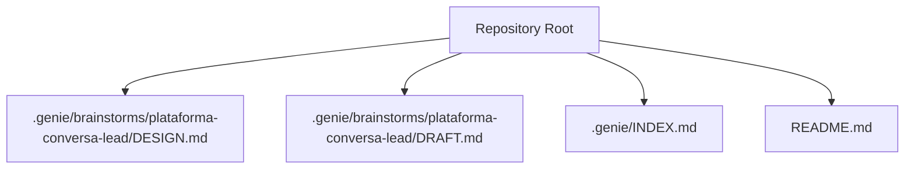
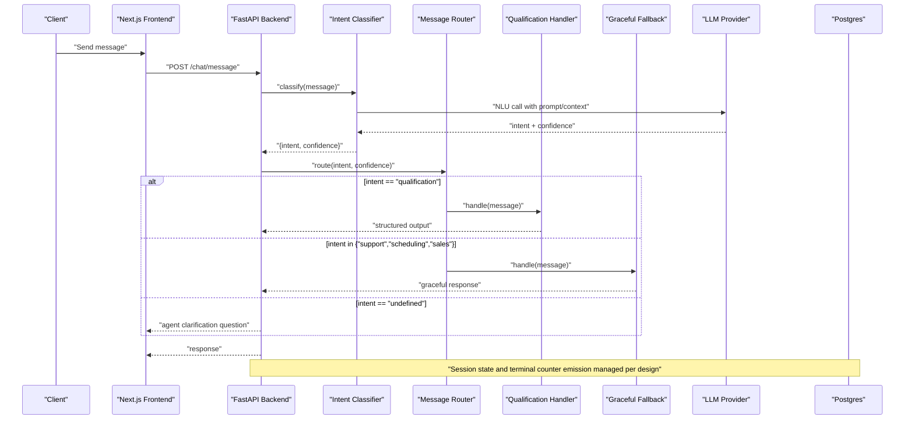
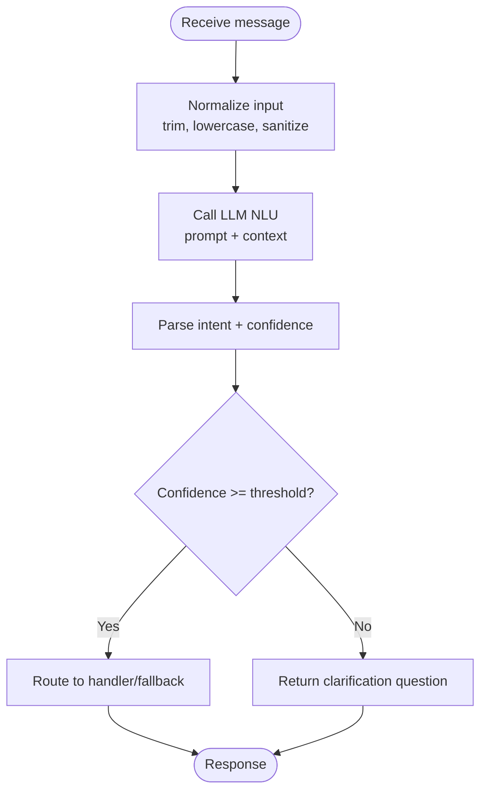
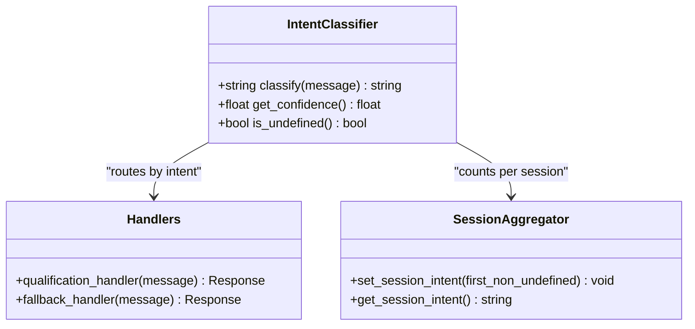
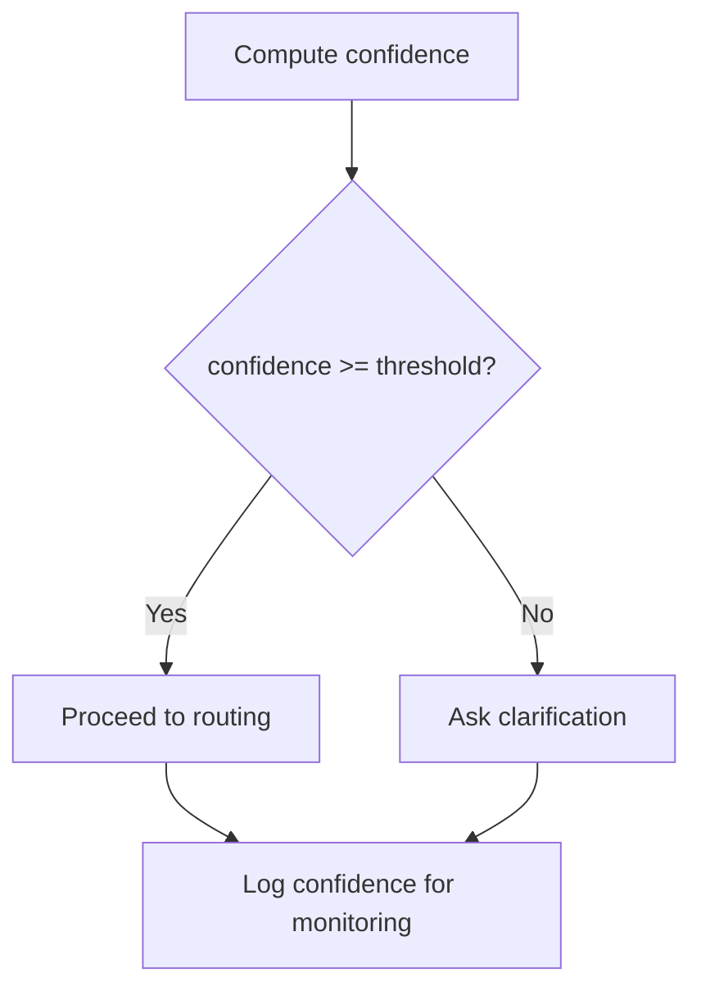
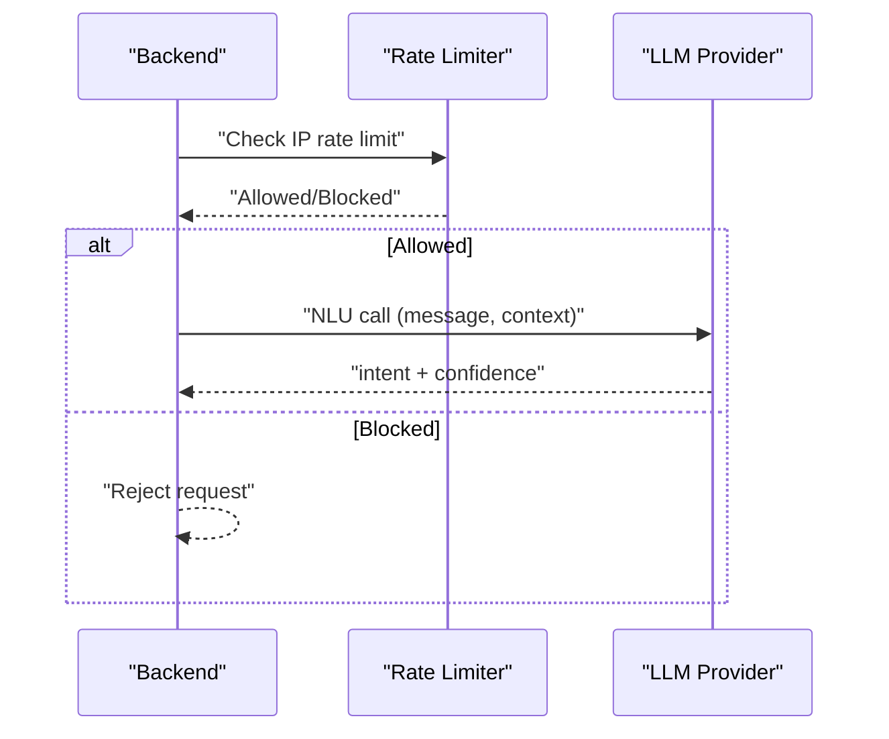
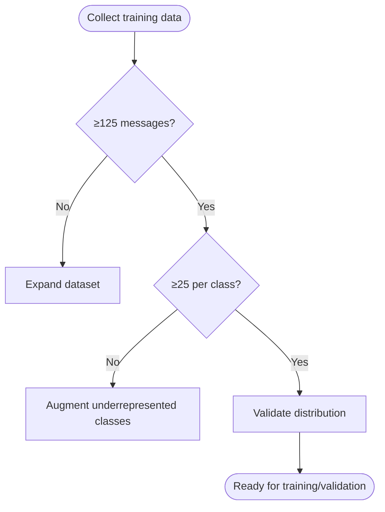
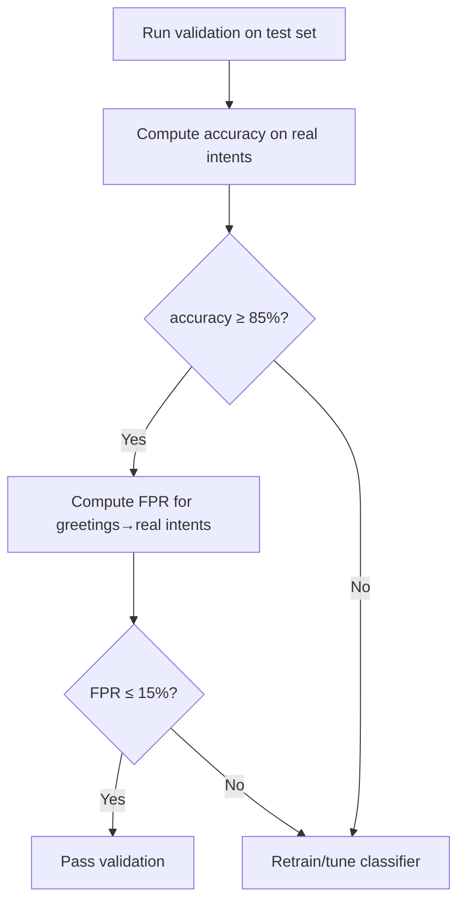
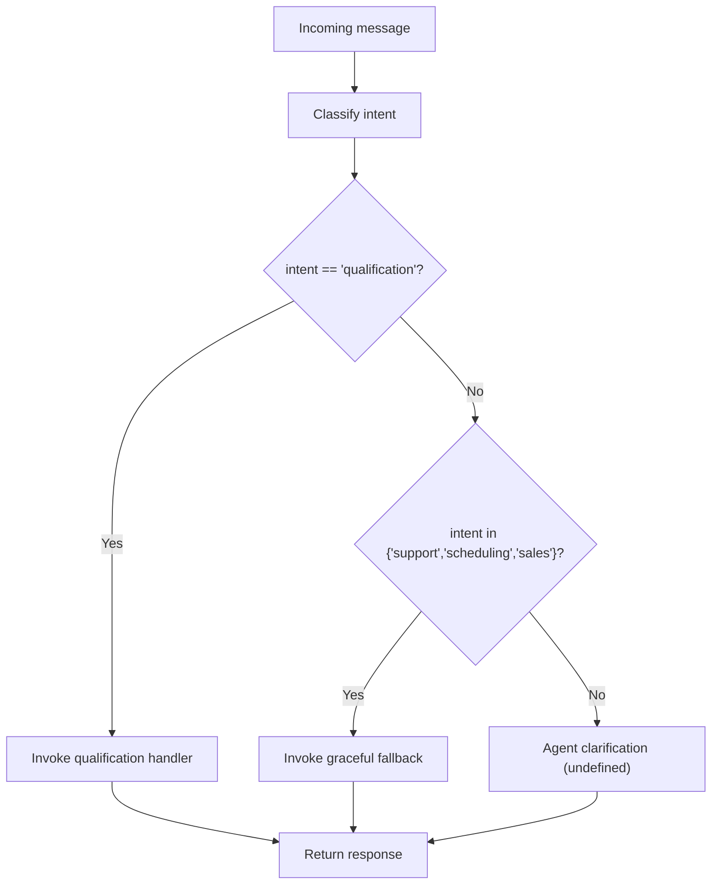
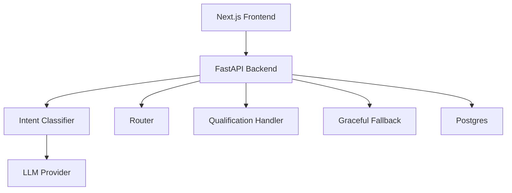

# Intent Classification System

<cite>
**Referenced Files in This Document**
- [DESIGN.md](file://.genie/brainstorms/plataforma-conversa-lead/DESIGN.md)
- [DRAFT.md](file://.genie/brainstorms/plataforma-conversa-lead/DRAFT.md)
- [INDEX.md](file://.genie/INDEX.md)
- [README.md](file://README.md)
</cite>

## Table of Contents
1. Introduction
2. Project Structure
3. Core Components
4. Architecture Overview
5. Detailed Component Analysis
6. Dependency Analysis
7. Performance Considerations
8. Troubleshooting Guide
9. Conclusion

## Introduction
This document specifies the intent classification system for a lead conversation platform that routes natural language messages to appropriate handlers. The system evaluates each incoming message independently, classifies intent into five categories, and applies confidence thresholds to route qualified leads to a qualification handler while sending other intents to graceful fallback responses. It also defines training data requirements, validation criteria, LLM provider integration constraints, and operational safeguards such as rate limiting and session TTL.

The project is currently in early stages; this specification consolidates design decisions and acceptance criteria from the repository’s design artifacts to guide implementation and testing.

**Section sources**
- [README.md:1-8](file://README.md#L1-L8)
- [INDEX.md:1-12](file://.genie/INDEX.md#L1-L12)

## Project Structure
At present, the repository contains design documentation under .genie and a minimal README. There are no application source files yet. The intent classification system will be implemented as part of the backend engine described in the design documents.

**Diagram sources**
- [DESIGN.md:1-454](file://.genie/brainstorms/plataforma-conversa-lead/DESIGN.md#L1-L454)
- [DRAFT.md:1-171](file://.genie/brainstorms/plataforma-conversa-lead/DRAFT.md#L1-L171)
- [INDEX.md:1-12](file://.genie/INDEX.md#L1-L12)
- [README.md:1-8](file://README.md#L1-L8)

**Section sources**
- [README.md:1-8](file://README.md#L1-L8)
- [INDEX.md:1-12](file://.genie/INDEX.md#L1-L12)

## Core Components
- Message Analysis Engine: Evaluates each incoming message independently to determine intent and confidence.
- Five-Category Intent Classifier: Classifies messages into qualification, support, scheduling, sales, or undefined (abstention).
- Confidence Scoring Mechanism: Applies thresholds to decide routing and whether to request clarification when uncertain.
- Routing Logic: Routes qualification messages to the real handler; routes other real intents to a graceful fallback; routes undefined to agent clarification without invoking handlers.
- Session Aggregation: For counting purposes only, the first non-undefined intent of a session determines the session’s intent bucket.
- LLM Provider Integration: Uses an external LLM endpoint with rate limiting and tenant-approved retention policies.
- Training Data Requirements: Minimum 125 labeled messages with balanced coverage across classes and abstentions.
- Validation Criteria: ≥85% accuracy on real intents; ≤15% false positive rate for greetings mapped to real intents.

Key responsibilities and behaviors are defined by the design artifacts and must be preserved during implementation.

**Section sources**
- [DESIGN.md:53-85](file://.genie/brainstorms/plataforma-conversa-lead/DESIGN.md#L53-L85)
- [DESIGN.md:225-232](file://.genie/brainstorms/plataforma-conversa-lead/DESIGN.md#L225-L232)
- [DESIGN.md:391-394](file://.genie/brainstorms/plataforma-conversa-lead/DESIGN.md#L391-L394)

## Architecture Overview
High-level flow: client sends a message → message analysis engine calls the classifier → router selects handler based on current message intent → response returned to client. Sessions are tracked for aggregation and rate limiting; terminal emissions update aggregated counters at session end or TTL expiry.

**Diagram sources**
- [DESIGN.md:189-203](file://.genie/brainstorms/plataforma-conversa-lead/DESIGN.md#L189-L203)
- [DESIGN.md:225-232](file://.genie/brainstorms/plataforma-conversa-lead/DESIGN.md#L225-L232)
- [DESIGN.md:386-398](file://.genie/brainstorms/plataforma-conversa-lead/DESIGN.md#L386-L398)

## Detailed Component Analysis

### Message Analysis Engine
- Purpose: Evaluate each incoming message independently to produce an intent label and confidence score.
- Inputs: Raw message text, optional session context for routing decisions.
- Outputs: Intent ∈ {qualification, support, scheduling, sales, undefined}, confidence ∈ [0,1].
- Behavior:
  - Per-message evaluation ensures routing adapts to conversation drift.
  - Undefined is an explicit abstention for greetings or messages without clear intent.
  - Confidence thresholds determine whether to proceed to handler/fallback or ask for clarification.

**Diagram sources**
- [DESIGN.md:53-85](file://.genie/brainstorms/plataforma-conversa-lead/DESIGN.md#L53-L85)
- [DESIGN.md:225-232](file://.genie/brainstorms/plataforma-conversa-lead/DESIGN.md#L225-L232)

**Section sources**
- [DESIGN.md:53-85](file://.genie/brainstorms/plataforma-conversa-lead/DESIGN.md#L53-L85)
- [DESIGN.md:225-232](file://.genie/brainstorms/plataforma-conversa-lead/DESIGN.md#L225-L232)

### Five-Category Intent Classification System
- Categories:
  - Qualification: Lead qualifies for commercial follow-up.
  - Support: Request for assistance or information.
  - Scheduling: Request to schedule or book.
  - Sales: Interest in purchasing or pricing.
  - Undefined: Abstention for greetings or messages without actionable intent.
- Rules:
  - Rerouting occurs per message; session aggregation uses the first non-undefined intent for counting only.
  - Undefined does not fix session intent and triggers agent clarification.

**Diagram sources**
- [DESIGN.md:53-85](file://.genie/brainstorms/plataforma-conversa-lead/DESIGN.md#L53-L85)
- [DESIGN.md:225-232](file://.genie/brainstorms/plataforma-conversa-lead/DESIGN.md#L225-L232)

**Section sources**
- [DESIGN.md:53-85](file://.genie/brainstorms/plataforma-conversa-lead/DESIGN.md#L53-L85)
- [DESIGN.md:225-232](file://.genie/brainstorms/plataforma-conversa-lead/DESIGN.md#L225-L232)

### Confidence Scoring Mechanism
- Purpose: Ensure reliable routing by requiring sufficient confidence before invoking handlers; otherwise, return clarification.
- Implementation guidance:
  - Use model-provided probability or logit-derived confidence.
  - Define thresholds per category if needed; default threshold applied uniformly unless justified by validation results.
  - Record confidence in session logs for monitoring drift.

[No sources needed since this diagram shows conceptual workflow, not actual code structure]

**Section sources**
- [DESIGN.md:225-232](file://.genie/brainstorms/plataforma-conversa-lead/DESIGN.md#L225-L232)

### LLM Provider Integration
- Constraints:
  - Public and anonymous endpoint requires rate limiting per IP and per-session message caps.
  - Retention policy must be zero-retention with signed DPA prior to pilot sessions.
  - Prompt engineering should minimize PII exposure where possible; validate inputs before calling.
- Operational parameters:
  - Rate limit: 30 messages per IP per hour.
  - Session message cap: derived from tenant’s historical WhatsApp conversation length; default 40 if tenant does not authorize corpus.
  - TTL: 24 hours for ephemeral sessions.

**Diagram sources**
- [DESIGN.md:112-123](file://.genie/brainstorms/plataforma-conversa-lead/DESIGN.md#L112-L123)
- [DESIGN.md:379-382](file://.genie/brainstorms/plataforma-conversa-lead/DESIGN.md#L379-L382)

**Section sources**
- [DESIGN.md:112-123](file://.genie/brainstorms/plataforma-conversa-lead/DESIGN.md#L112-L123)
- [DESIGN.md:379-382](file://.genie/brainstorms/plataforma-conversa-lead/DESIGN.md#L379-L382)

### Training Data Requirements
- Minimum dataset size: ≥125 labeled messages.
- Distribution:
  - At least 25 examples per real intent (qualification, support, scheduling, sales).
  - At least 25 examples of abstention (greetings, “oi”, messages without intent).
- Source:
  - Prefer tenant’s real WhatsApp history with authorization and de-identification.
  - Synthetic corpus allowed if tenant does not authorize, with limitation documented.

**Diagram sources**
- [DESIGN.md:391-394](file://.genie/brainstorms/plataforma-conversa-lead/DESIGN.md#L391-L394)

**Section sources**
- [DESIGN.md:391-394](file://.genie/brainstorms/plataforma-conversa-lead/DESIGN.md#L391-L394)

### Validation Criteria
- Accuracy on real intents: ≥85%.
- False positive rate for greetings mapped to real intents: ≤15%.
- Measurement:
  - Compute per-class metrics on held-out test set.
  - Aggregate overall accuracy across real intents.
  - Monitor drift via confidence distributions and error logs.

**Diagram sources**
- [DESIGN.md:391-394](file://.genie/brainstorms/plataforma-conversa-lead/DESIGN.md#L391-L394)

**Section sources**
- [DESIGN.md:391-394](file://.genie/brainstorms/plataforma-conversa-lead/DESIGN.md#L391-L394)

### Routing Logic
- Per-message routing:
  - Qualification → Real handler produces structured output for commercial team.
  - Support/Scheduling/Sales → Graceful fallback acknowledges request and points to tenant contact; terminal for turn but not session.
  - Undefined → Agent asks clarifying question; no handler invoked; session intent remains unfixed.
- Session aggregation:
  - First non-undefined intent sets session intent for counting only; behavior unaffected by later intent changes.

**Diagram sources**
- [DESIGN.md:53-85](file://.genie/brainstorms/plataforma-conversa-lead/DESIGN.md#L53-L85)
- [DESIGN.md:225-232](file://.genie/brainstorms/plataforma-conversa-lead/DESIGN.md#L225-L232)

**Section sources**
- [DESIGN.md:53-85](file://.genie/brainstorms/plataforma-conversa-lead/DESIGN.md#L53-L85)
- [DESIGN.md:225-232](file://.genie/brainstorms/plataforma-conversa-lead/DESIGN.md#L225-L232)

### Concrete Examples of Message Classification Scenarios
- Qualification:
  - Example: “I’d like to know if your service fits my company.”
  - Expected: Intent = qualification; route to qualification handler.
- Support:
  - Example: “How do I reset my password?”
  - Expected: Intent = support; route to graceful fallback.
- Scheduling:
  - Example: “Can we schedule a demo next Tuesday?”
  - Expected: Intent = scheduling; route to graceful fallback.
- Sales:
  - Example: “What are your pricing plans?”
  - Expected: Intent = sales; route to graceful fallback.
- Undefined:
  - Example: “Hi” or “Good morning.”
  - Expected: Intent = undefined; agent asks clarifying question.

[No sources needed since this section provides illustrative scenarios aligned with design rules]

### Error Handling Strategies
- LLM failures:
  - Retry with backoff; degrade to fallback response if repeated failures occur.
  - Log errors with correlation IDs for auditability.
- Rate limiting:
  - Block requests exceeding IP/session limits; record operational scalar counts by IP/day.
- Input validation:
  - Sanitize and normalize inputs; reject invalid emails and blocklisted domains during identification flows.
- Session lifecycle:
  - Enforce TTL; emit terminal counters even for abandoned or never-engaged sessions.

**Section sources**
- [DESIGN.md:112-123](file://.genie/brainstorms/plataforma-conversa-lead/DESIGN.md#L112-L123)
- [DESIGN.md:386-398](file://.genie/brainstorms/plataforma-conversa-lead/DESIGN.md#L386-L398)

### Performance Optimization Techniques for Real-Time Processing
- Prompt optimization:
  - Minimize token usage; use concise prompts and structured outputs.
- Caching:
  - Cache frequent intents for near-duplicate messages within short windows to reduce LLM calls.
- Batching:
  - Batch low-priority analytics calls; keep chat path single-request for latency.
- Streaming:
  - Stream partial responses where feasible to improve perceived latency.
- Monitoring:
  - Track latency percentiles, error rates, and confidence distributions; alert on drift.

[No sources needed since this section provides general guidance]

## Dependency Analysis
The intent classification system depends on:
- Next.js frontend for landing and chat UI.
- FastAPI backend for agent engine (classifier, routing, handlers).
- Postgres for ephemeral sessions and aggregated counters.
- External LLM provider for NLU.

**Diagram sources**
- [DESIGN.md:189-203](file://.genie/brainstorms/plataforma-conversa-lead/DESIGN.md#L189-L203)

**Section sources**
- [DESIGN.md:189-203](file://.genie/brainstorms/plataforma-conversa-lead/DESIGN.md#L189-L203)

## Performance Considerations
- Latency targets: Keep per-message processing under acceptable thresholds by optimizing prompts and caching.
- Throughput: Enforce rate limits to protect LLM costs and availability.
- Reliability: Implement retries and graceful degradation; ensure fallback paths are robust.
- Observability: Log confidence scores, routing decisions, and errors; aggregate metrics without PII.

[No sources needed since this section provides general guidance]

## Troubleshooting Guide
Common issues and resolutions:
- Misclassification:
  - Review confidence thresholds and retrain with additional examples from misclassified cases.
  - Validate training data balance and quality.
- High false positives for greetings:
  - Adjust thresholds or refine prompts to better detect abstention.
- Excessive LLM costs:
  - Check rate limiting configuration; verify session message caps; optimize prompts.
- Session anomalies:
  - Verify TTL enforcement and terminal emissions; ensure session intent aggregation follows first non-undefined rule.

**Section sources**
- [DESIGN.md:391-398](file://.genie/brainstorms/plataforma-conversa-lead/DESIGN.md#L391-L398)

## Conclusion
The intent classification system is designed to reliably route messages to appropriate handlers using per-message evaluation, a five-category intent schema, and confidence-based thresholds. Training data requirements and validation criteria ensure robust performance, while operational safeguards protect against abuse and cost overruns. The architecture separates concerns between frontend, backend, classifier, and handlers, enabling iterative improvements and safe expansion as measured by pilot outcomes.

[No sources needed since this section summarizes without analyzing specific files]