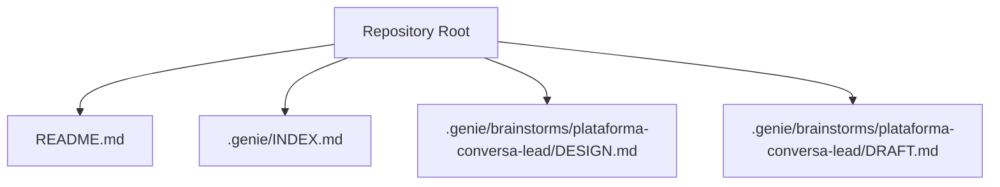
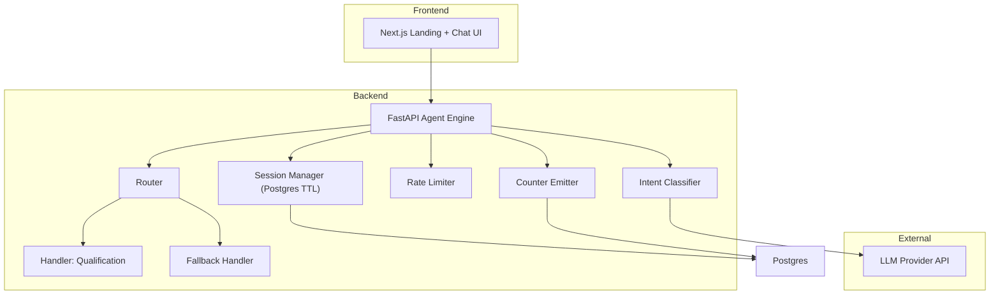
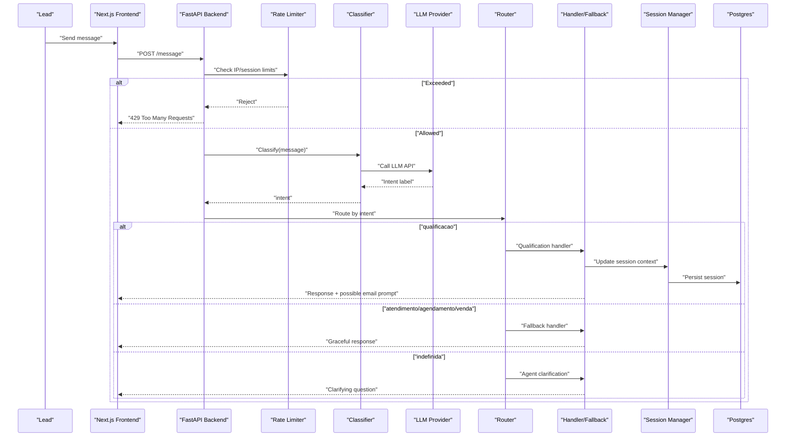
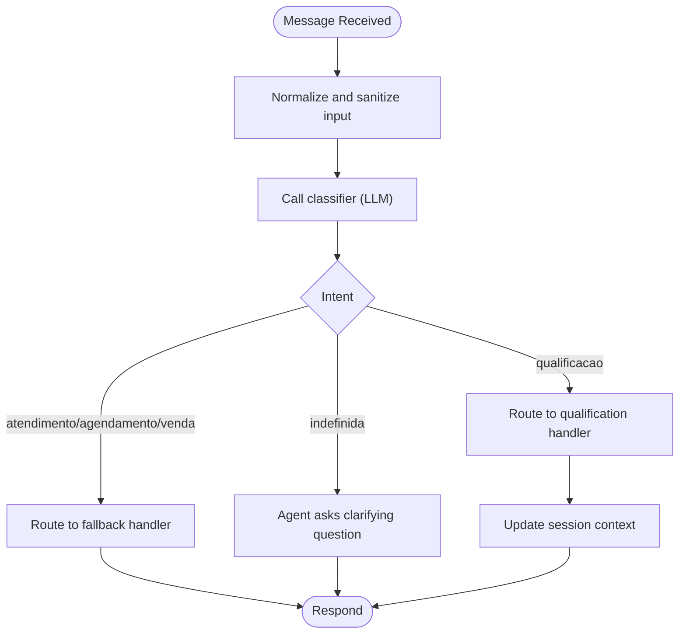
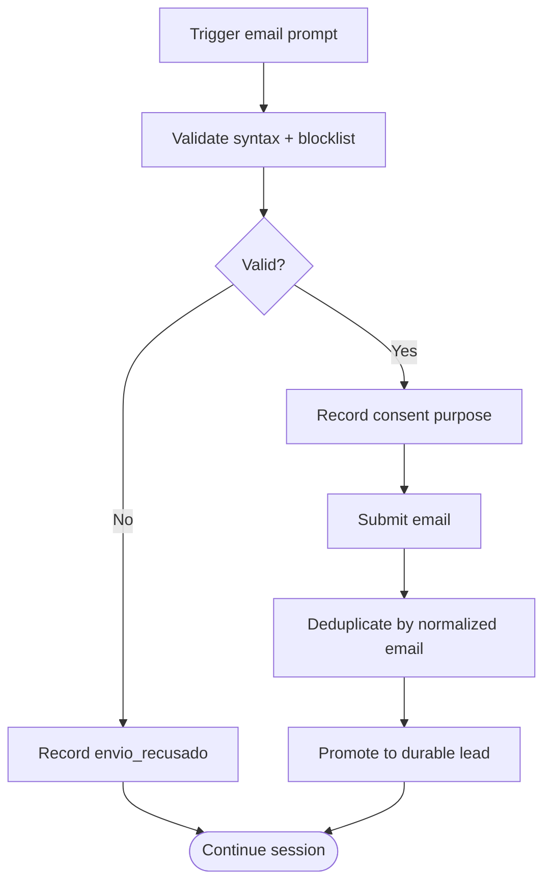
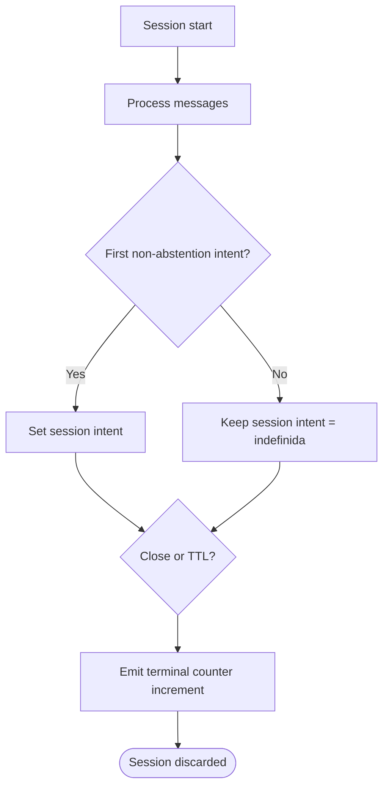
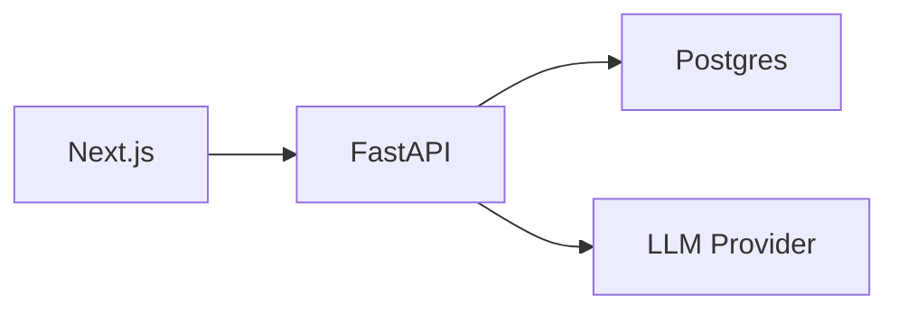

# Message Analysis Engine

<cite>
**Referenced Files in This Document**
- [README.md](file://README.md)
- [.genie/INDEX.md](file://.genie/INDEX.md)
- [.genie/brainstorms/plataforma-conversa-lead/DESIGN.md](file://.genie/brainstorms/plataforma-conversa-lead/DESIGN.md)
- [.genie/brainstorms/plataforma-conversa-lead/DRAFT.md](file://.genie/brainstorms/plataforma-conversa-lead/DRAFT.md)
</cite>

## Table of Contents
1. [Introduction](#introduction)
2. [Project Structure](#project-structure)
3. [Core Components](#core-components)
4. [Architecture Overview](#architecture-overview)
5. [Detailed Component Analysis](#detailed-component-analysis)
6. [Dependency Analysis](#dependency-analysis)
7. [Performance Considerations](#performance-considerations)
8. [Troubleshooting Guide](#troubleshooting-guide)
9. [Conclusion](#conclusion)

## Introduction
This document describes the message analysis engine for a lead conversation platform. The engine processes each incoming user message independently to determine intent and route it to the appropriate handler. It integrates with an external LLM provider through a FastAPI backend, while a Next.js frontend serves the chat interface. Sessions are ephemeral and stored in Postgres with a TTL; at session end or TTL expiry, a single terminal emission updates pre-aggregated counters without retaining personally identifiable information.

The design emphasizes:
- Per-message classification into one of five intents: qualificacao, atendimento, agendamento, venda, or indefinida (explicit abstention).
- Message-level routing with session-level aggregation only for counting.
- Rate limiting per IP and per-session message caps to protect the public LLM endpoint.
- Minimal data retention: sessions are discarded after TTL; only aggregated counters persist.

**Section sources**
- [.genie/brainstorms/plataforma-conversa-lead/DESIGN.md:47-166](file://.genie/brainstorms/plataforma-conversa-lead/DESIGN.md#L47-L166)
- [.genie/brainstorms/plataforma-conversa-lead/DESIGN.md:189-203](file://.genie/brainstorms/plataforma-conversa-lead/DESIGN.md#L189-L203)

## Project Structure
At this stage, the repository contains project metadata and design artifacts rather than implementation code. The key elements are:
- README.md: project identification and status.
- .genie/INDEX.md: plans index pointing to the design slice.
- .genie/brainstorms/plataforma-conversa-lead/: detailed design and draft documents describing scope, approach, decisions, risks, and success criteria.

**Diagram sources**
- [README.md:1-8](file://README.md#L1-L8)
- [.genie/INDEX.md:1-12](file://.genie/INDEX.md#L1-L12)
- [.genie/brainstorms/plataforma-conversa-lead/DESIGN.md:1-454](file://.genie/brainstorms/plataforma-conversa-lead/DESIGN.md#L1-L454)
- [.genie/brainstorms/plataforma-conversa-lead/DRAFT.md:1-171](file://.genie/brainstorms/plataforma-conversa-lead/DRAFT.md#L1-L171)

**Section sources**
- [README.md:1-8](file://README.md#L1-L8)
- [.genie/INDEX.md:1-12](file://.genie/INDEX.md#L1-L12)

## Core Components
The message analysis engine is defined by the following components and responsibilities:

- Intent classifier: maps each incoming message to a single intent label from {qualificacao, atendimento, agendamento, venda, indefinida}. The explicit abstenção value prevents mislabeling greetings or noise.
- Router: evaluates the current message’s intent on every turn and routes accordingly:
  - qualificacao → real handler that captures intent, urgency, fit, and triggers contextual email request.
  - atendimento/agendamento/venda → graceful fallback response that acknowledges the request and points to tenant contact.
  - indefinida → agent asks a clarifying question without invoking a handler.
- Session manager: maintains ephemeral context in Postgres with a TTL; promotes to a durable lead upon successful email submission with consent recorded.
- Rate limiter: enforces per-IP and per-session message caps to protect the LLM endpoint.
- Counter emitter: at session close or TTL expiry, emits a single terminal increment to a bucket keyed by origin, intent, email state, and validity flags. No PII or session identifiers are persisted.

Operational parameters (provisional):
- Session TTL: 24 hours.
- Rate limit: 30 messages per IP per hour.
- Per-session message cap: derived from tenant’s WhatsApp history or defaulted to 40 if corpus not authorized.
- Pilot window: 12 weeks.

**Section sources**
- [.genie/brainstorms/plataforma-conversa-lead/DESIGN.md:47-166](file://.genie/brainstorms/plataforma-conversa-lead/DESIGN.md#L47-L166)
- [.genie/brainstorms/plataforma-conversa-lead/DESIGN.md:189-203](file://.genie/brainstorms/plataforma-conversa-lead/DESIGN.md#L189-L203)

## Architecture Overview
High-level architecture follows a front-end/back-end split with persistent storage:

**Diagram sources**
- [.genie/brainstorms/plataforma-conversa-lead/DESIGN.md:189-203](file://.genie/brainstorms/plataforma-conversa-lead/DESIGN.md#L189-L203)
- [.genie/brainstorms/plataforma-conversa-lead/DESIGN.md:47-166](file://.genie/brainstorms/plataforma-conversa-lead/DESIGN.md#L47-L166)

## Detailed Component Analysis

### Real-Time Message Evaluation Pipeline
Each incoming message flows through preprocessing, classification, routing, and session accounting:

**Diagram sources**
- [.genie/brainstorms/plataforma-conversa-lead/DESIGN.md:47-166](file://.genie/brainstorms/plataforma-conversa-lead/DESIGN.md#L47-L166)
- [.genie/brainstorms/plataforma-conversa-lead/DESIGN.md:189-203](file://.genie/brainstorms/plataforma-conversa-lead/DESIGN.md#L189-L203)

**Section sources**
- [.genie/brainstorms/plataforma-conversa-lead/DESIGN.md:47-166](file://.genie/brainstorms/plataforma-conversa-lead/DESIGN.md#L47-L166)
- [.genie/brainstorms/plataforma-conversa-lead/DESIGN.md:189-203](file://.genie/brainstorms/plataforma-conversa-lead/DESIGN.md#L189-L203)

### Natural Language Processing Integration with LLM Providers
- The classifier calls an external LLM service via HTTP APIs to obtain the intent label for each message.
- Responses are parsed to extract a single intent from the defined set.
- Error recovery should include retries with backoff and fallback to a default or conservative classification when the LLM is unavailable, ensuring rate limits and session caps still apply.

Integration considerations:
- Authentication and secrets management via environment variables.
- Timeouts and circuit breakers to avoid cascading failures.
- Logging of errors without capturing PII.

**Section sources**
- [.genie/brainstorms/plataforma-conversa-lead/DESIGN.md:189-203](file://.genie/brainstorms/plataforma-conversa-lead/DESIGN.md#L189-L203)

### Preprocessing Steps Applied to User Input
Preprocessing prepares raw text for classification and ensures consistency:
- Normalize whitespace and encoding.
- Strip or mask sensitive tokens before sending to the LLM.
- Enforce input length constraints to stay within model token limits.
- Validate language or script if required by the classifier.

These steps reduce noise and improve classification reliability while protecting privacy.

**Section sources**
- [.genie/brainstorms/plataforma-conversa-lead/DESIGN.md:47-166](file://.genie/brainstorms/plataforma-conversa-lead/DESIGN.md#L47-L166)

### Classification Workflow and Routing Logic

**Diagram sources**
- [.genie/brainstorms/plataforma-conversa-lead/DESIGN.md:47-166](file://.genie/brainstorms/plataforma-conversa-lead/DESIGN.md#L47-L166)

**Section sources**
- [.genie/brainstorms/plataforma-conversa-lead/DESIGN.md:47-166](file://.genie/brainstorms/plataforma-conversa-lead/DESIGN.md#L47-L166)

### Email Validation and Consent Flow
Email handling occurs mid-conversation when the qualification handler has captured necessary context or at a turn ceiling:
- Validate syntax and reject disposable domains using a blocklist.
- Record consent as the act of submitting the email with a stated purpose limited to commercial follow-up for this conversation.
- Promote session to a durable lead upon acceptance; deduplicate by normalized email (trim + lowercase).
- Track monotonic email state per session: nao_pedido → pedido_sem_envio → enviado_recusado → enviado_aceito.

**Diagram sources**
- [.genie/brainstorms/plataforma-conversa-lead/DESIGN.md:86-116](file://.genie/brainstorms/plataforma-conversa-lead/DESIGN.md#L86-L116)
- [.genie/brainstorms/plataforma-conversa-lead/DESIGN.md:142-150](file://.genie/brainstorms/plataforma-conversa-lead/DESIGN.md#L142-L150)

**Section sources**
- [.genie/brainstorms/plataforma-conversa-lead/DESIGN.md:86-116](file://.genie/brainstorms/plataforma-conversa-lead/DESIGN.md#L86-L116)
- [.genie/brainstorms/plataforma-conversa-lead/DESIGN.md:142-150](file://.genie/brainstorms/plataforma-conversa-lead/DESIGN.md#L142-L150)

### Session Aggregation and Terminal Emission
- Counting aggregates per session based on the first non-abstention intent; subsequent changes do not alter the counted intent for metrics.
- At session end or TTL expiry, emit a single terminal increment to a bucket keyed by origin, intent, email state, and validity flags.
- No session identifiers or timestamps are retained in counters; only categorical dimensions are stored.

**Diagram sources**
- [.genie/brainstorms/plataforma-conversa-lead/DESIGN.md:64-76](file://.genie/brainstorms/plataforma-conversa-lead/DESIGN.md#L64-L76)
- [.genie/brainstorms/plataforma-conversa-lead/DESIGN.md:127-166](file://.genie/brainstorms/plataforma-conversa-lead/DESIGN.md#L127-L166)

**Section sources**
- [.genie/brainstorms/plataforma-conversa-lead/DESIGN.md:64-76](file://.genie/brainstorms/plataforma-conversa-lead/DESIGN.md#L64-L76)
- [.genie/brainstorms/plataforma-conversa-lead/DESIGN.md:127-166](file://.genie/brainstorms/plataforma-conversa-lead/DESIGN.md#L127-L166)

## Dependency Analysis
The engine depends on:
- Next.js frontend for landing and chat streaming.
- FastAPI backend for agent logic, classification orchestration, routing, and session management.
- Postgres for ephemeral sessions and aggregated counters.
- External LLM provider for intent classification.

**Diagram sources**
- [.genie/brainstorms/plataforma-conversa-lead/DESIGN.md:189-203](file://.genie/brainstorms/plataforma-conversa-lead/DESIGN.md#L189-L203)

**Section sources**
- [.genie/brainstorms/plataforma-conversa-lead/DESIGN.md:189-203](file://.genie/brainstorms/plataforma-conversa-lead/DESIGN.md#L189-L203)

## Performance Considerations
To handle high-volume chat traffic:
- Apply strict rate limiting per IP (e.g., 30 messages per hour) and per-session message caps to protect the LLM endpoint.
- Use short timeouts and retry policies with exponential backoff for LLM calls; implement circuit breaking to fail fast under load.
- Cache repeated prompts or frequent intents where permissible to reduce LLM calls, ensuring no PII is cached.
- Batch or coalesce terminal emissions to minimize database writes at TTL boundaries.
- Monitor latency and error rates; adjust thresholds and caps based on observed traffic patterns.

[No sources needed since this section provides general guidance]

## Troubleshooting Guide
Common issues and mitigations:
- LLM unavailability: return a safe fallback response, log errors without PII, and continue session flow; mark requests as failed for metrics.
- Excessive traffic: enforce rate limits and per-session caps; record operational blocking counters per IP per day outside session buckets.
- Misclassification: validate classifier performance against labeled sets; maintain a baseline accuracy threshold and monitor drift.
- Email validation failures: reject invalid syntax and disposable domains; track rejection reasons for analytics.
- Session TTL expiry: ensure terminal emission occurs even for abandoned sessions; verify counters reflect correct states.

**Section sources**
- [.genie/brainstorms/plataforma-conversa-lead/DESIGN.md:112-166](file://.genie/brainstorms/plataforma-conversa-lead/DESIGN.md#L112-L166)
- [.genie/brainstorms/plataforma-conversa-lead/DESIGN.md:386-399](file://.genie/brainstorms/plataforma-conversa-lead/DESIGN.md#L386-L399)

## Conclusion
The message analysis engine defines a clear, minimal, and robust pipeline for processing user messages in a lead conversation platform. It classifies intent per message, routes appropriately, manages ephemeral sessions, and emits privacy-preserving counters. Rate limiting and per-session caps protect the LLM endpoint, while structured email validation and consent capture support durable lead creation. The design balances simplicity with measurable outcomes, enabling iterative improvement and pilot evaluation.

[No sources needed since this section summarizes without analyzing specific files]