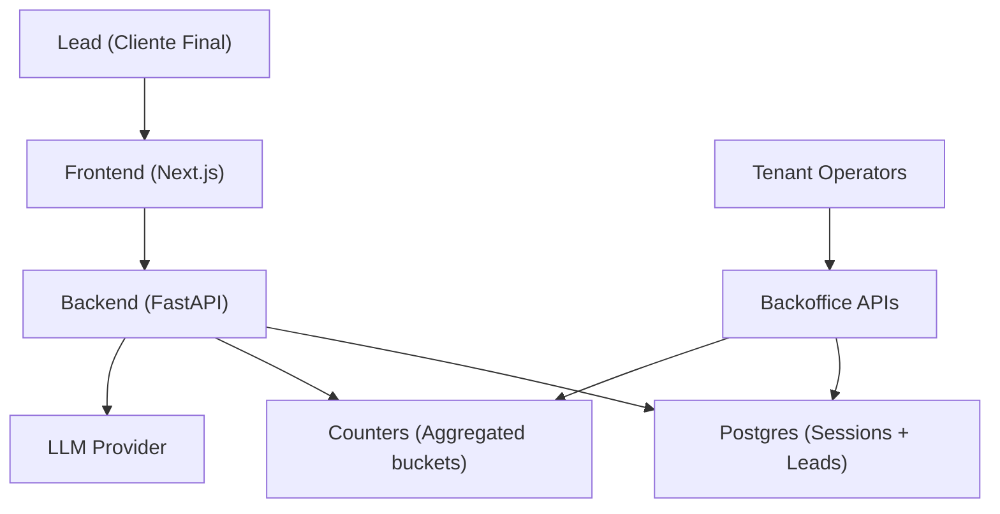
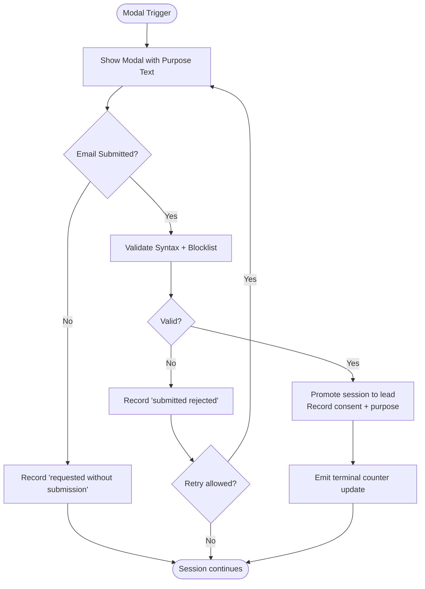
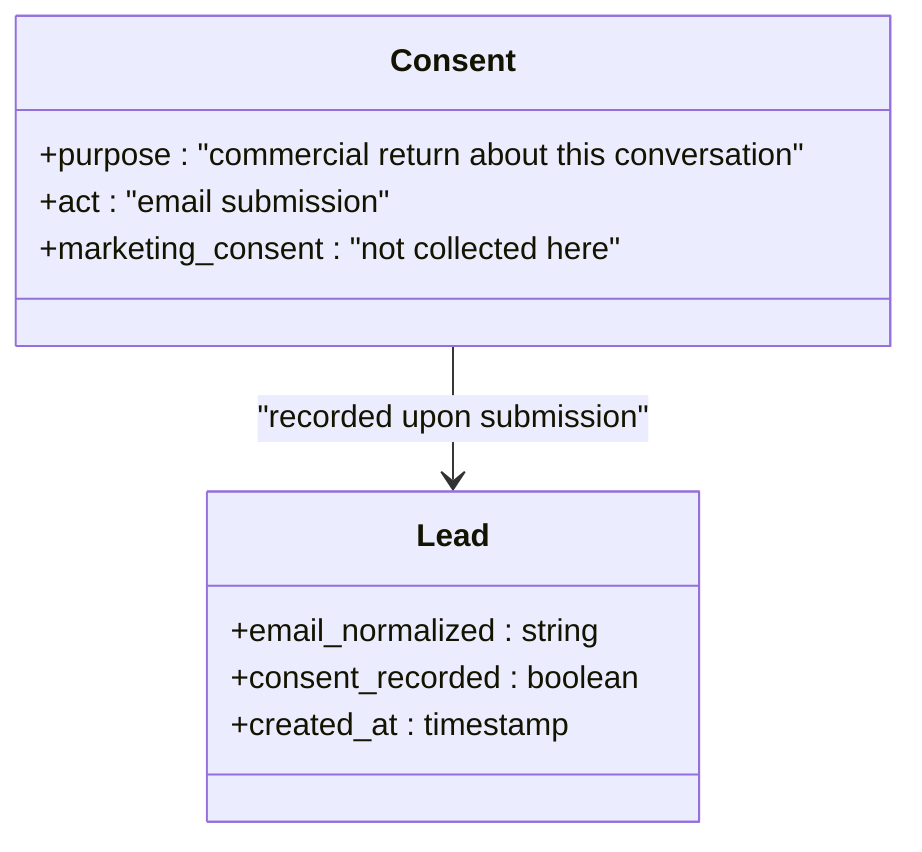
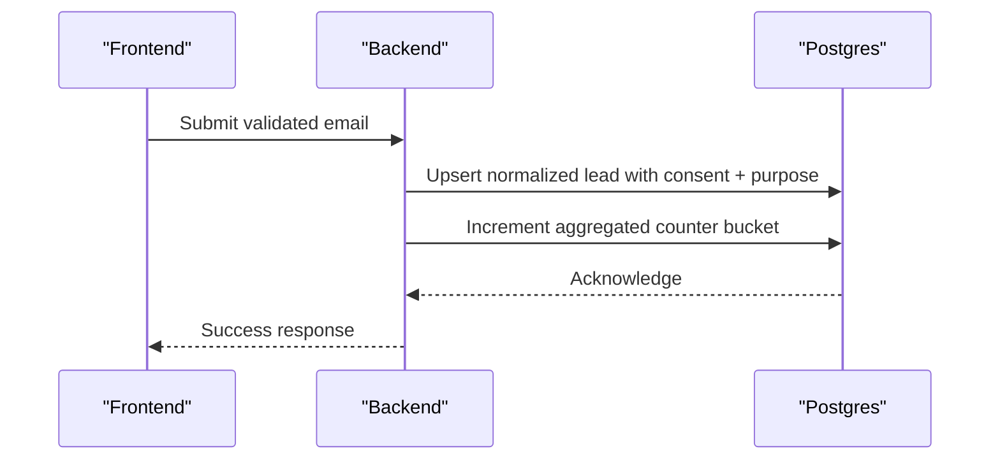
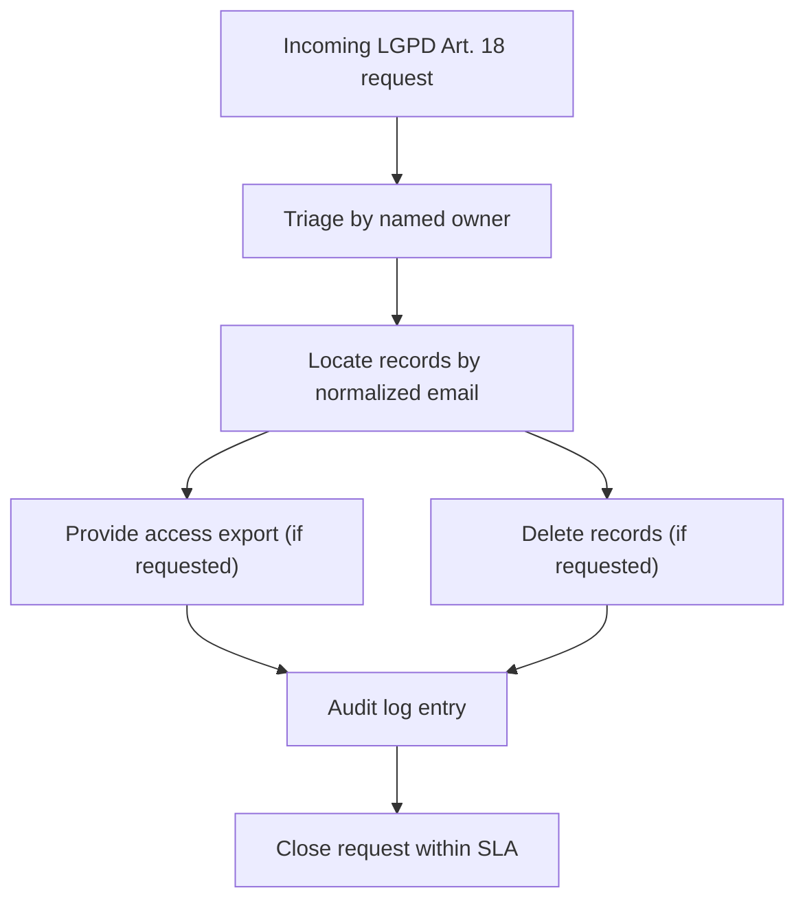
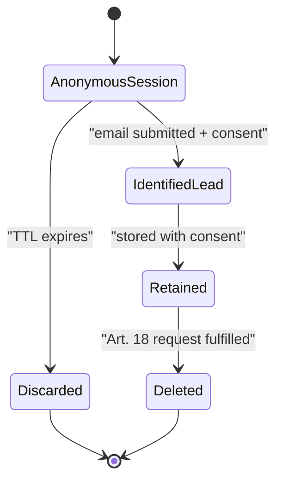
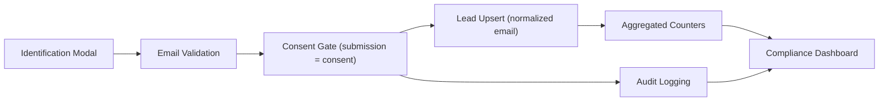

# Consent Management Framework

<cite>
**Referenced Files in This Document**
- [DESIGN.md](file://.genie/brainstorms/plataforma-conversa-lead/DESIGN.md)
- [02-user-stories.md](file://docs/sdd/02-user-stories.md)
- [03-functional-spec-backoffice.md](file://docs/sdd/03-functional-spec-backoffice.md)
- [01-actors-and-roles.md](file://docs/sdd/01-actors-and-roles.md)
</cite>

## Table of Contents
1. [Introduction](#introduction)
2. [Project Structure](#project-structure)
3. [Core Components](#core-components)
4. [Architecture Overview](#architecture-overview)
5. [Detailed Component Analysis](#detailed-component-analysis)
6. [Dependency Analysis](#dependency-analysis)
7. [Performance Considerations](#performance-considerations)
8. [Troubleshooting Guide](#troubleshooting-guide)
9. [Conclusion](#conclusion)
10. [Appendices](#appendices)

## Introduction
This document describes the consent management framework that ensures LGPD compliance while enabling lead conversion. It focuses on:
- Consent-as-gate design: sending an email is the affirmative act of consent, eliminating the problematic state where a valid email exists but consent was refused.
- Restricted purpose model: consent is limited to commercial return about the specific conversation; marketing consent is kept separate for future campaigns.
- Consent recording mechanism: acceptance is stored alongside lead records so no lead exists without recorded consent by construction.
- Manual access and deletion runbook for LGPD Article 18 compliance, naming responsible parties and providing step-by-step procedures.
- Privacy considerations, data retention policies, and how the framework balances legal compliance with conversion optimization.

## Project Structure
The consent framework is defined across design and specification documents:
- Design decisions and scope define consent-as-gate, restricted purpose, session TTL, and manual runbook requirements.
- User stories specify modal behavior, consent messaging, and rights handling.
- Backoffice specifications define compliance metrics, audit logging, and operational endpoints.
- Actor model clarifies who owns and executes LGPD requests.



**Diagram sources**
- [DESIGN.md:191-213](file://.genie/brainstorms/plataforma-conversa-lead/DESIGN.md#L191-L213)
- [03-functional-spec-backoffice.md:286-334](file://docs/sdd/03-functional-spec-backoffice.md#L286-L334)

**Section sources**
- [DESIGN.md:47-166](file://.genie/brainstorms/plataforma-conversa-lead/DESIGN.md#L47-L166)
- [02-user-stories.md:28-57](file://docs/sdd/02-user-stories.md#L28-L57)
- [03-functional-spec-backoffice.md:224-280](file://docs/sdd/03-functional-spec-backoffice.md#L224-L280)
- [01-actors-and-roles.md:10-30](file://docs/sdd/01-actors-and-roles.md#L10-L30)

## Core Components
- Consent-as-gate: The email submission is the explicit consent act. There is no separate checkbox and no “valid email but refused consent” state. Refusal is represented by not submitting.
- Restricted purpose: Consent covers only the commercial team’s return about this conversation. Marketing consent is collected elsewhere when marketing campaigns are triggered.
- Session lifecycle and TTL: Anonymous sessions live in Postgres with a TTL; they are discarded at expiration, ensuring minimal personal data retention.
- Lead promotion and deduplication: On successful email submission, the session is promoted to a durable lead record with consent and purpose recorded. Email is normalized for deduplication.
- Counters and privacy-preserving analytics: Terminal emissions increment aggregated counters without storing per-session identifiers or timestamps.
- Compliance visibility: Backoffice dashboards expose consent metrics, deletion request queues, and retention compliance indicators.

**Section sources**
- [DESIGN.md:101-111](file://.genie/brainstorms/plataforma-conversa-lead/DESIGN.md#L101-L111)
- [DESIGN.md:127-166](file://.genie/brainstorms/plataforma-conversa-lead/DESIGN.md#L127-L166)
- [DESIGN.md:191-223](file://.genie/brainstorms/plataforma-conversa-lead/DESIGN.md#L191-L223)
- [02-user-stories.md:28-57](file://docs/sdd/02-user-stories.md#L28-L57)
- [03-functional-spec-backoffice.md:224-280](file://docs/sdd/03-functional-spec-backoffice.md#L224-L280)

## Architecture Overview
The consent flow integrates frontend, backend, database, and external services while preserving privacy through aggregation and TTL-based cleanup.

```mermaid
sequenceDiagram
participant L as "Lead"
participant FE as "Next.js Frontend"
participant BE as "FastAPI Backend"
participant DB as "Postgres"
participant LLM as "LLM Provider"
L->>FE : Open link (anonymous)
FE->>BE : Chat messages
BE->>LLM : Classify intent / qualification
LLM-->>BE : Intent label
BE->>FE : Response (handler or fallback)
Note over BE,FE : If qualification path triggers, show identification modal
L->>FE : Submit email (consent gate)
FE->>BE : Validate email + submit
BE->>DB : Upsert normalized lead with consent + purpose
BE->>DB : Record terminal counter emission (aggregated)
BE-->>FE : Success
Note over DB : Sessions expire via TTL; transcripts discarded
```

**Diagram sources**
- [DESIGN.md:191-223](file://.genie/brainstorms/plataforma-conversa-lead/DESIGN.md#L191-L223)
- [DESIGN.md:127-166](file://.genie/brainstorms/plataforma-conversa-lead/DESIGN.md#L127-L166)
- [03-functional-spec-backoffice.md:286-334](file://docs/sdd/03-functional-spec-backoffice.md#L286-L334)

## Detailed Component Analysis

### Consent-as-Gate Design
- The identification modal appears contextually after capturing intent, urgency, and fit, or by turn limit if not earlier.
- The modal displays the restricted purpose text next to the submit button.
- Submission is the affirmative consent act; there is no separate consent checkbox.
- Email validation enforces syntax and disposable domain blocklist; no proof-of-possession code is required in this fat.
- State progression is monotonic per session: no request → requested without submission → submitted rejected → submitted accepted. Accepted implies a durable lead exists.



**Diagram sources**
- [DESIGN.md:86-108](file://.genie/brainstorms/plataforma-conversa-lead/DESIGN.md#L86-L108)
- [DESIGN.md:215-223](file://.genie/brainstorms/plataforma-conversa-lead/DESIGN.md#L215-L223)
- [02-user-stories.md:28-45](file://docs/sdd/02-user-stories.md#L28-L45)

**Section sources**
- [DESIGN.md:86-108](file://.genie/brainstorms/plataforma-conversa-lead/DESIGN.md#L86-L108)
- [DESIGN.md:215-223](file://.genie/brainstorms/plataforma-conversa-lead/DESIGN.md#L215-L223)
- [02-user-stories.md:28-45](file://docs/sdd/02-user-stories.md#L28-L45)

### Restricted Purpose Model
- Consent purpose is explicitly stated in the modal and limited to commercial return about this conversation.
- Marketing consent is intentionally out of scope for this fat; it will be collected in the component that triggers marketing campaigns.
- This separation satisfies LGPD granularity requirements and avoids bundling service delivery, offers, and future marketing into one consent act.



**Diagram sources**
- [DESIGN.md:101-108](file://.genie/brainstorms/plataforma-conversa-lead/DESIGN.md#L101-L108)
- [02-user-stories.md:38-45](file://docs/sdd/02-user-stories.md#L38-L45)

**Section sources**
- [DESIGN.md:101-108](file://.genie/brainstorms/plataforma-conversa-lead/DESIGN.md#L101-L108)
- [02-user-stories.md:38-45](file://docs/sdd/02-user-stories.md#L38-L45)

### Consent Recording Mechanism
- Upon successful submission, the system promotes the anonymous session to a durable lead record.
- Consent and purpose are recorded alongside the lead; normalization ensures deduplication by email.
- No lead exists without recorded consent by construction because promotion occurs only after successful submission.
- Terminal emissions update aggregated counters without retaining per-session identifiers or timestamps.



**Diagram sources**
- [DESIGN.md:107-108](file://.genie/brainstorms/plataforma-conversa-lead/DESIGN.md#L107-L108)
- [DESIGN.md:127-166](file://.genie/brainstorms/plataforma-conversa-lead/DESIGN.md#L127-L166)

**Section sources**
- [DESIGN.md:107-108](file://.genie/brainstorms/plataforma-conversa-lead/DESIGN.md#L107-L108)
- [DESIGN.md:127-166](file://.genie/brainstorms/plataforma-conversa-lead/DESIGN.md#L127-L166)

### Manual Access and Deletion Runbook (LGPD Article 18)
- A documented manual process exists for access and deletion requests, with a named owner responsible for execution.
- The backoffice exposes compliance metrics and request queues to monitor SLA adherence and fulfillment status.
- Audit logs capture relevant events and are retained for a defined period to support accountability.



**Diagram sources**
- [DESIGN.md:109-111](file://.genie/brainstorms/plataforma-conversa-lead/DESIGN.md#L109-L111)
- [03-functional-spec-backoffice.md:224-280](file://docs/sdd/03-functional-spec-backoffice.md#L224-L280)
- [01-actors-and-roles.md:10-30](file://docs/sdd/01-actors-and-roles.md#L10-L30)

**Section sources**
- [DESIGN.md:109-111](file://.genie/brainstorms/plataforma-conversa-lead/DESIGN.md#L109-L111)
- [03-functional-spec-backoffice.md:224-280](file://docs/sdd/03-functional-spec-backoffice.md#L224-L280)
- [01-actors-and-roles.md:10-30](file://docs/sdd/01-actors-and-roles.md#L10-L30)

### Privacy Considerations and Data Retention
- Anonymous sessions are ephemeral and discarded at TTL; transcripts do not persist beyond TTL.
- Aggregated counters avoid per-session identifiers and timestamps, reducing re-identification risk.
- LLM provider retention policy must be documented and a Data Processing Agreement signed before pilot usage.
- Audit logs are retained for a defined period and are immutable.



**Diagram sources**
- [DESIGN.md:120-123](file://.genie/brainstorms/plataforma-conversa-lead/DESIGN.md#L120-L123)
- [DESIGN.md:191-213](file://.genie/brainstorms/plataforma-conversa-lead/DESIGN.md#L191-L213)
- [03-functional-spec-backoffice.md:263-280](file://docs/sdd/03-functional-spec-backoffice.md#L263-L280)

**Section sources**
- [DESIGN.md:120-123](file://.genie/brainstorms/plataforma-conversa-lead/DESIGN.md#L120-L123)
- [DESIGN.md:191-213](file://.genie/brainstorms/plataforma-conversa-lead/DESIGN.md#L191-L213)
- [03-functional-spec-backoffice.md:263-280](file://docs/sdd/03-functional-spec-backoffice.md#L263-L280)

### Balancing Legal Compliance with Conversion Optimization
- Consent-as-gate eliminates ambiguous states and reduces friction by tying consent directly to value exchange (commercial return about this conversation).
- Contextual modal timing and maximum display limits reduce perceived friction while maintaining clarity.
- Email validation prevents low-quality submissions without adding confirmation steps that could harm conversion.
- Aggregated counters preserve measurement integrity without introducing tracking artifacts.
- Strict purpose limitation aligns with LGPD granular consent requirements while keeping marketing consent separate for later collection.

[No sources needed since this section synthesizes previously cited components]

## Dependency Analysis
Consent-related dependencies span user interface, backend logic, data persistence, and compliance tooling.



**Diagram sources**
- [02-user-stories.md:28-45](file://docs/sdd/02-user-stories.md#L28-L45)
- [DESIGN.md:127-166](file://.genie/brainstorms/plataforma-conversa-lead/DESIGN.md#L127-L166)
- [03-functional-spec-backoffice.md:224-280](file://docs/sdd/03-functional-spec-backoffice.md#L224-L280)

**Section sources**
- [02-user-stories.md:28-45](file://docs/sdd/02-user-stories.md#L28-L45)
- [DESIGN.md:127-166](file://.genie/brainstorms/plataforma-conversa-lead/DESIGN.md#L127-L166)
- [03-functional-spec-backoffice.md:224-280](file://docs/sdd/03-functional-spec-backoffice.md#L224-L280)

## Performance Considerations
- Minimal storage footprint: ephemeral sessions and aggregated counters reduce database load and privacy exposure.
- Fast consent path: direct submission without confirmation codes improves conversion speed.
- Rate limiting protects backend resources and maintains system stability during high traffic.
- TTL-based cleanup ensures timely removal of non-identified session data.

[No sources needed since this section provides general guidance based on previously cited mechanisms]

## Troubleshooting Guide
Common issues and resolutions related to consent and compliance:
- Email validation failures: Check syntax and disposable domain blocklist; allow retry within modal limits.
- Consent divergence: Ensure submission is the only consent act; avoid separate checkboxes to prevent inconsistent states.
- Missing consent records: Verify that lead promotion occurs only after successful submission; reconcile counters with leads.
- LGPD request backlog: Use backoffice queue to track pending, fulfilled, and overdue requests; enforce SLA.
- Retention violations: Confirm TTL enforcement and absence of per-session identifiers in counters; verify LLM provider retention policy and DPA.

**Section sources**
- [02-user-stories.md:28-45](file://docs/sdd/02-user-stories.md#L28-L45)
- [DESIGN.md:127-166](file://.genie/brainstorms/plataforma-conversa-lead/DESIGN.md#L127-L166)
- [03-functional-spec-backoffice.md:224-280](file://docs/sdd/03-functional-spec-backoffice.md#L224-L280)

## Conclusion
The consent management framework implements a robust, LGPD-compliant approach that enables efficient lead conversion:
- Consent-as-gate ensures clear, affirmative consent tied to a specific purpose.
- Restricted purpose separates service communication from marketing, satisfying granular consent requirements.
- Consent recording guarantees no lead exists without recorded consent by construction.
- Manual access and deletion processes provide actionable LGPD Article 18 compliance with named ownership and auditability.
- Privacy-first design minimizes data retention and avoids individual tracking while preserving essential metrics through aggregation.

[No sources needed since this section summarizes without analyzing specific files]

## Appendices

### Key Definitions
- Consent-as-gate: Submission of email is the explicit consent act; refusal is represented by not submitting.
- Restricted purpose: Consent applies only to commercial return about this conversation; marketing consent is collected separately.
- Session TTL: Time-to-live for anonymous sessions; after expiration, session data is discarded.
- Aggregated counters: Privacy-preserving metrics updated without per-session identifiers or timestamps.

[No sources needed since this section defines terms used throughout the document]