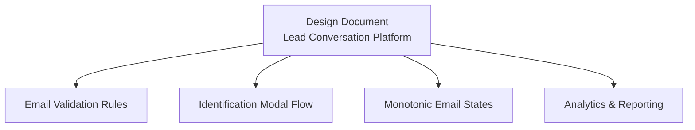
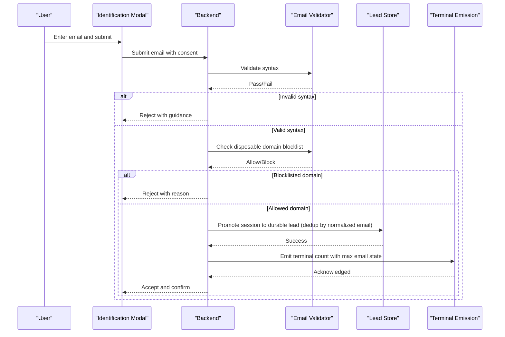
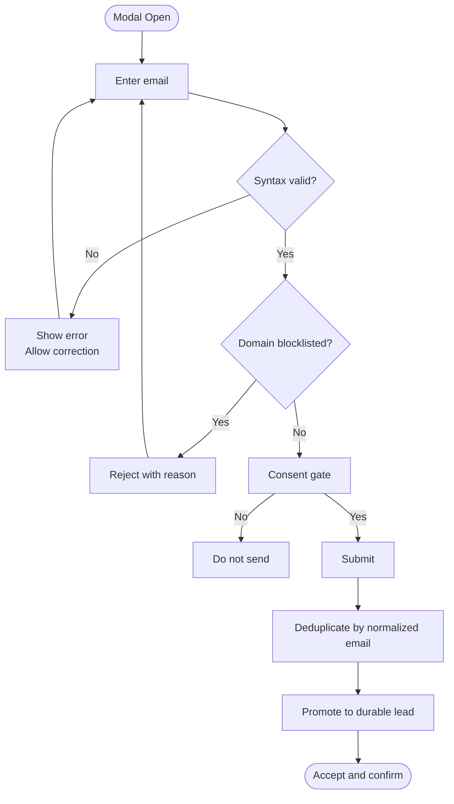
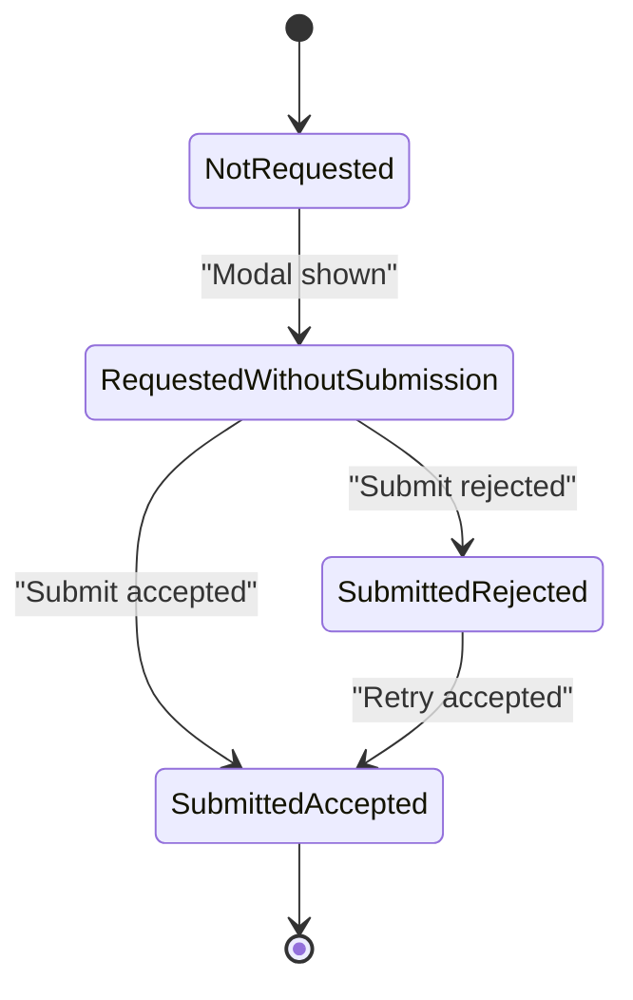
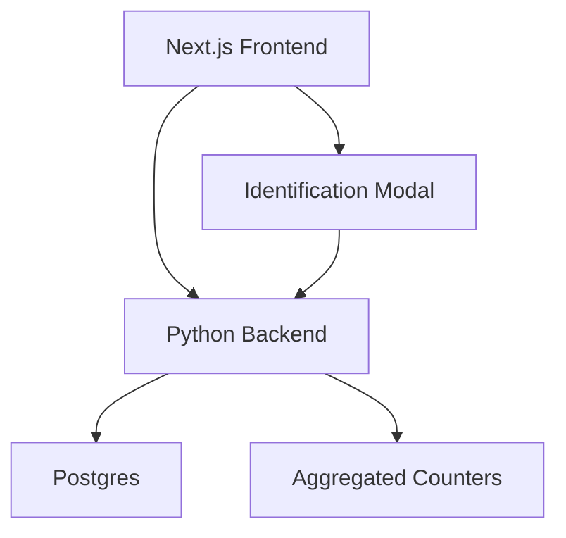

# Email Validation System

<cite>
**Referenced Files in This Document**
- [DESIGN.md](file://.genie/brainstorms/plataforma-conversa-lead/DESIGN.md)
</cite>

## Table of Contents
1. [Introduction](#introduction)
2. [Project Structure](#project-structure)
3. [Core Components](#core-components)
4. [Architecture Overview](#architecture-overview)
5. [Detailed Component Analysis](#detailed-component-analysis)
6. [Dependency Analysis](#dependency-analysis)
7. [Performance Considerations](#performance-considerations)
8. [Troubleshooting Guide](#troubleshooting-guide)
9. [Conclusion](#conclusion)

## Introduction
This document explains the email validation system used to ensure data quality while preserving user experience during lead identification. It covers:
- Syntax validation rules that reject malformed emails
- The public blocklist of disposable domains that prevents temporary email services
- The validation flow inside the identification modal
- The four monotonic states of email processing and why recording the maximum achieved state is essential for accurate analytics
- Examples, error handling patterns, and how metrics stay consistent with actual lead records despite retries and failures

The design intentionally avoids email ownership confirmation (no code or double opt-in) to keep friction low and preserve the measured conversion rate under test.

**Section sources**
- [DESIGN.md:86-108](file://.genie/brainstorms/plataforma-conversa-lead/DESIGN.md#L86-L108)
- [DESIGN.md:215-223](file://.genie/brainstorms/plataforma-conversa-lead/DESIGN.md#L215-L223)
- [DESIGN.md:395-396](file://.genie/brainstorms/plataforma-conversa-lead/DESIGN.md#L395-L396)

## Project Structure
The email validation behavior is defined within the design specification for the lead conversation platform slice. The relevant content resides in a single design document that describes scope, decisions, success criteria, and reporting rules that govern the email validation flow and its impact on metrics.

[No sources needed since this diagram shows conceptual structure, not actual code structure]

**Section sources**
- [DESIGN.md:47-166](file://.genie/brainstorms/plataforma-conversa-lead/DESIGN.md#L47-L166)

## Core Components
- Syntax validation: rejects malformed email addresses at input time.
- Disposable domain blocklist: rejects known temporary/disposable email domains using a public list.
- Consent-as-gateway: submission is gated by consent; sending is the affirmative act of consent for the stated purpose.
- Promotion to durable lead: upon successful submission, the session is promoted to a durable lead record, deduplicated by normalized email (trim + lowercase).
- Monotonic email state: a four-value field captures terminal progress per session, ensuring impossible combinations cannot be represented and that metrics align with durable leads.

These components together protect data quality (rejecting invalid or disposable inputs), maintain UX (no ownership confirmation), and keep analytics consistent with actual leads.

**Section sources**
- [DESIGN.md:86-108](file://.genie/brainstorms/plataforma-conversa-lead/DESIGN.md#L86-L108)
- [DESIGN.md:215-223](file://.genie/brainstorms/plataforma-conversa-lead/DESIGN.md#L215-L223)
- [DESIGN.md:395-396](file://.genie/brainstorms/plataforma-conversa-lead/DESIGN.md#L395-L396)

## Architecture Overview
The email validation system integrates into the mid-conversation identification modal triggered by the qualification handler. The backend validates syntax and checks against a public disposable domain blocklist before allowing submission. If accepted, the session is promoted to a durable lead with recorded consent and purpose. Metrics are updated via a terminal emission that records the maximum achieved email state for the session.

**Diagram sources**
- [DESIGN.md:86-108](file://.genie/brainstorms/plataforma-conversa-lead/DESIGN.md#L86-L108)
- [DESIGN.md:215-223](file://.genie/brainstorms/plataforma-conversa-lead/DESIGN.md#L215-L223)
- [DESIGN.md:395-396](file://.genie/brainstorms/plataforma-conversa-lead/DESIGN.md#L395-L396)

## Detailed Component Analysis

### Syntax Validation Rules
- Purpose: Reject malformed email addresses early to prevent downstream errors and maintain data integrity.
- Behavior: Input is validated for syntactic correctness before any further checks. Rejections surface to the user within the identification modal to allow correction without counting as a new display attempt.
- Impact: Ensures only structurally valid emails proceed to blocklist checking and submission.

**Section sources**
- [DESIGN.md:86-100](file://.genie/brainstorms/plataforma-conversa-lead/DESIGN.md#L86-L100)
- [DESIGN.md:395-396](file://.genie/brainstorms/plataforma-conversa-lead/DESIGN.md#L395-L396)

### Public Blocklist of Disposable Domains
- Purpose: Prevent temporary/disposable email services from being accepted as valid identities.
- Behavior: After syntax passes, the domain is checked against a public disposable domain blocklist. Matches are rejected at the modal level.
- Impact: Protects both metrics and lead base from obvious junk while keeping friction minimal (no ownership confirmation).

**Section sources**
- [DESIGN.md:86-100](file://.genie/brainstorms/plataforma-conversa-lead/DESIGN.md#L86-L100)
- [DESIGN.md:395-396](file://.genie/brainstorms/plataforma-conversa-lead/DESIGN.md#L395-L396)

### Identification Modal Flow
- Trigger: The identification modal appears in the middle of the conversation when the qualification handler has captured intent, urgency, and fit, or by turn 4 if not earlier. It can appear up to two times per session; a validation refusal reopens the same screen without counting as a new display.
- Submission gate: Consent is required; submission is the affirmative act of consent for the stated purpose (commercial return about this conversation). There is no separate checkbox and no marketing consent collected here.
- Post-submission: On acceptance, the session is promoted to a durable lead, deduplicated by normalized email (trim + lowercase), with consent and purpose recorded.

**Diagram sources**
- [DESIGN.md:86-108](file://.genie/brainstorms/plataforma-conversa-lead/DESIGN.md#L86-L108)
- [DESIGN.md:395-396](file://.genie/brainstorms/plataforma-conversa-lead/DESIGN.md#L395-L396)

**Section sources**
- [DESIGN.md:86-108](file://.genie/brainstorms/plataforma-conversa-lead/DESIGN.md#L86-L108)
- [DESIGN.md:395-396](file://.genie/brainstorms/plataforma-conversa-lead/DESIGN.md#L395-L396)

### Monotonic Email States
The system uses a monotonic field with four terminal values to capture the maximum achieved state per session:
- Not requested: The modal never appeared or was not engaged.
- Requested without submission: The modal appeared but the user did not submit.
- Submitted rejected: At least one submission occurred and none were accepted (covers syntax errors and blocklist rejections).
- Submitted accepted: At least one submission was accepted; this implies a durable lead exists.

Recording the maximum achieved state ensures:
- Impossible state combinations cannot be represented.
- Retries after rejection do not regress the metric; if a later submission is accepted, the session moves to submitted accepted.
- Metrics remain consistent with actual lead records because submitted accepted is equivalent to the existence of a durable lead.

**Diagram sources**
- [DESIGN.md:215-223](file://.genie/brainstorms/plataforma-conversa-lead/DESIGN.md#L215-L223)
- [DESIGN.md:395-396](file://.genie/brainstorms/plataforma-conversa-lead/DESIGN.md#L395-L396)

**Section sources**
- [DESIGN.md:215-223](file://.genie/brainstorms/plataforma-conversa-lead/DESIGN.md#L215-L223)
- [DESIGN.md:395-396](file://.genie/brainstorms/plataforma-conversa-lead/DESIGN.md#L395-L396)

### Analytics Consistency and Terminal Emission
- Terminal emission: Each session emits once at closure or TTL expiration, incrementing an aggregated counter bucket keyed by categorical dimensions, including email state.
- Consistency rule: submitted accepted is equivalent to the existence of a durable lead; therefore, metrics and lead records stay aligned even with retries and failures.
- Exclusions: Sessions excluded by rate limiting or message cap are tracked separately and do not distort baseline rates.

**Section sources**
- [DESIGN.md:127-166](file://.genie/brainstorms/plataforma-conversa-lead/DESIGN.md#L127-L166)
- [DESIGN.md:215-223](file://.genie/brainstorms/plataforma-conversa-lead/DESIGN.md#L215-L223)
- [DESIGN.md:395-398](file://.genie/brainstorms/plataforma-conversa-lead/DESIGN.md#L395-L398)

## Dependency Analysis
- Frontend dependency: The Next.js frontend renders the chat and the identification modal, reading source attribution parameters and presenting validation feedback.
- Backend dependency: The Python backend hosts the agent engine, classifier, handlers, email validation, and promotion to durable lead.
- Data dependency: Postgres stores ephemeral sessions (with TTL) and durable leads; terminal emissions update aggregated counters.

**Diagram sources**
- [DESIGN.md:191-213](file://.genie/brainstorms/plataforma-conversa-lead/DESIGN.md#L191-L213)

**Section sources**
- [DESIGN.md:191-213](file://.genie/brainstorms/plataforma-conversa-lead/DESIGN.md#L191-L213)

## Performance Considerations
- Low-friction validation: Syntax and blocklist checks occur inline in the modal to minimize drop-off while protecting data quality.
- No ownership confirmation: Avoids additional steps that would reduce conversion and complicate measurement.
- Aggregated metrics: Terminal emissions avoid per-session event logs, reducing storage and query overhead while preserving auditability through buckets and weekly snapshots.

[No sources needed since this section provides general guidance derived from the design]

## Troubleshooting Guide
Common scenarios and expected behaviors:
- Malformed email: Rejected immediately; user can correct without counting as a new modal display.
- Blocklisted domain: Rejected with a clear reason; user can try another address.
- Consent not given: Submission does not occur; no lead is created.
- Retry after rejection: If a subsequent submission is accepted, the session’s email state advances to submitted accepted, aligning metrics with the creation of a durable lead.
- Excluded sessions: Sessions exceeding rate limits or message caps are marked separately and do not affect baseline rates.

Validation outcomes map to email state as follows:
- Only rejections → submitted rejected
- At least one acceptance → submitted accepted
- No submission → requested without submission
- No modal engagement → not requested

**Section sources**
- [DESIGN.md:86-108](file://.genie/brainstorms/plataforma-conversa-lead/DESIGN.md#L86-L108)
- [DESIGN.md:215-223](file://.genie/brainstorms/plataforma-conversa-lead/DESIGN.md#L215-L223)
- [DESIGN.md:395-398](file://.genie/brainstorms/plataforma-conversa-lead/DESIGN.md#L395-L398)

## Conclusion
The email validation system balances data quality and user experience by enforcing syntax and disposable domain checks within a consent-gated identification modal. Its monotonic email state model guarantees that metrics remain consistent with actual lead records, even when users retry after rejections. Terminal emissions and separate tracking of excluded sessions ensure robust, auditable analytics that reflect real outcomes without introducing privacy risks or unnecessary friction.

[No sources needed since this section summarizes without analyzing specific files]