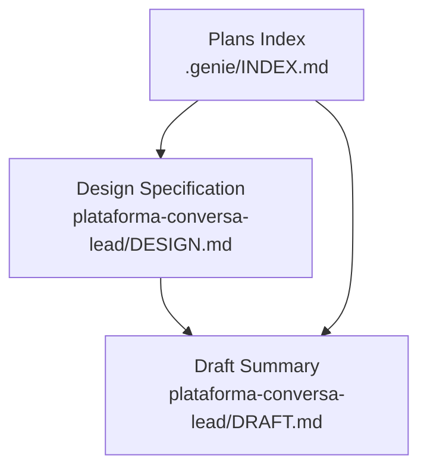
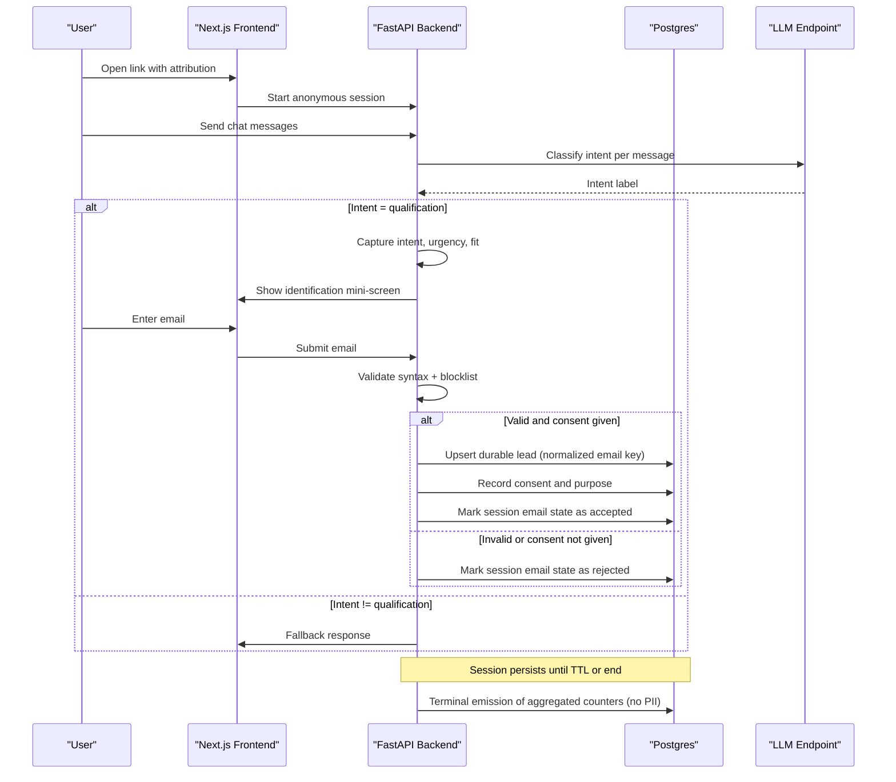
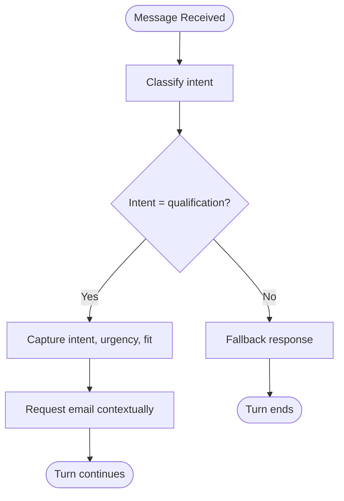
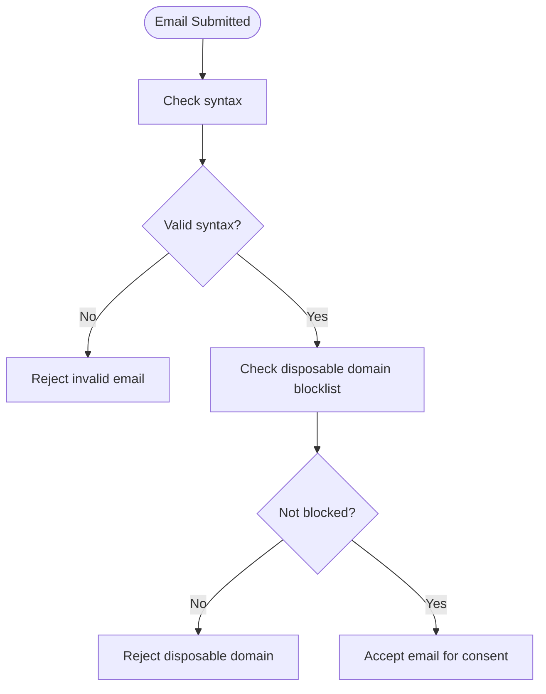
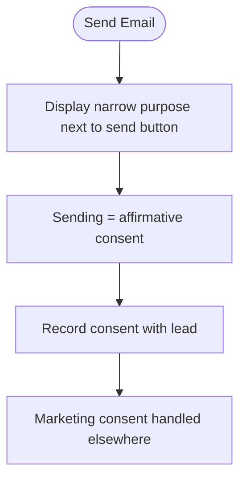
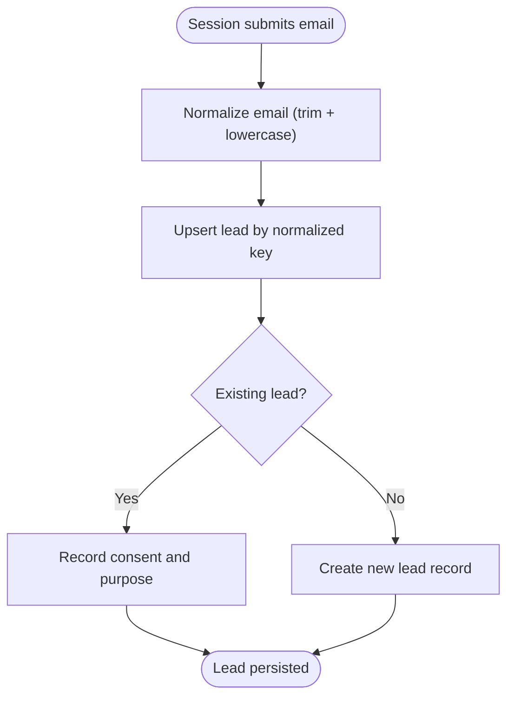
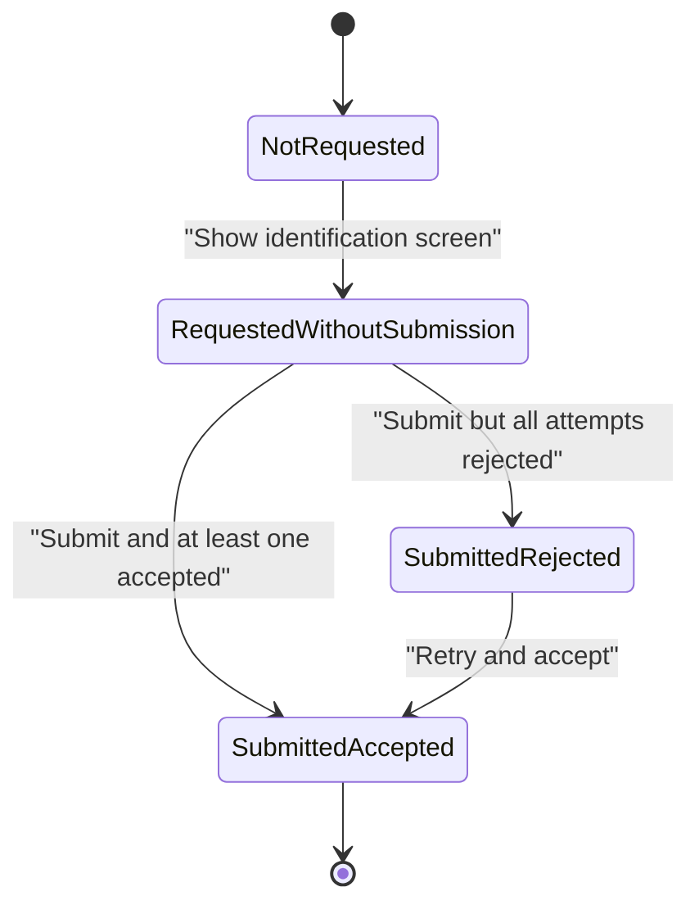
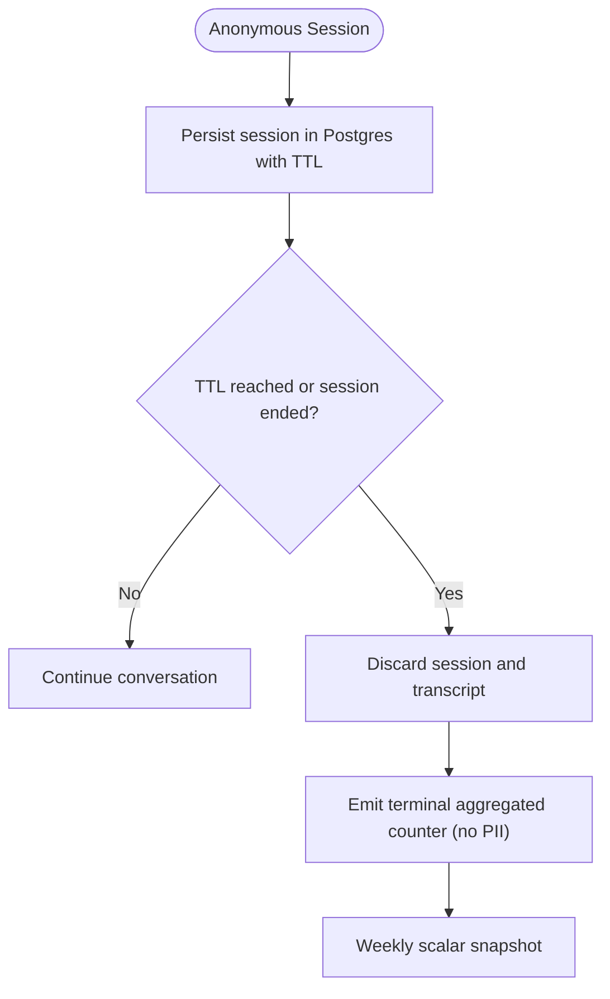
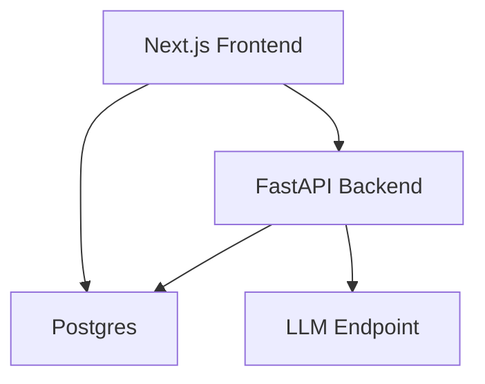

# Lead Management

<cite>
**Referenced Files in This Document**
- [DESIGN.md](file://.genie/brainstorms/plataforma-conversa-lead/DESIGN.md)
- [DRAFT.md](file://.genie/brainstorms/plataforma-conversa-lead/DRAFT.md)
- [INDEX.md](file://.genie/INDEX.md)
</cite>

## Table of Contents
1. [Introduction](#introduction)
2. [Project Structure](#project-structure)
3. [Core Components](#core-components)
4. [Architecture Overview](#architecture-overview)
5. [Detailed Component Analysis](#detailed-component-analysis)
6. [Dependency Analysis](#dependency-analysis)
7. [Performance Considerations](#performance-considerations)
8. [Troubleshooting Guide](#troubleshooting-guide)
9. [Conclusion](#conclusion)
9. [Appendices](#appendices)

## Introduction
This document describes the lead management system that converts engaged conversations into durable, consented lead records. It focuses on:
- Qualification workflow capturing intent, urgency, and fit
- Email validation with syntax checks and disposable domain blocking
- Consent management aligned to LGPD (narrow purpose, explicit act of sending as consent)
- Promotion from anonymous sessions to identified leads
- Deduplication via normalized email keys
- Secure storage and consent recording
- An email state machine with four monotonic states preventing impossible combinations
- Practical qualification scenarios, consent patterns, and data retention policies

The content is derived from the project’s design documentation for the first slice of the conversation-to-lead platform.

**Section sources**
- [DESIGN.md:10-35](file://.genie/brainstorms/plataforma-conversa-lead/DESIGN.md#L10-L35)
- [DRAFT.md:9-23](file://.genie/brainstorms/plataforma-conversa-lead/DRAFT.md#L9-L23)

## Project Structure
At this stage, the repository contains design artifacts that define the system rather than implementation code. The relevant materials are:
- A design specification detailing scope, decisions, risks, success criteria, and operational parameters
- A draft summarizing early decisions and scope evolution
- An index pointing to the ready design

**Diagram sources**
- [DESIGN.md:1-10](file://.genie/brainstorms/plataforma-conversa-lead/DESIGN.md#L1-L10)
- [DRAFT.md:1-10](file://.genie/brainstorms/plataforma-conversa-lead/DRAFT.md#L1-L10)
- [INDEX.md:1-12](file://.genie/INDEX.md#L1-L12)

**Section sources**
- [DESIGN.md:1-10](file://.genie/brainstorms/plataforma-conversa-lead/DESIGN.md#L1-L10)
- [DRAFT.md:1-10](file://.genie/brainstorms/plataforma-conversa-lead/DRAFT.md#L1-L10)
- [INDEX.md:1-12](file://.genie/INDEX.md#L1-L12)

## Core Components
- Anonymous session lifecycle with TTL-based expiration
- Intent classifier producing a single routing label per message
- Qualification handler capturing intent, urgency, and fit; triggers contextual email request
- Fallback handler for non-qualification intents
- Email validation (syntax + disposable domain blocklist)
- Consent capture tied to sending action (LGPD-aligned narrow purpose)
- Session promotion to durable lead record with deduplication by normalized email
- Terminal emission of aggregated counters without PII or session identifiers
- Rate limiting and per-session message cap to protect LLM endpoint

Key operational parameters include a 24-hour session TTL, IP rate limit, per-session message ceiling, and a pilot window.

**Section sources**
- [DESIGN.md:112-127](file://.genie/brainstorms/plataforma-conversa-lead/DESIGN.md#L112-L127)
- [DESIGN.md:191-203](file://.genie/brainstorms/plataforma-conversa-lead/DESIGN.md#L191-L203)
- [DESIGN.md:225-232](file://.genie/brainstorms/plataforma-conversa-lead/DESIGN.md#L225-L232)

## Architecture Overview
High-level flow:
- User opens a unique link with attribution parameter
- Chat starts anonymously
- Each message is classified to route to either qualification or fallback
- Qualification captures structured data and requests email contextually
- Email is validated; consent is recorded when sending
- On acceptance, anonymous session is promoted to a durable lead (deduplicated by normalized email)
- At session end or TTL expiry, a terminal emission updates aggregated counters

**Diagram sources**
- [DESIGN.md:191-203](file://.genie/brainstorms/plataforma-conversa-lead/DESIGN.md#L191-L203)
- [DESIGN.md:215-223](file://.genie/brainstorms/plataforma-conversa-lead/DESIGN.md#L215-L223)
- [DESIGN.md:225-232](file://.genie/brainstorms/plataforma-conversa-lead/DESIGN.md#L225-L232)

## Detailed Component Analysis

### Qualification Workflow
- The classifier emits a single intent field per message, enabling per-message routing while session-level aggregation preserves metric integrity
- The qualification handler discovers intent, urgency, and fit, producing structured output for the commercial team
- Contextual email request is triggered after capturing the three fields or at a turn ceiling, with a maximum number of displays per session
- Fallback responses acknowledge non-qualification intents and direct to tenant contact without pretending capability

**Diagram sources**
- [DESIGN.md:53-85](file://.genie/brainstorms/plataforma-conversa-lead/DESIGN.md#L53-L85)
- [DESIGN.md:86-98](file://.genie/brainstorms/plataforma-conversa-lead/DESIGN.md#L86-L98)

**Section sources**
- [DESIGN.md:53-85](file://.genie/brainstorms/plataforma-conversa-lead/DESIGN.md#L53-L85)
- [DESIGN.md:86-98](file://.genie/brainstorms/plataforma-conversa-lead/DESIGN.md#L86-L98)

### Email Validation System
- Syntax checking ensures well-formed emails
- Public blocklist of disposable domains prevents ephemeral identities
- No confirmation-of-ownership code is sent in this slice; validation alone protects metrics and base quality

**Diagram sources**
- [DESIGN.md:99-101](file://.genie/brainstorms/plataforma-conversa-lead/DESIGN.md#L99-L101)
- [DESIGN.md:354-355](file://.genie/brainstorms/plataforma-conversa-lead/DESIGN.md#L354-L355)

**Section sources**
- [DESIGN.md:99-101](file://.genie/brainstorms/plataforma-conversa-lead/DESIGN.md#L99-L101)
- [DESIGN.md:354-355](file://.genie/brainstorms/plataforma-conversa-lead/DESIGN.md#L354-L355)

### Consent Management Framework (LGPD Alignment)
- Consent is captured as part of the sending action, with a declared narrow purpose: allowing the tenant’s commercial team to return about this specific conversation
- Marketing consent is explicitly out of scope for this slice; it belongs to the marketing dispatch slice
- A manual runbook exists for access and deletion requests under LGPD Article 18

**Diagram sources**
- [DESIGN.md:101-108](file://.genie/brainstorms/plataforma-conversa-lead/DESIGN.md#L101-L108)
- [DESIGN.md:355-357](file://.genie/brainstorms/plataforma-conversa-lead/DESIGN.md#L355-L357)

**Section sources**
- [DESIGN.md:101-108](file://.genie/brainstorms/plataforma-conversa-lead/DESIGN.md#L101-L108)
- [DESIGN.md:355-357](file://.genie/brainstorms/plataforma-conversa-lead/DESIGN.md#L355-L357)

### Promotion and Deduplication
- Anonymous sessions are promoted to durable lead records upon successful email submission and consent
- Deduplication uses normalized email keys (trim + lowercase), ensuring “same email → same lead”
- If multiple sessions submit the same normalized email, only one durable lead is created

**Diagram sources**
- [DESIGN.md:107-108](file://.genie/brainstorms/plataforma-conversa-lead/DESIGN.md#L107-L108)
- [DESIGN.md:347-348](file://.genie/brainstorms/plataforma-conversa-lead/DESIGN.md#L347-L348)
- [DESIGN.md:396-397](file://.genie/brainstorms/plataforma-conversa-lead/DESIGN.md#L396-L397)

**Section sources**
- [DESIGN.md:107-108](file://.genie/brainstorms/plataforma-conversa-lead/DESIGN.md#L107-L108)
- [DESIGN.md:347-348](file://.genie/brainstorms/plataforma-conversa-lead/DESIGN.md#L347-L348)
- [DESIGN.md:396-397](file://.genie/brainstorms/plataforma-conversa-lead/DESIGN.md#L396-L397)

### Email State Machine (Four Monotonic States)
To prevent impossible state combinations, email state is modeled as a monotonic progression:
- Not requested
- Requested without submission
- Submitted rejected (at least one attempt, none accepted)
- Submitted accepted (at least one accepted; may follow rejections)

The stored value represents the maximum achieved during the session, ensuring consistency even with retries.

**Diagram sources**
- [DESIGN.md:142-146](file://.genie/brainstorms/plataforma-conversa-lead/DESIGN.md#L142-L146)
- [DESIGN.md:215-223](file://.genie/brainstorms/plataforma-conversa-lead/DESIGN.md#L215-L223)

**Section sources**
- [DESIGN.md:142-146](file://.genie/brainstorms/plataforma-conversa-lead/DESIGN.md#L142-L146)
- [DESIGN.md:215-223](file://.genie/brainstorms/plataforma-conversa-lead/DESIGN.md#L215-L223)

### Secure Storage and Data Retention
- Anonymous sessions live in Postgres with TTL; they are discarded at expiry, including transcripts
- Only aggregated counters are persisted beyond session life, with no PII or session identifiers
- Durable lead records store consent and purpose; access and deletion runbooks exist for LGPD compliance
- LLM provider retention policy must be documented and agreed prior to pilot use

**Diagram sources**
- [DESIGN.md:198-213](file://.genie/brainstorms/plataforma-conversa-lead/DESIGN.md#L198-L213)
- [DESIGN.md:152-165](file://.genie/brainstorms/plataforma-conversa-lead/DESIGN.md#L152-L165)
- [DESIGN.md:438-440](file://.genie/brainstorms/plataforma-conversa-lead/DESIGN.md#L438-L440)

**Section sources**
- [DESIGN.md:198-213](file://.genie/brainstorms/plataforma-conversa-lead/DESIGN.md#L198-L213)
- [DESIGN.md:152-165](file://.genie/brainstorms/plataforma-conversa-lead/DESIGN.md#L152-L165)
- [DESIGN.md:438-440](file://.genie/brainstorms/plataforma-conversa-lead/DESIGN.md#L438-L440)

### Practical Examples

#### Qualification Scenarios
- Early qualification: user expresses interest in scheduling; classification routes to qualification; handler captures urgency and fit; email request appears after capturing required fields or at a turn ceiling
- Late qualification: initial messages are non-qualification; later message shifts to qualification; routing re-evaluates per message; session-level aggregation preserves metric stability
- Abstinence handling: greeting or unclear message classified as abstinence; agent asks clarifying question without triggering handlers

These examples reflect per-message routing and session-level aggregation rules designed to avoid compounding classifier error rates.

**Section sources**
- [DESIGN.md:53-85](file://.genie/brainstorms/plataforma-conversa-lead/DESIGN.md#L53-L85)
- [DESIGN.md:225-232](file://.genie/brainstorms/plataforma-conversa-lead/DESIGN.md#L225-L232)

#### Consent Collection Patterns
- Narrow purpose displayed alongside the send button; sending equals affirmative consent
- Marketing consent is intentionally out of scope for this slice; it will be collected by the marketing dispatch slice
- Consent is recorded with the lead record; no separate checkbox state is introduced

**Section sources**
- [DESIGN.md:101-108](file://.genie/brainstorms/plataforma-conversa-lead/DESIGN.md#L101-L108)
- [DESIGN.md:355-357](file://.genie/brainstorms/plataforma-conversa-lead/DESIGN.md#L355-L357)

#### Data Retention Policies
- Anonymous sessions are ephemeral with TTL; transcripts are discarded
- Aggregated counters persist without PII or session identifiers
- Weekly scalar snapshots summarize valid sessions
- Access and deletion runbooks exist for LGPD rights; LLM provider retention must be documented and agreed before pilot

**Section sources**
- [DESIGN.md:198-213](file://.genie/brainstorms/plataforma-conversa-lead/DESIGN.md#L198-L213)
- [DESIGN.md:152-165](file://.genie/brainstorms/plataforma-conversa-lead/DESIGN.md#L152-L165)
- [DESIGN.md:438-440](file://.genie/brainstorms/plataforma-conversa-lead/DESIGN.md#L438-L440)

## Dependency Analysis
- Frontend (Next.js) serves landing and chat UI, reads attribution parameter, renders identification mini-screen
- Backend (FastAPI) hosts agent engine: classifier, qualification handler, fallback, email validation, session promotion
- Database (Postgres) stores ephemeral sessions with TTL and durable lead records
- External LLM endpoint used for intent classification; protected by rate limits and per-session caps

**Diagram sources**
- [DESIGN.md:191-203](file://.genie/brainstorms/plataforma-conversa-lead/DESIGN.md#L191-L203)

**Section sources**
- [DESIGN.md:191-203](file://.genie/brainstorms/plataforma-conversa-lead/DESIGN.md#L191-L203)

## Performance Considerations
- Per-message classification enables responsive routing but requires careful aggregation to avoid compounding errors at session level
- Rate limiting and per-session message caps protect the public LLM endpoint and control costs
- TTL-based session expiration reduces long-term storage footprint and aligns with privacy-by-design
- Aggregated counters minimize persistent data and avoid correlatable event streams

[No sources needed since this section provides general guidance]

## Troubleshooting Guide
Common issues and mitigations:
- Classifier misrouting: monitor fallback usage and track distribution of intents; validate classifier against labeled corpus
- Excessive session termination due to message cap: dimension cap based on tenant’s historical WhatsApp conversation length; review weekly snapshots
- Email validation failures: ensure blocklist is current; provide clear feedback for syntax errors and disposable domains
- Consent divergence: confirm that sending equals consent and that marketing consent is handled separately; verify consent recorded with lead
- Data retention compliance: verify TTL behavior and absence of PII in counters; confirm LLM provider retention policy documented and agreed

**Section sources**
- [DESIGN.md:391-398](file://.genie/brainstorms/plataforma-conversa-lead/DESIGN.md#L391-L398)
- [DESIGN.md:438-440](file://.genie/brainstorms/plataforma-conversa-lead/DESIGN.md#L438-L440)

## Conclusion
The lead management system transforms engaged conversations into durable, consented lead records through a carefully scoped first slice. It balances usability and privacy by:
- Starting conversations anonymously and requesting email contextually
- Capturing structured qualification data and routing intelligently
- Validating emails and blocking disposable domains
- Recording narrow-purpose consent aligned to LGPD
- Promoting sessions to leads with robust deduplication
- Ensuring secure storage and compliant retention practices
- Using a monotonic email state machine to prevent impossible combinations

This foundation supports future enhancements such as additional handlers, identity resolution, and marketing campaigns.

[No sources needed since this section summarizes without analyzing specific files]

## Appendices

### Success Criteria Highlights
- Complete flow from link opening to durable lead creation in real tenant environment
- Fallback isolation and abstinence routing verified
- Classifier validated on labeled corpus with thresholds
- Email validation rejects invalid syntax and disposable domains
- Deduplication resolves case and spacing differences
- Terminal emissions occur for all sessions, preserving denominators without PII
- Rate limiting active and auditably reported

**Section sources**
- [DESIGN.md:388-398](file://.genie/brainstorms/plataforma-conversa-lead/DESIGN.md#L388-L398)