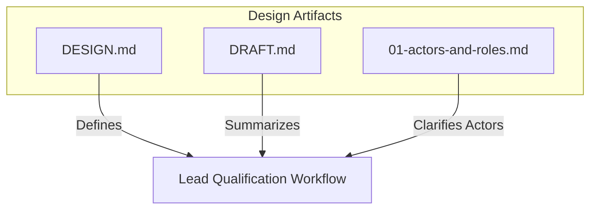
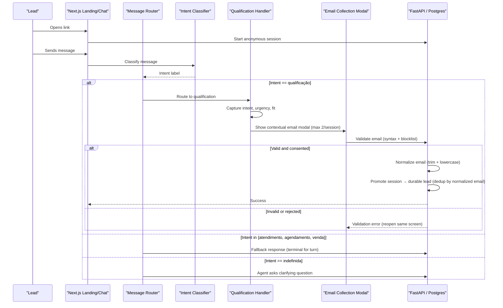
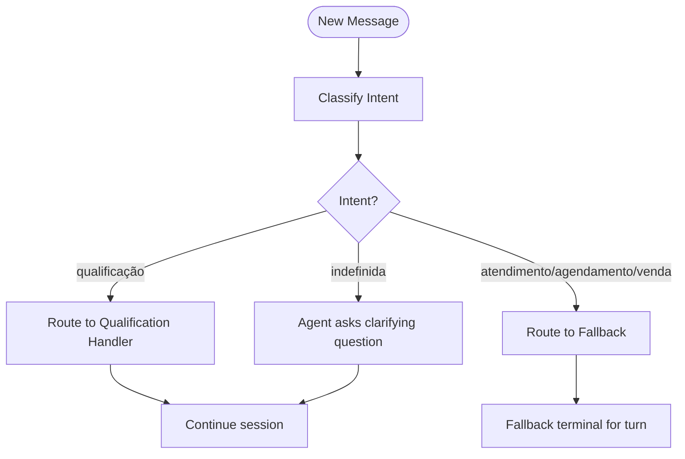
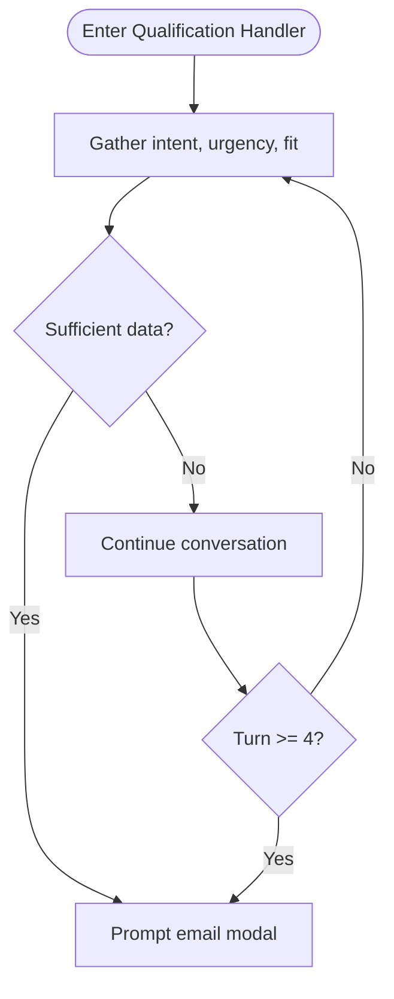
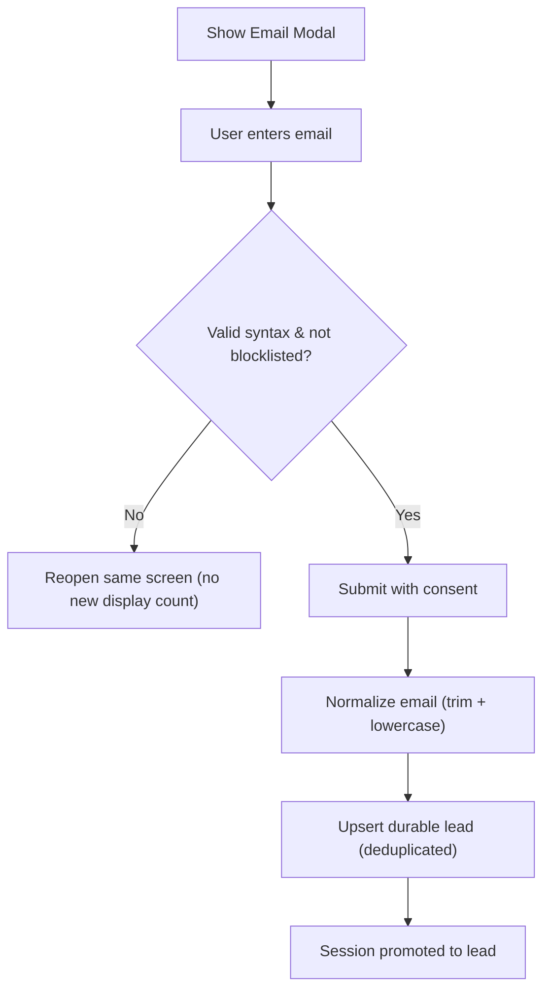
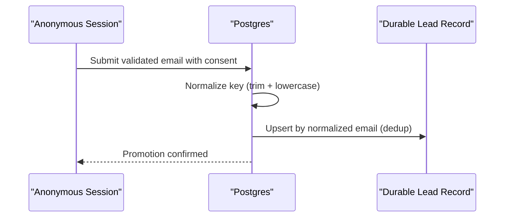
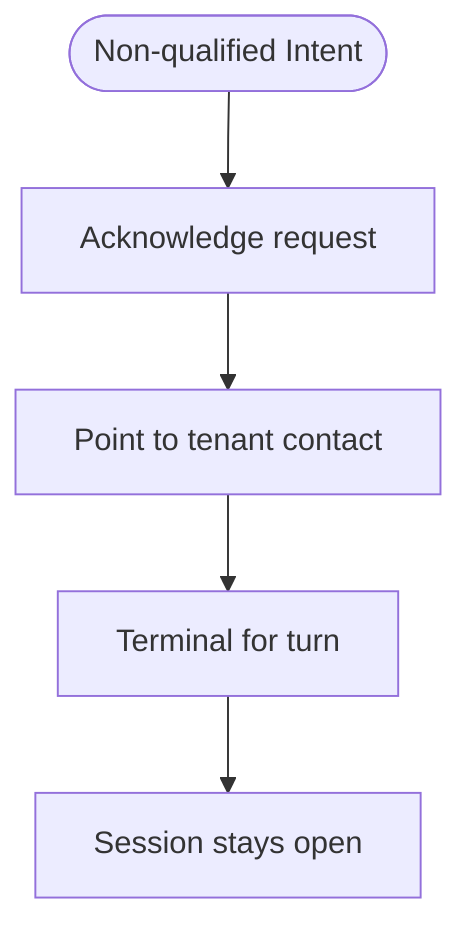
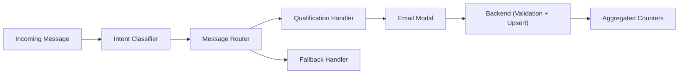

# Lead Qualification Workflow

<cite>
**Referenced Files in This Document**
- [DESIGN.md](file://.genie/brainstorms/plataforma-conversa-lead/DESIGN.md)
- [DRAFT.md](file://.genie/brainstorms/plataforma-conversa-lead/DRAFT.md)
- [01-actors-and-roles.md](file://docs/sdd/01-actors-and-roles.md)
</cite>

## Table of Contents
1. [Introduction](#introduction)
2. [Project Structure](#project-structure)
3. [Core Components](#core-components)
4. [Architecture Overview](#architecture-overview)
5. [Detailed Component Analysis](#detailed-component-analysis)
6. [Dependency Analysis](#dependency-analysis)
7. [Performance Considerations](#performance-considerations)
8. [Troubleshooting Guide](#troubleshooting-guide)
9. [Conclusion](#conclusion)

## Introduction
This document describes the lead qualification workflow that transforms engaged conversations into structured, durable lead records. It focuses on:
- The qualification handler that captures intent, urgency, and fit from conversation context.
- When a lead is considered qualified based on message analysis and conversation patterns.
- The contextual email collection modal triggered after sufficient qualification data or at turn 4, with a maximum of two displays per session and validation failures reopening the same screen without counting as new displays.
- Promotion from anonymous sessions to durable leads, including normalization of email keys for deduplication.
- Practical qualification scenarios, state transitions, and graceful fallbacks for non-qualified intents.

The content is derived from the project’s design specifications and actor model documentation.

**Section sources**
- [DESIGN.md:47-108](file://.genie/brainstorms/plataforma-conversa-lead/DESIGN.md#L47-L108)
- [01-actors-and-roles.md:24-30](file://docs/sdd/01-actors-and-roles.md#L24-L30)

## Project Structure
At this stage, the repository contains design artifacts and an actor model rather than executable code. The relevant materials are:
- A detailed design specification for the lead conversation platform (fatia 1).
- A draft summarizing decisions and scope.
- An actor and role model clarifying system actors and responsibilities.

**Diagram sources**
- [DESIGN.md:47-108](file://.genie/brainstorms/plataforma-conversa-lead/DESIGN.md#L47-L108)
- [DRAFT.md:67-75](file://.genie/brainstorms/plataforma-conversa-lead/DRAFT.md#L67-L75)
- [01-actors-and-roles.md:24-30](file://docs/sdd/01-actors-and-roles.md#L24-L30)

**Section sources**
- [DESIGN.md:47-108](file://.genie/brainstorms/plataforma-conversa-lead/DESIGN.md#L47-L108)
- [DRAFT.md:67-75](file://.genie/brainstorms/plataforma-conversa-lead/DRAFT.md#L67-L75)
- [01-actors-and-roles.md:24-30](file://docs/sdd/01-actors-and-roles.md#L24-L30)

## Core Components
- Intent classifier: Analyzes each incoming message to determine intent among {qualificação, atendimento, agendamento, venda, indefinida}. “Indefinida” is explicit abstention for greetings or messages without clear intent.
- Routing: Per-message routing decides whether the current message goes to the real qualification handler or to a graceful fallback.
- Qualification handler: Captures intent, urgency, and fit; when sufficient, triggers contextual email collection.
- Email collection modal: Contextual mini-screen shown mid-conversation with a maximum of two displays per session; validation failures reopen the same screen without counting as a new display.
- Session promotion: Converts an anonymous session into a durable lead upon successful email submission, with normalized email keys (trim + lowercase) for deduplication.
- Fallback handler: Responds gracefully to non-qualification intents, acknowledging the request and pointing to tenant contact; terminal for the turn but not the session.
- Counters and TTL: Anonymous sessions persist with TTL; terminal emissions aggregate counts across dimensions without retaining session identifiers.

**Section sources**
- [DESIGN.md:53-108](file://.genie/brainstorms/plataforma-conversa-lead/DESIGN.md#L53-L108)
- [DESIGN.md:191-223](file://.genie/brainstorms/plataforma-conversa-lead/DESIGN.md#L191-L223)
- [01-actors-and-roles.md:24-30](file://docs/sdd/01-actors-and-roles.md#L24-L30)

## Architecture Overview
High-level flow from link landing through anonymous chat, classification, routing, qualification, email collection, and lead promotion.

**Diagram sources**
- [DESIGN.md:53-108](file://.genie/brainstorms/plataforma-conversa-lead/DESIGN.md#L53-L108)
- [DESIGN.md:191-223](file://.genie/brainstorms/plataforma-conversa-lead/DESIGN.md#L191-L223)

## Detailed Component Analysis

### Intent Classifier and Routing
- Input: Each message from the lead.
- Output: Intent label ∈ {qualificação, atendimento, agendamento, venda, indefinida}.
- Routing rule: Re-evaluated per message. Only “qualificação” routes to the real handler; other three go to fallback; “indefinida” receives a clarifying question from the agent.
- Aggregation rule: For counters, the session inherits the first non-abstention intent label; this protects metrics from compounding classifier errors over multiple turns.

**Diagram sources**
- [DESIGN.md:53-85](file://.genie/brainstorms/plataforma-conversa-lead/DESIGN.md#L53-L85)

**Section sources**
- [DESIGN.md:53-85](file://.genie/brainstorms/plataforma-conversa-lead/DESIGN.md#L53-L85)

### Qualification Handler
- Purpose: Discover intent, urgency, and fit from conversation context.
- Trigger conditions for email modal:
  - After capturing sufficient intent, urgency, and fit, OR
  - At turn 4 if not yet captured.
- Behavior: Produces structured output for the tenant’s commercial team; triggers contextual email collection when ready.

**Diagram sources**
- [DESIGN.md:77-98](file://.genie/brainstorms/plataforma-conversa-lead/DESIGN.md#L77-L98)

**Section sources**
- [DESIGN.md:77-98](file://.genie/brainstorms/plataforma-conversa-lead/DESIGN.md#L77-L98)

### Contextual Email Collection Modal
- Display limits: Maximum two displays per session.
- Validation: Syntax check plus blocklist of disposable domains; no confirmation code required.
- Consent: Submission acts as consent for the tenant’s commercial team to return about this conversation; marketing consent is out of scope for this fat.
- Error handling: Validation failure reopens the same screen without counting as a new display (same attempt).

**Diagram sources**
- [DESIGN.md:86-108](file://.genie/brainstorms/plataforma-conversa-lead/DESIGN.md#L86-L108)

**Section sources**
- [DESIGN.md:86-108](file://.genie/brainstorms/plataforma-conversa-lead/DESIGN.md#L86-L108)

### Promotion from Anonymous Sessions to Durable Leads
- Mechanism: On successful email submission, promote the ephemeral session to a durable lead record.
- Deduplication: Normalize email keys by trimming whitespace and lowercasing before upsert to ensure uniqueness.
- State tracking: Monotonic email state field records the maximum achieved during the session to avoid divergence between metrics and base.

**Diagram sources**
- [DESIGN.md:107-108](file://.genie/brainstorms/plataforma-conversa-lead/DESIGN.md#L107-L108)
- [DESIGN.md:215-223](file://.genie/brainstorms/plataforma-conversa-lead/DESIGN.md#L215-L223)

**Section sources**
- [DESIGN.md:107-108](file://.genie/brainstorms/plataforma-conversa-lead/DESIGN.md#L107-L108)
- [DESIGN.md:215-223](file://.genie/brainstorms/plataforma-conversa-lead/DESIGN.md#L215-L223)

### Graceful Fallback for Non-Qualified Intents
- Scope: Handles intents {atendimento, agendamento, venda}.
- Behavior: Acknowledges the request, points to tenant contact, and is terminal for the turn but not the session; the session remains open and can return to qualification later.
- Rationale: Prevents killing a qualification in progress when the user shifts topics mid-conversation.

**Diagram sources**
- [DESIGN.md:77-85](file://.genie/brainstorms/plataforma-conversa-lead/DESIGN.md#L77-L85)

**Section sources**
- [DESIGN.md:77-85](file://.genie/brainstorms/plataforma-conversa-lead/DESIGN.md#L77-L85)

### Practical Qualification Scenarios
- Scenario A: Early clarity
  - Turn 1: User expresses interest and urgency; handler captures fit quickly; email modal appears immediately.
- Scenario B: Late convergence
  - Turns 1–3: Mixed signals or clarifications; at turn 4, modal appears even if not fully converged.
- Scenario C: Topic switching
  - Turn 2: User asks for scheduling; fallback responds; session continues; later returns to qualification and modal triggers.
- Scenario D: Validation retry
  - Modal shows; invalid email entered; same screen reopens without incrementing display count; user corrects and submits successfully.

[No sources needed since this section synthesizes behavior described above]

## Dependency Analysis
Key dependencies and relationships:
- Classifier depends on message content to produce intent labels.
- Router depends on classifier output to choose handler path per message.
- Qualification handler depends on conversation context to capture intent, urgency, fit.
- Modal depends on handler readiness or turn threshold.
- Backend depends on validation rules and normalization for deduplication.
- Counters depend on terminal emissions aggregated by categorical dimensions.

**Diagram sources**
- [DESIGN.md:53-108](file://.genie/brainstorms/plataforma-conversa-lead/DESIGN.md#L53-L108)
- [DESIGN.md:191-223](file://.genie/brainstorms/plataforma-conversa-lead/DESIGN.md#L191-L223)

**Section sources**
- [DESIGN.md:53-108](file://.genie/brainstorms/plataforma-conversa-lead/DESIGN.md#L53-L108)
- [DESIGN.md:191-223](file://.genie/brainstorms/plataforma-conversa-lead/DESIGN.md#L191-L223)

## Performance Considerations
- Rate limiting: Protects LLM endpoint via IP-based limits and per-session message caps.
- TTL management: Ephemeral sessions expire after TTL; terminal emissions preserve metrics without retaining PII.
- Modal display cap: Limits UI churn and preserves metric stability by capping email modal displays per session.
- Normalization cost: Minimal overhead for trim + lowercase normalization ensures efficient deduplication.

[No sources needed since this section provides general guidance]

## Troubleshooting Guide
Common issues and resolutions:
- Classifier misrouting: If a scheduling request is answered by qualification, verify per-message routing and that aggregation only affects counters.
- Modal not appearing: Ensure handler has captured sufficient intent/urgency/fit or confirm turn threshold reached; check session turn count.
- Validation loop: If modal keeps reopening, inspect input for syntax errors or blocklisted domains; remember validation failures do not count as new displays.
- Duplicate leads: Confirm normalization (trim + lowercase) is applied consistently before upsert.
- Metrics divergence: Verify monotonic email state records the maximum achieved per session; reconcile with durable lead existence.

**Section sources**
- [DESIGN.md:53-108](file://.genie/brainstorms/plataforma-conversa-lead/DESIGN.md#L53-L108)
- [DESIGN.md:215-223](file://.genie/brainstorms/plataforma-conversa-lead/DESIGN.md#L215-L223)

## Conclusion
The lead qualification workflow centers on per-message classification, robust routing, and a focused qualification handler that triggers contextual email collection under strict display limits. Successful submissions promote anonymous sessions to durable leads with normalized email keys ensuring deduplication. Graceful fallbacks maintain engagement while protecting the qualification flow. The design balances privacy, performance, and measurability through TTL-managed sessions, aggregated counters, and conservative defaults.

[No sources needed since this section summarizes without analyzing specific files]