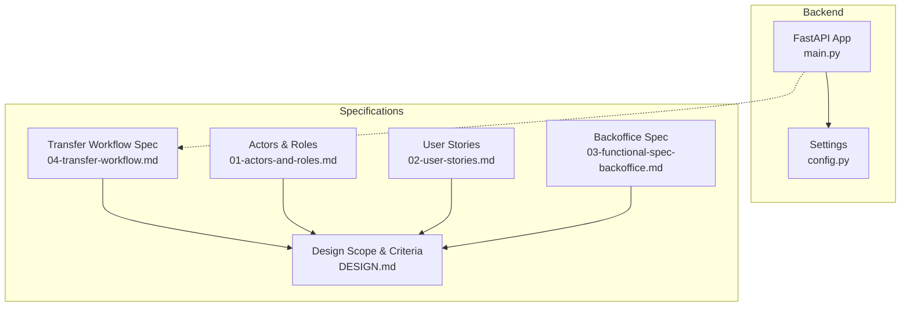
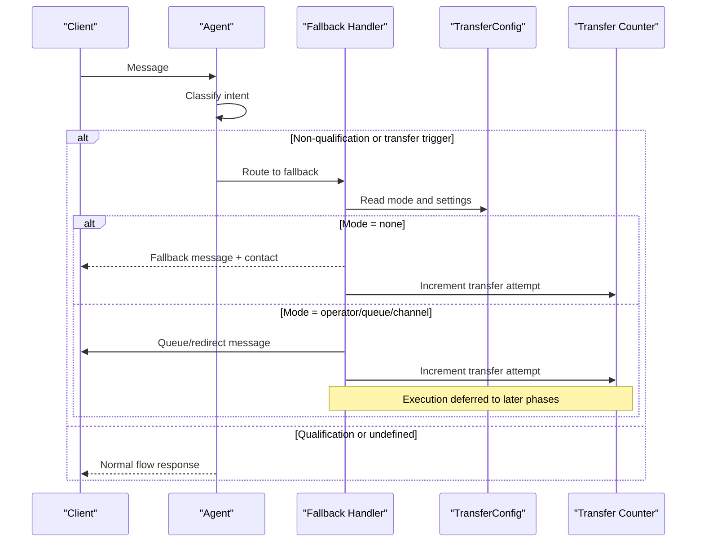
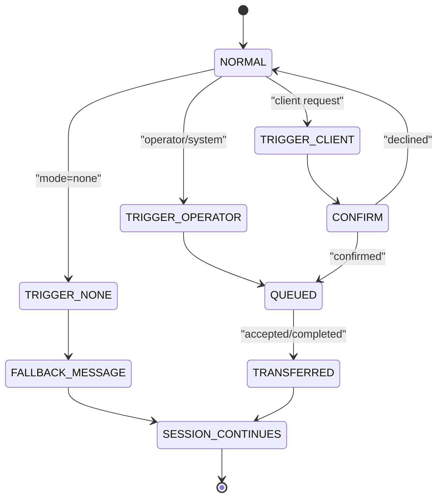
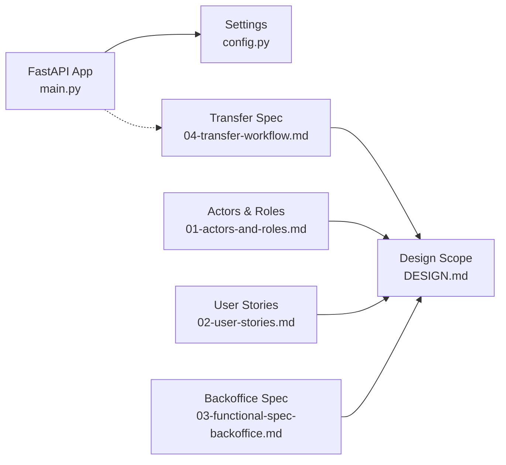

# Transfer Workflow

<cite>
**Referenced Files in This Document**
- [README.md](file://README.md)
- [04-transfer-workflow.md](file://docs/sdd/04-transfer-workflow.md)
- [01-actors-and-roles.md](file://docs/sdd/01-actors-and-roles.md)
- [02-user-stories.md](file://docs/sdd/02-user-stories.md)
- [03-functional-spec-backoffice.md](file://docs/sdd/03-functional-spec-backoffice.md)
- [DESIGN.md](file://.genie/brainstorms/plataforma-conversa-lead/DESIGN.md)
- [main.py](file://backend/app/main.py)
- [config.py](file://backend/app/core/config.py)
</cite>

## Table of Contents
1. [Introduction](#introduction)
2. [Project Structure](#project-structure)
3. [Core Components](#core-components)
4. [Architecture Overview](#architecture-overview)
5. [Detailed Component Analysis](#detailed-component-analysis)
6. [Dependency Analysis](#dependency-analysis)
7. [Performance Considerations](#performance-considerations)
8. [Troubleshooting Guide](#troubleshooting-guide)
9. [Conclusion](#conclusion)

## Introduction
This document explains the Transfer Workflow for the sup-better-engine platform, focusing on how conversations are routed when the agent cannot or should not continue. It consolidates the functional specification, design constraints, and current backend scaffolding to provide a clear, implementable view of transfer behavior for Fatia 1 (minimum viable scope).

The transfer workflow addresses three triggers:
- Trigger 1: No transfer configured (“Não há”) — formalized fallback with tenant contact info.
- Trigger 2: Operator/system decision to transfer — deferred to later phases due to live handoff requirements.
- Trigger 3: Client-requested transfer — deferred to later phases due to NLU extension and queue system needs.

For Fatia 1, the focus is on configuring transfer behavior, logging transfer events, and providing a graceful fallback path when no transfer is available.

**Section sources**
- [04-transfer-workflow.md:1-18](file://docs/sdd/04-transfer-workflow.md#L1-L18)
- [04-transfer-workflow.md:270-285](file://docs/sdd/04-transfer-workflow.md#L270-L285)

## Project Structure
At this stage, the repository contains:
- A FastAPI application entry point and configuration.
- A comprehensive set of Spec-Driven Development (SDD) documents that define actors, user stories, backoffice functionality, and the transfer workflow.
- The core design document outlining scope, success criteria, and explicit out-of-scope items (including live handoff).

**Diagram sources**
- [main.py:1-40](file://backend/app/main.py#L1-L40)
- [config.py:1-52](file://backend/app/core/config.py#L1-L52)
- [04-transfer-workflow.md:1-295](file://docs/sdd/04-transfer-workflow.md#L1-L295)
- [01-actors-and-roles.md:1-100](file://docs/sdd/01-actors-and-roles.md#L1-L100)
- [02-user-stories.md:1-211](file://docs/sdd/02-user-stories.md#L1-L211)
- [03-functional-spec-backoffice.md:1-335](file://docs/sdd/03-functional-spec-backoffice.md#L1-L335)
- [DESIGN.md:49-175](file://.genie/brainstorms/plataforma-conversa-lead/DESIGN.md#L49-L175)

**Section sources**
- [main.py:1-40](file://backend/app/main.py#L1-L40)
- [config.py:1-52](file://backend/app/core/config.py#L1-L52)
- [04-transfer-workflow.md:1-295](file://docs/sdd/04-transfer-workflow.md#L1-L295)

## Core Components
- Transfer Configuration Model: Defines modes (none, operator, queue, channel), fallback messaging, operator queue settings, external channel options, and client request handling.
- Transfer Triggers:
  - Trigger 1 (No transfer configured): Formalizes the existing fallback handler to consult TransferConfig and present tenant contact details.
  - Trigger 2 (Operator/system decision): Deferred; requires live handoff infrastructure.
  - Trigger 3 (Client-requested transfer): Deferred; requires NLU extension and queue system.
- Session State Extensions: Fields to track transfer lifecycle (status, trigger, timestamps, destination).
- Metrics: A separate scalar counter for transfer attempts and outcomes, avoiding expansion of the main bucket dimensions in Fatia 1.

Key implementation notes for Fatia 1:
- Implement TransferConfig schema and UI toggle for mode selection.
- Extend the fallback handler to read TransferConfig and render dynamic fallback messages.
- Emit a scalar transfer counter per fallback execution.

**Section sources**
- [04-transfer-workflow.md:20-75](file://docs/sdd/04-transfer-workflow.md#L20-L75)
- [04-transfer-workflow.md:78-193](file://docs/sdd/04-transfer-workflow.md#L78-L193)
- [04-transfer-workflow.md:195-235](file://docs/sdd/04-transfer-workflow.md#L195-L235)
- [04-transfer-workflow.md:239-266](file://docs/sdd/04-transfer-workflow.md#L239-L266)
- [04-transfer-workflow.md:270-285](file://docs/sdd/04-transfer-workflow.md#L270-L285)

## Architecture Overview
The transfer workflow integrates with the conversation routing layer:
- Incoming message → Intent classification → Routing decision.
- If non-qualification intent or transfer trigger detected, the fallback handler consults TransferConfig.
- For Trigger 1, the system returns a configured fallback message and alternative contact information while keeping the session open.
- For Triggers 2 and 3, the system flags the session and defers execution until later phases.

**Diagram sources**
- [04-transfer-workflow.md:78-193](file://docs/sdd/04-transfer-workflow.md#L78-L193)
- [04-transfer-workflow.md:239-266](file://docs/sdd/04-transfer-workflow.md#L239-L266)
- [DESIGN.md:49-175](file://.genie/brainstorms/plataforma-conversa-lead/DESIGN.md#L49-L175)

## Detailed Component Analysis

### Transfer Configuration Model
- Purpose: Centralize transfer behavior per tenant.
- Modes:
  - none: Static fallback with tenant contact info.
  - operator: Operator queue with timeout actions (deferred).
  - queue: General queue management (deferred).
  - channel: External channel redirection (deferred).
- Client Request Handling: Configurable phrases, confirmation prompts, and loop prevention via max requests per session.

Implementation guidance:
- Persist TransferConfig in tenant settings.
- Provide a simple UI toggle for enabling/disabling transfer and selecting mode.
- Validate and sanitize inputs for fallback messages and contact fields.

**Section sources**
- [04-transfer-workflow.md:20-75](file://docs/sdd/04-transfer-workflow.md#L20-L75)

### Trigger 1: No Transfer Configured
- Behavior: When TransferConfig.enabled is false or mode is none, the fallback handler presents a configured message and alternative contact details.
- Session Continuation: The session remains open after the fallback turn; subsequent qualification intents resume normal flow.
- Metrics: Increment a scalar transfer counter for each fallback execution.

Operational considerations:
- Ensure fallback messages include tenant-specific phone/email/hours.
- Avoid counting transfer requests toward turn limits.
- Keep email collection flow intact unless explicitly overridden by transfer priority.

**Section sources**
- [04-transfer-workflow.md:78-99](file://docs/sdd/04-transfer-workflow.md#L78-L99)
- [04-transfer-workflow.md:239-266](file://docs/sdd/04-transfer-workflow.md#L239-L266)

### Trigger 2: Operator/System Decision
- Sources: Manual operator action, system escalation detection, leadership override rules.
- Flow: Flag session, notify operators, enter queue, handle timeouts, mark session transferred.
- Scope: Deferred to later phases due to live handoff requirements.

Operational considerations:
- Design notification mechanisms for operators.
- Define timeout actions (fallback, voicemail, callback request).
- Preserve context for operator review (transcript + lead data).

**Section sources**
- [04-transfer-workflow.md:102-148](file://docs/sdd/04-transfer-workflow.md#L102-L148)

### Trigger 3: Client-Requested Transfer
- Detection: Keyword matching initially; extend to intent classifier later.
- Flow: Confirm transfer if required, check TransferConfig.mode, route accordingly.
- Loop Prevention: Enforce max requests per session to avoid repeated transfer loops.

Operational considerations:
- Provide clear messaging about wait times and next steps.
- Log transfer requests separately from regular conversation turns.
- Respect session TTL and rate limiting policies.

**Section sources**
- [04-transfer-workflow.md:152-193](file://docs/sdd/04-transfer-workflow.md#L152-L193)

### Transfer State Machine
- States: NORMAL, TRIGGER 1 (none), TRIGGER 2 (operator), TRIGGER 3 (client), FALLBACK MESSAGE, QUEUED, CONFIRM?, TRANSFERRED, SESSION CONTINUES.
- Transitions: Driven by configuration and user/operator actions.

**Diagram sources**
- [04-transfer-workflow.md:195-235](file://docs/sdd/04-transfer-workflow.md#L195-L235)

### Integration with Existing Components
- Fallback Handler: Must be extended to consult TransferConfig dynamically.
- Intent Classifier: Add a transfer_request sub-intent or keyword layer for client-triggered transfers.
- Session Model: Include transfer_status, transfer_trigger, and related timestamps.
- Counters: Use a separate scalar counter for transfer events in Fatia 1.

**Section sources**
- [04-transfer-workflow.md:239-266](file://docs/sdd/04-transfer-workflow.md#L239-L266)

## Dependency Analysis
The transfer workflow depends on:
- Backend Application: FastAPI app and configuration.
- Specifications: SDD documents defining behavior, roles, and scope.
- Design Constraints: Explicitly excludes live handoff in Fatia 1.

**Diagram sources**
- [main.py:1-40](file://backend/app/main.py#L1-L40)
- [config.py:1-52](file://backend/app/core/config.py#L1-L52)
- [04-transfer-workflow.md:1-295](file://docs/sdd/04-transfer-workflow.md#L1-L295)
- [01-actors-and-roles.md:1-100](file://docs/sdd/01-actors-and-roles.md#L1-L100)
- [02-user-stories.md:1-211](file://docs/sdd/02-user-stories.md#L1-L211)
- [03-functional-spec-backoffice.md:1-335](file://docs/sdd/03-functional-spec-backoffice.md#L1-L335)
- [DESIGN.md:49-175](file://.genie/brainstorms/plataforma-conversa-lead/DESIGN.md#L49-L175)

**Section sources**
- [main.py:1-40](file://backend/app/main.py#L1-L40)
- [config.py:1-52](file://backend/app/core/config.py#L1-L52)
- [04-transfer-workflow.md:1-295](file://docs/sdd/04-transfer-workflow.md#L1-L295)
- [DESIGN.md:49-175](file://.genie/brainstorms/plataforma-conversa-lead/DESIGN.md#L49-L175)

## Performance Considerations
- Keep transfer checks lightweight to avoid impacting message latency.
- Cache TransferConfig reads where appropriate to reduce database load.
- Use scalar counters for transfer metrics to avoid expanding high-cardinality buckets.
- Ensure fallback messages are concise and do not trigger additional LLM calls.

[No sources needed since this section provides general guidance]

## Troubleshooting Guide
Common issues and resolutions:
- Fallback message not displaying tenant contact: Verify TransferConfig.mode is set to none and fallback_contact fields are populated.
- Transfer counter not incrementing: Ensure fallback handler emits the scalar counter on each fallback execution.
- Session continues unexpectedly after transfer: Confirm session state transitions align with TransferConfig and trigger logic.
- Client transfer loops: Enforce max_requests_per_session and provide clear messaging to prevent repeated requests.

**Section sources**
- [04-transfer-workflow.md:78-193](file://docs/sdd/04-transfer-workflow.md#L78-L193)
- [04-transfer-workflow.md:239-266](file://docs/sdd/04-transfer-workflow.md#L239-L266)

## Conclusion
The Transfer Workflow defines a structured approach to handling conversations that require escalation or redirection. For Fatia 1, the focus is on configuring transfer behavior, formalizing fallback responses, and tracking transfer events through a scalar counter. Advanced features such as operator queues, live handoff, and client-requested transfers are deferred to later phases due to infrastructure and integration requirements. This phased approach ensures a stable foundation while preparing for richer capabilities in future iterations.

[No sources needed since this section summarizes without analyzing specific files]