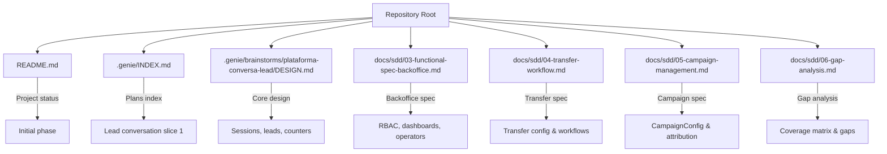
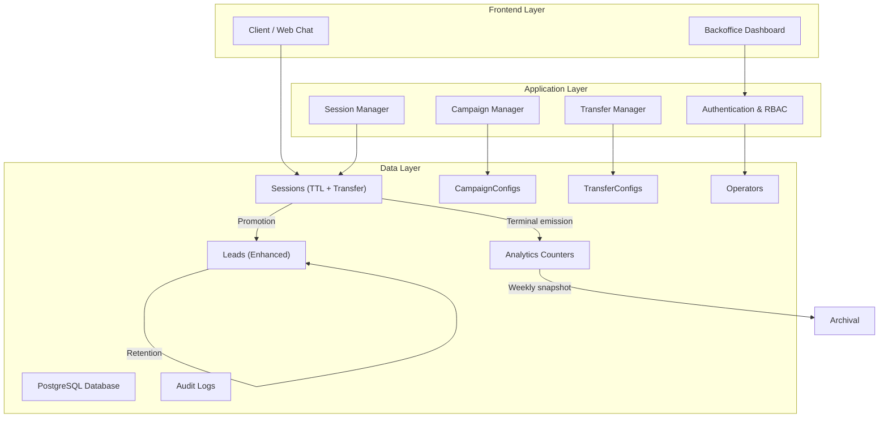

# Data Models

<cite>
**Referenced Files in This Document**
- [README.md](file://README.md)
- [.genie/INDEX.md](file://.genie/INDEX.md)
- [.genie/brainstorms/plataforma-conversa-lead/DESIGN.md](file://.genie/brainstorms/plataforma-conversa-lead/DESIGN.md)
- [docs/sdd/03-functional-spec-backoffice.md](file://docs/sdd/03-functional-spec-backoffice.md)
- [docs/sdd/04-transfer-workflow.md](file://docs/sdd/04-transfer-workflow.md)
- [docs/sdd/05-campaign-management.md](file://docs/sdd/05-campaign-management.md)
- [docs/sdd/06-gap-analysis.md](file://docs/sdd/06-gap-analysis.md)
</cite>

## Update Summary
**Changes Made**
- Added new CampaignConfig data model for campaign attribution and link management
- Added TransferConfig data model for transfer workflow configuration
- Enhanced Session model with transfer tracking fields (transfer_status, transfer_trigger, transfer_reason, timestamps)
- Enhanced Lead model with additional operational metadata for backoffice operations
- Updated entity relationships to include campaign attribution and transfer workflows
- Added backoffice operational models (operators, audit logging, RBAC)
- Expanded analytics counter buckets with transfer dimension considerations
- Updated retention and archival policies to accommodate new data models

## Table of Contents
1. [Introduction](#introduction)
2. [Project Structure](#project-structure)
3. [Core Components](#core-components)
4. [Architecture Overview](#architecture-overview)
5. [Detailed Component Analysis](#detailed-component-analysis)
6. [Dependency Analysis](#dependency-analysis)
7. [Performance Considerations](#performance-considerations)
8. [Troubleshooting Guide](#troubleshooting-guide)
9. [Conclusion](#conclusion)
10. [Appendices](#appendices)

## Introduction
This document defines the comprehensive data models for the Sup Better Engine's lead conversation platform, expanded to support backoffice operations, campaign attribution, and transfer workflows. The system now includes:
- Session records with TTL-based expiration and enhanced transfer tracking
- Lead records with normalized email keys, consent, and operational metadata
- Campaign configuration for attribution and link management
- Transfer configuration for routing and fallback handling
- Aggregated analytics counters with extended dimensions
- Backoffice operational models including operators, RBAC, and audit trails
- Consent and compliance tracking for regulatory requirements

The data model supports a three-tier backoffice system (Operador, Liderança, Gestão) with role-based access control, campaign management through labeled links, and structured transfer workflows with configurable triggers.

**Section sources**
- [.genie/brainstorms/plataforma-conversa-lead/DESIGN.md:1-500](file://.genie/brainstorms/plataforma-conversa-lead/DESIGN.md#L1-L500)
- [docs/sdd/03-functional-spec-backoffice.md:1-335](file://docs/sdd/03-functional-spec-backoffice.md#L1-L335)
- [docs/sdd/04-transfer-workflow.md:1-295](file://docs/sdd/04-transfer-workflow.md#L1-L295)
- [docs/sdd/05-campaign-management.md:1-262](file://docs/sdd/05-campaign-management.md#L1-L262)

## Project Structure
The repository has evolved from a simple design specification to a comprehensive system supporting backoffice operations, campaign management, and transfer workflows. The key artifacts now include detailed functional specifications for each major component.



**Diagram sources**
- [README.md:1-8](file://README.md#L1-L8)
- [.genie/INDEX.md:1-23](file://.genie/INDEX.md#L1-L23)
- [.genie/brainstorms/plataforma-conversa-lead/DESIGN.md:1-500](file://.genie/brainstorms/plataforma-conversa-lead/DESIGN.md#L1-L500)
- [docs/sdd/03-functional-spec-backoffice.md:1-335](file://docs/sdd/03-functional-spec-backoffice.md#L1-L335)
- [docs/sdd/04-transfer-workflow.md:1-295](file://docs/sdd/04-transfer-workflow.md#L1-L295)
- [docs/sdd/05-campaign-management.md:1-262](file://docs/sdd/05-campaign-management.md#L1-L262)
- [docs/sdd/06-gap-analysis.md:1-248](file://docs/sdd/06-gap-analysis.md#L1-L248)

**Section sources**
- [README.md:1-8](file://README.md#L1-L8)
- [.genie/INDEX.md:1-23](file://.genie/INDEX.md#L1-L23)

## Core Components
The system now encompasses multiple interconnected components that work together to provide a comprehensive lead conversation platform with operational support:

### Primary Entities
- **Session**: Enhanced ephemeral conversation context with TTL expiration, transfer tracking, and campaign attribution
- **Lead**: Durable record with normalized email key, consent tracking, and operational metadata for backoffice review
- **CampaignConfig**: Configuration for attributed links and per-campaign parameter overrides
- **TransferConfig**: Schema defining transfer behavior, triggers, and fallback mechanisms
- **Analytics Counter Buckets**: Privacy-preserving aggregated metrics with extended dimensions
- **Operator**: Backoffice user with role-based permissions and dashboard access
- **Audit Trail**: Comprehensive logging for administrative actions and compliance

### Supporting Systems
- **RBAC System**: Three-tier access control (Operador, Liderança, Gestão) with permission matrices
- **Authentication**: JWT-based session management with refresh tokens
- **Dashboard System**: Role-specific views for monitoring, configuration, and reporting
- **Compliance Framework**: LGPD-compliant data handling with audit trails

Key attributes and relationships are detailed in the following sections, incorporating the new campaign attribution, transfer workflows, and backoffice operational capabilities.

**Section sources**
- [.genie/brainstorms/plataforma-conversa-lead/DESIGN.md:47-176](file://.genie/brainstorms/plataforma-conversa-lead/DESIGN.md#L47-L176)
- [docs/sdd/03-functional-spec-backoffice.md:85-222](file://docs/sdd/03-functional-spec-backoffice.md#L85-L222)
- [docs/sdd/04-transfer-workflow.md:20-76](file://docs/sdd/04-transfer-workflow.md#L20-L76)
- [docs/sdd/05-campaign-management.md:28-67](file://docs/sdd/05-campaign-management.md#L28-L67)

## Architecture Overview
The architecture has evolved to support a multi-layered system with clear separation between front-end chat interface, back-office operations, and data persistence layers.



**Diagram sources**
- [.genie/brainstorms/plataforma-conversa-lead/DESIGN.md:201-226](file://.genie/brainstorms/plataforma-conversa-lead/DESIGN.md#L201-L226)
- [docs/sdd/03-functional-spec-backoffice.md:284-335](file://docs/sdd/03-functional-spec-backoffice.md#L284-L335)
- [docs/sdd/04-transfer-workflow.md:195-236](file://docs/sdd/04-transfer-workflow.md#L195-L236)
- [docs/sdd/05-campaign-management.md:107-151](file://docs/sdd/05-campaign-management.md#L107-L151)

## Detailed Component Analysis

### Entity: Session (Enhanced)
Purpose:
- Holds anonymous conversation context until identification or TTL expiry
- Tracks transfer state and attribution through campaign configuration
- Supports backoffice monitoring and operational oversight

Lifecycle:
- Created when chat starts anonymously with campaign attribution
- May be closed early, expire via TTL, or be transferred to external channels
- On TTL expiry, explicit close, or transfer completion, emits terminal analytics increment

Key fields (conceptual):
- id: unique session identifier
- tenant_id: tenant context
- origin: attribution source mapped to CampaignConfig or "unknown"
- intent: first non-abstaining label assigned during the session
- email_state: terminal state reached regarding email collection
- valid_session: validity flag considering rate limits and per-session message cap
- transfer_status: 'none' | 'queued' | 'accepted' | 'completed' | 'timeout' | 'client_abandoned'
- transfer_trigger: 'operator' | 'system' | 'leadership' | 'client'
- transfer_reason: string explaining transfer decision
- transfer_initiated_at: timestamp when transfer began
- transfer_completed_at: timestamp when transfer finished
- created_at, updated_at: timestamps
- ttl_expiry: computed or stored expiry time

Constraints and rules:
- TTL-based expiration governs transcript discard and terminal emission
- Per-session message cap enforced; exceeding it marks session as excluded due to cap
- Rate limiting per IP can exclude sessions; such events are counted separately
- Intent is frozen to the first non-abstaining message for counting purposes
- Transfer states follow defined state machine with proper transitions
- Campaign attribution captured at session start and preserved throughout lifecycle

Indexes and keys:
- Primary key on id
- Indexes recommended for filtering by tenant_id, ttl_expiry, valid_session, transfer_status, and campaign attribution

Validation and business rules:
- Origin must not silently default to unknown; unrecognized values map to "unknown"
- Email validation includes syntax and blocklist checks; consent is required to send
- Email promotion normalizes email (trim + lowercase) before creating Lead
- Transfer triggers validated against configured TransferConfig settings
- Campaign attribution validated against active CampaignConfig entries

Retention and archival:
- Transcripts and session rows are discarded at TTL expiry
- No per-session identifiers are retained in analytics counters
- Transfer history preserved in audit logs for compliance

**Section sources**
- [.genie/brainstorms/plataforma-conversa-lead/DESIGN.md:47-126](file://.genie/brainstorms/plataforma-conversa-lead/DESIGN.md#L47-L126)
- [docs/sdd/04-transfer-workflow.md:137-148](file://docs/sdd/04-transfer-workflow.md#L137-L148)
- [docs/sdd/05-campaign-management.md:121-134](file://docs/sdd/05-campaign-management.md#L121-L134)

### Entity: Lead (Enhanced)
Purpose:
- Durable record representing an identified contact, deduplicated by normalized email
- Stores consent, purpose scope, and operational metadata for backoffice review
- Supports campaign attribution tracking and transfer history

Key fields (conceptual):
- id: unique lead identifier
- email_normalized: normalized email used as the natural key for deduplication
- tenant_id: tenant context
- consent_given_at: timestamp when consent was recorded
- consent_purpose: restricted to commercial follow-up for this conversation (slice 1)
- campaign_origem: attribution source from originating CampaignConfig
- qualification_output: JSON structure containing intent, urgency, fit assessment
- internal_notes: array of operator notes added during backoffice review
- session_count: number of sessions that led to this lead
- created_at, updated_at: timestamps

Constraints and rules:
- Deduplication by normalized email ensures "same email → same lead"
- Consent is recorded only when email is sent successfully; refusal means no lead creation
- Purpose-limited consent scope aligns with slice 1 requirements
- Qualification output follows standardized JSON schema for consistent processing
- Internal notes preserve operator insights while maintaining data privacy

Indexes and keys:
- Primary key on id
- Unique constraint on (tenant_id, email_normalized) to enforce deduplication
- Index on campaign_origem for campaign-specific reporting
- Index on created_at for temporal queries

Validation and business rules:
- Email normalization: trim whitespace and lowercase
- Blocklist domains rejected at input; no lead created if blocked
- Consent cannot be inferred; explicit action to send email constitutes consent
- Qualification output validated against expected schema
- Internal notes subject to length limits and content filtering

Retention and archival:
- Leads persist beyond session TTL; subject to tenant-specific retention and deletion workflows
- Internal notes preserved with lead records for operational continuity
- Campaign attribution maintained for historical analysis

**Section sources**
- [.genie/brainstorms/plataforma-conversa-lead/DESIGN.md:26-33](file://.genie/brainstorms/plataforma-conversa-lead/DESIGN.md#L26-L33)
- [docs/sdd/03-functional-spec-backoffice.md:121-152](file://docs/sdd/03-functional-spec-backoffice.md#L121-L152)
- [docs/sdd/05-campaign-management.md:58-67](file://docs/sdd/05-campaign-management.md#L58-L67)

### Entity: CampaignConfig
Purpose:
- Defines campaign configurations for link attribution and operational parameters
- Manages campaign lifecycle states and associated metrics
- Provides base URL generation with attribution parameters

Key fields (conceptual):
- id: UUID primary key
- tenant_id: foreign key to tenant
- name: human-readable campaign name (max 100 chars)
- slug: URL-safe identifier (unique per tenant)
- origem_value: value for ?origem= parameter (max 50 chars, unique per tenant)
- base_url: platform landing page URL
- full_url: generated complete URL with attribution parameters
- ttl_override: optional session TTL override (null = use tenant default)
- turn_limit_override: optional max turns override (null = use tenant default)
- status: 'draft' | 'active' | 'paused' | 'archived'
- created_at: timestamp
- created_by: UUID referencing user who created campaign
- updated_at: timestamp
- total_sessions: pre-aggregated session count
- valid_sessions: pre-aggregated valid session count
- leads_identified: pre-aggregated lead count

Constraints and rules:
- Unique constraints on (tenant_id, origem_value) and (tenant_id, slug)
- Status transitions follow defined lifecycle (draft → active → paused/archived)
- Parameter overrides validated against allowed ranges
- Archived campaigns cannot be reactivated (data integrity preservation)

Indexes and keys:
- Primary key on id
- Unique constraints on tenant_id+origem_value and tenant_id+slug
- Index on tenant_id+status for efficient filtering
- Index on tenant_id+origem_value for fast attribution lookup

Validation and business rules:
- Name uniqueness per tenant enforced
- Origem value must be alphanumeric with hyphens only
- TTL overrides constrained to 1h–72h range
- Turn limit overrides constrained to 10–100 range
- Active campaigns cannot have conflicting attribution values

Retention and archival:
- Archived campaigns preserve historical metrics and attribution data
- Link deactivation upon archive prevents new session attribution
- Historical data remains accessible for reporting and analysis

**Section sources**
- [docs/sdd/05-campaign-management.md:28-67](file://docs/sdd/05-campaign-management.md#L28-L67)
- [docs/sdd/05-campaign-management.md:154-183](file://docs/sdd/05-campaign-management.md#L154-L183)
- [docs/sdd/05-campaign-management.md:226-252](file://docs/sdd/05-campaign-management.md#L226-L252)

### Entity: TransferConfig
Purpose:
- Defines transfer behavior and trigger conditions for conversation routing
- Configures fallback mechanisms and external channel redirection
- Supports both manual and automated transfer initiation

Key fields (conceptual):
- enabled: boolean master switch for transfer functionality
- mode: 'none' | 'operator' | 'queue' | 'channel'
- fallback_message: string displayed when no transfer available
- fallback_contact: object containing phone, email, hours information
- operator_queue: configuration for operator-assisted transfers
- channel: settings for external channel redirection
- client_request: configuration for client-initiated transfers

Constraints and rules:
- Mode determines available transfer pathways and UI options
- Fallback messages must be provided when mode = 'none'
- Channel destinations validated based on type (phone, email, URL)
- Client request phrases configurable but must contain at least one phrase

Indexes and keys:
- Primary key on id
- Tenant-scoped configuration (one TransferConfig per tenant in fatia 1)

Validation and business rules:
- Enabled flag controls whether transfer features are active
- Mode selection determines which sub-configurations are required
- Channel destinations validated for format and accessibility
- Client request phrases checked for appropriate language patterns

Retention and archival:
- Transfer configuration changes logged in audit trail
- Historical configurations preserved for compliance reporting
- Active configurations cached for performance (5-minute TTL)

**Section sources**
- [docs/sdd/04-transfer-workflow.md:20-76](file://docs/sdd/04-transfer-workflow.md#L20-L76)
- [docs/sdd/04-transfer-workflow.md:78-149](file://docs/sdd/04-transfer-workflow.md#L78-L149)

### Entity: Analytics Counter Buckets (Enhanced)
Purpose:
- Privacy-preserving aggregated metrics without per-session identifiers or timestamps
- Extended dimensions to support campaign attribution and transfer tracking

Dimensions (categorical):
- origin: attribution categories from CampaignConfig plus "unknown"
- intent: six categories including abstention and "none"
- email_state: four terminal states
- valid_session: three states including exclusions
- transfer_status: new dimension for transfer tracking (deferred to fatia 2)

Bucket behavior:
- Single terminal increment per session emitted on close or TTL expiry
- Increments existing bucket rows; no per-session log entries
- Weekly scalar snapshot archived outside buckets for trend reporting
- Campaign attribution integrated into origin dimension

Indexes and keys:
- Composite primary key over all dimension columns to support upsert semantics
- Optional indexes for common query patterns (e.g., by origin or intent)

Validation and business rules:
- All dimensions must be populated; unrecognized origin maps to "unknown"
- Exclusions (rate limit vs. per-session cap) are separate states and not summed together
- Reconciliation requires verifying directional invariants between sessions and leads
- Campaign attribution validated against active CampaignConfig entries

Retention and archival:
- Counters remain indefinitely unless otherwise configured
- Weekly scalars archived for historical series
- Campaign-specific breakdown achieved through origin dimension filtering

**Section sources**
- [.genie/brainstorms/plataforma-conversa-lead/DESIGN.md:127-166](file://.genie/brainstorms/plataforma-conversa-lead/DESIGN.md#L127-L166)
- [docs/sdd/04-transfer-workflow.md:252-267](file://docs/sdd/04-transfer-workflow.md#L252-L267)
- [docs/sdd/05-campaign-management.md:136-151](file://docs/sdd/05-campaign-management.md#L136-L151)

### Backoffice Operational Models

#### Operator Model
Purpose:
- Represents backoffice users with role-based permissions
- Supports authentication, session management, and activity tracking

Key fields (conceptual):
- id: unique operator identifier
- email: operator email address (authentication key)
- role: 'operador' | 'lideranca' | 'gestao'
- status: 'active' | 'inactive'
- last_login_at: timestamp of last successful login
- created_at: timestamp when operator account was created
- created_by: UUID of operator who created this account

Constraints and rules:
- Email uniqueness enforced across all operators
- Role hierarchy: gestão > liderança > operador
- Inactive operators cannot authenticate but retain audit trail

Indexes and keys:
- Primary key on id
- Unique constraint on email
- Index on role for permission-based queries

#### Audit Trail Model
Purpose:
- Comprehensive logging for administrative actions and compliance requirements
- Supports regulatory requirements and operational accountability

Key fields (conceptual):
- id: unique audit entry identifier
- entity_type: type of affected entity (session, lead, operator, etc.)
- entity_id: reference to affected entity
- action: type of action performed (create, update, delete, configure)
- actor: operator who performed the action
- old_value: previous value (for update operations)
- new_value: new value (for update operations)
- reason: explanation for the action
- occurred_at: timestamp when action occurred
- ip_address: source IP address of the action

Constraints and rules:
- Append-only table (no updates or deletes to audit entries)
- Required fields enforced for all audit entries
- Retention period of 24 months for compliance

Indexes and keys:
- Primary key on id
- Index on entity_type and entity_id for efficient lookups
- Index on occurred_at for temporal queries
- Index on actor for operator activity tracking

**Section sources**
- [docs/sdd/03-functional-spec-backoffice.md:26-83](file://docs/sdd/03-functional-spec-backoffice.md#L26-L83)
- [docs/sdd/03-functional-spec-backoffice.md:263-281](file://docs/sdd/03-functional-spec-backoffice.md#L263-L281)

## Dependency Analysis
Relationships among entities have been significantly expanded to support the new backoffice, campaign, and transfer capabilities:

```mermaid
erDiagram
SESSION {
uuid id PK
uuid tenant_id
string origin
string intent
string email_state
string valid_session
string transfer_status
string transfer_trigger
string transfer_reason
timestamp created_at
timestamp updated_at
timestamp ttl_expiry
}
LEAD {
uuid id PK
uuid tenant_id
string email_normalized UK
timestamp consent_given_at
string consent_purpose
string campaign_origem
json qualification_output
text[] internal_notes
timestamp created_at
timestamp updated_at
}
CAMPAIGN_CONFIG {
uuid id PK
uuid tenant_id FK
string name
string slug
string origem_value
text base_url
text full_url
interval ttl_override
int turn_limit_override
varchar status
timestamp created_at
uuid created_by FK
timestamp updated_at
}
TRANSFER_CONFIG {
uuid id PK
boolean enabled
varchar mode
text fallback_message
json fallback_contact
json operator_queue
json channel
json client_request
}
ANALYTICS_BUCKET {
string origin
string intent
string email_state
string valid_session
int count
primary_key(origin, intent, email_state, valid_session)
}
OPERATOR {
uuid id PK
string email UK
varchar role
varchar status
timestamp last_login_at
timestamp created_at
uuid created_by FK
}
AUDIT {
uuid id PK
string entity_type
string entity_id
string action
uuid actor FK
json old_value
json new_value
string reason
timestamp occurred_at
string ip_address
}
SESSION ||--o{ CAMPAIGN_CONFIG : "attributed to"
SESSION ||--o{ TRANSFER_CONFIG : "configured by"
LEAD ||--o{ CAMPAIGN_CONFIG : "originated from"
LEAD ||--o{ AUDIT : "tracked by"
SESSION ||--o{ AUDIT : "tracked by"
OPERATOR ||--o{ AUDIT : "performs actions"
CAMPAIGN_CONFIG ||--o{ SESSION : "generates"
TRANSFER_CONFIG ||--o{ SESSION : "affects"
```

**Diagram sources**
- [.genie/brainstorms/plataforma-conversa-lead/DESIGN.md:127-166](file://.genie/brainstorms/plataforma-conversa-lead/DESIGN.md#L127-L166)
- [docs/sdd/03-functional-spec-backoffice.md:284-335](file://docs/sdd/03-functional-spec-backoffice.md#L284-L335)
- [docs/sdd/04-transfer-workflow.md:137-148](file://docs/sdd/04-transfer-workflow.md#L137-L148)
- [docs/sdd/05-campaign-management.md:226-252](file://docs/sdd/05-campaign-management.md#L226-L252)

**Section sources**
- [.genie/brainstorms/plataforma-conversa-lead/DESIGN.md:127-166](file://.genie/brainstorms/plataforma-conversa-lead/DESIGN.md#L127-L166)
- [docs/sdd/03-functional-spec-backoffice.md:284-335](file://docs/sdd/03-functional-spec-backoffice.md#L284-L335)
- [docs/sdd/04-transfer-workflow.md:137-148](file://docs/sdd/04-transfer-workflow.md#L137-L148)
- [docs/sdd/05-campaign-management.md:226-252](file://docs/sdd/05-campaign-management.md#L226-L252)

## Performance Considerations
- Use Postgres TTL mechanisms or scheduled jobs to purge expired sessions and transcripts efficiently
- Bucket upserts should leverage composite primary keys to minimize contention
- Avoid per-session event logs in counters to keep write paths lightweight
- Indexing strategies:
  - Sessions: tenant_id, ttl_expiry, valid_session, transfer_status, campaign attribution
  - Leads: tenant_id, email_normalized, campaign_origem, created_at
  - CampaignConfigs: tenant_id+origem_value, tenant_id+status, tenant_id+slug
  - Operators: email, role, status
  - Counters: composite key as above; consider partial indexes for frequent filters
- Weekly scalar snapshots reduce storage and simplify trend analysis
- Cache frequently accessed configurations (TransferConfig, CampaignConfig) with short TTL
- Implement connection pooling for high-frequency backoffice queries

## Troubleshooting Guide
Common issues and resolutions:
- Sessions not expiring: verify TTL configuration and background job execution
- Duplicate leads: ensure email normalization and unique constraints are enforced
- Incorrect analytics counts: confirm terminal emission occurs on both close and TTL expiry; validate all dimensions are populated
- Consent mismatches: check that consent is recorded only on successful email send; reject blocklisted domains
- Audit gaps: ensure every exclusion and major action writes an audit entry with reason and actor
- Campaign attribution issues: verify CampaignConfig entries are active and origen_value matches session origin
- Transfer flow problems: check TransferConfig settings and validate transfer trigger conditions
- Backoffice access issues: verify RBAC permissions and operator role assignments
- Performance degradation: monitor database query performance and optimize indexing strategy

**Section sources**
- [.genie/brainstorms/plataforma-conversa-lead/DESIGN.md:127-166](file://.genie/brainstorms/plataforma-conversa-lead/DESIGN.md#L127-L166)
- [docs/sdd/03-functional-spec-backoffice.md:263-281](file://docs/sdd/03-functional-spec-backoffice.md#L263-L281)
- [docs/sdd/04-transfer-workflow.md:252-267](file://docs/sdd/04-transfer-workflow.md#L252-L267)
- [docs/sdd/05-campaign-management.md:136-151](file://docs/sdd/05-campaign-management.md#L136-L151)

## Conclusion
The data model has evolved to support a comprehensive lead conversation platform with robust backoffice operations, campaign attribution, and structured transfer workflows. The system now provides:

- **Privacy-preserving analytics** through aggregated counters with extended dimensions
- **Ephemeral sessions** with strict TTL and enhanced transfer tracking
- **Durable leads** with normalized email keys, consent tracking, and operational metadata
- **Campaign management** through labeled links with attribution and lifecycle control
- **Transfer configuration** with multiple triggers and fallback mechanisms
- **Three-tier backoffice** with role-based access control and comprehensive auditing
- **Compliance framework** supporting LGPD requirements with audit trails

The expanded architecture maintains the simplicity principles of the original design while adding necessary operational capabilities for real-world deployment. The modular approach allows for phased implementation and future extensibility.

## Appendices

### Sample Data Structures
Below are conceptual examples illustrating how records may appear with the enhanced data models:

- **Session**
  - id: UUID
  - tenant_id: UUID
  - origin: enum {whatsapp, google_ads, site_banner, unknown}
  - intent: enum {qualification, customer_service, scheduling, sales, undefined, none}
  - email_state: enum {not_requested, requested_no_send, sent_rejected, sent_accepted}
  - valid_session: enum {valid, excluded_rate_limit, excluded_cap}
  - transfer_status: enum {none, queued, accepted, completed, timeout, client_abandoned}
  - transfer_trigger: enum {operator, system, leadership, client}
  - transfer_reason: string
  - created_at: timestamp
  - updated_at: timestamp
  - ttl_expiry: timestamp

- **Lead**
  - id: UUID
  - tenant_id: UUID
  - email_normalized: string (unique per tenant)
  - consent_given_at: timestamp
  - consent_purpose: string (restricted to commercial follow-up for this conversation)
  - campaign_origem: string (attribution source)
  - qualification_output: JSON
  - internal_notes: string[]
  - session_count: integer
  - created_at: timestamp
  - updated_at: timestamp

- **CampaignConfig**
  - id: UUID
  - tenant_id: UUID
  - name: string (max 100 chars)
  - slug: string (unique per tenant)
  - origem_value: string (max 50 chars)
  - base_url: text
  - full_url: text
  - ttl_override: interval
  - turn_limit_override: integer
  - status: enum {draft, active, paused, archived}
  - created_at: timestamp
  - created_by: UUID
  - updated_at: timestamp

- **TransferConfig**
  - id: UUID
  - enabled: boolean
  - mode: enum {none, operator, queue, channel}
  - fallback_message: text
  - fallback_contact: JSON
  - operator_queue: JSON
  - channel: JSON
  - client_request: JSON

- **Operator**
  - id: UUID
  - email: string (unique)
  - role: enum {operador, lideranca, gestao}
  - status: enum {active, inactive}
  - last_login_at: timestamp
  - created_at: timestamp
  - created_by: UUID

- **Audit Entry**
  - id: UUID
  - entity_type: string
  - entity_id: string
  - action: string
  - actor: UUID
  - old_value: JSON
  - new_value: JSON
  - reason: string
  - occurred_at: timestamp
  - ip_address: string

- **Analytics Counter Bucket**
  - origin: enum
  - intent: enum
  - email_state: enum
  - valid_session: enum
  - count: integer

**Section sources**
- [.genie/brainstorms/plataforma-conversa-lead/DESIGN.md:47-166](file://.genie/brainstorms/plataforma-conversa-lead/DESIGN.md#L47-L166)
- [docs/sdd/03-functional-spec-backoffice.md:85-222](file://docs/sdd/03-functional-spec-backoffice.md#L85-L222)
- [docs/sdd/04-transfer-workflow.md:20-76](file://docs/sdd/04-transfer-workflow.md#L20-L76)
- [docs/sdd/05-campaign-management.md:28-67](file://docs/sdd/05-campaign-management.md#L28-L67)