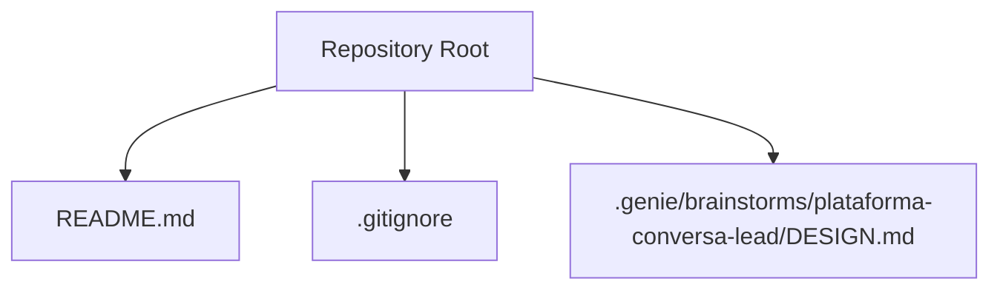
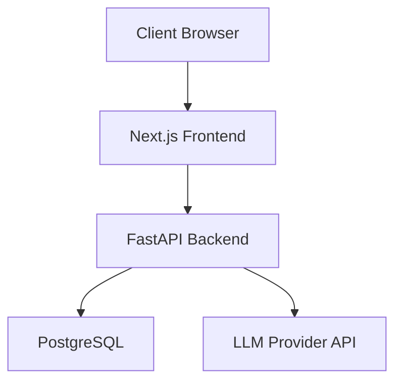
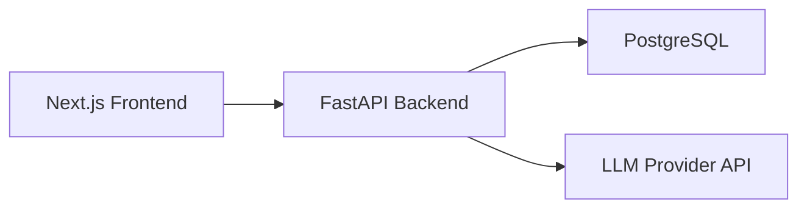

# Deployment Guide

<cite>
**Referenced Files in This Document**
- [README.md](file://README.md)
- [.gitignore](file://.gitignore)
- [DESIGN.md](file://.genie/brainstorms/plataforma-conversa-lead/DESIGN.md)
</cite>

## Table of Contents
1. [Introduction](#introduction)
2. [Project Structure](#project-structure)
3. [Core Components](#core-components)
4. [Architecture Overview](#architecture-overview)
5. [Detailed Component Analysis](#detailed-component-analysis)
6. [Dependency Analysis](#dependency-analysis)
7. [Performance Considerations](#performance-considerations)
8. [Troubleshooting Guide](#troubleshooting-guide)
9. [Conclusion](#conclusion)
10. [Appendices](#appendices)

## Introduction
This guide provides deployment instructions for the Sup Better Engine, a Next.js frontend paired with a FastAPI backend and PostgreSQL database. It covers environment setup, tenant configuration, rate limiting, LLM provider integration, third-party services, containerization, CI/CD, monitoring/logging, production best practices, security, backups, and disaster recovery. The repository is currently in an early stage; this document consolidates architectural decisions from the design to help you plan and execute a robust deployment.

**Section sources**
- [README.md:1-8](file://README.md#L1-L8)

## Project Structure
At present, the repository contains minimal scaffolding and design artifacts. The key elements are:
- A project README indicating the initial status.
- A .gitignore that excludes environment files (except examples).
- A design document describing the intended architecture and operational constraints.

**Diagram sources**
- [README.md:1-8](file://README.md#L1-L8)
- [.gitignore:1-8](file://.gitignore#L1-L8)
- [DESIGN.md:168-366](file://.genie/brainstorms/plataforma-conversa-lead/DESIGN.md#L168-L366)

**Section sources**
- [README.md:1-8](file://README.md#L1-L8)
- [.gitignore:1-8](file://.gitignore#L1-L8)
- [DESIGN.md:168-366](file://.genie/brainstorms/plataforma-conversa-lead/DESIGN.md#L168-L366)

## Core Components
The system is designed as a two-service application:
- Frontend: Next.js application serving the landing page and chat UI with streaming responses.
- Backend: FastAPI service implementing the agent engine (intent classification, qualification handler, fallback logic, email validation, session-to-lead promotion).
- Database: PostgreSQL as the single source of truth for persistent data.

Operational characteristics derived from the design:
- Single pilot tenant initially; multi-tenant later.
- Anonymous sessions with TTL-based cleanup.
- Rate limiting by IP and message caps.
- Email validation via syntax checks and disposable blocklist.
- LLM usage behind rate limits due to public anonymous endpoints.

**Section sources**
- [DESIGN.md:189-196](file://.genie/brainstorms/plataforma-conversa-lead/DESIGN.md#L189-L196)
- [DESIGN.md:339-366](file://.genie/brainstorms/plataforma-conversa-lead/DESIGN.md#L339-L366)

## Architecture Overview
High-level deployment architecture aligns with the design’s stated approach: Next.js frontend, FastAPI backend, and PostgreSQL database.

**Diagram sources**
- [DESIGN.md:189-196](file://.genie/brainstorms/plataforma-conversa-lead/DESIGN.md#L189-L196)

## Detailed Component Analysis

### Environment Setup
- Node.js for Next.js frontend:
  - Install a supported LTS version of Node.js.
  - Configure environment variables for the frontend (e.g., backend base URL, feature flags).
  - Build and serve the Next.js app using standard tooling.
- Python for FastAPI backend:
  - Use a recent Python version compatible with your dependencies.
  - Set environment variables for database connection, LLM provider keys, rate limiting thresholds, and logging configuration.
  - Run the FastAPI server with a production-grade ASGI server.
- PostgreSQL:
  - Provision a managed or self-hosted PostgreSQL instance.
  - Create databases and users with least privilege.
  - Configure connection pooling and TLS where applicable.

**Section sources**
- [DESIGN.md:189-196](file://.genie/brainstorms/plataforma-conversa-lead/DESIGN.md#L189-L196)

### Tenant Configuration
- Start with a single pilot tenant to simplify identity and deduplication.
- Multi-tenancy can be introduced later when demand justifies it.
- Ensure isolation of configuration and data per tenant if expanded.

**Section sources**
- [DESIGN.md:339-366](file://.genie/brainstorms/plataforma-conversa-lead/DESIGN.md#L339-L366)

### Rate Limiting Parameters
- Enforce rate limiting by IP address at the backend or gateway level.
- Apply message caps per session to protect LLM endpoints and manage abuse.
- Treat rate limiting as the primary anti-bot mechanism in the initial scope.

**Section sources**
- [DESIGN.md:339-366](file://.genie/brainstorms/plataforma-conversa-lead/DESIGN.md#L339-L366)

### LLM Provider Integration Setup
- Securely store provider credentials in environment variables.
- Configure timeouts, retries, and backoff strategies.
- Enforce rate limiting and request quotas to prevent abuse and cost overruns.
- Log anonymized metrics for observability without capturing sensitive content.

[No sources needed since this section provides general guidance aligned with design constraints]

### Third-Party Service Configurations
- WhatsApp integration is out of scope for the first slice; treat as future work.
- Any additional services should be configured via environment variables and secrets management.
- Validate integrations with health checks and circuit breakers.

[No sources needed since this section provides general guidance aligned with design constraints]

### Containerization Options
- Frontend:
  - Build a static Next.js output and serve via a lightweight web server or CDN.
  - Optionally run a small Node process for SSR if required.
- Backend:
  - Package the FastAPI application into a minimal Python image.
  - Include only runtime dependencies and configure environment variables at deploy time.
- Database:
  - Use a managed PostgreSQL service or containerize with persistent volumes.
  - Back up regularly and test restores.

[No sources needed since this section provides general guidance aligned with design constraints]

### CI/CD Pipeline Setup
- Lint, test, and build both frontend and backend on every push.
- Publish container images to a registry after successful builds.
- Deploy to staging before production with automated smoke tests.
- Manage secrets through a secure vault or platform-native secret manager.

[No sources needed since this section provides general guidance aligned with design constraints]

### Monitoring and Logging Configuration
- Collect structured logs from both frontend and backend.
- Expose metrics for request rates, latency, error rates, and resource usage.
- Implement health endpoints and readiness probes.
- Centralize logs and metrics in a monitoring stack.

[No sources needed since this section provides general guidance aligned with design constraints]

### Production Deployment Best Practices
- Use HTTPS everywhere and enforce strong TLS settings.
- Enable CORS policies tailored to your domains.
- Apply rate limiting at the edge and backend layers.
- Rotate secrets regularly and audit access.
- Perform regular dependency updates and vulnerability scans.

[No sources needed since this section provides general guidance aligned with design constraints]

### Security Considerations
- Protect environment variables and secrets; never commit them to version control.
- Validate and sanitize all inputs, especially email addresses.
- Restrict database access to necessary privileges.
- Monitor for abuse patterns and adjust rate limits accordingly.

**Section sources**
- [.gitignore:1-8](file://.gitignore#L1-L8)
- [DESIGN.md:339-366](file://.genie/brainstorms/plataforma-conversa-lead/DESIGN.md#L339-L366)

### Backup Strategies
- Schedule automated PostgreSQL backups (full and incremental).
- Store backups offsite with encryption and retention policies.
- Test restore procedures periodically.

[No sources needed since this section provides general guidance aligned with design constraints]

### Disaster Recovery Procedures
- Define RTO/RPO targets aligned with business needs.
- Maintain runbooks for failover and recovery steps.
- Practice incident response drills regularly.

[No sources needed since this section provides general guidance aligned with design constraints]

## Dependency Analysis
The design specifies clear boundaries between components:
- Next.js frontend depends on the FastAPI backend for agent operations.
- FastAPI backend depends on PostgreSQL for persistence and on LLM providers for intelligence.
- Rate limiting protects shared resources and external APIs.

**Diagram sources**
- [DESIGN.md:189-196](file://.genie/brainstorms/plataforma-conversa-lead/DESIGN.md#L189-L196)

**Section sources**
- [DESIGN.md:189-196](file://.genie/brainstorms/plataforma-conversa-lead/DESIGN.md#L189-L196)

## Performance Considerations
- Keep sessions ephemeral with TTL to reduce storage pressure.
- Pre-aggregate counters for reporting to avoid heavy queries.
- Tune database indexes for frequent read/write patterns.
- Cache static assets and use a CDN for the frontend.
- Monitor LLM provider latency and implement retries/backoff.

[No sources needed since this section provides general guidance aligned with design constraints]

## Troubleshooting Guide
Common issues and mitigations:
- Environment variable misconfiguration:
  - Verify all required variables are set and valid.
  - Use example templates and validate at startup.
- Database connectivity failures:
  - Check network rules, credentials, and connection strings.
  - Use health checks and retry logic.
- Rate limiting triggers:
  - Adjust thresholds based on traffic patterns.
  - Investigate potential abuse or misconfigured clients.
- LLM provider errors:
  - Inspect quotas, authentication, and network connectivity.
  - Implement graceful degradation and user-friendly messages.

[No sources needed since this section provides general guidance aligned with design constraints]

## Conclusion
The Sup Better Engine is architected around a Next.js frontend, a FastAPI backend, and PostgreSQL, with explicit design choices for tenant strategy, rate limiting, and session handling. While the repository is in its early stages, these guidelines provide a solid foundation for setting up, securing, and operating the system in production. Expand functionality incrementally, guided by measured demand and validated assumptions.

[No sources needed since this section summarizes without analyzing specific files]

## Appendices

### Appendix A: Environment Variables Checklist
- Frontend:
  - Backend base URL
  - Feature flags
- Backend:
  - Database connection string
  - LLM provider keys and endpoints
  - Rate limiting thresholds
  - Logging configuration
- Database:
  - Credentials and TLS settings
  - Connection pool parameters

[No sources needed since this section provides general guidance aligned with design constraints]

### Appendix B: Health and Readiness Probes
- Frontend:
  - Serve a simple health endpoint.
- Backend:
  - Expose /health and /ready endpoints.
  - Report database and LLM provider status.
- Database:
  - Monitor replication lag and disk usage.

[No sources needed since this section provides general guidance aligned with design constraints]