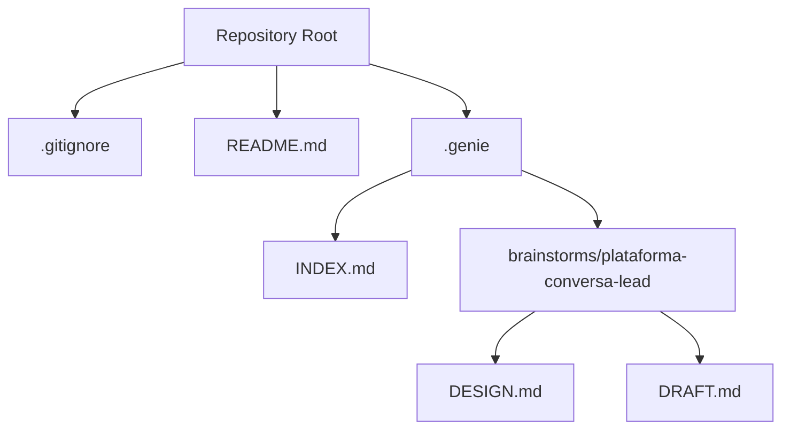
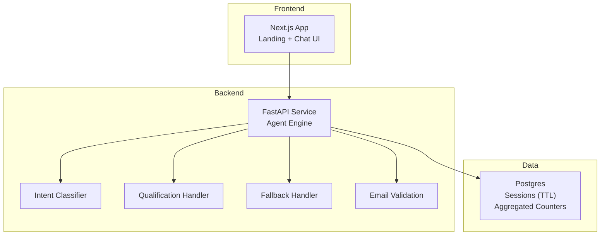
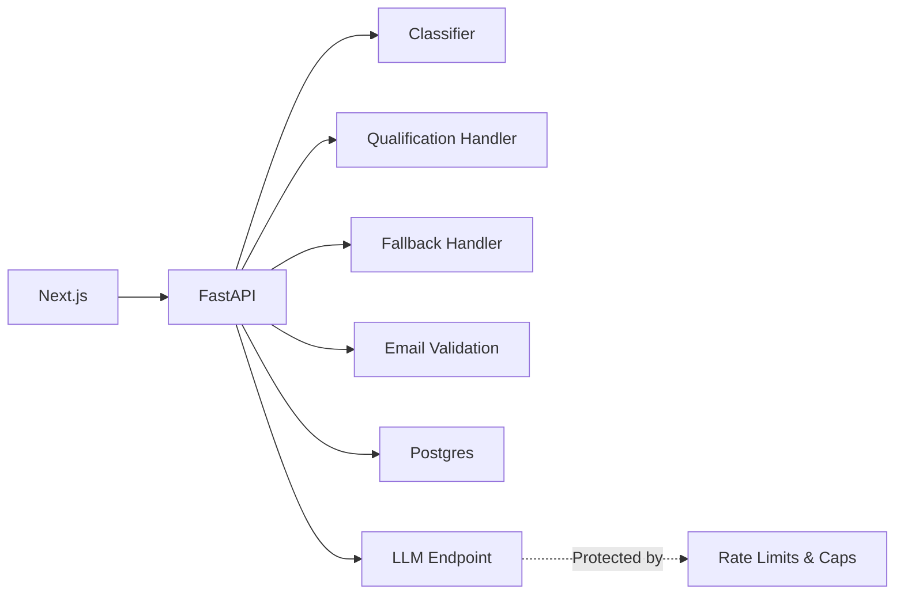

# Development Guide

<cite>
**Referenced Files in This Document**
- [README.md](file://README.md)
- [.gitignore](file://.gitignore)
- [.genie/INDEX.md](file://.genie/INDEX.md)
- [.genie/brainstorms/plataforma-conversa-lead/DESIGN.md](file://.genie/brainstorms/plataforma-conversa-lead/DESIGN.md)
- [.genie/brainstorms/plataforma-conversa-lead/DRAFT.md](file://.genie/brainstorms/plataforma-conversa-lead/DRAFT.md)
</cite>

## Table of Contents
1. Introduction
2. Project Structure
3. Core Components
4. Architecture Overview
5. Detailed Component Analysis
6. Dependency Analysis
7. Performance Considerations
8. Troubleshooting Guide
9. Conclusion
10. Appendices

## Introduction
This guide provides comprehensive development documentation for contributing to the Sup Better Engine project. It covers local setup, codebase structure, development workflow, coding standards, testing strategies (unit, integration, performance), contribution and code review processes, debugging techniques, IDE configuration, common scenarios, and guidance for extending functionality via plugin systems and extension mechanisms described in the architecture. The project is currently in its initial phase; this guide establishes a solid foundation for contributors to begin building toward the documented design.

**Section sources**
- [README.md:1-8](file://README.md#L1-L8)

## Project Structure
At present, the repository contains:
- A README describing the project’s initial status
- A .gitignore with environment and IDE-related exclusions
- A .genie directory containing design artifacts and brainstorming documents that define the system’s scope, architecture, and success criteria

**Diagram sources**
- [README.md:1-8](file://README.md#L1-L8)
- [.gitignore:1-8](file://.gitignore#L1-L8)
- [.genie/INDEX.md:1-12](file://.genie/INDEX.md#L1-L12)
- [.genie/brainstorms/plataforma-conversa-lead/DESIGN.md:1-454](file://.genie/brainstorms/plataforma-conversa-lead/DESIGN.md#L1-L454)
- [.genie/brainstorms/plataforma-conversa-lead/DRAFT.md:1-171](file://.genie/brainstorms/plataforma-conversa-lead/DRAFT.md#L1-L171)

**Section sources**
- [README.md:1-8](file://README.md#L1-L8)
- [.gitignore:1-8](file://.gitignore#L1-L8)
- [.genie/INDEX.md:1-12](file://.genie/INDEX.md#L1-L12)

## Core Components
The design specifies a clear separation between frontend, backend, and data layers:
- Frontend: Next.js application serving the landing page and chat interface
- Backend: FastAPI service implementing the agent engine (classifier, qualification handler, fallback, email validation, session-to-lead promotion)
- Data: Postgres as the single source of truth, including ephemeral sessions with TTL and aggregated counters without per-session identifiers

Key responsibilities:
- Intent classifier producing a single field: intention with explicit abstention
- Routing by message intent to either the real qualification handler or graceful fallback
- Aggregation from message to session for counting only (not behavior)
- Email validation and consent gating for lead creation
- Rate limiting and per-session message caps to protect public LLM endpoints
- Anonymous counters pre-aggregated into low-cardinality buckets at session end or TTL expiry

These components form the backbone of the system and will be implemented incrementally as the codebase grows.

**Section sources**
- [.genie/brainstorms/plataforma-conversa-lead/DESIGN.md:191-232](file://.genie/brainstorms/plataforma-conversa-lead/DESIGN.md#L191-L232)
- [.genie/brainstorms/plataforma-conversa-lead/DESIGN.md:225-232](file://.genie/brainstorms/plataforma-conversa-lead/DESIGN.md#L225-L232)
- [.genie/brainstorms/plataforma-conversa-lead/DESIGN.md:388-399](file://.genie/brainstorms/plataforma-conversa-lead/DESIGN.md#L388-L399)

## Architecture Overview
The high-level architecture follows a layered approach:
- Next.js serves the user experience and streaming chat UI
- FastAPI implements the agent engine and business logic
- Postgres stores ephemeral sessions and aggregated counters
- Rate limiting and message caps protect external LLM usage
- Counters are emitted once per session at termination or TTL expiry, preserving privacy and simplifying analytics

**Diagram sources**
- [.genie/brainstorms/plataforma-conversa-lead/DESIGN.md:191-203](file://.genie/brainstorms/plataforma-conversa-lead/DESIGN.md#L191-L203)
- [.genie/brainstorms/plataforma-conversa-lead/DESIGN.md:204-214](file://.genie/brainstorms/plataforma-conversa-lead/DESIGN.md#L204-L214)

## Detailed Component Analysis

### Intent Classifier
Responsibilities:
- Accepts a message and returns a single intention label among a defined set plus an explicit abstention
- Must be testable in isolation using a labeled dataset
- Supports routing decisions per message while allowing session-level aggregation for metrics

Testing strategy:
- Unit tests against a curated corpus of messages
- Validate abstention handling to avoid mislabeling greetings or noise
- Measure accuracy thresholds and abstention error rates

Integration points:
- Feeds routing decisions to the agent engine
- Supplies intention distribution for counters and reporting

**Section sources**
- [.genie/brainstorms/plataforma-conversa-lead/DESIGN.md:225-232](file://.genie/brainstorms/plataforma-conversa-lead/DESIGN.md#L225-L232)
- [.genie/brainstorms/plataforma-conversa-lead/DESIGN.md:391-394](file://.genie/brainstorms/plataforma-conversa-lead/DESIGN.md#L391-L394)

### Qualification Handler
Responsibilities:
- Captures intention, urgency, and fit during conversation
- Triggers contextual email request when conditions are met or after a turn threshold
- Promotes anonymous session to a durable lead upon successful email submission and consent

Testing strategy:
- Integration tests simulating multi-turn conversations
- Verify conditional triggers and maximum display limits
- Ensure fallback does not respond in place of the real handler

**Section sources**
- [.genie/brainstorms/plataforma-conversa-lead/DESIGN.md:77-98](file://.genie/brainstorms/plataforma-conversa-lead/DESIGN.md#L77-L98)
- [.genie/brainstorms/plataforma-conversa-lead/DESIGN.md:388-390](file://.genie/brainstorms/plataforma-conversa-lead/DESIGN.md#L388-L390)

### Fallback Handler
Responsibilities:
- Gracefully acknowledges requests not handled by the qualification flow
- Directs users to tenant contact information without pretending capabilities that do not exist
- Is terminal for the current turn but not for the session; subsequent qualification messages resume the real handler

Testing strategy:
- End-to-end tests ensuring fallback does not hijack qualification responses
- Verify session remains open and can return to qualification later

**Section sources**
- [.genie/brainstorms/plataforma-conversa-lead/DESIGN.md:79-85](file://.genie/brainstorms/plataforma-conversa-lead/DESIGN.md#L79-L85)
- [.genie/brainstorms/plataforma-conversa-lead/DESIGN.md:389-390](file://.genie/brainstorms/plataforma-conversa-lead/DESIGN.md#L389-L390)

### Email Validation and Consent
Responsibilities:
- Validates email syntax and blocklist domains
- Uses consent as the gate for sending email; no separate checkbox
- Records consent purpose limited to commercial follow-up for the current conversation

Testing strategy:
- Unit tests for validation rules and blocklist checks
- Integration tests verifying consent gating and state transitions
- Ensure rejected emails do not create leads and accepted ones produce durable leads

**Section sources**
- [.genie/brainstorms/plataforma-conversa-lead/DESIGN.md:99-108](file://.genie/brainstorms/plataforma-conversa-lead/DESIGN.md#L99-L108)
- [.genie/brainstorms/plataforma-conversa-lead/DESIGN.md:395-397](file://.genie/brainstorms/plataforma-conversa-lead/DESIGN.md#L395-L397)

### Sessions and Counters
Responsibilities:
- Ephemeral sessions stored in Postgres with TTL; discarded after expiration
- Terminal emission per session increments aggregated counters across categorical dimensions
- No per-session identifiers retained in counters; preserves privacy and simplifies analytics

Testing strategy:
- Integration tests validating TTL-based cleanup and terminal emissions
- Assertions on counter dimensions and monotonic email state progression
- Reconciliation checks ensuring no lead exists without a corresponding accepted session

**Section sources**
- [.genie/brainstorms/plataforma-conversa-lead/DESIGN.md:198-214](file://.genie/brainstorms/plataforma-conversa-lead/DESIGN.md#L198-L214)
- [.genie/brainstorms/plataforma-conversa-lead/DESIGN.md:397-399](file://.genie/brainstorms/plataforma-conversa-lead/DESIGN.md#L397-L399)

### Rate Limiting and Message Caps
Responsibilities:
- Enforces per-IP rate limits and per-session message caps
- Protects public LLM endpoint from abuse and excessive costs
- Tracks excluded sessions separately for auditability

Testing strategy:
- Load tests simulating abusive traffic and high-engagement sessions
- Verify exclusion categories and operational scalars for blocked requests

**Section sources**
- [.genie/brainstorms/plataforma-conversa-lead/DESIGN.md:112-126](file://.genie/brainstorms/plataforma-conversa-lead/DESIGN.md#L112-L126)
- [.genie/brainstorms/plataforma-conversa-lead/DESIGN.md:398-399](file://.genie/brainstorms/plataforma-conversa-lead/DESIGN.md#L398-L399)

## Dependency Analysis
The system exhibits clear layering and minimal coupling:
- Next.js depends on FastAPI through well-defined HTTP contracts
- FastAPI orchestrates classifier, handlers, and validation services
- Postgres is used for ephemeral sessions and aggregated counters
- External LLM endpoints are protected by rate limiting and caps

**Diagram sources**
- [.genie/brainstorms/plataforma-conversa-lead/DESIGN.md:191-203](file://.genie/brainstorms/plataforma-conversa-lead/DESIGN.md#L191-L203)
- [.genie/brainstorms/plataforma-conversa-lead/DESIGN.md:112-126](file://.genie/brainstorms/plataforma-conversa-lead/DESIGN.md#L112-L126)

**Section sources**
- [.genie/brainstorms/plataforma-conversa-lead/DESIGN.md:191-203](file://.genie/brainstorms/plataforma-conversa-lead/DESIGN.md#L191-L203)
- [.genie/brainstorms/plataforma-conversa-lead/DESIGN.md:112-126](file://.genie/brainstorms/plataforma-conversa-lead/DESIGN.md#L112-L126)

## Performance Considerations
- Use Postgres for ephemeral sessions with TTL to avoid additional infrastructure overhead in the pilot
- Emit aggregated counters at session end or TTL expiry to minimize storage and preserve privacy
- Apply rate limiting and per-session caps to control LLM costs and protect availability
- Keep counters low-cardinality and pre-aggregated to simplify analytics and reduce query complexity
- Monitor LLM cost and invalid session volume as triggers for reconsideration of bot detection or other mitigations

[No sources needed since this section provides general guidance]

## Troubleshooting Guide
Common issues and debugging approaches:
- Misrouted messages due to classifier errors: validate classifier accuracy and abstention handling; add unit tests with labeled datasets
- Unexpected session closures: verify fallback is terminal only for the turn and ensure qualification can resume
- Email validation failures: check syntax rules and blocklist; ensure consent gating prevents creating leads without acceptance
- Counter discrepancies: confirm terminal emissions occur for all sessions, including those abandoned or never engaged; reconcile monotonic email state progression
- Rate limit or cap violations: inspect exclusion categories and operational scalars; ensure blocked requests are counted separately and auditable

**Section sources**
- [.genie/brainstorms/plataforma-conversa-lead/DESIGN.md:388-399](file://.genie/brainstorms/plataforma-conversa-lead/DESIGN.md#L388-L399)

## Conclusion
The Sup Better Engine project is designed around a thin vertical slice that proves the core premise before expanding features. The architecture separates concerns clearly, emphasizes privacy-preserving analytics, and includes robust safeguards for external dependencies. As the codebase evolves, contributors should adhere to the documented design principles, maintain strict testing coverage, and follow the contribution and review processes outlined below.

[No sources needed since this section summarizes without analyzing specific files]

## Appendices

### Getting Started: Local Development Setup
- Initialize the repository and configure environment variables using the provided .gitignore patterns
- Set up Next.js for the frontend and FastAPI for the backend according to the design stack
- Configure Postgres for ephemeral sessions with TTL and aggregated counters
- Implement rate limiting and per-session message caps early to protect LLM usage
- Prepare labeled datasets for classifier validation and baseline metrics

**Section sources**
- [.gitignore:1-8](file://.gitignore#L1-L8)
- [.genie/brainstorms/plataforma-conversa-lead/DESIGN.md:191-203](file://.genie/brainstorms/plataforma-conversa-lead/DESIGN.md#L191-L203)
- [.genie/brainstorms/plataforma-conversa-lead/DESIGN.md:112-126](file://.genie/brainstorms/plataforma-conversa-lead/DESIGN.md#L112-L126)

### Codebase Structure Overview
- Frontend: Next.js application for landing and chat UI
- Backend: FastAPI service implementing agent engine components
- Data: Postgres storing sessions and counters
- Design artifacts: .genie directory containing planning and design documents guiding implementation

**Section sources**
- [.genie/INDEX.md:1-12](file://.genie/INDEX.md#L1-L12)
- [.genie/brainstorms/plataforma-conversa-lead/DESIGN.md:191-203](file://.genie/brainstorms/plataforma-conversa-lead/DESIGN.md#L191-L203)

### Development Workflow
- Follow the design-driven approach outlined in the .genie documents
- Implement components incrementally, starting with classifier, handlers, and validation
- Add tests alongside features to meet success criteria
- Review changes against design decisions and risks documented in the design file
- Report metrics and reconciliation results as specified in the success criteria

**Section sources**
- [.genie/brainstorms/plataforma-conversa-lead/DESIGN.md:388-441](file://.genie/brainstorms/plataforma-conversa-lead/DESIGN.md#L388-L441)

### Coding Standards
- Maintain clear separation between classifier, handlers, and validation modules
- Use explicit interfaces for classifier and handlers to enable plug-and-play extensions
- Document assumptions and limitations inline where necessary
- Keep counters and session management aligned with privacy and retention policies

[No sources needed since this section provides general guidance]

### Testing Strategies
- Unit testing:
  - Classifier accuracy and abstention handling
  - Email validation rules and blocklist checks
  - Monotonic email state transitions
- Integration testing:
  - Multi-turn conversation flows with routing and fallback behavior
  - Session lifecycle including TTL and terminal emissions
  - Counter reconciliation and exclusion categories
- Performance testing:
  - Load tests for rate limiting and message caps
  - LLM endpoint protection under abusive traffic
  - Monitoring cost and invalid session volume

**Section sources**
- [.genie/brainstorms/plataforma-conversa-lead/DESIGN.md:391-399](file://.genie/brainstorms/plataforma-conversa-lead/DESIGN.md#L391-L399)
- [.genie/brainstorms/plataforma-conversa-lead/DESIGN.md:112-126](file://.genie/brainstorms/plataforma-conversa-lead/DESIGN.md#L112-L126)

### Contribution Guidelines and Code Review Process
- Align contributions with the design decisions and scope defined in the design document
- Submit changes that improve classifier accuracy, handler correctness, and counter integrity
- Include tests covering new behaviors and edge cases
- Ensure compliance with privacy and retention policies
- Review against success criteria and risks to maintain quality and focus

**Section sources**
- [.genie/brainstorms/plataforma-conversa-lead/DESIGN.md:388-441](file://.genie/brainstorms/plataforma-conversa-lead/DESIGN.md#L388-L441)

### Debugging Techniques
- Inspect classifier outputs and routing decisions per message
- Validate fallback behavior and session continuity
- Check email validation logs and consent records
- Review session TTL events and terminal emissions
- Analyze rate limit and cap enforcement logs for exclusion categories

**Section sources**
- [.genie/brainstorms/plataforma-conversa-lead/DESIGN.md:388-399](file://.genie/brainstorms/plataforma-conversa-lead/DESIGN.md#L388-L399)

### IDE Configuration
- Use the existing .gitignore to exclude environment files and IDE-specific directories
- Configure your IDE to recognize Next.js and FastAPI project structures
- Set up linting and formatting tools consistent with team standards

**Section sources**
- [.gitignore:1-8](file://.gitignore#L1-L8)

### Common Development Scenarios
- Adding a new handler: implement behind a unified contract, update routing based on message intent, and ensure fallback remains isolated
- Extending classifier labels: expand the intention set carefully, update tests and counters, and validate impact on routing and metrics
- Modifying email validation: adjust rules and blocklist, update consent gating, and ensure state transitions remain monotonic
- Adjusting rate limits or caps: retest exclusion categories and operational scalars, and monitor LLM cost implications

**Section sources**
- [.genie/brainstorms/plataforma-conversa-lead/DESIGN.md:225-232](file://.genie/brainstorms/plataforma-conversa-lead/DESIGN.md#L225-L232)
- [.genie/brainstorms/plataforma-conversa-lead/DESIGN.md:398-399](file://.genie/brainstorms/plataforma-conversa-lead/DESIGN.md#L398-L399)

### Extending Functionality Through Plugin Systems and Extension Mechanisms
- Classifier extensibility:
  - Define a stable interface for classification that accepts a message and returns intention plus optional metadata
  - Support multiple cadences for reading classifier output (per-message routing vs. per-session aggregation)
- Handler extensibility:
  - Implement handlers behind a unified contract that takes session context and returns responses
  - Ensure routing evaluates per message so new handlers can be added without affecting existing behavior
- Validation and consent:
  - Keep validation rules modular and configurable
  - Ensure consent gating remains the sole mechanism for creating durable leads
- Counters and metrics:
  - Extend aggregated counters with new categorical dimensions while preserving low cardinality
  - Maintain terminal emission semantics to avoid per-session identifiers

**Section sources**
- [.genie/brainstorms/plataforma-conversa-lead/DESIGN.md:225-232](file://.genie/brainstorms/plataforma-conversa-lead/DESIGN.md#L225-L232)
- [.genie/brainstorms/plataforma-conversa-lead/DESIGN.md:204-214](file://.genie/brainstorms/plataforma-conversa-lead/DESIGN.md#L204-L214)