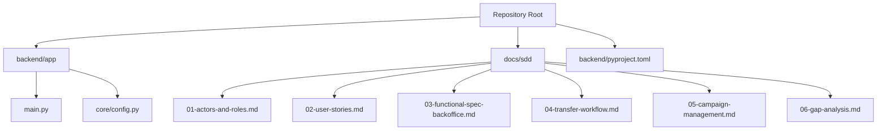
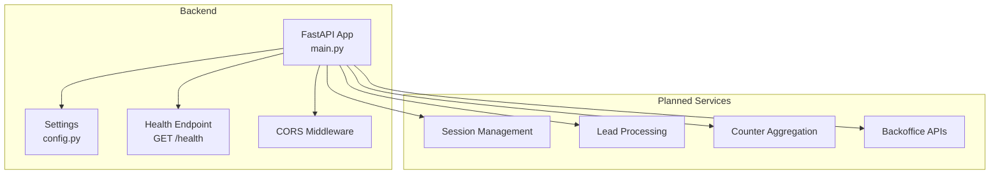
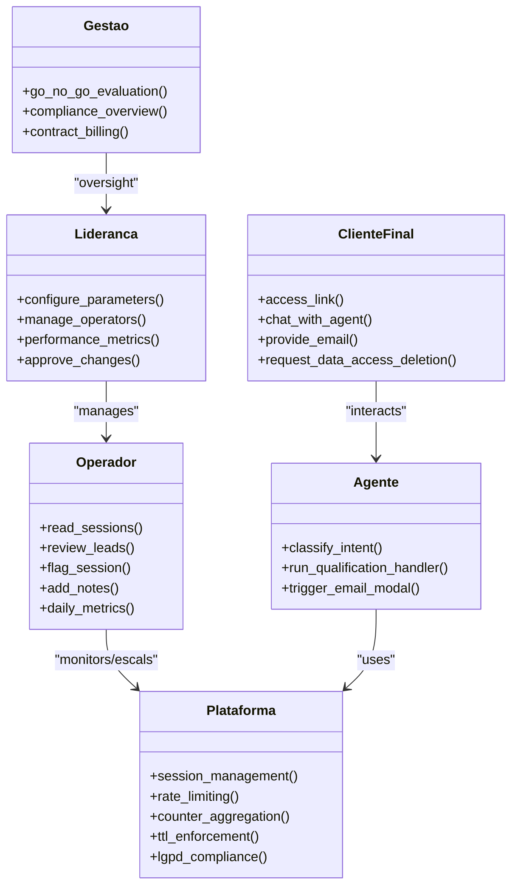
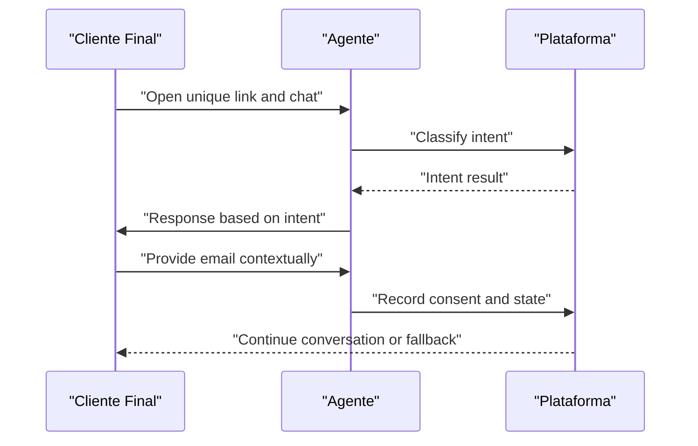
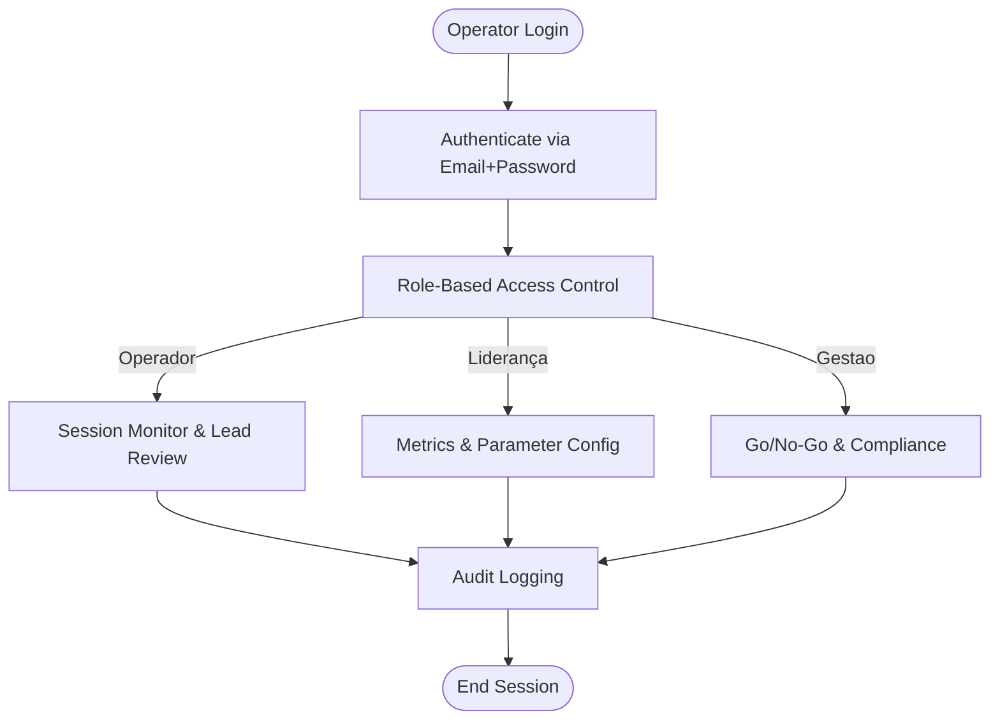
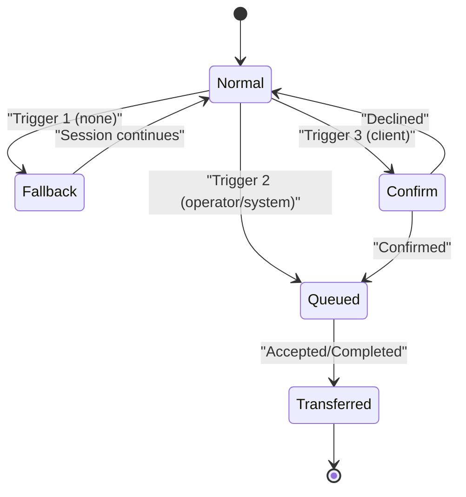
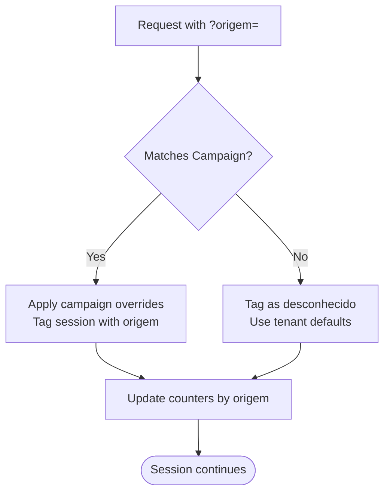
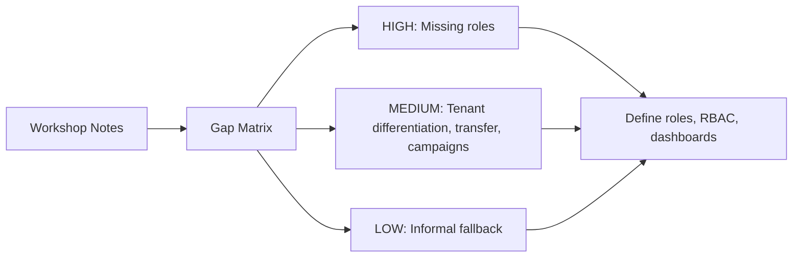
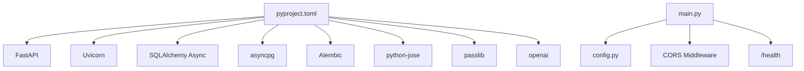

# SDD Documents

<cite>
**Referenced Files in This Document**
- [README.md](file://README.md)
- [main.py](file://backend/app/main.py)
- [config.py](file://backend/app/core/config.py)
- [pyproject.toml](file://backend/pyproject.toml)
- [01-actors-and-roles.md](file://docs/sdd/01-actors-and-roles.md)
- [02-user-stories.md](file://docs/sdd/02-user-stories.md)
- [03-functional-spec-backoffice.md](file://docs/sdd/03-functional-spec-backoffice.md)
- [04-transfer-workflow.md](file://docs/sdd/04-transfer-workflow.md)
- [05-campaign-management.md](file://docs/sdd/05-campaign-management.md)
- [06-gap-analysis.md](file://docs/sdd/06-gap-analysis.md)
</cite>

## Table of Contents
1. [Introduction](#introduction)
2. [Project Structure](#project-structure)
3. [Core Components](#core-components)
4. [Architecture Overview](#architecture-overview)
5. [Detailed Component Analysis](#detailed-component-analysis)
6. [Dependency Analysis](#dependency-analysis)
7. [Performance Considerations](#performance-considerations)
8. [Troubleshooting Guide](#troubleshooting-guide)
9. [Conclusion](#conclusion)
10. [Appendices](#appendices)

## Introduction
This Software Design Document (SDD) consolidates the design and functional specifications for the sup-better-engine platform, a lead conversation system that classifies intent, qualifies leads, and provides a backoffice for operational oversight. The repository is in its initial phase and includes:
- A FastAPI application with configuration management and CORS middleware
- A comprehensive set of SDD documents defining actors, user stories, backoffice functionality, transfer workflows, campaign configuration, and gap analysis
- A backend project configuration outlining dependencies and tooling

The goal is to provide both technical and non-technical readers with a clear understanding of the system’s architecture, components, data flows, and operational considerations.

**Section sources**
- [README.md:1-8](file://README.md#L1-L8)

## Project Structure
At a high level, the repository is organized into:
- Backend application code under backend/app with core modules (FastAPI app, configuration)
- Documentation under docs/sdd covering actors, user stories, backoffice specs, transfer workflow, campaign management, and gap analysis
- Project configuration and dependencies under backend/pyproject.toml

**Diagram sources**
- [main.py:1-40](file://backend/app/main.py#L1-L40)
- [config.py:1-52](file://backend/app/core/config.py#L1-L52)
- [pyproject.toml:1-46](file://backend/pyproject.toml#L1-L46)
- [01-actors-and-roles.md:1-100](file://docs/sdd/01-actors-and-roles.md#L1-L100)
- [02-user-stories.md:1-211](file://docs/sdd/02-user-stories.md#L1-L211)
- [03-functional-spec-backoffice.md:1-335](file://docs/sdd/03-functional-spec-backoffice.md#L1-L335)
- [04-transfer-workflow.md:1-295](file://docs/sdd/04-transfer-workflow.md#L1-L295)
- [05-campaign-management.md:1-262](file://docs/sdd/05-campaign-management.md#L1-L262)
- [06-gap-analysis.md:1-248](file://docs/sdd/06-gap-analysis.md#L1-L248)

**Section sources**
- [main.py:1-40](file://backend/app/main.py#L1-L40)
- [config.py:1-52](file://backend/app/core/config.py#L1-L52)
- [pyproject.toml:1-46](file://backend/pyproject.toml#L1-L46)

## Core Components
- Application entrypoint and lifecycle:
  - FastAPI app factory with lifespan hooks for startup/shutdown
  - Health check endpoint for service readiness
  - CORS middleware configured via settings
- Configuration management:
  - Centralized Settings model loaded from environment variables or .env file
  - Keys include database URLs, JWT parameters, CORS origins, LLM provider settings, and operational parameters (session TTL, rate limits, turn limits, email modal triggers)
- Dependencies and tooling:
  - FastAPI, uvicorn, SQLAlchemy async, asyncpg, Alembic, Pydantic, jose, passlib, httpx, OpenAI client, tenacity, cachetools
  - Dev tools: pytest, ruff, mypy

These components form the foundation for implementing the backoffice, session handling, classification, and qualification workflows described in the SDD documents.

**Section sources**
- [main.py:11-39](file://backend/app/main.py#L11-L39)
- [config.py:8-51](file://backend/app/core/config.py#L8-L51)
- [pyproject.toml:1-46](file://backend/pyproject.toml#L1-L46)

## Architecture Overview
The platform exposes an API surface (currently minimal) and will host backoffice dashboards and agent interactions. The current implementation focuses on:
- FastAPI application with health endpoint and CORS
- Configuration-driven behavior (CORS origins, DB URLs, JWT, LLM mode)
- Planned integration points for sessions, leads, counters, operators, and campaigns as defined in the SDD documents

**Diagram sources**
- [main.py:19-39](file://backend/app/main.py#L19-L39)
- [config.py:20-48](file://backend/app/core/config.py#L20-L48)

## Detailed Component Analysis

### Actors and Roles
The actor model defines three internal roles (Operador, Liderança dos Operadores, Gestão da Empresa) and external actors (Cliente Final), plus implicit system actors (Agente, Plataforma). An access control matrix outlines permissions across resources such as sessions, leads, counters, routing rules, operator management, compliance reports, and audit logs.

**Diagram sources**
- [01-actors-and-roles.md:10-30](file://docs/sdd/01-actors-and-roles.md#L10-L30)
- [01-actors-and-roles.md:77-88](file://docs/sdd/01-actors-and-roles.md#L77-L88)

**Section sources**
- [01-actors-and-roles.md:10-30](file://docs/sdd/01-actors-and-roles.md#L10-L30)
- [01-actors-and-roles.md:77-88](file://docs/sdd/01-actors-and-roles.md#L77-L88)

### User Stories
User stories are organized by actor:
- Cliente Final: link-based access, intent-appropriate responses, contextual email collection, LGPD transparency, data rights
- Operador: session monitoring, lead review, escalation handling, daily metrics
- Liderança: aggregated performance metrics, parameter configuration, operator management, workflow change approval
- Gestão: pilot evaluation evidence, compliance and governance, feature expansion decisions
- Transfer-related: system-initiated fallback, operator-initiated transfer, client-requested transfer

**Diagram sources**
- [02-user-stories.md:10-55](file://docs/sdd/02-user-stories.md#L10-L55)

**Section sources**
- [02-user-stories.md:10-55](file://docs/sdd/02-user-stories.md#L10-L55)
- [02-user-stories.md:58-168](file://docs/sdd/02-user-stories.md#L58-L168)
- [02-user-stories.md:171-200](file://docs/sdd/02-user-stories.md#L171-L200)

### Backoffice Functional Specification
The backoffice supports three roles with distinct permissions and dashboards:
- Operator dashboard: session monitor, lead review, daily metrics
- Leadership dashboard: weekly/monthly metrics, parameter configuration, operator management
- Gestão dashboard: go/no-go evidence panel, compliance overview

Proposed API endpoints cover authentication, sessions, leads, counters, configuration, operators, compliance, and audit logs. Data access patterns emphasize reading from Postgres with pre-aggregated counters and TTL-filtered sessions.

**Diagram sources**
- [03-functional-spec-backoffice.md:26-82](file://docs/sdd/03-functional-spec-backoffice.md#L26-L82)
- [03-functional-spec-backoffice.md:85-168](file://docs/sdd/03-functional-spec-backoffice.md#L85-L168)
- [03-functional-spec-backoffice.md:170-222](file://docs/sdd/03-functional-spec-backoffice.md#L170-L222)
- [03-functional-spec-backoffice.md:224-281](file://docs/sdd/03-functional-spec-backoffice.md#L224-L281)
- [03-functional-spec-backoffice.md:286-335](file://docs/sdd/03-functional-spec-backoffice.md#L286-L335)

**Section sources**
- [03-functional-spec-backoffice.md:26-82](file://docs/sdd/03-functional-spec-backoffice.md#L26-L82)
- [03-functional-spec-backoffice.md:85-168](file://docs/sdd/03-functional-spec-backoffice.md#L85-L168)
- [03-functional-spec-backoffice.md:170-222](file://docs/sdd/03-functional-spec-backoffice.md#L170-L222)
- [03-functional-spec-backoffice.md:224-281](file://docs/sdd/03-functional-spec-backoffice.md#L224-L281)
- [03-functional-spec-backoffice.md:286-335](file://docs/sdd/03-functional-spec-backoffice.md#L286-L335)

### Transfer Workflow
Transfer workflow defines three triggers:
- Trigger 1: No transfer configured — fallback message and alternative contact
- Trigger 2: Operator/system decision — queue or channel transfer
- Trigger 3: Client-requested transfer — NLU detection and confirmation flow

A state machine tracks transitions from normal to queued, transferred, or continued states. Integration impacts include extending the fallback handler, adding transfer fields to sessions, and tracking transfer events via counters.

**Diagram sources**
- [04-transfer-workflow.md:80-135](file://docs/sdd/04-transfer-workflow.md#L80-L135)
- [04-transfer-workflow.md:152-193](file://docs/sdd/04-transfer-workflow.md#L152-L193)
- [04-transfer-workflow.md:195-235](file://docs/sdd/04-transfer-workflow.md#L195-L235)

**Section sources**
- [04-transfer-workflow.md:80-135](file://docs/sdd/04-transfer-workflow.md#L80-L135)
- [04-transfer-workflow.md:152-193](file://docs/sdd/04-transfer-workflow.md#L152-L193)
- [04-transfer-workflow.md:195-235](file://docs/sdd/04-transfer-workflow.md#L195-L235)

### Campaign Management
Campaign configuration defines labeled links with attribution via the origem parameter. It includes:
- CampaignConfig schema with name, slug, origem_value, base_url, optional overrides, status, and metrics
- Link generation and attribution logic mapping to counter buckets
- Lifecycle states (draft, active, paused, archived) with rules governing link activity and counter updates
- Minimal fatia 1 scope focusing on attribution and link management; per-campaign overrides deferred

**Diagram sources**
- [05-campaign-management.md:28-67](file://docs/sdd/05-campaign-management.md#L28-L67)
- [05-campaign-management.md:107-151](file://docs/sdd/05-campaign-management.md#L107-L151)
- [05-campaign-management.md:154-183](file://docs/sdd/05-campaign-management.md#L154-L183)

**Section sources**
- [05-campaign-management.md:28-67](file://docs/sdd/05-campaign-management.md#L28-L67)
- [05-campaign-management.md:107-151](file://docs/sdd/05-campaign-management.md#L107-L151)
- [05-campaign-management.md:154-183](file://docs/sdd/05-campaign-management.md#L154-L183)

### Gap Analysis
The gap analysis maps workshop notes against DESIGN.md coverage, identifying missing or partial elements:
- HIGH severity: no operator role, no leadership role
- MEDIUM severity: undifferentiated tenant role, unspecified transfer workflow, under-specified campaign configuration
- LOW severity: informal “no transfer” state
Ambiguities include role definitions, transfer scope, campaign scope, and operator count. Recommendations propose updates to vocabulary, scope, risks, and clarifications for backoffice and transfer features.

**Diagram sources**
- [06-gap-analysis.md:27-39](file://docs/sdd/06-gap-analysis.md#L27-L39)
- [06-gap-analysis.md:42-126](file://docs/sdd/06-gap-analysis.md#L42-L126)
- [06-gap-analysis.md:129-164](file://docs/sdd/06-gap-analysis.md#L129-L164)

**Section sources**
- [06-gap-analysis.md:27-39](file://docs/sdd/06-gap-analysis.md#L27-L39)
- [06-gap-analysis.md:42-126](file://docs/sdd/06-gap-analysis.md#L42-L126)
- [06-gap-analysis.md:129-164](file://docs/sdd/06-gap-analysis.md#L129-L164)

## Dependency Analysis
The backend depends on FastAPI and related libraries for HTTP serving, async database access, migrations, configuration, authentication, and optional LLM integration. The application currently wires up CORS and a health endpoint, while the SDD documents outline future services and APIs.

**Diagram sources**
- [pyproject.toml:1-46](file://backend/pyproject.toml#L1-L46)
- [main.py:19-39](file://backend/app/main.py#L19-L39)
- [config.py:8-51](file://backend/app/core/config.py#L8-L51)

**Section sources**
- [pyproject.toml:1-46](file://backend/pyproject.toml#L1-L46)
- [main.py:19-39](file://backend/app/main.py#L19-L39)
- [config.py:8-51](file://backend/app/core/config.py#L8-L51)

## Performance Considerations
- Use pre-aggregated counters for fast reads in backoffice dashboards
- Enforce TTL and turn limits to manage session lifecycles and resource usage
- Configure rate limiting per IP/hour to protect against abuse
- Optimize database queries with appropriate indexes (e.g., campaign configs by origem and status)
- Cache frequently accessed configuration where feasible

[No sources needed since this section provides general guidance]

## Troubleshooting Guide
- Health checks:
  - Verify GET /health returns a success status to confirm service availability
- Configuration issues:
  - Ensure environment variables or .env file contain correct values for database URLs, JWT secret, CORS origins, and LLM keys
  - Validate that CORS origins match frontend domains to avoid cross-origin errors
- Authentication and authorization:
  - Confirm JWT expiration and refresh token handling align with backoffice session requirements
  - Validate RBAC permissions for each role before exposing endpoints
- Operational parameters:
  - Adjust session TTL, rate limits, turn limits, and email modal triggers via configuration UI when implemented
  - Monitor counters to detect anomalies (e.g., excessive exclusions due to rate or turn limits)

**Section sources**
- [main.py:36-39](file://backend/app/main.py#L36-L39)
- [config.py:20-48](file://backend/app/core/config.py#L20-L48)

## Conclusion
The sup-better-engine platform combines a minimal FastAPI backend with comprehensive SDD documentation that defines actors, user stories, backoffice functionality, transfer workflows, and campaign configuration. The current implementation establishes foundational infrastructure (app, configuration, CORS, health endpoint), while the SDD documents guide future development toward a robust backoffice and conversational lead qualification system. Priorities include implementing authentication/RBAC, session and lead processing, counter aggregation, and transfer/campaign configuration aligned with the specified scopes.

[No sources needed since this section summarizes without analyzing specific files]

## Appendices
- API endpoints proposed for backoffice operations (authentication, sessions, leads, counters, configuration, operators, compliance, audit)
- Data models for sessions, leads, campaigns, and counters as outlined in the SDD documents
- Operational parameters and their impact on session behavior and metrics

[No sources needed since this section lists references without analyzing specific files]