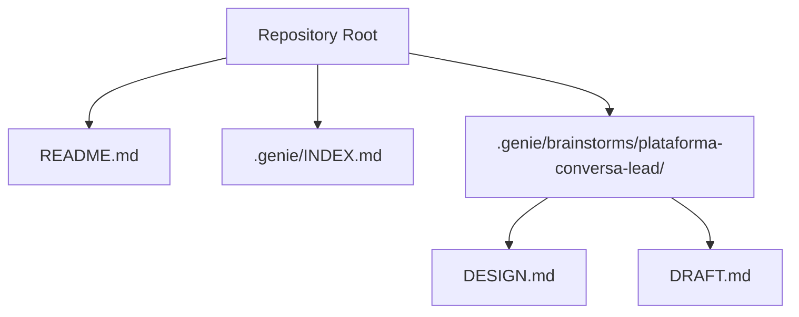
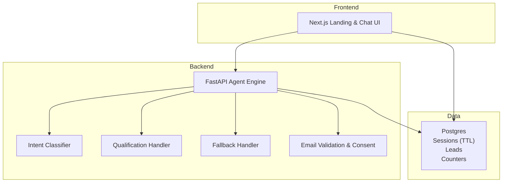
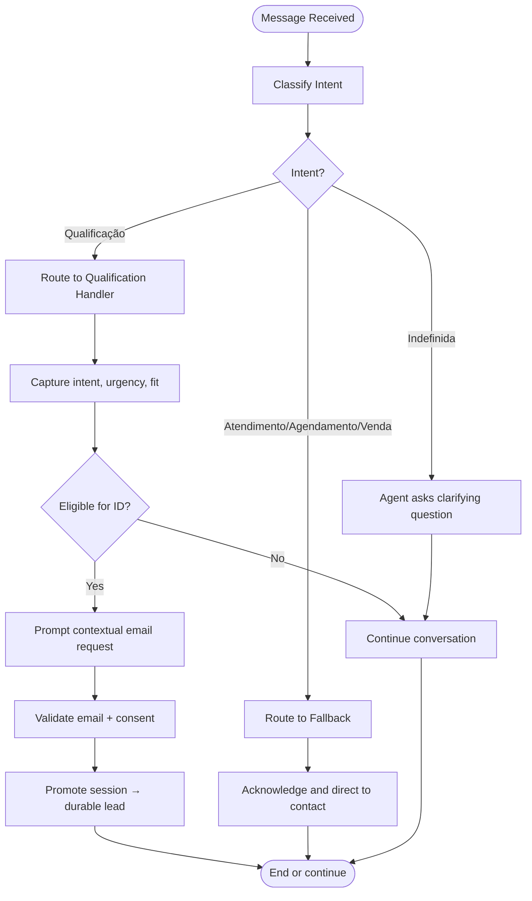
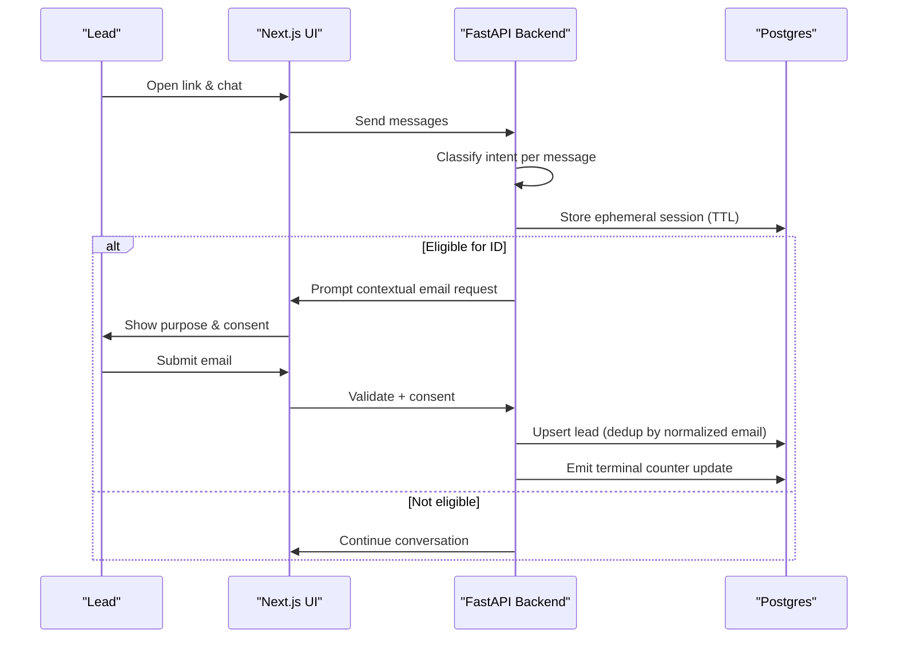
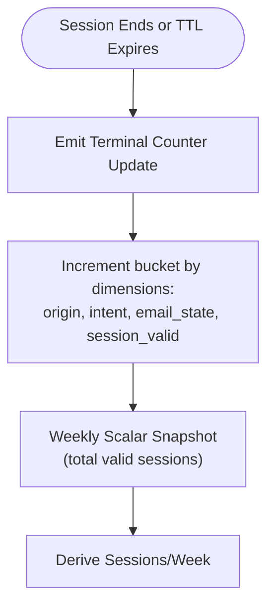
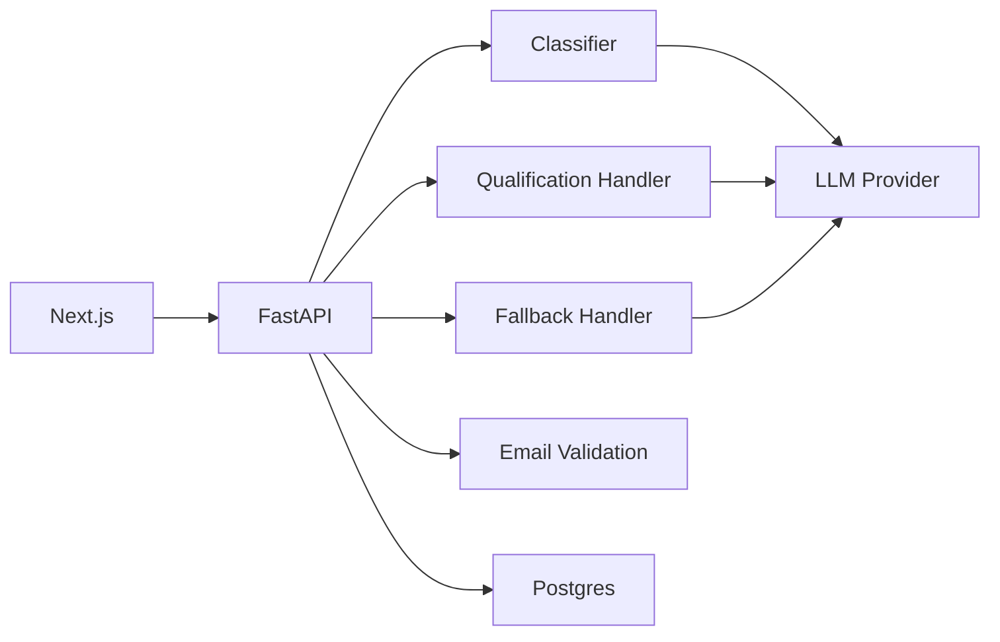

# Project Overview

<cite>
**Referenced Files in This Document**
- [README.md](file://README.md)
- [INDEX.md](file://.genie/INDEX.md)
- [DESIGN.md](file://.genie/brainstorms/plataforma-conversa-lead/DESIGN.md)
- [DRAFT.md](file://.genie/brainstorms/plataforma-conversa-lead/DRAFT.md)
</cite>

## Table of Contents
1. [Introduction](#introduction)
2. [Project Structure](#project-structure)
3. [Core Components](#core-components)
4. [Architecture Overview](#architecture-overview)
5. [Detailed Component Analysis](#detailed-component-analysis)
6. [Dependency Analysis](#dependency-analysis)
7. [Performance Considerations](#performance-considerations)
8. [Troubleshooting Guide](#troubleshooting-guide)
9. [Conclusion](#conclusion)
10. [Appendices](#appendices)

## Introduction
Sup Better Engine is a Next.js-based conversational platform designed to bridge WhatsApp messaging with a dedicated, structured lead qualification experience. The project’s core hypothesis is that leads will accept moving from WhatsApp to a private link-based chat where the agent can deliver richer interactions and identity can be resolved reliably. The current status is an initial planning phase: the repository contains design artifacts and a readiness index indicating the first slice is ready for implementation.

Target audience:
- Companies that currently converse with leads via WhatsApp and want a scalable, structured alternative without losing reach.
- Pilot tenants who will provide real traffic and feedback during a time-boxed experiment.

Core value proposition:
- Test whether leads accept leaving WhatsApp for a dedicated conversational platform while preserving identity consistency through email normalization and consent capture.
- Provide a minimal, measurable path from anonymous chat to qualified lead, with privacy-preserving counters and clear success criteria.

Project roadmap highlights:
- Slice 1 focuses on a thin vertical: link landing, anonymous chat, intent classification, one real handler (qualification), graceful fallback, contextual email request, durable lead creation, and aggregated counters.
- Subsequent slices add richer handlers, media, live handoff, admin, marketing campaigns, multi-tenant support, and deeper identity resolution when evidence justifies investment.

How it fits into the broader ecosystem:
- Complements conversational AI solutions by providing a tenant-owned channel that integrates with existing WhatsApp outreach as an entry point, not a two-way sync.
- Emphasizes privacy-by-design (ephemeral sessions, aggregated metrics, restricted consent scope) and operational safety (rate limiting, session caps).

**Section sources**
- [README.md:1-8](file://README.md#L1-L8)
- [INDEX.md:1-12](file://.genie/INDEX.md#L1-L12)
- [DESIGN.md:10-35](file://.genie/brainstorms/plataforma-conversa-lead/DESIGN.md#L10-L35)
- [DRAFT.md:9-22](file://.genie/brainstorms/plataforma-conversa-lead/DRAFT.md#L9-L22)

## Project Structure
The repository is intentionally minimal at this stage, centered around design documentation and planning artifacts:
- README.md: Project name and status (“initial phase”).
- .genie/INDEX.md: Plans index marking the first slice as “Ready” with a pointer to the design document.
- .genie/brainstorms/plataforma-conversa-lead/: Contains the detailed design and draft notes that define scope, decisions, risks, and success criteria.

**Diagram sources**
- [README.md:1-8](file://README.md#L1-L8)
- [INDEX.md:1-12](file://.genie/INDEX.md#L1-L12)
- [DESIGN.md:1-20](file://.genie/brainstorms/plataforma-conversa-lead/DESIGN.md#L1-L20)
- [DRAFT.md:1-10](file://.genie/brainstorms/plataforma-conversa-lead/DRAFT.md#L1-L10)

**Section sources**
- [README.md:1-8](file://README.md#L1-L8)
- [INDEX.md:1-12](file://.genie/INDEX.md#L1-L12)

## Core Components
Slice 1 defines a focused set of components to validate the central premise:

- Link landing page: Serves a unique link with attribution via query parameter; renders the chat interface.
- Anonymous chat: Conversation starts without friction; identification occurs contextually later.
- Intent classifier: Classifies each message into categories including abstention; drives routing per message.
- Qualification handler: Captures intent, urgency, fit; produces structured output for the commercial team.
- Graceful fallback: Handles non-qualification intents by acknowledging and pointing to contact; terminal per turn but not per session.
- Contextual identification: Requests email mid-conversation with explicit purpose and consent; validates syntax and disposable domains.
- Session management: Ephemeral sessions stored in Postgres with TTL; promoted to durable lead upon successful identification.
- Aggregated counters: Privacy-preserving, pre-aggregated buckets capturing origin, intent, email state, and validity; weekly scalar snapshots.
- Rate limiting and session caps: Protects LLM endpoint; distinguishes abuse vs. highly engaged sessions.

These components collectively test adoption and quality while keeping complexity minimal and privacy strong.

**Section sources**
- [DESIGN.md:47-167](file://.genie/brainstorms/plataforma-conversa-lead/DESIGN.md#L47-L167)
- [DESIGN.md:189-233](file://.genie/brainstorms/plataforma-conversa-lead/DESIGN.md#L189-L233)
- [DESIGN.md:386-415](file://.genie/brainstorms/plataforma-conversa-lead/DESIGN.md#L386-L415)

## Architecture Overview
High-level architecture aligns with the design’s stated preference: Next.js frontend, FastAPI backend, and Postgres as the single source of truth.

**Diagram sources**
- [DESIGN.md:189-203](file://.genie/brainstorms/plataforma-conversa-lead/DESIGN.md#L189-L203)
- [DESIGN.md:225-233](file://.genie/brainstorms/plataforma-conversa-lead/DESIGN.md#L225-L233)

## Detailed Component Analysis

### Intent Classification and Routing
- Per-message classification determines routing; abstention triggers clarification rather than handler invocation.
- Routing re-evaluates every message to avoid misrouting late-turn requests.
- Session aggregation inherits the first labeled intent to protect metric integrity.

**Diagram sources**
- [DESIGN.md:53-85](file://.genie/brainstorms/plataforma-conversa-lead/DESIGN.md#L53-L85)
- [DESIGN.md:225-233](file://.genie/brainstorms/plataforma-conversa-lead/DESIGN.md#L225-L233)

**Section sources**
- [DESIGN.md:53-85](file://.genie/brainstorms/plataforma-conversa-lead/DESIGN.md#L53-L85)
- [DESIGN.md:225-233](file://.genie/brainstorms/plataforma-conversa-lead/DESIGN.md#L225-L233)

### Contextual Identification and Consent
- Email request is triggered after capturing key signals or by a turn ceiling to ensure progress.
- Consent is tied to sending; purpose is narrowly scoped to commercial return for this conversation.
- Validation includes syntax checks and disposable domain blocklist; no double opt-in in this slice.

**Diagram sources**
- [DESIGN.md:86-111](file://.genie/brainstorms/plataforma-conversa-lead/DESIGN.md#L86-L111)
- [DESIGN.md:189-203](file://.genie/brainstorms/plataforma-conversa-lead/DESIGN.md#L189-L203)
- [DESIGN.md:386-398](file://.genie/brainstorms/plataforma-conversa-lead/DESIGN.md#L386-L398)

**Section sources**
- [DESIGN.md:86-111](file://.genie/brainstorms/plataforma-conversa-lead/DESIGN.md#L86-L111)
- [DESIGN.md:386-398](file://.genie/brainstorms/plataforma-conversa-lead/DESIGN.md#L386-L398)

### Counters and Metrics
- Pre-aggregated counters capture origin, intent, email state, and validity without per-session identifiers.
- Weekly scalar snapshots track total valid sessions; differences yield weekly rates.
- Edge-block counters track IP-level blocks separately to avoid contaminating session units.

**Diagram sources**
- [DESIGN.md:127-166](file://.genie/brainstorms/plataforma-conversa-lead/DESIGN.md#L127-L166)
- [DESIGN.md:204-214](file://.genie/brainstorms/plataforma-conversa-lead/DESIGN.md#L204-L214)

**Section sources**
- [DESIGN.md:127-166](file://.genie/brainstorms/plataforma-conversa-lead/DESIGN.md#L127-L166)
- [DESIGN.md:204-214](file://.genie/brainstorms/plataforma-conversa-lead/DESIGN.md#L204-L214)

### Success Criteria and Go/No-Go
- Baseline decomposed into three numbers: link opening rate, engagement, and identification conversion.
- Floor report always available; inferential layer only above N=200.
- Go/no-go rules are pre-registered and qualitative, requiring both adoption and quality judgments.

**Section sources**
- [DESIGN.md:386-439](file://.genie/brainstorms/plataforma-conversa-lead/DESIGN.md#L386-L439)

## Dependency Analysis
Key dependencies and relationships:
- Next.js depends on FastAPI for agent logic and data operations.
- FastAPI orchestrates classifier, handlers, validation, and database interactions.
- Postgres stores ephemeral sessions, durable leads, and aggregated counters.
- External LLM provider used by classifier/handlers; requires retention policy and DPA.

**Diagram sources**
- [DESIGN.md:189-203](file://.genie/brainstorms/plataforma-conversa-lead/DESIGN.md#L189-L203)
- [DESIGN.md:225-233](file://.genie/brainstorms/plataforma-conversa-lead/DESIGN.md#L225-L233)

**Section sources**
- [DESIGN.md:189-203](file://.genie/brainstorms/plataforma-conversa-lead/DESIGN.md#L189-L203)
- [DESIGN.md:225-233](file://.genie/brainstorms/plataforma-conversa-lead/DESIGN.md#L225-L233)

## Performance Considerations
- Rate limiting per IP and per-session message caps protect the public LLM endpoint and control costs.
- Ephemeral sessions with TTL reduce storage footprint and simplify privacy compliance.
- Aggregated counters minimize persistent state and avoid per-session correlation overhead.
- Fallback is terminal per turn to prevent unnecessary handler invocations while preserving session continuity.

[No sources needed since this section provides general guidance]

## Troubleshooting Guide
Common issues and mitigations:
- Misclassification leading to wrong routing: Monitor fallback usage and classifier accuracy thresholds; maintain a labeled dataset for validation.
- Excessive session caps removing engaged users: Track “excluida_teto” separately and adjust caps based on observed conversation length.
- Invalid emails or disposable domains: Enforce syntax and blocklist; record “enviado_recusado” states for analysis.
- Edge-block spikes: Review IP-level block scalars daily; investigate automated traffic patterns.
- LLM provider retention risks: Ensure signed DPA and zero-retention policy before pilot launch.

**Section sources**
- [DESIGN.md:368-385](file://.genie/brainstorms/plataforma-conversa-lead/DESIGN.md#L368-L385)
- [DESIGN.md:386-415](file://.genie/brainstorms/plataforma-conversa-lead/DESIGN.md#L386-L415)

## Conclusion
Sup Better Engine’s Slice 1 provides a focused, privacy-aware, and measurable approach to testing whether leads will adopt a dedicated conversational platform beyond WhatsApp. By starting anonymous, classifying intent per message, and requesting identification contextually, the system balances friction with conversion. Aggregated counters and strict retention policies keep the design lean and compliant. The go/no-go framework ensures disciplined expansion only when evidence supports it, positioning the project as a pragmatic addition to the conversational AI ecosystem.

[No sources needed since this section summarizes without analyzing specific files]

## Appendices
- Status: Initial planning phase; Slice 1 marked Ready in plans index.
- Scope boundaries: Explicitly excludes multi-tenant, marketing dispatch, live handoff, media modal, and deep identity merging until demand justifies them.
- Next steps: Proceed to implementation guided by design criteria, risk mitigations, and success thresholds.

**Section sources**
- [README.md:1-8](file://README.md#L1-L8)
- [INDEX.md:1-12](file://.genie/INDEX.md#L1-L12)
- [DESIGN.md:168-188](file://.genie/brainstorms/plataforma-conversa-lead/DESIGN.md#L168-L188)
- [DESIGN.md:442-454](file://.genie/brainstorms/plataforma-conversa-lead/DESIGN.md#L442-L454)