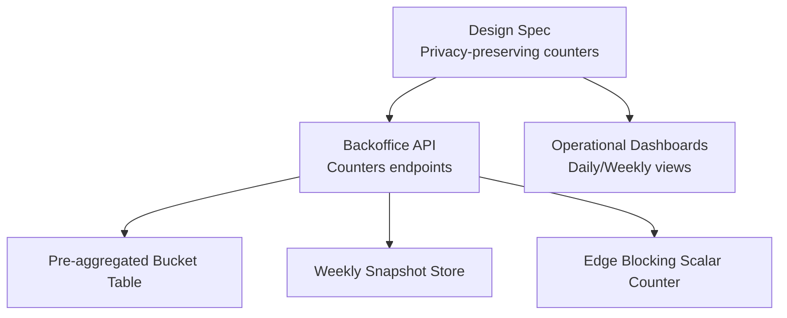
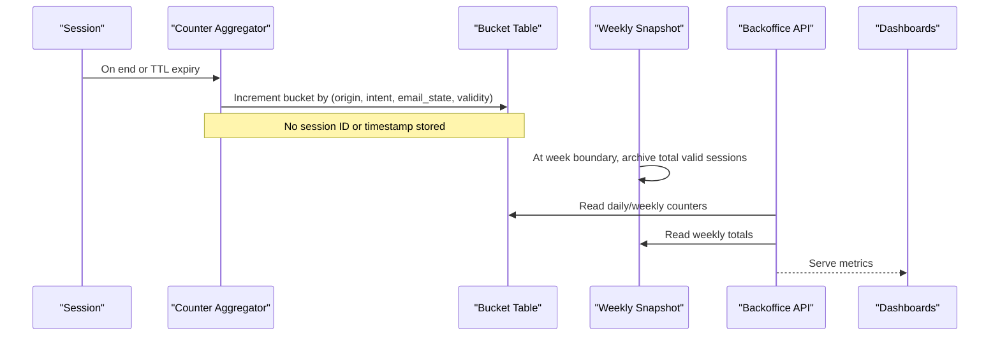
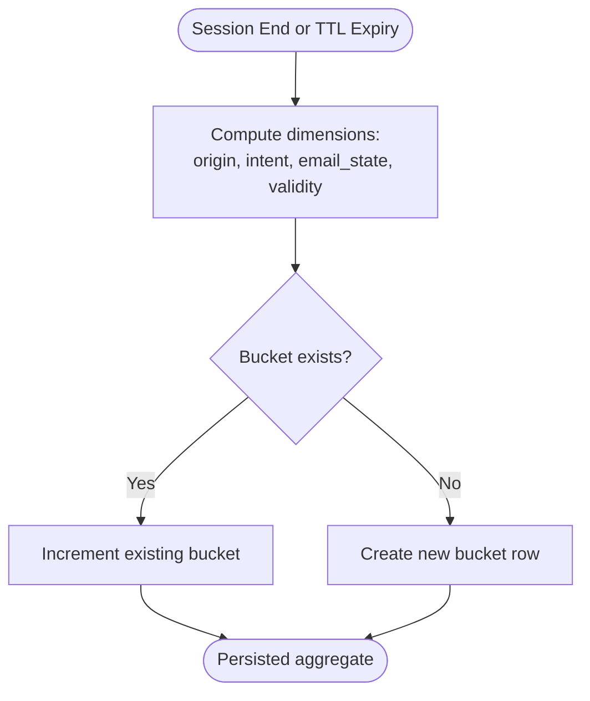
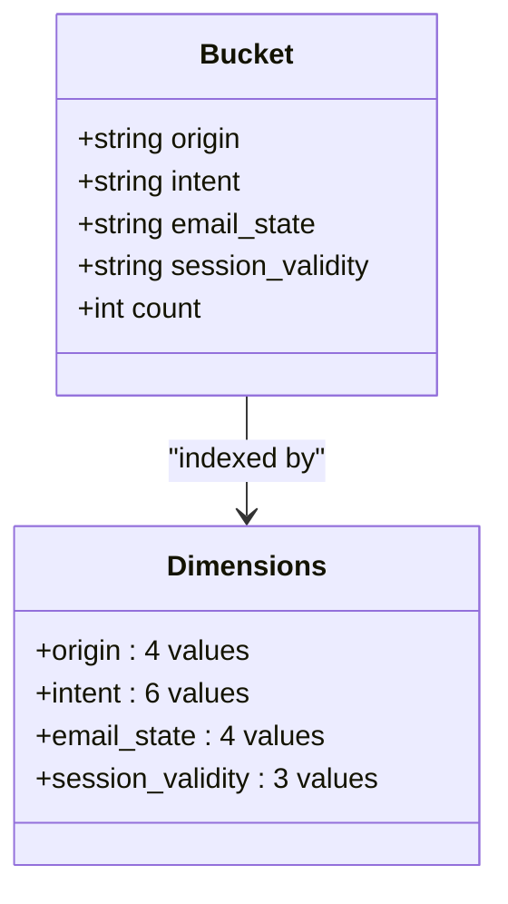
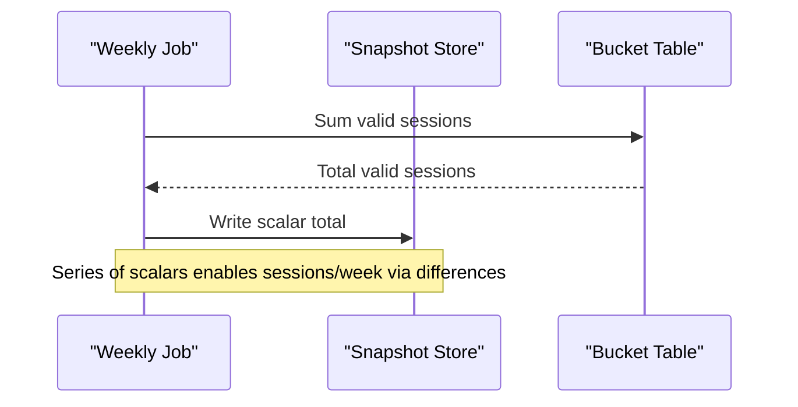
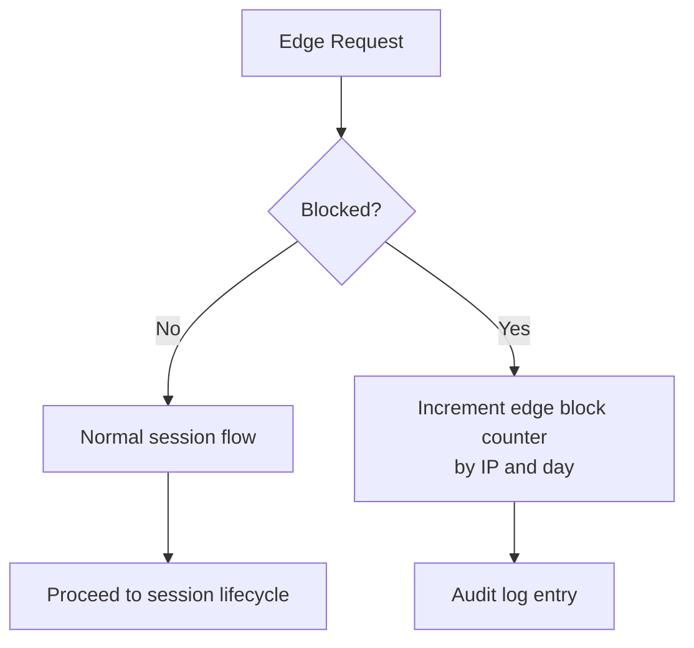
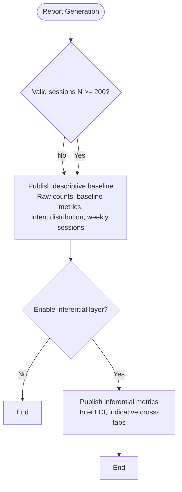
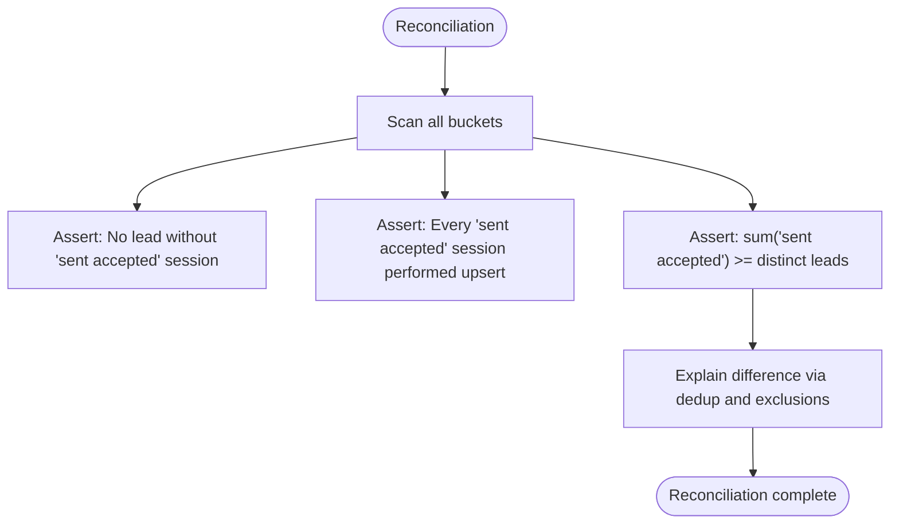
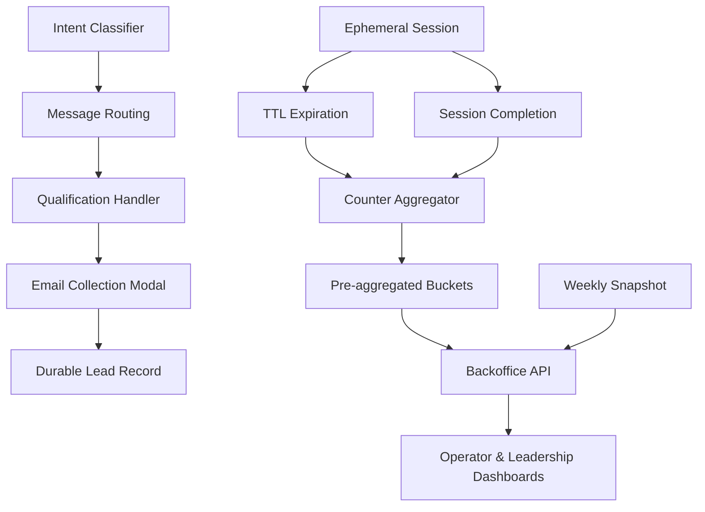

# Analytics System

<cite>
**Referenced Files in This Document**
- [DESIGN.md](file://.genie/brainstorms/plataforma-conversa-lead/DESIGN.md)
- [03-functional-spec-backoffice.md](file://docs/sdd/03-functional-spec-backoffice.md)
- [02-user-stories.md](file://docs/sdd/02-user-stories.md)
</cite>

## Table of Contents
1. [Introduction](#introduction)
2. [Project Structure](#project-structure)
3. [Core Components](#core-components)
4. [Architecture Overview](#architecture-overview)
5. [Detailed Component Analysis](#detailed-component-analysis)
6. [Dependency Analysis](#dependency-analysis)
7. [Performance Considerations](#performance-considerations)
8. [Troubleshooting Guide](#troubleshooting-guide)
9. [Conclusion](#conclusion)
10. [Appendices](#appendices)

## Introduction
This document describes the privacy-preserving analytics system that measures lead conversion without individual session tracking. Instead of event streams keyed by session, each session emits a single terminal increment to a pre-aggregated counter bucket when it ends or expires. The design eliminates per-session identifiers and timestamps for sessions, storing only aggregated increments across four categorical dimensions. A weekly snapshot archives a scalar total of valid sessions, enabling trend computation without exposing dimensional breakdowns over time. An operational scalar counter tracks edge blocking events separately from session counters. Reporting is dual-level: a descriptive baseline is always reportable; an inferential layer appears only after sufficient volume (N ≥ 200). Data privacy guarantees are enforced by discarding ephemeral session data at TTL and by persisting only low-cardinality buckets. Metric reconciliation ensures consistency between counters and durable leads.

## Project Structure
The analytics system is specified in design and functional documents. The core specification lives in the design document, while backoffice APIs and dashboards expose the counters and snapshots to operators and leadership.

**Diagram sources**
- [DESIGN.md:127-165](file://.genie/brainstorms/plataforma-conversa-lead/DESIGN.md#L127-L165)
- [03-functional-spec-backoffice.md:306-309](file://docs/sdd/03-functional-spec-backoffice.md#L306-L309)

**Section sources**
- [DESIGN.md:127-165](file://.genie/brainstorms/plataforma-conversa-lead/DESIGN.md#L127-L165)
- [03-functional-spec-backoffice.md:306-309](file://docs/sdd/03-functional-spec-backoffice.md#L306-L309)

## Core Components
- Terminal emission pattern: Each session contributes exactly one increment to a bucket upon completion or TTL expiration. No per-session IDs or timestamps are persisted.
- Four-dimensional bucketing: origin (4 values), intent (6 values), email state (4 values), session validity (3 values) → 288 possible combinations.
- Weekly snapshot: Archives a scalar total of valid sessions accumulated up to week boundaries; differences yield sessions per week.
- Operational edge blocking counter: Tracks blocked requests by IP and day as a separate scalar, outside the session bucket.
- Dual-level reporting: Descriptive baseline always reportable; inferential metrics only above N=200 sessions.

**Section sources**
- [DESIGN.md:127-165](file://.genie/brainstorms/plataforma-conversa-lead/DESIGN.md#L127-L165)
- [DESIGN.md:400-423](file://.genie/brainstorms/plataforma-conversa-lead/DESIGN.md#L400-L423)

## Architecture Overview
The analytics pipeline avoids individual session tracking by aggregating outcomes into fixed buckets and archiving weekly scalars. Backoffice APIs read from these aggregates to power daily and weekly dashboards.

**Diagram sources**
- [DESIGN.md:127-165](file://.genie/brainstorms/plataforma-conversa-lead/DESIGN.md#L127-L165)
- [03-functional-spec-backoffice.md:306-309](file://docs/sdd/03-functional-spec-backoffice.md#L306-L309)

## Detailed Component Analysis

### Terminal Emission Pattern
- Trigger: Session completion or TTL expiration.
- Action: Single increment to a bucket defined by four categorical dimensions.
- Privacy guarantee: No session identifier or per-session timestamp is retained; only the aggregated count persists.

**Diagram sources**
- [DESIGN.md:127-165](file://.genie/brainstorms/plataforma-conversa-lead/DESIGN.md#L127-L165)

**Section sources**
- [DESIGN.md:127-165](file://.genie/brainstorms/plataforma-conversa-lead/DESIGN.md#L127-L165)

### Four-Dimensional Bucketing System
Dimensions and cardinality:
- Origin: 4 values (three attribution sources plus unknown).
- Intent: 6 values (four real intents plus undefined and none).
- Email state: 4 terminal states (not requested, requested without sending, sent rejected, sent accepted).
- Session validity: 3 states (valid, excluded due to rate limit, excluded due to turn limit).

Total combinations: 4 × 6 × 4 × 3 = 288 buckets.

**Diagram sources**
- [DESIGN.md:135-151](file://.genie/brainstorms/plataforma-conversa-lead/DESIGN.md#L135-L151)

**Section sources**
- [DESIGN.md:135-151](file://.genie/brainstorms/plataforma-conversa-lead/DESIGN.md#L135-L151)

### Weekly Snapshot Mechanism
- Purpose: Archive a scalar total of valid sessions at week boundaries.
- Rationale: Avoids adding a temporal dimension to buckets; prevents rare combinations from becoming event-like records.
- Consumption: Differences between weekly scalars yield sessions per week.

**Diagram sources**
- [DESIGN.md:152-158](file://.genie/brainstorms/plataforma-conversa-lead/DESIGN.md#L152-L158)

**Section sources**
- [DESIGN.md:152-158](file://.genie/brainstorms/plataforma-conversa-lead/DESIGN.md#L152-L158)

### Operational Edge Blocking Counter
- Scope: Requests blocked at the edge do not create sessions; they are counted as a scalar by IP and day.
- Reason: Mixing request units into session counters would distort metrics and scale with attacks.
- Auditability: Exclusions remain auditable without contaminating session-based counters.

**Diagram sources**
- [DESIGN.md:159-165](file://.genie/brainstorms/plataforma-conversa-lead/DESIGN.md#L159-L165)

**Section sources**
- [DESIGN.md:159-165](file://.genie/brainstorms/plataforma-conversa-lead/DESIGN.md#L159-L165)

### Dual-Level Reporting Approach
- Descriptive baseline: Always reportable regardless of volume; includes raw counts by dimension, baseline decomposition (link opening, engagement, identification conversion), intent distribution, and weekly sessions observed.
- Inferential layer: Only available above N=200 valid sessions; includes intent distribution with confidence intervals and cross-tabulations labeled as indicative due to subdimensional sample sizes.

**Diagram sources**
- [DESIGN.md:400-423](file://.genie/brainstorms/plataforma-conversa-lead/DESIGN.md#L400-L423)

**Section sources**
- [DESIGN.md:400-423](file://.genie/brainstorms/plataforma-conversa-lead/DESIGN.md#L400-L423)

### Data Privacy Guarantees
- No PII or session identifiers in counters; only categorical bucket keys and counts.
- Ephemeral session records are discarded at TTL; no transcript persistence beyond TTL.
- Consent is tied to sending email; marketing consent is out of scope for this fatia.
- Manual access/deletion process exists for data subjects.

**Section sources**
- [DESIGN.md:127-165](file://.genie/brainstorms/plataforma-conversa-lead/DESIGN.md#L127-L165)
- [DESIGN.md:198-213](file://.genie/brainstorms/plataforma-conversa-lead/DESIGN.md#L198-L213)
- [DESIGN.md:438-440](file://.genie/brainstorms/plataforma-conversa-lead/DESIGN.md#L438-L440)

### Metric Reconciliation Processes
- Terminal emissions occur for all sessions, including abandoned ones via TTL scans.
- Relationship between email state “sent accepted” and durable leads holds per session; reconciliation uses directional assertions and inequality checks to account for deduplication and exclusions.
- Reconciliation scans all buckets, including excluded sessions.

**Diagram sources**
- [DESIGN.md:397-398](file://.genie/brainstorms/plataforma-conversa-lead/DESIGN.md#L397-L398)

**Section sources**
- [DESIGN.md:397-398](file://.genie/brainstorms/plataforma-conversa-lead/DESIGN.md#L397-L398)

### Relationship Between Analytics Counters and Business Outcomes
- Counters measure adoption and engagement of the channel, not identity resolution.
- Baseline metrics decompose funnel stages to avoid conflating link opening with email friction.
- Weekly sessions observed feed go/no-go evaluation and pilot window decisions.
- Intent distribution informs future handler investment decisions once sufficient volume is reached.

**Section sources**
- [DESIGN.md:407-415](file://.genie/brainstorms/plataforma-conversa-lead/DESIGN.md#L407-L415)
- [DESIGN.md:417-423](file://.genie/brainstorms/plataforma-conversa-lead/DESIGN.md#L417-L423)

## Dependency Analysis
The analytics system depends on session lifecycle management, classifier routing, and backoffice APIs to surface metrics.

**Diagram sources**
- [DESIGN.md:127-165](file://.genie/brainstorms/plataforma-conversa-lead/DESIGN.md#L127-L165)
- [03-functional-spec-backoffice.md:306-309](file://docs/sdd/03-functional-spec-backoffice.md#L306-L309)

**Section sources**
- [DESIGN.md:127-165](file://.genie/brainstorms/plataforma-conversa-lead/DESIGN.md#L127-L165)
- [03-functional-spec-backoffice.md:306-309](file://docs/sdd/03-functional-spec-backoffice.md#L306-L309)

## Performance Considerations
- Pre-aggregated buckets provide fast reads for dashboards and reports.
- Weekly scalars minimize storage and query complexity compared to full dimensional time series.
- Edge blocking counters prevent attack-driven inflation of session metrics.
- Low cardinality dimensions keep bucket space bounded and predictable.

[No sources needed since this section provides general guidance]

## Troubleshooting Guide
Common issues and resolutions:
- Missing terminal emissions: Ensure TTL scans run and session completion paths trigger aggregator increments.
- Discrepancies between leads and counters: Verify deduplication logic and exclusion handling; reconcile using directional assertions and inequalities.
- Incorrect bucket assignments: Validate dimension computation at emission time, especially origin fallback to unknown and email state progression rules.
- Edge blocking misclassification: Confirm that blocked requests increment the operational scalar rather than creating sessions.

**Section sources**
- [DESIGN.md:397-398](file://.genie/brainstorms/plataforma-conversa-lead/DESIGN.md#L397-L398)
- [DESIGN.md:159-165](file://.genie/brainstorms/plataforma-conversa-lead/DESIGN.md#L159-L165)

## Conclusion
The analytics system delivers privacy-preserving metrics through pre-aggregated counters and weekly scalars, avoiding individual session tracking entirely. The four-dimensional bucketing captures essential context while bounding complexity. Dual-level reporting balances honesty at low volume with actionable inference at scale. Operational counters isolate edge blocking to protect metric integrity. Reconciliation processes ensure alignment between counters and durable leads, grounding analytics in business outcomes without compromising privacy.

[No sources needed since this section summarizes without analyzing specific files]

## Appendices

### Backoffice API Exposure for Counters
- Daily counters endpoint serves today’s aggregated metrics.
- Weekly snapshots endpoint exposes archived totals for trend analysis.
- Trends endpoint provides derived metrics for visualization.

**Section sources**
- [03-functional-spec-backoffice.md:306-309](file://docs/sdd/03-functional-spec-backoffice.md#L306-L309)