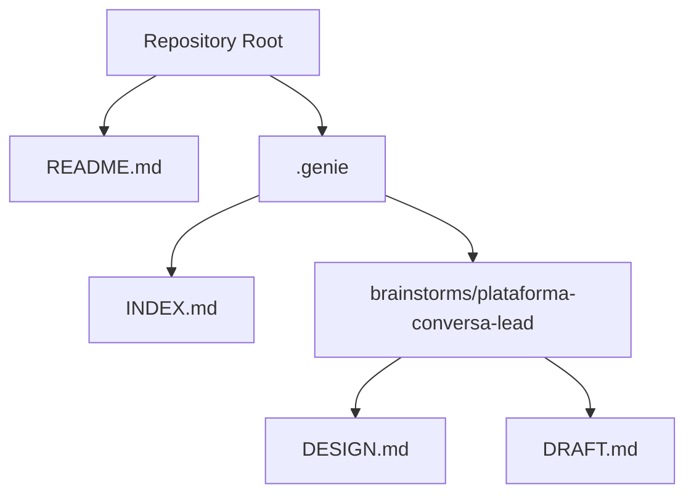
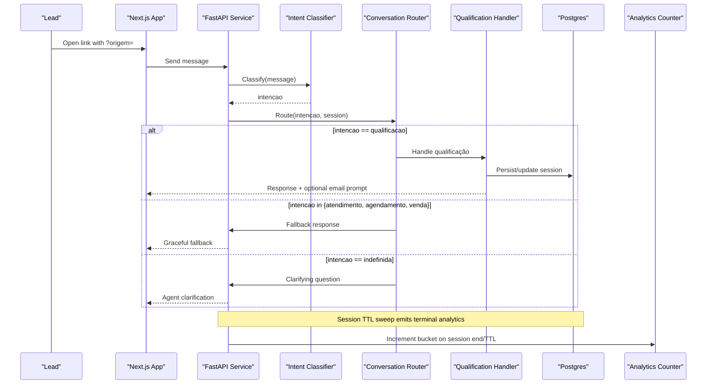
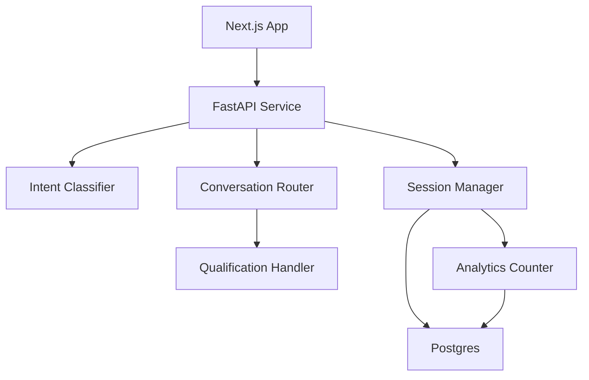

# Component Architecture

<cite>
**Referenced Files in This Document**
- [README.md](file://README.md)
- [DESIGN.md](file://.genie/brainstorms/plataforma-conversa-lead/DESIGN.md)
- [DRAFT.md](file://.genie/brainstorms/plataforma-conversa-lead/DRAFT.md)
- [INDEX.md](file://.genie/INDEX.md)
</cite>

## Table of Contents
1. [Introduction](#introduction)
2. [Project Structure](#project-structure)
3. [Core Components](#core-components)
4. [Architecture Overview](#architecture-overview)
5. [Detailed Component Analysis](#detailed-component-analysis)
6. [Dependency Analysis](#dependency-analysis)
7. [Performance Considerations](#performance-considerations)
8. [Troubleshooting Guide](#troubleshooting-guide)
9. [Conclusion](#conclusion)

## Introduction
This document describes the component architecture for the Sup Better Engine’s first slice: a link-based conversational interface that routes messages to an intent classifier, then to either a qualification handler or a graceful fallback, with session lifecycle management and analytics via pre-aggregated counters. The design specifies Next.js on the frontend, a Python backend (FastAPI), and Postgres as the single source of truth for ephemeral sessions and durable leads.

Key goals:
- Prove that leads will move from WhatsApp to a dedicated link and chat experience.
- Classify each message into one of four intents plus an explicit abstention label.
- Route per-message to the correct handler while aggregating session-level metrics without PII.
- Promote anonymous sessions to durable leads upon email consent and validation.

**Section sources**
- [DESIGN.md:10-35](file://.genie/brainstorms/plataforma-conversa-lead/DESIGN.md#L10-L35)
- [DESIGN.md:191-213](file://.genie/brainstorms/plataforma-conversa-lead/DESIGN.md#L191-L213)

## Project Structure
At this stage, the repository contains design artifacts rather than implementation code. The project structure centers around a README and a .genie directory that captures the design, scope, decisions, risks, and success criteria for the first slice.

**Diagram sources**
- [README.md:1-8](file://README.md#L1-L8)
- [INDEX.md:1-12](file://.genie/INDEX.md#L1-L12)
- [DESIGN.md:1-10](file://.genie/brainstorms/plataforma-conversa-lead/DESIGN.md#L1-L10)

**Section sources**
- [README.md:1-8](file://README.md#L1-L8)
- [INDEX.md:1-12](file://.genie/INDEX.md#L1-L12)

## Core Components
The system is composed of the following major components, as defined by the design:

- Conversational Interface (Next.js): Serves the landing page, reads attribution parameters, renders the chat with streaming, and presents the contextual identification mini-screen.
- Intent Classification System: A single-purpose unit that maps each user message to an intent label set including four real intents and an explicit abstention.
- Conversation Router: Chooses the response path per message based on the current message’s intent; re-evaluated every turn.
- Lead Management Handler (Qualification): Captures intent, urgency, and fit, then triggers the contextual email request and promotes the session to a durable lead upon consent and validation.
- Session Manager: Manages ephemeral sessions in Postgres with TTL, aggregates session-level intent for counters, enforces rate limits and per-session message caps, and emits terminal analytics.
- Analytics System: Produces pre-aggregated counters across categorical dimensions at session end or TTL expiry, plus weekly snapshots and operational edge-block counters.

Responsibilities and boundaries are explicitly separated so that adding future handlers does not change routing or counting logic.

**Section sources**
- [DESIGN.md:51-85](file://.genie/brainstorms/plataforma-conversa-lead/DESIGN.md#L51-L85)
- [DESIGN.md:191-213](file://.genie/brainstorms/plataforma-conversa-lead/DESIGN.md#L191-L213)
- [DESIGN.md:225-232](file://.genie/brainstorms/plataforma-conversa-lead/DESIGN.md#L225-L232)
- [DESIGN.md:127-165](file://.genie/brainstorms/plataforma-conversa-lead/DESIGN.md#L127-L165)

## Architecture Overview
High-level flow:
- Client opens a unique link with attribution parameter.
- Next.js serves the landing and chat UI.
- Each message is sent to the backend where it is classified.
- The router selects the appropriate handler per message.
- The qualification handler may trigger contextual email collection.
- Upon consent and validation, the session is promoted to a durable lead.
- At session end or TTL expiry, a terminal emission increments pre-aggregated counters.

**Diagram sources**
- [DESIGN.md:51-85](file://.genie/brainstorms/plataforma-conversa-lead/DESIGN.md#L51-L85)
- [DESIGN.md:127-165](file://.genie/brainstorms/plataforma-conversa-lead/DESIGN.md#L127-L165)
- [DESIGN.md:191-213](file://.genie/brainstorms/plataforma-conversa-lead/DESIGN.md#L191-L213)

## Detailed Component Analysis

### Conversational Interface (Next.js)
- Responsibilities:
  - Serve the landing page and read attribution parameter.
  - Render the chat with streaming responses.
  - Present the contextual identification mini-screen when triggered by the backend.
- Interfaces:
  - HTTP endpoints for chat messages and UI state updates.
  - Event-driven streaming for agent responses.
- Communication patterns:
  - Sends user messages to the backend and renders streamed replies.
  - Displays the email mini-screen based on backend signals.
- Lifecycle:
  - Initializes on link open; persists conversation context client-side until promotion to lead.
- Error handling:
  - Retries failed requests; surfaces network errors to the user gracefully.
- Dependency injection:
  - Configuration for API base URL and feature flags injected at build/runtime.

**Section sources**
- [DESIGN.md:191-203](file://.genie/brainstorms/plataforma-conversa-lead/DESIGN.md#L191-L203)
- [DESIGN.md:86-108](file://.genie/brainstorms/plataforma-conversa-lead/DESIGN.md#L86-L108)

### Intent Classification System
- Responsibilities:
  - Map each message to an intent label set: {qualificacao, atendimento, agendamento, venda, indefinida}.
  - Provide explicit abstention for greetings or non-intentful input.
- Interfaces:
  - Function contract: message → intencao.
- Communication patterns:
  - Called per message by the backend before routing.
- Lifecycle:
  - Stateless per call; can be swapped or updated independently.
- Error handling:
  - Returns abstention when confidence is low or input is ambiguous.
- Dependency injection:
  - Model weights and prompts configured externally; testable with labeled datasets.

**Section sources**
- [DESIGN.md:53-63](file://.genie/brainstorms/plataforma-conversa-lead/DESIGN.md#L53-L63)
- [DESIGN.md:225-232](file://.genie/brainstorms/plataforma-conversa-lead/DESIGN.md#L225-L232)

### Conversation Router
- Responsibilities:
  - Decide the response path per message based on the current message’s intent.
  - Re-evaluate routing at every turn to avoid misrouting later messages.
- Interfaces:
  - Input: intencao, session context; Output: handler selection or fallback behavior.
- Communication patterns:
  - Invoked after classification; delegates to qualification handler or graceful fallback.
- Lifecycle:
  - Per-message decision; no long-lived state beyond reading session context.
- Error handling:
  - Defaults to clarifying question for abstention; ensures fallback is terminal for the turn but not the session.
- Dependency injection:
  - Handler registry allows adding new handlers without changing routing logic.

**Section sources**
- [DESIGN.md:58-63](file://.genie/brainstorms/plataforma-conversa-lead/DESIGN.md#L58-L63)
- [DESIGN.md:77-85](file://.genie/brainstorms/plataforma-conversa-lead/DESIGN.md#L77-L85)

### Lead Management Handler (Qualification)
- Responsibilities:
  - Capture intent, urgency, and fit during qualification.
  - Trigger contextual email request after capturing required fields or by turn threshold.
  - Validate email syntax and blocklist; enforce consent as the gate to sending.
  - Promote session to a durable lead upon acceptance; deduplicate by normalized email.
- Interfaces:
  - Input: session context, captured fields; Output: structured output for commercial team and email prompt signals.
- Communication patterns:
  - Emits signals to the frontend to show the mini-screen; writes to Postgres for session and lead records.
- Lifecycle:
  - Activated when intent is qualificacao; runs until email consent/validation or session end.
- Error handling:
  - Rejects invalid emails and disposable domains; retries allowed with monotonic state progression.
- Dependency injection:
  - Email validation rules and blocklist configurable; consent policy injected.

**Section sources**
- [DESIGN.md:86-108](file://.genie/brainstorms/plataforma-conversa-lead/DESIGN.md#L86-L108)
- [DESIGN.md:215-223](file://.genie/brainstorms/plataforma-conversa-lead/DESIGN.md#L215-L223)

### Session Manager
- Responsibilities:
  - Manage ephemeral sessions in Postgres with TTL; persist conversation context while anonymous.
  - Enforce rate limiting by IP and per-session message caps.
  - Aggregate session-level intent for counters (first non-abstention label).
  - Emit terminal analytics at session end or TTL expiry.
- Interfaces:
  - CRUD for session records; methods to update state, check limits, and schedule TTL sweeps.
- Communication patterns:
  - Reads/writes Postgres; coordinates with analytics counter upserts.
- Lifecycle:
  - Created on first visit; expires after TTL if not identified; promoted to lead upon consent.
- Error handling:
  - Handles TTL expiration, rate limit breaches, and message cap violations; marks session validity accordingly.
- Dependency injection:
  - TTL, rate limit thresholds, and message caps are configurable parameters.

**Section sources**
- [DESIGN.md:198-213](file://.genie/brainstorms/plataforma-conversa-lead/DESIGN.md#L198-L213)
- [DESIGN.md:112-126](file://.genie/brainstorms/plataforma-conversa-lead/DESIGN.md#L112-L126)
- [DESIGN.md:127-165](file://.genie/brainstorms/plataforma-conversa-lead/DESIGN.md#L127-L165)

### Analytics System
- Responsibilities:
  - Produce pre-aggregated counters across categorical dimensions at session end or TTL expiry.
  - Maintain weekly snapshots of valid sessions as scalars for trend analysis.
  - Track operational edge-block counters by IP and day for auditability.
- Interfaces:
  - Upsert method for buckets; snapshot writer for weekly totals.
- Communication patterns:
  - Receives terminal emissions from session manager; writes to Postgres counters.
- Lifecycle:
  - Runs on session termination or TTL sweep; snapshots at week boundaries.
- Error handling:
  - Idempotent upserts to avoid double-counting; isolated from session PII.
- Dependency injection:
  - Bucket schema and aggregation rules are configurable.

**Section sources**
- [DESIGN.md:127-165](file://.genie/brainstorms/plataforma-conversa-lead/DESIGN.md#L127-L165)

## Dependency Analysis
Component relationships and coupling:
- Next.js depends on FastAPI for chat and UI state.
- FastAPI orchestrates Classifier, Router, Qualification Handler, Session Manager, and Analytics.
- Session Manager depends on Postgres for ephemeral sessions and TTL management.
- Analytics depends on Session Manager for terminal emissions and writes aggregated counters to Postgres.
- Intent Classifier is decoupled and testable in isolation; Router composes handlers via a registry.

**Diagram sources**
- [DESIGN.md:191-213](file://.genie/brainstorms/plataforma-conversa-lead/DESIGN.md#L191-L213)
- [DESIGN.md:127-165](file://.genie/brainstorms/plataforma-conversa-lead/DESIGN.md#L127-L165)

**Section sources**
- [DESIGN.md:191-213](file://.genie/brainstorms/plataforma-conversa-lead/DESIGN.md#L191-L213)
- [DESIGN.md:127-165](file://.genie/brainstorms/plataforma-conversa-lead/DESIGN.md#L127-L165)

## Performance Considerations
- Rate limiting by IP and per-session message caps protect the LLM endpoint and control costs.
- Ephemeral sessions stored in Postgres with TTL reduce operational overhead compared to Redis for a pilot.
- Pre-aggregated counters avoid high-cardinality event streams and keep analytics lightweight.
- Weekly scalar snapshots simplify trend tracking without storing per-session timestamps.
- Streaming responses in the frontend improve perceived performance and user engagement.

[No sources needed since this section provides general guidance]

## Troubleshooting Guide
Common issues and strategies:
- Misrouted messages: Ensure routing re-evaluates per message; verify classifier abstention handling for non-intentful inputs.
- Excessive fallback usage: Monitor classifier accuracy and adjust thresholds; track fallback rates as a drift signal.
- Email validation failures: Check syntax and blocklist configuration; allow retry with monotonic state progression.
- Session TTL expirations: Confirm TTL settings and ensure terminal emissions occur even for abandoned sessions.
- Rate limit or message cap hits: Review thresholds; distinguish between abuse (rate limit) and engaged users (message cap) in analytics.
- Analytics discrepancies: Verify idempotent upserts and that terminal emissions cover all session outcomes, including never-typed and abstention-only sessions.

**Section sources**
- [DESIGN.md:53-63](file://.genie/brainstorms/plataforma-conversa-lead/DESIGN.md#L53-L63)
- [DESIGN.md:112-126](file://.genie/brainstorms/plataforma-conversa-lead/DESIGN.md#L112-L126)
- [DESIGN.md:127-165](file://.genie/brainstorms/plataforma-conversa-lead/DESIGN.md#L127-L165)

## Conclusion
The Sup Better Engine’s first slice defines a clear, modular architecture centered on per-message intent classification, dynamic routing, and robust session and analytics management. By separating concerns—interface, classification, routing, qualification, session lifecycle, and analytics—the system remains extensible for future handlers and features while maintaining strong privacy and cost controls through ephemeral sessions and pre-aggregated counters.

[No sources needed since this section summarizes without analyzing specific files]