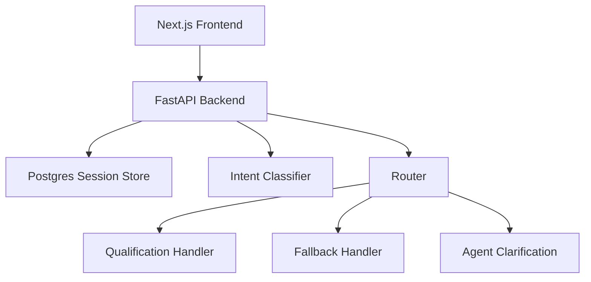
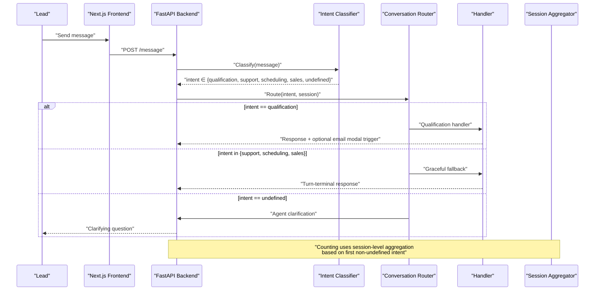
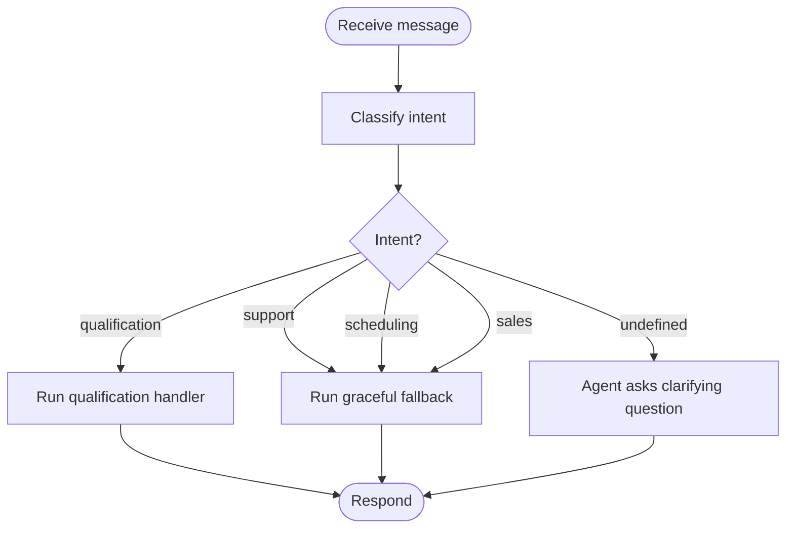
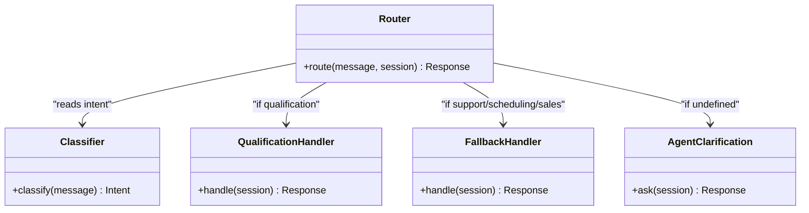
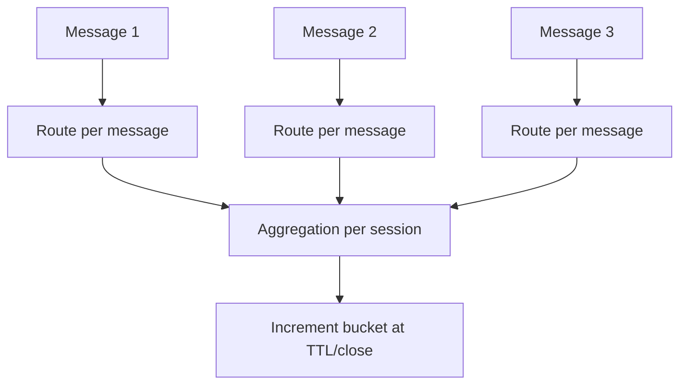
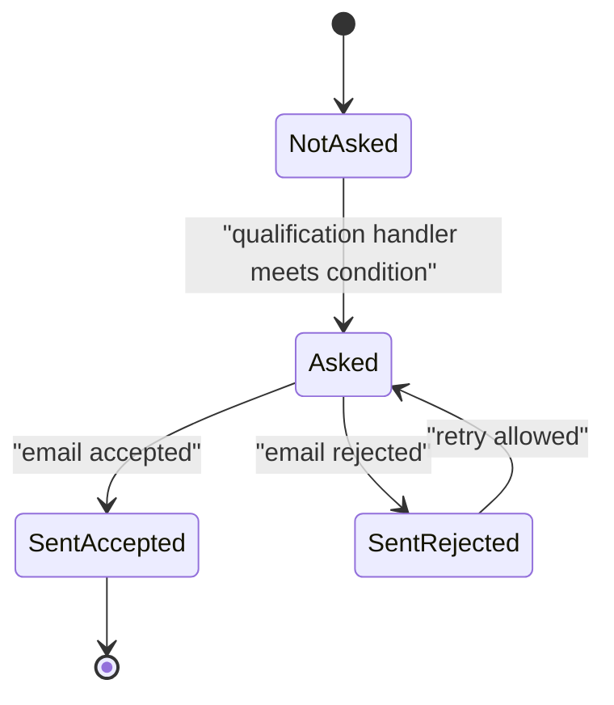
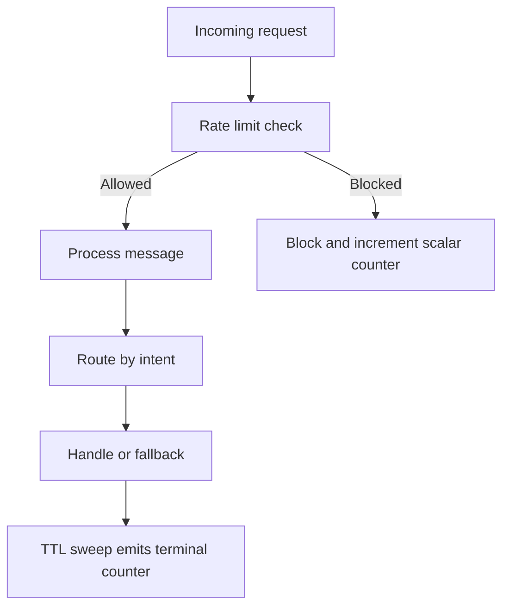
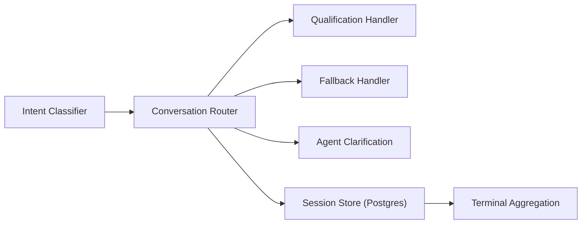

# Conversation Router

<cite>
**Referenced Files in This Document**
- [DESIGN.md](file://.genie/brainstorms/plataforma-conversa-lead/DESIGN.md)
- [DRAFT.md](file://.genie/brainstorms/plataforma-conversa-lead/DRAFT.md)
- [01-actors-and-roles.md](file://docs/sdd/01-actors-and-roles.md)
</cite>

## Table of Contents
1. [Introduction](#introduction)
2. [Project Structure](#project-structure)
3. [Core Components](#core-components)
4. [Architecture Overview](#architecture-overview)
5. [Detailed Component Analysis](#detailed-component-analysis)
6. [Dependency Analysis](#dependency-analysis)
7. [Performance Considerations](#performance-considerations)
8. [Troubleshooting Guide](#troubleshooting-guide)
9. [Conclusion](#conclusion)

## Introduction
This document specifies the Conversation Router for a lead conversation platform. The router dynamically routes each incoming message to the appropriate handler by re-evaluating intent per message, rather than freezing the conversation path after the first turn. It defines:
- Per-message routing strategy that classifies intent for every message and selects the correct handler or fallback.
- Handler selection logic: qualification goes to the real handler; other three intents route to a graceful fallback; undefined triggers clarification from the agent without invoking a handler.
- Separation between routing cadence (per message) and aggregation cadence (per session), protecting both user experience and metric accuracy.
- Implementation patterns for handler plugging, error recovery, and conversation state management.

The design is grounded in the project’s design specification and supporting documents.

**Section sources**
- [DESIGN.md:53-85](file://.genie/brainstorms/plataforma-conversa-lead/DESIGN.md#L53-L85)
- [DESIGN.md:225-232](file://.genie/brainstorms/plataforma-conversa-lead/DESIGN.md#L225-L232)

## Project Structure
At this stage, the repository contains design and planning artifacts that define the Conversation Router behavior. There are no source code files yet; the router is specified through design decisions, scope, and success criteria.

[No sources needed since this diagram shows conceptual workflow, not actual code structure]

## Core Components
- Intent classifier: Produces a single field per message with values {qualification, support, scheduling, sales, undefined}. Undefined is an explicit abstention for greetings or messages without clear intent.
- Router: Chooses the handler based on the current message’s intent.
- Qualification handler: Discovers intent, urgency, and fit; produces structured output for the tenant’s commercial team; triggers contextual email collection under defined conditions.
- Graceful fallback: Acknowledges requests for non-qualification intents, points to tenant contact, and remains terminal only for the current turn.
- Agent clarification: For undefined intent, the agent asks clarifying questions without invoking any handler.
- Aggregation rule: The session inherits the first non-undefined intent label for counting purposes only.

These components are explicitly described in the design specification and form the basis for implementation.

**Section sources**
- [DESIGN.md:53-85](file://.genie/brainstorms/plataforma-conversa-lead/DESIGN.md#L53-L85)
- [DESIGN.md:225-232](file://.genie/brainstorms/plataforma-conversa-lead/DESIGN.md#L225-L232)

## Architecture Overview
The router sits between the backend and handlers. Each message flows through classification and routing before being handled. Counting aggregates at session boundaries using a separate cadence.

**Diagram sources**
- [DESIGN.md:53-85](file://.genie/brainstorms/plataforma-conversa-lead/DESIGN.md#L53-L85)
- [DESIGN.md:225-232](file://.genie/brainstorms/plataforma-conversa-lead/DESIGN.md#L225-L232)

## Detailed Component Analysis

### Per-Message Routing Strategy
- Every incoming message is classified independently.
- Routing decision is made per message, not frozen at session start.
- This prevents misrouting when intent changes mid-conversation (e.g., a scheduling request arriving after qualification has started).

**Diagram sources**
- [DESIGN.md:53-85](file://.genie/brainstorms/plataforma-conversa-lead/DESIGN.md#L53-L85)

**Section sources**
- [DESIGN.md:53-85](file://.genie/brainstorms/plataforma-conversa-lead/DESIGN.md#L53-L85)

### Handler Selection Logic
- Qualification: routed to the real handler that captures intent, urgency, and fit, and may trigger contextual email collection.
- Other three intents (support, scheduling, sales): routed to a single graceful fallback that acknowledges the request and directs to tenant contact. Fallback is terminal for the turn but does not close the session.
- Undefined: routed to agent clarification without invoking any handler.

**Diagram sources**
- [DESIGN.md:53-85](file://.genie/brainstorms/plataforma-conversa-lead/DESIGN.md#L53-L85)
- [DESIGN.md:225-232](file://.genie/brainstorms/plataforma-conversa-lead/DESIGN.md#L225-L232)

**Section sources**
- [DESIGN.md:53-85](file://.genie/brainstorms/plataforma-conversa-lead/DESIGN.md#L53-L85)

### Cadence Separation: Routing vs Aggregation
- Routing cadence: per message. Ensures the correct handler responds to the current intent, preserving user experience.
- Aggregation cadence: per session. The session inherits the first non-undefined intent label for counting. This avoids composing classifier errors across turns and protects metric accuracy.
- Trade-off: A later-intent shift is invisible to the counter, which errs conservatively by deferring expansion of additional handlers.

**Diagram sources**
- [DESIGN.md:64-76](file://.genie/brainstorms/plataforma-conversa-lead/DESIGN.md#L64-L76)
- [DESIGN.md:225-232](file://.genie/brainstorms/plataforma-conversa-lead/DESIGN.md#L225-L232)

**Section sources**
- [DESIGN.md:64-76](file://.genie/brainstorms/plataforma-conversa-lead/DESIGN.md#L64-L76)
- [DESIGN.md:225-232](file://.genie/brainstorms/plataforma-conversa-lead/DESIGN.md#L225-L232)

### Email Collection and State Management
- Email collection is triggered by the qualification handler under declared conditions (captured intent/urgency/fit or turn ceiling).
- Display limit: maximum two displays per session; validation retry does not count as a new display.
- Consent is the door to sending; purpose is restricted to returning about this conversation.
- Promotion to durable lead occurs on send, deduplicated by normalized email.

**Diagram sources**
- [DESIGN.md:86-108](file://.genie/brainstorms/plataforma-conversa-lead/DESIGN.md#L86-L108)

**Section sources**
- [DESIGN.md:86-108](file://.genie/brainstorms/plataforma-conversa-lead/DESIGN.md#L86-L108)

### Error Recovery and Resilience
- Fallback is terminal only for the current turn; sessions remain open so qualification can resume if intent returns.
- Rate limiting and per-session message caps protect the LLM endpoint; blocked requests do not create session records.
- TTL-based cleanup discards anonymous sessions while emitting terminal counters.

**Diagram sources**
- [DESIGN.md:112-126](file://.genie/brainstorms/plataforma-conversa-lead/DESIGN.md#L112-L126)
- [DESIGN.md:127-165](file://.genie/brainstorms/plataforma-conversa-lead/DESIGN.md#L127-L165)

**Section sources**
- [DESIGN.md:112-126](file://.genie/brainstorms/plataforma-conversa-lead/DESIGN.md#L112-L126)
- [DESIGN.md:127-165](file://.genie/brainstorms/plataforma-conversa-lead/DESIGN.md#L127-L165)

### Success Criteria and Validation
- Fallback isolation: non-qualification intents must be answered by fallback even after the session has been counted as qualification.
- Abstention routing: undefined intent receives clarification without invoking handler or fallback.
- Classifier validation thresholds and corpus requirements ensure reliable intent signals.

**Section sources**
- [DESIGN.md:386-398](file://.genie/brainstorms/plataforma-conversa-lead/DESIGN.md#L386-L398)

## Dependency Analysis
The router depends on:
- Intent classifier contract: message → intent.
- Handler contracts: session → response.
- Session store: ephemeral Postgres table with TTL.
- Aggregation pipeline: terminal emission into pre-aggregated buckets.

**Diagram sources**
- [DESIGN.md:225-232](file://.genie/brainstorms/plataforma-conversa-lead/DESIGN.md#L225-L232)
- [DESIGN.md:195-213](file://.genie/brainstorms/plataforma-conversa-lead/DESIGN.md#L195-L213)

**Section sources**
- [DESIGN.md:225-232](file://.genie/brainstorms/plataforma-conversa-lead/DESIGN.md#L225-L232)
- [DESIGN.md:195-213](file://.genie/brainstorms/plataforma-conversa-lead/DESIGN.md#L195-L213)

## Performance Considerations
- Per-message classification adds latency per turn but preserves correctness of routing.
- Aggregation at session boundaries reduces persistent writes and protects metrics from composed error rates.
- Rate limiting and message caps prevent abuse and control LLM costs.
- Minimal handler surface (one real handler plus one fallback) reduces complexity and maintenance overhead.

[No sources needed since this section provides general guidance]

## Troubleshooting Guide
Common issues and mitigations:
- Misrouted messages due to stale routing: Ensure routing is evaluated per message, not frozen at session start.
- Excessive fallback responses: Validate classifier abstention handling for undefined intent; confirm fallback is turn-terminal only.
- Metric drift: Confirm session aggregation uses first non-undefined intent and that terminal emissions occur at TTL or close.
- Overuse of email modal: Enforce display limits and retry semantics; ensure consent is tied to send action.

**Section sources**
- [DESIGN.md:53-85](file://.genie/brainstorms/plataforma-conversa-lead/DESIGN.md#L53-L85)
- [DESIGN.md:112-126](file://.genie/brainstorms/plataforma-conversa-lead/DESIGN.md#L112-L126)
- [DESIGN.md:127-165](file://.genie/brainstorms/plataforma-conversa-lead/DESIGN.md#L127-L165)
- [DESIGN.md:386-398](file://.genie/brainstorms/plataforma-conversa-lead/DESIGN.md#L386-L398)

## Conclusion
The Conversation Router enforces per-message intent evaluation to deliver accurate, context-aware responses while keeping session-level aggregation stable for metrics. With a single real handler, a graceful fallback, and agent-led clarification for undefined intent, the system balances user experience with measurement integrity. The separation of routing cadence and aggregation cadence is central to protecting both outcomes. Future extensions can add handlers behind the same contract without altering the router, enabling measured growth.

[No sources needed since this section summarizes without analyzing specific files]