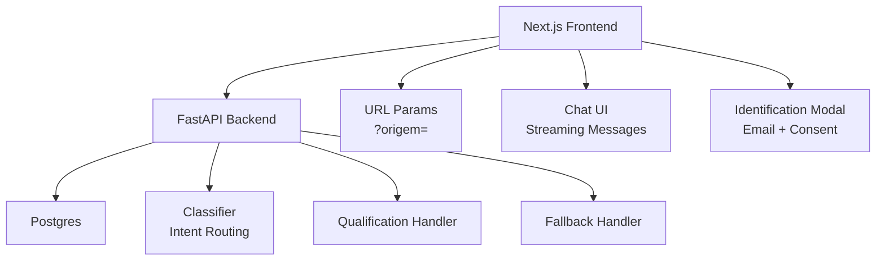
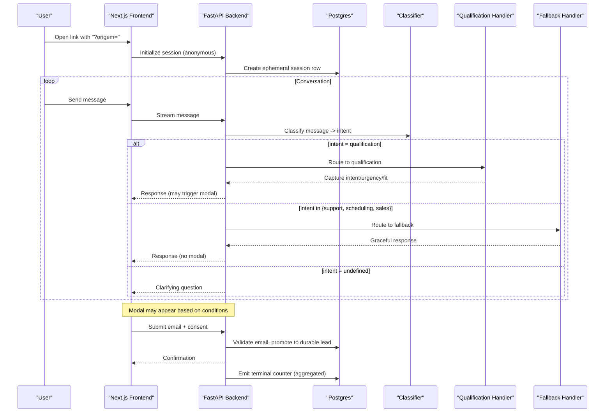
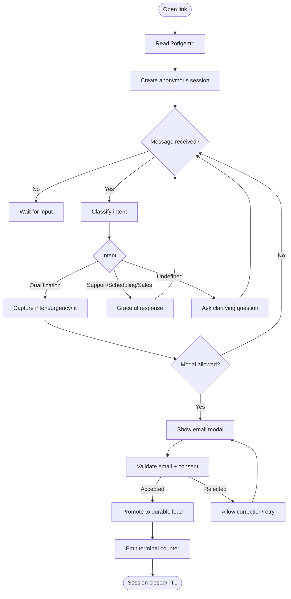
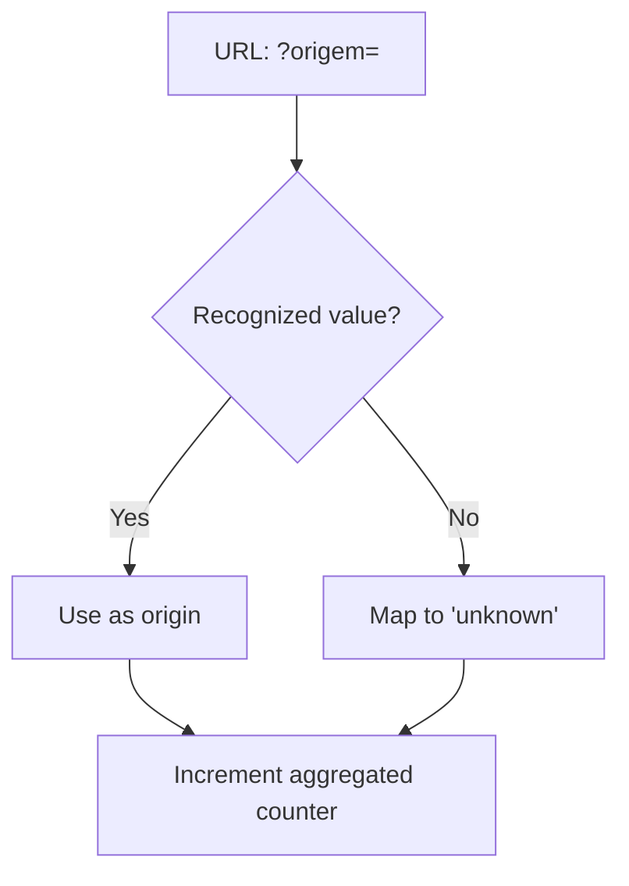
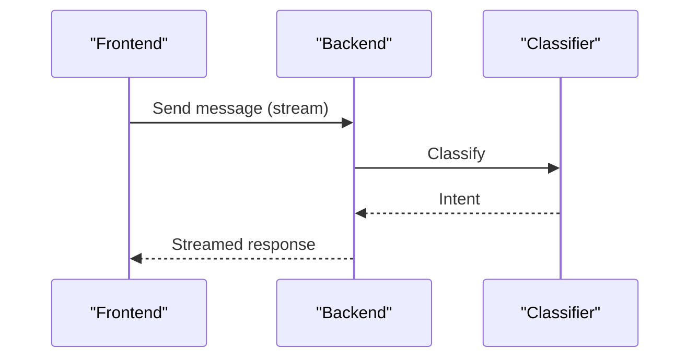
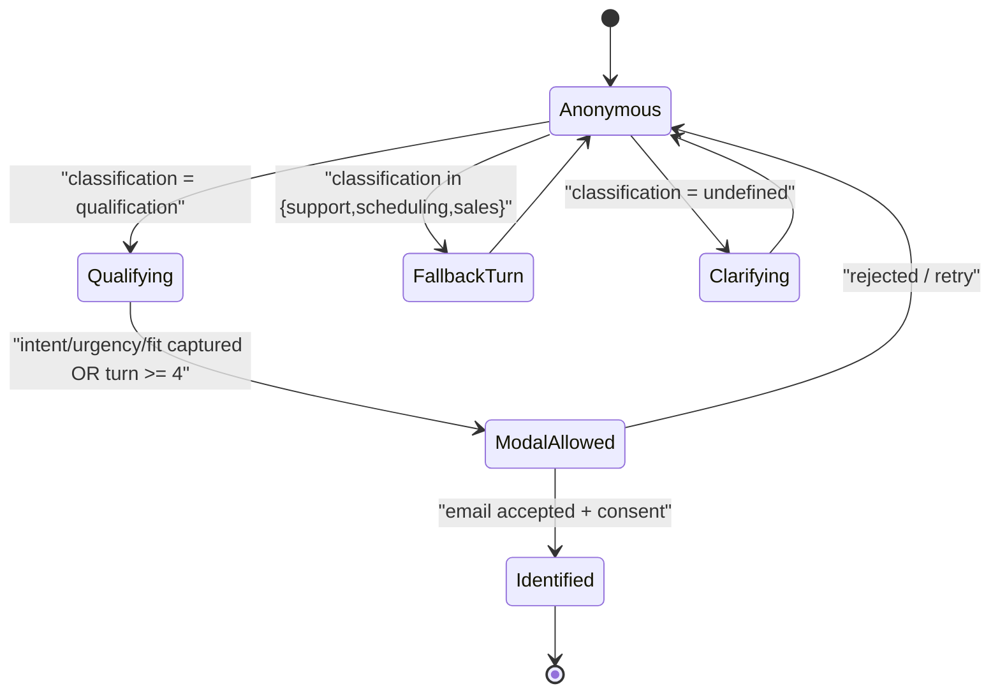
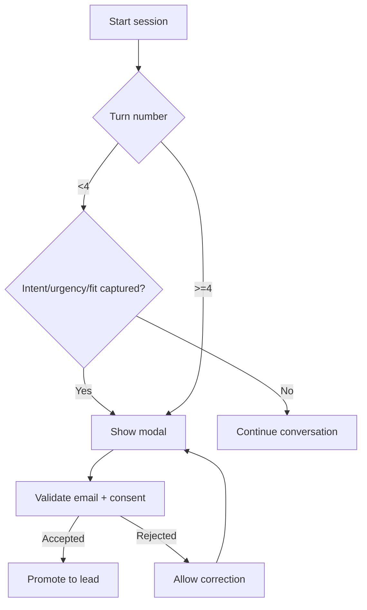
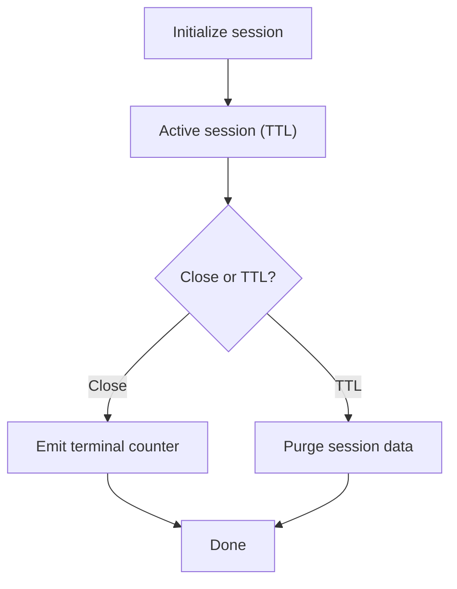
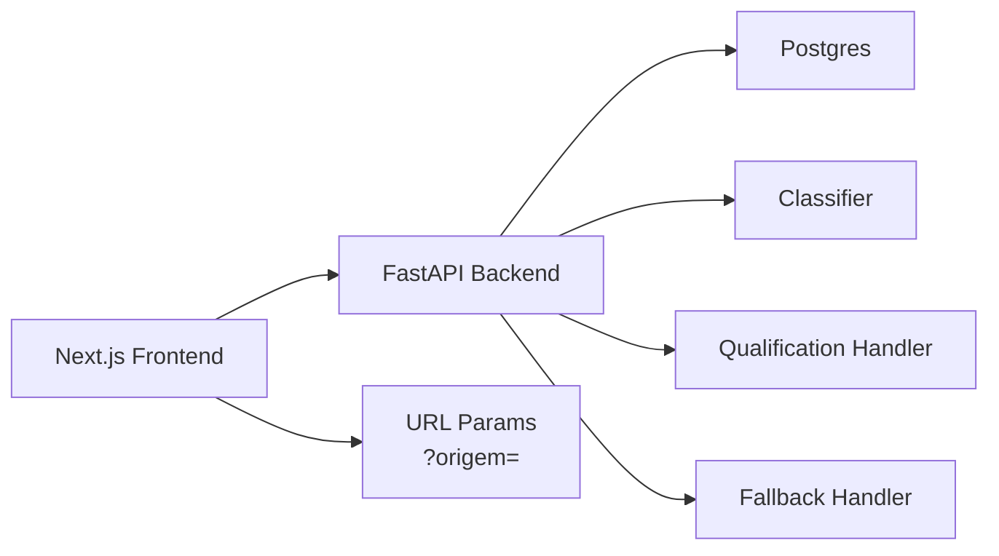

# Conversational Interface

<cite>
**Referenced Files in This Document**
- [README.md](file://README.md)
- [DESIGN.md](file://.genie/brainstorms/plataforma-conversa-lead/DESIGN.md)
</cite>

## Table of Contents
1. Introduction
2. Project Structure
3. Core Components
4. Architecture Overview
5. Detailed Component Analysis
6. Dependency Analysis
7. Performance Considerations
8. Troubleshooting Guide
9. Conclusion

## Introduction
This document describes the Conversational Interface component of the Sup Better Engine: a Next.js frontend that serves a single landing page, hosts an anonymous chat session with an AI agent, and presents a contextual email collection modal to convert anonymous sessions into durable leads. It explains the user flow from link opening through anonymous conversation to potential lead identification, the attribution tracking via URL parameters, real-time messaging behavior, and the progressive identification mechanism that preserves anonymity until appropriate moments. It also covers responsive design considerations and accessibility compliance as defined by the project’s scope and decisions.

The system is intentionally minimal for this slice: a Next.js front end paired with a Python backend (FastAPI) and Postgres for ephemeral sessions and durable leads. The interface focuses on low-friction entry, context-aware identification, and privacy-preserving analytics.

**Section sources**
- [DESIGN.md:190-213](file://.genie/brainstorms/plataforma-conversa-lead/DESIGN.md#L190-L213)
- [DESIGN.md:47-166](file://.genie/brainstorms/plataforma-conversa-lead/DESIGN.md#L47-L166)

## Project Structure
At this stage, the repository contains the project overview and the design specification for the conversational platform slice. The implementation files are not present; this document synthesizes the architecture and behavior from the design specification.

**Diagram sources**
- [DESIGN.md:190-213](file://.genie/brainstorms/plataforma-conversa-lead/DESIGN.md#L190-L213)
- [DESIGN.md:47-166](file://.genie/brainstorms/plataforma-conversa-lead/DESIGN.md#L47-L166)

**Section sources**
- [README.md:1-8](file://README.md#L1-L8)
- [DESIGN.md:190-213](file://.genie/brainstorms/plataforma-conversa-lead/DESIGN.md#L190-L213)

## Core Components
- Landing Page and Attribution
  - Single landing served by Next.js, reads the URL parameter ?origem= to attribute traffic source (site, WhatsApp, search). Unknown or missing values map to a safe “unknown” bucket for reporting.
- Anonymous Chat Session
  - Sessions start anonymously with no friction at entry. The session state lives in Postgres with a TTL so it is discarded when inactive, preserving privacy.
- Real-Time Messaging
  - Messages stream between the client and backend. Each message is classified to determine routing per turn.
- Intent Classifier and Routing
  - Every incoming message is classified into one intent: qualification, support, scheduling, sales, or undefined (abstention). Routing is re-evaluated per message.
- Handlers
  - Qualification handler captures intent, urgency, and fit, then triggers contextual identification.
  - Fallback handler gracefully responds to non-qualification intents without pretending capability it does not have. It is terminal for the turn but not the session.
- Contextual Identification Modal
  - Email collection appears mid-conversation under strict conditions: after capturing intent/urgency/fit or by turn 4 if not earlier, and at most two displays per session. Consent is tied to sending the email for the narrow purpose of commercial follow-up on this conversation.
- Ephemeral Sessions and Durable Leads
  - Unidentified sessions expire via TTL. Upon successful email submission and consent, the session promotes to a durable lead record deduplicated by normalized email.

**Section sources**
- [DESIGN.md:47-166](file://.genie/brainstorms/plataforma-conversa-lead/DESIGN.md#L47-L166)
- [DESIGN.md:190-213](file://.genie/brainstorms/plataforma-conversa-lead/DESIGN.md#L190-L213)

## Architecture Overview
The frontend owns the user experience: rendering the landing, streaming messages, and orchestrating the modal. The backend owns intelligence and persistence: classification, routing, handlers, validation, and promotion to leads. Analytics are aggregated and privacy-preserving.

**Diagram sources**
- [DESIGN.md:47-166](file://.genie/brainstorms/plataforma-conversa-lead/DESIGN.md#L47-L166)
- [DESIGN.md:190-213](file://.genie/brainstorms/plataforma-conversa-lead/DESIGN.md#L190-L213)

## Detailed Component Analysis

### User Flow: From Link Opening to Lead Conversion
- Link opens landing page; ?origem= is captured for attribution.
- Anonymous session starts; no personal data requested upfront.
- User chats; each message is classified and routed per turn.
- If qualification path succeeds (intent/urgency/fit captured), the modal can be shown; otherwise, by turn 4 the modal may still appear to avoid endless qualification loops.
- Modal enforces email syntax and blocklist; consent is explicit and purpose-limited.
- On success, session promotes to a durable lead; deduplication uses normalized email.
- Terminal analytics emission occurs on session close or TTL expiry, incrementing pre-aggregated counters.

**Diagram sources**
- [DESIGN.md:47-166](file://.genie/brainstorms/plataforma-conversa-lead/DESIGN.md#L47-L166)
- [DESIGN.md:190-213](file://.genie/brainstorms/plataforma-conversa-lead/DESIGN.md#L190-L213)

**Section sources**
- [DESIGN.md:47-166](file://.genie/brainstorms/plataforma-conversa-lead/DESIGN.md#L47-L166)
- [DESIGN.md:190-213](file://.genie/brainstorms/plataforma-conversa-lead/DESIGN.md#L190-L213)

### Attribution Tracking System
- Source attribution comes exclusively from the URL parameter ?origem=.
- Unknown or unrecognized values are recorded as “unknown” to avoid silent defaults contaminating segments.
- Aggregated counters use origin as one dimension alongside intent, email state, and session validity.

**Diagram sources**
- [DESIGN.md:47-166](file://.genie/brainstorms/plataforma-conversa-lead/DESIGN.md#L47-L166)

**Section sources**
- [DESIGN.md:47-166](file://.genie/brainstorms/plataforma-conversa-lead/DESIGN.md#L47-L166)

### Real-Time Messaging and Streaming
- Messages stream from the client to the backend and back, enabling immediate responses.
- Each message triggers classification and routing before responding, ensuring per-turn accuracy.
- Streaming UX should reflect typing indicators and partial responses where feasible to improve perceived responsiveness.

**Diagram sources**
- [DESIGN.md:47-166](file://.genie/brainstorms/plataforma-conversa-lead/DESIGN.md#L47-L166)

**Section sources**
- [DESIGN.md:47-166](file://.genie/brainstorms/plataforma-conversa-lead/DESIGN.md#L47-L166)

### Progressive Identification Mechanism
- Anonymity is preserved until the modal is triggered by specific conditions:
  - After capturing intent, urgency, and fit in the qualification path, or
  - By turn 4 if those conditions were not met earlier.
- The modal can display at most twice per session; validation errors reopen the same attempt without counting as a new display.
- Consent is tied to sending the email for the narrow purpose of commercial follow-up on this conversation.

**Diagram sources**
- [DESIGN.md:47-166](file://.genie/brainstorms/plataforma-conversa-lead/DESIGN.md#L47-L166)

**Section sources**
- [DESIGN.md:47-166](file://.genie/brainstorms/plataforma-conversa-lead/DESIGN.md#L47-L166)

### Modal Trigger Logic Based on Conversation Context
- Who triggers: only the qualification handler requests email; fallback never asks.
- When: immediately after capturing intent/urgency/fit, or by turn 4 if not earlier.
- How often: maximum two displays per session; validation failures do not count as additional displays.

**Diagram sources**
- [DESIGN.md:47-166](file://.genie/brainstorms/plataforma-conversa-lead/DESIGN.md#L47-L166)

**Section sources**
- [DESIGN.md:47-166](file://.genie/brainstorms/plataforma-conversa-lead/DESIGN.md#L47-L166)

### Session Initialization and Lifecycle
- Initialization creates an anonymous session in Postgres with a TTL.
- The session persists conversation context while active and is purged upon TTL expiration.
- Terminal emissions occur on session close or TTL expiry, incrementing aggregated counters without retaining PII or per-session timestamps.

**Diagram sources**
- [DESIGN.md:190-213](file://.genie/brainstorms/plataforma-conversa-lead/DESIGN.md#L190-L213)

**Section sources**
- [DESIGN.md:190-213](file://.genie/brainstorms/plataforma-conversa-lead/DESIGN.md#L190-L213)

### Responsive Design and Accessibility Compliance
- The design emphasizes simplicity and low friction; the interface should be accessible across devices and assistive technologies.
- Recommendations aligned with the design goals:
  - Ensure keyboard navigation and focus management for the chat and modal.
  - Provide clear labels and instructions around consent and email submission.
  - Support screen readers with semantic HTML and ARIA attributes for dynamic content updates during streaming.
  - Maintain readable contrast and scalable text for mobile and desktop.
  - Avoid blocking modals behind mandatory gates; keep the conversation flowing until the contextual trigger.

[No sources needed since this section provides general guidance derived from design principles]

## Dependency Analysis
The conversational interface depends on three layers:
- Frontend (Next.js): landing, chat UI, streaming, modal orchestration, URL param handling.
- Backend (FastAPI): classifier, routing, handlers, email validation, lead promotion, analytics emission.
- Data (Postgres): ephemeral sessions with TTL, durable leads, aggregated counters.

**Diagram sources**
- [DESIGN.md:190-213](file://.genie/brainstorms/plataforma-conversa-lead/DESIGN.md#L190-L213)
- [DESIGN.md:47-166](file://.genie/brainstorms/plataforma-conversa-lead/DESIGN.md#L47-L166)

**Section sources**
- [DESIGN.md:190-213](file://.genie/brainstorms/plataforma-conversa-lead/DESIGN.md#L190-L213)
- [DESIGN.md:47-166](file://.genie/brainstorms/plataforma-conversa-lead/DESIGN.md#L47-L166)

## Performance Considerations
- Rate limiting protects the public LLM endpoint and prevents abuse.
- Per-session message caps prevent runaway conversations.
- Ephemeral sessions reduce storage overhead and privacy risk; TTL ensures cleanup.
- Aggregated counters minimize persistent data and simplify reporting.

[No sources needed since this section provides general guidance]

## Troubleshooting Guide
Common issues and their expected behaviors:
- Unexpected modal appearance: verify that the qualification handler captured intent/urgency/fit or that the turn threshold was reached.
- Modal not appearing: ensure the session has not exceeded the maximum two displays and that the qualification path was taken.
- Email rejected: check syntax and blocklist rules; allow correction without counting as a new display.
- No attribution: confirm ?origem= is present and recognized; unknown values map to “unknown.”
- High fallback rate: investigate classifier performance and training corpus quality.
- Excessive LLM costs: review rate limiting and per-session caps; consider adjusting thresholds based on observed legitimate conversation length.

**Section sources**
- [DESIGN.md:47-166](file://.genie/brainstorms/plataforma-conversa-lead/DESIGN.md#L47-L166)

## Conclusion
The Conversational Interface delivers a low-friction, privacy-first experience that begins anonymously and progressively identifies users when context justifies it. It combines robust attribution, per-turn intelligent routing, and a carefully gated identification modal to balance conversion with trust. The architecture keeps data minimal, analytics aggregated, and the user journey smooth across devices and abilities.

[No sources needed since this section summarizes without analyzing specific files]