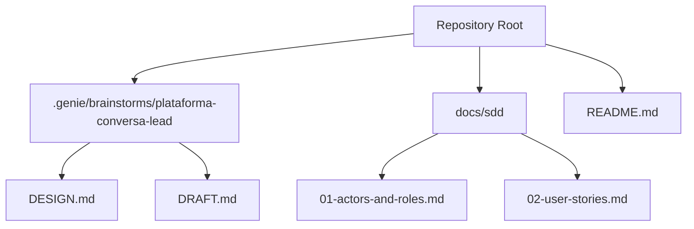
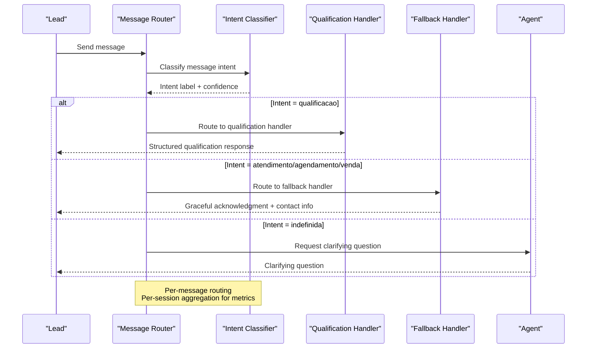
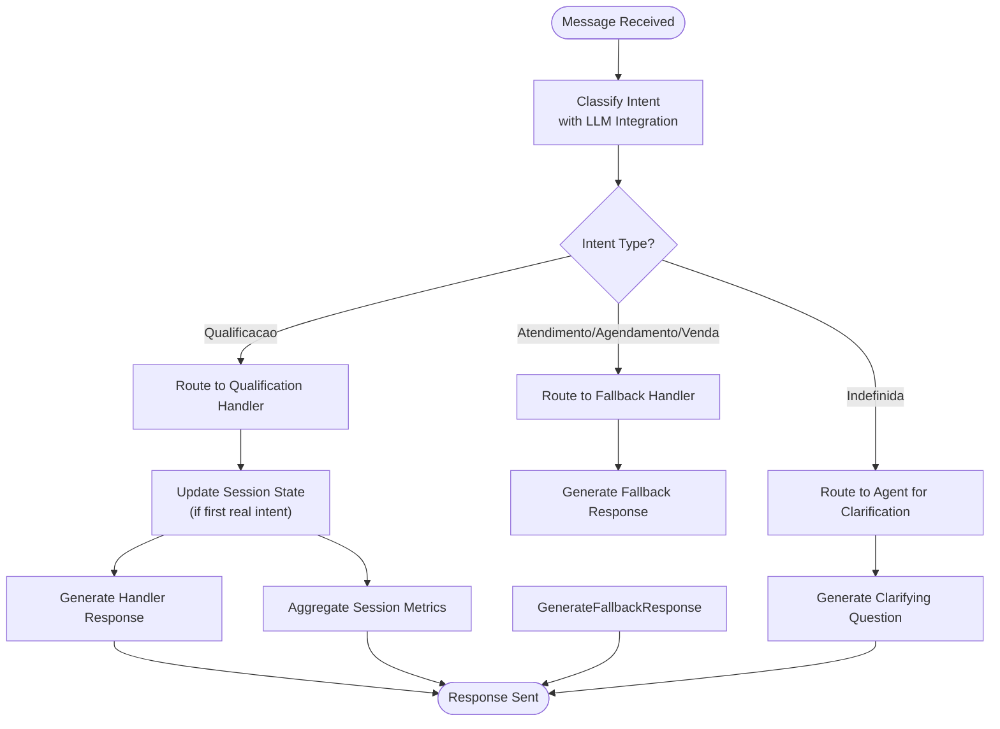
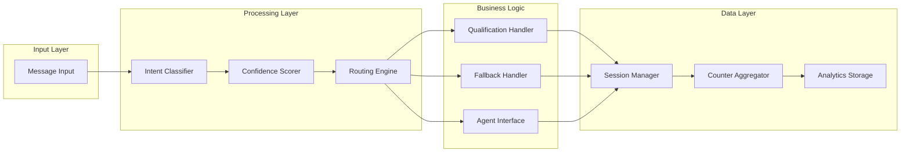

# Intent Classification System

<cite>
**Referenced Files in This Document**
- [README.md](file://README.md)
- [DESIGN.md](file://.genie/brainstorms/plataforma-conversa-lead/DESIGN.md)
- [DRAFT.md](file://.genie/brainstorms/plataforma-conversa-lead/DRAFT.md)
- [01-actors-and-roles.md](file://docs/sdd/01-actors-and-roles.md)
- [02-user-stories.md](file://docs/sdd/02-user-stories.md)
</cite>

## Table of Contents
1. [Introduction](#introduction)
2. [Project Structure](#project-structure)
3. [Core Components](#core-components)
4. [Architecture Overview](#architecture-overview)
5. [Detailed Component Analysis](#detailed-component-analysis)
6. [Dependency Analysis](#dependency-analysis)
7. [Performance Considerations](#performance-considerations)
8. [Troubleshooting Guide](#troubleshooting-guide)
9. [Conclusion](#conclusion)
10. [Appendices](#appendices)

## Introduction
This document describes the Intent Classification System that processes natural language messages to determine user intent and route them appropriately. The system classifies each incoming message into one of five categories: qualification, support (atendimento), scheduling (agendamento), sales (venda), and undefined (indefinida). The undefined category is an explicit abstention mechanism that prevents forcing labels onto greetings or unclear messages.

The classification engine integrates with a Large Language Model (LLM) to understand natural language input, produces a single intent label per message, and supports confidence-aware routing and measurement. The design emphasizes per-message routing for behavior and per-session aggregation for metrics, ensuring accurate intent distribution without compounding classifier errors across turns.

Key goals include:
- Accurate intent classification with ≥85% accuracy on real intents
- Strict abstention control with ≤15% false positive rate for non-intent messages being mislabeled as real intents
- Graceful fallback for non-qualification intents
- Contextual email collection only when justified by intent
- Robust measurement via aggregated counters and weekly snapshots

**Section sources**
- [DESIGN.md:47-166](file://.genie/brainstorms/plataforma-conversa-lead/DESIGN.md#L47-L166)
- [DESIGN.md:225-232](file://.genie/brainstorms/plataforma-conversa-lead/DESIGN.md#L225-L232)
- [DESIGN.md:386-423](file://.genie/brainstorms/plataforma-conversa-lead/DESIGN.md#L386-L423)

## Project Structure
At this stage, the repository contains design and planning artifacts rather than executable code. The core specification for the Intent Classification System resides in the design documents under the .genie directory, while supporting actor models and user stories are documented under docs/sdd.

**Diagram sources**
- [DESIGN.md:47-166](file://.genie/brainstorms/plataforma-conversa-lead/DESIGN.md#L47-L166)
- [01-actors-and-roles.md:8-30](file://docs/sdd/01-actors-and-roles.md#L8-L30)
- [02-user-stories.md:8-55](file://docs/sdd/02-user-stories.md#L8-L55)

**Section sources**
- [README.md:1-8](file://README.md#L1-L8)
- [DESIGN.md:47-166](file://.genie/brainstorms/plataforma-conversa-lead/DESIGN.md#L47-L166)

## Core Components
The Intent Classification System consists of several interconnected components:

### Message Classifier
The classifier is a purpose-built unit with an explicit interface that maps messages to intent labels. It outputs a single field `intencao` with values from the set {qualificacao, atendimento, agendamento, venda, indefinida}. The undefined category serves as explicit abstention for greetings and messages without clear intent.

### Routing Engine
Routing decisions are made per message based on the current message's intent classification. Qualification messages route to the real handler, while other three intents route to a graceful fallback. Undefined messages receive clarifying questions from the agent without triggering any handler.

### Session Aggregator
Session-level aggregation differs from per-message routing. The session inherits the intent from the first message that produces a label different from undefined. If no such message exists, the session remains undefined. This separation protects metrics from compounding classifier errors across conversation turns.

### Handler System
There is one real handler for qualification and one unified fallback for the other three intents. The fallback acknowledges requests, points to tenant contact information, and does not pretend capabilities that do not exist.

**Section sources**
- [DESIGN.md:53-85](file://.genie/brainstorms/plataforma-conversa-lead/DESIGN.md#L53-L85)
- [DESIGN.md:225-232](file://.genie/brainstorms/plataforma-conversa-lead/DESIGN.md#L225-L232)
- [DESIGN.md:262-275](file://.genie/brainstorms/plataforma-conversa-lead/DESIGN.md#L262-L275)

## Architecture Overview
The system follows a layered architecture where natural language messages flow through classification, routing, and response generation layers.

**Diagram sources**
- [DESIGN.md:53-85](file://.genie/brainstorms/plataforma-conversa-lead/DESIGN.md#L53-L85)
- [DESIGN.md:225-232](file://.genie/brainstorms/plataforma-conversa-lead/DESIGN.md#L225-L232)

## Detailed Component Analysis

### Intent Classification Engine
The classification engine uses LLM integration for natural language understanding. It processes each incoming message independently and outputs a single intent label with associated confidence scoring.

#### Classification Categories
- **Qualification**: Messages seeking to qualify leads, gather need/urgency/fit information
- **Support**: Customer service inquiries requiring assistance
- **Scheduling**: Appointment or meeting scheduling requests  
- **Sales**: Direct sales inquiries or purchase-related messages
- **Undefined**: Greetings, unclear messages, or content without actionable intent

#### Confidence Scoring Mechanism
The system implements confidence-based decision making where the classifier provides both intent labels and confidence scores. This enables:
- Threshold-based routing decisions
- Quality monitoring and calibration
- Performance optimization through confidence analysis

#### Abstention Concept
The undefined category is critical for preventing forced labeling of ambiguous messages. Without abstention, the classifier would be forced to assign meaningful labels to greetings like "oi" or unclear messages, contaminating intent distribution metrics.

**Section sources**
- [DESIGN.md:53-57](file://.genie/brainstorms/plataforma-conversa-lead/DESIGN.md#L53-L57)
- [DESIGN.md:262-270](file://.genie/brainstorms/plataforma-conversa-lead/DESIGN.md#L262-L270)
- [DESIGN.md:348-349](file://.genie/brainstorms/plataforma-conversa-lead/DESIGN.md#L348-L349)

### Message Processing Pipeline
The pipeline processes messages through distinct stages with clear separation between behavioral routing and metric aggregation.

**Diagram sources**
- [DESIGN.md:53-85](file://.genie/brainstorms/plataforma-conversa-lead/DESIGN.md#L53-L85)
- [DESIGN.md:64-76](file://.genie/brainstorms/plataforma-conversa-lead/DESIGN.md#L64-L76)

### Training Data Requirements
The system requires high-quality training data for validation and performance measurement:

#### Dataset Composition
- **Minimum 125 labeled messages** total
- **≥25 examples per real intent category** (qualification, support, scheduling, sales)
- **≥25 examples of abstention cases** (greetings, unclear messages, non-intent content)

#### Data Sources
- **Primary source**: Real WhatsApp conversation history from pilot tenant
- **Alternative source**: Synthetic corpus if tenant authorization is not granted
- **Data quality**: Messages must be representative of actual user interactions

#### Validation Criteria
- **Real intent accuracy**: ≥85% accuracy on the four real intent categories
- **Abstention precision**: ≤15% false positive rate for non-intent messages being mislabeled as real intents
- **Statistical significance**: Dataset size ensures reliable performance measurement

**Section sources**
- [DESIGN.md:391-394](file://.genie/brainstorms/plataforma-conversa-lead/DESIGN.md#L391-L394)

### Error Handling Strategies
The system implements comprehensive error handling at multiple levels:

#### Classifier Errors
- Graceful degradation when LLM integration fails
- Fallback to default routing rules
- Error logging and monitoring

#### Routing Errors
- Safe defaults for unknown intents
- Circuit breakers for handler failures
- Retry mechanisms with exponential backoff

#### Session Management Errors
- TTL-based session cleanup
- Rate limiting enforcement
- Memory leak prevention

**Section sources**
- [DESIGN.md:112-127](file://.genie/brainstorms/plataforma-conversa-lead/DESIGN.md#L112-L127)
- [DESIGN.md:386-423](file://.genie/brainstorms/plataforma-conversa-lead/DESIGN.md#L386-L423)

### Performance Optimization Techniques
Several optimization strategies ensure efficient processing:

#### Caching Strategies
- Intent classification result caching for repeated messages
- Session state caching to reduce database queries
- Configuration caching for routing rules

#### Resource Management
- Rate limiting per IP address (30 messages per hour)
- Session turn limits to prevent abuse
- Memory-efficient session storage with TTL

#### Scalability Considerations
- Stateless classifier design for horizontal scaling
- Asynchronous processing for non-critical operations
- Database query optimization for counter aggregation

**Section sources**
- [DESIGN.md:112-127](file://.genie/brainstorms/plataforma-conversa-lead/DESIGN.md#L112-L127)
- [DESIGN.md:159-166](file://.genie/brainstorms/plataforma-conversa-lead/DESIGN.md#L159-L166)

## Dependency Analysis
The system has well-defined dependencies between components with clear separation of concerns.

**Diagram sources**
- [DESIGN.md:225-232](file://.genie/brainstorms/plataforma-conversa-lead/DESIGN.md#L225-L232)
- [DESIGN.md:64-85](file://.genie/brainstorms/plataforma-conversa-lead/DESIGN.md#L64-L85)

### Component Coupling
- **Low coupling**: Classifier is independent with explicit interface
- **High cohesion**: Each component has focused responsibilities
- **Clear boundaries**: Per-message vs per-session processing separated

### External Dependencies
- **LLM Service**: Natural language understanding and classification
- **Database**: Session storage and counter aggregation
- **Rate Limiter**: Abuse prevention and resource protection

**Section sources**
- [DESIGN.md:225-232](file://.genie/brainstorms/plataforma-conversa-lead/DESIGN.md#L225-L232)
- [DESIGN.md:286-291](file://.genie/brainstorms/plataforma-conversa-lead/DESIGN.md#L286-L291)

## Performance Considerations
The system is designed for optimal performance while maintaining accuracy and reliability:

### Latency Optimization
- **Classifier caching**: Store recent classifications to avoid redundant LLM calls
- **Connection pooling**: Efficient database connections for session management
- **Asynchronous processing**: Non-blocking operations for improved throughput

### Throughput Scaling
- **Horizontal scaling**: Stateless classifier allows easy scaling
- **Load balancing**: Distribute traffic across multiple instances
- **Resource monitoring**: Track system health and capacity

### Cost Management
- **Rate limiting**: Protect against excessive LLM usage
- **Session TTL**: Automatic cleanup of inactive sessions
- **Efficient storage**: Optimized counter aggregation reduces database load

### Monitoring and Observability
- **Performance metrics**: Track classification latency and accuracy
- **Error tracking**: Monitor failure rates and patterns
- **Resource utilization**: CPU, memory, and network usage monitoring

## Troubleshooting Guide

### Common Issues and Solutions

#### Classifier Accuracy Problems
- **Symptom**: Low accuracy on real intents (<85%)
- **Causes**: Insufficient training data, poor quality labels, concept drift
- **Solutions**: Expand training dataset, improve labeling quality, retrain model

#### Abstention Rate Issues
- **Symptom**: Too many messages classified as undefined (>15% false positives)
- **Causes**: Overly conservative thresholds, unclear message definitions
- **Solutions**: Adjust confidence thresholds, refine abstention criteria

#### Performance Degradation
- **Symptom**: Increased latency or timeout errors
- **Causes**: LLM service slowdown, database bottlenecks, memory leaks
- **Solutions**: Implement caching, optimize queries, scale resources

#### Routing Errors
- **Symptom**: Messages routed to incorrect handlers
- **Causes**: Classifier misclassification, routing rule conflicts
- **Solutions**: Review classifier output, update routing logic, add validation

### Diagnostic Tools
- **Classification logs**: Detailed records of classification decisions
- **Performance metrics**: Real-time monitoring of system performance
- **Error reports**: Automated detection and reporting of issues

### Recovery Procedures
- **Graceful degradation**: Continue operation with reduced functionality during outages
- **Rollback capability**: Quick revert to previous working versions
- **Data backup**: Regular backups of critical session and counter data

**Section sources**
- [DESIGN.md:386-423](file://.genie/brainstorms/plataforma-conversa-lead/DESIGN.md#L386-L423)
- [DESIGN.md:112-127](file://.genie/brainstorms/plataforma-conversa-lead/DESIGN.md#L112-L127)

## Conclusion
The Intent Classification System provides a robust foundation for processing natural language messages and determining user intent with high accuracy and reliability. The system's design emphasizes the critical importance of abstention through the undefined category, preventing forced labeling of ambiguous messages while maintaining accurate intent distribution metrics.

Key strengths include:
- Clear separation between per-message routing and per-session aggregation
- Comprehensive validation criteria with specific accuracy thresholds
- Graceful handling of edge cases and error conditions
- Scalable architecture with built-in performance optimizations

The system successfully addresses the core challenge of natural language understanding in conversational interfaces while providing measurable performance guarantees and operational reliability.

## Appendices

### Success Criteria Summary
- **Fluxo completo**: Complete lead conversion flow from anonymous chat to identified lead
- **Fallback isolado**: Proper isolation of non-qualification intent handling
- **Abstenção roteada**: Correct routing of undefined intent messages
- **Classificador validado**: Validated classifier with ≥85% accuracy and ≤15% abstention false positives
- **Validação de e-mail**: Email validation with syntax and blocklist checking
- **Contadores**: Accurate aggregated counting with proper session lifecycle management

### Technical Specifications
- **Technology stack**: Next.js frontend, FastAPI backend, Postgres database
- **Session management**: Ephemeral sessions with TTL-based cleanup
- **Rate limiting**: 30 messages per IP per hour
- **TTL configuration**: 24-hour session lifetime
- **Pilot window**: 12-week evaluation period

**Section sources**
- [DESIGN.md:386-423](file://.genie/brainstorms/plataforma-conversa-lead/DESIGN.md#L386-L423)
- [DESIGN.md:117-127](file://.genie/brainstorms/plataforma-conversa-lead/DESIGN.md#L117-L127)