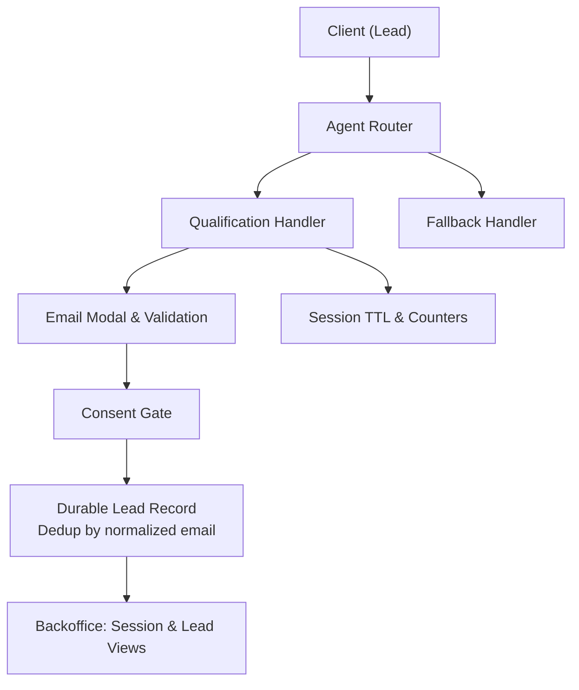
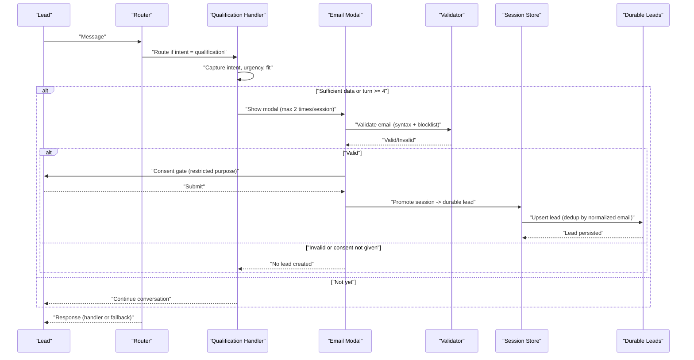
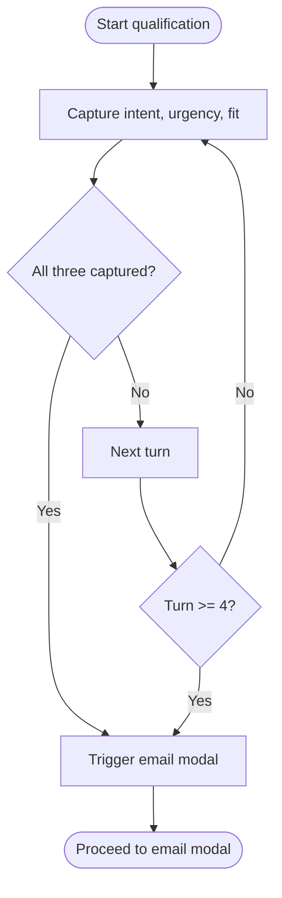
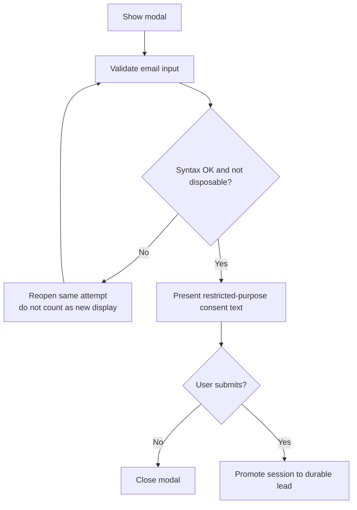
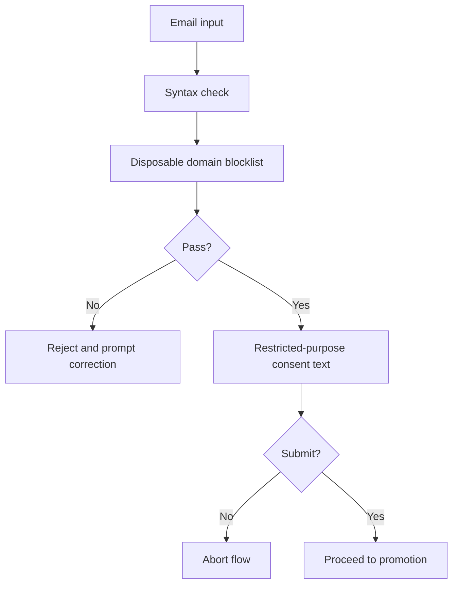
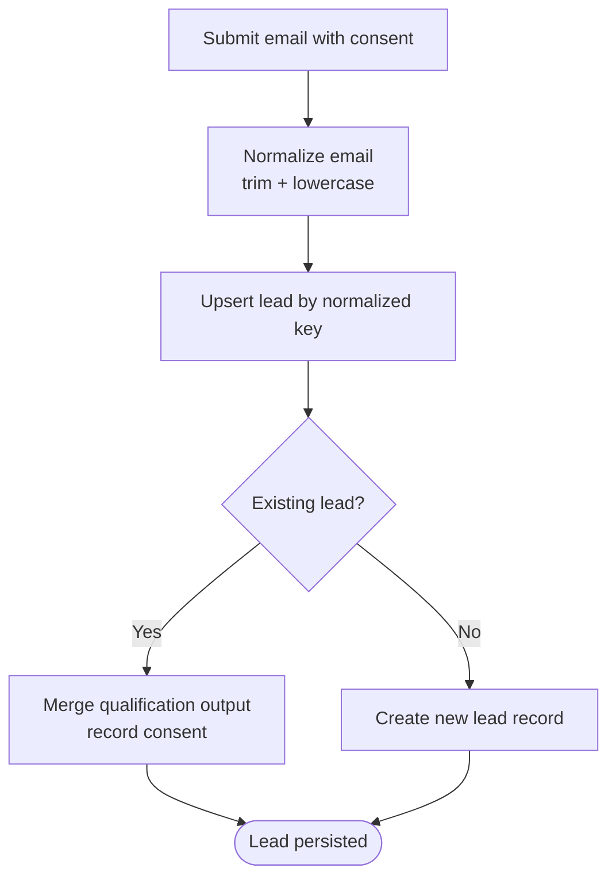
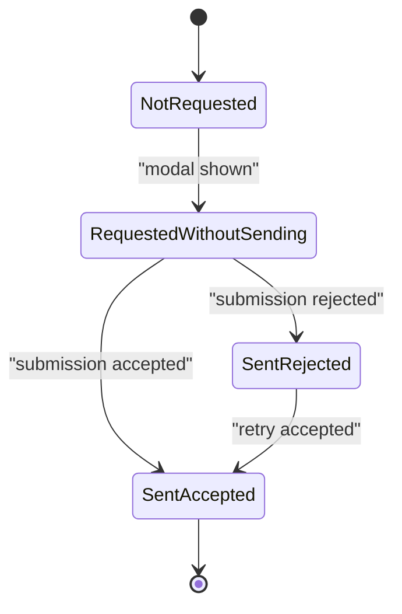
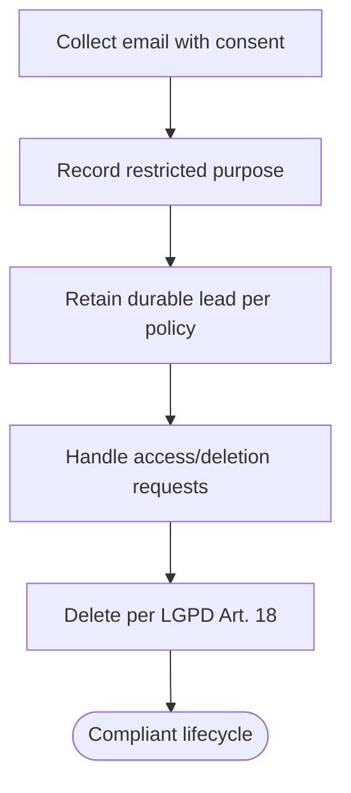
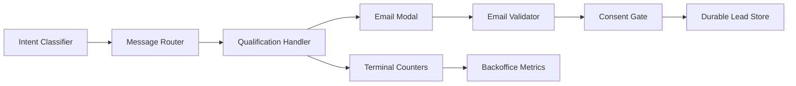

# Lead Management Handler

<cite>
**Referenced Files in This Document**
- [DESIGN.md](file://.genie/brainstorms/plataforma-conversa-lead/DESIGN.md)
- [01-actors-and-roles.md](file://docs/sdd/01-actors-and-roles.md)
- [02-user-stories.md](file://docs/sdd/02-user-stories.md)
- [03-functional-spec-backoffice.md](file://docs/sdd/03-functional-spec-backoffice.md)
- [04-transfer-workflow.md](file://docs/sdd/04-transfer-workflow.md)
</cite>

## Table of Contents
1. [Introduction](#introduction)
2. [Project Structure](#project-structure)
3. [Core Components](#core-components)
4. [Architecture Overview](#architecture-overview)
5. [Detailed Component Analysis](#detailed-component-analysis)
6. [Dependency Analysis](#dependency-analysis)
7. [Performance Considerations](#performance-considerations)
8. [Troubleshooting Guide](#troubleshooting-guide)
9. [Conclusion](#conclusion)
10. [Appendices](#appendices)

## Introduction
This document specifies the Lead Management Handler that processes qualified leads through structured data capture and conversion to durable records. It covers the qualification workflow (intent, urgency, fit), the contextual email collection modal, email validation and consent management, promotion from anonymous sessions to durable leads, deduplication via normalized email keys, monotonic email state progression, and GDPR/LGPD compliance requirements including data retention policies.

## Project Structure
The lead management behavior is defined by design specifications and user stories rather than code files in this repository snapshot. The relevant artifacts are:
- Design specification for scope, decisions, success criteria, and risk assumptions
- User stories describing lead interactions and acceptance criteria
- Backoffice functional specification defining session and lead views, metrics, and configuration
- Transfer workflow specification clarifying fallback behavior and transfer triggers

**Section sources**
- [DESIGN.md:47-166](file://.genie/brainstorms/plataforma-conversa-lead/DESIGN.md#L47-L166)
- [02-user-stories.md:28-57](file://docs/sdd/02-user-stories.md#L28-L57)
- [03-functional-spec-backoffice.md:85-168](file://docs/sdd/03-functional-spec-backoffice.md#L85-L168)

## Core Components
- Qualification handler: captures intent, urgency, and fit; drives conversation flow and timing of email request.
- Contextual email modal: appears when sufficient qualification data is captured or at turn 4, whichever comes first; limited to two displays per session.
- Email validation: syntax check plus disposable domain blocklist; no ownership confirmation in fatia 1.
- Consent gate: sending the email is the explicit consent act with restricted purpose (commercial follow-up on this conversation); marketing consent is out of scope for fatia 1.
- Promotion to durable lead: on successful submission, promote anonymous session to a durable lead record; deduplicate by normalized email (trim + lowercase).
- Monotonic email state: per-session terminal state progresses monotonically across four values to ensure metric consistency.
- Counters and TTL: sessions emit a single terminal counter on close or TTL expiry; TTL governs transcript discard and retention.

**Section sources**
- [DESIGN.md:77-111](file://.genie/brainstorms/plataforma-conversa-lead/DESIGN.md#L77-L111)
- [DESIGN.md:215-223](file://.genie/brainstorms/plataforma-conversa-lead/DESIGN.md#L215-L223)
- [DESIGN.md:386-398](file://.genie/brainstorms/plataforma-conversa-lead/DESIGN.md#L386-L398)
- [02-user-stories.md:28-57](file://docs/sdd/02-user-stories.md#L28-L57)
- [03-functional-spec-backoffice.md:85-168](file://docs/sdd/03-functional-spec-backoffice.md#L85-L168)

## Architecture Overview
The system routes each message based on current intent. When intent is qualification, the handler runs; otherwise, a graceful fallback responds for that turn while keeping the session open. The email modal is triggered by the qualification handler under specific conditions. On successful email submission with consent, the session is promoted to a durable lead record.

**Diagram sources**
- [DESIGN.md:58-85](file://.genie/brainstorms/plataforma-conversa-lead/DESIGN.md#L58-L85)
- [DESIGN.md:86-111](file://.genie/brainstorms/plataforma-conversa-lead/DESIGN.md#L86-L111)
- [DESIGN.md:215-223](file://.genie/brainstorms/plataforma-conversa-lead/DESIGN.md#L215-L223)
- [02-user-stories.md:28-57](file://docs/sdd/02-user-stories.md#L28-L57)

## Detailed Component Analysis

### Qualification Workflow
- Captures three key attributes: intent, urgency, fit.
- Drives the decision to show the email modal when all three are captured or at turn 4, whichever comes first.
- Ensures fallback responses do not trigger email requests; only the qualification handler can.

**Diagram sources**
- [DESIGN.md:77-98](file://.genie/brainstorms/plataforma-conversa-lead/DESIGN.md#L77-L98)
- [02-user-stories.md:28-36](file://docs/sdd/02-user-stories.md#L28-L36)

**Section sources**
- [DESIGN.md:77-98](file://.genie/brainstorms/plataforma-conversa-lead/DESIGN.md#L77-L98)
- [02-user-stories.md:28-36](file://docs/sdd/02-user-stories.md#L28-L36)

### Contextual Email Collection Modal
- Trigger conditions: after capturing intent/urgency/fit or at turn 4, whichever comes first.
- Display limit: maximum two displays per session; validation failure reopens the same attempt without counting as a new display.
- Value proposition: modal explains that the email will be used for the tenant’s commercial team to follow up on this conversation.

**Diagram sources**
- [DESIGN.md:86-106](file://.genie/brainstorms/plataforma-conversa-lead/DESIGN.md#L86-L106)
- [02-user-stories.md:28-45](file://docs/sdd/02-user-stories.md#L28-L45)

**Section sources**
- [DESIGN.md:86-106](file://.genie/brainstorms/plataforma-conversa-lead/DESIGN.md#L86-L106)
- [02-user-stories.md:28-45](file://docs/sdd/02-user-stories.md#L28-L45)

### Email Validation and Consent Management
- Syntax checking: rejects invalid formats.
- Disposable domain blocking: uses a public blocklist to reject known disposable domains.
- Consent gate: submitting the email is the explicit consent act; consent purpose is restricted to commercial follow-up on this conversation; marketing consent is out of scope for fatia 1.

**Diagram sources**
- [DESIGN.md:99-106](file://.genie/brainstorms/plataforma-conversa-lead/DESIGN.md#L99-L106)
- [02-user-stories.md:31-45](file://docs/sdd/02-user-stories.md#L31-L45)

**Section sources**
- [DESIGN.md:99-106](file://.genie/brainstorms/plataforma-conversa-lead/DESIGN.md#L99-L106)
- [02-user-stories.md:31-45](file://docs/sdd/02-user-stories.md#L31-L45)

### Promotion to Durable Lead Records and Deduplication
- Promotion occurs upon successful email submission with consent.
- Deduplication key: normalized email (trim whitespace + lowercase).
- Consent recording: consent purpose recorded alongside the lead record.

**Diagram sources**
- [DESIGN.md:107-111](file://.genie/brainstorms/plataforma-conversa-lead/DESIGN.md#L107-L111)
- [03-functional-spec-backoffice.md:121-152](file://docs/sdd/03-functional-spec-backoffice.md#L121-L152)

**Section sources**
- [DESIGN.md:107-111](file://.genie/brainstorms/plataforma-conversa-lead/DESIGN.md#L107-L111)
- [03-functional-spec-backoffice.md:121-152](file://docs/sdd/03-functional-spec-backoffice.md#L121-L152)

### Monotonic Email State Progression
- Per-session terminal state is monotonic across four values:
  - Not requested
  - Requested without sending
  - Sent rejected
  - Sent accepted
- The stored value is the maximum achieved during the session to ensure consistency between metrics and durable records.

**Diagram sources**
- [DESIGN.md:142-146](file://.genie/brainstorms/plataforma-conversa-lead/DESIGN.md#L142-L146)
- [DESIGN.md:215-223](file://.genie/brainstorms/plataforma-conversa-lead/DESIGN.md#L215-L223)
- [03-functional-spec-backoffice.md:85-105](file://docs/sdd/03-functional-spec-backoffice.md#L85-L105)

**Section sources**
- [DESIGN.md:142-146](file://.genie/brainstorms/plataforma-conversa-lead/DESIGN.md#L142-L146)
- [DESIGN.md:215-223](file://.genie/brainstorms/plataforma-conversa-lead/DESIGN.md#L215-L223)
- [03-functional-spec-backoffice.md:85-105](file://docs/sdd/03-functional-spec-backoffice.md#L85-L105)

### GDPR/LGPD Compliance and Data Retention
- Restricted purpose: consent is limited to commercial follow-up on this conversation; marketing consent is out of scope for fatia 1.
- Rights of the data subject: documented manual process for access and deletion requests (LGPD Art. 18) with named owner and SLA adherence.
- Retention policy: anonymous sessions are discarded at TTL; counters remain aggregated without PII; durable leads persist until deletion requests are fulfilled.

**Diagram sources**
- [DESIGN.md:101-111](file://.genie/brainstorms/plataforma-conversa-lead/DESIGN.md#L101-L111)
- [02-user-stories.md:38-57](file://docs/sdd/02-user-stories.md#L38-L57)

**Section sources**
- [DESIGN.md:101-111](file://.genie/brainstorms/plataforma-conversa-lead/DESIGN.md#L101-L111)
- [02-user-stories.md:38-57](file://docs/sdd/02-user-stories.md#L38-L57)

## Dependency Analysis
- Routing depends on the classifier’s intent label per message; qualification handler is invoked only for qualification intent.
- Email modal depends on the qualification handler’s captured fields and turn count.
- Durable lead creation depends on successful validation and consent.
- Counters depend on session lifecycle events (close/TTL) and email state progression.

**Diagram sources**
- [DESIGN.md:58-85](file://.genie/brainstorms/plataforma-conversa-lead/DESIGN.md#L58-L85)
- [DESIGN.md:127-166](file://.genie/brainstorms/plataforma-conversa-lead/DESIGN.md#L127-L166)
- [03-functional-spec-backoffice.md:153-168](file://docs/sdd/03-functional-spec-backoffice.md#L153-L168)

**Section sources**
- [DESIGN.md:58-85](file://.genie/brainstorms/plataforma-conversa-lead/DESIGN.md#L58-L85)
- [DESIGN.md:127-166](file://.genie/brainstorms/plataforma-conversa-lead/DESIGN.md#L127-L166)
- [03-functional-spec-backoffice.md:153-168](file://docs/sdd/03-functional-spec-backoffice.md#L153-L168)

## Performance Considerations
- Keep modal displays minimal (maximum two per session) to reduce friction and improve conversion.
- Use normalized email keys for fast deduplication lookups.
- Emit a single terminal counter per session to avoid heavy event logging overhead.
- Enforce rate limiting and per-session turn limits to protect backend resources.

[No sources needed since this section provides general guidance]

## Troubleshooting Guide
- Modal does not appear: verify that intent/urgency/fit were captured or that turn count reached the threshold; confirm fallback is not intercepting the flow.
- Email repeatedly rejected: check syntax and disposable domain blocklist; allow retry within the same modal attempt without counting as a new display.
- Duplicate leads observed: ensure normalization (trim + lowercase) is applied consistently before upsert.
- Consent issues: confirm restricted-purpose consent text is presented and that submission is treated as the consent act.
- Metrics mismatch: validate that email state progression is monotonic and that terminal counters are emitted for all sessions, including excluded ones.

**Section sources**
- [DESIGN.md:86-111](file://.genie/brainstorms/plataforma-conversa-lead/DESIGN.md#L86-L111)
- [DESIGN.md:215-223](file://.genie/brainstorms/plataforma-conversa-lead/DESIGN.md#L215-L223)
- [02-user-stories.md:28-57](file://docs/sdd/02-user-stories.md#L28-L57)

## Conclusion
The Lead Management Handler orchestrates a focused, compliant path from anonymous conversation to durable lead capture. By gating email collection behind meaningful qualification context, enforcing strict validation and consent, and promoting sessions to leads with robust deduplication and monotonic state tracking, the system balances user experience, data quality, and regulatory compliance.

[No sources needed since this section summarizes without analyzing specific files]

## Appendices

### Success Criteria References
- Complete flow verification, fallback isolation, abstenção routing, classifier validation, email validation, deduplication, counters, and rate limiting are explicitly defined in the design specification.

**Section sources**
- [DESIGN.md:386-398](file://.genie/brainstorms/plataforma-conversa-lead/DESIGN.md#L386-L398)

### Backoffice Integration Notes
- Session view includes intent, turn count, time active, origin, email state, and flags for operator monitoring.
- Lead view includes normalized email, intent, urgency, fit, qualification output, timestamps, origin, session count, and consent details.

**Section sources**
- [03-functional-spec-backoffice.md:85-168](file://docs/sdd/03-functional-spec-backoffice.md#L85-L168)