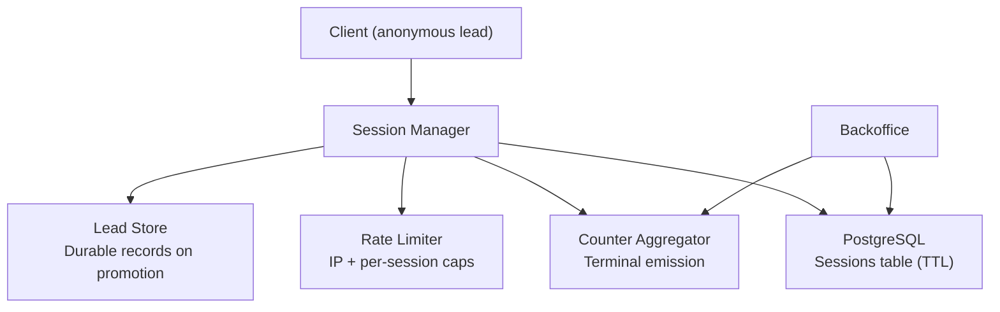
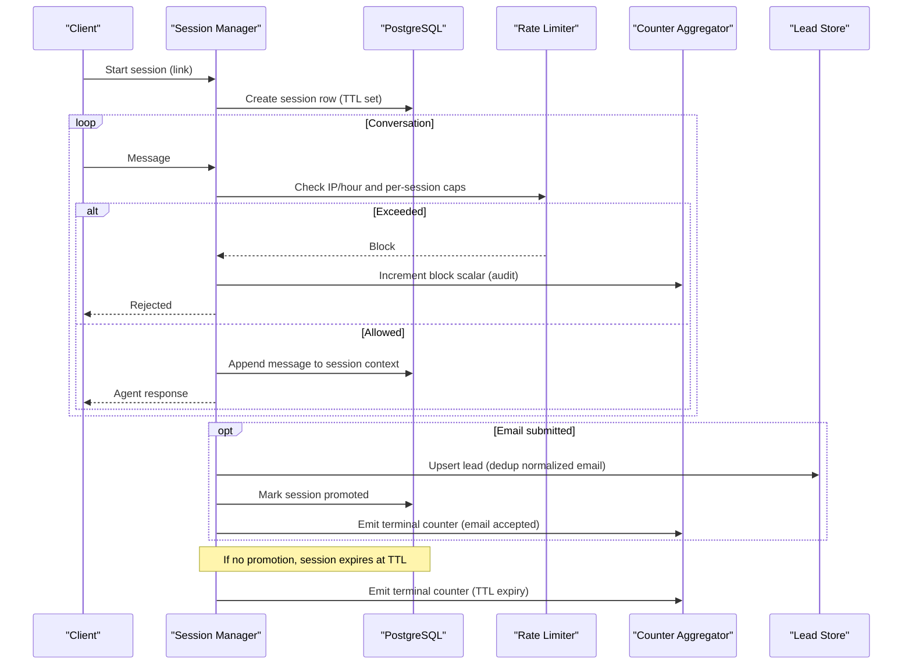
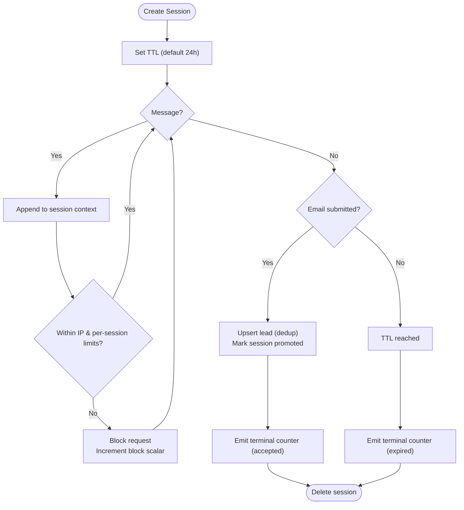
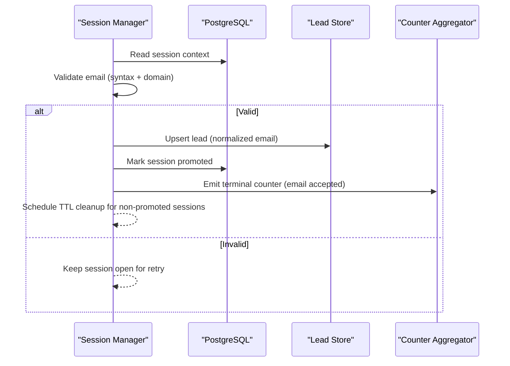
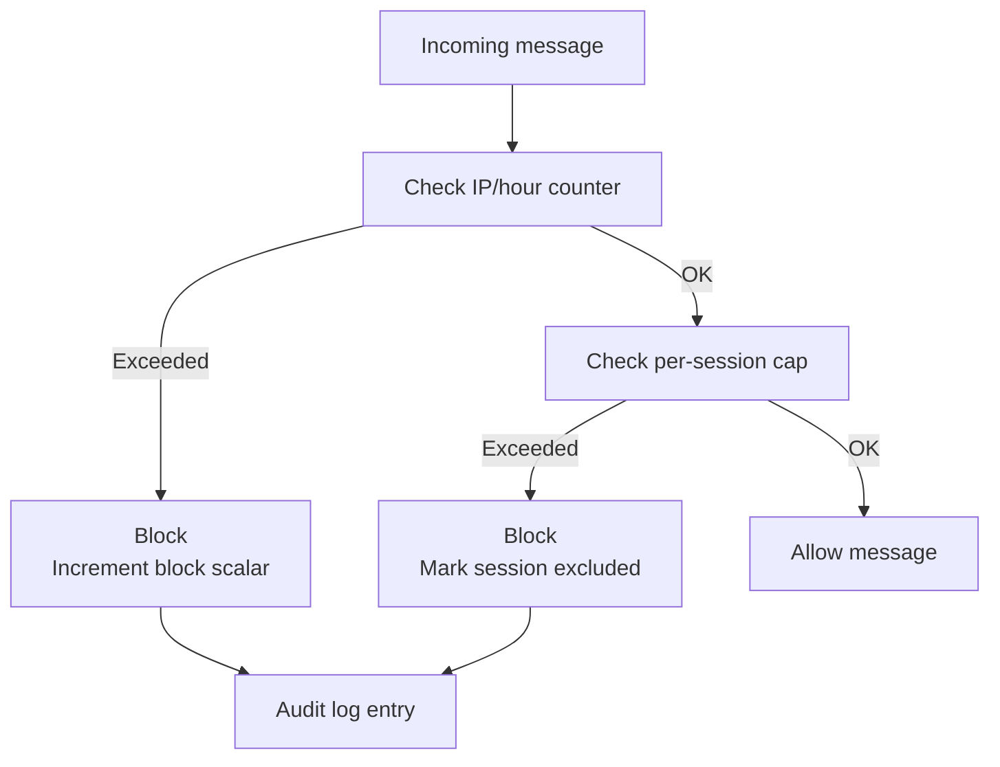
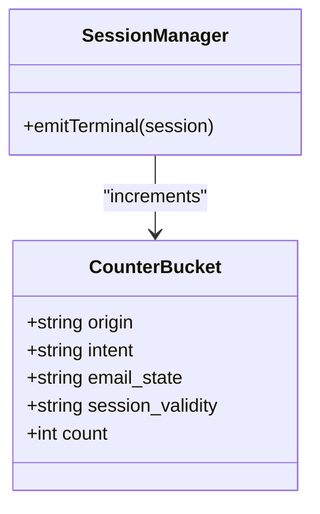
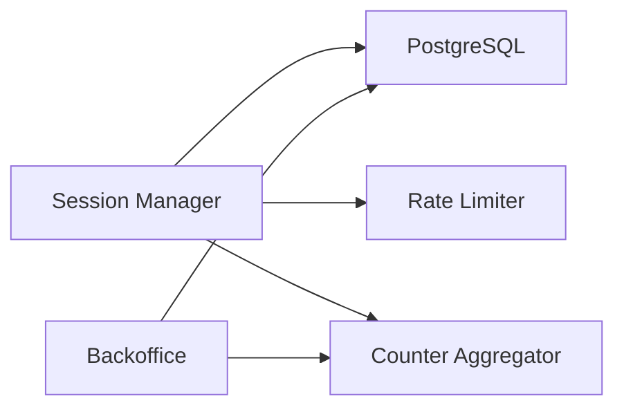

# Session Manager

<cite>
**Referenced Files in This Document**
- [DESIGN.md](file://.genie/brainstorms/plataforma-conversa-lead/DESIGN.md)
- [01-actors-and-roles.md](file://docs/sdd/01-actors-and-roles.md)
- [02-user-stories.md](file://docs/sdd/02-user-stories.md)
- [03-functional-spec-backoffice.md](file://docs/sdd/03-functional-spec-backoffice.md)
- [04-transfer-workflow.md](file://docs/sdd/04-transfer-workflow.md)
</cite>

## Table of Contents
1. [Introduction](#introduction)
2. [Project Structure](#project-structure)
3. [Core Components](#core-components)
4. [Architecture Overview](#architecture-overview)
5. [Detailed Component Analysis](#detailed-component-analysis)
6. [Dependency Analysis](#dependency-analysis)
7. [Performance Considerations](#performance-considerations)
8. [Troubleshooting Guide](#troubleshooting-guide)
9. [Conclusion](#conclusion)

## Introduction
This document specifies the Session Manager for anonymous conversation sessions with TTL-based expiration and promotion to durable lead records upon email submission. It explains how sessions are stored in PostgreSQL (not Redis), how conversation context is preserved while users remain anonymous, and how automatic cleanup occurs when TTL expires. It also documents rate limiting by IP and per-session message caps, session validity tracking, audit trails for blocked requests, concurrent session handling, memory management, and performance optimization strategies for high-volume scenarios.

## Project Structure
The repository contains design and specification artifacts that define the Session Manager behavior:
- Design specifications describe storage model (PostgreSQL), TTL policy, promotion to leads, counters, and rate limits.
- SDD documents define actors, user stories, backoffice capabilities, and transfer workflows that interact with sessions.

[No sources needed since this diagram shows conceptual workflow, not actual code structure]

## Core Components
- Anonymous Session Storage: Each session is a row in a PostgreSQL table with a TTL column used to expire rows after a configured duration (default 24 hours). The session carries conversation context until it expires or is promoted.
- Promotion to Lead: When a user submits an email successfully, the active session is promoted to a durable lead record. Non-promoted sessions are discarded at TTL expiry.
- Rate Limiting: Enforced at two levels:
  - IP-based limit: 30 messages per hour per IP.
  - Per-session message cap: configurable ceiling (default derived from tenant history; bounded to a safe maximum if authorization is missing).
- Terminal Counter Emission: On session close or TTL expiry, a single terminal emission increments a pre-aggregated counter bucket across four dimensions (origin, intent, email state, session validity). No per-session identifiers or timestamps are retained in the counter.
- Audit Trail: Blocked requests at the edge (by IP) are counted in an operational scalar per IP per day and logged for auditability without creating session records.

**Section sources**
- [DESIGN.md:112-165](file://.genie/brainstorms/plataforma-conversa-lead/DESIGN.md#L112-L165)
- [DESIGN.md:198-213](file://.genie/brainstorms/plataforma-conversa-lead/DESIGN.md#L198-L213)
- [DESIGN.md:386-398](file://.genie/brainstorms/plataforma-conversa-lead/DESIGN.md#L386-L398)

## Architecture Overview
The Session Manager orchestrates anonymous conversations, enforces limits, and manages lifecycle transitions between ephemeral sessions and durable leads.

**Diagram sources**
- [DESIGN.md:112-165](file://.genie/brainstorms/plataforma-conversa-lead/DESIGN.md#L112-L165)
- [DESIGN.md:198-213](file://.genie/brainstorms/plataforma-conversa-lead/DESIGN.md#L198-L213)
- [DESIGN.md:386-398](file://.genie/brainstorms/plataforma-conversa-lead/DESIGN.md#L386-L398)

## Detailed Component Analysis

### Session Lifecycle and TTL
- Creation: A new session row is created with a TTL timestamp. The session stores conversation context (messages) while anonymous.
- Activity: Each message updates the session’s context and counters.
- Expiration: A background process scans for expired rows and emits a terminal counter before deletion.
- Promotion: Successful email submission promotes the session to a durable lead; non-promoted sessions are purged at TTL.

**Diagram sources**
- [DESIGN.md:112-165](file://.genie/brainstorms/plataforma-conversa-lead/DESIGN.md#L112-L165)
- [DESIGN.md:198-213](file://.genie/brainstorms/plataforma-conversa-lead/DESIGN.md#L198-L213)
- [DESIGN.md:386-398](file://.genie/brainstorms/plataforma-conversa-lead/DESIGN.md#L386-L398)

**Section sources**
- [DESIGN.md:112-165](file://.genie/brainstorms/plataforma-conversa-lead/DESIGN.md#L112-L165)
- [DESIGN.md:198-213](file://.genie/brainstorms/plataforma-conversa-lead/DESIGN.md#L198-L213)
- [DESIGN.md:386-398](file://.genie/brainstorms/plataforma-conversa-lead/DESIGN.md#L386-L398)

### Message Context Preservation
- While anonymous, each message is appended to the session row to preserve conversation context.
- Routing decisions are evaluated per message; only the first non-abstention message fixes the session’s intent for counting purposes.
- Context remains available until TTL expiry or promotion.

**Section sources**
- [DESIGN.md:53-85](file://.genie/brainstorms/plataforma-conversa-lead/DESIGN.md#L53-L85)
- [DESIGN.md:198-213](file://.genie/brainstorms/plataforma-conversa-lead/DESIGN.md#L198-L213)

### Promotion Mechanism (Active Session → Durable Lead)
- Trigger: Successful email submission with validated syntax and domain allowlist.
- Deduplication: Emails are normalized (trim + lowercase) before upsert to avoid duplicates.
- Outcome: The session becomes a durable lead record; subsequent TTL does not delete it. Non-promoted sessions are deleted at TTL.

**Diagram sources**
- [DESIGN.md:107-111](file://.genie/brainstorms/plataforma-conversa-lead/DESIGN.md#L107-L111)
- [DESIGN.md:198-213](file://.genie/brainstorms/plataforma-conversa-lead/DESIGN.md#L198-L213)

**Section sources**
- [DESIGN.md:107-111](file://.genie/brainstorms/plataforma-conversa-lead/DESIGN.md#L107-L111)
- [DESIGN.md:198-213](file://.genie/brainstorms/plataforma-conversa-lead/DESIGN.md#L198-L213)

### Rate Limiting and Session Validity Tracking
- IP-based limit: 30 messages per hour per IP. Requests exceeding this are blocked and counted in an operational scalar per IP per day for auditability.
- Per-session cap: Configurable ceiling based on tenant history; defaults to a safe bound if authorization is missing.
- Session validity: Sessions that exceed either limit are marked as excluded (rate limit or turn cap) and removed from valid counts.

**Diagram sources**
- [DESIGN.md:112-165](file://.genie/brainstorms/plataforma-conversa-lead/DESIGN.md#L112-L165)
- [DESIGN.md:386-398](file://.genie/brainstorms/plataforma-conversa-lead/DESIGN.md#L386-L398)

**Section sources**
- [DESIGN.md:112-165](file://.genie/brainstorms/plataforma-conversa-lead/DESIGN.md#L112-L165)
- [DESIGN.md:386-398](file://.genie/brainstorms/plataforma-conversa-lead/DESIGN.md#L386-L398)

### Terminal Counter Emission and Dimensions
- Emission timing: At session close or TTL expiry.
- Dimensions: origin, intent, email state, session validity.
- Storage: Pre-aggregated buckets; no per-session identifiers or timestamps retained.

**Diagram sources**
- [DESIGN.md:127-165](file://.genie/brainstorms/plataforma-conversa-lead/DESIGN.md#L127-L165)

**Section sources**
- [DESIGN.md:127-165](file://.genie/brainstorms/plataforma-conversa-lead/DESIGN.md#L127-L165)

### Backoffice Interaction and Monitoring
- Operators can monitor active sessions, review leads, and view daily metrics.
- Parameters such as TTL, rate limits, and turn caps are configurable via leadership dashboards.
- Audit logs capture administrative actions and parameter changes.

**Section sources**
- [01-actors-and-roles.md:10-30](file://docs/sdd/01-actors-and-roles.md#L10-L30)
- [02-user-stories.md:60-94](file://docs/sdd/02-user-stories.md#L60-L94)
- [03-functional-spec-backoffice.md:153-210](file://docs/sdd/03-functional-spec-backoffice.md#L153-L210)
- [03-functional-spec-backoffice.md:263-281](file://docs/sdd/03-functional-spec-backoffice.md#L263-L281)

### Transfer Workflow Integration
- Transfer configuration supports “none,” operator, queue, and channel modes.
- In fatia 1, the primary mode is “none” with fallback messaging; full transfer execution is deferred.
- Transfer events may be tracked via separate scalar counters.

**Section sources**
- [04-transfer-workflow.md:20-75](file://docs/sdd/04-transfer-workflow.md#L20-L75)
- [04-transfer-workflow.md:80-98](file://docs/sdd/04-transfer-workflow.md#L80-L98)
- [04-transfer-workflow.md:270-285](file://docs/sdd/04-transfer-workflow.md#L270-L285)

## Dependency Analysis
- Session Manager depends on:
  - PostgreSQL for session storage and lead persistence.
  - Rate limiter for IP and per-session enforcement.
  - Counter aggregator for terminal emissions.
  - Backoffice interfaces for monitoring and configuration.
- Coupling:
  - Tight coupling to PostgreSQL schema (sessions, leads, counters).
  - Loose coupling to rate limiter via interface contracts.
  - Backoffice reads aggregated data to minimize load.

[No sources needed since this diagram shows conceptual relationships, not specific code files]

## Performance Considerations
- Use PostgreSQL TTL-aware queries and scheduled cleanup jobs to purge expired sessions efficiently.
- Index session tables by TTL and status to optimize scans.
- Batch terminal counter emissions to reduce write amplification.
- Cache frequently read parameters (TTL, rate limits) with short refresh intervals.
- Partition counter buckets by time windows to keep aggregation fast.
- Avoid per-session event streams; rely on aggregated buckets to prevent high cardinality writes.
- For high volume:
  - Scale read replicas for backoffice queries.
  - Use connection pooling and prepared statements.
  - Monitor database lock contention during promotions and counter upserts.

[No sources needed since this section provides general guidance]

## Troubleshooting Guide
- Symptom: Sessions not expiring.
  - Check TTL configuration and ensure cleanup job runs.
  - Verify indexes on TTL columns.
- Symptom: Leads duplicated.
  - Confirm email normalization (trim + lowercase) and dedup logic.
- Symptom: High block rates.
  - Review IP-based rate limit thresholds and per-session caps.
  - Inspect operational block scalars for spikes.
- Symptom: Counters inconsistent.
  - Ensure terminal emission runs on both close and TTL expiry.
  - Validate all four dimensions are populated correctly.

**Section sources**
- [DESIGN.md:112-165](file://.genie/brainstorms/plataforma-conversa-lead/DESIGN.md#L112-L165)
- [DESIGN.md:198-213](file://.genie/brainstorms/plataforma-conversa-lead/DESIGN.md#L198-L213)
- [DESIGN.md:386-398](file://.genie/brainstorms/plataforma-conversa-lead/DESIGN.md#L386-L398)

## Conclusion
The Session Manager provides a robust, privacy-preserving mechanism for anonymous conversations with clear lifecycle boundaries enforced by TTL. It balances simplicity (PostgreSQL-only storage) with strong operational controls (rate limiting, terminal counters, auditability). Promotion to durable leads ensures valuable interactions persist beyond TTL, while non-identified sessions are automatically cleaned up. With careful indexing, batching, and monitoring, the system scales to high-volume scenarios while maintaining compliance and performance.