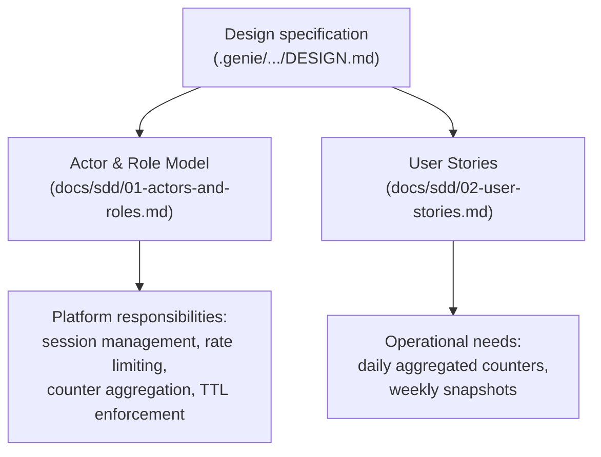
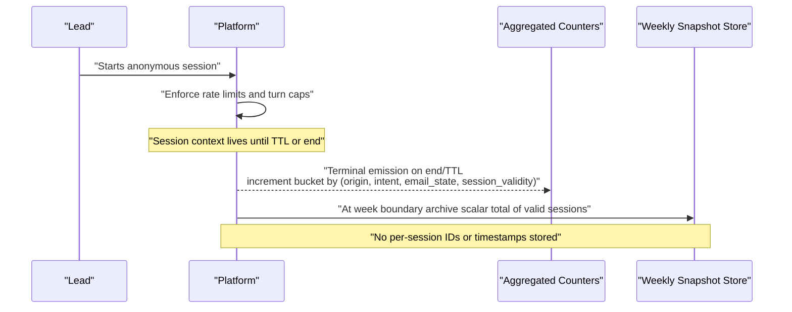
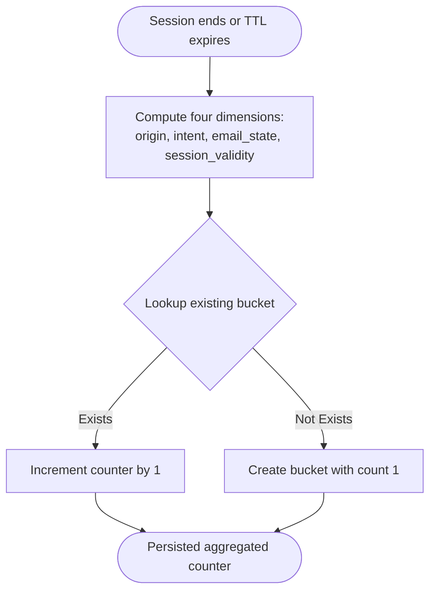
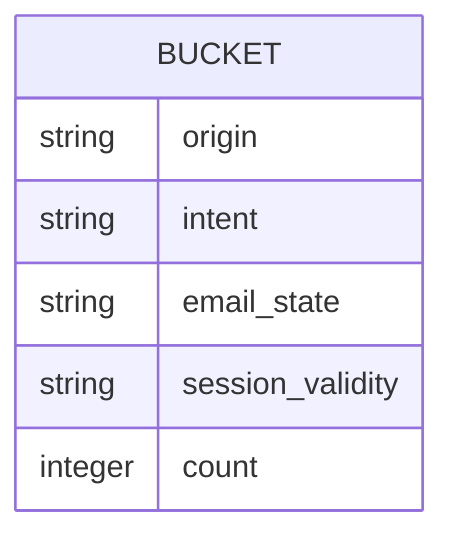
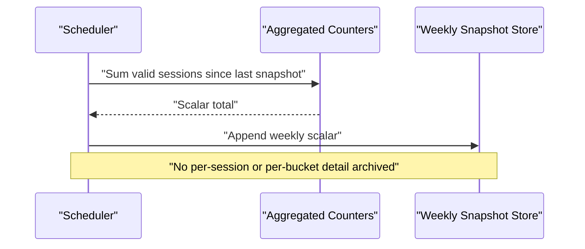
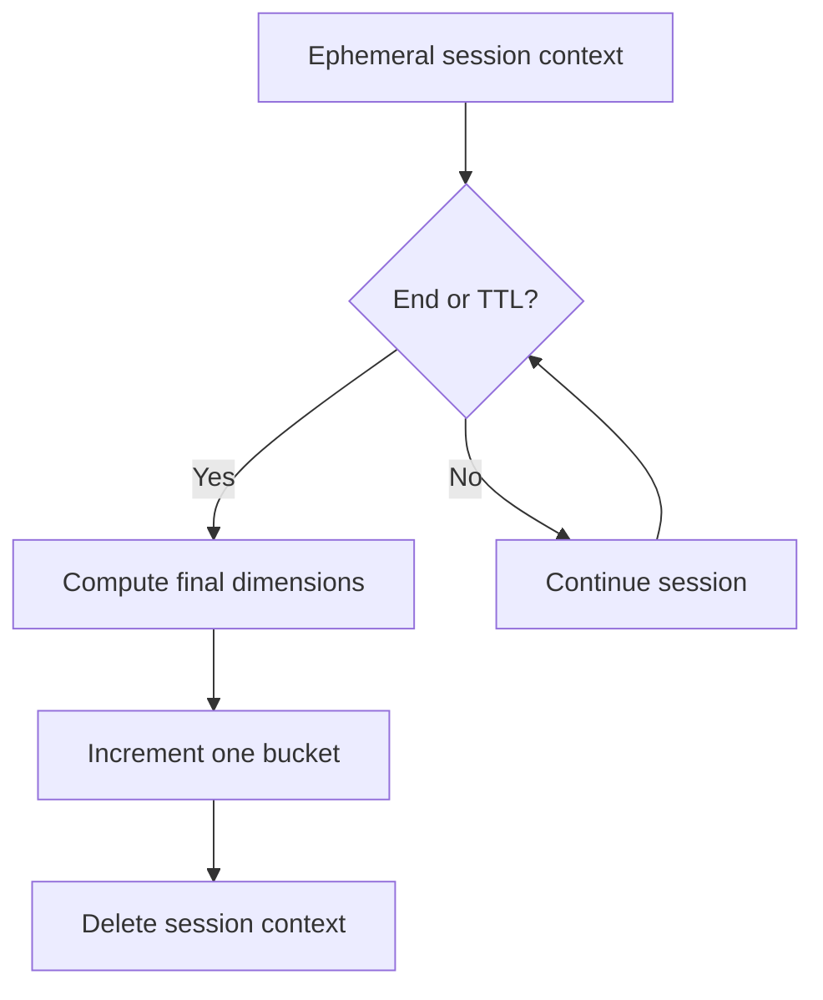
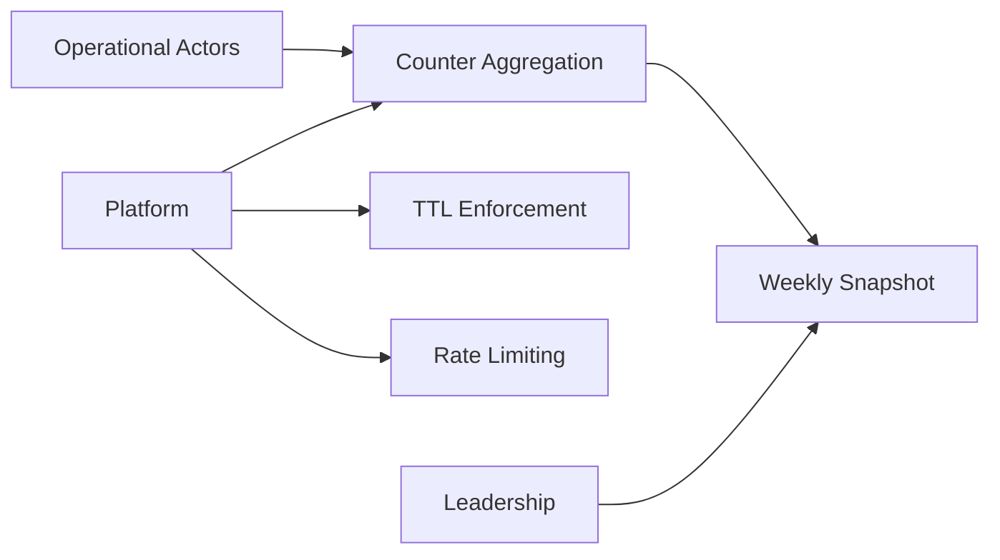

# Analytics Data Flow

<cite>
**Referenced Files in This Document**
- [DESIGN.md](file://.genie/brainstorms/plataforma-conversa-lead/DESIGN.md)
- [01-actors-and-roles.md](file://docs/sdd/01-actors-and-roles.md)
- [02-user-stories.md](file://docs/sdd/02-user-stories.md)
</cite>

## Table of Contents
1. Introduction
2. Project Structure
3. Core Components
4. Architecture Overview
5. Detailed Component Analysis
6. Dependency Analysis
7. Performance Considerations
8. Troubleshooting Guide
9. Conclusion
10. Appendices

## Introduction
This document explains the privacy-preserving analytics data flow in the Sup Better Engine. The system avoids individual session tracking and instead uses pre-aggregated counters. Each session emits a single terminal metric at completion or TTL expiration, incrementing a bucket counter across four categorical dimensions: origin, intent, email state, and session validity. A weekly snapshot archives scalar totals for trend analysis without creating event correlation. The design preserves statistical accuracy while maintaining user privacy by storing only aggregated counts and no per-session identifiers or timestamps.

## Project Structure
The analytics behavior is specified in the project’s design and supporting documents. There is no application code in this repository; the analytics model is defined as part of the platform scope and success criteria.

**Section sources**
- [DESIGN.md:127-165](file://.genie/brainstorms/plataforma-conversa-lead/DESIGN.md#L127-L165)
- [01-actors-and-roles.md:24-30](file://docs/sdd/01-actors-and-roles.md#L24-L30)
- [02-user-stories.md:87-107](file://docs/sdd/02-user-stories.md#L87-L107)

## Core Components
- Terminal emission: At session end or TTL expiry, the session emits one terminal update that increments a bucket counter. No per-session IDs or timestamps are persisted.
- Counter schema: Four categorical dimensions define buckets:
  - Origin (e.g., WhatsApp, site, unknown)
  - Intent (including undefined and none)
  - Email state (terminal state reached during the session)
  - Session validity (valid, excluded by rate limit, excluded by turn cap)
- Weekly snapshot: At week boundaries, a scalar total of valid sessions is archived to support trend analysis without correlating events.
- Operational edge counters: Separate scalars track blocked requests at the edge (by IP and day), outside the session bucket.

These components ensure that metrics remain accurate while avoiding re-introduction of individual tracking.

**Section sources**
- [DESIGN.md:127-165](file://.genie/brainstorms/plataforma-conversa-lead/DESIGN.md#L127-L165)
- [DESIGN.md:204-213](file://.genie/brainstorms/plataforma-conversa-lead/DESIGN.md#L204-L213)
- [DESIGN.md:397-398](file://.genie/brainstorms/plataforma-conversa-lead/DESIGN.md#L397-L398)

## Architecture Overview
The analytics pipeline is driven by the platform actor responsible for session lifecycle and aggregation. Sessions are ephemeral and discarded at TTL; their terminal emission updates the aggregated counter. Weekly snapshots capture scalar totals for trends.

**Diagram sources**
- [DESIGN.md:127-165](file://.genie/brainstorms/plataforma-conversa-lead/DESIGN.md#L127-L165)
- [DESIGN.md:204-213](file://.genie/brainstorms/plataforma-conversa-lead/DESIGN.md#L204-L213)
- [DESIGN.md:397-398](file://.genie/brainstorms/plataforma-conversa-lead/DESIGN.md#L397-L398)

**Section sources**
- [01-actors-and-roles.md:24-30](file://docs/sdd/01-actors-and-roles.md#L24-L30)
- [DESIGN.md:127-165](file://.genie/brainstorms/plataforma-conversa-lead/DESIGN.md#L127-L165)

## Detailed Component Analysis

### Terminal Emission Process
- Trigger points:
  - Explicit session completion
  - TTL expiration sweep
- Behavior:
  - One terminal emission per session
  - Increments exactly one bucket defined by the four dimensions
  - Does not store session ID or timestamp
- Dimensions:
  - Origin: includes an explicit “unknown” category when parameters are missing or unrecognized
  - Intent: includes undefined and none to distinguish engaged vs non-engaged visitors
  - Email state: monotonic terminal state capturing maximum achieved during the session
  - Session validity: separates abuse (rate limit) from high engagement (turn cap) exclusions

**Diagram sources**
- [DESIGN.md:127-165](file://.genie/brainstorms/plataforma-conversa-lead/DESIGN.md#L127-L165)
- [DESIGN.md:204-213](file://.genie/brainstorms/plataforma-conversa-lead/DESIGN.md#L204-L213)
- [DESIGN.md:397-398](file://.genie/brainstorms/plataforma-conversa-lead/DESIGN.md#L397-L398)

**Section sources**
- [DESIGN.md:127-165](file://.genie/brainstorms/plataforma-conversa-lead/DESIGN.md#L127-L165)
- [DESIGN.md:204-213](file://.genie/brainstorms/plataforma-conversa-lead/DESIGN.md#L204-L213)
- [DESIGN.md:397-398](file://.genie/brainstorms/plataforma-conversa-lead/DESIGN.md#L397-L398)

### Counter Schema Design and Bucket Management
- Cardinality:
  - 4 × 6 × 4 × 3 = 288 possible buckets
- Rules:
  - Origin must never silently default; unrecognized values map to “unknown”
  - Intent distinguishes “undefined” (typed but no label) from “none” (never typed)
  - Email state is monotonic and records the maximum achieved during the session
  - Session validity separates rate-limit exclusions from turn-cap exclusions
- Persistence:
  - Only the aggregated counter row is persisted
  - No per-session identifiers or timestamps are retained

**Diagram sources**
- [DESIGN.md:127-165](file://.genie/brainstorms/plataforma-conversa-lead/DESIGN.md#L127-L165)
- [DESIGN.md:204-213](file://.genie/brainstorms/plataforma-conversa-lead/DESIGN.md#L204-L213)

**Section sources**
- [DESIGN.md:127-165](file://.genie/brainstorms/plataforma-conversa-lead/DESIGN.md#L127-L165)
- [DESIGN.md:204-213](file://.genie/brainstorms/plataforma-conversa-lead/DESIGN.md#L204-L213)

### Weekly Snapshot System
- Purpose:
  - Archive a scalar total of valid sessions at week boundaries
  - Enable trend analysis (sessions per week) without correlating events
- Scope:
  - Stores only the scalar total; does not archive per-bucket cuts
  - Prevents accidental temporal granularity that would reintroduce correlation risk

**Diagram sources**
- [DESIGN.md:152-158](file://.genie/brainstorms/plataforma-conversa-lead/DESIGN.md#L152-L158)
- [DESIGN.md:415](file://.genie/brainstorms/plataforma-conversa-lead/DESIGN.md#L415)

**Section sources**
- [DESIGN.md:152-158](file://.genie/brainstorms/plataforma-conversa-lead/DESIGN.md#L152-L158)
- [DESIGN.md:415](file://.genie/brainstorms/plataforma-conversa-lead/DESIGN.md#L415)

### Privacy Preservation and Statistical Accuracy
- Privacy:
  - No per-session IDs or timestamps stored
  - Terminal emission is the only persistence beyond ephemeral session context
  - Edge blocks counted separately as scalars to avoid inflating session units
- Accuracy:
  - Monotonic email state ensures consistency between metrics and durable leads
  - Distinct exclusion categories prevent mixing abuse and high-engagement populations
  - Reconciliation rules validate relationships between counters and durable leads

**Diagram sources**
- [DESIGN.md:127-165](file://.genie/brainstorms/plataforma-conversa-lead/DESIGN.md#L127-L165)
- [DESIGN.md:204-213](file://.genie/brainstorms/plataforma-conversa-lead/DESIGN.md#L204-L213)
- [DESIGN.md:397-398](file://.genie/brainstorms/plataforma-conversa-lead/DESIGN.md#L397-L398)

**Section sources**
- [DESIGN.md:127-165](file://.genie/brainstorms/plataforma-conversa-lead/DESIGN.md#L127-L165)
- [DESIGN.md:204-213](file://.genie/brainstorms/plataforma-conversa-lead/DESIGN.md#L204-L213)
- [DESIGN.md:397-398](file://.genie/brainstorms/plataforma-conversa-lead/DESIGN.md#L397-L398)

## Dependency Analysis
- Platform responsibilities include session management, rate limiting, counter aggregation, TTL enforcement, and LGPD compliance. These responsibilities underpin the analytics flow.
- Operational actors consume aggregated counters and weekly snapshots for daily and leadership reporting.

**Diagram sources**
- [01-actors-and-roles.md:24-30](file://docs/sdd/01-actors-and-roles.md#L24-L30)
- [DESIGN.md:127-165](file://.genie/brainstorms/plataforma-conversa-lead/DESIGN.md#L127-L165)

**Section sources**
- [01-actors-and-roles.md:24-30](file://docs/sdd/01-actors-and-roles.md#L24-L30)
- [DESIGN.md:127-165](file://.genie/brainstorms/plataforma-conversa-lead/DESIGN.md#L127-L165)

## Performance Considerations
- Low cardinality buckets minimize storage and query cost.
- Terminal emissions reduce write volume compared to per-turn or per-event logging.
- Weekly scalars enable efficient trend queries without scanning large event logs.
- Separating edge-block scalars prevents artificial inflation of session-based metrics.

[No sources needed since this section provides general guidance]

## Troubleshooting Guide
- If counts diverge from durable leads:
  - Verify reconciliation rules: no lead exists without a corresponding “email sent and accepted” session; sum of such sessions should be greater than or equal to distinct leads due to deduplication and exclusions.
- If rates look biased:
  - Confirm that turn-cap exclusions are separated from rate-limit exclusions and not summed together.
  - Ensure “unknown” origin is used when parameters are missing or unrecognized.
- If weekly trends appear noisy:
  - Check that only scalar totals are archived at week boundaries and that per-bucket snapshots are not being stored.

**Section sources**
- [DESIGN.md:397-398](file://.genie/brainstorms/plataforma-conversa-lead/DESIGN.md#L397-L398)
- [DESIGN.md:152-158](file://.genie/brainstorms/plataforma-conversa-lead/DESIGN.md#L152-L158)

## Conclusion
The Sup Better Engine’s analytics system prioritizes privacy by retaining only pre-aggregated counters and weekly scalar snapshots. Terminal emissions at session end or TTL expiration increment buckets across four categorical dimensions, ensuring accurate measurement without individual tracking. The design balances operational visibility with strong privacy guarantees, enabling reliable reporting and trend analysis while minimizing data retention risks.

[No sources needed since this section summarizes without analyzing specific files]

## Appendices

### Examples of Counter Updates
- Example 1: A WhatsApp-sourced session with intent “qualification,” email state “sent and accepted,” and valid session increments the corresponding bucket by one.
- Example 2: A session that never typed anything (“intent = none”) and was excluded by the turn cap increments the bucket for “excluded by turn cap.”
- Example 3: A session with missing source parameter increments the bucket using “unknown” origin.

**Section sources**
- [DESIGN.md:127-165](file://.genie/brainstorms/plataforma-conversa-lead/DESIGN.md#L127-L165)
- [DESIGN.md:204-213](file://.genie/brainstorms/plataforma-conversa-lead/DESIGN.md#L204-L213)

### Examples of Snapshot Generation
- At week boundary, compute the total number of valid sessions since the previous snapshot and append the scalar to the weekly series. Do not archive per-bucket breakdowns.

**Section sources**
- [DESIGN.md:152-158](file://.genie/brainstorms/plataforma-conversa-lead/DESIGN.md#L152-L158)
- [DESIGN.md:415](file://.genie/brainstorms/plataforma-conversa-lead/DESIGN.md#L415)

### Reporting Queries
- Daily aggregated counters:
  - Sum counts grouped by each dimension to produce dashboards for operators.
- Weekly trends:
  - Query the weekly snapshot series to compute sessions per week and conversion rate trends.
- Reconciliation checks:
  - Validate directional relationships between counters and durable leads as specified in the success criteria.

**Section sources**
- [02-user-stories.md:87-107](file://docs/sdd/02-user-stories.md#L87-L107)
- [DESIGN.md:397-398](file://.genie/brainstorms/plataforma-conversa-lead/DESIGN.md#L397-L398)