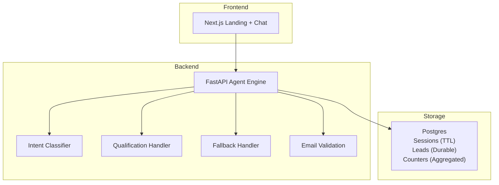
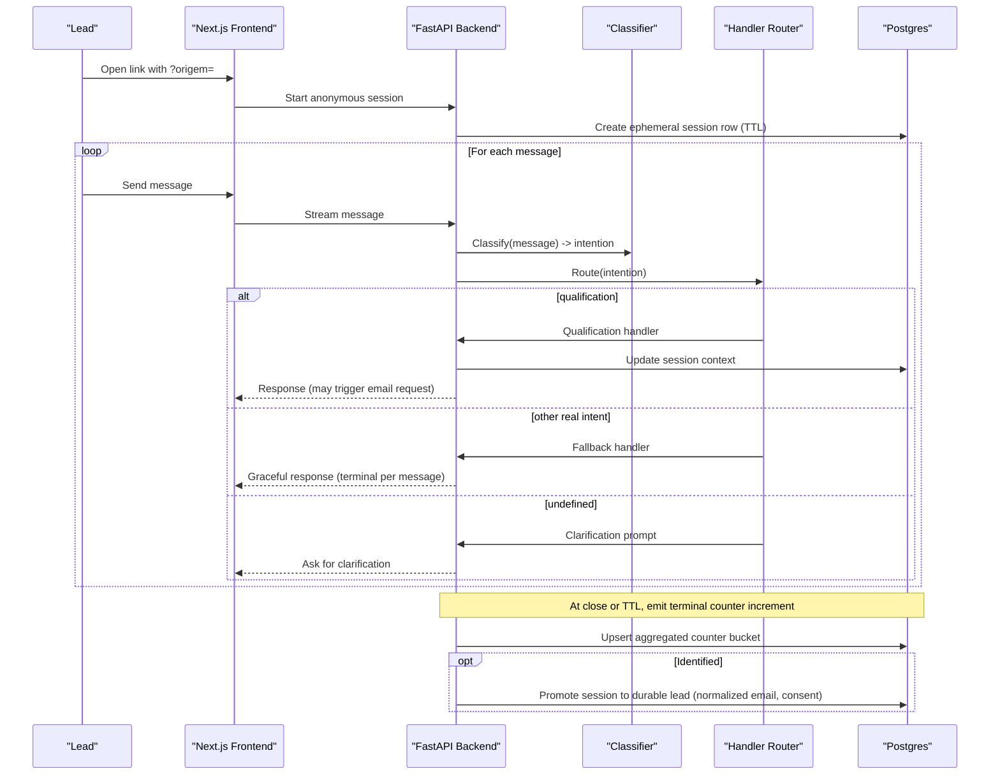
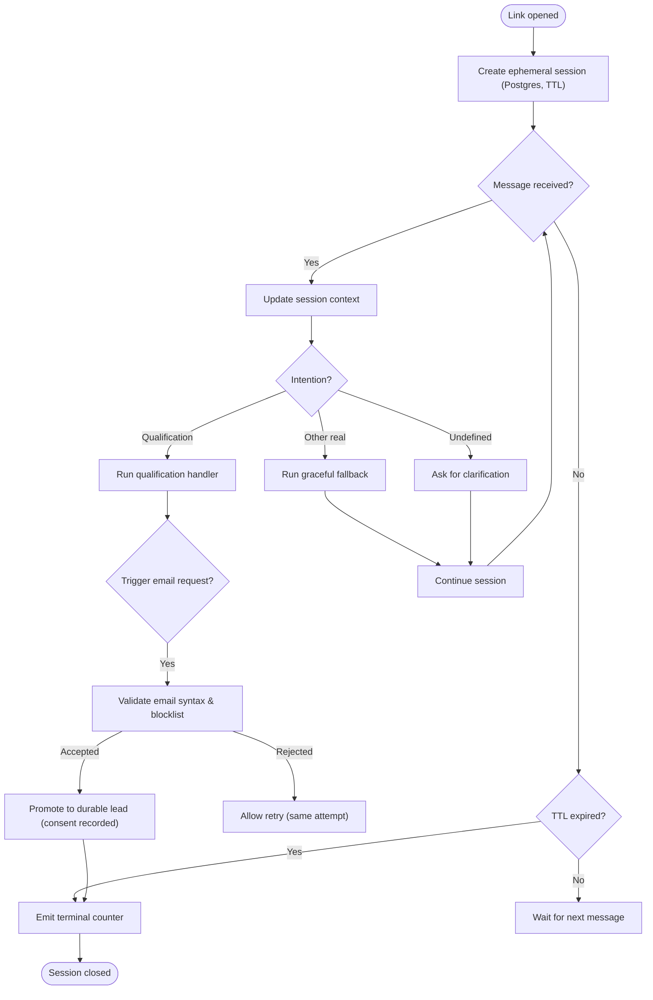
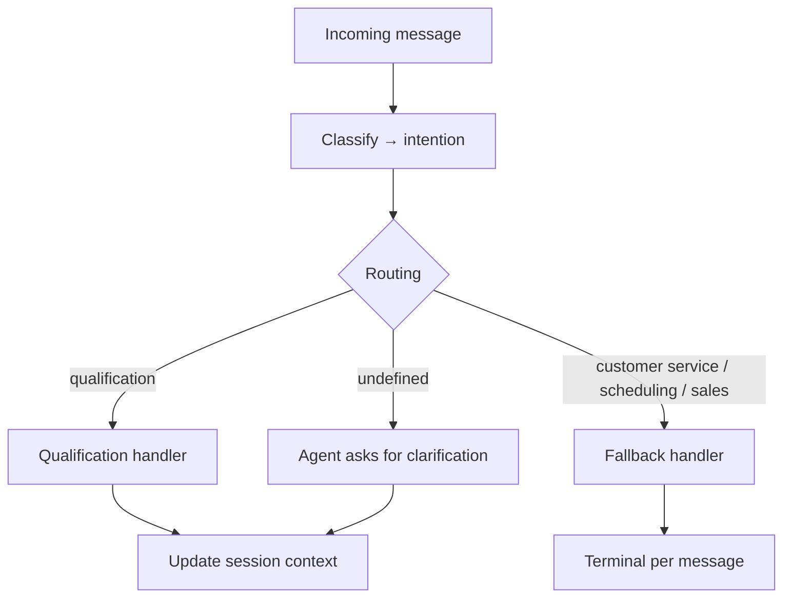
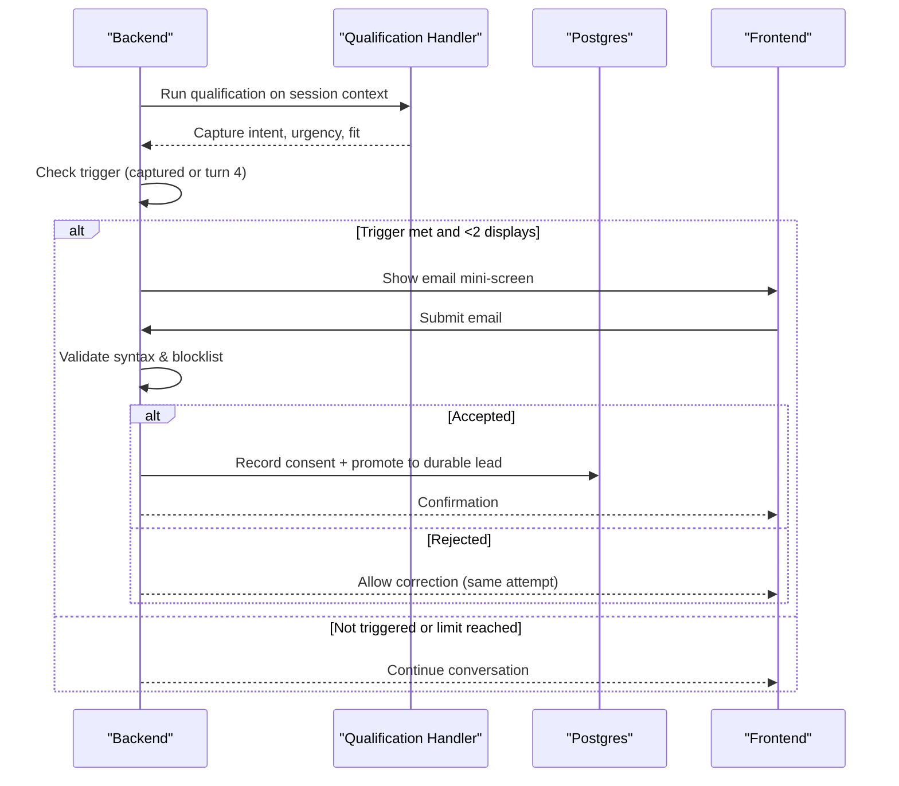
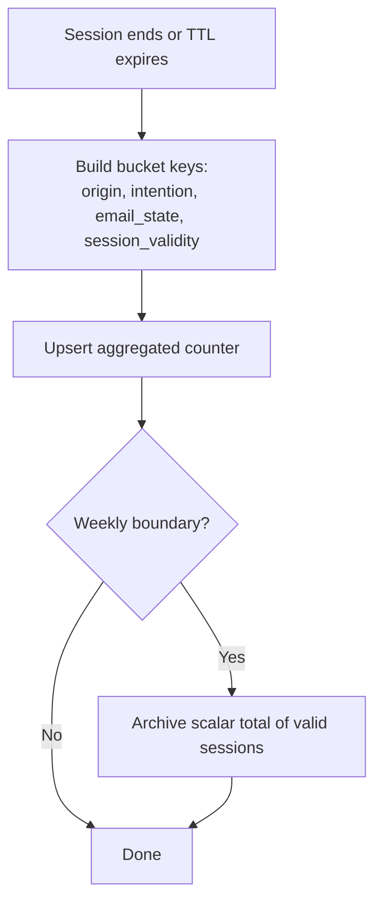
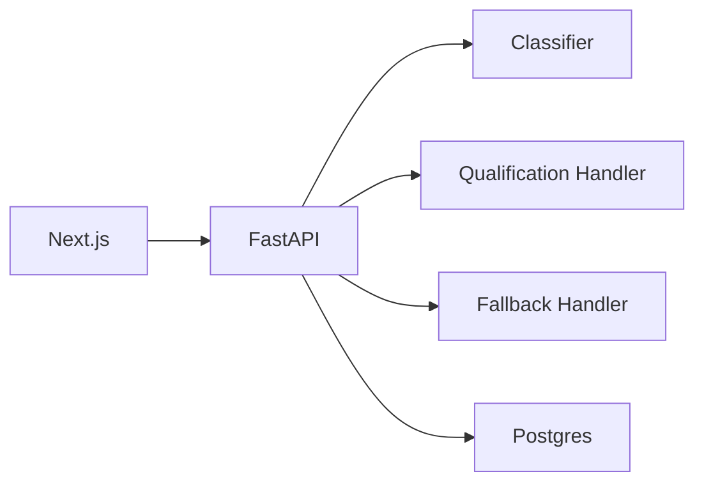

# Data Flow Architecture

<cite>
**Referenced Files in This Document**
- [README.md](file://README.md)
- [INDEX.md](file://.genie/INDEX.md)
- [DESIGN.md](file://.genie/brainstorms/plataforma-conversa-lead/DESIGN.md)
- [DRAFT.md](file://.genie/brainstorms/plataforma-conversa-lead/DRAFT.md)
</cite>

## Table of Contents
1. [Introduction](#introduction)
2. [Project Structure](#project-structure)
3. [Core Components](#core-components)
4. [Architecture Overview](#architecture-overview)
5. [Detailed Component Analysis](#detailed-component-analysis)
6. [Dependency Analysis](#dependency-analysis)
7. [Performance Considerations](#performance-considerations)
8. [Troubleshooting Guide](#troubleshooting-guide)
9. [Conclusion](#conclusion)

## Introduction
This document describes the data flow architecture for the Sup Better Engine’s first slice: a WhatsApp-driven lead conversation that moves through an anonymous chat, intent classification, qualification handling, and analytics tracking. It explains how sessions are created and maintained while anonymous, how conversation context is preserved across messages, how qualified leads are promoted to durable records, and how metrics are captured without retaining per-session identifiers. It also covers data transformation patterns, caching strategies, real-time synchronization mechanisms, data consistency, transaction management, and error recovery flows as defined by the design.

**Section sources**
- [README.md:1-8](file://README.md#L1-L8)
- [INDEX.md:1-12](file://.genie/INDEX.md#L1-L12)

## Project Structure
At this stage, the repository contains design artifacts that define the system’s data flow and operational constraints. The key documents outline:
- A Next.js frontend serving a landing page and streaming chat UI
- A Python backend (FastAPI) implementing the agent engine (classifier, handlers, email validation, lead promotion)
- Postgres as the single source of truth with ephemeral session rows and aggregated counters
- Analytics via pre-aggregated counters emitted at session end or TTL expiry

**Diagram sources**
- [DESIGN.md:190-203](file://.genie/brainstorms/plataforma-conversa-lead/DESIGN.md#L190-L203)

**Section sources**
- [DESIGN.md:190-203](file://.genie/brainstorms/plataforma-conversa-lead/DESIGN.md#L190-L203)

## Core Components
- Anonymous session lifecycle:
  - Created on link open; carries conversation context until identification or TTL expiry
  - Stored in Postgres with TTL; discarded after TTL if not identified
- Intent classifier:
  - Per-message routing decision emitting a single field: intention among {qualification, customer service, scheduling, sales, undefined}
  - Undefined is explicit abstention to avoid mislabeling greetings
- Routing and handlers:
  - Message-level routing re-evaluated each turn
  - Qualification handler captures intent, urgency, fit and triggers contextual email request
  - Fallback gracefully responds to non-qualification intents and is terminal per message but not per session
- Email validation and consent:
  - Syntax and disposable domain blocklist validation
  - Consent recorded only when email is sent; purpose limited to commercial follow-up about this conversation
- Lead promotion:
  - On accepted email submission, session promotes to a durable lead record deduplicated by normalized email
- Analytics counters:
  - Pre-aggregated buckets by origin, intention, email state, and session validity
  - Terminal emission once per session at close or TTL expiry; no per-session identifiers retained

**Section sources**
- [DESIGN.md:51-116](file://.genie/brainstorms/plataforma-conversa-lead/DESIGN.md#L51-L116)
- [DESIGN.md:127-166](file://.genie/brainstorms/plataforma-conversa-lead/DESIGN.md#L127-L166)
- [DESIGN.md:225-233](file://.genie/brainstorms/plataforma-conversa-lead/DESIGN.md#L225-L233)

## Architecture Overview
The pipeline processes each incoming message through classification and routing, preserves conversation context within the session, and emits analytics at session boundaries. Identification occurs mid-conversation under specific conditions, promoting the session to a durable lead upon consented email submission.

**Diagram sources**
- [DESIGN.md:51-116](file://.genie/brainstorms/plataforma-conversa-lead/DESIGN.md#L51-L116)
- [DESIGN.md:127-166](file://.genie/brainstorms/plataforma-conversa-lead/DESIGN.md#L127-L166)
- [DESIGN.md:190-203](file://.genie/brainstorms/plataforma-conversa-lead/DESIGN.md#L190-L203)

## Detailed Component Analysis

### Anonymous Session Management
- Creation and context:
  - Ephemeral session row in Postgres holds conversation context while anonymous
  - TTL governs lifecycle; un-identified sessions are discarded along with transcripts
- Promotion:
  - Upon consented email submission, session is promoted to a durable lead record
  - Deduplication uses normalized email (trim + lowercase)
- State transitions:
  - Session remains open across fallback responses; only closes at TTL or explicit termination

**Diagram sources**
- [DESIGN.md:51-116](file://.genie/brainstorms/plataforma-conversa-lead/DESIGN.md#L51-L116)
- [DESIGN.md:190-203](file://.genie/brainstorms/plataforma-conversa-lead/DESIGN.md#L190-L203)

**Section sources**
- [DESIGN.md:51-116](file://.genie/brainstorms/plataforma-conversa-lead/DESIGN.md#L51-L116)
- [DESIGN.md:190-203](file://.genie/brainstorms/plataforma-conversa-lead/DESIGN.md#L190-L203)

### Intent Classification and Routing
- Classifier contract:
  - Single output field: intention ∈ {qualification, customer service, scheduling, sales, undefined}
  - Undefined is explicit abstention to prevent mislabeling greetings
- Routing cadence:
  - Re-evaluated per message to handle conversation drift
  - Prevents misrouting requests that appear later in the conversation
- Aggregation cadence:
  - Session inherits the first non-undefined intention for counting purposes
  - Protects metrics from composed error rates across turns

**Diagram sources**
- [DESIGN.md:51-69](file://.genie/brainstorms/plataforma-conversa-lead/DESIGN.md#L51-L69)
- [DESIGN.md:225-233](file://.genie/brainstorms/plataforma-conversa-lead/DESIGN.md#L225-L233)

**Section sources**
- [DESIGN.md:51-69](file://.genie/brainstorms/plataforma-conversa-lead/DESIGN.md#L51-L69)
- [DESIGN.md:225-233](file://.genie/brainstorms/plataforma-conversa-lead/DESIGN.md#L225-L233)

### Qualification Handler and Email Request
- Trigger conditions:
  - After capturing intent, urgency, and fit, or by turn 4 if not converged earlier
  - Maximum two displays per session; retry on validation failure does not count as new display
- Email validation:
  - Syntax check plus public disposable domain blocklist
  - No confirmation code; sending is the act of consent
- Consent and purpose:
  - Purpose limited to commercial follow-up about this conversation
  - Marketing consent handled by separate future slice

**Diagram sources**
- [DESIGN.md:86-108](file://.genie/brainstorms/plataforma-conversa-lead/DESIGN.md#L86-L108)
- [DESIGN.md:215-223](file://.genie/brainstorms/plataforma-conversa-lead/DESIGN.md#L215-L223)

**Section sources**
- [DESIGN.md:86-108](file://.genie/brainstorms/plataforma-conversa-lead/DESIGN.md#L86-L108)
- [DESIGN.md:215-223](file://.genie/brainstorms/plataforma-conversa-lead/DESIGN.md#L215-L223)

### Analytics Counters and Terminal Emission
- Counter dimensions:
  - Origin (including unknown), intention (including none and undefined), email state (monotonic progression), session validity (valid, rate-limited, cap-exceeded)
- Emission policy:
  - One terminal emission per session at close or TTL expiry
  - Increments pre-aggregated bucket; no per-session identifiers stored
- Weekly snapshot:
  - Scalar total of valid sessions archived weekly; differences yield sessions per week

**Diagram sources**
- [DESIGN.md:127-166](file://.genie/brainstorms/plataforma-conversa-lead/DESIGN.md#L127-L166)

**Section sources**
- [DESIGN.md:127-166](file://.genie/brainstorms/plataforma-conversa-lead/DESIGN.md#L127-L166)

### Data Transformation Patterns
- Normalization:
  - Email normalized (trim + lowercase) for deduplication
- Monotonic state:
  - Email state progresses monotonically to avoid impossible combinations
- Bucketing:
  - Low-cardinality categorical dimensions form fixed-size buckets for counters

**Section sources**
- [DESIGN.md:127-166](file://.genie/brainstorms/plataforma-conversa-lead/DESIGN.md#L127-L166)
- [DESIGN.md:215-223](file://.genie/brainstorms/plataforma-conversa-lead/DESIGN.md#L215-L223)

### Caching Strategies
- No Redis for ephemeral sessions in this slice; sessions live in Postgres with TTL
- Counters are pre-aggregated; no per-session event stream cached

**Section sources**
- [DESIGN.md:190-203](file://.genie/brainstorms/plataforma-conversa-lead/DESIGN.md#L190-L203)
- [DESIGN.md:204-213](file://.genie/brainstorms/plataforma-conversa-lead/DESIGN.md#L204-L213)

### Real-Time Data Synchronization
- Streaming chat UI provided by Next.js; backend handles agent logic
- No bidirectional sync with WhatsApp in this slice; WhatsApp acts as entry point delivering a static link

**Section sources**
- [DESIGN.md:190-203](file://.genie/brainstorms/plataforma-conversa-lead/DESIGN.md#L190-L203)
- [DESIGN.md:345-346](file://.genie/brainstorms/plataforma-conversa-lead/DESIGN.md#L345-L346)

### Data Consistency, Transaction Management, and Error Recovery
- Consistency:
  - Postgres as single source of truth ensures atomic upserts for counters and durable leads
  - Monotonic email state prevents inconsistent states
- Transactions:
  - Session updates and promotions use database transactions to maintain integrity
- Error recovery:
  - Rate limiting and message caps protect endpoints; excluded sessions are accounted separately
  - Fallback is terminal per message but not per session, preserving ongoing qualification paths
  - TTL-based cleanup ensures no PII persists beyond retention limits

**Section sources**
- [DESIGN.md:127-166](file://.genie/brainstorms/plataforma-conversa-lead/DESIGN.md#L127-L166)
- [DESIGN.md:215-223](file://.genie/brainstorms/plataforma-conversa-lead/DESIGN.md#L215-L223)
- [DESIGN.md:398-416](file://.genie/brainstorms/plataforma-conversa-lead/DESIGN.md#L398-L416)

## Dependency Analysis
The system exhibits clear layering and separation of concerns:
- Frontend depends on backend APIs for chat streaming and identification screens
- Backend orchestrates classifier, handlers, and storage
- Storage encapsulates ephemeral sessions, durable leads, and aggregated counters

**Diagram sources**
- [DESIGN.md:190-203](file://.genie/brainstorms/plataforma-conversa-lead/DESIGN.md#L190-L203)

**Section sources**
- [DESIGN.md:190-203](file://.genie/brainstorms/plataforma-conversa-lead/DESIGN.md#L190-L203)

## Performance Considerations
- Rate limiting and per-session message caps protect LLM endpoints and control costs
- Pre-aggregated counters reduce write amplification and simplify reporting
- TTL-based session cleanup avoids long-lived state accumulation
- Minimal infrastructure (no Redis) reduces operational overhead for pilot scale

[No sources needed since this section provides general guidance]

## Troubleshooting Guide
Common issues and mitigations:
- Misclassification leading to fallback:
  - Monitor fallback rate as a signal of classifier drift; enforce classifier validation thresholds
- Excessive traffic or abuse:
  - Enforce IP rate limits and per-session caps; track exclusions separately for auditability
- Email validation failures:
  - Block disposable domains; allow correction without counting as new display
- TTL expirations:
  - Ensure terminal emissions occur even for abandoned sessions to preserve denominators

**Section sources**
- [DESIGN.md:398-416](file://.genie/brainstorms/plataforma-conversa-lead/DESIGN.md#L398-L416)

## Conclusion
The Sup Better Engine’s first slice implements a focused, privacy-preserving data flow: anonymous sessions capture conversation context, intent classification routes interactions appropriately, qualification drives contextual identification, and analytics are captured via pre-aggregated counters without retaining per-session identifiers. The design balances simplicity, compliance, and measurability, providing a solid foundation for future enhancements such as richer interaction modes, identity resolution, and multi-tenant support.

[No sources needed since this section summarizes without analyzing specific files]