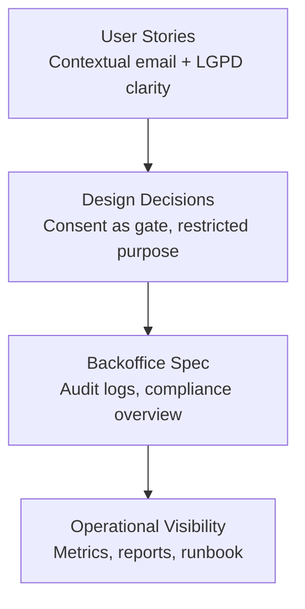
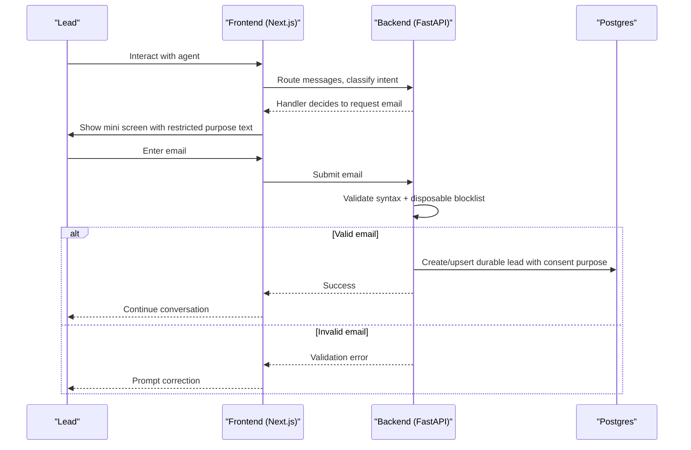
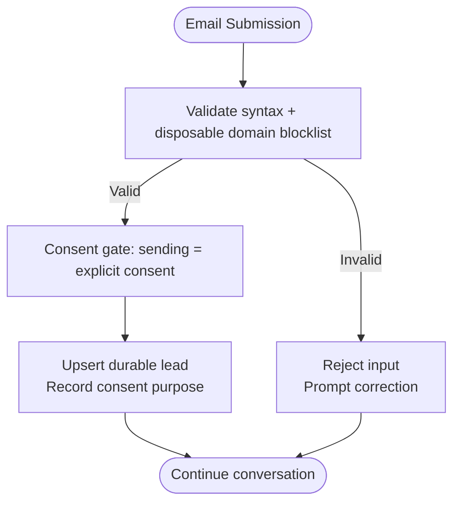
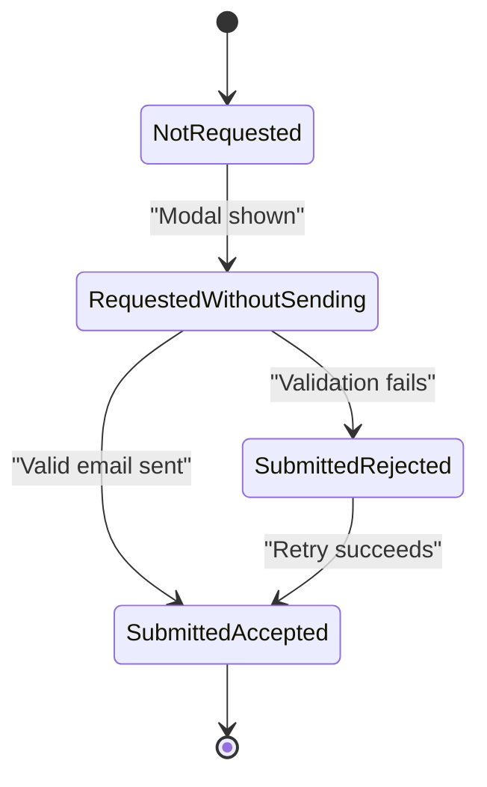
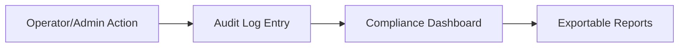
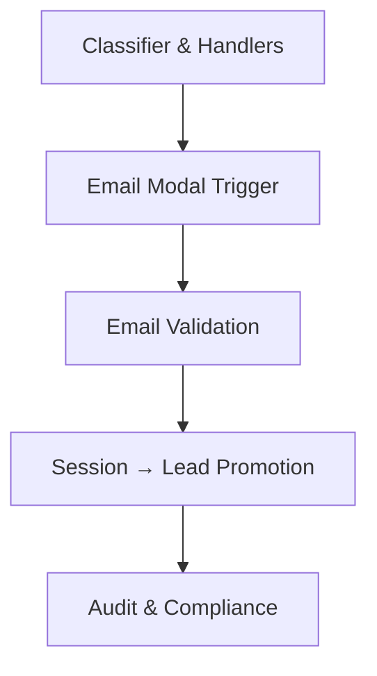

# Consent Management

<cite>
**Referenced Files in This Document**
- [DESIGN.md](file://.genie/brainstorms/plataforma-conversa-lead/DESIGN.md)
- [02-user-stories.md](file://docs/sdd/02-user-stories.md)
- [03-functional-spec-backoffice.md](file://docs/sdd/03-functional-spec-backoffice.md)
</cite>

## Table of Contents
1. Introduction
2. Project Structure
3. Core Components
4. Architecture Overview
5. Detailed Component Analysis
6. Dependency Analysis
7. Performance Considerations
8. Troubleshooting Guide
9. Conclusion

## Introduction
This document explains the consent management system implemented in the Sup Better Engine’s first feature slice. It focuses on an LGPD-compliant flow where sending an email is the affirmative act of consent, with a restricted purpose limited to commercial team follow-up about the specific conversation. The design intentionally avoids separate checkbox states and separates service consent from marketing consent. It also documents the audit trail around consent acceptance and lead creation, the manual access/exclusion runbook for data subject rights under LGPD Article 18, UI patterns for consent, compliance documentation requirements, and how consent state relates to lead durability. Finally, it explains why consent is the gateway to email submission rather than a separate step.

## Project Structure
The consent-related behavior is defined across design decisions, user stories, and backoffice specifications:
- Design decisions define the consent model, purpose restriction, and relationship between session and lead.
- User stories capture end-user expectations around contextual email collection and understanding data usage.
- Backoffice specification defines audit logging, compliance metrics, and operational visibility into consent and data subject requests.

**Section sources**
- [02-user-stories.md:28-54](file://docs/sdd/02-user-stories.md#L28-L54)
- [DESIGN.md:103-113](file://.genie/brainstorms/plataforma-conversa-lead/DESIGN.md#L103-L113)
- [03-functional-spec-backoffice.md:245-280](file://docs/sdd/03-functional-spec-backoffice.md#L245-L280)

## Core Components
- Consent-as-gate: Sending the email is the explicit consent act; no separate “consent accepted” state exists. If the user does not send, there is no consent.
- Restricted purpose: Consent covers only the tenant’s commercial team returning about this conversation. Marketing consent is collected elsewhere (out of scope for this slice).
- Session-to-lead promotion: On successful email submission, the ephemeral session is promoted to a durable lead record with consent purpose recorded.
- Monotonic email state: A single field tracks terminal progression per session, ensuring consistency between metrics and persisted leads.
- Audit trail: Administrative actions are logged; consent acceptance is tied to lead creation, enabling traceability.
- Data subject rights: A documented manual runbook fulfills LGPD Article 18 requests for access or deletion, with named ownership and SLA adherence.

**Section sources**
- [DESIGN.md:103-113](file://.genie/brainstorms/plataforma-conversa-lead/DESIGN.md#L103-L113)
- [DESIGN.md:227-235](file://.genie/brainstorms/plataforma-conversa-lead/DESIGN.md#L227-L235)
- [03-functional-spec-backoffice.md:263-280](file://docs/sdd/03-functional-spec-backoffice.md#L263-L280)

## Architecture Overview
The consent flow integrates frontend modal, backend validation, and persistence:

**Diagram sources**
- [DESIGN.md:103-113](file://.genie/brainstorms/plataforma-conversa-lead/DESIGN.md#L103-L113)
- [DESIGN.md:203-214](file://.genie/brainstorms/plataforma-conversa-lead/DESIGN.md#L203-L214)
- [02-user-stories.md:28-45](file://docs/sdd/02-user-stories.md#L28-L45)

## Detailed Component Analysis

### Consent Model and Purpose Restriction
- Consent is captured by the affirmative act of sending the email, not by a checkbox. The UI displays the restricted purpose next to the submit button.
- Purpose is narrowly scoped to commercial follow-up about this conversation. Marketing consent is explicitly out of scope for this slice and belongs to the marketing-dispatching slice.
- No “email provided but consent refused” state exists; refusal is modeled as not sending.

**Diagram sources**
- [DESIGN.md:103-113](file://.genie/brainstorms/plataforma-conversa-lead/DESIGN.md#L103-L113)
- [DESIGN.md:227-235](file://.genie/brainstorms/plataforma-conversa-lead/DESIGN.md#L227-L235)

**Section sources**
- [DESIGN.md:103-113](file://.genie/brainstorms/plataforma-conversa-lead/DESIGN.md#L103-L113)
- [DESIGN.md:227-235](file://.genie/brainstorms/plataforma-conversa-lead/DESIGN.md#L227-L235)
- [02-user-stories.md:38-45](file://docs/sdd/02-user-stories.md#L38-L45)

### Email State Machine and Lead Durability
- The session carries a monotonic email state that progresses through terminal values. The maximum achieved value per session is recorded, preventing impossible combinations and aligning metrics with persisted leads.
- When the state reaches “accepted,” a durable lead exists; otherwise, the session remains ephemeral until TTL expiry.

**Diagram sources**
- [DESIGN.md:227-235](file://.genie/brainstorms/plataforma-conversa-lead/DESIGN.md#L227-L235)

**Section sources**
- [DESIGN.md:227-235](file://.genie/brainstorms/plataforma-conversa-lead/DESIGN.md#L227-L235)

### Audit Trail and Compliance Visibility
- Administrative actions are logged with actor, timestamp, and relevant context.
- The backoffice provides compliance metrics including total leads with recorded consent, consent purpose breakdown, data deletion requests, retention compliance, and SLA adherence for Article 18 requests.
- Audit logs are immutable, append-only, and retained for a defined period.

**Diagram sources**
- [03-functional-spec-backoffice.md:263-280](file://docs/sdd/03-functional-spec-backoffice.md#L263-L280)
- [03-functional-spec-backoffice.md:245-260](file://docs/sdd/03-functional-spec-backoffice.md#L245-L260)

**Section sources**
- [03-functional-spec-backoffice.md:263-280](file://docs/sdd/03-functional-spec-backoffice.md#L263-L280)
- [03-functional-spec-backoffice.md:245-260](file://docs/sdd/03-functional-spec-backoffice.md#L245-L260)

### Data Subject Rights Runbook (LGPD Article 18)
- A documented manual process exists for access and deletion requests, with a named owner and response within mandated timeframes.
- The runbook is operational for the pilot tenant and is exercised before pilot closure.

**Section sources**
- [DESIGN.md:111-113](file://.genie/brainstorms/plataforma-conversa-lead/DESIGN.md#L111-L113)
- [02-user-stories.md:47-54](file://docs/sdd/02-user-stories.md#L47-L54)

### Consent UI Patterns
- Mini screen appears after capturing intent/urgency/fit or at turn 4, whichever comes first, with a maximum of two displays per session.
- The modal clearly states the restricted purpose and validates email syntax plus disposable domain blocklist.
- Sending the email is the consent act; no separate checkbox is used.

**Section sources**
- [02-user-stories.md:28-45](file://docs/sdd/02-user-stories.md#L28-L45)
- [DESIGN.md:88-108](file://.genie/brainstorms/plataforma-conversa-lead/DESIGN.md#L88-L108)

### Relationship Between Consent State and Lead Durability
- A durable lead is created only upon successful email submission, which serves as explicit consent.
- The monotonic email state ensures that “accepted” corresponds exactly to the existence of a durable lead, even with retries or prior rejections.

**Section sources**
- [DESIGN.md:103-113](file://.genie/brainstorms/plataforma-conversa-lead/DESIGN.md#L103-L113)
- [DESIGN.md:227-235](file://.genie/brainstorms/plataforma-conversa-lead/DESIGN.md#L227-L235)

### Separation of Service Consent and Marketing Consent
- Service consent is limited to commercial follow-up about this conversation.
- Marketing consent is deliberately collected in the slice responsible for marketing dispatch, preserving granularity required by LGPD Article 8 §§3–4.

**Section sources**
- [DESIGN.md:103-113](file://.genie/brainstorms/plataforma-conversa-lead/DESIGN.md#L103-L113)
- [DESIGN.md:367-369](file://.genie/brainstorms/plataforma-conversa-lead/DESIGN.md#L367-L369)

## Dependency Analysis
Consent depends on several subsystems and constraints:
- Intent classification and handler routing determine when the email modal is triggered.
- Email validation prevents invalid or disposable addresses from creating leads.
- Persistence layer promotes ephemeral sessions to durable leads only upon valid submission.
- Backoffice audit and compliance features depend on accurate consent recording and lead creation.

**Diagram sources**
- [DESIGN.md:88-113](file://.genie/brainstorms/plataforma-conversa-lead/DESIGN.md#L88-L113)
- [03-functional-spec-backoffice.md:245-280](file://docs/sdd/03-functional-spec-backoffice.md#L245-L280)

**Section sources**
- [DESIGN.md:88-113](file://.genie/brainstorms/plataforma-conversa-lead/DESIGN.md#L88-L113)
- [03-functional-spec-backoffice.md:245-280](file://docs/sdd/03-functional-spec-backoffice.md#L245-L280)

## Performance Considerations
- Consent-as-gate reduces UI friction and eliminates divergent states that could complicate metrics and persistence.
- Monotonic email state simplifies reconciliation between session counters and durable leads.
- Minimal persistence surface: only validated submissions create durable records, reducing storage and audit overhead.

[No sources needed since this section provides general guidance]

## Troubleshooting Guide
Common issues and resolutions:
- Email validation failures: Ensure syntax is correct and domain is not on the disposable blocklist. The UI prompts correction without counting as a new consent attempt.
- Inconsistent metrics vs. leads: Verify the monotonic email state logic; “accepted” must correspond to a durable lead, and retries should advance the state appropriately.
- Missing consent records: Confirm that the restricted purpose text is displayed next to the submit button and that sending the email triggers lead creation.
- Data subject requests: Use the documented runbook to fulfill access or deletion requests, track SLA adherence, and log actions in the audit trail.

**Section sources**
- [02-user-stories.md:28-45](file://docs/sdd/02-user-stories.md#L28-L45)
- [DESIGN.md:227-235](file://.genie/brainstorms/plataforma-conversa-lead/DESIGN.md#L227-L235)
- [03-functional-spec-backoffice.md:245-280](file://docs/sdd/03-functional-spec-backoffice.md#L245-L280)

## Conclusion
The consent management system implements a streamlined, LGPD-compliant approach: consent is captured by sending the email, with a narrow purpose limited to commercial follow-up about the conversation. This design avoids separate consent checkboxes, separates service consent from marketing consent, and ties consent directly to durable lead creation. An audit trail and compliance dashboard provide operational visibility, while a documented runbook supports data subject rights under LGPD Article 18. The result is a clear, auditable, and user-friendly consent flow that aligns with regulatory requirements and product goals.

[No sources needed since this section summarizes without analyzing specific files]