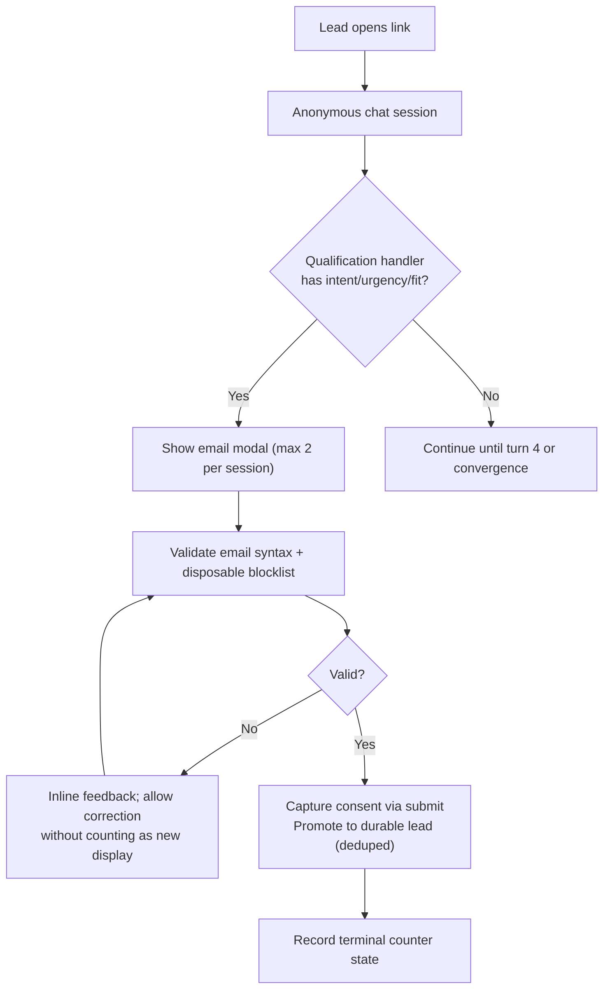
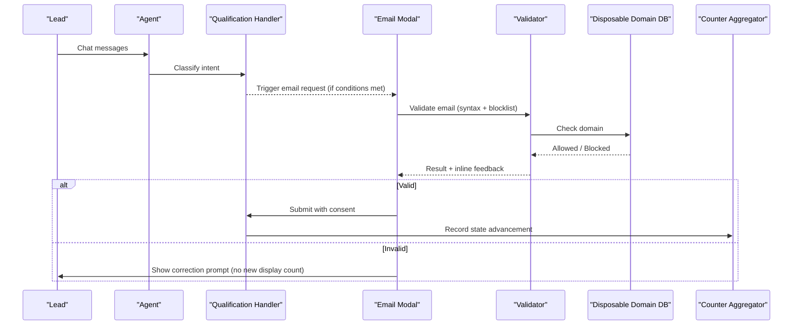
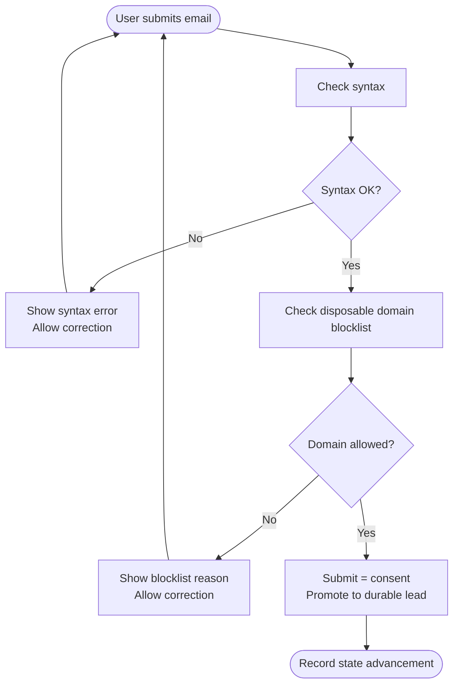
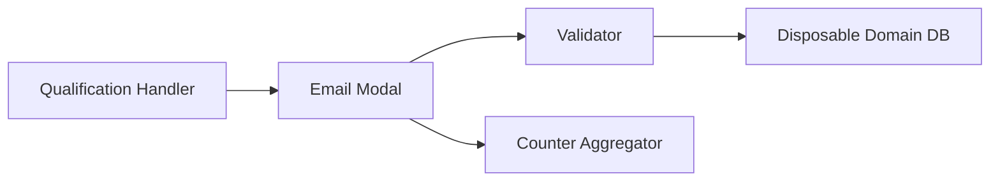

# Email Collection & Validation

<cite>
**Referenced Files in This Document**
- [DESIGN.md](file://.genie/brainstorms/plataforma-conversa-lead/DESIGN.md)
- [02-user-stories.md](file://docs/sdd/02-user-stories.md)
</cite>

## Table of Contents
1. Introduction
2. Project Structure
3. Core Components
4. Architecture Overview
5. Detailed Component Analysis
6. Dependency Analysis
7. Performance Considerations
8. Troubleshooting Guide
9. Conclusion

## Introduction
This document explains the email collection and validation system used by the Sup Better Engine during lead qualification conversations. It covers:
- Syntax validation for email format correctness
- Disposable domain blocklist to prevent temporary emails
- Validation feedback that allows correction without counting as a new attempt
- Handling of rejected versus successful submissions
- Integration with public disposable domain databases
- Error handling for various validation failures
- User experience flow for correcting invalid emails
- Examples of valid and invalid scenarios and blocklist behavior
- The technical implementation of validation rules
- The design decision to skip email confirmation codes to preserve conversation flow while protecting data quality

## Project Structure
The email collection and validation behavior is defined in the project’s design and user stories, which specify when the email modal appears, what validations are applied, how consent is captured, and how outcomes are recorded in counters.

**Diagram sources**
- [DESIGN.md:86-108](file://.genie/brainstorms/plataforma-conversa-lead/DESIGN.md#L86-L108)
- [DESIGN.md:142-147](file://.genie/brainstorms/plataforma-conversa-lead/DESIGN.md#L142-L147)
- [DESIGN.md:386-398](file://.genie/brainstorms/plataforma-conversa-lead/DESIGN.md#L386-L398)

**Section sources**
- [DESIGN.md:86-108](file://.genie/brainstorms/plataforma-conversa-lead/DESIGN.md#L86-L108)
- [02-user-stories.md:28-45](file://docs/sdd/02-user-stories.md#L28-L45)

## Core Components
- Email modal trigger:
  - Triggered by the qualification handler once it captures intent, urgency, and fit, or at turn 4 if not earlier.
  - Displayed at most twice per session; re-opening after a validation refusal does not count as a new display.
- Validation pipeline:
  - Syntax check on the provided email.
  - Disposable domain blocklist check against a public database.
  - Consent capture upon submission (sending the email equals explicit consent for commercial return about this conversation).
- Outcome recording:
  - Successful submission promotes the session to a durable lead, deduplicated by normalized email (trim + lowercase).
  - Session-level email state advances monotonically to reflect maximum achieved outcome.

**Section sources**
- [DESIGN.md:86-108](file://.genie/brainstorms/plataforma-conversa-lead/DESIGN.md#L86-L108)
- [DESIGN.md:142-147](file://.genie/brainstorms/plataforma-conversa-lead/DESIGN.md#L142-L147)
- [DESIGN.md:354-358](file://.genie/brainstorms/plataforma-conversa-lead/DESIGN.md#L354-L358)
- [02-user-stories.md:28-45](file://docs/sdd/02-user-stories.md#L28-L45)

## Architecture Overview
The email collection integrates into the conversation flow and feeds both user experience and analytics:

**Diagram sources**
- [DESIGN.md:86-108](file://.genie/brainstorms/plataforma-conversa-lead/DESIGN.md#L86-L108)
- [DESIGN.md:142-147](file://.genie/brainstorms/plataforma-conversa-lead/DESIGN.md#L142-L147)
- [DESIGN.md:386-398](file://.genie/brainstorms/plataforma-conversa-lead/DESIGN.md#L386-L398)

## Detailed Component Analysis

### Email Modal Trigger and Display Limits
- Trigger condition:
  - After the qualification handler captures intent, urgency, and fit, or at turn 4 if not earlier.
- Display limit:
  - Maximum two displays per session.
  - Reopening due to validation refusal does not count as a new display; it is treated as the same attempt.

**Section sources**
- [DESIGN.md:86-98](file://.genie/brainstorms/plataforma-conversa-lead/DESIGN.md#L86-L98)
- [02-user-stories.md:28-36](file://docs/sdd/02-user-stories.md#L28-L36)

### Validation Rules and Feedback Loop
- Syntax validation:
  - Rejects malformed email formats.
- Disposable domain blocklist:
  - Checks the email domain against a public disposable domain database.
  - Blocks known temporary domains to protect data quality.
- Feedback mechanism:
  - On rejection, the modal provides inline feedback and allows immediate correction.
  - Correction attempts do not increment the display counter; they continue the same attempt.
- Consent capture:
  - Submitting a valid email is the act of consent for the stated purpose (commercial return about this conversation).
  - No separate checkbox; marketing consent is out of scope for this slice.

**Diagram sources**
- [DESIGN.md:99-108](file://.genie/brainstorms/plataforma-conversa-lead/DESIGN.md#L99-L108)
- [DESIGN.md:354-358](file://.genie/brainstorms/plataforma-conversa-lead/DESIGN.md#L354-L358)

**Section sources**
- [DESIGN.md:99-108](file://.genie/brainstorms/plataforma-conversa-lead/DESIGN.md#L99-L108)
- [DESIGN.md:354-358](file://.genie/brainstorms/plataforma-conversa-lead/DESIGN.md#L354-L358)

### Rejected vs Successful Submissions
- Rejected:
  - Invalid syntax or blocked domain results in inline feedback and correction opportunity.
  - If all attempts fail, the session records an email state indicating no accepted submission.
- Successful:
  - A valid email with consent promotes the session to a durable lead.
  - Leads are deduplicated by normalized email (trim + lowercase).
  - The session’s email state advances to reflect acceptance.

**Section sources**
- [DESIGN.md:142-147](file://.genie/brainstorms/plataforma-conversa-lead/DESIGN.md#L142-L147)
- [DESIGN.md:395-397](file://.genie/brainstorms/plataforma-conversa-lead/DESIGN.md#L395-L397)

### Integration with Public Disposable Domain Databases
- The system consults a public disposable domain database to block temporary email providers.
- This integration protects the lead base from obvious low-quality inputs without adding friction.

**Section sources**
- [DESIGN.md:99-100](file://.genie/brainstorms/plataforma-conversa-lead/DESIGN.md#L99-L100)

### Error Handling for Validation Failures
- Syntax errors:
  - Inline message guiding the user to correct formatting.
- Blocklist violations:
  - Inline message explaining that the domain is not accepted and prompting a different address.
- Both cases:
  - Allow immediate correction within the same modal instance.
  - Do not count as additional displays.

**Section sources**
- [DESIGN.md:95-100](file://.genie/brainstorms/plataforma-conversa-lead/DESIGN.md#L95-L100)

### User Experience Flow for Email Correction
- The modal remains open after a rejection to enable quick correction.
- The display counter is not incremented on correction; only distinct modal openings count toward the two-display cap.
- Once corrected and submitted, consent is captured and the lead is promoted.

**Section sources**
- [DESIGN.md:95-98](file://.genie/brainstorms/plataforma-conversa-lead/DESIGN.md#L95-L98)
- [DESIGN.md:101-108](file://.genie/brainstorms/plataforma-conversa-lead/DESIGN.md#L101-L108)

### Examples of Valid and Invalid Scenarios
- Valid:
  - Standard corporate or personal email addresses with proper syntax and non-blocklisted domains.
- Invalid:
  - Missing “@”, missing domain, or malformed structure fails syntax checks.
  - Known temporary/disposable domains fail blocklist checks.
- Blocklist behavior:
  - Any domain present in the public disposable list is rejected regardless of syntax.

[No sources needed since this section provides general examples derived from the documented rules]

### Technical Implementation Notes
- Normalization:
  - Emails are normalized by trimming whitespace and lowercasing before storage and deduplication.
- Consent model:
  - Submission equals consent for the stated purpose; marketing consent is handled elsewhere.
- Confirmation code:
  - Deliberately skipped to maintain conversation flow and avoid breaking metrics under test.

**Section sources**
- [DESIGN.md:107-108](file://.genie/brainstorms/plataforma-conversa-lead/DESIGN.md#L107-L108)
- [DESIGN.md:101-106](file://.genie/brainstorms/plataforma-conversa-lead/DESIGN.md#L101-L106)
- [DESIGN.md:354-355](file://.genie/brainstorms/plataforma-conversa-lead/DESIGN.md#L354-L355)

## Dependency Analysis
The email validation depends on:
- Qualification handler to determine when to request email
- Validator component for syntax and blocklist checks
- Public disposable domain database for blocklist lookups
- Counter aggregator to record session-level email states

**Diagram sources**
- [DESIGN.md:86-108](file://.genie/brainstorms/plataforma-conversa-lead/DESIGN.md#L86-L108)
- [DESIGN.md:142-147](file://.genie/brainstorms/plataforma-conversa-lead/DESIGN.md#L142-L147)

**Section sources**
- [DESIGN.md:86-108](file://.genie/brainstorms/plataforma-conversa-lead/DESIGN.md#L86-L108)
- [DESIGN.md:142-147](file://.genie/brainstorms/plataforma-conversa-lead/DESIGN.md#L142-L147)

## Performance Considerations
- Minimal friction:
  - Inline feedback avoids page reloads and keeps users in-context.
- Low overhead:
  - Blocklist checks are lightweight domain lookups.
- Metrics integrity:
  - Skipping confirmation codes preserves conversion rates and session continuity during the pilot window.

[No sources needed since this section provides general guidance]

## Troubleshooting Guide
Common issues and resolutions:
- Syntax errors:
  - Ensure proper email format (local-part@domain.tld).
  - Correct typos and resubmit within the same modal.
- Blocklist rejections:
  - Use a permanent, non-disposable email provider.
  - Avoid known temporary email services.
- Display cap reached:
  - If the modal has been shown twice without success, guide the user to try again later or provide alternative contact options.

**Section sources**
- [DESIGN.md:95-100](file://.genie/brainstorms/plataforma-conversa-lead/DESIGN.md#L95-L100)
- [DESIGN.md:395-396](file://.genie/brainstorms/plataforma-conversa-lead/DESIGN.md#L395-L396)

## Conclusion
The email collection and validation system balances data quality with user experience:
- Syntax and disposable domain checks filter out low-quality inputs.
- Inline feedback enables rapid correction without penalizing display counts.
- Consent is captured through submission, aligning with compliance requirements.
- Skipping confirmation codes maintains conversation flow and preserves metrics during the pilot phase.
- Outcomes are recorded in monotonic session states to ensure consistent analytics and durable lead promotion upon success.

[No sources needed since this section summarizes without analyzing specific files]