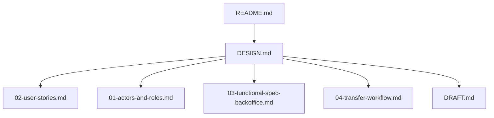
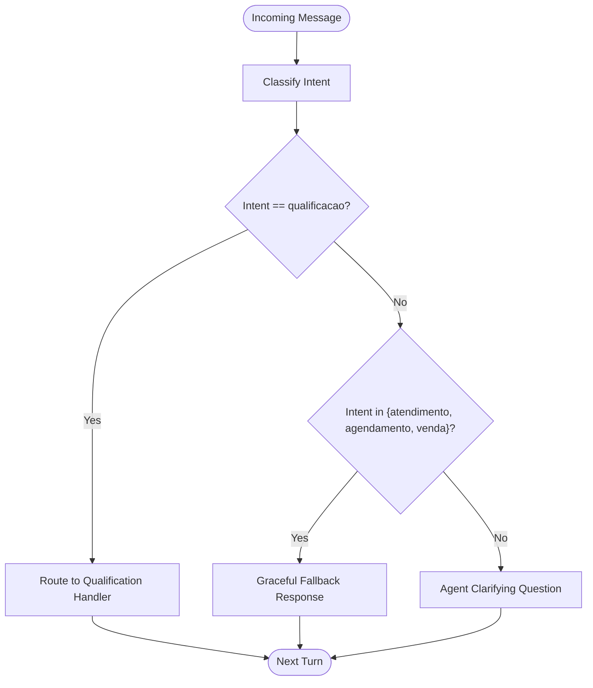
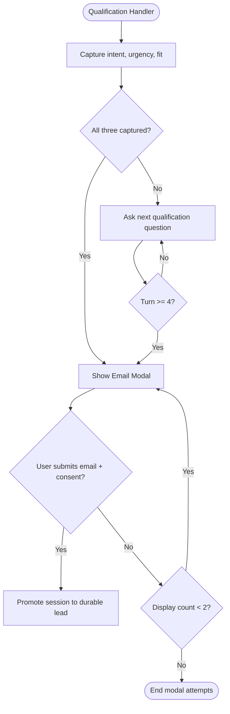
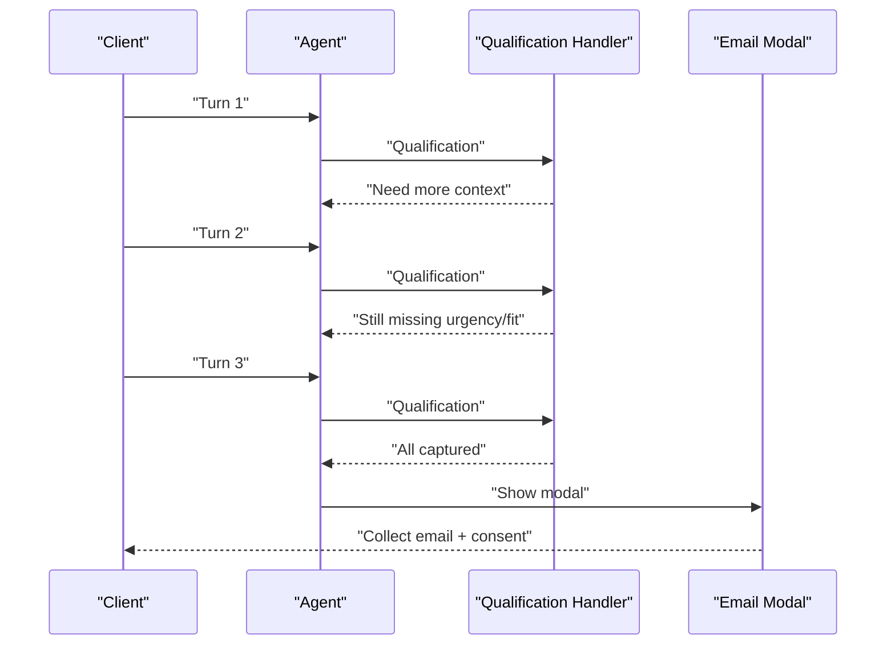
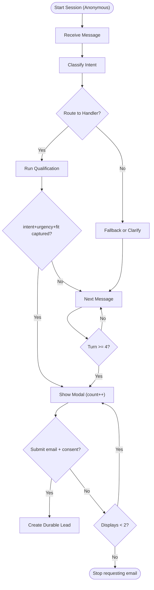
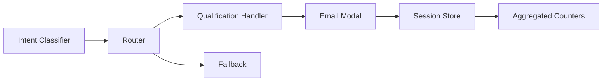

# Lead Identification Process

<cite>
**Referenced Files in This Document**
- [README.md](file://README.md)
- [DESIGN.md](file://.genie/brainstorms/plataforma-conversa-lead/DESIGN.md)
- [01-actors-and-roles.md](file://docs/sdd/01-actors-and-roles.md)
- [02-user-stories.md](file://docs/sdd/02-user-stories.md)
- [03-functional-spec-backoffice.md](file://docs/sdd/03-functional-spec-backoffice.md)
- [04-transfer-workflow.md](file://docs/sdd/04-transfer-workflow.md)
- [DRAFT.md](file://.genie/brainstorms/plataforma-conversa-lead/DRAFT.md)
</cite>

## Table of Contents
1. Introduction
2. Project Structure
3. Core Components
4. Architecture Overview
5. Detailed Component Analysis
6. Dependency Analysis
7. Performance Considerations
8. Troubleshooting Guide
9. Conclusion

## Introduction
This document explains how the Sup Better Engine identifies qualified leads through conversation analysis and contextual email collection. It covers the intent classification system, the qualification handler, the email modal trigger rules (including the turn 4 fallback), display limits per session, anonymity until voluntary contact disclosure, and the decision logic that determines when to request user information.

## Project Structure
The repository contains design and specification artifacts that define the lead identification flow:
- Design scope and decisions for the conversation platform
- User stories describing end-to-end flows from anonymous chat to contextual email collection
- Backoffice functional specs for monitoring sessions and reviewing leads
- Transfer workflow notes that clarify routing behavior and boundaries
- Draft history capturing evolution toward the final design



**Diagram sources**
- [README.md:1-8](file://README.md#L1-L8)
- [DESIGN.md:47-166](file://.genie/brainstorms/plataforma-conversa-lead/DESIGN.md#L47-L166)

**Section sources**
- [README.md:1-8](file://README.md#L1-L8)

## Core Components
- Intent classifier: classifies each incoming message into one of five intents — qualification, support, scheduling, sales, or undefined — with “undefined” acting as explicit abstention for greetings or messages without clear intent.
- Routing per message: the current message’s intent decides who responds; only “qualification” goes to the real handler; other three intents go to a graceful fallback; “undefined” receives a clarifying question from the agent.
- Qualification handler: captures intent, urgency, and fit to produce structured output for the commercial team.
- Contextual email modal: appears mid-conversation when the qualification handler has captured intent/urgency/fit or at turn 4 if not achieved earlier; maximum two displays per session; includes value proposition and consent framing.
- Anonymity by default: conversations start anonymous; identity is only collected when the user voluntarily provides an email via the modal.

**Section sources**
- [DESIGN.md:51-108](file://.genie/brainstorms/plataforma-conversa-lead/DESIGN.md#L51-L108)
- [02-user-stories.md:19-45](file://docs/sdd/02-user-stories.md#L19-L45)

## Architecture Overview
The system processes each message through a consistent pipeline: classify → route → respond → optionally trigger identification. Sessions are ephemeral and anonymous until the user submits an email. Counters aggregate outcomes anonymously at session end or TTL expiry.

```mermaid
sequenceDiagram
participant Client as "Client"
participant Agent as "Agent"
participant Classifier as "Intent Classifier"
participant Router as "Router"
participant Handler as "Qualification Handler"
participant Modal as "Email Modal"
participant Store as "Session Store / Counters"
Client->>Agent : "Message N"
Agent->>Classifier : "Classify(Message N)"
Classifier-->>Agent : "Intent ∈ {qualificacao, atendimento, agendamento, venda, indefinida}"
Agent->>Router : "Route(Intent)"
alt Intent == qualificacao
Router->>Handler : "Run qualification"
Handler-->>Agent : "Captured intent/urgency/fit?"
opt Captured or Turn >= 4
Agent->>Modal : "Show email modal (max 2/session)"
Modal-->>Store : "Submit email + consent"
Store-->>Agent : "Promote session to durable lead"
else Not yet
Agent-->>Client : "Continue qualification questions"
end
else Intent in {atendimento, agendamento, venda}
Router->>Agent : "Fallback response"
Agent-->>Client : "Acknowledge request + tenant contact"
else Intent == indefinida
Agent-->>Client : "Clarifying question"
end
Note over Store : "Terminal emission on close/TTL increments aggregated counters"
```

**Diagram sources**
- [DESIGN.md:51-108](file://.genie/brainstorms/plataforma-conversa-lead/DESIGN.md#L51-L108)
- [DESIGN.md:198-213](file://.genie/brainstorms/plataforma-conversa-lead/DESIGN.md#L198-L213)

## Detailed Component Analysis

### Intent Classification System
- Output field: intencao with values {qualificacao, atendimento, agendamento, venda, indefinida}.
- “Undefined” is explicit abstention for greetings or messages without intent; without it, noise would be forced into one of four categories and distort distributions.
- Routing is re-evaluated per message; only “qualification” triggers the real handler. Other three intents use a graceful fallback that acknowledges the request and points to tenant contact. “Undefined” gets a clarifying question from the agent.



**Diagram sources**
- [DESIGN.md:51-85](file://.genie/brainstorms/plataforma-conversa-lead/DESIGN.md#L51-L85)

**Section sources**
- [DESIGN.md:51-85](file://.genie/brainstorms/plataforma-conversa-lead/DESIGN.md#L51-L85)

### Qualification Handler and Contextual Email Modal Trigger
- The single real handler is “qualification.” It discovers intent, urgency, and fit and produces structured output for the commercial team.
- The email modal is triggered by the qualification handler under either condition:
  - The handler has captured intent, urgency, and fit, or
  - At turn 4, whichever comes first.
- Display limit: maximum two displays per session. A validation refusal reopens the same screen for correction and does not count as a new display.
- Consent framing: the modal states the email is used for the tenant’s commercial team to follow up about this conversation; sending the email is the act of consent. Marketing consent is out of scope for this slice.



**Diagram sources**
- [DESIGN.md:77-108](file://.genie/brainstorms/plataforma-conversa-lead/DESIGN.md#L77-L108)
- [02-user-stories.md:28-45](file://docs/sdd/02-user-stories.md#L28-L45)

**Section sources**
- [DESIGN.md:77-108](file://.genie/brainstorms/plataforma-conversa-lead/DESIGN.md#L77-L108)
- [02-user-stories.md:28-45](file://docs/sdd/02-user-stories.md#L28-L45)

### Conversation Patterns That Trigger Identification
- Early conversion: If the qualification handler captures intent, urgency, and fit within the first few turns, the modal appears immediately after capture.
- Late fallback: If the handler does not converge before turn 4, the modal automatically triggers at turn 4 to ensure every qualifying session has a chance to provide contact info.
- Non-qualification paths: Messages classified as support, scheduling, or sales are handled by a graceful fallback and do not trigger the email modal. The session remains open; if later messages return to “qualification,” the handler resumes and may still trigger the modal per the rules above.



**Diagram sources**
- [DESIGN.md:77-108](file://.genie/brainstorms/plataforma-conversa-lead/DESIGN.md#L77-L108)

**Section sources**
- [DESIGN.md:77-108](file://.genie/brainstorms/plataforma-conversa-lead/DESIGN.md#L77-L108)

### Decision Logic Behind When to Request Contact Information
- Primary rule: Request email when the qualification handler has captured intent, urgency, and fit.
- Safety net: If not captured by turn 4, request email at turn 4.
- Frequency cap: Maximum two modal displays per session; a failed validation reopens the same attempt without counting as a new display.
- Anonymity: Conversations begin anonymous; no identifier is collected at entry. Identity is only created when the user voluntarily submits an email and consents.



**Diagram sources**
- [DESIGN.md:77-108](file://.genie/brainstorms/plataforma-conversa-lead/DESIGN.md#L77-L108)

**Section sources**
- [DESIGN.md:77-108](file://.genie/brainstorms/plataforma-conversa-lead/DESIGN.md#L77-L108)

### Examples of Qualification Workflows
- Example A — Fast qualification:
  - Turn 1–2: Agent asks about need and urgency.
  - Turn 3: Fit confirmed; modal appears immediately.
  - Outcome: Email submitted; session promoted to durable lead.
- Example B — Slow qualification:
  - Turns 1–3: Partial answers; modal not shown yet.
  - Turn 4: Automatic trigger; modal appears even if not fully converged.
  - Outcome: Either email submitted or modal attempts exhausted (max 2).
- Example C — Mixed intents:
  - Early “scheduling” message routed to fallback; session stays open.
  - Later “qualification” message resumes handler; modal can still trigger per rules.

[No sources needed since this section synthesizes patterns already sourced above]

## Dependency Analysis
- Classifier depends on message content to emit a single intent field.
- Router depends on the classifier’s output to decide between handler, fallback, or clarifying response.
- Qualification handler depends on conversational context to extract intent, urgency, and fit.
- Email modal depends on handler state or turn count; enforces max displays per session.
- Session store maintains ephemeral context while anonymous; promotes to durable lead upon successful submission.
- Counters depend on terminal emissions at session close or TTL expiry to increment pre-aggregated buckets.



**Diagram sources**
- [DESIGN.md:51-108](file://.genie/brainstorms/plataforma-conversa-lead/DESIGN.md#L51-L108)
- [DESIGN.md:198-213](file://.genie/brainstorms/plataforma-conversa-lead/DESIGN.md#L198-L213)

**Section sources**
- [DESIGN.md:51-108](file://.genie/brainstorms/plataforma-conversa-lead/DESIGN.md#L51-L108)
- [DESIGN.md:198-213](file://.genie/brainstorms/plataforma-conversa-lead/DESIGN.md#L198-L213)

## Performance Considerations
- Per-message classification and routing ensures responsiveness but requires efficient classifier and router implementations.
- Turn-based gating prevents excessive modal prompts; limiting to two displays reduces friction and preserves metric stability.
- Ephemeral sessions with TTL reduce storage overhead and align with privacy-by-design.
- Pre-aggregated counters avoid per-session timestamp writes, keeping analytics lightweight.

[No sources needed since this section provides general guidance]

## Troubleshooting Guide
- Modal not appearing:
  - Verify whether intent/urgency/fit were captured; if not, confirm turn 4 trigger is active.
  - Ensure display count has not reached the maximum of two per session.
- Excessive fallback responses:
  - Confirm routing is per message; non-qualification intents should not trigger the handler or modal.
- Session stuck in “undefined”:
  - “Undefined” routes to clarifying questions and does not fix session intent; continue prompting until a meaningful intent emerges.
- Email validation failures:
  - Syntax errors or disposable domains are rejected; guide users to correct input.
- Anonymity concerns:
  - Remember that sessions remain anonymous until the user voluntarily submits an email and consents.

**Section sources**
- [DESIGN.md:77-108](file://.genie/brainstorms/plataforma-conversa-lead/DESIGN.md#L77-L108)
- [02-user-stories.md:28-45](file://docs/sdd/02-user-stories.md#L28-L45)

## Conclusion
The Sup Better Engine identifies qualified leads by classifying each message, routing to a qualification handler when appropriate, and triggering a contextual email modal either upon capturing intent/urgency/fit or at turn 4 if not achieved earlier. The system enforces a maximum of two modal displays per session, maintains anonymity until voluntary contact disclosure, and aggregates outcomes anonymously for measurement. This design balances conversion opportunity with user experience and privacy constraints.

[No sources needed since this section summarizes without analyzing specific files]