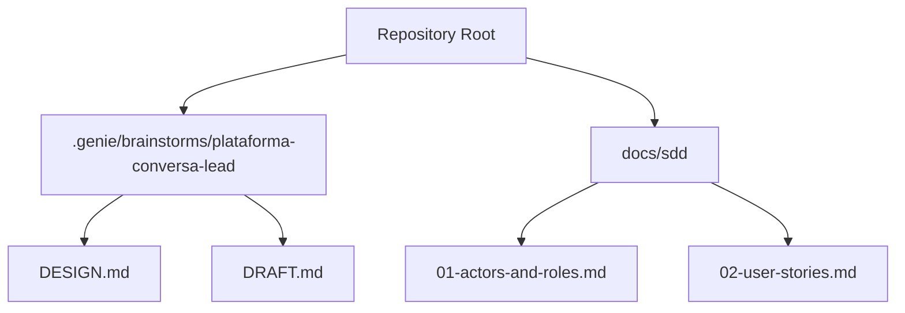
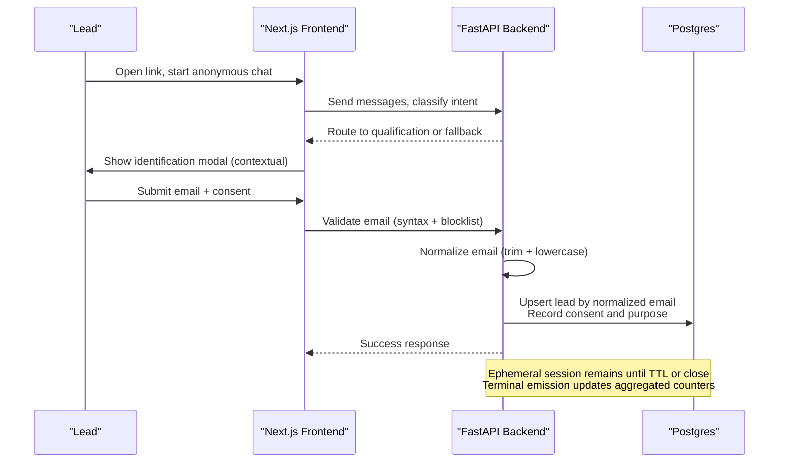
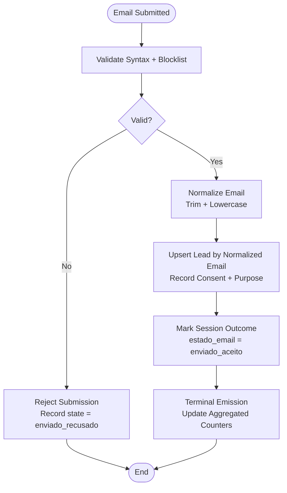
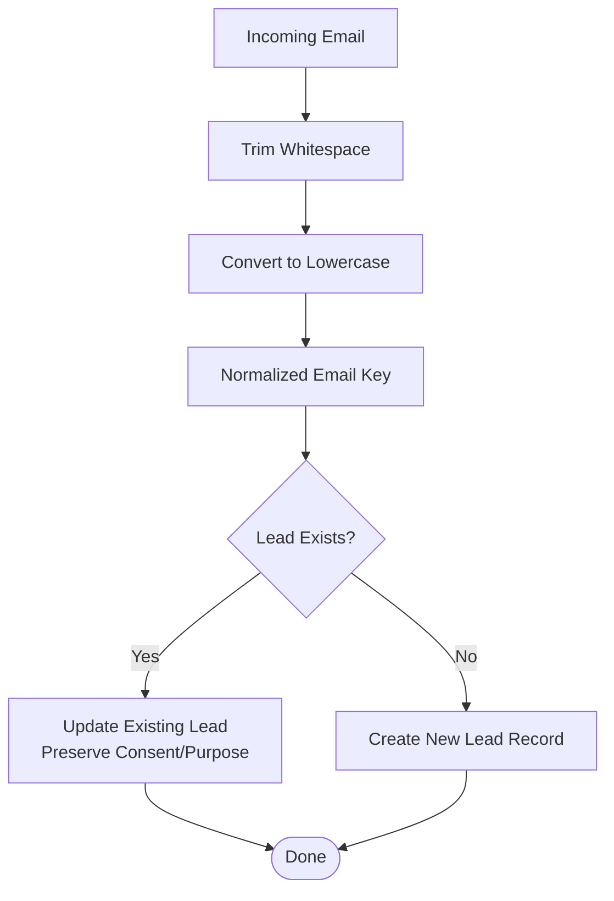
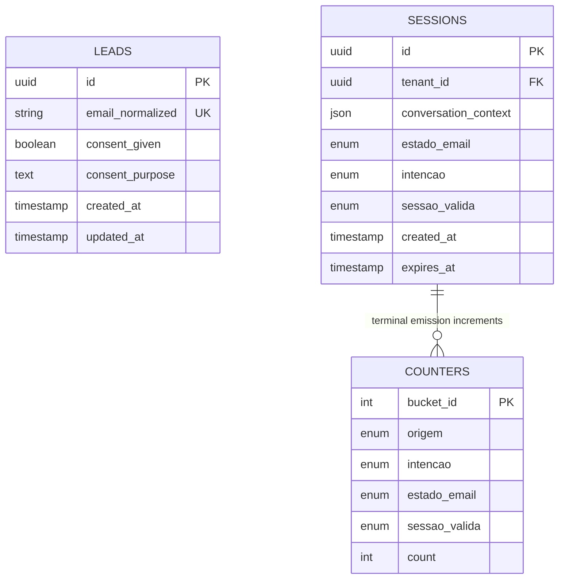
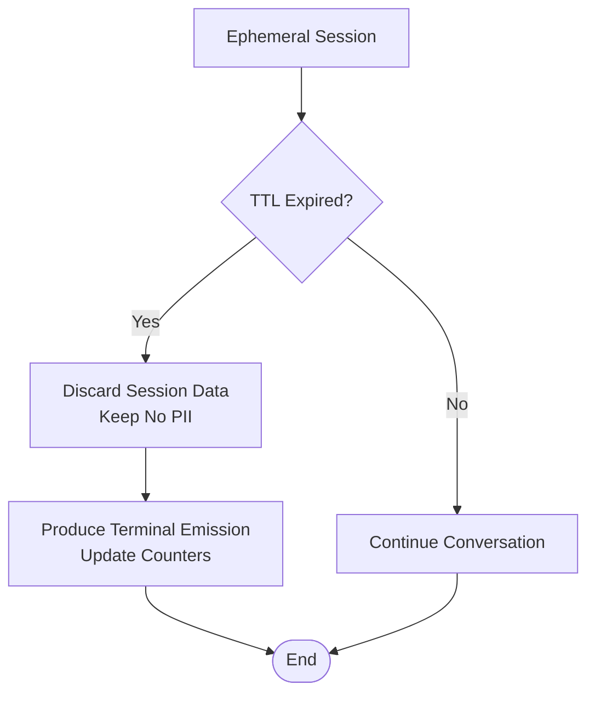
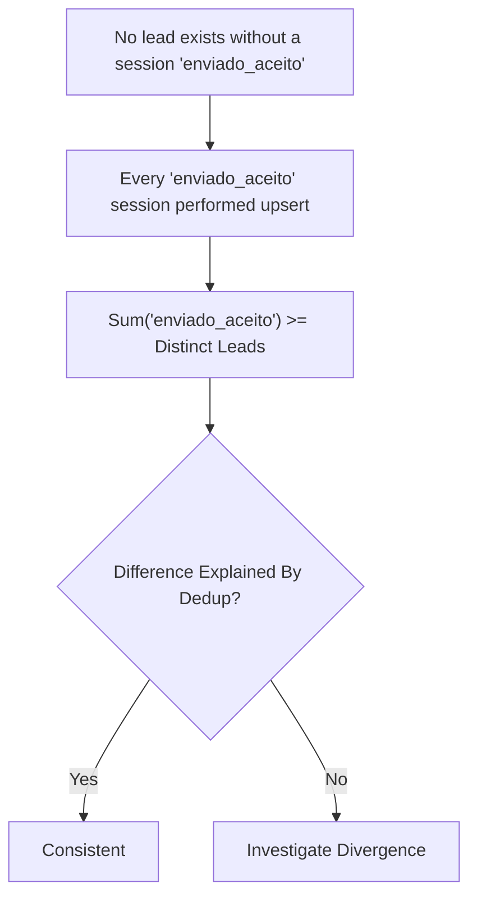
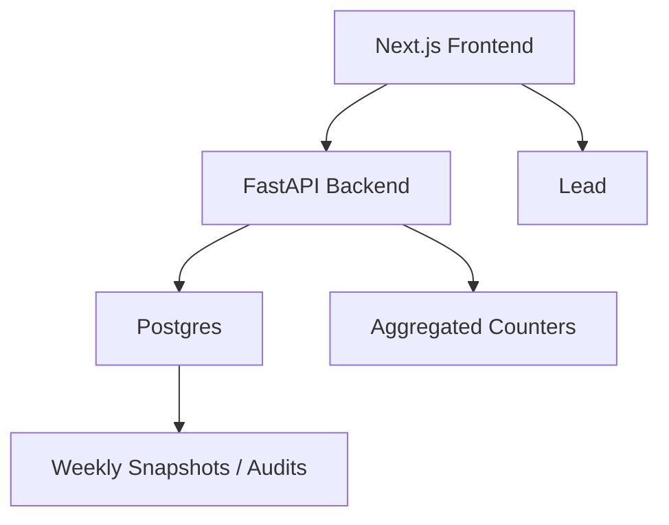

# Lead Promotion & Deduplication

<cite>
**Referenced Files in This Document**
- [DESIGN.md](file://.genie/brainstorms/plataforma-conversa-lead/DESIGN.md)
- [DRAFT.md](file://.genie/brainstorms/plataforma-conversa-lead/DRAFT.md)
- [01-actors-and-roles.md](file://docs/sdd/01-actors-and-roles.md)
- [02-user-stories.md](file://docs/sdd/02-user-stories.md)
</cite>

## Table of Contents
1. [Introduction](#introduction)
2. [Project Structure](#project-structure)
3. [Core Components](#core-components)
4. [Architecture Overview](#architecture-overview)
5. [Detailed Component Analysis](#detailed-component-analysis)
6. [Dependency Analysis](#dependency-analysis)
7. [Performance Considerations](#performance-considerations)
8. [Troubleshooting Guide](#troubleshooting-guide)
9. [Conclusion](#conclusion)

## Introduction
This document explains the lead promotion and deduplication system for the Sup Better Engine’s first slice: anonymous sessions are promoted to durable lead records when a user successfully submits an email with consent. The design uses normalized email (trimmed, lowercase) as the identity key, prevents duplicate leads from the same email, transitions ephemeral session data into persistent lead records, and maintains an audit trail connecting consent to created leads. It also covers TTL-based cleanup of anonymous sessions, reconciliation between session states and lead records, and the explicit limitation that multiple identities for the same person are not detected in this slice.

## Project Structure
The repository currently contains design and specification documents that define the promotion and deduplication behavior. There is no application code in this workspace; the implementation details below are derived from the design specifications.

**Section sources**
- [DESIGN.md:1-470](file://.genie/brainstorms/plataforma-conversa-lead/DESIGN.md#L1-L470)
- [DRAFT.md:1-171](file://.genie/brainstorms/plataforma-conversa-lead/DRAFT.md#L1-L171)
- [01-actors-and-roles.md:1-100](file://docs/sdd/01-actors-and-roles.md#L1-L100)
- [02-user-stories.md:1-211](file://docs/sdd/02-user-stories.md#L1-L211)

## Core Components
- Anonymous session lifecycle: ephemeral storage with TTL, conversation context, and terminal emission on close or TTL expiry.
- Email collection and validation: syntax check plus disposable domain blocklist; consent is tied to sending the email.
- Normalization: trim whitespace and convert to lowercase to ensure consistent matching.
- Promotion: conversion of an anonymous session into a durable lead record upon successful submission and consent.
- Deduplication: upsert semantics keyed by normalized email to prevent duplicates.
- Auditability: consent and purpose recorded with the lead; manual access/deletion runbook exists.
- Reconciliation: counters and audits ensure consistency between session outcomes and lead records.

**Section sources**
- [DESIGN.md:109-113](file://.genie/brainstorms/plataforma-conversa-lead/DESIGN.md#L109-L113)
- [DESIGN.md:210-235](file://.genie/brainstorms/plataforma-conversa-lead/DESIGN.md#L210-L235)
- [DESIGN.md:359-370](file://.genie/brainstorms/plataforma-conversa-lead/DESIGN.md#L359-L370)
- [DESIGN.md:413-415](file://.genie/brainstorms/plataforma-conversa-lead/DESIGN.md#L413-L415)

## Architecture Overview
High-level flow from anonymous chat to durable lead, including normalization, consent, promotion, and deduplication.

**Diagram sources**
- [DESIGN.md:203-214](file://.genie/brainstorms/plataforma-conversa-lead/DESIGN.md#L203-L214)
- [DESIGN.md:109-113](file://.genie/brainstorms/plataforma-conversa-lead/DESIGN.md#L109-L113)
- [DESIGN.md:210-235](file://.genie/brainstorms/plataforma-conversa-lead/DESIGN.md#L210-L235)
- [DESIGN.md:413-415](file://.genie/brainstorms/plataforma-conversa-lead/DESIGN.md#L413-L415)

## Detailed Component Analysis

### Session-to-Lead Promotion Flow
Promotion occurs only after successful email submission and explicit consent. The backend normalizes the email and persists a durable lead record. Anonymous session data is retained only until TTL expiration or session closure.

**Diagram sources**
- [DESIGN.md:109-113](file://.genie/brainstorms/plataforma-conversa-lead/DESIGN.md#L109-L113)
- [DESIGN.md:210-235](file://.genie/brainstorms/plataforma-conversa-lead/DESIGN.md#L210-L235)
- [DESIGN.md:413-415](file://.genie/brainstorms/plataforma-conversa-lead/DESIGN.md#L413-L415)

**Section sources**
- [DESIGN.md:109-113](file://.genie/brainstorms/plataforma-conversa-lead/DESIGN.md#L109-L113)
- [DESIGN.md:210-235](file://.genie/brainstorms/plataforma-conversa-lead/DESIGN.md#L210-L235)
- [DESIGN.md:413-415](file://.genie/brainstorms/plataforma-conversa-lead/DESIGN.md#L413-L415)

### Deduplication Logic
Deduplication is enforced by using the normalized email as the identity key. Two submissions differing only in case or whitespace resolve to a single lead. This ensures “same email → same lead” without merging across different emails.

**Diagram sources**
- [DESIGN.md:109-113](file://.genie/brainstorms/plataforma-conversa-lead/DESIGN.md#L109-L113)
- [DESIGN.md:359-370](file://.genie/brainstorms/plataforma-conversa-lead/DESIGN.md#L359-L370)
- [DESIGN.md:413-415](file://.genie/brainstorms/plataforma-conversa-lead/DESIGN.md#L413-L415)

**Section sources**
- [DESIGN.md:109-113](file://.genie/brainstorms/plataforma-conversa-lead/DESIGN.md#L109-L113)
- [DESIGN.md:359-370](file://.genie/brainstorms/plataforma-conversa-lead/DESIGN.md#L359-L370)
- [DESIGN.md:413-415](file://.genie/brainstorms/plataforma-conversa-lead/DESIGN.md#L413-L415)

### Database Schema Changes During Promotion
During promotion, the system writes a durable lead record keyed by normalized email and records consent and purpose. Anonymous session data remains transient until TTL expiry or session closure. Terminal emissions update aggregated counters without retaining per-session identifiers.

Key schema elements implied by the design:
- Leads table: unique key on normalized email; fields for consent and purpose.
- Sessions table: ephemeral rows with TTL; terminal emission updates counters.
- Counters table: aggregated buckets by origin, intent, email state, and validity flags.

**Diagram sources**
- [DESIGN.md:210-235](file://.genie/brainstorms/plataforma-conversa-lead/DESIGN.md#L210-L235)
- [DESIGN.md:129-167](file://.genie/brainstorms/plataforma-conversa-lead/DESIGN.md#L129-L167)
- [DESIGN.md:413-415](file://.genie/brainstorms/plataforma-conversa-lead/DESIGN.md#L413-L415)

**Section sources**
- [DESIGN.md:210-235](file://.genie/brainstorms/plataforma-conversa-lead/DESIGN.md#L210-L235)
- [DESIGN.md:129-167](file://.genie/brainstorms/plataforma-conversa-lead/DESIGN.md#L129-L167)
- [DESIGN.md:413-415](file://.genie/brainstorms/plataforma-conversa-lead/DESIGN.md#L413-L415)

### Cleanup After TTL Expiration
Anonymous sessions are stored in Postgres with TTL. When TTL expires, the session is discarded along with its transcript. A terminal emission is still produced to preserve metrics denominators.

**Diagram sources**
- [DESIGN.md:210-235](file://.genie/brainstorms/plataforma-conversa-lead/DESIGN.md#L210-L235)
- [DESIGN.md:129-167](file://.genie/brainstorms/plataforma-conversa-lead/DESIGN.md#L129-L167)

**Section sources**
- [DESIGN.md:210-235](file://.genie/brainstorms/plataforma-conversa-lead/DESIGN.md#L210-L235)
- [DESIGN.md:129-167](file://.genie/brainstorms/plataforma-conversa-lead/DESIGN.md#L129-L167)

### Reconciliation Between Session States and Lead Records
Reconciliation ensures consistency: every durable lead must correspond to at least one session with accepted email submission; every such session must have performed the upsert; and the total number of distinct leads cannot exceed the sum of accepted submissions due to deduplication.

**Diagram sources**
- [DESIGN.md:413-415](file://.genie/brainstorms/plataforma-conversa-lead/DESIGN.md#L413-L415)

**Section sources**
- [DESIGN.md:413-415](file://.genie/brainstorms/plataforma-conversa-lead/DESIGN.md#L413-L415)

### Promotion Scenarios and Deduplication Cases
- Scenario A: First-time email submission with valid syntax and non-blocklisted domain → create lead, record consent and purpose.
- Scenario B: Duplicate email differing only in case or whitespace → upsert existing lead, do not create a new record.
- Scenario C: Invalid email or blocklisted domain → reject submission, mark session state accordingly, no lead created.
- Scenario D: Retry after rejection with a valid email → advance session state to accepted and upsert/create lead.

These scenarios follow the rules defined in the success criteria and decisions sections.

**Section sources**
- [DESIGN.md:109-113](file://.genie/brainstorms/plataforma-conversa-lead/DESIGN.md#L109-L113)
- [DESIGN.md:359-370](file://.genie/brainstorms/plataforma-conversa-lead/DESIGN.md#L359-L370)
- [DESIGN.md:413-415](file://.genie/brainstorms/plataforma-conversa-lead/DESIGN.md#L413-L415)

### Technical Implementation Notes
- Identity key: normalized email (trim + lowercase).
- Consent gate: sending the email constitutes consent for the stated purpose; marketing consent is out of scope for this slice.
- Validation: syntax check plus disposable domain blocklist.
- Storage: Postgres tables for ephemeral sessions (with TTL), durable leads (unique by normalized email), and aggregated counters.
- Metrics: terminal emissions update pre-aggregated buckets; no per-session identifiers retained post-TTL.

**Section sources**
- [DESIGN.md:203-214](file://.genie/brainstorms/plataforma-conversa-lead/DESIGN.md#L203-L214)
- [DESIGN.md:210-235](file://.genie/brainstorms/plataforma-conversa-lead/DESIGN.md#L210-L235)
- [DESIGN.md:129-167](file://.genie/brainstorms/plataforma-conversa-lead/DESIGN.md#L129-L167)

### Design Decisions Around Email-Based Identity Keys
- Email is chosen as the primary identity key because it is more stable over time than phone numbers and is uniquely obtainable via a single request.
- The platform guarantees “same email → same lead” but does not merge across different emails; multiple identities for the same person are not detected in this slice.
- This limitation is intentional and documented; future slices may introduce additional identifiers or merge workflows based on operational feedback.

**Section sources**
- [DESIGN.md:22-34](file://.genie/brainstorms/plataforma-conversa-lead/DESIGN.md#L22-L34)
- [DESIGN.md:359-370](file://.genie/brainstorms/plataforma-conversa-lead/DESIGN.md#L359-L370)

### Limitations
- No detection of multiple identities for the same person using different emails.
- No email ownership verification (no confirmation codes) in this slice.
- No cookie stitching to connect anonymous sessions to identified leads.

**Section sources**
- [DESIGN.md:22-34](file://.genie/brainstorms/plataforma-conversa-lead/DESIGN.md#L22-L34)
- [DESIGN.md:187-199](file://.genie/brainstorms/plataforma-conversa-lead/DESIGN.md#L187-L199)

## Dependency Analysis
The promotion and deduplication logic depends on:
- Frontend: renders landing page and identification modal; collects email and consent.
- Backend: classifies intent, routes conversations, validates email, normalizes identity, performs upserts, and emits terminal metrics.
- Database: stores ephemeral sessions (TTL), durable leads (unique by normalized email), and aggregated counters.

**Diagram sources**
- [DESIGN.md:203-214](file://.genie/brainstorms/plataforma-conversa-lead/DESIGN.md#L203-L214)
- [DESIGN.md:129-167](file://.genie/brainstorms/plataforma-conversa-lead/DESIGN.md#L129-L167)

**Section sources**
- [DESIGN.md:203-214](file://.genie/brainstorms/plataforma-conversa-lead/DESIGN.md#L203-L214)
- [DESIGN.md:129-167](file://.genie/brainstorms/plataforma-conversa-lead/DESIGN.md#L129-L167)

## Performance Considerations
- TTL-based cleanup keeps the database lean by discarding anonymous session data after a fixed window.
- Pre-aggregated counters reduce write amplification and avoid storing per-session identifiers post-TTL.
- Rate limiting and turn limits protect backend resources and maintain service stability under load.

[No sources needed since this section provides general guidance]

## Troubleshooting Guide
Common issues and how to diagnose them:
- Duplicate leads suspected: verify normalization (trim + lowercase) and confirm upsert behavior by normalized email.
- Missing leads despite accepted submissions: check reconciliation assertions—every accepted session must perform an upsert and terminal emission.
- Metric divergence: inspect excluded sessions (rate limit or turn limit) and ensure they are counted separately and not mixed into conversion rates.
- Consent discrepancies: ensure consent and purpose are recorded with the lead; sending the email is the consent act in this slice.

**Section sources**
- [DESIGN.md:413-415](file://.genie/brainstorms/plataforma-conversa-lead/DESIGN.md#L413-L415)
- [DESIGN.md:109-113](file://.genie/brainstorms/plataforma-conversa-lead/DESIGN.md#L109-L113)

## Conclusion
The lead promotion and deduplication system in the Sup Better Engine’s first slice centers on normalized email as the identity key, strict validation and consent gating, and robust reconciliation between ephemeral sessions and durable leads. Deduplication prevents duplicate records for the same email, while TTL-based cleanup ensures minimal retention of anonymous data. The design explicitly acknowledges limitations around multi-identity resolution and defers more sophisticated identity merging to future work.

[No sources needed since this section summarizes without analyzing specific files]