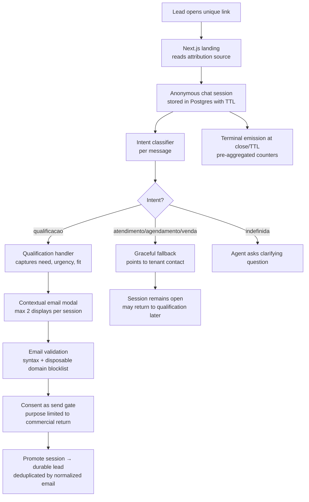
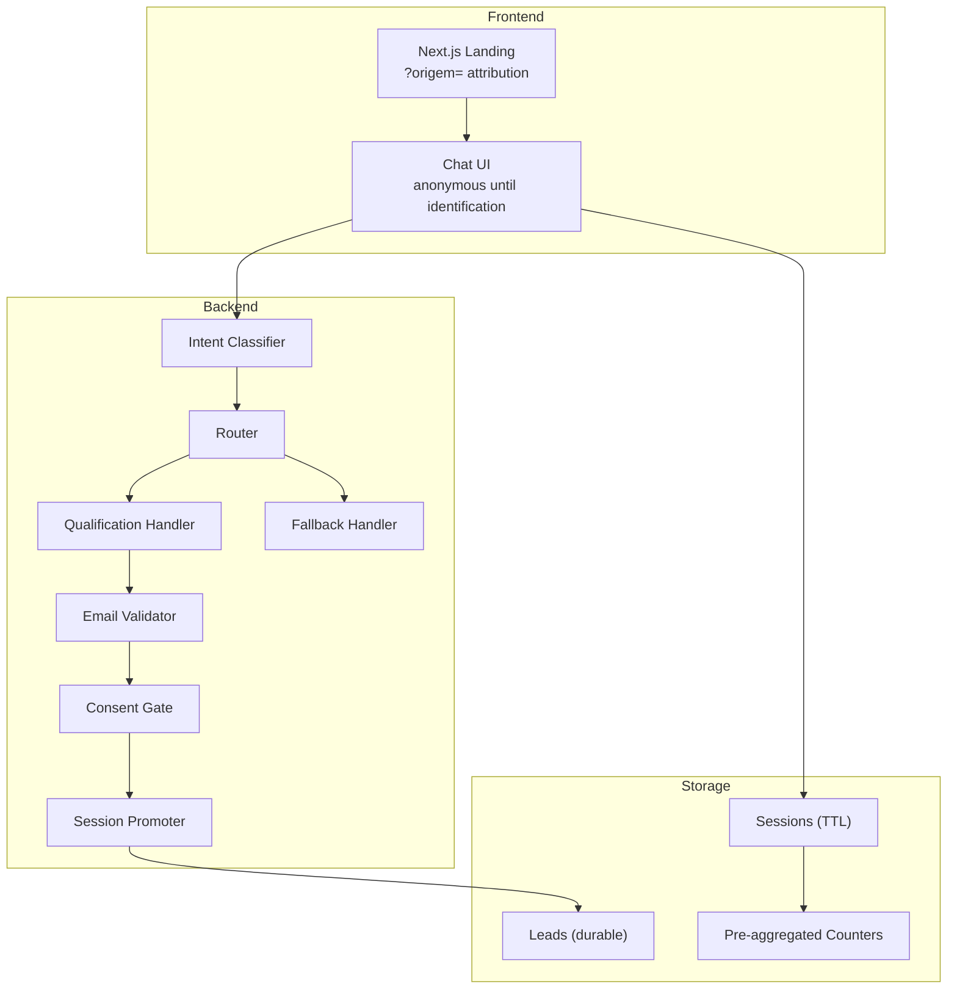
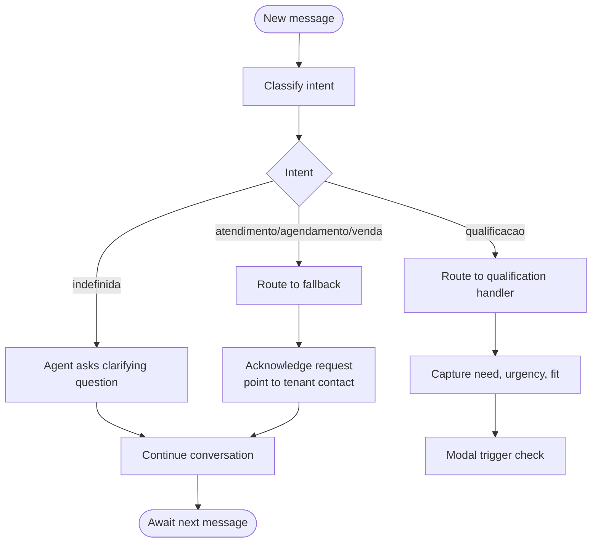
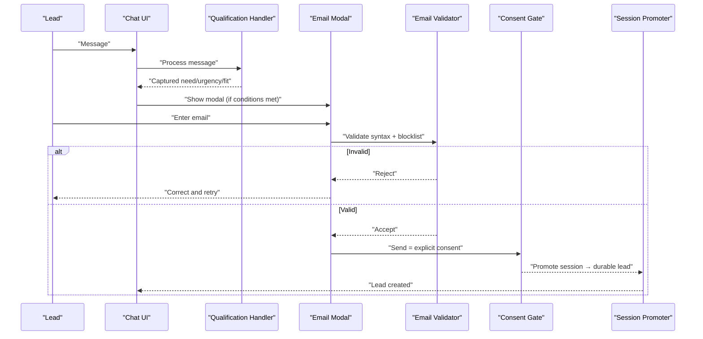
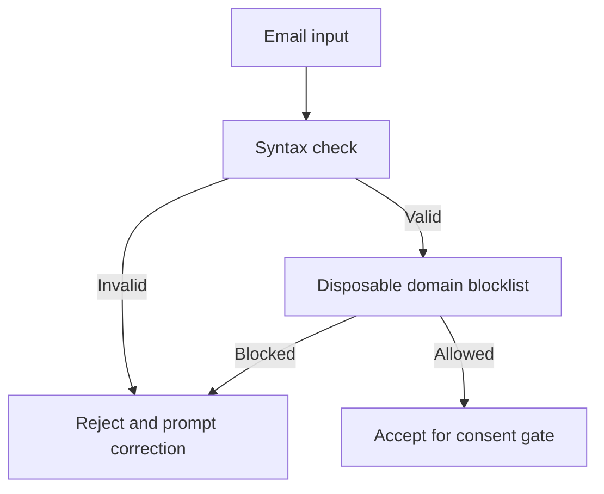
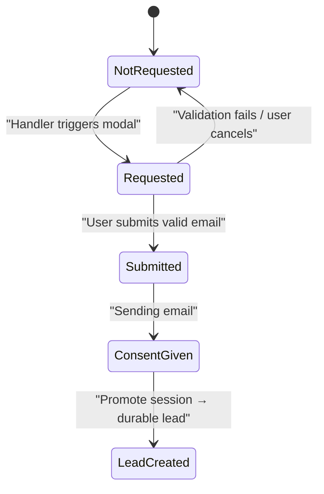
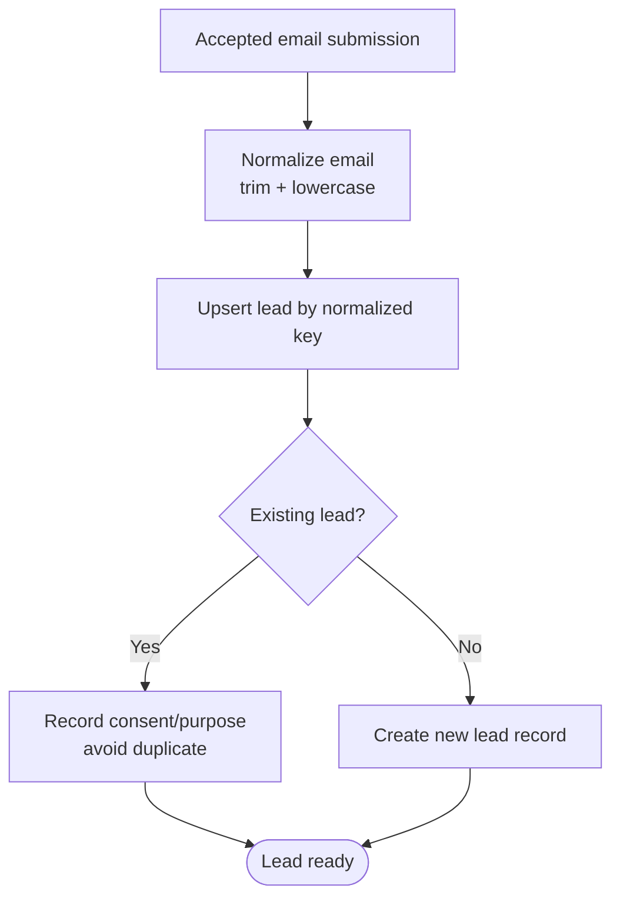
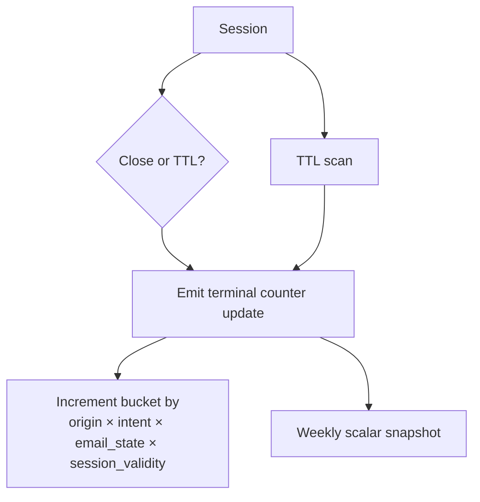
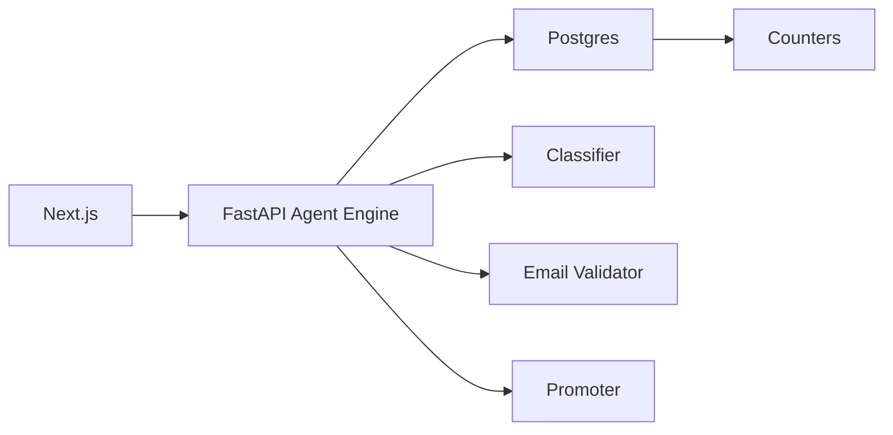

# Lead Qualification Flow

<cite>
**Referenced Files in This Document**
- [DESIGN.md](file://.genie/brainstorms/plataforma-conversa-lead/DESIGN.md)
- [DRAFT.md](file://.genie/brainstorms/plataforma-conversa-lead/DRAFT.md)
- [01-actors-and-roles.md](file://docs/sdd/01-actors-and-roles.md)
- [02-user-stories.md](file://docs/sdd/02-user-stories.md)
</cite>

## Table of Contents
1. Introduction
2. Project Structure
3. Core Components
4. Architecture Overview
5. Detailed Component Analysis
6. Dependency Analysis
7. Performance Considerations
8. Troubleshooting Guide
9. Conclusion

## Introduction
This document explains the lead qualification flow for the Sup Better Engine’s first slice: a link-based chat that starts anonymous, classifies intent, qualifies leads, collects email contextually, validates it, records consent under LGPD, and promotes an anonymous session into a durable lead record with deduplication and auditability. It also covers counters, rate limiting, TTL, and compliance procedures.

## Project Structure
The repository contains design and specification artifacts that define the end-to-end flow:
- Design specification describing scope, decisions, risks, success criteria, and operational parameters
- Draft notes summarizing decisions and evolution
- Actor and role model clarifying who interacts with the system
- User stories capturing acceptance criteria for the lead-facing experience

**Diagram sources**
- [DESIGN.md:47-166](file://.genie/brainstorms/plataforma-conversa-lead/DESIGN.md#L47-L166)
- [DESIGN.md:189-214](file://.genie/brainstorms/plataforma-conversa-lead/DESIGN.md#L189-L214)
- [02-user-stories.md:10-55](file://docs/sdd/02-user-stories.md#L10-L55)

**Section sources**
- [DESIGN.md:47-166](file://.genie/brainstorms/plataforma-conversa-lead/DESIGN.md#L47-L166)
- [01-actors-and-roles.md:10-30](file://docs/sdd/01-actors-and-roles.md#L10-L30)

## Core Components
- Anonymous session management: ephemeral Postgres table with TTL; sessions are discarded after TTL unless promoted to a durable lead.
- Intent classifier: per-message classification into {qualificacao, atendimento, agendamento, venda, indefinida}.
- Routing: per-message routing to either the qualification handler or a single graceful fallback; undefined intent triggers a clarifying question.
- Qualification handler: captures structured fields (need, urgency, fit) and triggers contextual email collection.
- Email modal: appears when qualification data is captured or at turn 4 (whichever comes first), max two displays per session; validation includes syntax and disposable domain blocklist.
- Consent and promotion: sending the email acts as explicit consent for the stated purpose; on acceptance, the session is promoted to a durable lead record, deduplicated by normalized email (trim + lowercase).
- Counters and snapshots: terminal emissions aggregate counts across four dimensions without PII; weekly scalar snapshot tracks sessions per week.
- Rate limiting and session caps: IP-based rate limit and per-session message cap protect the LLM endpoint; exclusions are auditable via separate scalars.

**Section sources**
- [DESIGN.md:47-166](file://.genie/brainstorms/plataforma-conversa-lead/DESIGN.md#L47-L166)
- [DESIGN.md:189-214](file://.genie/brainstorms/plataforma-conversa-lead/DESIGN.md#L189-L214)
- [02-user-stories.md:10-55](file://docs/sdd/02-user-stories.md#L10-L55)

## Architecture Overview
High-level architecture aligns with Next.js frontend, FastAPI backend, and Postgres storage. The agent engine runs in Python and orchestrates classification, routing, handlers, validation, consent, and promotion.

**Diagram sources**
- [DESIGN.md:189-214](file://.genie/brainstorms/plataforma-conversa-lead/DESIGN.md#L189-L214)
- [DESIGN.md:47-166](file://.genie/brainstorms/plataforma-conversa-lead/DESIGN.md#L47-L166)

## Detailed Component Analysis

### Conversation Classification and Routing
- Per-message classification determines routing: qualificacao goes to the real handler; other intents go to a graceful fallback; undefined intent receives a clarifying question.
- Session aggregation for counters inherits the first non-undefined intent label to avoid error composition over turns.

**Diagram sources**
- [DESIGN.md:53-85](file://.genie/brainstorms/plataforma-conversa-lead/DESIGN.md#L53-L85)
- [DESIGN.md:64-76](file://.genie/brainstorms/plataforma-conversa-lead/DESIGN.md#L64-L76)

**Section sources**
- [DESIGN.md:53-85](file://.genie/brainstorms/plataforma-conversa-lead/DESIGN.md#L53-L85)

### Contextual Email Collection Modal
- Triggered by the qualification handler once intention, urgency, and fit are captured, or at turn 4 if not earlier.
- Displayed at most twice per session; validation failures reopen the same attempt without counting as a new display.
- Displays value proposition tied to the stated purpose: commercial team will return about this conversation.

**Diagram sources**
- [DESIGN.md:86-108](file://.genie/brainstorms/plataforma-conversa-lead/DESIGN.md#L86-L108)
- [02-user-stories.md:28-45](file://docs/sdd/02-user-stories.md#L28-L45)

**Section sources**
- [DESIGN.md:86-108](file://.genie/brainstorms/plataforma-conversa-lead/DESIGN.md#L86-L108)
- [02-user-stories.md:28-45](file://docs/sdd/02-user-stories.md#L28-L45)

### Email Validation System
- Syntax checking rejects malformed emails.
- Disposable domain blocklist prevents temporary addresses from becoming leads.
- No ownership verification code in this slice; acceptance gates on syntax and blocklist only.

**Diagram sources**
- [DESIGN.md:99-100](file://.genie/brainstorms/plataforma-conversa-lead/DESIGN.md#L99-L100)
- [02-user-stories.md:31-36](file://docs/sdd/02-user-stories.md#L31-L36)

**Section sources**
- [DESIGN.md:99-100](file://.genie/brainstorms/plataforma-conversa-lead/DESIGN.md#L99-L100)
- [02-user-stories.md:31-36](file://docs/sdd/02-user-stories.md#L31-L36)

### Consent Management (LGPD)
- Purpose is narrowly scoped: commercial team will return about this conversation.
- Sending the email is the explicit consent act; no marketing consent collected in this slice.
- No state exists for “provided email but refused consent”; refusal means not sending.

**Diagram sources**
- [DESIGN.md:101-108](file://.genie/brainstorms/plataforma-conversa-lead/DESIGN.md#L101-L108)

**Section sources**
- [DESIGN.md:101-108](file://.genie/brainstorms/plataforma-conversa-lead/DESIGN.md#L101-L108)

### Promotion Mechanism and Deduplication
- On accepted submission, the anonymous session is promoted to a durable lead record.
- Deduplication key is normalized email: trim whitespace and lowercase.
- Consent and purpose are recorded alongside the lead.

**Diagram sources**
- [DESIGN.md:107-108](file://.genie/brainstorms/plataforma-conversa-lead/DESIGN.md#L107-L108)
- [DESIGN.md:347](file://.genie/brainstorms/plataforma-conversa-lead/DESIGN.md#L347)

**Section sources**
- [DESIGN.md:107-108](file://.genie/brainstorms/plataforma-conversa-lead/DESIGN.md#L107-L108)
- [DESIGN.md:347](file://.genie/brainstorms/plataforma-conversa-lead/DESIGN.md#L347)

### Counters, TTL, and Auditability
- Sessions live in Postgres with TTL; non-identified sessions are discarded at TTL.
- Terminal emission occurs once per session (on close or TTL expiry), incrementing pre-aggregated buckets across four dimensions: origin, intent, email state, session validity.
- Weekly scalar snapshot tracks total valid sessions; separate scalar counters log edge blocks by IP per day.
- Exclusions are auditable without polluting session counters.

**Diagram sources**
- [DESIGN.md:127-166](file://.genie/brainstorms/plataforma-conversa-lead/DESIGN.md#L127-L166)
- [DESIGN.md:198-214](file://.genie/brainstorms/plataforma-conversa-lead/DESIGN.md#L198-L214)

**Section sources**
- [DESIGN.md:127-166](file://.genie/brainstorms/plataforma-conversa-lead/DESIGN.md#L127-L166)
- [DESIGN.md:198-214](file://.genie/brainstorms/plataforma-conversa-lead/DESIGN.md#L198-L214)

### Compliance Procedures (Access and Deletion)
- Manual runbook for access and deletion requests under LGPD Art. 18.
- Named owner responsible; exercised at least once during pilot.
- Retention policy ensures no personal data persists beyond TTL for non-identified sessions.

**Section sources**
- [DESIGN.md:109-111](file://.genie/brainstorms/plataforma-conversa-lead/DESIGN.md#L109-L111)
- [DESIGN.md:438-440](file://.genie/brainstorms/plataforma-conversa-lead/DESIGN.md#L438-L440)
- [02-user-stories.md:47-54](file://docs/sdd/02-user-stories.md#L47-L54)

## Dependency Analysis
Key dependencies and relationships:
- Frontend depends on backend endpoints for chat, classification, and modal submission.
- Backend components depend on classifier output for routing and on validator output for consent gating.
- Storage depends on TTL policies and upsert semantics for deduplication.
- Counters depend on terminal emissions and do not retain session identifiers.

**Diagram sources**
- [DESIGN.md:189-214](file://.genie/brainstorms/plataforma-conversa-lead/DESIGN.md#L189-L214)

**Section sources**
- [DESIGN.md:189-214](file://.genie/brainstorms/plataforma-conversa-lead/DESIGN.md#L189-L214)

## Performance Considerations
- Rate limiting protects the public LLM endpoint; per-session message caps prevent abuse while allowing engaged conversations.
- Pre-aggregated counters reduce storage overhead and preserve privacy by omitting PII and session IDs.
- TTL ensures ephemeral sessions do not persist indefinitely, reducing storage and compliance risk.
- Deduplication by normalized email avoids redundant records and keeps lead lists clean.

[No sources needed since this section provides general guidance]

## Troubleshooting Guide
Common issues and resolutions:
- Email rejected due to syntax or disposable domain: guide users to correct format and avoid temporary domains.
- Modal not appearing: verify that qualification fields were captured or that turn 4 was reached; ensure display cap not exceeded.
- Duplicate leads suspected: confirm normalization rules (trim + lowercase) and upsert behavior.
- Counter discrepancies: remember that excluded sessions (rate limit or message cap) are counted separately and do not affect conversion rates; weekly snapshots track totals.

**Section sources**
- [DESIGN.md:99-108](file://.genie/brainstorms/plataforma-conversa-lead/DESIGN.md#L99-L108)
- [DESIGN.md:127-166](file://.genie/brainstorms/plataforma-conversa-lead/DESIGN.md#L127-L166)
- [02-user-stories.md:31-45](file://docs/sdd/02-user-stories.md#L31-L45)

## Conclusion
The lead qualification flow centers on an anonymous chat that classifies intent, qualifies leads, and collects email contextually with strict validation and consent. Sessions are ephemeral and promoted to durable leads upon acceptance, with deduplication by normalized email. Counters and snapshots provide privacy-preserving metrics, while manual compliance processes ensure rights under LGPD. This design balances friction, accuracy, and compliance to validate the core premise of moving leads from WhatsApp to a dedicated channel.

[No sources needed since this section summarizes without analyzing specific files]