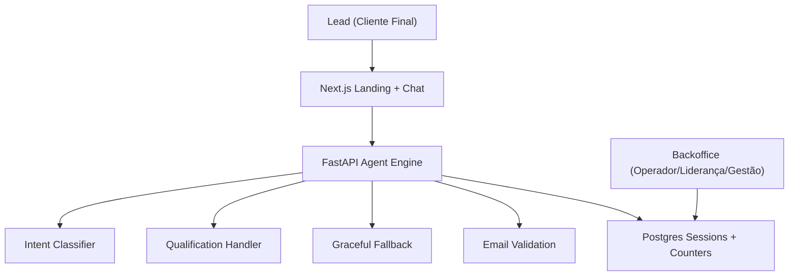
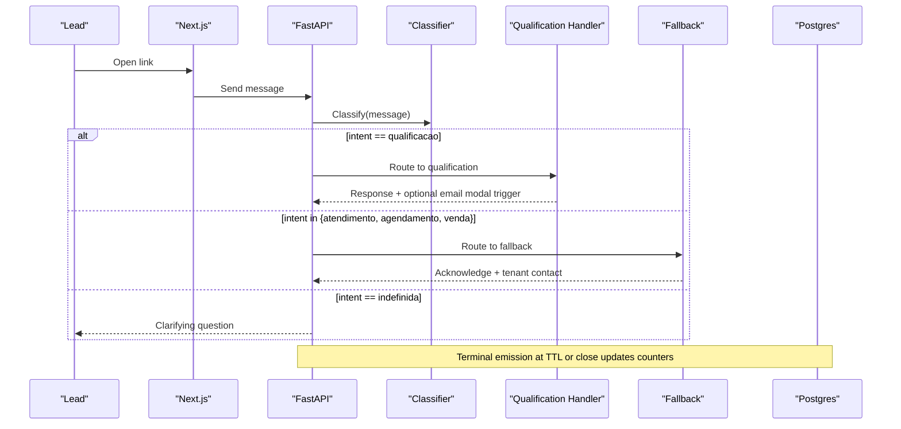
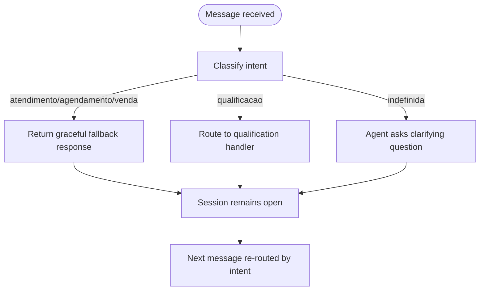
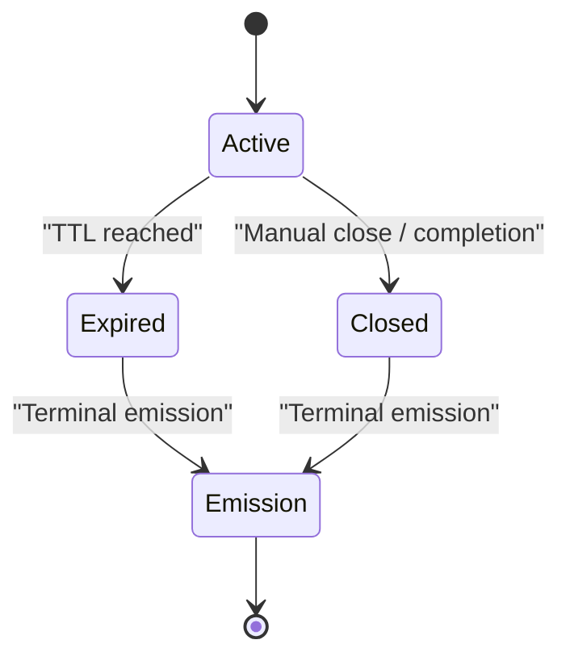
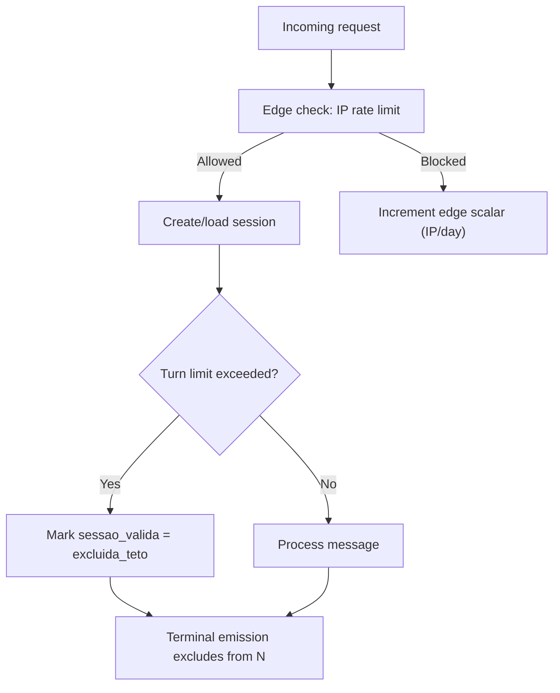
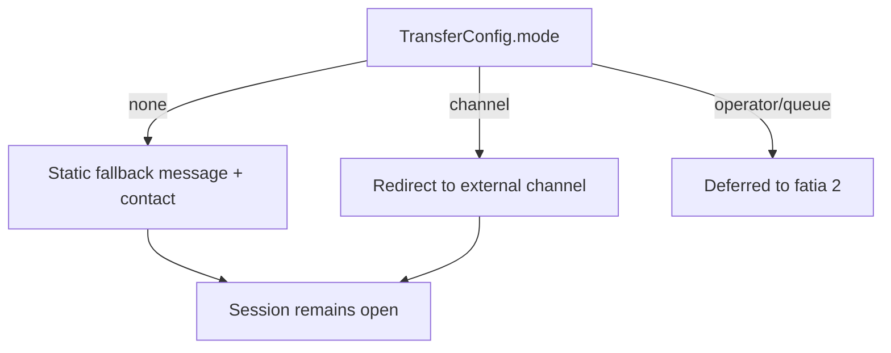
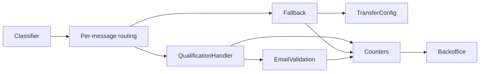

# Error Handling & Fallback Mechanisms

<cite>
**Referenced Files in This Document**
- [DESIGN.md](file://.genie/brainstorms/plataforma-conversa-lead/DESIGN.md)
- [01-actors-and-roles.md](file://docs/sdd/01-actors-and-roles.md)
- [02-user-stories.md](file://docs/sdd/02-user-stories.md)
- [03-functional-spec-backoffice.md](file://docs/sdd/03-functional-spec-backoffice.md)
- [04-transfer-workflow.md](file://docs/sdd/04-transfer-workflow.md)
- [05-campaign-management.md](file://docs/sdd/05-campaign-management.md)
</cite>

## Table of Contents
1. [Introduction](#introduction)
2. [Project Structure](#project-structure)
3. [Core Components](#core-components)
4. [Architecture Overview](#architecture-overview)
5. [Detailed Component Analysis](#detailed-component-analysis)
6. [Dependency Analysis](#dependency-analysis)
7. [Performance Considerations](#performance-considerations)
8. [Troubleshooting Guide](#troubleshooting-guide)
9. [Conclusion](#conclusion)

## Introduction
This document explains how the system handles non-qualification intents and system errors gracefully, while keeping sessions open for potential qualification later. It focuses on:
- A single graceful fallback that recognizes support, scheduling, or sales requests without pretending capability it does not have, providing contact information and staying turn-terminal but session-open.
- Rate limiting protection against abuse and TTL-based session expiration.
- Distinction between legitimate user errors and malicious attempts through edge blocking and separate counters.
- Error recovery strategies and graceful degradation patterns.
- Auditability for blocked requests without polluting session metrics from edge blocks.
- Fallback behaviors for common failures such as LLM provider outages, email validation service failures, and database connectivity issues.

## Project Structure
The error handling and fallback behavior is defined by design documents rather than source code in this repository snapshot. The relevant specifications describe intent classification, routing per message, a unified fallback handler, rate limiting, TTL enforcement, terminal emissions, and backoffice visibility for operators and leadership.

**Diagram sources**
- [DESIGN.md:201-225](file://.genie/brainstorms/plataforma-conversa-lead/DESIGN.md#L201-L225)
- [03-functional-spec-backoffice.md:286-335](file://docs/sdd/03-functional-spec-backoffice.md#L286-L335)

**Section sources**
- [DESIGN.md:201-225](file://.genie/brainstorms/plataforma-conversa-lead/DESIGN.md#L201-L225)
- [03-functional-spec-backoffice.md:286-335](file://docs/sdd/03-functional-spec-backoffice.md#L286-L335)

## Core Components
- Intent classifier with five values: qualificacao, atendimento, agendamento, venda, indefinida. Roteamento reavaliado por mensagem; contagem herdada pela primeira intenção não indefinida da sessão.
- Single qualification handler (qualificacao) that collects structured data and triggers contextual email collection.
- Single graceful fallback for atendimento, agendamento, venda: acknowledges request, provides tenant contact info, does not pretend capability, terminal for turn, not for session.
- Email validation with syntax and disposable domain blocklist; consent as the sending act; monotonic email state field.
- Rate limiting by IP and per-session turn limit; TTL-based session expiry; terminal emission to pre-aggregated counters.
- Edge blocking by IP counted via operational scalar, not session records, to avoid session pollution.
- Backoffice dashboards for monitoring active sessions, leads, counters, and parameters.

**Section sources**
- [DESIGN.md:55-125](file://.genie/brainstorms/plataforma-conversa-lead/DESIGN.md#L55-L125)
- [DESIGN.md:140-167](file://.genie/brainstorms/plataforma-conversa-lead/DESIGN.md#L140-L167)
- [02-user-stories.md:19-36](file://docs/sdd/02-user-stories.md#L19-L36)
- [03-functional-spec-backoffice.md:85-167](file://docs/sdd/03-functional-spec-backoffice.md#L85-L167)

## Architecture Overview
The agent engine routes each incoming message based on current intent:
- qualificacao → qualification handler
- atendimento/agendamento/venda → graceful fallback
- indefinida → clarifying question from agent

Sessions are ephemeral in Postgres with TTL. At TTL or termination, a single terminal emission increments aggregated counter buckets across origem, intencao, estado_email, sessao_valida. Edge blocks by IP are tracked separately as operational scalars.

**Diagram sources**
- [DESIGN.md:55-87](file://.genie/brainstorms/plataforma-conversa-lead/DESIGN.md#L55-L87)
- [DESIGN.md:201-225](file://.genie/brainstorms/plataforma-conversa-lead/DESIGN.md#L201-L225)

**Section sources**
- [DESIGN.md:55-87](file://.genie/brainstorms/plataforma-conversa-lead/DESIGN.md#L55-L87)
- [DESIGN.md:201-225](file://.genie/brainstorms/plataforma-conversa-lead/DESIGN.md#L201-L225)

## Detailed Component Analysis

### Graceful Fallback for Non-Qualification Intents
- Recognizes requests for support, scheduling, or sales without claiming capability.
- Provides tenant contact information and keeps the session open for future qualification turns.
- Turn-terminal only: the next message can still be routed to qualification if intent changes.
- Counter attribution uses the first non-indefinida intent of the session; fallback does not change that attribution.

**Diagram sources**
- [DESIGN.md:55-87](file://.genie/brainstorms/plataforma-conversa-lead/DESIGN.md#L55-L87)
- [02-user-stories.md:19-36](file://docs/sdd/02-user-stories.md#L19-L36)

**Section sources**
- [DESIGN.md:55-87](file://.genie/brainstorms/plataforma-conversa-lead/DESIGN.md#L55-L87)
- [02-user-stories.md:19-36](file://docs/sdd/02-user-stories.md#L19-L36)

### Session TTL and Terminal Emission
- Sessions live in Postgres with TTL; they are discarded after TTL along with transcripts.
- On TTL or closure, the session emits a single terminal increment into pre-aggregated counters across four dimensions: origem, intencao, estado_email, sessao_valida.
- Sessao_valida distinguishes valida, excluida_rate_limit, excluida_teto so abuse and high-engagement exclusions are reported separately.

**Diagram sources**
- [DESIGN.md:121-167](file://.genie/brainstorms/plataforma-conversa-lead/DESIGN.md#L121-L167)
- [DESIGN.md:216-225](file://.genie/brainstorms/plataforma-conversa-lead/DESIGN.md#L216-L225)

**Section sources**
- [DESIGN.md:121-167](file://.genie/brainstorms/plataforma-conversa-lead/DESIGN.md#L121-L167)
- [DESIGN.md:216-225](file://.genie/brainstorms/plataforma-conversa-lead/DESIGN.md#L216-L225)

### Rate Limiting and Abuse Protection
- Rate limit by IP (e.g., 30 messages per IP per hour) protects the public LLM endpoint.
- Per-session turn limit caps conversation depth.
- Requests blocked at the edge by IP do not create session records; they are counted in an operational scalar per IP per day, ensuring auditability without inflating session metrics.
- Exclusions are recorded as sessao_valida = excluida_rate_limit or excluida_teto, separately from valida.

**Diagram sources**
- [DESIGN.md:114-125](file://.genie/brainstorms/plataforma-conversa-lead/DESIGN.md#L114-L125)
- [DESIGN.md:161-167](file://.genie/brainstorms/plataforma-conversa-lead/DESIGN.md#L161-L167)
- [DESIGN.md:414-415](file://.genie/brainstorms/plataforma-conversa-lead/DESIGN.md#L414-L415)

**Section sources**
- [DESIGN.md:114-125](file://.genie/brainstorms/plataforma-conversa-lead/DESIGN.md#L114-L125)
- [DESIGN.md:161-167](file://.genie/brainstorms/plataforma-conversa-lead/DESIGN.md#L161-L167)
- [DESIGN.md:414-415](file://.genie/brainstorms/plataforma-conversa-lead/DESIGN.md#L414-L415)

### Distinguishing Legitimate Errors vs Malicious Attempts
- Legitimate user errors (e.g., undefined intent) receive clarifying questions and remain within normal session flow.
- Malicious attempts (automated or abusive traffic) are contained by rate limiting and edge blocking; these are audited via operational scalars and excluded from valid session counts.
- Teto de mensagens captures highly engaged sessions that exceed turn limits; these are also excluded from N and reported separately.

**Section sources**
- [DESIGN.md:55-87](file://.genie/brainstorms/plataforma-conversa-lead/DESIGN.md#L55-L87)
- [DESIGN.md:114-125](file://.genie/brainstorms/plataforma-conversa-lead/DESIGN.md#L114-L125)
- [DESIGN.md:161-167](file://.genie/brainstorms/plataforma-conversa-lead/DESIGN.md#L161-L167)
- [DESIGN.md:388-399](file://.genie/brainstorms/plataforma-conversa-lead/DESIGN.md#L388-L399)

### Error Recovery Strategies and Graceful Degradation
- If the LLM provider is unavailable:
  - Return a short clarifying prompt for indefinida cases or a polite fallback acknowledging inability to process at the moment, while keeping the session open.
  - Do not emit a lead or alter session attribution; rely on retry cadence and operator visibility.
- If email validation fails:
  - Retry once; if persistent failure, log and continue the conversation without blocking the session.
  - Maintain monotonic email state progression; do not force consent or identification when validation is down.
- If database connectivity fails:
  - Queue or defer terminal emissions until connectivity resumes; ensure idempotent upserts to avoid double counting.
  - Surface degraded mode to backoffice dashboards with clear indicators.

[No sources needed since this section provides general guidance derived from design constraints]

### Transfer Configuration and Fallback Integration
- Transfer configuration supports mode none (static fallback), channel (external redirect), and deferred operator/queue flows.
- Trigger 1 (“Não há”) is implemented as the current static fallback; triggers 2 and 3 are deferred due to live handoff requirements.
- Separate scalar counter tracks transfer events independently from the main bucket.

**Diagram sources**
- [04-transfer-workflow.md:20-58](file://docs/sdd/04-transfer-workflow.md#L20-L58)
- [04-transfer-workflow.md:80-99](file://docs/sdd/04-transfer-workflow.md#L80-L99)
- [04-transfer-workflow.md:252-267](file://docs/sdd/04-transfer-workflow.md#L252-L267)

**Section sources**
- [04-transfer-workflow.md:20-58](file://docs/sdd/04-transfer-workflow.md#L20-L58)
- [04-transfer-workflow.md:80-99](file://docs/sdd/04-transfer-workflow.md#L80-L99)
- [04-transfer-workflow.md:252-267](file://docs/sdd/04-transfer-workflow.md#L252-L267)

### Backoffice Visibility and Auditability
- Operators monitor active sessions, review leads, and view daily metrics including excluded sessions and edge blocks.
- Leadership configures operational parameters (TTL, rate limits, turn limits) with audit logs.
- Gestão reviews go/no-go evidence and compliance reports.
- All administrative actions are logged immutably for audit purposes.

**Section sources**
- [03-functional-spec-backoffice.md:85-167](file://docs/sdd/03-functional-spec-backoffice.md#L85-L167)
- [03-functional-spec-backoffice.md:170-222](file://docs/sdd/03-functional-spec-backoffice.md#L170-L222)
- [03-functional-spec-backoffice.md:263-281](file://docs/sdd/03-functional-spec-backoffice.md#L263-L281)

## Dependency Analysis
- Classifier depends on message content; its output drives routing decisions per message.
- Qualification handler depends on classifier output and triggers email modal under conditions.
- Fallback depends on classifier output and transfer configuration.
- Email validation depends on syntax rules and blocklist; failures degrade gracefully without blocking session.
- Counters depend on terminal emissions; they aggregate across dimensions without correlating sessions.
- Backoffice depends on counters, session state, and audit logs for visibility and control.

**Diagram sources**
- [DESIGN.md:55-87](file://.genie/brainstorms/plataforma-conversa-lead/DESIGN.md#L55-L87)
- [DESIGN.md:201-225](file://.genie/brainstorms/plataforma-conversa-lead/DESIGN.md#L201-L225)
- [03-functional-spec-backoffice.md:286-335](file://docs/sdd/03-functional-spec-backoffice.md#L286-L335)

**Section sources**
- [DESIGN.md:55-87](file://.genie/brainstorms/plataforma-conversa-lead/DESIGN.md#L55-L87)
- [DESIGN.md:201-225](file://.genie/brainstorms/plataforma-conversa-lead/DESIGN.md#L201-L225)
- [03-functional-spec-backoffice.md:286-335](file://docs/sdd/03-functional-spec-backoffice.md#L286-L335)

## Performance Considerations
- Pre-aggregated counters reduce query load and avoid per-session timestamp storage.
- TTL-based session cleanup prevents unbounded growth of session tables.
- Edge blocking avoids creating session records for abusive traffic, keeping mechanisms cost-effective.
- Separate reporting for rate limit and turn limit exclusions ensures accurate metrics without conflating abuse with engagement.

[No sources needed since this section provides general guidance]

## Troubleshooting Guide
Common failure scenarios and recommended responses:
- LLM provider outage:
  - Return clarifying or fallback messages; keep session open; retry on next message; log outage events for leadership visibility.
- Email validation service failure:
  - Retry once; proceed without forcing identification; log failures; maintain monotonic email state; alert backoffice if persistent.
- Database connectivity issue:
  - Defer terminal emissions; ensure idempotent upserts; surface degraded mode in dashboards; resume normal operation upon recovery.
- Rate limit exceeded:
  - Block at edge; increment operational scalar; inform user politely; allow session to continue if within per-session turn limits.
- Turn limit exceeded:
  - Mark sessao_valida = excluida_teto; exclude from N; emit terminal count; continue conversation if configured otherwise.

**Section sources**
- [DESIGN.md:114-125](file://.genie/brainstorms/plataforma-conversa-lead/DESIGN.md#L114-L125)
- [DESIGN.md:161-167](file://.genie/brainstorms/plataforma-conversa-lead/DESIGN.md#L161-L167)
- [DESIGN.md:216-225](file://.genie/brainstorms/plataforma-conversa-lead/DESIGN.md#L216-L225)
- [03-functional-spec-backoffice.md:153-167](file://docs/sdd/03-functional-spec-backoffice.md#L153-L167)

## Conclusion
The system implements a robust error handling and fallback strategy centered on a single graceful fallback that recognizes non-qualification intents without overstating capabilities, while keeping sessions open for potential qualification later. Rate limiting and TTL-based expiration protect resources and ensure clean metrics. Edge blocking and separate counters provide auditability without polluting session data. Error recovery and graceful degradation patterns handle provider outages, validation failures, and database issues. Backoffice visibility ensures operational control and compliance oversight.