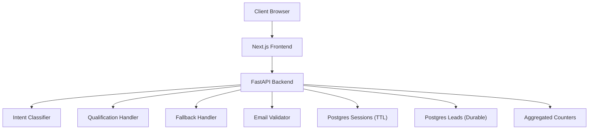
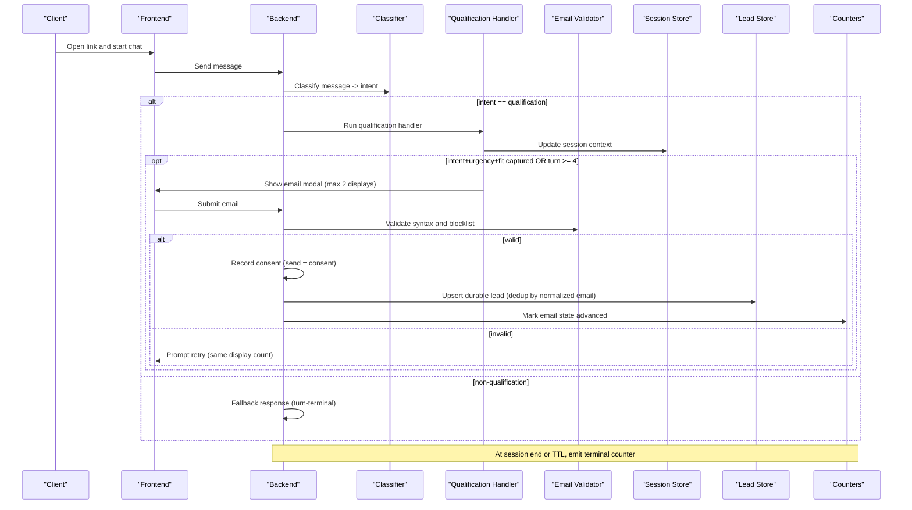
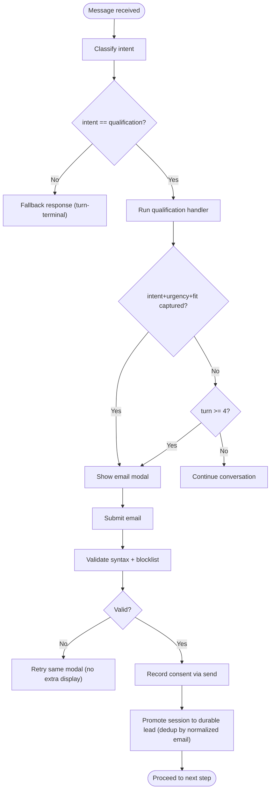
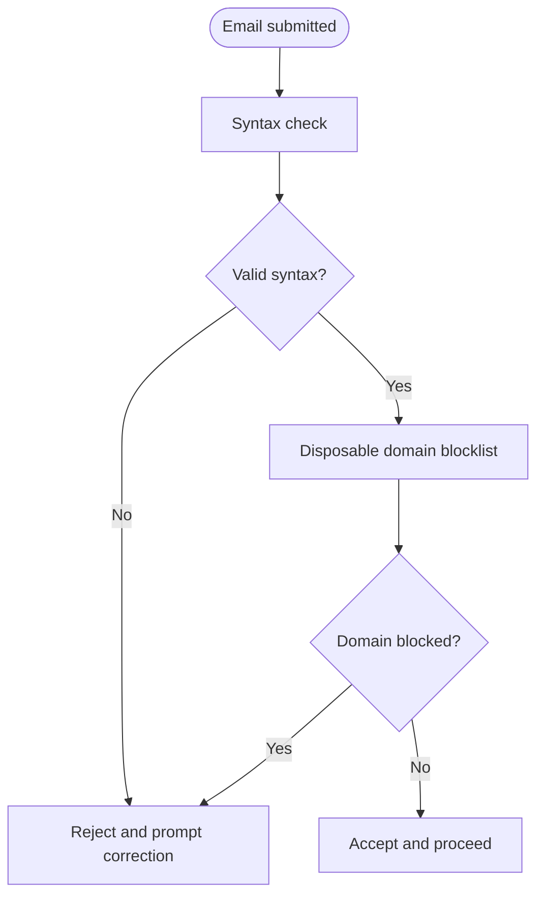
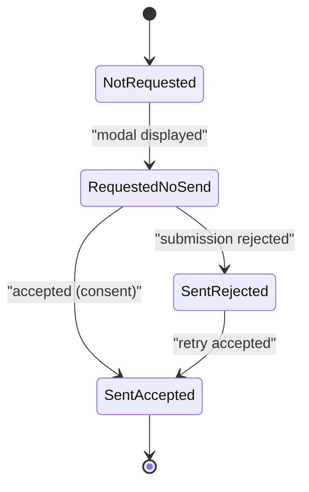
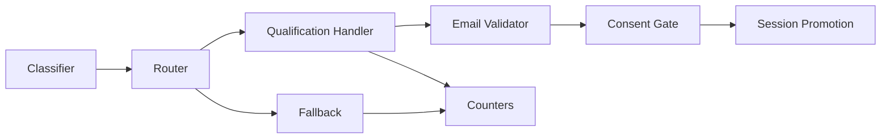

# Handler Execution Flow

<cite>
**Referenced Files in This Document**
- [DESIGN.md](file://.genie/brainstorms/plataforma-conversa-lead/DESIGN.md)
- [DRAFT.md](file://.genie/brainstorms/plataforma-conversa-lead/DRAFT.md)
- [02-user-stories.md](file://docs/sdd/02-user-stories.md)
- [04-transfer-workflow.md](file://docs/sdd/04-transfer-workflow.md)
</cite>

## Table of Contents
1. Introduction
2. Project Structure
3. Core Components
4. Architecture Overview
5. Detailed Component Analysis
6. Dependency Analysis
7. Performance Considerations
8. Troubleshooting Guide
9. Conclusion

## Introduction
This document describes the handler execution flow that processes qualified leads through structured data capture and email collection workflows. It focuses on:
- The qualification handler’s role in discovering intent, urgency, and fit
- Triggering contextual email collection when conditions are met (captured intent + urgency + fit, or by turn 4 maximum)
- Email validation (syntax checking and disposable domain blocking)
- Consent management where sending the email serves as affirmative consent
- Promotion of anonymous sessions to durable lead records with deduplication by normalized email
- Two-display limit for the email collection modal
- Retry logic for invalid emails
- Monotonic email state progression from not_requested through sent_accepted
- Concrete invocation patterns, error handling, and integration points

The content is derived from the project’s design and specification documents.

**Section sources**
- [DESIGN.md:53-108](file://.genie/brainstorms/plataforma-conversa-lead/DESIGN.md#L53-L108)
- [DESIGN.md:215-223](file://.genie/brainstorms/plataforma-conversa-lead/DESIGN.md#L215-L223)
- [DESIGN.md:388-397](file://.genie/brainstorms/plataforma-conversa-lead/DESIGN.md#L388-L397)
- [02-user-stories.md:19-45](file://docs/sdd/02-user-stories.md#L19-L45)

## Project Structure
At a high level, the system comprises:
- A Next.js frontend serving a landing page and chat interface
- A Python backend (FastAPI) implementing the agent engine: classifier, qualification handler, fallback, email validation, and session-to-lead promotion
- Postgres for ephemeral sessions and durable lead records
- Aggregated counters for analytics without per-session PII

**Diagram sources**
- [DESIGN.md:191-202](file://.genie/brainstorms/plataforma-conversa-lead/DESIGN.md#L191-L202)
- [DESIGN.md:215-223](file://.genie/brainstorms/plataforma-conversa-lead/DESIGN.md#L215-L223)

**Section sources**
- [DESIGN.md:191-202](file://.genie/brainstorms/plataforma-conversa-lead/DESIGN.md#L191-L202)

## Core Components
- Intent classifier: maps each message to an intent label used for routing decisions per message
- Qualification handler: discovers intent, urgency, and fit; triggers contextual email collection under defined conditions
- Fallback handler: gracefully responds to non-qualification intents; terminal for the turn but not the session
- Email validator: checks syntax and blocks disposable domains
- Consent gate: sending the email is the affirmative consent act for this conversation’s commercial follow-up
- Session promotion: promotes anonymous session to a durable lead record upon successful email submission, with deduplication by normalized email
- Counters: emits a single terminal aggregation at session end/TTL across dimensions including email state

Key behaviors:
- Routing re-evaluated per message; counter aggregates per session based on first labeled intent
- Email modal triggered by qualification handler when intent+urgency+fit captured or by turn 4 maximum; max two displays per session
- Monotonic email state progression ensures consistency between metrics and durable leads

**Section sources**
- [DESIGN.md:53-108](file://.genie/brainstorms/plataforma-conversa-lead/DESIGN.md#L53-L108)
- [DESIGN.md:215-223](file://.genie/brainstorms/plataforma-conversa-lead/DESIGN.md#L215-L223)
- [DESIGN.md:388-397](file://.genie/brainstorms/plataforma-conversa-lead/DESIGN.md#L388-L397)
- [02-user-stories.md:19-45](file://docs/sdd/02-user-stories.md#L19-L45)

## Architecture Overview
The execution flow begins with a client opening a link and chatting anonymously. Each message is classified; if the current message intent is qualification, the qualification handler runs. When it captures intent, urgency, and fit, it triggers the email collection modal. If not captured by turn 4, the modal is shown as a ceiling. Email validation enforces syntax and disposable domain blocklist. On acceptance, consent is recorded and the session is promoted to a durable lead with deduplication by normalized email. At session end or TTL expiry, a terminal counter emission occurs.

**Diagram sources**
- [DESIGN.md:53-108](file://.genie/brainstorms/plataforma-conversa-lead/DESIGN.md#L53-L108)
- [DESIGN.md:215-223](file://.genie/brainstorms/plataforma-conversa-lead/DESIGN.md#L215-L223)
- [DESIGN.md:388-397](file://.genie/brainstorms/plataforma-conversa-lead/DESIGN.md#L388-L397)

## Detailed Component Analysis

### Qualification Handler and Email Collection Trigger
- Purpose: Discover intent, urgency, and fit; produce structured output for the tenant’s commercial team
- Trigger conditions:
  - Contextual trigger: after capturing intent + urgency + fit
  - Ceiling trigger: by turn 4 maximum
- Display limits:
  - Maximum two displays per session
  - Validation failures reopen the same screen without counting as a new display
- Behavior:
  - Only the qualification handler requests email; fallback never does
  - Modal includes value proposition explaining commercial follow-up for this conversation

**Diagram sources**
- [DESIGN.md:53-108](file://.genie/brainstorms/plataforma-conversa-lead/DESIGN.md#L53-L108)
- [DESIGN.md:388-397](file://.genie/brainstorms/plataforma-conversa-lead/DESIGN.md#L388-L397)

**Section sources**
- [DESIGN.md:53-108](file://.genie/brainstorms/plataforma-conversa-lead/DESIGN.md#L53-L108)
- [DESIGN.md:388-397](file://.genie/brainstorms/plataforma-conversa-lead/DESIGN.md#L388-L397)
- [02-user-stories.md:19-45](file://docs/sdd/02-user-stories.md#L19-L45)

### Email Validation and Retry Logic
- Syntax checking: rejects malformed emails
- Disposable domain blocking: uses a public blocklist to prevent disposable addresses
- Retry behavior:
  - Invalid submissions reopen the same modal without incrementing the display counter
  - Allows correction within the same attempt

**Diagram sources**
- [DESIGN.md:99-100](file://.genie/brainstorms/plataforma-conversa-lead/DESIGN.md#L99-L100)
- [DESIGN.md:395-397](file://.genie/brainstorms/plataforma-conversa-lead/DESIGN.md#L395-L397)

**Section sources**
- [DESIGN.md:99-100](file://.genie/brainstorms/plataforma-conversa-lead/DESIGN.md#L99-L100)
- [DESIGN.md:395-397](file://.genie/brainstorms/plataforma-conversa-lead/DESIGN.md#L395-L397)

### Consent Management
- Consent model: sending the email is the affirmative consent act for the tenant’s commercial team to return about this conversation
- Scope: limited to fatia 1 purpose; marketing consent is handled separately
- Implication: there is no state representing “email provided but consent refused”; refusing means not sending

**Section sources**
- [DESIGN.md:101-108](file://.genie/brainstorms/plataforma-conversa-lead/DESIGN.md#L101-L108)
- [02-user-stories.md:38-45](file://docs/sdd/02-user-stories.md#L38-L45)

### Session Promotion and Deduplication
- Promotion: upon accepted email submission, the anonymous session is promoted to a durable lead record
- Deduplication: by normalized email (trim + lowercase)
- Recording: consent and purpose are stored with the lead

**Section sources**
- [DESIGN.md:107-108](file://.genie/brainstorms/plataforma-conversa-lead/DESIGN.md#L107-L108)
- [DESIGN.md:215-223](file://.genie/brainstorms/plataforma-conversa-lead/DESIGN.md#L215-L223)

### Monotonic Email State Progression
- State field: monotonic progression ensuring impossible combinations cannot be represented
- Values: not_requested → requested_no_send → sent_rejected → sent_accepted
- Rule: store the maximum achieved during the session to avoid divergence between metrics and durable leads

**Diagram sources**
- [DESIGN.md:142-146](file://.genie/brainstorms/plataforma-conversa-lead/DESIGN.md#L142-L146)
- [DESIGN.md:215-223](file://.genie/brainstorms/plataforma-conversa-lead/DESIGN.md#L215-L223)

**Section sources**
- [DESIGN.md:142-146](file://.genie/brainstorms/plataforma-conversa-lead/DESIGN.md#L142-L146)
- [DESIGN.md:215-223](file://.genie/brainstorms/plataforma-conversa-lead/DESIGN.md#L215-L223)

### Invocation Patterns and Error Handling
- Invocation pattern:
  - Per-message classification routes to qualification handler when intent equals qualification
  - Qualification handler runs and may trigger email modal based on captured fields or turn ceiling
- Error handling:
  - Invalid email syntax or blocked domain results in retry within the same modal display
  - Fallback responses are turn-terminal but do not close the session; subsequent qualification messages resume the handler
- Integration points:
  - Frontend renders modal and collects input
  - Backend validates and persists outcomes
  - Counters updated at session end/TTL

**Section sources**
- [DESIGN.md:53-108](file://.genie/brainstorms/plataforma-conversa-lead/DESIGN.md#L53-L108)
- [DESIGN.md:388-397](file://.genie/brainstorms/plataforma-conversa-lead/DESIGN.md#L388-L397)

### Conceptual Overview
Conceptually, the system balances low-friction entry with timely identification:
- Anonymous chat lowers initial friction
- Contextual email request increases relevance and consent quality
- Strict validation and consent semantics protect data integrity and compliance
- Monotonic state and aggregated counters ensure robust measurement without PII

[No sources needed since this section provides conceptual guidance]

## Dependency Analysis
The handler execution depends on several components and contracts:
- Classifier determines routing per message
- Qualification handler depends on session context and turn count
- Email validator depends on syntax rules and blocklist
- Consent and promotion depend on successful validation
- Counters depend on session lifecycle events

**Diagram sources**
- [DESIGN.md:53-108](file://.genie/brainstorms/plataforma-conversa-lead/DESIGN.md#L53-L108)
- [DESIGN.md:215-223](file://.genie/brainstorms/plataforma-conversa-lead/DESIGN.md#L215-L223)

**Section sources**
- [DESIGN.md:53-108](file://.genie/brainstorms/plataforma-conversa-lead/DESIGN.md#L53-L108)
- [DESIGN.md:215-223](file://.genie/brainstorms/plataforma-conversa-lead/DESIGN.md#L215-L223)

## Performance Considerations
- Rate limiting protects the LLM endpoint and controls costs
- Session TTL ensures ephemeral data cleanup while preserving aggregated counters
- Two-display limit reduces modal fatigue and stabilizes metrics
- Monotonic email state avoids complex reconciliation overhead
- Aggregated counters minimize storage and privacy risks

[No sources needed since this section provides general guidance]

## Troubleshooting Guide
Common issues and resolutions:
- Email validation failures:
  - Check syntax and disposable domain blocklist
  - Allow retry within the same modal display
- Modal not appearing:
  - Verify qualification handler captured required fields or turn ceiling reached
  - Ensure routing is per-message and not frozen to first intent
- Consent divergence:
  - Confirm sending email records consent and advances email state
  - Validate promotion only occurs on accepted submissions
- Counter inconsistencies:
  - Ensure terminal emission occurs at session end or TTL
  - Verify email state progression is monotonic and reflects maximum achieved

**Section sources**
- [DESIGN.md:99-108](file://.genie/brainstorms/plataforma-conversa-lead/DESIGN.md#L99-L108)
- [DESIGN.md:142-146](file://.genie/brainstorms/plataforma-conversa-lead/DESIGN.md#L142-L146)
- [DESIGN.md:388-397](file://.genie/brainstorms/plataforma-conversa-lead/DESIGN.md#L388-L397)

## Conclusion
The handler execution flow centers on a qualification handler that discovers intent, urgency, and fit and triggers contextual email collection under clear conditions. Email validation and consent semantics ensure data quality and compliance, while session promotion and deduplication create durable lead records. Monotonic email state progression and aggregated counters provide reliable measurement without retaining per-session PII. The design balances user experience, operational safety, and analytical rigor for the pilot phase.

[No sources needed since this section summarizes without analyzing specific files]