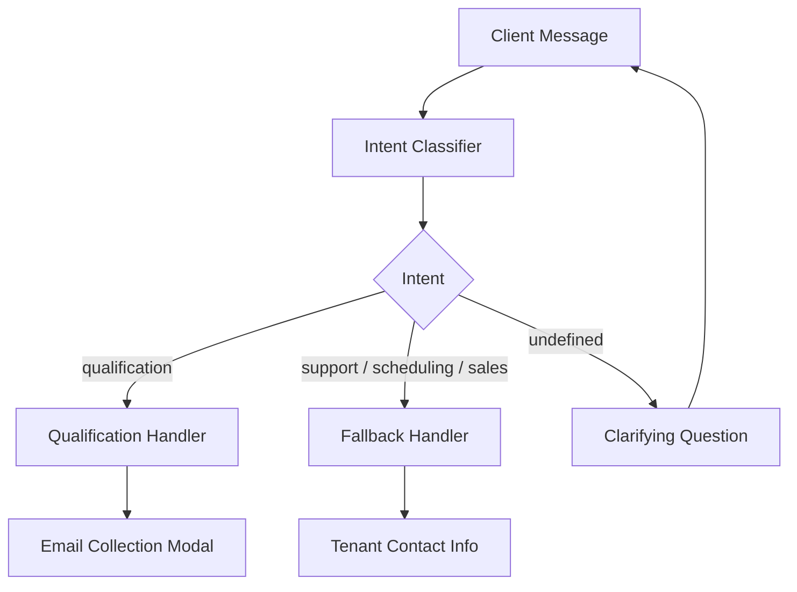
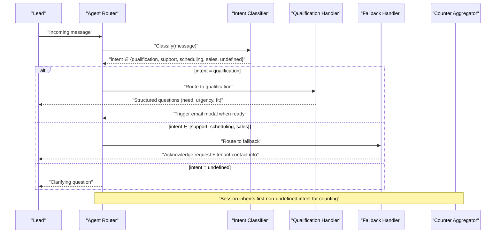
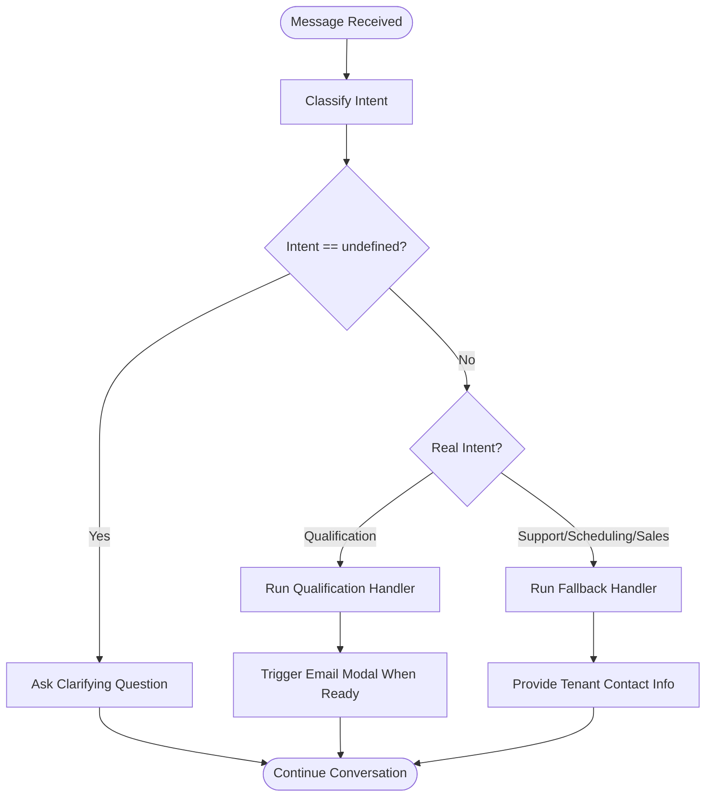
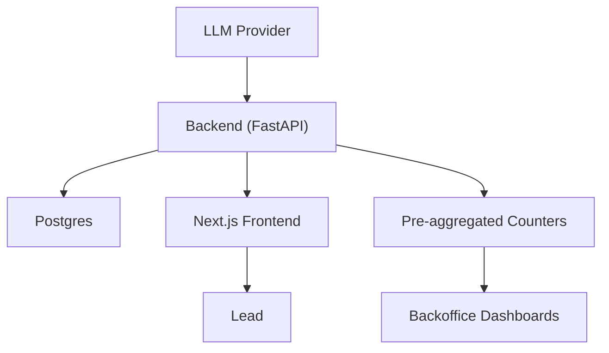

# Intent Classification Engine

<cite>
**Referenced Files in This Document**
- [DESIGN.md](file://.genie/brainstorms/plataforma-conversa-lead/DESIGN.md)
- [01-actors-and-roles.md](file://docs/sdd/01-actors-and-roles.md)
- [02-user-stories.md](file://docs/sdd/02-user-stories.md)
- [03-functional-spec-backoffice.md](file://docs/sdd/03-functional-spec-backoffice.md)
- [04-transfer-workflow.md](file://docs/sdd/04-transfer-workflow.md)
</cite>

## Table of Contents
1. [Introduction](#introduction)
2. [Project Structure](#project-structure)
3. [Core Components](#core-components)
4. [Architecture Overview](#architecture-overview)
5. [Detailed Component Analysis](#detailed-component-analysis)
6. [Dependency Analysis](#dependency-analysis)
7. [Performance Considerations](#performance-considerations)
8. [Troubleshooting Guide](#troubleshooting-guide)
9. [Conclusion](#conclusion)

## Introduction
This document describes the intent classification engine for the Sup Better Engine’s lead conversation platform. The engine analyzes each incoming message to classify it into one of five intents: qualification, support (atendimento), scheduling (agendamento), sales (venda), or undefined (abstention). It explains how messages are evaluated independently per turn, how confidence and abstention work, how ambiguous or greeting messages are treated as undefined, and how the system integrates with LLM providers for natural language understanding. It also covers validation using labeled datasets, accuracy requirements, and error handling strategies for misclassifications.

The intent classifier is a single-purpose unit that maps each message to an intent label. Routing decisions are made per message, while session-level aggregation uses the first non-undefined intent to avoid compounding classification errors over multiple turns.

## Project Structure
The repository contains design and specification documents that define the intent classification behavior, routing rules, validation criteria, and integration points. There is no source code in this snapshot; the implementation details below are derived from the documented specifications.

[No sources needed since this diagram shows conceptual workflow, not actual code structure]

## Core Components
- Intent classifier: Maps each message to one of five intents: qualification, support, scheduling, sales, or undefined (abstention). Undefined is an explicit abstention for greetings and messages without clear intent.
- Per-message routing: Each message is re-evaluated for intent at every turn. Routing is independent per message, not frozen by earlier turns.
- Session aggregation: The session inherits the first non-undefined intent produced by any message. This protects metrics from compounding per-message classification errors.
- Handlers:
  - Qualification handler: Collects need, urgency, fit, and produces structured output for the tenant’s commercial team.
  - Fallback handler: Acknowledges non-qualification intents and provides tenant contact information. It is terminal for the turn but not for the session.
- Email collection modal: Triggered contextually after capturing intent, urgency, and fit, or at a defined turn threshold if not captured earlier. Limited to two displays per session.
- Counters and buckets: Anonymous pre-aggregated counters track dimensions including origin, intent, email state, and session validity. These are used for reporting and go/no-go evaluation.

Key behaviors:
- Undefined abstention prevents forcing a label onto greetings or noise.
- Routing is per message; counting is per session.
- Fallback does not collect email; only qualification triggers the email modal.

**Section sources**
- [DESIGN.md:53-85](file://.genie/brainstorms/plataforma-conversa-lead/DESIGN.md#L53-L85)
- [DESIGN.md:127-151](file://.genie/brainstorms/plataforma-conversa-lead/DESIGN.md#L127-L151)
- [DESIGN.md:225-232](file://.genie/brainstorms/plataforma-conversa-lead/DESIGN.md#L225-L232)
- [DESIGN.md:386-399](file://.genie/brainstorms/plataforma-conversa-lead/DESIGN.md#L386-L399)

## Architecture Overview
The architecture separates concerns between classification, routing, handlers, and analytics. The classifier is decoupled from handlers via a simple contract: message → intent. Routing reads the current message’s intent to decide which handler responds. Counting aggregates per session to protect metrics from error composition across turns.

**Diagram sources**
- [DESIGN.md:53-85](file://.genie/brainstorms/plataforma-conversa-lead/DESIGN.md#L53-L85)
- [DESIGN.md:225-232](file://.genie/brainstorms/plataforma-conversa-lead/DESIGN.md#L225-L232)
- [DESIGN.md:386-399](file://.genie/brainstorms/plataforma-conversa-lead/DESIGN.md#L386-L399)

## Detailed Component Analysis

### Intent Classifier
Responsibilities:
- Analyze each incoming message independently.
- Classify into one of five intents: qualification, support, scheduling, sales, or undefined (abstention).
- Treat greetings and ambiguous messages as undefined to prevent contaminating intent distribution.

Validation and accuracy:
- Validated against a labeled dataset of ≥125 messages, with ≥25 examples per real intent and ≥25 examples of abstention.
- Accuracy requirement: ≥85% on the four real intents combined.
- Abstention requirement: Greetings must not be labeled as one of the four real intents in more than 15% of cases.

Integration with LLM providers:
- The backend Python service hosts the agent motor, including the classifier and handlers.
- Rate limiting protects the public LLM endpoint.
- Data retention policy requires zero retention by the LLM provider and a signed data processing agreement prior to pilot sessions.

Error handling and misclassification:
- Misclassification can route qualification requests to fallback or vice versa.
- Monitoring includes tracking fallback rate in production as a drift signal.
- If misclassification occurs, the per-message routing still allows subsequent messages to correct course (e.g., later qualification request routed correctly).

Operational notes:
- The classifier is a single-purpose unit with an explicit interface: message → intent.
- It is testable in isolation using the labeled message set.

**Section sources**
- [DESIGN.md:53-85](file://.genie/brainstorms/plataforma-conversa-lead/DESIGN.md#L53-L85)
- [DESIGN.md:225-232](file://.genie/brainstorms/plataforma-conversa-lead/DESIGN.md#L225-L232)
- [DESIGN.md:386-399](file://.genie/brainstorms/plataforma-conversa-lead/DESIGN.md#L386-L399)
- [DESIGN.md:376-384](file://.genie/brainstorms/plataforma-conversa-lead/DESIGN.md#L376-L384)

### Routing and Handlers
Routing logic:
- Re-evaluate intent per message.
- Qualification → qualification handler.
- Support, scheduling, sales → fallback handler.
- Undefined → clarifying question from the agent.

Handlers:
- Qualification handler: Captures intent, urgency, fit; triggers contextual email modal when ready or at a turn threshold.
- Fallback handler: Acknowledges request, provides tenant contact info; terminal for the turn but not for the session.

Email modal:
- Triggered by qualification handler.
- Appears after capturing intent, urgency, fit, or at a defined turn threshold if not captured earlier.
- Maximum two displays per session; validation includes syntax and disposable domain blocklist.

**Section sources**
- [DESIGN.md:53-85](file://.genie/brainstorms/plataforma-conversa-lead/DESIGN.md#L53-L85)
- [DESIGN.md:86-111](file://.genie/brainstorms/plataforma-conversa-lead/DESIGN.md#L86-L111)
- [DESIGN.md:386-399](file://.genie/brainstorms/plataforma-conversa-lead/DESIGN.md#L386-L399)

### Session Aggregation and Counters
Aggregation rule:
- The session inherits the first non-undefined intent produced by any message.
- This avoids compounding per-message classification errors into session-level metrics.

Counters:
- Anonymous pre-aggregated counters track dimensions: origin, intent, email state, session validity.
- Terminal emission occurs upon session close or TTL expiry.
- No session identifiers or timestamps are persisted in counters.

Backoffice visibility:
- Operator dashboards show sessions with status, intent, turn count, time active.
- Lead lists include email, intent, urgency, fit, timestamp, source.
- Filters include intent, urgency, fit, date range, source.

**Section sources**
- [DESIGN.md:53-85](file://.genie/brainstorms/plataforma-conversa-lead/DESIGN.md#L53-L85)
- [DESIGN.md:127-151](file://.genie/brainstorms/plataforma-conversa-lead/DESIGN.md#L127-L151)
- [03-functional-spec-backoffice.md:85-167](file://docs/sdd/03-functional-spec-backoffice.md#L85-L167)

### Transfer Workflow Integration
Transfer triggers:
- None configured: fallback message with tenant contact info.
- Operator/system decision: queue or channel transfer (deferred in fatia 1).
- Client-requested transfer: keyword matching (fatia 1); NLU extension planned for fatia 2.

Impact on classifier:
- Add transfer_request as sub-intent or keyword layer to detect client-requested transfers.
- In fatia 1, transfer events are tracked via scalar counters rather than expanding bucket dimensions.

**Section sources**
- [04-transfer-workflow.md:80-135](file://docs/sdd/04-transfer-workflow.md#L80-L135)
- [04-transfer-workflow.md:152-193](file://docs/sdd/04-transfer-workflow.md#L152-L193)
- [04-transfer-workflow.md:239-267](file://docs/sdd/04-transfer-workflow.md#L239-L267)

### Conceptual Overview

[No sources needed since this diagram shows conceptual workflow, not actual code structure]

## Dependency Analysis
The intent classification engine depends on:
- LLM provider for natural language understanding (protected by rate limiting and retention policies).
- Backend Python service hosting the agent motor (classifier and handlers).
- Postgres for ephemeral session storage and lead records.
- Backoffice dashboards for operational visibility and metrics.

**Diagram sources**
- [DESIGN.md:191-213](file://.genie/brainstorms/plataforma-conversa-lead/DESIGN.md#L191-L213)
- [03-functional-spec-backoffice.md:284-335](file://docs/sdd/03-functional-spec-backoffice.md#L284-L335)

**Section sources**
- [DESIGN.md:191-213](file://.genie/brainstorms/plataforma-conversa-lead/DESIGN.md#L191-L213)
- [03-functional-spec-backoffice.md:284-335](file://docs/sdd/03-functional-spec-backoffice.md#L284-L335)

## Performance Considerations
- Real-time classification: Each message is classified independently; ensure low-latency inference to maintain conversational flow.
- Rate limiting: Protects the LLM endpoint from abuse and cost spikes.
- Turn limits: Prevent excessive conversation depth; dimensioned based on historical WhatsApp conversations.
- Session TTL: Ephemeral sessions expire after a defined period; counters emit terminal increments.
- Throughput: Pre-aggregated counters reduce database load for reporting.

[No sources needed since this section provides general guidance]

## Troubleshooting Guide
Common issues and strategies:
- Misclassification: Monitor fallback rate in production as a drift signal. If qualification requests are incorrectly routed to fallback, adjust classifier prompts or thresholds.
- Undefined overload: If too many messages are classified as undefined, refine training data or add keyword heuristics for common greetings.
- Email modal not triggering: Ensure qualification handler captures intent, urgency, and fit before triggering modal; verify turn threshold logic.
- Transfer requests: Implement keyword detection for client-requested transfers; extend to NLU-based detection in future phases.

Validation checklist:
- Labeled dataset coverage: ≥125 messages, ≥25 per real intent, ≥25 abstention examples.
- Accuracy thresholds: ≥85% on real intents; ≤15% false positive rate for abstention on greetings.
- Operational metrics: Track fallback rate, undefined rate, and session conversion rates.

**Section sources**
- [DESIGN.md:386-399](file://.genie/brainstorms/plataforma-conversa-lead/DESIGN.md#L386-L399)
- [04-transfer-workflow.md:152-193](file://docs/sdd/04-transfer-workflow.md#L152-L193)

## Conclusion
The intent classification engine is a focused component that enables precise routing of lead conversations. By classifying each message independently and aggregating per session, the system balances responsiveness with metric integrity. The undefined abstention protects intent distributions from noise, while strict validation ensures high accuracy. Integration with LLM providers is safeguarded by rate limiting and retention policies. Operational dashboards provide visibility into performance and quality, enabling continuous improvement and informed go/no-go decisions.

[No sources needed since this section summarizes without analyzing specific files]