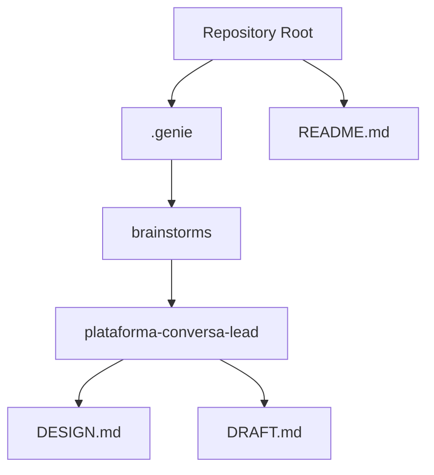
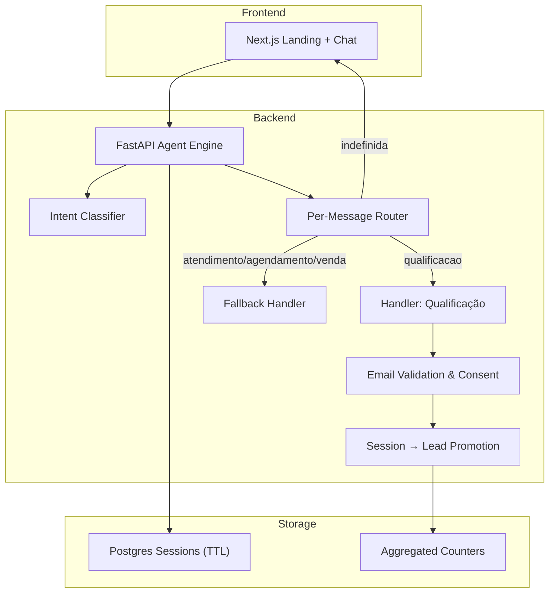
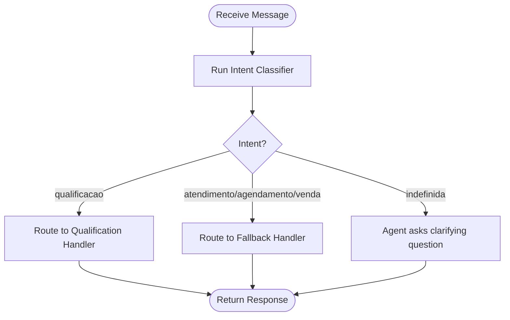
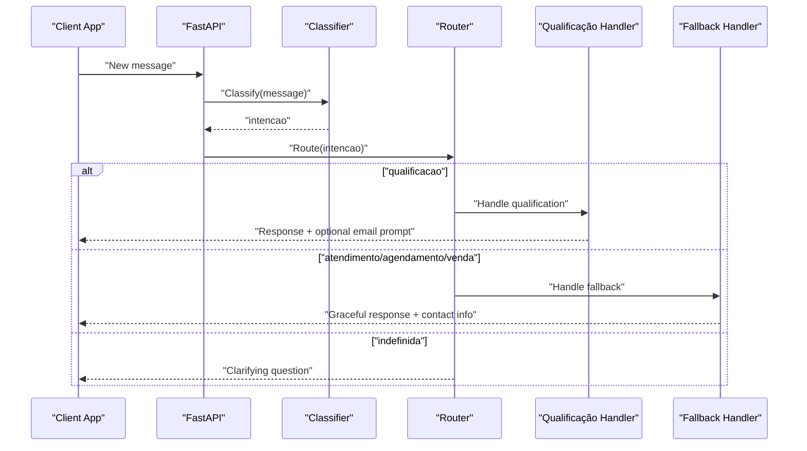
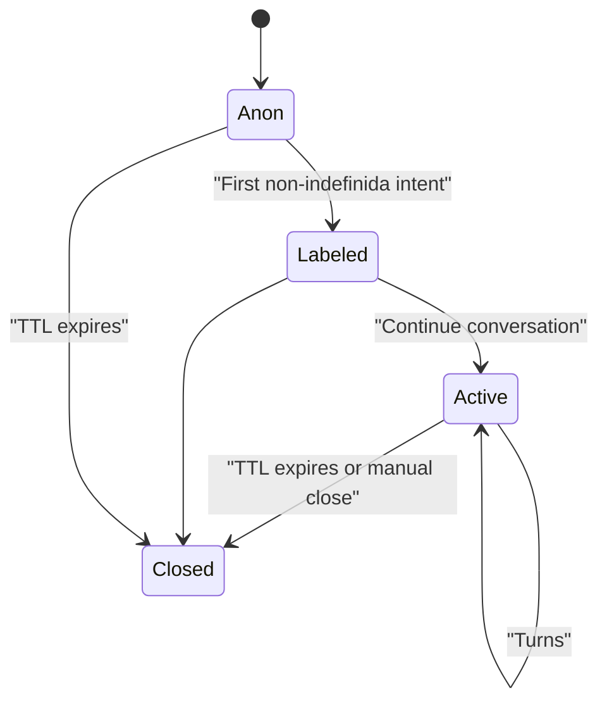
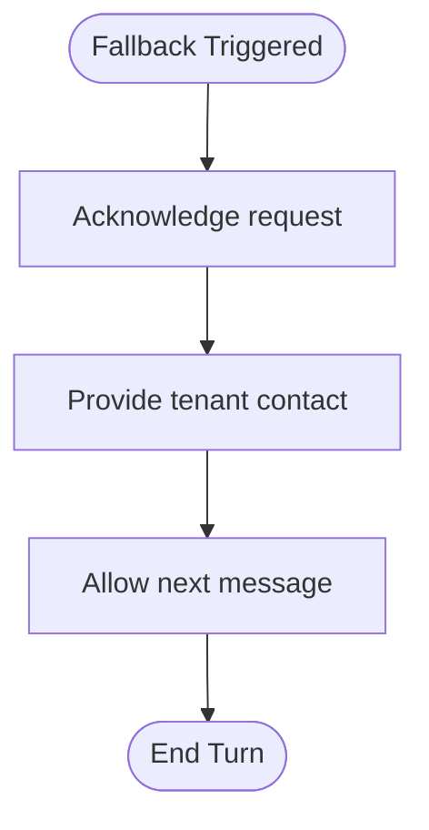
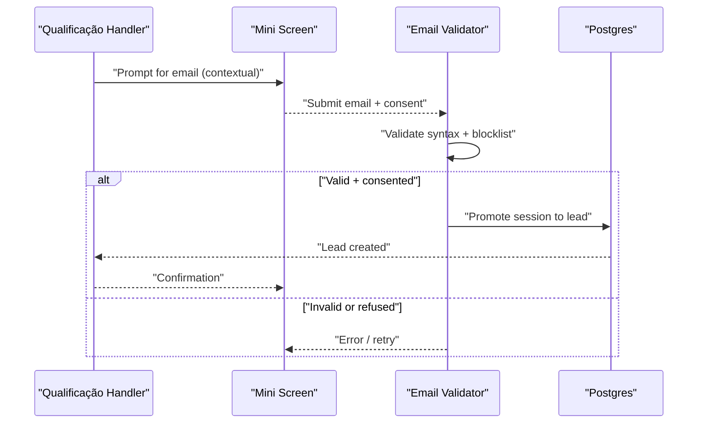
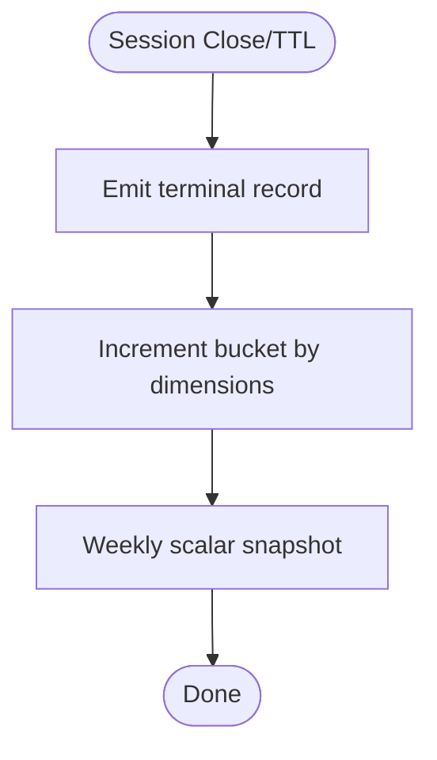
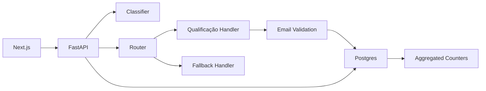

# Message Processing Pipeline

<cite>
**Referenced Files in This Document**
- [README.md](file://README.md)
- [.genie/INDEX.md](file://.genie/INDEX.md)
- [.genie/brainstorms/plataforma-conversa-lead/DESIGN.md](file://.genie/brainstorms/plataforma-conversa-lead/DESIGN.md)
- [.genie/brainstorms/plataforma-conversa-lead/DRAFT.md](file://.genie/brainstorms/plataforma-conversa-lead/DRAFT.md)
</cite>

## Table of Contents
1. [Introduction](#introduction)
2. [Project Structure](#project-structure)
3. [Core Components](#core-components)
4. [Architecture Overview](#architecture-overview)
5. [Detailed Component Analysis](#detailed-component-analysis)
6. [Dependency Analysis](#dependency-analysis)
7. [Performance Considerations](#performance-considerations)
8. [Troubleshooting Guide](#troubleshooting-guide)
9. [Conclusion](#conclusion)

## Introduction
This document describes the message processing pipeline for the Sup Better Engine’s lead conversation platform (fatia 1). It explains how incoming messages are classified into intents, routed to handlers, and managed across multiple turns while preserving privacy and measurement integrity. The system supports:
- Intent classification with explicit abstinence for non-intentional messages
- Per-message routing to a qualification handler or a graceful fallback
- Context maintenance per session with TTL-based cleanup
- Anonymous, pre-aggregated counters that preserve denominators without retaining session identifiers

The repository currently contains design and planning artifacts that define the intended behavior, constraints, and metrics. Implementation code is not present; this document synthesizes the pipeline from the design documents.

**Section sources**
- [README.md:1-8](file://README.md#L1-L8)
- [.genie/INDEX.md:1-12](file://.genie/INDEX.md#L1-L12)

## Project Structure
At this stage, the repository holds design documentation under .genie and a brief project README. The core pipeline logic is specified in the design document for “Plataforma de conversa com lead — fatia 1.”

**Diagram sources**
- [README.md:1-8](file://README.md#L1-L8)
- [.genie/INDEX.md:1-12](file://.genie/INDEX.md#L1-L12)
- [.genie/brainstorms/plataforma-conversa-lead/DESIGN.md:1-40](file://.genie/brainstorms/plataforma-conversa-lead/DESIGN.md#L1-L40)
- [.genie/brainstorms/plataforma-conversa-lead/DRAFT.md:1-20](file://.genie/brainstorms/plataforma-conversa-lead/DRAFT.md#L1-L20)

**Section sources**
- [README.md:1-8](file://README.md#L1-L8)
- [.genie/INDEX.md:1-12](file://.genie/INDEX.md#L1-L12)

## Core Components
The pipeline is composed of the following components as defined by the design:

- Incoming message intake
  - Messages arrive via a link-based chat interface; WhatsApp acts as an entry point but is not integrated bidirectionally in this slice.
  - Each message is processed independently for routing decisions.

- Intent classifier
  - Emits a single field: intencao ∈ {qualificacao, atendimento, agendamento, venda, indefinida}.
  - “indefinida” is an explicit abstention for greetings or messages without intent.

- Router
  - Evaluates each message’s intent independently.
  - Routes “qualificacao” to the real handler; routes other three intents to a graceful fallback; “indefinida” triggers a clarifying question from the agent.

- Handlers
  - Real handler: qualificacao (captures intent, urgency, fit; produces structured output for commercial team).
  - Fallback handler: acknowledges request, points to tenant contact, does not pretend capability it lacks. Terminal for the turn, not the session.

- Session context manager
  - Maintains conversation context per session until TTL expiry.
  - Aggregates session-level intent for counting only: inherits first labeled intent different from “indefinida”; if none, remains “indefinida”.

- Email capture and validation
  - Triggered by the qualificacao handler after capturing intent, urgency, and fit, or at turn 4 if not earlier.
  - Validates syntax and blocklist; consent is the gate to send; promotes session to durable lead on acceptance.

- Counters and analytics
  - Terminal emission per session increments pre-aggregated buckets across dimensions: origem, intencao, estado_email, sessao_valida.
  - No session identifiers or timestamps retained in counters.

**Section sources**
- [.genie/brainstorms/plataforma-conversa-lead/DESIGN.md:49-166](file://.genie/brainstorms/plataforma-conversa-lead/DESIGN.md#L49-L166)
- [.genie/brainstorms/plataforma-conversa-lead/DESIGN.md:189-233](file://.genie/brainstorms/plataforma-conversa-lead/DESIGN.md#L189-L233)
- [.genie/brainstorms/plataforma-conversa-lead/DESIGN.md:386-415](file://.genie/brainstorms/plataforma-conversa-lead/DESIGN.md#L386-L415)

## Architecture Overview
High-level architecture follows Next.js frontend serving landing/chat and a Python FastAPI backend hosting the agent engine (classifier, handlers, email validation, session promotion). Postgres stores ephemeral sessions and aggregated counters.

**Diagram sources**
- [.genie/brainstorms/plataforma-conversa-lead/DESIGN.md:189-233](file://.genie/brainstorms/plataforma-conversa-lead/DESIGN.md#L189-L233)
- [.genie/brainstorms/plataforma-conversa-lead/DESIGN.md:198-213](file://.genie/brainstorms/plataforma-conversa-lead/DESIGN.md#L198-L213)
- [.genie/brainstorms/plataforma-conversa-lead/DESIGN.md:386-415](file://.genie/brainstorms/plataforma-conversa-lead/DESIGN.md#L386-L415)

## Detailed Component Analysis

### Intent Classification
- Input: current message text.
- Output: intencao ∈ {qualificacao, atendimento, agendamento, venda, indefinida}.
- “indefinida” is explicit abstention for greetings/no-intent messages to avoid forcing noise into categories.
- Validated against a labeled corpus; thresholds and abstinence rates are part of success criteria.

**Diagram sources**
- [.genie/brainstorms/plataforma-conversa-lead/DESIGN.md:49-63](file://.genie/brainstorms/plataforma-conversa-lead/DESIGN.md#L49-L63)
- [.genie/brainstorms/plataforma-conversa-lead/DESIGN.md:386-395](file://.genie/brainstorms/plataforma-conversa-lead/DESIGN.md#L386-L395)

**Section sources**
- [.genie/brainstorms/plataforma-conversa-lead/DESIGN.md:49-63](file://.genie/brainstorms/plataforma-conversa-lead/DESIGN.md#L49-L63)
- [.genie/brainstorms/plataforma-conversa-lead/DESIGN.md:386-395](file://.genie/brainstorms/plataforma-conversa-lead/DESIGN.md#L386-L395)

### Routing Mechanism
- Re-evaluated per message; never frozen at first turn.
- “qualificacao” → real handler; other three → graceful fallback; “indefinida” → clarifying question.
- Prevents misrouted responses (e.g., scheduling request answered by qualification handler later in conversation).

**Diagram sources**
- [.genie/brainstorms/plataforma-conversa-lead/DESIGN.md:58-63](file://.genie/brainstorms/plataforma-conversa-lead/DESIGN.md#L58-L63)
- [.genie/brainstorms/plataforma-conversa-lead/DESIGN.md:386-395](file://.genie/brainstorms/plataforma-conversa-lead/DESIGN.md#L386-L395)

**Section sources**
- [.genie/brainstorms/plataforma-conversa-lead/DESIGN.md:58-63](file://.genie/brainstorms/plataforma-conversa-lead/DESIGN.md#L58-L63)
- [.genie/brainstorms/plataforma-conversa-lead/DESIGN.md:386-395](file://.genie/brainstorms/plataforma-conversa-lead/DESIGN.md#L386-L395)

### Conversation Context and Session Management
- Session lives in Postgres with TTL; anonymous until identification.
- Inherits first labeled intent different from “indefinida” for counting; remains “indefinida” if none.
- Ensures measurement stability by avoiding composition of classifier error across turns.

**Diagram sources**
- [.genie/brainstorms/plataforma-conversa-lead/DESIGN.md:198-213](file://.genie/brainstorms/plataforma-conversa-lead/DESIGN.md#L198-L213)
- [.genie/brainstorms/plataforma-conversa-lead/DESIGN.md:64-76](file://.genie/brainstorms/plataforma-conversa-lead/DESIGN.md#L64-L76)

**Section sources**
- [.genie/brainstorms/plataforma-conversa-lead/DESIGN.md:64-76](file://.genie/brainstorms/plataforma-conversa-lead/DESIGN.md#L64-L76)
- [.genie/brainstorms/plataforma-conversa-lead/DESIGN.md:198-213](file://.genie/brainstorms/plataforma-conversa-lead/DESIGN.md#L198-L213)

### Fallback System
- Graceful acknowledgment for non-qualification intents; directs to tenant contact.
- Terminal for the turn, not the session; allows subsequent messages to re-enter qualification flow.

**Diagram sources**
- [.genie/brainstorms/plataforma-conversa-lead/DESIGN.md:77-85](file://.genie/brainstorms/plataforma-conversa-lead/DESIGN.md#L77-L85)
- [.genie/brainstorms/plataforma-conversa-lead/DESIGN.md:386-395](file://.genie/brainstorms/plataforma-conversa-lead/DESIGN.md#L386-L395)

**Section sources**
- [.genie/brainstorms/plataforma-conversa-lead/DESIGN.md:77-85](file://.genie/brainstorms/plataforma-conversa-lead/DESIGN.md#L77-L85)
- [.genie/brainstorms/plataforma-conversa-lead/DESIGN.md:386-395](file://.genie/brainstorms/plataforma-conversa-lead/DESIGN.md#L386-L395)

### Email Capture, Validation, and Lead Promotion
- Triggered by qualificacao handler after capturing intent, urgency, fit, or at turn 4 if not earlier.
- Max two displays per session; recusal reopens same screen without counting as new display.
- Validates syntax and blocklist; consent is the gate to send; promotes session to durable lead on acceptance.

**Diagram sources**
- [.genie/brainstorms/plataforma-conversa-lead/DESIGN.md:86-111](file://.genie/brainstorms/plataforma-conversa-lead/DESIGN.md#L86-L111)
- [.genie/brainstorms/plataforma-conversa-lead/DESIGN.md:386-395](file://.genie/brainstorms/plataforma-conversa-lead/DESIGN.md#L386-L395)

**Section sources**
- [.genie/brainstorms/plataforma-conversa-lead/DESIGN.md:86-111](file://.genie/brainstorms/plataforma-conversa-lead/DESIGN.md#L86-L111)
- [.genie/brainstorms/plataforma-conversa-lead/DESIGN.md:386-395](file://.genie/brainstorms/plataforma-conversa-lead/DESIGN.md#L386-L395)

### Counters and Analytics
- Terminal emission per session increments pre-aggregated buckets across four dimensions: origem, intencao, estado_email, sessao_valida.
- No session identifiers or timestamps retained; preserves privacy and simplifies aggregation.
- Weekly scalar snapshot tracks total valid sessions; separate operational counter logs edge blocks by IP/day.

**Diagram sources**
- [.genie/brainstorms/plataforma-conversa-lead/DESIGN.md:127-166](file://.genie/brainstorms/plataforma-conversa-lead/DESIGN.md#L127-L166)
- [.genie/brainstorms/plataforma-conversa-lead/DESIGN.md:204-213](file://.genie/brainstorms/plataforma-conversa-lead/DESIGN.md#L204-L213)

**Section sources**
- [.genie/brainstorms/plataforma-conversa-lead/DESIGN.md:127-166](file://.genie/brainstorms/plataforma-conversa-lead/DESIGN.md#L127-L166)
- [.genie/brainstorms/plataforma-conversa-lead/DESIGN.md:204-213](file://.genie/brainstorms/plataforma-conversa-lead/DESIGN.md#L204-L213)

## Dependency Analysis
Key dependencies and relationships:
- Frontend (Next.js) depends on Backend (FastAPI) for agent logic.
- Backend depends on Classifier, Router, Handlers, Email Validation, and Storage (Postgres).
- Counters depend on session lifecycle events (close/TTL) and emit aggregated metrics without PII.

**Diagram sources**
- [.genie/brainstorms/plataforma-conversa-lead/DESIGN.md:189-233](file://.genie/brainstorms/plataforma-conversa-lead/DESIGN.md#L189-L233)
- [.genie/brainstorms/plataforma-conversa-lead/DESIGN.md:198-213](file://.genie/brainstorms/plataforma-conversa-lead/DESIGN.md#L198-L213)

**Section sources**
- [.genie/brainstorms/plataforma-conversa-lead/DESIGN.md:189-233](file://.genie/brainstorms/plataforma-conversa-lead/DESIGN.md#L189-L233)
- [.genie/brainstorms/plataforma-conversa-lead/DESIGN.md:198-213](file://.genie/brainstorms/plataforma-conversa-lead/DESIGN.md#L198-L213)

## Performance Considerations
- Rate limiting: per IP and per-session message cap to protect public LLM endpoint. Defaults include 30 messages per IP per hour; per-session cap derived from tenant’s historical longest conversation or arbitrated at 40 if corpus not authorized.
- TTL: 24-hour session lifetime governs terminal emission, transcript discard, and retention policy.
- Pre-aggregated counters reduce storage overhead and avoid correlatable event streams.
- Measurement cadence separation: per-message routing vs. per-session counting prevents error composition and stabilizes metrics.

[No sources needed since this section provides general guidance]

## Troubleshooting Guide
Common issues and strategies:
- Misclassification leading to fallback for qualification requests
  - Monitor classifier accuracy and abstinence rate; ensure labeled corpus covers greetings and no-intent cases.
  - Validate distribution of intents and adjust prompts or model parameters as needed.

- Excessive fallback usage
  - Investigate whether “indefinida” is being overused or underused; tune thresholds to reduce forced labels on noise.

- Session TTL and data retention
  - Ensure TTL scans run reliably to emit terminal records and clean up ephemeral sessions.
  - Verify counters increment correctly even for abandoned or never-typed sessions.

- Rate limiting and ceiling enforcement
  - Track “excluida_rate_limit” and “excluida_teto” separately; audit edge blocks by IP/day.
  - Confirm that high-engagement sessions hitting ceilings are counted appropriately in metrics.

- Email validation failures
  - Blocklist and syntax errors should be surfaced; allow retries without counting as new display attempts.
  - Ensure consent is recorded only upon successful submission.

**Section sources**
- [.genie/brainstorms/plataforma-conversa-lead/DESIGN.md:112-126](file://.genie/brainstorms/plataforma-conversa-lead/DESIGN.md#L112-L126)
- [.genie/brainstorms/plataforma-conversa-lead/DESIGN.md:386-399](file://.genie/brainstorms/plataforma-conversa-lead/DESIGN.md#L386-L399)

## Conclusion
The message processing pipeline is designed around per-message intent classification and routing, with robust safeguards for measurement integrity and privacy. The system maintains conversation context per session, uses a graceful fallback for non-qualification intents, and promotes identified leads only after contextual prompting and consent. Pre-aggregated counters enable scalable analytics without retaining session identifiers. While implementation code is not present in this repository, the design documents provide a comprehensive blueprint for building a high-volume, privacy-preserving messaging pipeline suitable for lead engagement through a dedicated channel.

[No sources needed since this section summarizes without analyzing specific files]