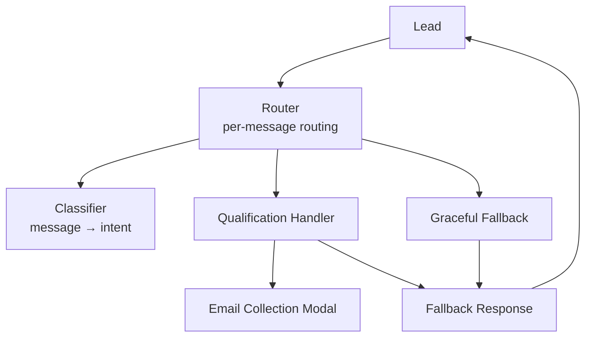
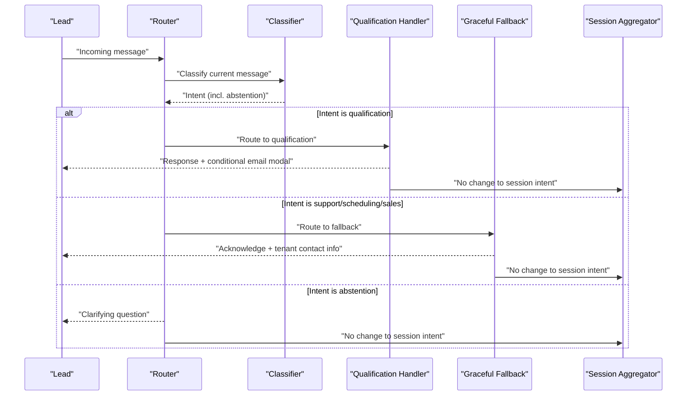
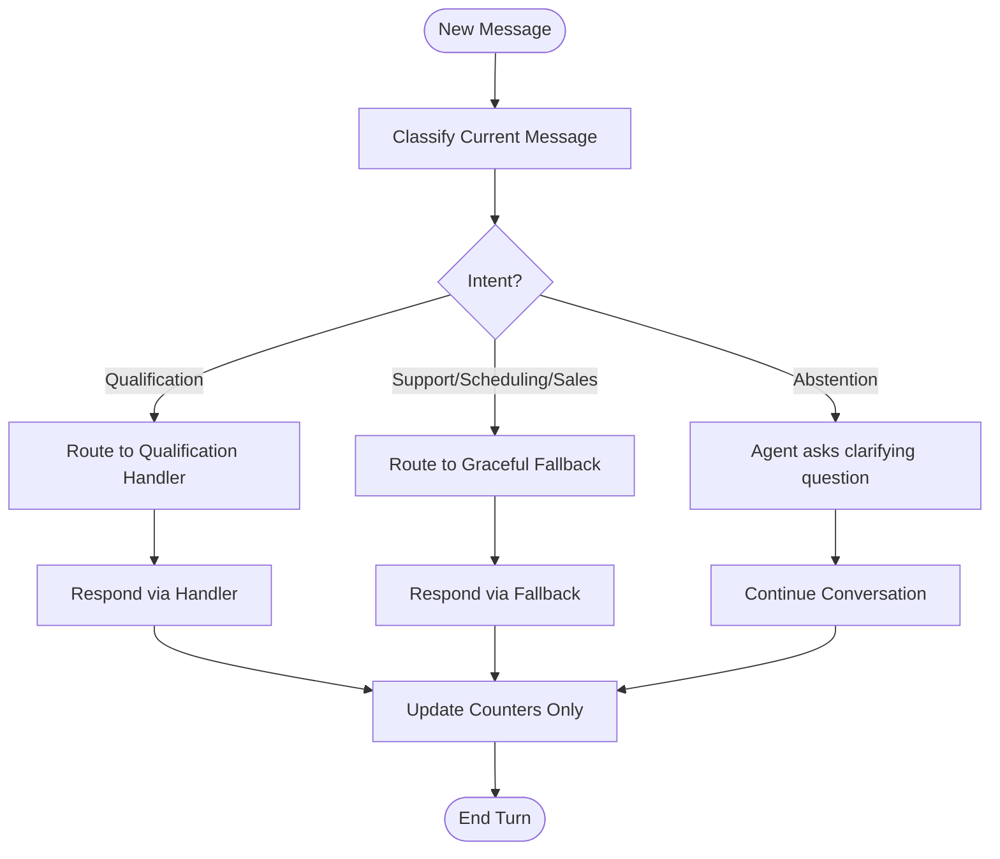
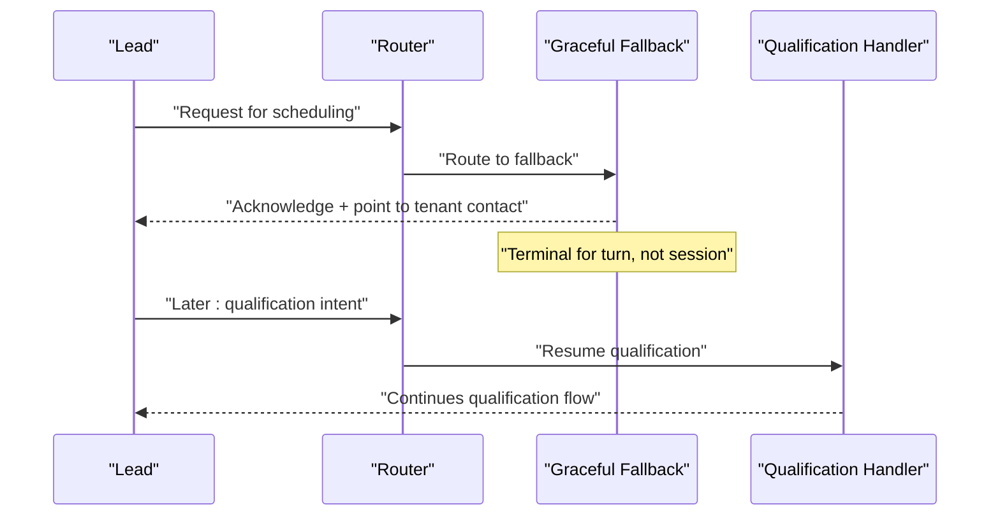
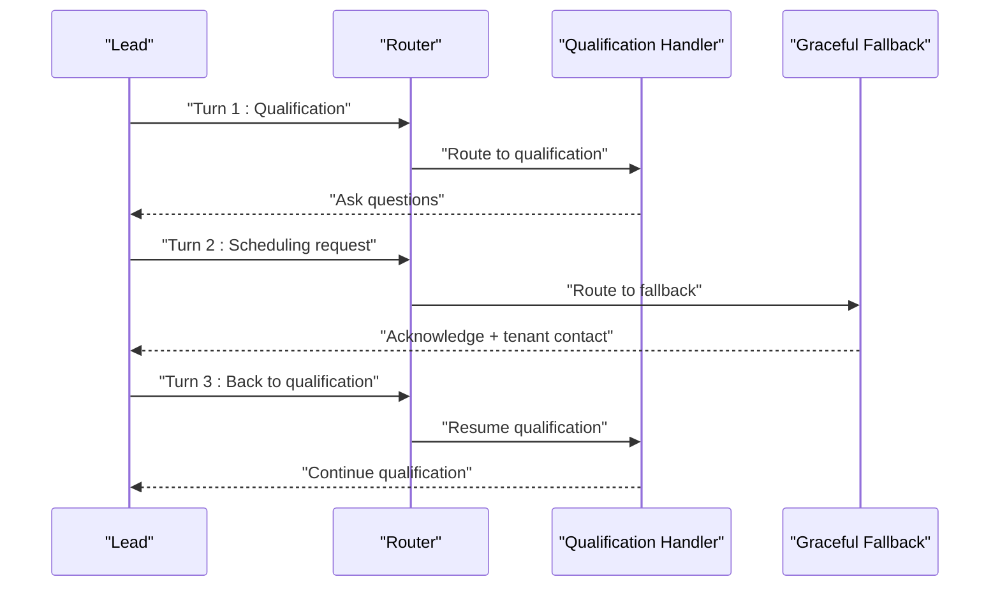
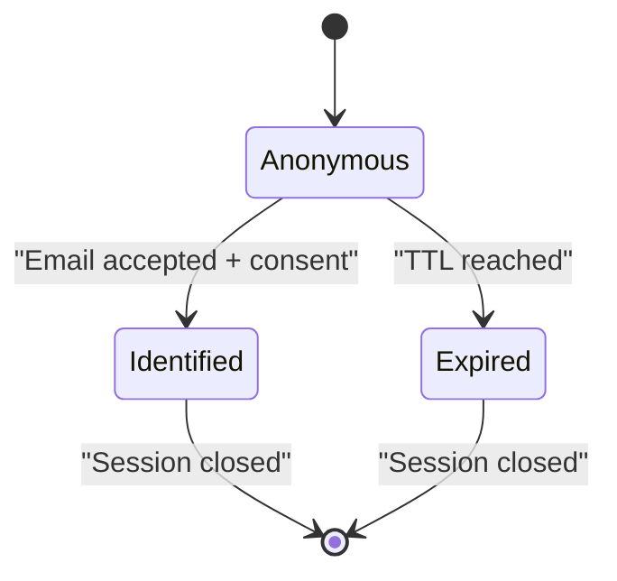
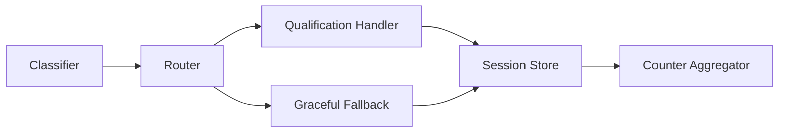

# Message Routing System

<cite>
**Referenced Files in This Document**
- [DESIGN.md](file://.genie/brainstorms/plataforma-conversa-lead/DESIGN.md)
- [DRAFT.md](file://.genie/brainstorms/plataforma-conversa-lead/DRAFT.md)
- [01-actors-and-roles.md](file://docs/sdd/01-actors-and-roles.md)
- [02-user-stories.md](file://docs/sdd/02-user-stories.md)
- [04-transfer-workflow.md](file://docs/sdd/04-transfer-workflow.md)
</cite>

## Table of Contents
1. [Introduction](#introduction)
2. [Project Structure](#project-structure)
3. [Core Components](#core-components)
4. [Architecture Overview](#architecture-overview)
5. [Detailed Component Analysis](#detailed-component-analysis)
6. [Dependency Analysis](#dependency-analysis)
7. [Performance Considerations](#performance-considerations)
8. [Troubleshooting Guide](#troubleshooting-guide)
9. [Conclusion](#conclusion)
10. [Appendices](#appendices)

## Introduction
This document explains the message routing system for the lead conversation platform. The router evaluates each incoming message to decide which handler executes, while session-level aggregation is used only for counters. Qualification intents are routed to a single real handler; support, scheduling, and sales intents are routed to a graceful fallback that acknowledges requests without claiming capabilities that do not exist. The system maintains conversation flow when users switch intents mid-conversation and prevents handler confusion by keeping per-message routing separate from per-session aggregation.

## Project Structure
The routing behavior is defined in design artifacts rather than source code files. The relevant specifications describe:
- A classifier that emits an intent field per message
- Per-message routing to either a qualification handler or a unified fallback
- Session-level aggregation for counters only
- A graceful fallback mechanism that does not terminate the session
- Email collection rules tied to the qualification handler

[No sources needed since this diagram shows conceptual workflow, not actual code structure]

**Section sources**
- [DESIGN.md:53-85](file://.genie/brainstorms/plataforma-conversa-lead/DESIGN.md#L53-L85)
- [02-user-stories.md:19-36](file://docs/sdd/02-user-stories.md#L19-L36)

## Core Components
- Intent classifier: Emits a single intent value per message from a fixed set, including an explicit abstention label for messages without clear intent.
- Per-message router: Chooses the next response path based on the current message’s intent.
- Qualification handler: Runs when the current message indicates qualification; it collects need, urgency, fit, and triggers contextual email collection under strict conditions.
- Graceful fallback: Handles non-qualification intents (support, scheduling, sales) by acknowledging the request and pointing to tenant contact without pretending capability that does not exist. It is terminal for the turn but not for the session.
- Session aggregator: Records the first labeled intent for the session to stabilize metrics; it does not affect runtime routing.

Key behaviors:
- Re-evaluation every turn: Routing decisions are made per message, not frozen at the first message.
- Distinction between routing and counting: Routing follows the current message; counting inherits the first labeled intent for the session.
- Fallback isolation: Non-qualification intents never trigger the qualification handler, even if the session was previously counted as qualification.
- Abstention handling: Messages with no clear intent receive a clarifying question from the agent and do not fix the session’s intent.

**Section sources**
- [DESIGN.md:53-85](file://.genie/brainstorms/plataforma-conversa-lead/DESIGN.md#L53-L85)
- [DESIGN.md:225-232](file://.genie/brainstorms/plataforma-conversa-lead/DESIGN.md#L225-L232)
- [DESIGN.md:362-366](file://.genie/brainstorms/plataforma-conversa-lead/DESIGN.md#L362-L366)
- [02-user-stories.md:19-36](file://docs/sdd/02-user-stories.md#L19-L36)

## Architecture Overview
The architecture separates concerns across three layers:
- Input layer: Incoming message arrives with optional attribution metadata.
- Classification and routing layer: The classifier labels the message; the router selects the handler based on the current message’s intent.
- Execution layer: Either the qualification handler or the graceful fallback responds; email collection is triggered only by the qualification handler under specified conditions.

**Diagram sources**
- [DESIGN.md:53-85](file://.genie/brainstorms/plataforma-conversa-lead/DESIGN.md#L53-L85)
- [DESIGN.md:225-232](file://.genie/brainstorms/plataforma-conversa-lead/DESIGN.md#L225-L232)
- [DESIGN.md:362-366](file://.genie/brainstorms/plataforma-conversa-lead/DESIGN.md#L362-L366)

## Detailed Component Analysis

### Per-Message Routing vs Per-Session Aggregation
- Per-message routing determines the immediate response path based on the current message’s intent. This ensures that if a user switches intents mid-conversation, the router adapts accordingly.
- Per-session aggregation records the first labeled intent for the session to stabilize metrics and avoid compounding classification errors over multiple turns. It is purely for measurement and does not influence runtime routing.

**Diagram sources**
- [DESIGN.md:53-85](file://.genie/brainstorms/plataforma-conversa-lead/DESIGN.md#L53-L85)
- [DESIGN.md:225-232](file://.genie/brainstorms/plataforma-conversa-lead/DESIGN.md#L225-L232)
- [DESIGN.md:362-366](file://.genie/brainstorms/plataforma-conversa-lead/DESIGN.md#L362-L366)

**Section sources**
- [DESIGN.md:53-85](file://.genie/brainstorms/plataforma-conversa-lead/DESIGN.md#L53-L85)
- [DESIGN.md:225-232](file://.genie/brainstorms/plataforma-conversa-lead/DESIGN.md#L225-L232)
- [DESIGN.md:362-366](file://.genie/brainstorms/plataforma-conversa-lead/DESIGN.md#L362-L366)

### Graceful Fallback Mechanism
- Purpose: Acknowledge requests for support, scheduling, or sales without claiming capabilities that do not exist in this scope.
- Behavior: Terminal for the turn (the fallback responds), but not for the session (the conversation remains open). If the user later returns to qualification, the real handler resumes.
- Rationale: Ending the session on fallback would interrupt ongoing qualification flows and break the promise of returning about the conversation only when there is one to return about.

**Diagram sources**
- [DESIGN.md:77-85](file://.genie/brainstorms/plataforma-conversa-lead/DESIGN.md#L77-L85)
- [DESIGN.md:362-366](file://.genie/brainstorms/plataforma-conversa-lead/DESIGN.md#L362-L366)

**Section sources**
- [DESIGN.md:77-85](file://.genie/brainstorms/plataforma-conversa-lead/DESIGN.md#L77-L85)
- [DESIGN.md:362-366](file://.genie/brainstorms/plataforma-conversa-lead/DESIGN.md#L362-L366)

### Handling Mid-Conversation Intent Switches
- The router re-evaluates intent on every message, preventing handler confusion when users change their intent mid-conversation.
- Example: A session initially classified as qualification may receive a scheduling request; the router routes that message to the fallback, then resumes qualification if the user later expresses qualification again.

**Diagram sources**
- [DESIGN.md:53-85](file://.genie/brainstorms/plataforma-conversa-lead/DESIGN.md#L53-L85)
- [DESIGN.md:362-366](file://.genie/brainstorms/plataforma-conversa-lead/DESIGN.md#L362-L366)

**Section sources**
- [DESIGN.md:53-85](file://.genie/brainstorms/plataforma-conversa-lead/DESIGN.md#L53-L85)
- [DESIGN.md:362-366](file://.genie/brainstorms/plataforma-conversa-lead/DESIGN.md#L362-L366)

### Session State Management
- Session state carries conversation context while the lead is anonymous and is discarded after TTL unless promoted to a durable lead upon successful email submission.
- Counters are aggregated per session and emitted once at termination or TTL expiration. They include dimensions such as origin, session intent (first labeled), email state, and validity status.
- Email collection is controlled by the qualification handler with explicit conditions and display limits to avoid excessive friction.

**Diagram sources**
- [DESIGN.md:198-213](file://.genie/brainstorms/plataforma-conversa-lead/DESIGN.md#L198-L213)
- [DESIGN.md:138-150](file://.genie/brainstorms/plataforma-conversa-lead/DESIGN.md#L138-L150)

**Section sources**
- [DESIGN.md:198-213](file://.genie/brainstorms/plataforma-conversa-lead/DESIGN.md#L198-L213)
- [DESIGN.md:138-150](file://.genie/brainstorms/plataforma-conversa-lead/DESIGN.md#L138-L150)

### Routing Scenarios and Examples
- Scenario A: User starts with greeting (abstention). Agent asks clarifying question; session intent remains unset until a labeled intent appears.
- Scenario B: User requests scheduling. Router routes to fallback; session continues open; later, user returns to qualification and resumes handler.
- Scenario C: User provides support request. Router routes to fallback; session continues open; later, user qualifies and proceeds through handler.
- Scenario D: User switches from sales back to qualification. Router adapts per message; session counter retains first labeled intent; routing follows current message.

These scenarios ensure that:
- Routing is per-message and responsive to intent changes.
- Counting is per-session and stable against repeated misclassifications.
- Fallback does not interrupt ongoing qualification flows.

**Section sources**
- [DESIGN.md:53-85](file://.genie/brainstorms/plataforma-conversa-lead/DESIGN.md#L53-L85)
- [DESIGN.md:362-366](file://.genie/brainstorms/plataforma-conversa-lead/DESIGN.md#L362-L366)
- [02-user-stories.md:19-36](file://docs/sdd/02-user-stories.md#L19-L36)

## Dependency Analysis
The routing system depends on:
- Classifier: Provides per-message intent labels, including abstention.
- Handlers: One real handler for qualification; a unified fallback for other intents.
- Session store: Holds ephemeral context and TTL-based lifecycle.
- Counter aggregator: Emits terminal aggregated counts per session.

**Diagram sources**
- [DESIGN.md:198-213](file://.genie/brainstorms/plataforma-conversa-lead/DESIGN.md#L198-L213)
- [DESIGN.md:225-232](file://.genie/brainstorms/plataforma-conversa-lead/DESIGN.md#L225-L232)

**Section sources**
- [DESIGN.md:198-213](file://.genie/brainstorms/plataforma-conversa-lead/DESIGN.md#L198-L213)
- [DESIGN.md:225-232](file://.genie/brainstorms/plataforma-conversa-lead/DESIGN.md#L225-L232)

## Performance Considerations
- Per-message classification adds latency proportional to message volume; however, it is necessary to maintain correct routing behavior.
- Per-session aggregation reduces metric noise and avoids compounding classification errors over long conversations.
- Rate limiting and per-session message caps protect backend resources and prevent abuse.
- Fallback isolation keeps the system simple and reduces handler coupling, improving maintainability and performance.

[No sources needed since this section provides general guidance]

## Troubleshooting Guide
Common issues and resolutions:
- Misrouted messages: Verify classifier accuracy and ensure routing uses current message intent, not session history.
- Unexpected session closure: Confirm fallback is terminal for the turn only; sessions must remain open to allow resumption of qualification.
- Excessive email prompts: Ensure email modal conditions and display limits are enforced by the qualification handler.
- Counter anomalies: Check that session intent is inherited from the first labeled message and that terminal emissions occur for all sessions, including abandoned ones.

**Section sources**
- [DESIGN.md:53-85](file://.genie/brainstorms/plataforma-conversa-lead/DESIGN.md#L53-L85)
- [DESIGN.md:138-150](file://.genie/brainstorms/plataforma-conversa-lead/DESIGN.md#L138-L150)
- [DESIGN.md:362-366](file://.genie/brainstorms/plataforma-conversa-lead/DESIGN.md#L362-L366)

## Conclusion
The message routing system prioritizes responsiveness and correctness by evaluating intent per message while stabilizing metrics via per-session aggregation. Qualification intents proceed to a dedicated handler; support, scheduling, and sales intents are handled gracefully without disrupting ongoing qualification flows. This separation prevents handler confusion during mid-conversation intent switches and ensures a consistent, reliable experience for leads.

[No sources needed since this section summarizes without analyzing specific files]

## Appendices

### Transfer Workflow Context
While transfer workflows are out of scope for this fatia, the design acknowledges potential future mechanisms for transferring conversations when the agent cannot continue. This complements the fallback approach by providing structured paths for escalation when configured.

**Section sources**
- [04-transfer-workflow.md:1-167](file://docs/sdd/04-transfer-workflow.md#L1-L167)

### Actors and Roles
Understanding actors helps clarify responsibilities around routing and fallback:
- Leads interact with the agent and may switch intents mid-conversation.
- Operators monitor sessions and escalations.
- Leadership configures operational parameters and reviews metrics.

**Section sources**
- [01-actors-and-roles.md:1-100](file://docs/sdd/01-actors-and-roles.md#L1-L100)