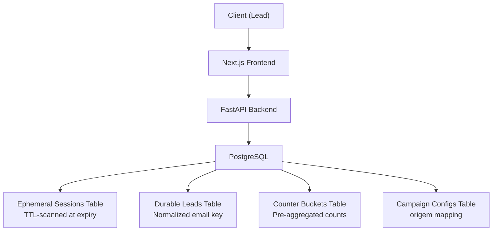
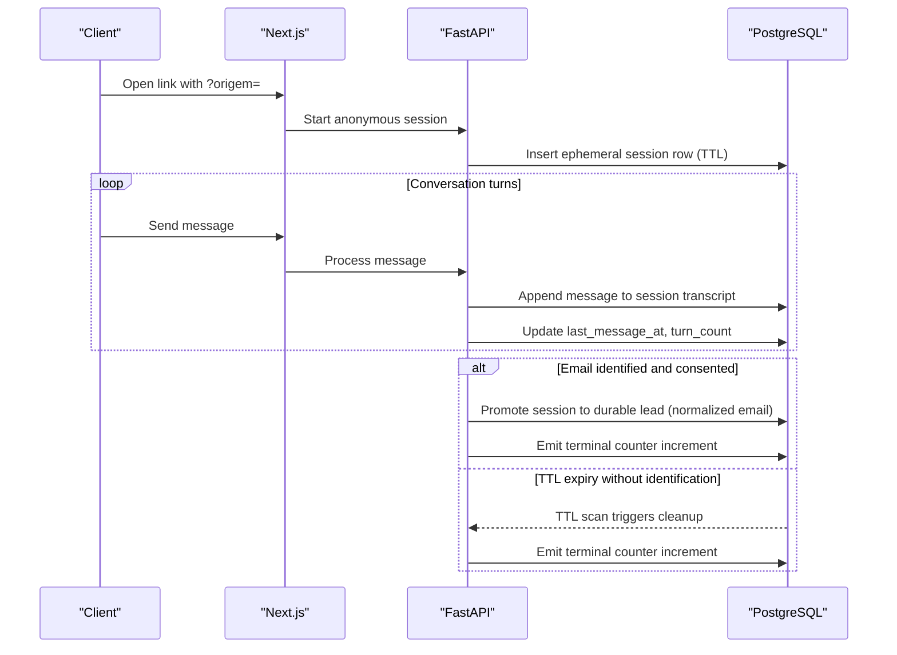
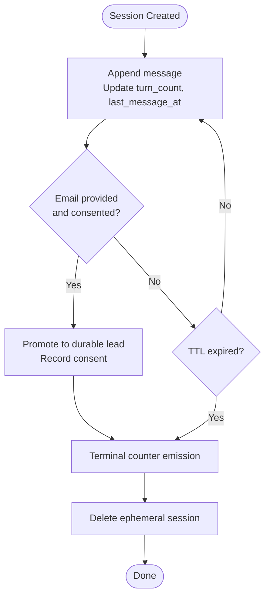
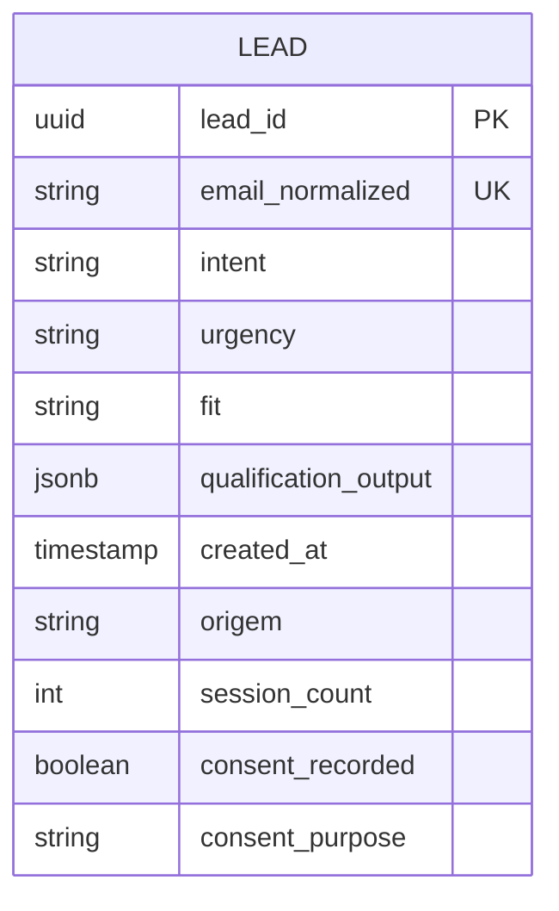
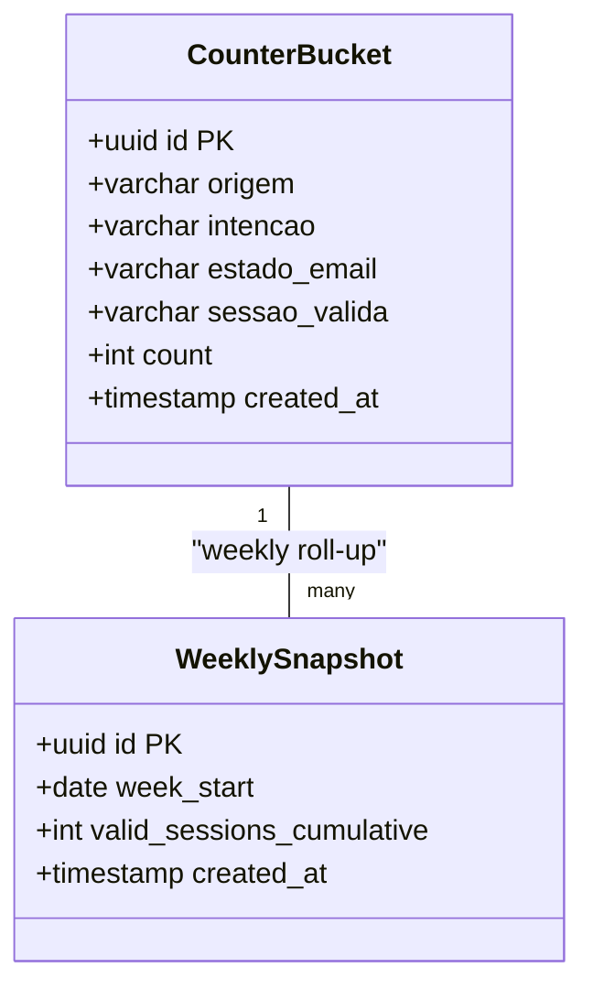
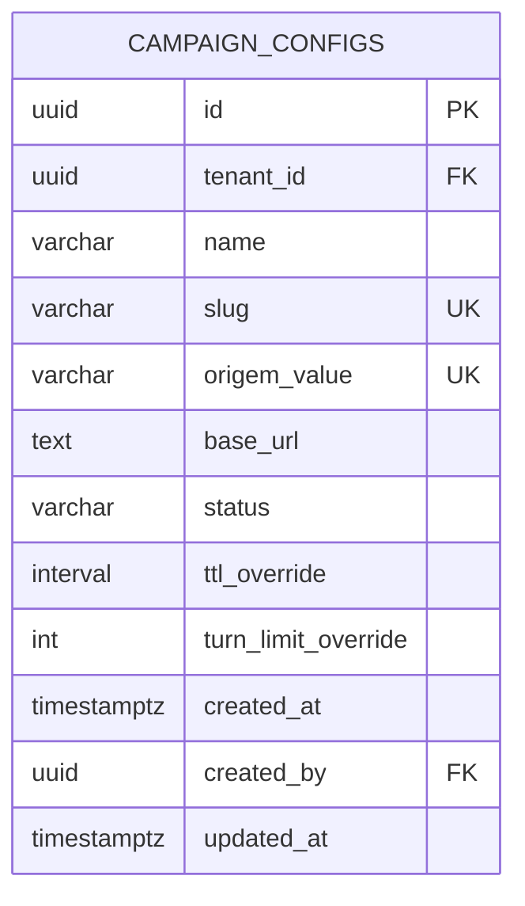
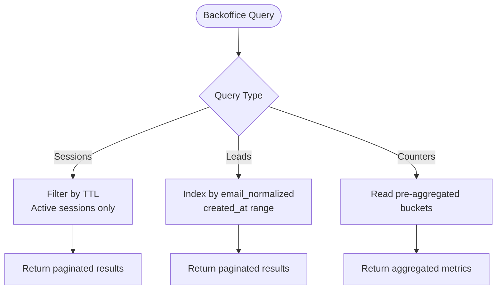
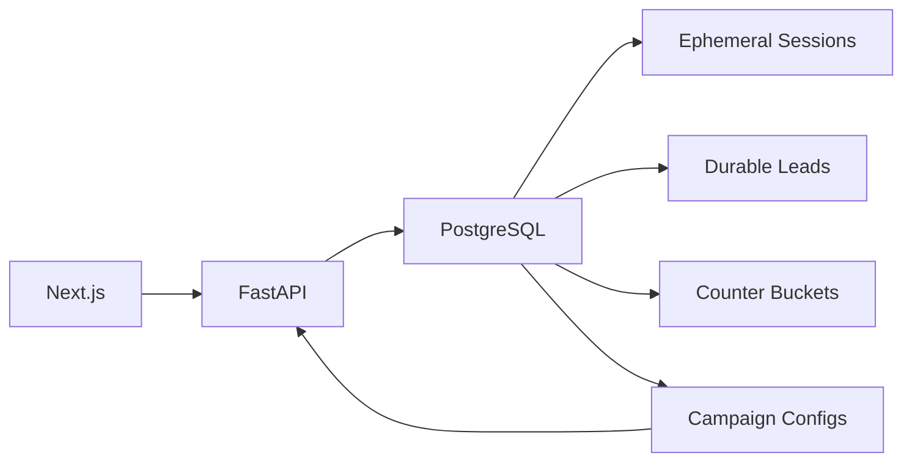

# Data Persistence Strategy

<cite>
**Referenced Files in This Document**
- [DESIGN.md](file://.genie/brainstorms/plataforma-conversa-lead/DESIGN.md)
- [DRAFT.md](file://.genie/brainstorms/plataforma-conversa-lead/DRAFT.md)
- [01-actors-and-roles.md](file://docs/sdd/01-actors-and-roles.md)
- [02-user-stories.md](file://docs/sdd/02-user-stories.md)
- [03-functional-spec-backoffice.md](file://docs/sdd/03-functional-spec-backoffice.md)
- [05-campaign-management.md](file://docs/sdd/05-campaign-management.md)
</cite>

## Table of Contents
1. [Introduction](#introduction)
2. [Project Structure](#project-structure)
3. [Core Components](#core-components)
4. [Architecture Overview](#architecture-overview)
5. [Detailed Component Analysis](#detailed-component-analysis)
6. [Dependency Analysis](#dependency-analysis)
7. [Performance Considerations](#performance-considerations)
8. [Troubleshooting Guide](#troubleshooting-guide)
9. [Conclusion](#conclusion)
10. [Appendices](#appendices)

## Introduction
This document defines the data persistence strategy for session data in the Sup Better Engine, focusing on PostgreSQL-based storage for ephemeral sessions, durable lead records, and pre-aggregated counters. It explains TTL-driven expiration, serialization of conversation context, message history retention policies, indexing and query strategies, backup and recovery considerations, migration approaches, and performance optimizations for high-volume session storage. The guidance is grounded in the repository’s design documents and functional specifications.

## Project Structure
The repository contains design and specification artifacts that define how sessions are stored and managed:
- Design decisions specify an ephemeral Postgres table for anonymous sessions with TTL, promotion to a durable lead record upon email identification, and terminal emissions into aggregated counters.
- Functional specs define backoffice views and access patterns over sessions, leads, and counters.
- Campaign management includes configuration tables and indexes relevant to session attribution.

**Diagram sources**
- [DESIGN.md:191-213](file://.genie/brainstorms/plataforma-conversa-lead/DESIGN.md#L191-L213)
- [03-functional-spec-backoffice.md:286-335](file://docs/sdd/03-functional-spec-backoffice.md#L286-L335)
- [05-campaign-management.md:226-252](file://docs/sdd/05-campaign-management.md#L226-L252)

**Section sources**
- [DESIGN.md:191-213](file://.genie/brainstorms/plataforma-conversa-lead/DESIGN.md#L191-L213)
- [03-functional-spec-backoffice.md:286-335](file://docs/sdd/03-functional-spec-backoffice.md#L286-L335)
- [05-campaign-management.md:226-252](file://docs/sdd/05-campaign-management.md#L226-L252)

## Core Components
- Ephemeral Session Storage: Anonymous conversations live in a Postgres table with TTL; content is discarded when TTL expires unless promoted to a durable lead.
- Durable Lead Records: Upon successful email submission and consent, the session is promoted to a durable lead record keyed by normalized email.
- Pre-aggregated Counters: At session end or TTL expiry, a single terminal emission increments a bucket of low-cardinality dimensions (origin, intent, email state, validity). No per-session timestamps or identifiers are retained in counters.
- Backoffice Views: Read-only dashboards for active sessions, lead review, and daily metrics, with defined data models and filtering.
- Campaign Configuration: Tables and indexes supporting origin attribution and parameter overrides.

Key responsibilities:
- Session lifecycle: create, update messages, TTL enforcement, terminal emission, and cleanup.
- Lead promotion: validate email, record consent, deduplicate by normalized email, persist durable lead.
- Counter emission: aggregate counts across categorical dimensions without correlating events to session IDs.
- Backoffice queries: efficient reads filtered by TTL for active sessions, indexed reads for leads and counters.

**Section sources**
- [DESIGN.md:198-213](file://.genie/brainstorms/plataforma-conversa-lead/DESIGN.md#L198-L213)
- [DESIGN.md:127-166](file://.genie/brainstorms/plataforma-conversa-lead/DESIGN.md#L127-L166)
- [03-functional-spec-backoffice.md:85-168](file://docs/sdd/03-functional-spec-backoffice.md#L85-L168)
- [05-campaign-management.md:226-252](file://docs/sdd/05-campaign-management.md#L226-L252)

## Architecture Overview
The system uses PostgreSQL as the single source of truth for sessions, leads, and counters. Ephemeral sessions carry conversation context until TTL expiry or promotion. Terminal emissions feed pre-aggregated counters used by dashboards. Campaign configs influence session origin and operational parameters.

**Diagram sources**
- [DESIGN.md:198-213](file://.genie/brainstorms/plataforma-conversa-lead/DESIGN.md#L198-L213)
- [03-functional-spec-backoffice.md:286-335](file://docs/sdd/03-functional-spec-backoffice.md#L286-L335)

## Detailed Component Analysis

### Ephemeral Sessions Table
- Purpose: Store anonymous conversation context while the lead is unidentified.
- Lifecycle: Created on first interaction; updated per message; scanned and purged at TTL; may be promoted to a durable lead if email is provided and consent recorded.
- Retention: Transcript and context are discarded at TTL unless promoted.
- Indexing strategy:
  - Primary key: session_id (UUID).
  - TTL column: created_at or explicit expires_at for scanning.
  - Composite index for active session queries: (status, expires_at), (last_message_at).
  - Optional: tenant_id if multi-tenant later; currently single tenant pilot.
- Serialization format:
  - Conversation context: JSONB payload capturing structured fields such as intent, urgency, fit, and metadata.
  - Message history: append-only array or separate child rows with sequence ordering; prefer child rows for efficient pagination and TTL cleanup.
- Query patterns:
  - Active sessions: SELECT ... WHERE status = 'active' AND expires_at > now() ORDER BY last_message_at DESC.
  - Session detail: SELECT ... WHERE session_id = :id.
  - TTL cleanup: DELETE ... WHERE expires_at <= now(); emit terminal counter before deletion.

**Diagram sources**
- [DESIGN.md:198-213](file://.genie/brainstorms/plataforma-conversa-lead/DESIGN.md#L198-L213)
- [03-functional-spec-backoffice.md:85-168](file://docs/sdd/03-functional-spec-backoffice.md#L85-L168)

**Section sources**
- [DESIGN.md:198-213](file://.genie/brainstorms/plataforma-conversa-lead/DESIGN.md#L198-L213)
- [03-functional-spec-backoffice.md:85-168](file://docs/sdd/03-functional-spec-backoffice.md#L85-L168)

### Durable Leads Table
- Purpose: Persist identified leads with normalized email as primary identity key.
- Fields:
  - lead_id (UUID PK)
  - email_normalized (unique)
  - intent, urgency, fit (from qualification output)
  - qualification_output (JSONB)
  - created_at, origem, session_count
  - consent_recorded (boolean), consent_purpose (string)
- Deduplication: Enforced by unique constraint on email_normalized; trim + lowercase normalization applied before insert.
- Indexes:
  - Unique index on email_normalized.
  - Index on created_at for time-range queries.
  - Index on intent, origem for dashboard filters.
- Query patterns:
  - Lead list: SELECT ... ORDER BY created_at DESC LIMIT :offset OFFSET :limit.
  - Lead detail: SELECT ... WHERE lead_id = :id.
  - Export: SELECT ... WHERE created_at BETWEEN :start AND :end.

**Diagram sources**
- [03-functional-spec-backoffice.md:121-140](file://docs/sdd/03-functional-spec-backoffice.md#L121-L140)

**Section sources**
- [03-functional-spec-backoffice.md:121-140](file://docs/sdd/03-functional-spec-backoffice.md#L121-L140)

### Pre-aggregated Counters Table
- Purpose: Store anonymized, pre-aggregated counts for reporting without retaining session identifiers or per-session timestamps.
- Dimensions:
  - origem (low cardinality categories)
  - intencao (including abstenção and none)
  - estado_email (monotonic terminal states)
  - sessao_valida (valid, excluded by rate limit, excluded by turn limit)
- Emission: Single terminal emission at session end or TTL expiry; upserts existing bucket rows.
- Indexes:
  - Composite index on (origem, intencao, estado_email, sessao_valida) for fast aggregation.
  - Weekly snapshot scalar for sessions/week trend.
- Query patterns:
  - Daily counters: SELECT ... GROUP BY dimensions.
  - Weekly snapshots: SELECT scalar totals per week boundary.
  - Trends: Compute differences between weekly scalars.

**Diagram sources**
- [DESIGN.md:127-166](file://.genie/brainstorms/plataforma-conversa-lead/DESIGN.md#L127-L166)

**Section sources**
- [DESIGN.md:127-166](file://.genie/brainstorms/plataforma-conversa-lead/DESIGN.md#L127-L166)

### Campaign Configuration Table
- Purpose: Manage campaign links, attribution via origem, base URL, and optional overrides for TTL and turn limits.
- Fields:
  - id (UUID PK)
  - tenant_id (FK to tenants)
  - name, slug (unique per tenant)
  - origem_value (unique per tenant)
  - base_url
  - status (draft, active, paused, archived)
  - ttl_override (interval)
  - turn_limit_override (int)
  - created_at, created_by, updated_at
- Indexes:
  - idx_campaign_origem on (tenant_id, origem_value)
  - idx_campaign_status on (tenant_id, status)
- Query patterns:
  - Lookup by origem during session creation.
  - Filter by status for active campaigns.

**Diagram sources**
- [05-campaign-management.md:226-252](file://docs/sdd/05-campaign-management.md#L226-L252)

**Section sources**
- [05-campaign-management.md:226-252](file://docs/sdd/05-campaign-management.md#L226-L252)

### Backoffice Data Models and Access Patterns
- SessionView model: fields include session_id, status, intent, turn_count, time_active, origem, email_state, last_message_at, flagged, internal_notes.
- LeadView model: fields include lead_id, email, intent, urgency, fit, qualification_output, created_at, origem, session_count, consent_recorded, consent_purpose.
- Access patterns:
  - All backoffice queries read from Postgres.
  - Counter reads use pre-aggregated buckets for speed.
  - Session reads filtered by TTL for active sessions only.
  - Lead reads indexed by normalized email and created_at.

**Diagram sources**
- [03-functional-spec-backoffice.md:85-168](file://docs/sdd/03-functional-spec-backoffice.md#L85-L168)
- [03-functional-spec-backoffice.md:286-335](file://docs/sdd/03-functional-spec-backoffice.md#L286-L335)

**Section sources**
- [03-functional-spec-backoffice.md:85-168](file://docs/sdd/03-functional-spec-backoffice.md#L85-L168)
- [03-functional-spec-backoffice.md:286-335](file://docs/sdd/03-functional-spec-backoffice.md#L286-L335)

## Dependency Analysis
- Backend depends on Postgres for all session, lead, and counter operations.
- Frontend depends on backend APIs to render session monitoring and lead review.
- Campaign configs influence session origin and operational parameters; indexes optimize lookup during session creation.
- Counters depend on terminal emissions from session lifecycle; no correlation to session IDs ensures privacy and simplicity.

**Diagram sources**
- [DESIGN.md:191-213](file://.genie/brainstorms/plataforma-conversa-lead/DESIGN.md#L191-L213)
- [05-campaign-management.md:226-252](file://docs/sdd/05-campaign-management.md#L226-L252)

**Section sources**
- [DESIGN.md:191-213](file://.genie/brainstorms/plataforma-conversa-lead/DESIGN.md#L191-L213)
- [05-campaign-management.md:226-252](file://docs/sdd/05-campaign-management.md#L226-L252)

## Performance Considerations
- TTL-based expiration:
  - Use database-level features where possible (e.g., periodic cleanup jobs scanning expires_at).
  - Ensure indexes support efficient TTL scans and active session queries.
- Indexing strategies:
  - Ephemeral sessions: composite index on (status, expires_at), (last_message_at).
  - Leads: unique index on email_normalized; index on created_at; indexes on intent, origem for filters.
  - Counters: composite index on dimension columns; weekly scalar snapshots for trends.
- Query optimization:
  - Paginate backoffice lists with LIMIT/OFFSET or keyset pagination.
  - Avoid full-table scans by filtering on TTL and using indexes.
  - Pre-aggregate counters to reduce compute cost for dashboards.
- High-volume considerations:
  - Partition ephemeral sessions by expires_at or date ranges to improve TTL cleanup performance.
  - Archive old leads periodically if retention policy requires long-term storage beyond pilot scope.
  - Monitor counter bucket growth; consider partitioning by week or month if volume increases significantly.

[No sources needed since this section provides general guidance]

## Troubleshooting Guide
- TTL not expiring:
  - Verify expires_at values and cleanup job execution.
  - Check indexes on expires_at and status for efficient scans.
- Duplicate leads:
  - Ensure email normalization (trim + lowercase) before insertion.
  - Validate unique constraint on email_normalized.
- Counter discrepancies:
  - Confirm terminal emission occurs at session end or TTL expiry.
  - Verify bucket dimensions match expected categories and monotonic email state progression.
- Backoffice performance:
  - Ensure queries filter by TTL for active sessions.
  - Use pre-aggregated counters for metrics; avoid recomputing from raw transcripts.

**Section sources**
- [DESIGN.md:198-213](file://.genie/brainstorms/plataforma-conversa-lead/DESIGN.md#L198-L213)
- [03-functional-spec-backoffice.md:286-335](file://docs/sdd/03-functional-spec-backoffice.md#L286-L335)

## Conclusion
The Sup Better Engine’s session persistence strategy centers on ephemeral Postgres sessions with TTL, promotion to durable leads upon email identification, and terminal emissions into pre-aggregated counters. This design balances privacy, simplicity, and performance, enabling efficient backoffice operations and scalable reporting. Proper indexing, TTL cleanup, and careful query patterns ensure reliable session management under pilot-scale volumes, with clear pathways to scale further if needed.

[No sources needed since this section summarizes without analyzing specific files]

## Appendices

### Sample Queries
- Active sessions:
  - SELECT session_id, status, intent, turn_count, last_message_at FROM ephemeral_sessions WHERE status = 'active' AND expires_at > now() ORDER BY last_message_at DESC LIMIT 50;
- Lead by email:
  - SELECT * FROM leads WHERE email_normalized = :email;
- Daily counters:
  - SELECT origem, intencao, estado_email, sessao_valida, SUM(count) AS total FROM counter_buckets WHERE created_at >= today() GROUP BY origem, intencao, estado_email, sessao_valida;
- Weekly snapshots:
  - SELECT week_start, valid_sessions_cumulative FROM weekly_snapshots ORDER BY week_start DESC;

[No sources needed since this section provides general guidance]

### Backup and Recovery Procedures
- Regular backups of Postgres including ephemeral sessions, leads, counters, and campaign configs.
- Restore procedures should preserve referential integrity and indexes.
- For TTL-based data, note that restored backups will re-expose expired sessions based on their original timestamps; schedule post-restore TTL cleanup to align with current time.

[No sources needed since this section provides general guidance]

### Data Migration Approaches
- Schema changes:
  - Use migrations to add columns, indexes, or partitions safely.
  - For TTL cleanup improvements, introduce new columns gradually and backfill if necessary.
- Data migration:
  - Normalize emails in leads if schema changes require it.
  - Rebuild counter buckets if dimension definitions change; ensure terminal emission logic aligns with new schema.

[No sources needed since this section provides general guidance]

### Best Practices for Session Data Management
- Keep ephemeral sessions minimal; store only necessary context and transcript references.
- Enforce TTL strictly; monitor cleanup job health.
- Record consent explicitly with purpose and timestamp at lead promotion.
- Use pre-aggregated counters for dashboards; avoid querying raw transcripts for metrics.
- Index strategically; avoid over-indexing which can degrade write performance.
- Audit administrative actions and parameter changes per backoffice requirements.

**Section sources**
- [03-functional-spec-backoffice.md:263-281](file://docs/sdd/03-functional-spec-backoffice.md#L263-L281)