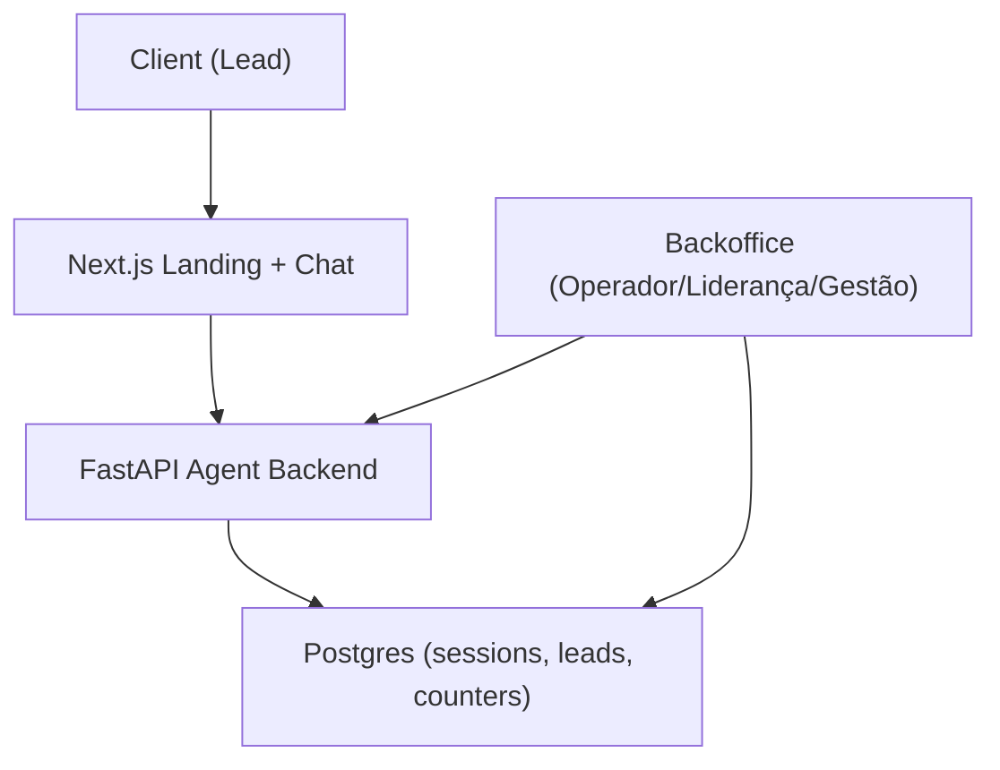
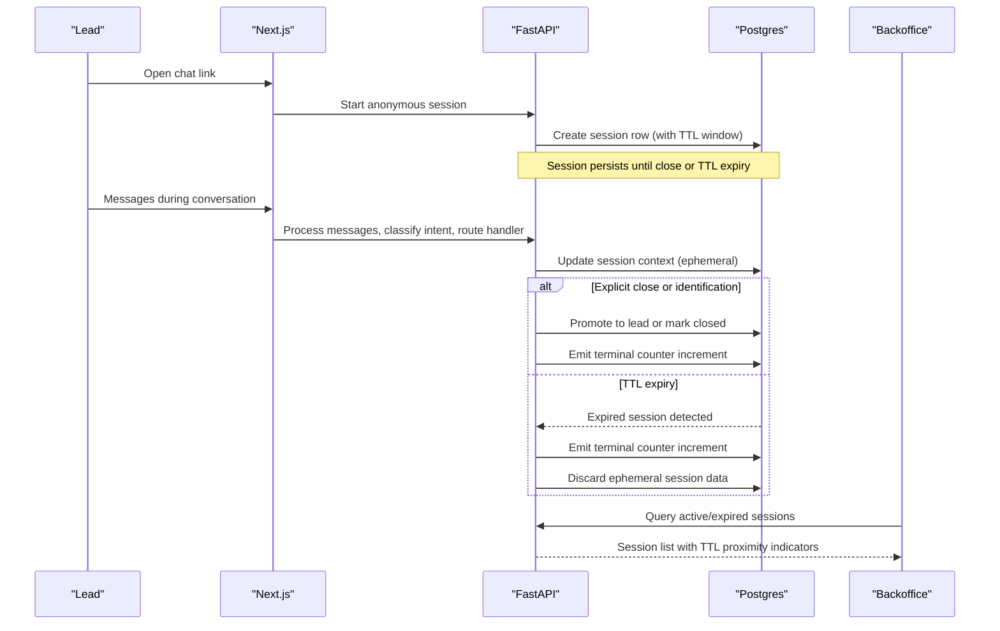
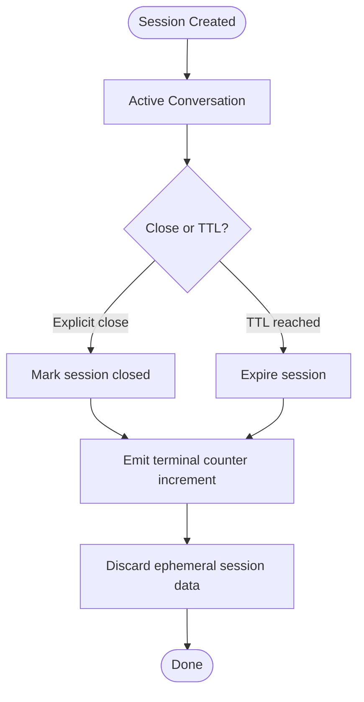
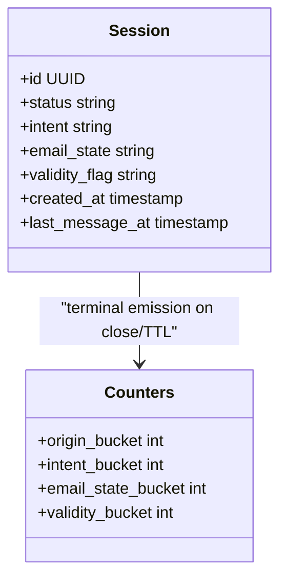
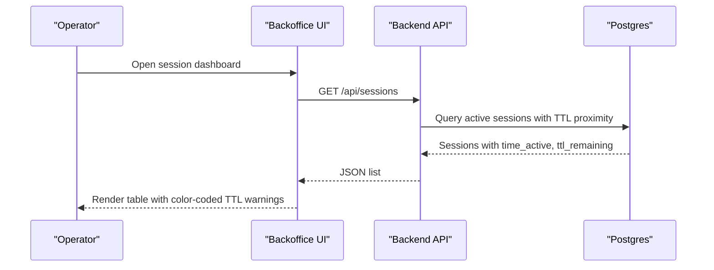
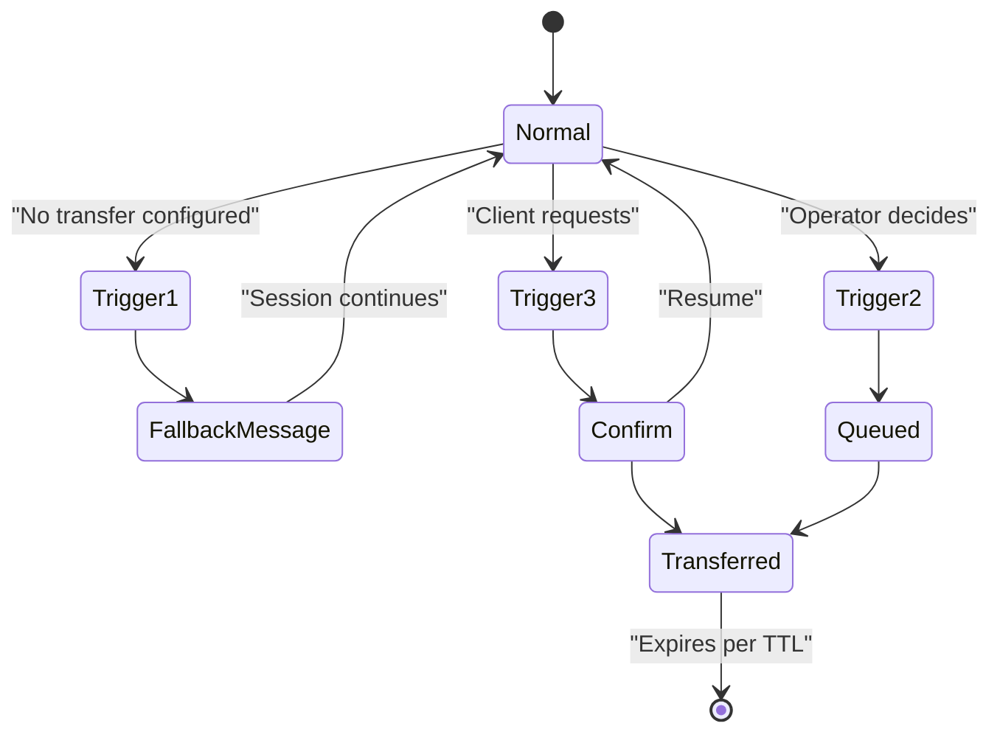
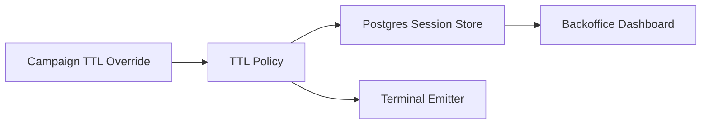

# Session Cleanup & Expiration

<cite>
**Referenced Files in This Document**
- [DESIGN.md](file://.genie/brainstorms/plataforma-conversa-lead/DESIGN.md)
- [01-actors-and-roles.md](file://docs/sdd/01-actors-and-roles.md)
- [02-user-stories.md](file://docs/sdd/02-user-stories.md)
- [03-functional-spec-backoffice.md](file://docs/sdd/03-functional-spec-backoffice.md)
- [04-transfer-workflow.md](file://docs/sdd/04-transfer-workflow.md)
- [05-campaign-management.md](file://docs/sdd/05-campaign-management.md)
</cite>

## Table of Contents
1. Introduction
2. Project Structure
3. Core Components
4. Architecture Overview
5. Detailed Component Analysis
6. Dependency Analysis
7. Performance Considerations
8. Troubleshooting Guide
9. Conclusion
10. Appendices

## Introduction
This document specifies the session cleanup and expiration mechanisms for the Sup Better Engine’s pilot scope. It focuses on how anonymous sessions are stored, how TTL is enforced, what happens when a session expires, and how terminal metrics are emitted. It also covers monitoring, operational controls, failure recovery considerations, and high-load behavior as described by the project’s design and specifications.

## Project Structure
The repository contains design and specification documents that define the platform’s behavior for sessions, TTL, counters, and backoffice operations. The relevant pieces for session cleanup and expiration are:
- Anonymous session storage with TTL in Postgres
- Terminal emission at session close or TTL expiry
- Backoffice visibility into active/expired sessions
- Operational parameters (TTL, rate limits, turn limits)
- Campaign configuration with optional per-campaign TTL overrides

**Diagram sources**
- [DESIGN.md:201-214](file://.genie/brainstorms/plataforma-conversa-lead/DESIGN.md#L201-L214)
- [03-functional-spec-backoffice.md:284-328](file://docs/sdd/03-functional-spec-backoffice.md#L284-L328)

**Section sources**
- [DESIGN.md:201-214](file://.genie/brainstorms/plataforma-conversa-lead/DESIGN.md#L201-L214)
- [03-functional-spec-backoffice.md:284-328](file://docs/sdd/03-functional-spec-backoffice.md#L284-L328)

## Core Components
- Anonymous session lifecycle: created on link open, carries conversation context while anonymous, promoted to durable lead upon identification; otherwise discarded at TTL.
- TTL policy: default 24 hours for sessions; governs terminal emission, transcript discard, and retention policy.
- Terminal emission: one-time increment of pre-aggregated counters at session close or TTL expiry, using categorical dimensions only (no PII or per-session timestamps).
- Backoffice visibility: operators can monitor active sessions and see visual indicators approaching TTL or turn limits; expired sessions are visible as part of session status.
- Operational parameters: TTL, rate limit, and turn limit are configurable by leadership with audit logging.
- Campaign-level TTL override: campaign configs may include an interval override for TTL.

**Section sources**
- [DESIGN.md:119-136](file://.genie/brainstorms/plataforma-conversa-lead/DESIGN.md#L119-L136)
- [DESIGN.md:210-225](file://.genie/brainstorms/plataforma-conversa-lead/DESIGN.md#L210-L225)
- [03-functional-spec-backoffice.md:87-114](file://docs/sdd/03-functional-spec-backoffice.md#L87-L114)
- [02-user-stories.md:109-116](file://docs/sdd/02-user-stories.md#L109-L116)
- [05-campaign-management.md:226-252](file://docs/sdd/05-campaign-management.md#L226-L252)

## Architecture Overview
The system uses Postgres to store ephemeral anonymous sessions with TTL enforcement. When a session ends (explicit close or TTL expiry), it emits a single terminal metric update to aggregated counters. Leadership can adjust TTL and other operational parameters, and operators monitor session health via the backoffice.

**Diagram sources**
- [DESIGN.md:210-225](file://.genie/brainstorms/plataforma-conversa-lead/DESIGN.md#L210-L225)
- [03-functional-spec-backoffice.md:87-114](file://docs/sdd/03-functional-spec-backoffice.md#L87-L114)

## Detailed Component Analysis

### TTL Policy and Enforcement
- Default TTL: 24 hours for anonymous sessions.
- Scope: Governs terminal emission, transcript discard, and retention policy.
- Storage: Anonymous sessions live in Postgres with TTL semantics; no Redis dependency for pilot scope.
- Overrides: Campaign configurations may include an interval override for TTL.

**Diagram sources**
- [DESIGN.md:119-136](file://.genie/brainstorms/plataforma-conversa-lead/DESIGN.md#L119-L136)
- [DESIGN.md:210-225](file://.genie/brainstorms/plataforma-conversa-lead/DESIGN.md#L210-L225)
- [05-campaign-management.md:226-252](file://docs/sdd/05-campaign-management.md#L226-L252)

**Section sources**
- [DESIGN.md:119-136](file://.genie/brainstorms/plataforma-conversa-lead/DESIGN.md#L119-L136)
- [DESIGN.md:210-225](file://.genie/brainstorms/plataforma-conversa-lead/DESIGN.md#L210-L225)
- [05-campaign-management.md:226-252](file://docs/sdd/05-campaign-management.md#L226-L252)

### Terminal Emission and Counter Aggregation
- One-time emission at close or TTL expiry increments a bucket keyed by categorical dimensions only (no session ID or per-session timestamp).
- Dimensions include origin, intent, email state, and session validity flags.
- Weekly snapshots record a scalar total of valid sessions for trend analysis.

**Diagram sources**
- [DESIGN.md:129-167](file://.genie/brainstorms/plataforma-conversa-lead/DESIGN.md#L129-L167)
- [03-functional-spec-backoffice.md:87-114](file://docs/sdd/03-functional-spec-backoffice.md#L87-L114)

**Section sources**
- [DESIGN.md:129-167](file://.genie/brainstorms/plataforma-conversa-lead/DESIGN.md#L129-L167)
- [03-functional-spec-backoffice.md:87-114](file://docs/sdd/03-functional-spec-backoffice.md#L87-L114)

### Backoffice Monitoring and TTL Proximity Indicators
- Operators view active sessions with auto-refresh and visual indicators for sessions approaching TTL or turn limits.
- Status values include active, idle, expired, and rate_limited.
- Leadership can configure TTL and other operational parameters with audit logging.

**Diagram sources**
- [03-functional-spec-backoffice.md:87-114](file://docs/sdd/03-functional-spec-backoffice.md#L87-L114)
- [03-functional-spec-backoffice.md:284-328](file://docs/sdd/03-functional-spec-backoffice.md#L284-L328)

**Section sources**
- [03-functional-spec-backoffice.md:87-114](file://docs/sdd/03-functional-spec-backoffice.md#L87-L114)
- [03-functional-spec-backoffice.md:284-328](file://docs/sdd/03-functional-spec-backoffice.md#L284-L328)

### Transfer Workflow and TTL Interaction
- Transferred sessions continue to expire according to TTL; transfer does not alter TTL behavior.
- Transfer triggers are tracked separately from the main counter buckets in this phase.

**Diagram sources**
- [04-transfer-workflow.md:195-235](file://docs/sdd/04-transfer-workflow.md#L195-L235)
- [04-transfer-workflow.md:236-276](file://docs/sdd/04-transfer-workflow.md#L236-L276)

**Section sources**
- [04-transfer-workflow.md:195-235](file://docs/sdd/04-transfer-workflow.md#L195-L235)
- [04-transfer-workflow.md:236-276](file://docs/sdd/04-transfer-workflow.md#L236-L276)

## Dependency Analysis
- Session TTL depends on Postgres storage and backend logic to enforce expiration and emit terminal counters.
- Backoffice depends on APIs to read session states and TTL proximity for visualization.
- Campaign configuration can influence TTL via overrides, affecting session lifetime.

**Diagram sources**
- [DESIGN.md:210-225](file://.genie/brainstorms/plataforma-conversa-lead/DESIGN.md#L210-L225)
- [03-functional-spec-backoffice.md:87-114](file://docs/sdd/03-functional-spec-backoffice.md#L87-L114)
- [05-campaign-management.md:226-252](file://docs/sdd/05-campaign-management.md#L226-L252)

**Section sources**
- [DESIGN.md:210-225](file://.genie/brainstorms/plataforma-conversa-lead/DESIGN.md#L210-L225)
- [03-functional-spec-backoffice.md:87-114](file://docs/sdd/03-functional-spec-backoffice.md#L87-L114)
- [05-campaign-management.md:226-252](file://docs/sdd/05-campaign-management.md#L226-L252)

## Performance Considerations
- Storing anonymous sessions in Postgres avoids adding Redis for the pilot, simplifying infrastructure while relying on database TTL semantics.
- Terminal emissions use low-cardinality buckets to keep writes efficient and avoid per-session logs.
- Backoffice queries filter by TTL to show only active sessions, reducing load on read paths.
- Rate limiting and turn limits protect endpoints and reduce churn of long-lived sessions under abuse or heavy usage.

[No sources needed since this section provides general guidance]

## Troubleshooting Guide
Common issues and checks:
- Sessions not expiring: verify TTL configuration and campaign overrides; ensure backend processes are running to handle expiration and terminal emissions.
- Missing terminal emissions: confirm that both explicit close and TTL expiry paths trigger counter increments; check weekly snapshots for totals.
- Operator dashboard stale: ensure auto-refresh is enabled and backend APIs return current session states with TTL proximity indicators.
- High load scenarios: rely on rate limiting and turn limits; monitor exclusion counters for rate-limited or turn-limit-exceeded sessions.

**Section sources**
- [DESIGN.md:119-136](file://.genie/brainstorms/plataforma-conversa-lead/DESIGN.md#L119-L136)
- [DESIGN.md:129-167](file://.genie/brainstorms/plataforma-conversa-lead/DESIGN.md#L129-L167)
- [03-functional-spec-backoffice.md:87-114](file://docs/sdd/03-functional-spec-backoffice.md#L87-L114)

## Conclusion
The Sup Better Engine enforces session TTL primarily through Postgres-based storage and backend logic, emitting a single terminal metric at close or expiry. Backoffice tools provide visibility into active and expired sessions, including TTL proximity indicators. Operational parameters like TTL are configurable, and campaign-level overrides allow targeted adjustments. The design emphasizes simplicity, privacy-preserving aggregation, and robust monitoring for pilot operations.

[No sources needed since this section summarizes without analyzing specific files]

## Appendices

### Configuration Examples
- Default TTL: 24 hours for anonymous sessions.
- Campaign TTL override: interval field in campaign configuration can adjust TTL per campaign.
- Operational parameters: TTL, rate limit, and turn limit are adjustable by leadership with audit logging.

**Section sources**
- [DESIGN.md:119-136](file://.genie/brainstorms/plataforma-conversa-lead/DESIGN.md#L119-L136)
- [05-campaign-management.md:226-252](file://docs/sdd/05-campaign-management.md#L226-L252)
- [02-user-stories.md:109-116](file://docs/sdd/02-user-stories.md#L109-L116)

### Monitoring Metrics
- Terminal emissions: aggregated counters by origin, intent, email state, and session validity.
- Weekly snapshots: scalar totals of valid sessions for trend analysis.
- Backoffice indicators: color-coded warnings for sessions nearing TTL or turn limits.

**Section sources**
- [DESIGN.md:129-167](file://.genie/brainstorms/plataforma-conversa-lead/DESIGN.md#L129-L167)
- [03-functional-spec-backoffice.md:87-114](file://docs/sdd/03-functional-spec-backoffice.md#L87-L114)