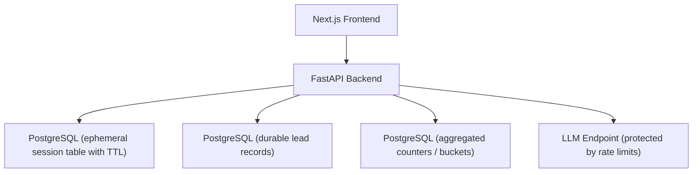
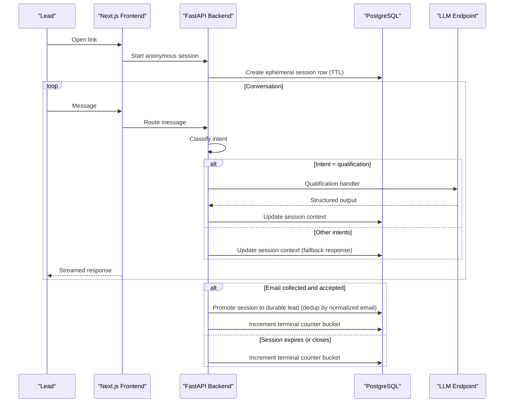
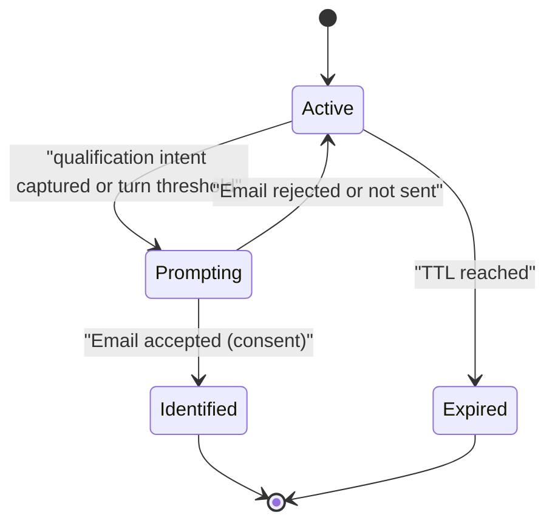
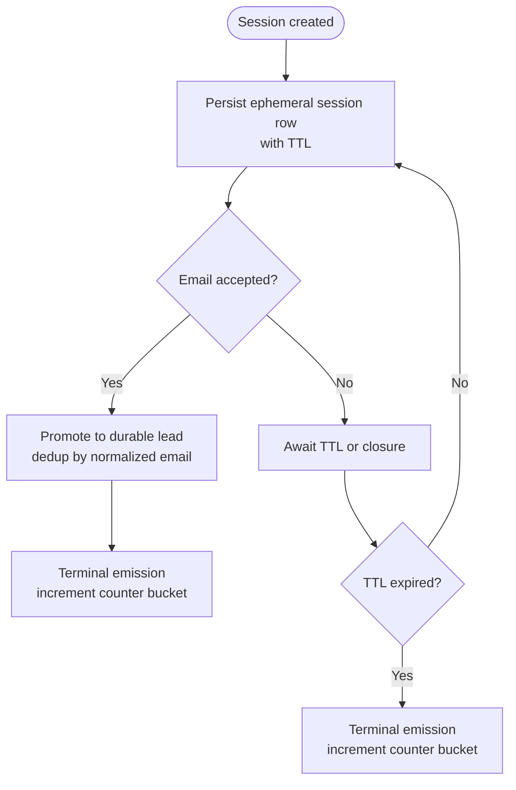
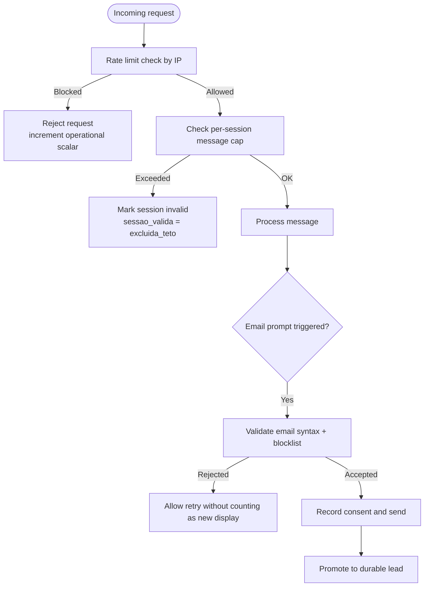
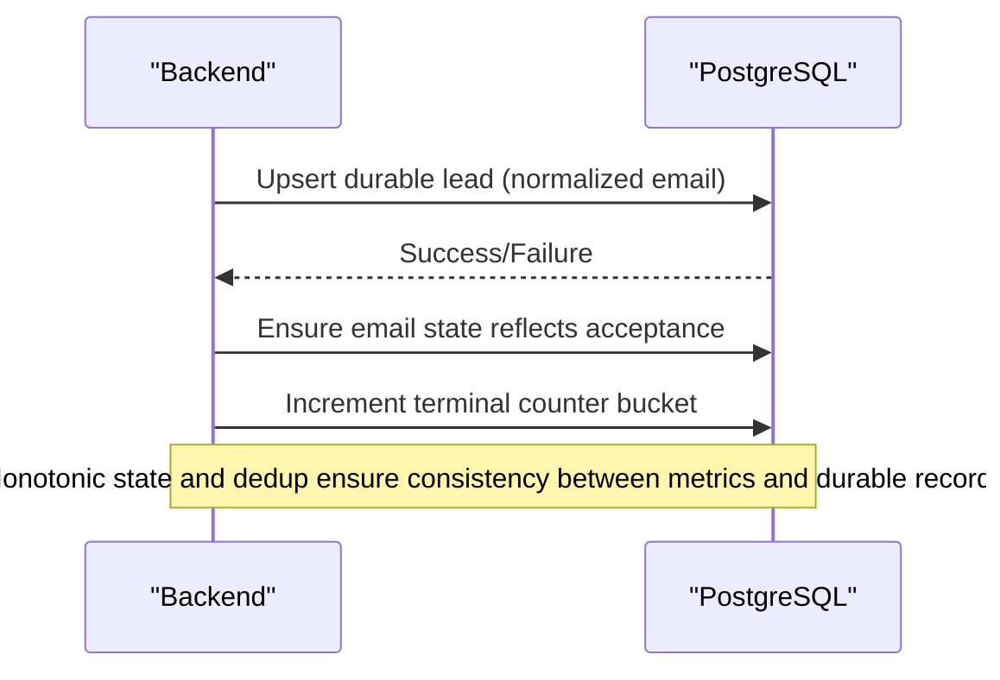
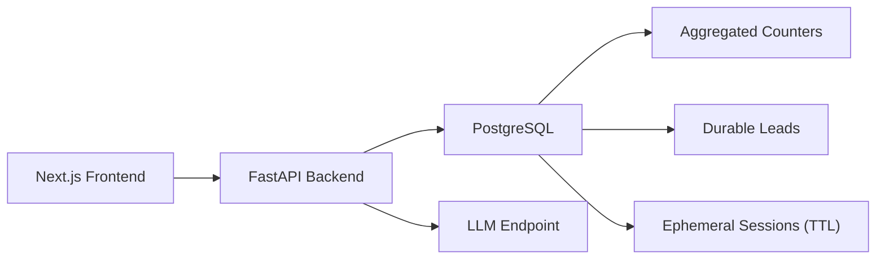

# Session Data Flow

<cite>
**Referenced Files in This Document**
- [DESIGN.md](file://.genie/brainstorms/plataforma-conversa-lead/DESIGN.md)
- [DRAFT.md](file://.genie/brainstorms/plataforma-conversa-lead/DRAFT.md)
- [01-actors-and-roles.md](file://docs/sdd/01-actors-and-roles.md)
</cite>

## Table of Contents
1. Introduction
2. Project Structure
3. Core Components
4. Architecture Overview
5. Detailed Component Analysis
6. Dependency Analysis
7. Performance Considerations
8. Troubleshooting Guide
9. Conclusion

## Introduction
This document explains the session data flow management for anonymous sessions in the Sup Better Engine, focusing on lifecycle from creation to TTL-based expiration, conversation context preservation, promotion to durable lead records, validation and rate limiting, and consistency guarantees during promotion. It synthesizes design decisions and constraints documented in the project’s design materials.

## Project Structure
The repository contains design artifacts that define the session model, persistence strategy, and operational policies:
- A design specification describing anonymous sessions stored in PostgreSQL with TTL, terminal emissions for metrics, email validation, rate limiting, and promotion to durable leads.
- A draft summarizing scope and decisions around anonymous-first conversations and identification mid-flow.
- An actors and roles document clarifying system responsibilities including platform-level session management and rate limiting.

[No sources needed since this diagram shows conceptual workflow, not actual code structure]

## Core Components
- Anonymous session record: an ephemeral row in PostgreSQL carrying conversation context until TTL expiry or promotion.
- Email validation and consent gate: syntax and blocklist checks; sending is the act of consent for the narrow purpose of commercial follow-up on this conversation.
- Promotion to durable lead: on successful submission, the session promotes to a deduplicated lead record keyed by normalized email.
- Terminal emission: at session close or TTL expiry, a single increment to aggregated counters occurs without retaining per-session identifiers.
- Rate limiting: enforced per IP and per session message cap to protect the LLM endpoint.

Key policy references:
- Anonymous sessions live in PostgreSQL with TTL; they are discarded at TTL unless promoted.
- Terminal emissions occur at close or TTL expiry, incrementing low-cardinality buckets only.
- Email state is monotonic and captures the maximum achieved state during the session.
- Rate limiting uses IP-based and per-session caps.

**Section sources**
- [DESIGN.md:198-213](file://.genie/brainstorms/plataforma-conversa-lead/DESIGN.md#L198-L213)
- [DESIGN.md:215-223](file://.genie/brainstorms/plataforma-conversa-lead/DESIGN.md#L215-L223)
- [DESIGN.md:107-123](file://.genie/brainstorms/plataforma-conversa-lead/DESIGN.md#L107-L123)
- [DESIGN.md:127-166](file://.genie/brainstorms/plataforma-conversa-lead/DESIGN.md#L127-L166)

## Architecture Overview
The platform serves a link-based landing via Next.js, which renders a chat interface backed by a FastAPI service. The backend manages classification, routing, email collection, and promotion. All transient conversation state resides in PostgreSQL with TTL. Metrics are captured via terminal emissions into pre-aggregated buckets.

**Diagram sources**
- [DESIGN.md:191-213](file://.genie/brainstorms/plataforma-conversa-lead/DESIGN.md#L191-L213)
- [DESIGN.md:51-123](file://.genie/brainstorms/plataforma-conversa-lead/DESIGN.md#L51-L123)
- [DESIGN.md:127-166](file://.genie/brainstorms/plataforma-conversa-lead/DESIGN.md#L127-L166)

## Detailed Component Analysis

### Session State Machine
Anonymous sessions progress through states governed by conversation turns, email prompts, and TTL. The email state field is monotonic and records the maximum reached state during the session.

- Active: anonymous conversation in progress; context preserved in ephemeral session row.
- Prompting: email prompt shown up to two times; re-entry after rejection does not count as a new display.
- Identified: session promoted to durable lead; no further anonymous context retained beyond TTL.
- Expired: TTL sweep discards session and emits terminal counter.

**Section sources**
- [DESIGN.md:86-99](file://.genie/brainstorms/plataforma-conversa-lead/DESIGN.md#L86-L99)
- [DESIGN.md:215-223](file://.genie/brainstorms/plataforma-conversa-lead/DESIGN.md#L215-L223)
- [DESIGN.md:198-213](file://.genie/brainstorms/plataforma-conversa-lead/DESIGN.md#L198-L213)

### Data Persistence Patterns (PostgreSQL with TTL)
- Ephemeral session rows store conversation context while anonymous and are purged at TTL.
- On identification, the session promotes to a durable lead record deduplicated by normalized email.
- At session close or TTL expiry, a single terminal emission increments aggregated counters without storing per-session identifiers or timestamps.

**Section sources**
- [DESIGN.md:198-213](file://.genie/brainstorms/plataforma-conversa-lead/DESIGN.md#L198-L213)
- [DESIGN.md:127-166](file://.genie/brainstorms/plataforma-conversa-lead/DESIGN.md#L127-L166)

### Session Validation and Rate Limiting
- Email validation includes syntax checks and a public disposable domain blocklist; sending is the consent gate.
- Rate limiting enforces per-IP and per-session message caps to protect the LLM endpoint.
- Sessions exceeding limits are marked invalid and excluded from engagement counts; separate operational scalars track edge-blocks by IP and day.

**Section sources**
- [DESIGN.md:99-123](file://.genie/brainstorms/plataforma-conversa-lead/DESIGN.md#L99-L123)
- [DESIGN.md:127-166](file://.genie/brainstorms/plataforma-conversa-lead/DESIGN.md#L127-L166)

### Consistency During Promotion to Durable Leads
- Monotonic email state ensures that the recorded maximum aligns with whether a durable lead exists.
- Deduplication by normalized email prevents duplicate durable records.
- Terminal emissions guarantee metric completeness even when sessions expire without identification.

**Section sources**
- [DESIGN.md:215-223](file://.genie/brainstorms/plataforma-conversa-lead/DESIGN.md#L215-L223)
- [DESIGN.md:127-166](file://.genie/brainstorms/plataforma-conversa-lead/DESIGN.md#L127-L166)

### Examples of Session Data Structures and Transitions
- Ephemeral session row: carries conversation context and metadata until TTL or promotion.
- Durable lead record: persisted lead with normalized email key and consent details.
- Aggregated counters: low-cardinality buckets incremented once per session at close or TTL.

Representative fields and transitions are defined by the design’s scope and decisions:
- Session validity flags capture exclusion reasons (rate limit vs. message cap).
- Email state progresses monotonically across four values.
- Origin and intent dimensions feed into aggregated buckets.

**Section sources**
- [DESIGN.md:127-166](file://.genie/brainstorms/plataforma-conversa-lead/DESIGN.md#L127-L166)
- [DESIGN.md:215-223](file://.genie/brainstorms/plataforma-conversa-lead/DESIGN.md#L215-L223)

### Cleanup Processes
- TTL sweep removes ephemeral session rows and their transcripts.
- Terminal emission occurs for every session, including those that never engaged or were excluded by caps, ensuring denominator integrity.
- Operational scalars log blocked requests separately to avoid contaminating session units.

**Section sources**
- [DESIGN.md:198-213](file://.genie/brainstorms/plataforma-conversa-lead/DESIGN.md#L198-L213)
- [DESIGN.md:127-166](file://.genie/brainstorms/plataforma-conversa-lead/DESIGN.md#L127-L166)

## Dependency Analysis
The session flow depends on coordinated components:
- Frontend orchestrates user interactions and displays prompts.
- Backend implements classification, routing, validation, and promotion logic.
- PostgreSQL provides both ephemeral storage with TTL and durable records plus aggregated counters.
- LLM endpoint is protected by rate limiting.

**Diagram sources**
- [DESIGN.md:191-213](file://.genie/brainstorms/plataforma-conversa-lead/DESIGN.md#L191-L213)

**Section sources**
- [DESIGN.md:191-213](file://.genie/brainstorms/plataforma-conversa-lead/DESIGN.md#L191-L213)

## Performance Considerations
- Using PostgreSQL with TTL avoids introducing Redis for ephemeral state, reducing operational overhead for a pilot tenant.
- Terminal emissions keep metrics lightweight and privacy-preserving by avoiding per-session logs.
- Rate limiting protects the LLM endpoint and controls costs under untrusted traffic.

[No sources needed since this section provides general guidance]

## Troubleshooting Guide
Common issues and mitigations:
- Excessive LLM cost or abuse: verify IP-based rate limiting and per-session caps; inspect operational scalars for blocked requests.
- Inconsistent metrics vs. durable leads: confirm monotonic email state and deduplication by normalized email; ensure terminal emissions occur on both close and TTL expiry.
- Overly aggressive exclusions: review message cap thresholds and adjust based on observed legitimate conversation lengths.

**Section sources**
- [DESIGN.md:127-166](file://.genie/brainstorms/plataforma-conversa-lead/DESIGN.md#L127-L166)
- [DESIGN.md:215-223](file://.genie/brainstorms/plataforma-conversa-lead/DESIGN.md#L215-L223)

## Conclusion
The Sup Better Engine models anonymous sessions as ephemeral PostgreSQL rows with TTL, preserving conversation context until either promotion to a durable lead or TTL-based expiration. A monotonic email state and terminal emissions ensure consistent metrics and compliance. Rate limiting safeguards the LLM endpoint, while careful promotion rules maintain data integrity between transient sessions and durable leads.

[No sources needed since this section summarizes without analyzing specific files]