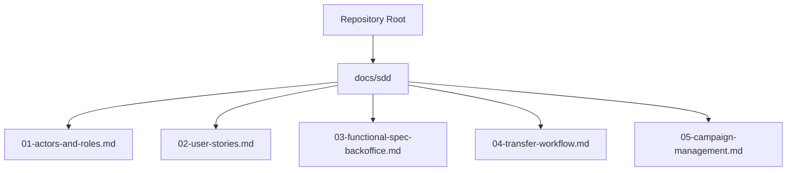
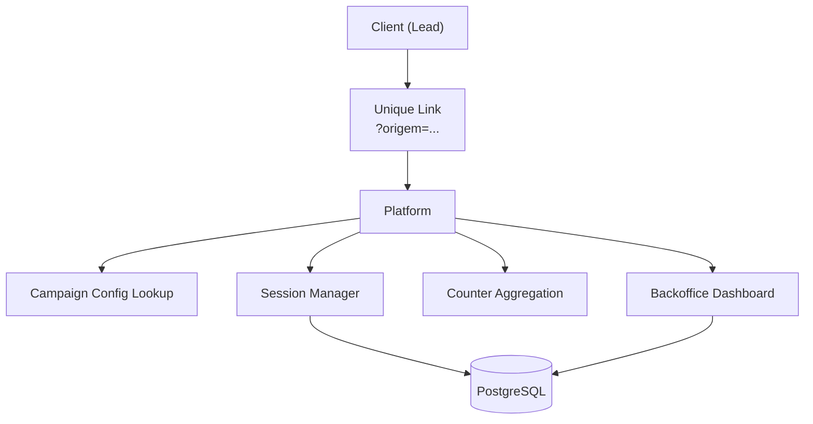
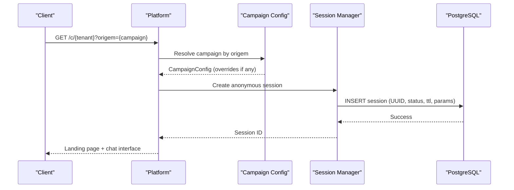
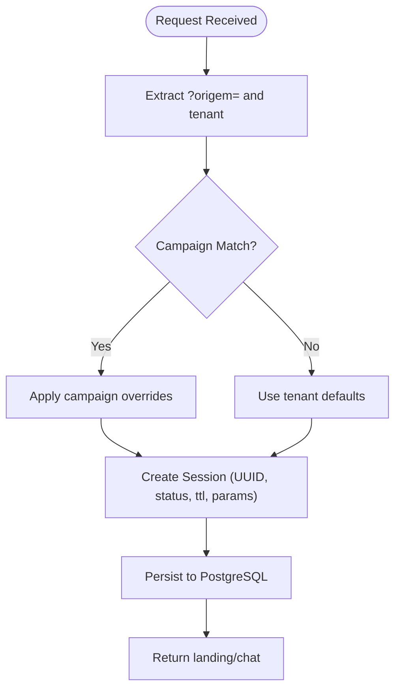
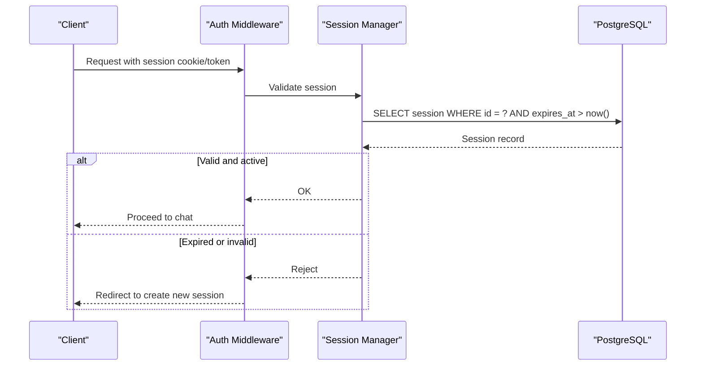
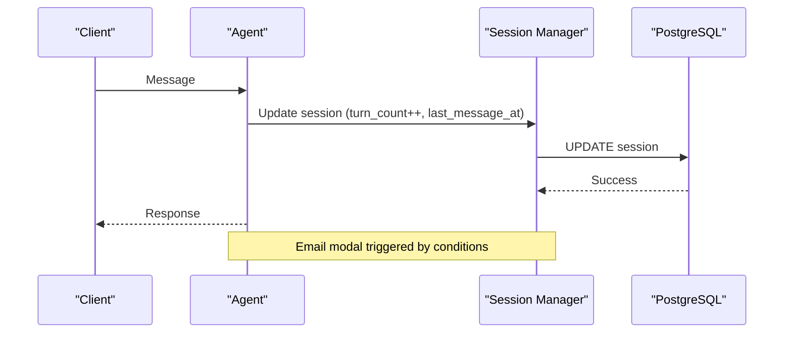
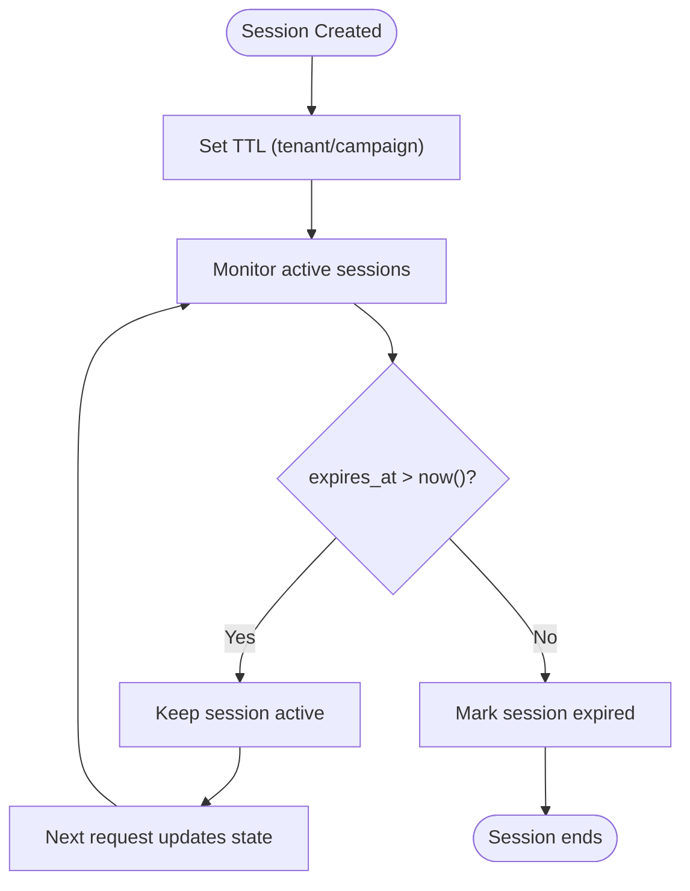
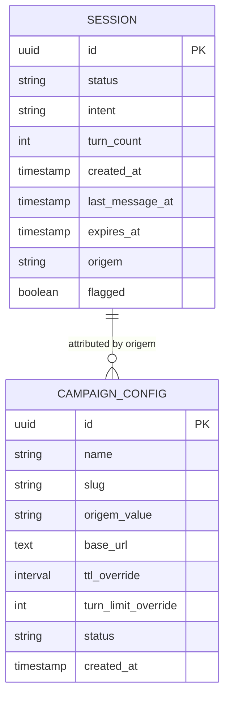
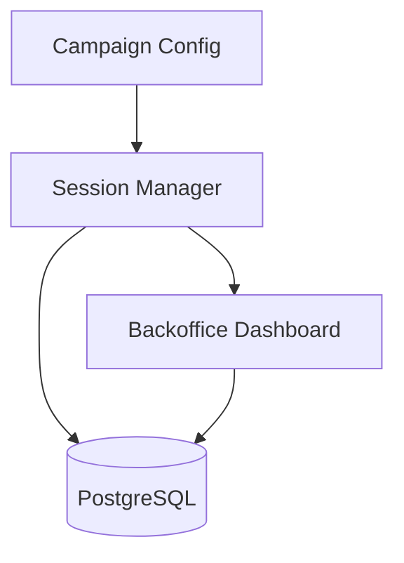

# Session Lifecycle Management

<cite>
**Referenced Files in This Document**
- [README.md](file://README.md)
- [01-actors-and-roles.md](file://docs/sdd/01-actors-and-roles.md)
- [02-user-stories.md](file://docs/sdd/02-user-stories.md)
- [03-functional-spec-backoffice.md](file://docs/sdd/03-functional-spec-backoffice.md)
- [04-transfer-workflow.md](file://docs/sdd/04-transfer-workflow.md)
- [05-campaign-management.md](file://docs/sdd/05-campaign-management.md)
</cite>

## Table of Contents
1. Introduction
2. Project Structure
3. Core Components
4. Architecture Overview
5. Detailed Component Analysis
6. Dependency Analysis
7. Performance Considerations
8. Troubleshooting Guide
9. Conclusion

## Introduction
This document explains the session lifecycle management for the Sup Better Engine, focusing on how a unique link leads to an anonymous session, how sessions are initialized and tracked across requests, and how they expire. It consolidates requirements from the project’s design documents to describe:
- Unique link generation and attribution via campaign parameters
- Anonymous session creation with UUID assignment and initial state
- TTL configuration and automatic expiration
- Validation mechanisms and authentication bypass for anonymous users
- Tracking across multiple requests
- Storage strategy using PostgreSQL with TTL enforcement and connection pooling considerations
- Performance optimization techniques

The repository is in early stages; this documentation synthesizes the functional specifications and user stories that define session behavior.

**Section sources**
- [README.md:1-8](file://README.md#L1-L8)

## Project Structure
At present, the repository contains documentation and planning artifacts rather than source code. The session lifecycle is defined by the SDD (Software Design Document) files under docs/sdd. These documents specify actors, user stories, backoffice features, transfer workflows, and campaign configuration that together govern session creation, tracking, and expiration.

[No sources needed since this section provides a high-level overview without analyzing specific files]

## Core Components
- Unique Link and Campaign Attribution: Sessions originate from unique links that include campaign attribution via query parameters. This determines the origin dimension used for counters and can influence optional per-session parameters.
- Anonymous Session Initialization: When a client opens a unique link, the platform creates an anonymous session with a UUID, sets initial state (status, intent, turn count), and applies TTL and operational parameters.
- Request Tracking: Each subsequent request within the same session updates turn counts, timestamps, and may capture email consent state.
- TTL Enforcement and Expiration: Sessions have a configurable TTL. Expired sessions are no longer active and are excluded from live monitoring.
- Backoffice Visibility: Operators can monitor active sessions, review leads, and view metrics. Backoffice sessions use JWT with refresh tokens and an 8-hour TTL.

Key behaviors derived from the specifications:
- Unique link entry requires no login or form barriers at start.
- Email collection occurs contextually after certain triggers or turns, with validation and consent handling.
- Active sessions are visible in operator dashboards with status, intent, turn count, time active, and flags.
- TTL and turn limits are configurable operational parameters.

**Section sources**
- [02-user-stories.md:10-36](file://docs/sdd/02-user-stories.md#L10-L36)
- [03-functional-spec-backoffice.md:87-120](file://docs/sdd/03-functional-spec-backoffice.md#L87-L120)
- [03-functional-spec-backoffice.md:192-210](file://docs/sdd/03-functional-spec-backoffice.md#L192-L210)
- [05-campaign-management.md:107-150](file://docs/sdd/05-campaign-management.md#L107-L150)

## Architecture Overview
The session architecture spans link resolution, session initialization, request processing, and backoffice monitoring. Campaigns provide attribution and optional parameter overrides. PostgreSQL stores session data and enforces TTL-based expiration. Connection pooling supports concurrent access during peak traffic.

**Diagram sources**
- [05-campaign-management.md:107-150](file://docs/sdd/05-campaign-management.md#L107-L150)
- [03-functional-spec-backoffice.md:284-335](file://docs/sdd/03-functional-spec-backoffice.md#L284-L335)

## Detailed Component Analysis

### Unique Link Generation and Attribution
- Link structure includes tenant slug and optional campaign attribution via ?origem=.
- On request, the platform extracts the origem parameter, matches it against configured campaigns, and applies any campaign-specific overrides (e.g., TTL or turn limit).
- If no match is found, the session is tagged as unknown origin and uses tenant defaults.

**Diagram sources**
- [05-campaign-management.md:107-150](file://docs/sdd/05-campaign-management.md#L107-L150)
- [03-functional-spec-backoffice.md:192-210](file://docs/sdd/03-functional-spec-backoffice.md#L192-L210)

**Section sources**
- [05-campaign-management.md:107-150](file://docs/sdd/05-campaign-management.md#L107-L150)

### Anonymous Session Initialization
- Upon opening the unique link, the platform initializes an anonymous session:
  - Assigns a UUID as session identifier
  - Sets initial state: status active, intent undefined until classification, turn count zero, timestamp recorded
  - Applies TTL based on tenant default or campaign override
  - Records origin attribution for counter bucketing

**Diagram sources**
- [05-campaign-management.md:107-150](file://docs/sdd/05-campaign-management.md#L107-L150)
- [03-functional-spec-backoffice.md:87-120](file://docs/sdd/03-functional-spec-backoffice.md#L87-L120)

**Section sources**
- [02-user-stories.md:10-36](file://docs/sdd/02-user-stories.md#L10-L36)
- [05-campaign-management.md:107-150](file://docs/sdd/05-campaign-management.md#L107-L150)
- [03-functional-spec-backoffice.md:87-120](file://docs/sdd/03-functional-spec-backoffice.md#L87-L120)

### Session Validation and Authentication Bypass
- Public-facing sessions do not require authentication at entry; clients can start chatting immediately without login or forms.
- For backoffice access, authentication uses email/password with JWT and refresh tokens, with an 8-hour TTL for backoffice sessions.
- Session validation checks ensure:
  - The session exists and is not expired
  - Turn limits are respected
  - Rate limiting rules are enforced per IP/hour
  - Email modal display limits are observed

**Diagram sources**
- [03-functional-spec-backoffice.md:26-35](file://docs/sdd/03-functional-spec-backoffice.md#L26-L35)
- [03-functional-spec-backoffice.md:192-210](file://docs/sdd/03-functional-spec-backoffice.md#L192-L210)

**Section sources**
- [02-user-stories.md:10-17](file://docs/sdd/02-user-stories.md#L10-L17)
- [03-functional-spec-backoffice.md:26-35](file://docs/sdd/03-functional-spec-backoffice.md#L26-L35)
- [03-functional-spec-backoffice.md:192-210](file://docs/sdd/03-functional-spec-backoffice.md#L192-L210)

### Multi-Request Tracking and State Updates
- Each request increments turn count and updates last message timestamp.
- Email collection modal appears after qualification handler captures intent/urgency/fit or at a configured turn threshold, with maximum displays per session.
- Operator dashboard shows active sessions with sortable fields and visual indicators for TTL and turn limit proximity.

**Diagram sources**
- [02-user-stories.md:28-36](file://docs/sdd/02-user-stories.md#L28-L36)
- [03-functional-spec-backoffice.md:87-120](file://docs/sdd/03-functional-spec-backoffice.md#L87-L120)

**Section sources**
- [02-user-stories.md:28-36](file://docs/sdd/02-user-stories.md#L28-L36)
- [03-functional-spec-backoffice.md:87-120](file://docs/sdd/03-functional-spec-backoffice.md#L87-L120)

### TTL Configuration and Automatic Expiration
- Session TTL is configurable via tenant defaults or campaign overrides.
- Expired sessions are marked inactive and excluded from live monitoring.
- Backoffice sessions use JWT with refresh tokens and an 8-hour TTL.

**Diagram sources**
- [03-functional-spec-backoffice.md:192-210](file://docs/sdd/03-functional-spec-backoffice.md#L192-L210)
- [03-functional-spec-backoffice.md:26-35](file://docs/sdd/03-functional-spec-backoffice.md#L26-L35)

**Section sources**
- [03-functional-spec-backoffice.md:192-210](file://docs/sdd/03-functional-spec-backoffice.md#L192-L210)
- [03-functional-spec-backoffice.md:26-35](file://docs/sdd/03-functional-spec-backoffice.md#L26-L35)

### Session Storage Strategy Using PostgreSQL
- Sessions are stored in PostgreSQL with fields including UUID, status, intent, turn count, timestamps, and TTL.
- Counter aggregation uses pre-aggregated buckets for fast reads.
- Backoffice queries read directly from Postgres; session reads filter by TTL to show only active sessions.

**Diagram sources**
- [03-functional-spec-backoffice.md:87-120](file://docs/sdd/03-functional-spec-backoffice.md#L87-L120)
- [05-campaign-management.md:226-252](file://docs/sdd/05-campaign-management.md#L226-L252)

**Section sources**
- [03-functional-spec-backoffice.md:284-335](file://docs/sdd/03-functional-spec-backoffice.md#L284-L335)
- [05-campaign-management.md:226-252](file://docs/sdd/05-campaign-management.md#L226-L252)

### Connection Pooling Considerations
- While implementation details are not present in the repository, typical practices for PostgreSQL-backed services include:
  - Using a connection pooler (e.g., PgBouncer) to manage concurrent connections efficiently
  - Tuning pool size based on expected concurrency and database capacity
  - Ensuring short-lived transactions and avoiding long-running queries in hot paths
  - Monitoring connection usage and adjusting pool settings under load

[No sources needed since this section provides general guidance]

### Performance Optimization Techniques
- Pre-aggregated counters reduce query complexity and improve dashboard performance.
- Indexes on frequently filtered columns (e.g., expires_at, origem) support fast session lookups and filtering.
- Cache TTL for operational parameters ensures changes propagate quickly while minimizing repeated config reads.
- Limiting modal displays per session reduces unnecessary UI interactions and backend calls.

**Section sources**
- [03-functional-spec-backoffice.md:192-210](file://docs/sdd/03-functional-spec-backoffice.md#L192-L210)
- [03-functional-spec-backoffice.md:284-335](file://docs/sdd/03-functional-spec-backoffice.md#L284-L335)
- [02-user-stories.md:28-36](file://docs/sdd/02-user-stories.md#L28-L36)

## Dependency Analysis
The session lifecycle depends on several components:
- Campaign configuration influences attribution and optional parameter overrides
- Session manager handles creation, updates, and TTL enforcement
- PostgreSQL stores session records and counters
- Backoffice dashboard reads active sessions and metrics

**Diagram sources**
- [05-campaign-management.md:107-150](file://docs/sdd/05-campaign-management.md#L107-L150)
- [03-functional-spec-backoffice.md:284-335](file://docs/sdd/03-functional-spec-backoffice.md#L284-L335)

**Section sources**
- [05-campaign-management.md:107-150](file://docs/sdd/05-campaign-management.md#L107-L150)
- [03-functional-spec-backoffice.md:284-335](file://docs/sdd/03-functional-spec-backoffice.md#L284-L335)

## Performance Considerations
- Keep session update operations lightweight to avoid blocking the chat flow.
- Use indexes on expires_at and origem to optimize active session queries and filtering.
- Employ pre-aggregated counters for dashboards to minimize heavy joins.
- Configure operational parameters (TTL, turn limits) to balance conversation depth and resource usage.
- Monitor database connection pools and adjust sizes according to traffic patterns.

[No sources needed since this section provides general guidance]

## Troubleshooting Guide
Common issues and resolutions:
- Session not appearing in dashboard:
  - Verify TTL has not expired; check expires_at field
  - Ensure session was created with valid attribution and parameters
- Excessive modal displays:
  - Confirm max displays per session is enforced
  - Review email modal trigger turn configuration
- High latency on session reads:
  - Check index usage on expires_at and origem
  - Evaluate query plans for active session filters
- Backoffice auth failures:
  - Validate JWT token and refresh token TTL (8 hours)
  - Ensure password policy and hashing are correctly applied

**Section sources**
- [03-functional-spec-backoffice.md:26-35](file://docs/sdd/03-functional-spec-backoffice.md#L26-L35)
- [03-functional-spec-backoffice.md:87-120](file://docs/sdd/03-functional-spec-backoffice.md#L87-L120)
- [02-user-stories.md:28-36](file://docs/sdd/02-user-stories.md#L28-L36)

## Conclusion
The Sup Better Engine’s session lifecycle is defined through clear requirements for unique link entry, anonymous session initialization, multi-request tracking, and TTL-driven expiration. Campaign attribution enables granular tracking and optional parameter overrides. PostgreSQL serves as the storage layer with pre-aggregated counters for performance. Backoffice tools provide visibility into active sessions and operational metrics. While implementation code is not present in this repository, these specifications provide a solid blueprint for building robust session management functionality.

[No sources needed since this section summarizes without analyzing specific files]