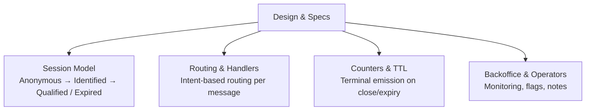
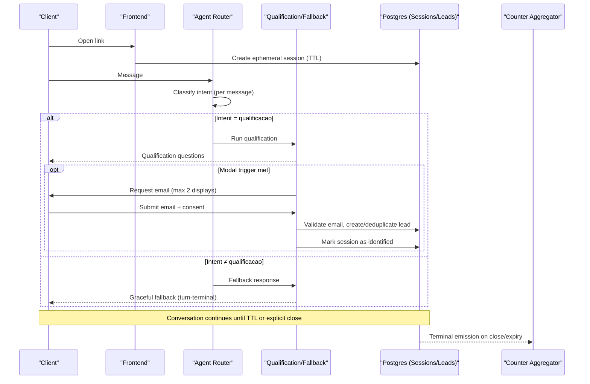
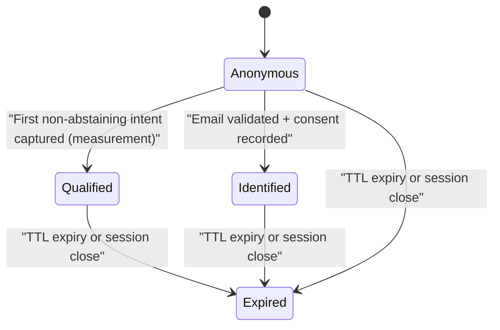
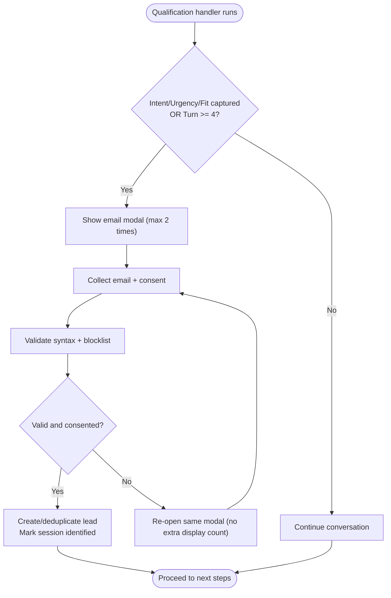
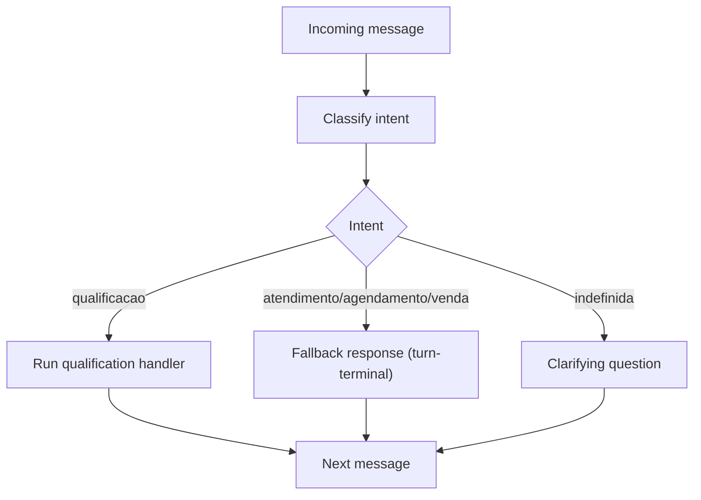
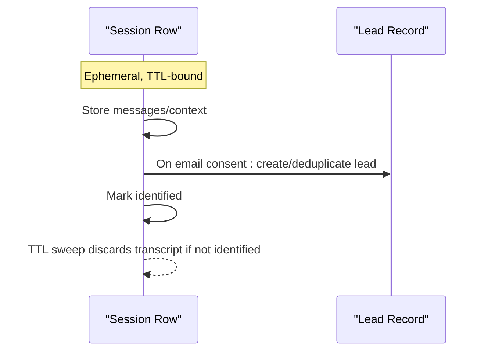
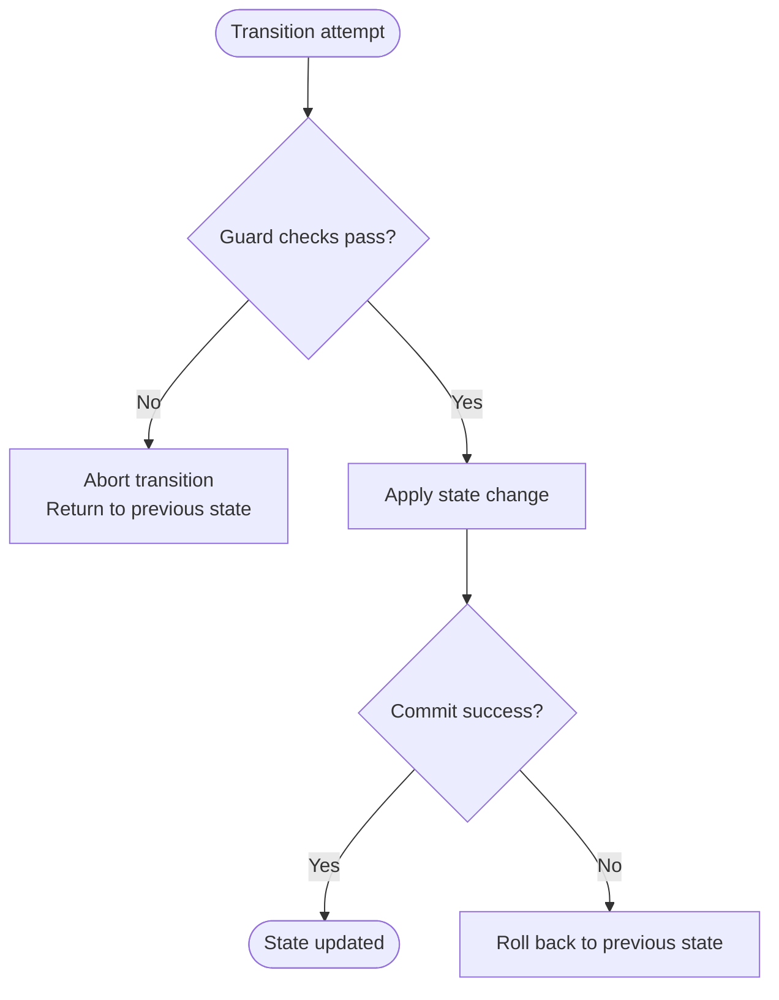
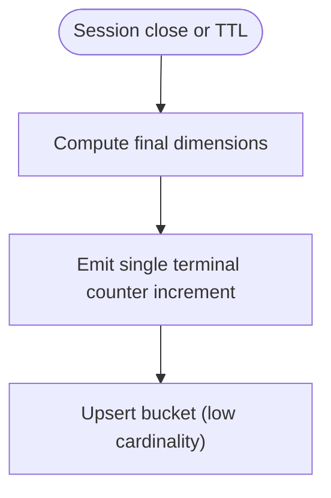
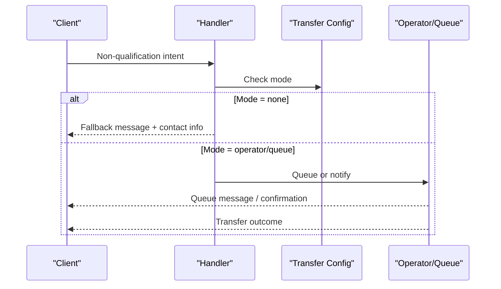
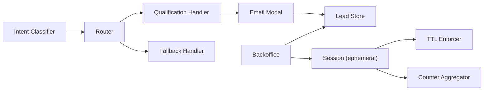

# State Transition Handling

<cite>
**Referenced Files in This Document**
- [DESIGN.md](file://.genie/brainstorms/plataforma-conversa-lead/DESIGN.md)
- [DRAFT.md](file://.genie/brainstorms/plataforma-conversa-lead/DRAFT.md)
- [01-actors-and-roles.md](file://docs/sdd/01-actors-and-roles.md)
- [02-user-stories.md](file://docs/sdd/02-user-stories.md)
- [03-functional-spec-backoffice.md](file://docs/sdd/03-functional-spec-backoffice.md)
- [04-transfer-workflow.md](file://docs/sdd/04-transfer-workflow.md)
</cite>

## Table of Contents
1. Introduction
2. Project Structure
3. Core Components
4. Architecture Overview
5. Detailed Component Analysis
6. Dependency Analysis
7. Performance Considerations
8. Troubleshooting Guide
9. Conclusion

## Introduction
This document explains how the Sup Better Engine handles session state transitions for a lead conversation flow. It focuses on the lifecycle from anonymous to identified, qualified, and expired states; the triggers and guards that drive transitions; how conversation context is preserved across changes; and how terminal emissions and counters are produced when sessions end or expire. The guidance is derived from the project’s design and functional specifications.

## Project Structure
The repository contains design and functional specification documents that define the session model, state machine, and operational behavior. There is no application code present; implementation details are specified at the design level.

[No sources needed since this diagram shows conceptual structure, not actual code]

**Section sources**
- [DESIGN.md:198-213](file://.genie/brainstorms/plataforma-conversa-lead/DESIGN.md#L198-L213)
- [01-actors-and-roles.md:24-30](file://docs/sdd/01-actors-and-roles.md#L24-L30)

## Core Components
- Session lifecycle: ephemeral Postgres row with TTL while anonymous; promoted to a durable lead record upon successful email consent and submission.
- Intent classifier and routing: per-message intent classification drives handler selection (qualification vs fallback vs clarifying question).
- Email identification modal: triggered by qualification handler under defined conditions; maximum two displays per session; validation includes syntax and disposable domain blocklist.
- Counters and terminal emission: each session emits one terminal counter increment on close or TTL expiry, aggregating dimensions without retaining per-session identifiers.
- Backoffice monitoring: operators can view active sessions, flag issues, add notes, and review leads.

**Section sources**
- [DESIGN.md:85-109](file://.genie/brainstorms/plataforma-conversa-lead/DESIGN.md#L85-L109)
- [DESIGN.md:198-213](file://.genie/brainstorms/plataforma-conversa-lead/DESIGN.md#L198-L213)
- [02-user-stories.md:28-45](file://docs/sdd/02-user-stories.md#L28-L45)
- [03-functional-spec-backoffice.md:87-120](file://docs/sdd/03-functional-spec-backoffice.md#L87-L120)

## Architecture Overview
High-level flow: client opens link → anonymous chat starts → intent classified per message → qualification handler may request email → if accepted, session promotes to durable lead → session ends or expires → terminal counter emitted.

**Diagram sources**
- [DESIGN.md:198-213](file://.genie/brainstorms/plataforma-conversa-lead/DESIGN.md#L198-L213)
- [DESIGN.md:85-109](file://.genie/brainstorms/plataforma-conversa-lead/DESIGN.md#L85-L109)
- [02-user-stories.md:28-45](file://docs/sdd/02-user-stories.md#L28-L45)

## Detailed Component Analysis

### Session State Machine
States and transitions:
- Anonymous: initial state after opening the link; ephemeral session stores conversation context.
- Identified: achieved when email is validated and consent is recorded; session promotes to a durable lead record.
- Qualified: determined by the first non-abstaining intent label for the session (measurement rule), typically via the qualification handler.
- Expired: TTL reached; ephemeral session discarded; terminal counter emitted.

**Diagram sources**
- [DESIGN.md:198-213](file://.genie/brainstorms/plataforma-conversa-lead/DESIGN.md#L198-L213)
- [DESIGN.md:128-149](file://.genie/brainstorms/plataforma-conversa-lead/DESIGN.md#L128-L149)

**Section sources**
- [DESIGN.md:198-213](file://.genie/brainstorms/plataforma-conversa-lead/DESIGN.md#L198-L213)
- [DESIGN.md:128-149](file://.genie/brainstorms/plataforma-conversa-lead/DESIGN.md#L128-L149)

### Promotion from Anonymous to Identified (Lead Qualification)
Triggers and conditions:
- Trigger: qualification handler captures intent, urgency, fit OR turn threshold reached (whichever comes first).
- Display limit: email modal shown at most twice per session; re-prompt on validation failure does not count as a new display.
- Validation: syntax check plus disposable domain blocklist; sending email equals consent act for the stated purpose.
- Deduplication: normalized email (trim + lowercase) used to create or merge durable lead record.

**Diagram sources**
- [DESIGN.md:85-109](file://.genie/brainstorms/plataforma-conversa-lead/DESIGN.md#L85-L109)
- [02-user-stories.md:28-45](file://docs/sdd/02-user-stories.md#L28-L45)

**Section sources**
- [DESIGN.md:85-109](file://.genie/brainstorms/plataforma-conversa-lead/DESIGN.md#L85-L109)
- [02-user-stories.md:28-45](file://docs/sdd/02-user-stories.md#L28-L45)

### Routing and Per-Message Intent Classification
- Routing is evaluated per message: qualification goes to the real handler; other intents go to a graceful fallback; undefined receives a clarifying question.
- Session measurement aggregates the first non-abstaining intent label; this protects metrics from compounding classifier error across turns.

**Diagram sources**
- [DESIGN.md:53-85](file://.genie/brainstorms/plataforma-conversa-lead/DESIGN.md#L53-L85)

**Section sources**
- [DESIGN.md:53-85](file://.genie/brainstorms/plataforma-conversa-lead/DESIGN.md#L53-L85)

### Context Preservation Across State Changes
- Conversation context is stored in an ephemeral session row with TTL; it persists across state changes (e.g., from anonymous to identified) until TTL expiry or explicit close.
- On promotion to identified, the durable lead record is created; the ephemeral session remains until TTL but is marked identified.
- Transcripts are discarded with TTL for non-identified sessions.

**Diagram sources**
- [DESIGN.md:198-213](file://.genie/brainstorms/plataforma-conversa-lead/DESIGN.md#L198-L213)

**Section sources**
- [DESIGN.md:198-213](file://.genie/brainstorms/plataforma-conversa-lead/DESIGN.md#L198-L213)

### State Validation, Transition Guards, and Rollbacks
- Guards:
  - Email modal only appears under defined conditions (handler-captured data or turn threshold) and limited to two displays per session.
  - Email validation enforces syntax and disposable domain blocklist before consent is recorded.
  - Monotonic email state field records the maximum achieved state per session to avoid impossible combinations.
- Rollbacks:
  - If email validation fails, the same modal reopens without counting as a new display attempt.
  - Sessions that do not identify are discarded at TTL; no persistent PII remains for non-identified sessions.

**Diagram sources**
- [DESIGN.md:85-109](file://.genie/brainstorms/plataforma-conversa-lead/DESIGN.md#L85-L109)
- [DESIGN.md:215-223](file://.genie/brainstorms/plataforma-conversa-lead/DESIGN.md#L215-L223)

**Section sources**
- [DESIGN.md:85-109](file://.genie/brainstorms/plataforma-conversa-lead/DESIGN.md#L85-L109)
- [DESIGN.md:215-223](file://.genie/brainstorms/plataforma-conversa-lead/DESIGN.md#L215-L223)

### Terminal Emission and Counter Aggregation
- Each session emits exactly one terminal counter increment on close or TTL expiry.
- Dimensions include origin, intent (including abstention and none), email state (monotonic), and session validity (valid, rate-limited, turn-limit excluded).
- No per-session identifiers or timestamps are retained in counters; only aggregated buckets.

**Diagram sources**
- [DESIGN.md:128-149](file://.genie/brainstorms/plataforma-conversa-lead/DESIGN.md#L128-L149)
- [DESIGN.md:204-213](file://.genie/brainstorms/plataforma-conversa-lead/DESIGN.md#L204-L213)

**Section sources**
- [DESIGN.md:128-149](file://.genie/brainstorms/plataforma-conversa-lead/DESIGN.md#L128-L149)
- [DESIGN.md:204-213](file://.genie/brainstorms/plataforma-conversa-lead/DESIGN.md#L204-L213)

### Transfer Workflow Integration (Optional Extension)
- The transfer workflow defines three triggers (none configured, operator/system decision, client-requested) and a state machine that can queue or confirm transfers.
- In fatia 1, the minimum viable behavior formalizes the “no transfer available” fallback and tracks attempts via a scalar counter; full live handoff is deferred.

**Diagram sources**
- [04-transfer-workflow.md:80-135](file://docs/sdd/04-transfer-workflow.md#L80-L135)
- [04-transfer-workflow.md:195-235](file://docs/sdd/04-transfer-workflow.md#L195-L235)

**Section sources**
- [04-transfer-workflow.md:80-135](file://docs/sdd/04-transfer-workflow.md#L80-L135)
- [04-transfer-workflow.md:195-235](file://docs/sdd/04-transfer-workflow.md#L195-L235)

## Dependency Analysis
Key dependencies among components:
- Session depends on TTL enforcement and counter emission.
- Routing depends on per-message intent classification.
- Identification depends on email validation and consent recording.
- Backoffice depends on session status and lead records for monitoring and actions.

**Diagram sources**
- [DESIGN.md:53-85](file://.genie/brainstorms/plataforma-conversa-lead/DESIGN.md#L53-L85)
- [DESIGN.md:198-213](file://.genie/brainstorms/plataforma-conversa-lead/DESIGN.md#L198-L213)
- [03-functional-spec-backoffice.md:87-120](file://docs/sdd/03-functional-spec-backoffice.md#L87-L120)

**Section sources**
- [DESIGN.md:53-85](file://.genie/brainstorms/plataforma-conversa-lead/DESIGN.md#L53-L85)
- [DESIGN.md:198-213](file://.genie/brainstorms/plataforma-conversa-lead/DESIGN.md#L198-L213)
- [03-functional-spec-backoffice.md:87-120](file://docs/sdd/03-functional-spec-backoffice.md#L87-L120)

## Performance Considerations
- Keep routing per message lightweight; classify once per message and route accordingly.
- Limit email modal prompts to reduce friction and preserve conversion rates.
- Use monotonic email state to prevent invalid state combinations and simplify reconciliation.
- Ensure TTL sweeps are efficient; they must emit terminal counters and discard transcripts without retaining per-session identifiers.

[No sources needed since this section provides general guidance]

## Troubleshooting Guide
Common issues and resolutions:
- Email validation failures: Reopen the same modal without counting as a new display; ensure blocklist and syntax checks are applied consistently.
- Excessive fallback responses: Verify per-message routing is functioning; ensure qualification handler triggers correctly when intent is qualificacao.
- Missing terminal counters: Confirm that every session emits a terminal counter on close or TTL expiry and that aggregation uses the correct dimensions.
- Operator visibility: Use backoffice session monitor to detect sessions approaching TTL or turn limits; flag problematic sessions and add notes.

**Section sources**
- [DESIGN.md:85-109](file://.genie/brainstorms/plataforma-conversa-lead/DESIGN.md#L85-L109)
- [DESIGN.md:128-149](file://.genie/brainstorms/plataforma-conversa-lead/DESIGN.md#L128-L149)
- [03-functional-spec-backoffice.md:87-120](file://docs/sdd/03-functional-spec-backoffice.md#L87-L120)

## Conclusion
The Sup Better Engine defines a clear session state machine centered on anonymous conversations that can be promoted to identified leads through contextual email collection. Routing is per-message based on intent classification, while session-level measurement preserves metric integrity. Terminal emissions ensure accurate counting without retaining per-session identifiers. Backoffice tools provide operational visibility and control. The design balances simplicity, privacy, and measurability for the pilot phase.

[No sources needed since this section summarizes without analyzing specific files]