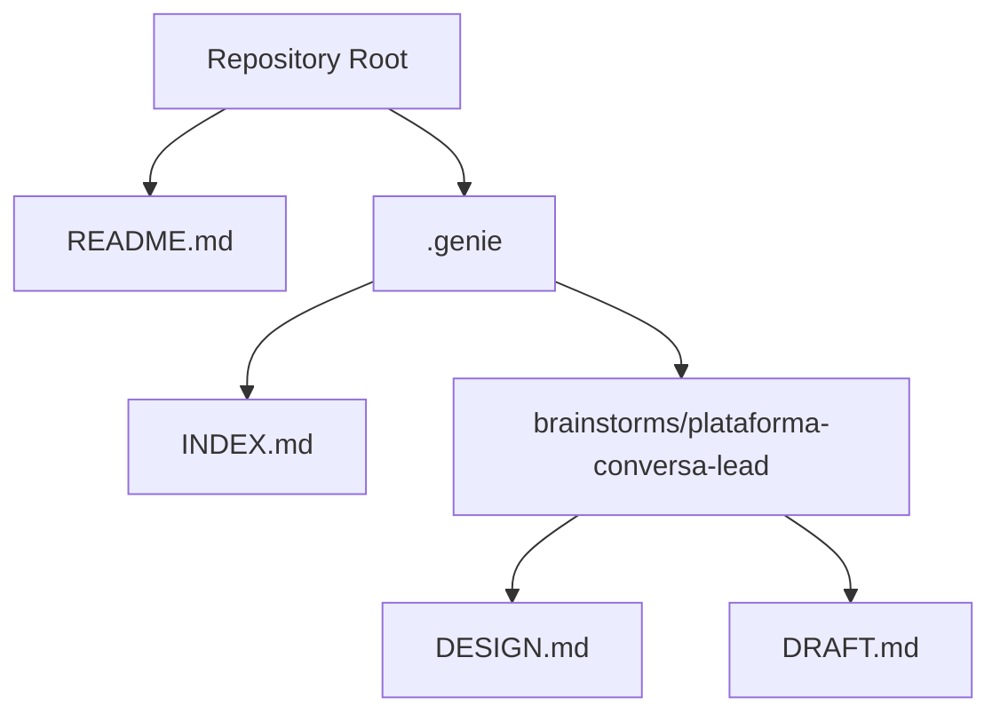
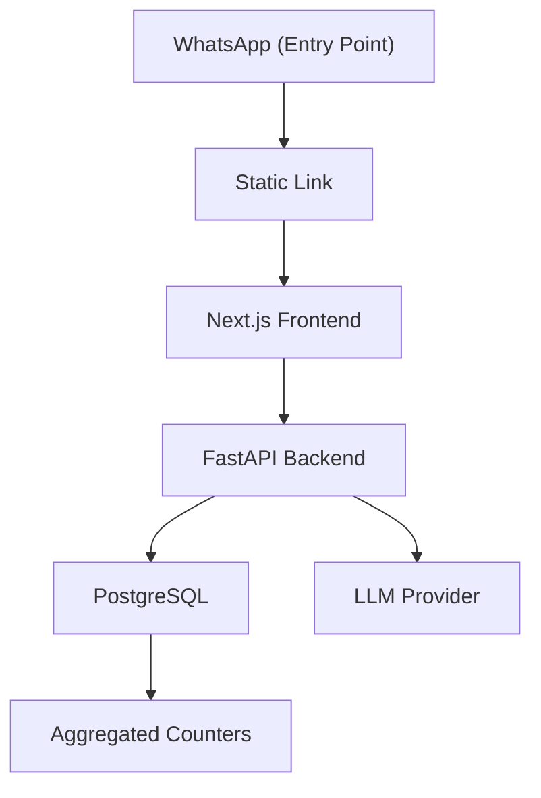
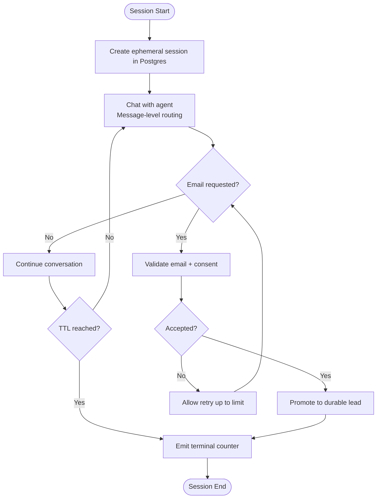
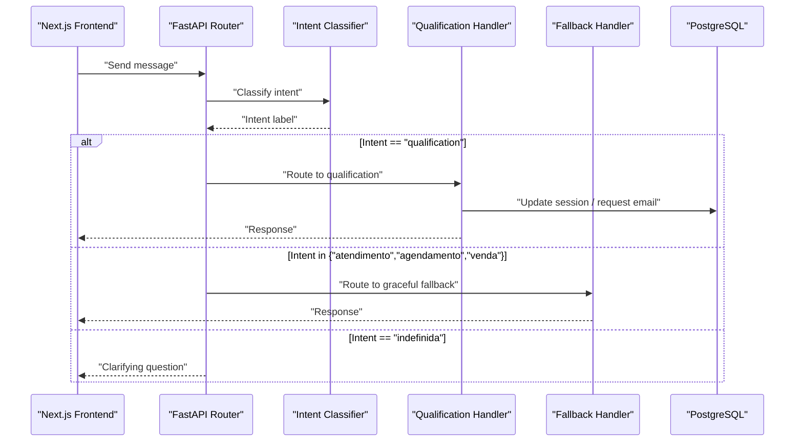
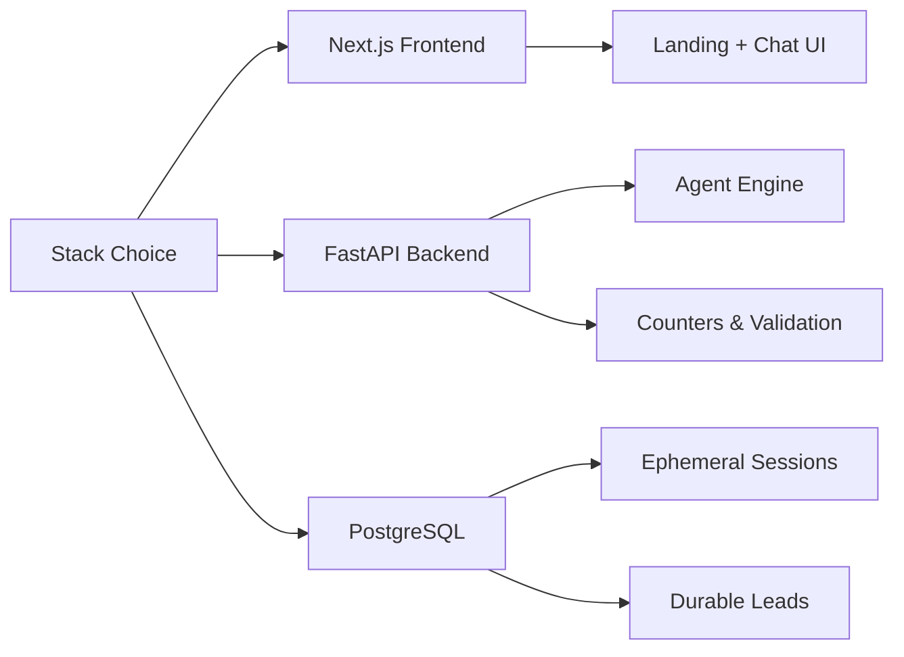
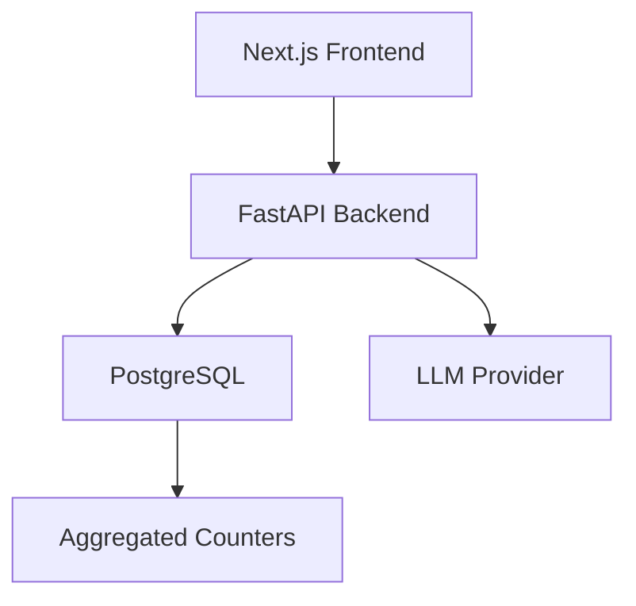

# High-Level Design

<cite>
**Referenced Files in This Document**
- [README.md](file://README.md)
- [.genie/INDEX.md](file://.genie/INDEX.md)
- [.genie/brainstorms/plataforma-conversa-lead/DESIGN.md](file://.genie/brainstorms/plataforma-conversa-lead/DESIGN.md)
- [.genie/brainstorms/plataforma-conversa-lead/DRAFT.md](file://.genie/brainstorms/plataforma-conversa-lead/DRAFT.md)
</cite>

## Table of Contents
1. Introduction
2. Project Structure
3. Core Components
4. Architecture Overview
5. Detailed Component Analysis
6. Dependency Analysis
7. Performance Considerations
8. Troubleshooting Guide
9. Conclusion

## Introduction
This document presents the high-level system design for the Sup Better Engine, focusing on a microservices-style architecture with clear separation between:
- Next.js frontend (landing and chat UI)
- FastAPI backend (agent engine, classification, routing, email validation, session-to-lead promotion)
- PostgreSQL database (ephemeral sessions, durable leads, aggregated counters)

The system is designed to test whether leads accept moving from WhatsApp to a dedicated link-based conversational platform where richer interactions and reliable identity resolution can occur. The first slice intentionally avoids solving multi-email identity merging; it establishes a foundation using normalized email as the primary key and records consent tied to a narrow purpose.

**Section sources**
- [.genie/brainstorms/plataforma-conversa-lead/DESIGN.md:10-35](file://.genie/brainstorms/plataforma-conversa-lead/DESIGN.md#L10-L35)
- [.genie/brainstorms/plataforma-conversa-lead/DRAFT.md:9-23](file://.genie/brainstorms/plataforma-conversa-lead/DRAFT.md#L9-L23)

## Project Structure
At this stage, the repository contains design artifacts that define the intended architecture and scope. The project structure centers around:
- A top-level README indicating an initial project state
- A .genie directory containing plans and design documents
- A focused brainstorm for the lead conversation platform slice



**Diagram sources**
- [README.md:1-8](file://README.md#L1-L8)
- [.genie/INDEX.md:1-12](file://.genie/INDEX.md#L1-L12)
- [.genie/brainstorms/plataforma-conversa-lead/DESIGN.md:1-10](file://.genie/brainstorms/plataforma-conversa-lead/DESIGN.md#L1-L10)
- [.genie/brainstorms/plataforma-conversa-lead/DRAFT.md:1-10](file://.genie/brainstorms/plataforma-conversa-lead/DRAFT.md#L1-L10)

**Section sources**
- [README.md:1-8](file://README.md#L1-L8)
- [.genie/INDEX.md:1-12](file://.genie/INDEX.md#L1-L12)

## Core Components
The system is composed of three primary layers:
- Next.js Frontend: Serves the landing page, reads attribution parameters, renders the chat interface with streaming, and displays the contextual identification mini-screen.
- FastAPI Backend: Implements the agent engine including intent classification, routing per message, qualification handler, graceful fallback, email validation, and promotion of anonymous sessions to durable leads.
- PostgreSQL Database: Stores ephemeral sessions with TTL, durable lead records after identification, and pre-aggregated counters without per-session identifiers.

Key responsibilities:
- Anonymous-first conversations to reduce friction at entry
- Intent classification with explicit abstention to avoid mislabeling greetings
- Message-level routing vs session-level aggregation for metrics
- Contextual email request with limited-purpose consent
- Rate limiting by IP and per-session message caps to protect public LLM endpoints
- Pre-aggregated counters for privacy-preserving analytics

**Section sources**
- [.genie/brainstorms/plataforma-conversa-lead/DESIGN.md:191-233](file://.genie/brainstorms/plataforma-conversa-lead/DESIGN.md#L191-L233)
- [.genie/brainstorms/plataforma-conversa-lead/DESIGN.md:112-166](file://.genie/brainstorms/plataforma-conversa-lead/DESIGN.md#L112-L166)

## Architecture Overview
The architecture separates concerns across layers while maintaining a simple data path:
- WhatsApp acts as an entry point delivering a static link; there is no bidirectional API integration in this slice.
- The Next.js frontend handles user interaction and streams responses from the backend.
- The FastAPI backend orchestrates classification, routing, and persistence.
- PostgreSQL provides both ephemeral session storage and durable lead records, plus aggregated counters.



**Diagram sources**
- [.genie/brainstorms/plataforma-conversa-lead/DESIGN.md:191-203](file://.genie/brainstorms/plataforma-conversa-lead/DESIGN.md#L191-L203)
- [.genie/brainstorms/plataforma-conversa-lead/DESIGN.md:189-197](file://.genie/brainstorms/plataforma-conversa-lead/DESIGN.md#L189-L197)

## Detailed Component Analysis

### WhatsApp Integration Boundary
- WhatsApp delivers a static link; no API synchronization is implemented in this slice.
- Attribution is captured via URL parameters rather than channel integration.
- This boundary keeps the first slice minimal and testable while avoiding expensive bidirectional sync.

```mermaid
sequenceDiagram
participant User as "Lead"
participant WA as "WhatsApp"
participant Link as "Static Link"
participant Next as "Next.js Frontend"
participant API as "FastAPI Backend"
participant DB as "PostgreSQL"
User->>WA : "Clicks link sent by tenant"
WA-->>Link : "Opens browser"
Link->>Next : "Loads landing/chat"
Next->>API : "Sends chat messages"
API->>DB : "Creates/updates ephemeral session"
API-->>Next : "Streaming responses"
```

**Diagram sources**
- [.genie/brainstorms/plataforma-conversa-lead/DESIGN.md:189-203](file://.genie/brainstorms/plataforma-conversa-lead/DESIGN.md#L189-L203)
- [.genie/brainstorms/plataforma-conversa-lead/DRAFT.md:47-55](file://.genie/brainstorms/plataforma-conversa-lead/DRAFT.md#L47-L55)

**Section sources**
- [.genie/brainstorms/plataforma-conversa-lead/DESIGN.md:189-203](file://.genie/brainstorms/plataforma-conversa-lead/DESIGN.md#L189-L203)
- [.genie/brainstorms/plataforma-conversa-lead/DRAFT.md:47-55](file://.genie/brainstorms/plataforma-conversa-lead/DRAFT.md#L47-L55)

### Anonymous Session Management
- Sessions start anonymous to minimize friction.
- Ephemeral sessions are stored in PostgreSQL with TTL; they are discarded when expired unless promoted to a durable lead.
- No Redis is used for this slice; Postgres suffices for pilot scale.



**Diagram sources**
- [.genie/brainstorms/plataforma-conversa-lead/DESIGN.md:198-213](file://.genie/brainstorms/plataforma-conversa-lead/DESIGN.md#L198-L213)
- [.genie/brainstorms/plataforma-conversa-lead/DESIGN.md:215-223](file://.genie/brainstorms/plataforma-conversa-lead/DESIGN.md#L215-L223)

**Section sources**
- [.genie/brainstorms/plataforma-conversa-lead/DESIGN.md:198-223](file://.genie/brainstorms/plataforma-conversa-lead/DESIGN.md#L198-L223)

### Lead Qualification Workflow
- Each message is classified into one of several intents, including an explicit abstention for greetings or non-intentful input.
- Routing is per message: qualification goes to the real handler; other intents go to a graceful fallback.
- Aggregation for counters inherits the first non-abstention intent per session to avoid compounding classifier error over turns.
- Email is requested contextually within the qualification flow, with limited-purpose consent recorded upon sending.



**Diagram sources**
- [.genie/brainstorms/plataforma-conversa-lead/DESIGN.md:53-85](file://.genie/brainstorms/plataforma-conversa-lead/DESIGN.md#L53-L85)
- [.genie/brainstorms/plataforma-conversa-lead/DESIGN.md:225-233](file://.genie/brainstorms/plataforma-conversa-lead/DESIGN.md#L225-L233)

**Section sources**
- [.genie/brainstorms/plataforma-conversa-lead/DESIGN.md:53-85](file://.genie/brainstorms/plataforma-conversa-lead/DESIGN.md#L53-L85)
- [.genie/brainstorms/plataforma-conversa-lead/DESIGN.md:225-233](file://.genie/brainstorms/plataforma-conversa-lead/DESIGN.md#L225-L233)

### Technology Stack Decisions
- Next.js in front, FastAPI behind, Postgres as the single source of truth.
- Rationale: team strength in Python and the agent engine being the product core; two deploys and an inter-service contract are accepted costs.
- Alternatives considered include a single Next.js app, mandatory identification at entry, multiple handlers, Redis for ephemeral sessions, cookie stitching, and full WhatsApp API integration—all deferred or rejected based on scope, cost, and risk.



**Diagram sources**
- [.genie/brainstorms/plataforma-conversa-lead/DESIGN.md:191-203](file://.genie/brainstorms/plataforma-conversa-lead/DESIGN.md#L191-L203)
- [.genie/brainstorms/plataforma-conversa-lead/DESIGN.md:234-253](file://.genie/brainstorms/plataforma-conversa-lead/DESIGN.md#L234-L253)

**Section sources**
- [.genie/brainstorms/plataforma-conversa-lead/DESIGN.md:191-203](file://.genie/brainstorms/plataforma-conversa-lead/DESIGN.md#L191-L203)
- [.genie/brainstorms/plataforma-conversa-lead/DESIGN.md:234-253](file://.genie/brainstorms/plataforma-conversa-lead/DESIGN.md#L234-L253)

## Dependency Analysis
High-level dependencies among components:
- Next.js depends on FastAPI for agent logic and data operations.
- FastAPI depends on PostgreSQL for session and lead persistence and on external LLM providers for classification and responses.
- Counters are derived from session lifecycle events and do not retain per-session identifiers.



**Diagram sources**
- [.genie/brainstorms/plataforma-conversa-lead/DESIGN.md:191-213](file://.genie/brainstorms/plataforma-conversa-lead/DESIGN.md#L191-L213)

**Section sources**
- [.genie/brainstorms/plataforma-conversa-lead/DESIGN.md:191-213](file://.genie/brainstorms/plataforma-conversa-lead/DESIGN.md#L191-L213)

## Performance Considerations
- Rate limiting by IP and per-session message caps protect public LLM endpoints and control costs.
- Ephemeral sessions with TTL ensure data hygiene and reduced retention burden.
- Pre-aggregated counters avoid storing per-session logs, reducing storage and privacy exposure.
- Message-level routing prevents misclassification drift from affecting long conversations’ behavior, while session-level aggregation protects metric integrity.

[No sources needed since this section provides general guidance]

## Troubleshooting Guide
Common operational issues and mitigations:
- Excessive traffic or abuse: rate limiting and per-session message ceilings prevent runaway LLM usage.
- Misrouted intents: message-level routing ensures qualification only triggers when appropriate; fallback remains terminal per turn but does not close the session prematurely.
- Data divergence between metrics and leads: monotonic email state and maximum-reached semantics ensure consistency; terminal emissions reconcile counts without per-session IDs.
- Privacy and retention: sessions are discarded at TTL; only aggregated counters persist without PII.

**Section sources**
- [.genie/brainstorms/plataforma-conversa-lead/DESIGN.md:112-166](file://.genie/brainstorms/plataforma-conversa-lead/DESIGN.md#L112-L166)
- [.genie/brainstorms/plataforma-conversa-lead/DESIGN.md:215-223](file://.genie/brainstorms/plataforma-conversa-lead/DESIGN.md#L215-L223)

## Conclusion
The Sup Better Engine’s first slice adopts a lean, testable architecture centered on a link-based conversational platform. It separates concerns across Next.js, FastAPI, and PostgreSQL to validate the core premise: leads will move from WhatsApp to a dedicated channel where richer experiences and reliable identity capture are possible. By deferring complex integrations and identity merging, the design focuses on measurable adoption and quality signals while preserving privacy through ephemeral sessions and aggregated counters. Future slices can build on this foundation to add richer interactions, additional handlers, and advanced identity resolution once demand justifies the added complexity.

[No sources needed since this section summarizes without analyzing specific files]